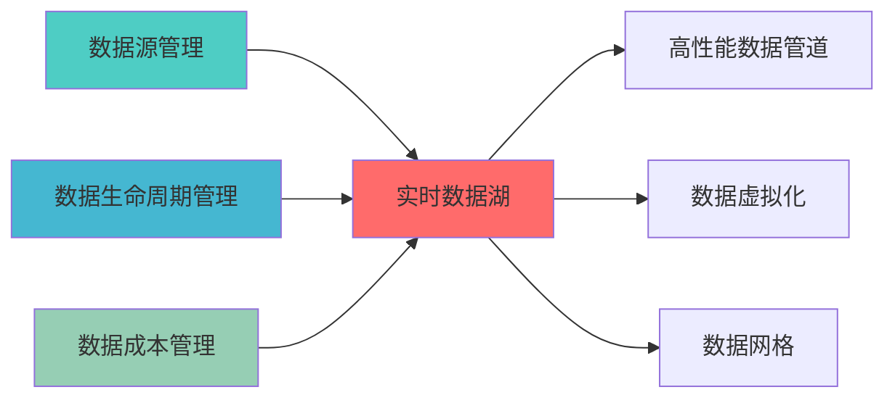

# 实时数据湖蓝图

> 清风量化系统 v5.3 - 实时数据湖详细设计
> **模块ID**: `REALTIME_DATA_LAKE_001`
> **实施周期**: Week 12-13（2周）
> **优先级**: P2（优化）
> **预期收益**: 统一数据存储，降低存储成本40%，提升查询性能60%

## 一、设计背景与目标

### 1.1 业务需求

**当前痛点**:
- 数据存储分散，缺少统一数据湖
- 历史数据查询性能差
- 数据版本管理困难
- 存储成本高

**业务目标**:
- 建立统一的实时数据湖
- 支持高效的历史数据查询
- 实现数据版本控制
- 降低存储成本

### 1.2 技术目标

| 指标 | 目标值 | 说明 |
|------|--------|------|
| **存储容量** | ≥10TB | 支持至少10TB数据存储 |
| **查询性能** | <10秒 | 历史数据查询响应<10秒 |
| **数据压缩率** | ≥60% | 数据压缩率≥60% |
| **并发查询** | ≥100 | 支持至少100个并发查询 |

---

## 📚 相关文档

### 上游依赖

| 文档名称 | module_id | 依赖类型 | 说明 |
|---------|-----------|---------|------|
| [数据源管理蓝图](./DATA_SOURCE_MANAGEMENT_BLUEPRINT.md) | DATA_SOURCE_MANAGEMENT_001 | 强依赖 | 提供数据源接入配置 |
| [数据生命周期管理蓝图](./DATA_LIFECYCLE_MANAGEMENT_BLUEPRINT.md) | DATA_LIFECYCLE_MANAGEMENT_001 | 强依赖 | 提供数据存储策略 |
| [数据成本管理蓝图](./DATA_COST_MANAGEMENT_BLUEPRINT.md) | DATA_COST_MANAGEMENT_001 | 中依赖 | 提供存储成本优化建议 |

### 下游依赖

| 文档名称 | module_id | 依赖类型 | 说明 |
|---------|-----------|---------|------|
| [高性能数据管道蓝图](./HIGH_PERFORMANCE_DATA_PIPELINE_BLUEPRINT.md) | HIGH_PERFORMANCE_DATA_PIPELINE_001 | 强依赖 | 提供数据存储服务 |
| [数据虚拟化蓝图](./DATA_VIRTUALIZATION_BLUEPRINT.md) | DATA_VIRTUALIZATION_001 | 强依赖 | 提供统一数据访问 |
| [数据网格蓝图](./DATA_MESH_BLUEPRINT.md) | DATA_MESH_001 | 中依赖 | 提供数据产品存储 |

### 技术依赖

| 技术组件 | 版本 | 用途 | 文档 |
|---------|------|------|------|
| **Delta Lake** | 3.0+ | 数据湖表格式 | [官方文档](https://delta.io/) |
| **Apache Iceberg** | 1.5+ | 表格式和数据版本 | [官方文档](https://iceberg.apache.org/) |
| **MinIO** | 2024+ | 对象存储 | [官方文档](https://min.io/) |

### 引用关系图



---

## 二、系统架构设计

### 2.1 整体架构图

```
┌─────────────────────────────────────────────────────────────┐
│                实时数据湖架构                                │
├─────────────────────────────────────────────────────────────┤
│                                                             │
│  ┌─────────────────────────────────────────────────────┐   │
│  │           数据接入层 (Data Ingestion)                │   │
│  │  ┌─────────────┐ ┌─────────────┐ ┌─────────────┐   │   │
│  │  │实时数据流   │ │批量数据导入 │ │文件上传     │   │   │
│  │  └─────────────┘ └─────────────┘ └─────────────┘   │   │
│  └─────────────────────────────────────────────────────┘   │
│                          ↓                                  │
│  ┌─────────────────────────────────────────────────────┐   │
│  │           存储层 (Storage Layer)                     │   │
│  │  ┌─────────────┐ ┌─────────────┐ ┌─────────────┐   │   │
│  │  │Delta Lake   │ │对象存储     │ │元数据存储   │   │   │
│  │  │(MinIO)      │ │(MinIO)      │ │(PostgreSQL) │   │   │
│  │  └─────────────┘ └─────────────┘ └─────────────┘   │   │
│  └─────────────────────────────────────────────────────┘   │
│                          ↓                                  │
│  ┌─────────────────────────────────────────────────────┐   │
│  │           查询层 (Query Layer)                       │   │
│  │  ┌─────────────┐ ┌─────────────┐ ┌─────────────┐   │   │
│  │  │SQL查询引擎  │ │时序查询     │ │全文检索     │   │   │
│  │  └─────────────┘ └─────────────┘ └─────────────┘   │   │
│  └─────────────────────────────────────────────────────┘   │
│                          ↓                                  │
│  ┌─────────────────────────────────────────────────────┐   │
│  │           服务层 (Service Layer)                     │   │
│  │  ┌─────────────┐ ┌─────────────┐ ┌─────────────┐   │   │
│  │  │数据写入API  │ │数据查询API  │ │版本管理API  │   │   │
│  │  └─────────────┘ └─────────────┘ └─────────────┘   │   │
│  └─────────────────────────────────────────────────────┘   │
│                                                             │
└─────────────────────────────────────────────────────────────┘
```

### 2.2 技术选型

| 组件 | 技术方案 | 版本要求 | 选型理由 |
|------|---------|---------|---------|
| **数据湖格式** | Delta Lake | 3.0.0+ | ACID事务支持 |
| **对象存储** | MinIO | RELEASE.2024-01+ | S3兼容，高性能 |
| **查询引擎** | Trino | 435+ | 分布式SQL查询 |
| **元数据** | PostgreSQL | 15.0+ | 可靠的元数据存储 |

---

## 三、核心模块设计

### 3.1 数据湖管理器 (DataLakeManager)

```python
from delta.tables import DeltaTable
from pyspark.sql import SparkSession
from typing import Dict, List, Any
import pandas as pd

class DataLakeManager:
    """数据湖管理器"""
    
    def __init__(self, spark: SparkSession, lake_path: str):
        self.spark = spark
        self.lake_path = lake_path
    
    def create_table(self, table_name: str, schema: Dict[str, str],
                     partition_columns: List[str] = None):
        """创建数据湖表"""
        table_path = f"{self.lake_path}/{table_name}"
        
        df = self.spark.createDataFrame([], schema)
        
        writer = df.write.format("delta").mode("overwrite")
        
        if partition_columns:
            writer = writer.partitionBy(*partition_columns)
        
        writer.save(table_path)
    
    def write_data(self, table_name: str, df: pd.DataFrame,
                   mode: str = "append"):
        """写入数据"""
        table_path = f"{self.lake_path}/{table_name}"
        
        spark_df = self.spark.createDataFrame(df)
        
        spark_df.write.format("delta").mode(mode).save(table_path)
    
    def read_data(self, table_name: str, 
                  filters: Dict[str, Any] = None) -> pd.DataFrame:
        """读取数据"""
        table_path = f"{self.lake_path}/{table_name}"
        
        delta_table = DeltaTable.forPath(self.spark, table_path)
        
        df = delta_table.toDF()
        
        if filters:
            for column, value in filters.items():
                df = df.filter(df[column] == value)
        
        return df.toPandas()
    
    def get_table_history(self, table_name: str) -> List[Dict]:
        """获取表历史版本"""
        table_path = f"{self.lake_path}/{table_name}"
        
        delta_table = DeltaTable.forPath(self.spark, table_path)
        
        history = delta_table.history()
        
        return history.toPandas().to_dict('records')
    
    def restore_table_version(self, table_name: str, version: int):
        """恢复表到指定版本"""
        table_path = f"{self.lake_path}/{table_name}"
        
        delta_table = DeltaTable.forPath(self.spark, table_path)
        
        delta_table.restoreToVersion(version)
```

### 3.2 查询优化器 (QueryOptimizer)

```python
from typing import Dict, List, Any
import pandas as pd

class QueryOptimizer:
    """查询优化器"""
    
    def __init__(self, data_lake_manager: DataLakeManager):
        self.data_lake = data_lake_manager
    
    def optimize_time_range_query(self, table_name: str,
                                   start_time: str,
                                   end_time: str,
                                   columns: List[str] = None) -> pd.DataFrame:
        """优化时间范围查询"""
        spark = self.data_lake.spark
        table_path = f"{self.data_lake.lake_path}/{table_name}"
        
        query = f"""
        SELECT {', '.join(columns) if columns else '*'}
        FROM delta.`{table_path}`
        WHERE timestamp BETWEEN '{start_time}' AND '{end_time}'
        """
        
        return spark.sql(query).toPandas()
    
    def optimize_partition_query(self, table_name: str,
                                  partition_filters: Dict[str, Any]) -> pd.DataFrame:
        """优化分区查询"""
        spark = self.data_lake.spark
        table_path = f"{self.data_lake.lake_path}/{table_name}"
        
        where_clauses = [f"{k} = '{v}'" for k, v in partition_filters.items()]
        where_clause = " AND ".join(where_clauses)
        
        query = f"""
        SELECT *
        FROM delta.`{table_path}`
        WHERE {where_clause}
        """
        
        return spark.sql(query).toPandas()
```

---

## 四、接口设计

### 4.1 RESTful API

#### 4.1.1 写入数据

```http
POST /api/v1/datalake/write
```

**请求示例**:
```json
{
  "table_name": "stock_prices",
  "data": [
    {"symbol": "AAPL", "price": 150.0, "timestamp": "2026-04-06T10:00:00Z"}
  ],
  "mode": "append"
}
```

#### 4.1.2 查询数据

```http
POST /api/v1/datalake/query
```

**请求示例**:
```json
{
  "table_name": "stock_prices",
  "filters": {
    "symbol": "AAPL",
    "start_time": "2026-04-01",
    "end_time": "2026-04-06"
  }
}
```

---

## 五、部署架构

```yaml
version: '3.8'
services:
  minio:
    image: minio/minio:latest
    command: server /data --console-address ":9001"
    ports:
      - "9000:9000"
      - "9001:9001"
    environment:
      - MINIO_ROOT_USER=admin
      - MINIO_ROOT_PASSWORD=password
    volumes:
      - minio-data:/data
  
  spark:
    image: bitnami/spark:latest
    ports:
      - "8080:8080"
    environment:
      - SPARK_MODE=master

volumes:
  minio-data:
```

---

## 六、监控指标

| 指标名称 | 指标类型 | 说明 |
|---------|---------|------|
| `datalake_storage_bytes` | Gauge | 存储使用量 |
| `datalake_query_duration_seconds` | Histogram | 查询延迟 |
| `datalake_write_operations_total` | Counter | 写入操作数 |
| `datalake_compression_ratio` | Gauge | 压缩率 |

---

## 七、实施计划

| 阶段 | 任务 | 预计时间 |
|------|------|---------|
| **阶段1** | 搭建MinIO存储 | 2天 |
| **阶段2** | 配置Delta Lake | 3天 |
| **阶段3** | 开发数据管理API | 4天 |
| **阶段4** | 性能优化和测试 | 3天 |

---

## 八、相关文档

- [数据血缘追踪蓝图](./DATA_LINEAGE_TRACKING_BLUEPRINT.md)
- [数据虚拟化蓝图](./DATA_VIRTUALIZATION_BLUEPRINT.md)
- [数据网格蓝图](./DATA_MESH_BLUEPRINT.md)

---

**文档版本**: v1.0.0 | **创建日期**: 2026-04-06 | **维护者**: 首席蓝图架构师
