---
responsibility:
  - 风险归因
  - 风险分解
  - 风险来源分析
  - 风险贡献åº?

module_id: RISK_ATTRIBUTION_SYSTEM_001
version: 1.0.0
status: Active
created_date: 2026-04-07
last_updated: 2026-04-07
owner: 实施团队
standard_type: 专业量化机构蓝图
applicable_scope: Layer 7 风险管理å±?
compliance_level: 专业标准
layer: Layer 5.3 (风险管理)
---

# 风险归因系统蓝图

## 核心定位

负责风险归因分析，分解投资组合风险来源，量化各因子和持仓对风险的贡献，支持风险管理决策。


> **核心职责**: 多维度风险分解与归因分析
> **职责边界**: 
> - âœ?本文档负责：风险分解、风险归因、风险因子识åˆ?
> - â?本文档不负责：因子计算（由因子模块负责）


## 设计目标

### 主要目标

1. **功能完整性**: 确保RISK ATTRIBUTION SYSTEM功能完整，满足业务需求
2. **性能优化**: 提升系统性能，降低资源消耗
3. **可维护性**: 提高代码质量，便于后续维护
4. **可扩展性**: 支持功能扩展，适应业务变化

### 质量目标

- 代码覆盖率: ≥80%
- 性能指标: 满足设计要求
- 文档完整性: 100%


## 核心功能

### 功能清单

1. **数据管理**: 提供数据存储、查询、更新功能
2. **业务逻辑**: 实现核心业务逻辑处理
3. **接口服务**: 提供标准化的API接口
4. **监控告警**: 实时监控系统状态

### 功能特性

- 高可用性设计
- 自动故障恢复
- 灵活配置管理


## 实现方案

### 技术架构

采用RISK ATTRIBUTION SYSTEM化设计，分层架构实现。

### 关键技术

- 数据处理: 使用高效的数据处理框架
- 接口实现: RESTful API设计
- 性能优化: 缓存、异步处理

### 实施步骤

1. 需求分析与设计
2. 核心功能开发
3. 测试与优化
4. 部署与监控


## 1. 概述

### 1.1 设计背景与业务目?
**业务需?*?- 当前系统仅有绩效归因（在Layer 7），缺乏风险归因
- 无法分解组合风险来源（因子风险、行业风险、特质风险）
- 无法识别风险驱动因素，导致风险管理缺乏针?- 无法评估风险预算执行情况

**技术痛?*?- 无多维度风险归因能力
- 无风险分解与归因报告生成
- 无风险预算执行监?- 无风险贡献度分析

**预期?*?- 风险透明度：提升60%
- 风险管理精细化：提升40%
- 风险决策支持：新增能?- 为Two Sigma模式提供核心能力支撑

### 1.2 技术定位与架构层归?
**Layer定位**: Layer 6 - 组合优化层（风险管理子层?
**模块类别**: 核心模块（P1级）

**架构角色**: 
- 作为Two Sigma模式的核心组件，提供多维度风险归?- 作为风险管理的分析工具，识别风险驱动因素
- 作为风险预算的监控工具，评估风险预算执行情况

### 1.3 核心功能清单

1. **因子风险归因**: 分解因子风险贡献
2. **行业风险归因**: 分解行业风险贡献
3. **资产风险归因**: 分解资产风险贡献
4. **风险预算执行监控**: 监控风险预算执行情况
5. **风险归因报告生成**: 生成可视化归因报?
---

## 2. 架构设计

### 2.1 系统架构?
```
┌─────────────────────────────────────────────────────────────────??                   风险归因系统架构                              ?├─────────────────────────────────────────────────────────────────??                                                                ?? ┌──────────────────────────────────────────────────────────? ?? ?             输入?                                       ? ?? ? ┌──────────────────────? ┌──────────────────────?    ? ?? ? ?组合数据              ? ?风险模型              ?    ? ?? ? ?- 组合权重            ? ?- 因子载荷            ?    ? ?? ? ?- 基准权重            ? ?- 因子协方?         ?    ? ?? ? ?- 历史收益            ? ?- 特质风险            ?    ? ?? ? └──────────────────────? └──────────────────────?    ? ?? └──────────────────────────────────────────────────────────? ??                         ?                                     ?? ┌──────────────────────────────────────────────────────────? ?? ?             风险分解?                                   ? ?? ? ┌────────────────────────────────────────────────────? ? ?? ? ? Risk Decomposition Engine                         ? ? ?? ? ? - 因子风险分解                                     ? ? ?? ? ? - 行业风险分解                                     ? ? ?? ? ? - 资产风险分解                                     ? ? ?? ? └────────────────────────────────────────────────────? ? ?? └──────────────────────────────────────────────────────────? ??                         ?                                     ?? ┌──────────────────────────────────────────────────────────? ?? ?             归因分析?                                   ? ?? ? ┌──────────? ┌──────────? ┌──────────?              ? ?? ? ?因子归因 ? ?行业归因 ? ?资产归因 ?              ? ?? ? ?         ? ?         ? ?         ?              ? ?? ? └──────────? └──────────? └──────────?              ? ?? └──────────────────────────────────────────────────────────? ??                         ?                                     ?? ┌──────────────────────────────────────────────────────────? ?? ?             报告生成?                                   ? ?? ? ┌──────────? ┌──────────? ┌──────────?              ? ?? ? ?归因报告 ? ?可视?  ? ?预警信号 ?              ? ?? ? ?         ? ?图表     ? ?         ?              ? ?? ? └──────────? └──────────? └──────────?              ? ?? └──────────────────────────────────────────────────────────? ?└─────────────────────────────────────────────────────────────────?```

### 2.2 核心数据?
```
组合数据 + 风险模型
    ?风险分解（因?行业/资产?    ?归因分析（贡献度计算?    ?风险预算执行监控
    ?输出：归因报告、可视化图表、预警信?```

---

## 3. 核心模块设计

### 3.1 风险归因系统核心类（RiskAttributionSystem?
```python
class RiskAttributionSystem:
    """
    风险归因系统核心?    
    索引: RISK_ATTRIBUTION_001-M01
    职责: 多维度风险分解与归因分析
    输入: 组合数据、风险模?    输出: 归因报告、可视化图表
    """
    
    def __init__(self, config: AttributionConfig):
        self.config = config
        self.factor_attributor = FactorRiskAttributor(config.factor_config)
        self.industry_attributor = IndustryRiskAttributor(config.industry_config)
        self.asset_attributor = AssetRiskAttributor(config.asset_config)
        self.report_generator = AttributionReportGenerator()
        
    def attribute_risk(self,
                      portfolio_weights: pd.Series,
                      benchmark_weights: Optional[pd.Series],
                      barra_model: BarraRiskModel) -> AttributionResult:
        """
        执行风险归因
        
        Args:
            portfolio_weights: 组合权重
            benchmark_weights: 基准权重（可选）
            barra_model: Barra风险模型
            
        Returns:
            AttributionResult: 归因结果
        """
        # 1. 因子风险归因
        factor_attribution = self.factor_attributor.attribute(
            portfolio_weights, benchmark_weights, barra_model
        )
        
        # 2. 行业风险归因
        industry_attribution = self.industry_attributor.attribute(
            portfolio_weights, benchmark_weights, barra_model
        )
        
        # 3. 资产风险归因
        asset_attribution = self.asset_attributor.attribute(
            portfolio_weights, benchmark_weights, barra_model
        )
        
        # 4. 汇总归因结?        total_attribution = self._aggregate_attribution(
            factor_attribution, industry_attribution, asset_attribution
        )
        
        return AttributionResult(
            factor_attribution=factor_attribution,
            industry_attribution=industry_attribution,
            asset_attribution=asset_attribution,
            total_attribution=total_attribution,
            timestamp=datetime.now()
        )
    
    def monitor_risk_budget(self,
                           portfolio_weights: pd.Series,
                           risk_budget: RiskBudgetAllocation,
                           barra_model: BarraRiskModel) -> RiskBudgetMonitorResult:
        """
        监控风险预算执行情况
        
        Args:
            portfolio_weights: 组合权重
            risk_budget: 风险预算分配
            barra_model: Barra风险模型
            
        Returns:
            RiskBudgetMonitorResult: 风险预算监控结果
        """
        # 1. 计算实际风险使用
        risk_decomposition = barra_model.decompose_risk(portfolio_weights)
        
        # 2. 对比风险预算
        budget_utilization = self._calculate_budget_utilization(
            risk_decomposition, risk_budget
        )
        
        # 3. 识别超预算风?        over_budget_risks = self._identify_over_budget(budget_utilization)
        
        # 4. 生成预警信号
        alerts = self._generate_alerts(over_budget_risks)
        
        return RiskBudgetMonitorResult(
            budget_utilization=budget_utilization,
            over_budget_risks=over_budget_risks,
            alerts=alerts,
            timestamp=datetime.now()
        )
    
    def generate_report(self,
                       attribution_result: AttributionResult,
                       output_format: str = 'html') -> str:
        """
        生成归因报告
        
        Args:
            attribution_result: 归因结果
            output_format: 输出格式?html', 'pdf', 'markdown'?            
        Returns:
            str: 报告文件路径
        """
        return self.report_generator.generate(
            attribution_result, output_format
        )
    
    def _aggregate_attribution(self,
                               factor_attr: pd.DataFrame,
                               industry_attr: pd.DataFrame,
                               asset_attr: pd.DataFrame) -> pd.DataFrame:
        """汇总归因结?""
        total = pd.concat([
            factor_attr.sum().to_frame('Factor'),
            industry_attr.sum().to_frame('Industry'),
            asset_attr.sum().to_frame('Asset')
        ], axis=1)
        
        return total
```

### 3.2 因子风险归因器（FactorRiskAttributor?
```python
class FactorRiskAttributor:
    """
    因子风险归因?    
    索引: RISK_ATTRIBUTION_001-M02
    职责: 分解因子风险贡献
    """
    
    def __init__(self, config: FactorAttributionConfig):
        self.config = config
        
    def attribute(self,
                 portfolio_weights: pd.Series,
                 benchmark_weights: Optional[pd.Series],
                 barra_model: BarraRiskModel) -> pd.DataFrame:
        """
        因子风险归因
        
        Args:
            portfolio_weights: 组合权重
            benchmark_weights: 基准权重
            barra_model: Barra风险模型
            
        Returns:
            pd.DataFrame: 因子风险归因结果
        """
        # 1. 计算组合因子暴露
        portfolio_exposure = barra_model.calculate_factor_exposure(portfolio_weights)
        
        # 2. 计算基准因子暴露（如有）
        if benchmark_weights is not None:
            benchmark_exposure = barra_model.calculate_factor_exposure(benchmark_weights)
            active_exposure = portfolio_exposure - benchmark_exposure
        else:
            benchmark_exposure = None
            active_exposure = portfolio_exposure
        
        # 3. 计算因子风险贡献
        factor_risk_contribution = self._calculate_factor_risk_contribution(
            portfolio_exposure, barra_model.factor_covariance
        )
        
        # 4. 计算主动风险归因（如有基准）
        if benchmark_weights is not None:
            active_risk_contribution = self._calculate_active_risk_contribution(
                active_exposure, barra_model.factor_covariance
            )
        else:
            active_risk_contribution = None
        
        # 5. 构建归因?        attribution = pd.DataFrame({
            'Portfolio_Exposure': portfolio_exposure,
            'Benchmark_Exposure': benchmark_exposure if benchmark_weights is not None else 0,
            'Active_Exposure': active_exposure if benchmark_weights is not None else portfolio_exposure,
            'Risk_Contribution': factor_risk_contribution,
            'Active_Risk_Contribution': active_risk_contribution if active_risk_contribution is not None else factor_risk_contribution
        })
        
        return attribution
    
    def _calculate_factor_risk_contribution(self,
                                           factor_exposure: pd.Series,
                                           factor_covariance: pd.DataFrame) -> pd.Series:
        """
        计算因子风险贡献
        
        使用边际风险贡献法：
        MRC_i = f_i * (F * f)_i / σ_p
        """
        # 计算组合风险
        F_f = factor_covariance @ factor_exposure
        portfolio_risk = np.sqrt(factor_exposure @ F_f)
        
        # 计算边际风险贡献
        marginal_risk_contribution = factor_exposure * F_f / portfolio_risk
        
        # 计算风险贡献百分?        risk_contribution = marginal_risk_contribution / portfolio_risk
        
        return risk_contribution
    
    def _calculate_active_risk_contribution(self,
                                           active_exposure: pd.Series,
                                           factor_covariance: pd.DataFrame) -> pd.Series:
        """计算主动风险贡献"""
        return self._calculate_factor_risk_contribution(active_exposure, factor_covariance)
```

### 3.3 行业风险归因器（IndustryRiskAttributor?
```python
class IndustryRiskAttributor:
    """
    行业风险归因?    
    索引: RISK_ATTRIBUTION_001-M03
    职责: 分解行业风险贡献
    """
    
    def __init__(self, config: IndustryAttributionConfig):
        self.config = config
        
    def attribute(self,
                 portfolio_weights: pd.Series,
                 benchmark_weights: Optional[pd.Series],
                 barra_model: BarraRiskModel) -> pd.DataFrame:
        """
        行业风险归因
        
        Args:
            portfolio_weights: 组合权重
            benchmark_weights: 基准权重
            barra_model: Barra风险模型
            
        Returns:
            pd.DataFrame: 行业风险归因结果
        """
        # 1. 获取行业因子暴露
        industry_factors = [f for f in barra_model.factor_loadings.columns 
                          if f.startswith('industry_')]
        
        portfolio_industry_exposure = barra_model.factor_loadings[industry_factors].T @ portfolio_weights
        
        # 2. 计算基准行业暴露（如有）
        if benchmark_weights is not None:
            benchmark_industry_exposure = barra_model.factor_loadings[industry_factors].T @ benchmark_weights
            active_industry_exposure = portfolio_industry_exposure - benchmark_industry_exposure
        else:
            benchmark_industry_exposure = None
            active_industry_exposure = portfolio_industry_exposure
        
        # 3. 计算行业风险贡献
        industry_covariance = barra_model.factor_covariance.loc[industry_factors, industry_factors]
        industry_risk_contribution = self._calculate_industry_risk_contribution(
            portfolio_industry_exposure, industry_covariance
        )
        
        # 4. 构建归因?        attribution = pd.DataFrame({
            'Portfolio_Weight': portfolio_industry_exposure,
            'Benchmark_Weight': benchmark_industry_exposure if benchmark_weights is not None else 0,
            'Active_Weight': active_industry_exposure,
            'Risk_Contribution': industry_risk_contribution
        })
        
        return attribution
    
    def _calculate_industry_risk_contribution(self,
                                             industry_exposure: pd.Series,
                                             industry_covariance: pd.DataFrame) -> pd.Series:
        """计算行业风险贡献"""
        # 类似因子风险贡献计算
        I_i = industry_covariance @ industry_exposure
        industry_risk = np.sqrt(industry_exposure @ I_i)
        
        risk_contribution = (industry_exposure * I_i) / industry_risk
        
        return risk_contribution
```

### 3.4 资产风险归因器（AssetRiskAttributor?
```python
class AssetRiskAttributor:
    """
    资产风险归因?    
    索引: RISK_ATTRIBUTION_001-M04
    职责: 分解资产风险贡献
    """
    
    def __init__(self, config: AssetAttributionConfig):
        self.config = config
        
    def attribute(self,
                 portfolio_weights: pd.Series,
                 benchmark_weights: Optional[pd.Series],
                 barra_model: BarraRiskModel) -> pd.DataFrame:
        """
        资产风险归因
        
        Args:
            portfolio_weights: 组合权重
            benchmark_weights: 基准权重
            barra_model: Barra风险模型
            
        Returns:
            pd.DataFrame: 资产风险归因结果
        """
        # 1. 计算资产风险贡献
        asset_risk_contribution = self._calculate_asset_risk_contribution(
            portfolio_weights, barra_model.asset_covariance
        )
        
        # 2. 计算主动权重（如有基准）
        if benchmark_weights is not None:
            active_weights = portfolio_weights - benchmark_weights
        else:
            active_weights = portfolio_weights
        
        # 3. 构建归因?        attribution = pd.DataFrame({
            'Portfolio_Weight': portfolio_weights,
            'Benchmark_Weight': benchmark_weights if benchmark_weights is not None else 0,
            'Active_Weight': active_weights,
            'Risk_Contribution': asset_risk_contribution
        })
        
        return attribution
    
    def _calculate_asset_risk_contribution(self,
                                          weights: pd.Series,
                                          asset_covariance: pd.DataFrame) -> pd.Series:
        """
        计算资产风险贡献
        
        使用边际风险贡献法：
        MRC_i = w_i * (Σ * w)_i / σ_p
        """
        # 计算组合风险
        Sigma_w = asset_covariance @ weights
        portfolio_risk = np.sqrt(weights @ Sigma_w)
        
        # 计算边际风险贡献
        marginal_risk_contribution = weights * Sigma_w / portfolio_risk
        
        # 计算风险贡献百分?        risk_contribution = marginal_risk_contribution / portfolio_risk
        
        return risk_contribution
```

### 3.5 归因报告生成器（AttributionReportGenerator?
```python
class AttributionReportGenerator:
    """
    归因报告生成?    
    索引: RISK_ATTRIBUTION_001-M05
    职责: 生成可视化归因报?    """
    
    def __init__(self):
        self.template_dir = 'templates/attribution/'
        
    def generate(self,
                attribution_result: AttributionResult,
                output_format: str = 'html') -> str:
        """
        生成归因报告
        
        Args:
            attribution_result: 归因结果
            output_format: 输出格式
            
        Returns:
            str: 报告文件路径
        """
        # 1. 生成可视化图?        charts = self._generate_charts(attribution_result)
        
        # 2. 生成报告内容
        report_content = self._generate_content(attribution_result, charts)
        
        # 3. 保存报告
        report_path = self._save_report(report_content, output_format)
        
        return report_path
    
    def _generate_charts(self, attribution_result: AttributionResult) -> Dict[str, str]:
        """生成可视化图?""
        charts = {}
        
        # 1. 因子风险贡献?        charts['factor_risk'] = self._plot_factor_risk_contribution(
            attribution_result.factor_attribution
        )
        
        # 2. 行业风险贡献?        charts['industry_risk'] = self._plot_industry_risk_contribution(
            attribution_result.industry_attribution
        )
        
        # 3. 资产风险贡献图（Top 20?        charts['asset_risk'] = self._plot_asset_risk_contribution(
            attribution_result.asset_attribution
        )
        
        return charts
    
    def _plot_factor_risk_contribution(self, factor_attr: pd.DataFrame) -> str:
        """绘制因子风险贡献?""
        import matplotlib.pyplot as plt
        
        fig, ax = plt.subplots(figsize=(12, 6))
        
        factor_attr['Risk_Contribution'].plot(kind='bar', ax=ax)
        ax.set_title('Factor Risk Contribution')
        ax.set_xlabel('Factor')
        ax.set_ylabel('Risk Contribution (%)')
        ax.grid(True, alpha=0.3)
        
        chart_path = 'output/factor_risk_contribution.png'
        plt.savefig(chart_path, dpi=150, bbox_inches='tight')
        plt.close()
        
        return chart_path
    
    def _plot_industry_risk_contribution(self, industry_attr: pd.DataFrame) -> str:
        """绘制行业风险贡献?""
        import matplotlib.pyplot as plt
        
        fig, ax = plt.subplots(figsize=(12, 6))
        
        industry_attr['Risk_Contribution'].plot(kind='bar', ax=ax)
        ax.set_title('Industry Risk Contribution')
        ax.set_xlabel('Industry')
        ax.set_ylabel('Risk Contribution (%)')
        ax.grid(True, alpha=0.3)
        
        chart_path = 'output/industry_risk_contribution.png'
        plt.savefig(chart_path, dpi=150, bbox_inches='tight')
        plt.close()
        
        return chart_path
    
    def _plot_asset_risk_contribution(self, asset_attr: pd.DataFrame) -> str:
        """绘制资产风险贡献图（Top 20?""
        import matplotlib.pyplot as plt
        
        # 取Top 20
        top_assets = asset_attr.nlargest(20, 'Risk_Contribution')
        
        fig, ax = plt.subplots(figsize=(12, 6))
        
        top_assets['Risk_Contribution'].plot(kind='bar', ax=ax)
        ax.set_title('Top 20 Asset Risk Contribution')
        ax.set_xlabel('Asset')
        ax.set_ylabel('Risk Contribution (%)')
        ax.grid(True, alpha=0.3)
        
        chart_path = 'output/asset_risk_contribution.png'
        plt.savefig(chart_path, dpi=150, bbox_inches='tight')
        plt.close()
        
        return chart_path
    
    def _generate_content(self,
                         attribution_result: AttributionResult,
                         charts: Dict[str, str]) -> str:
        """生成报告内容"""
        content = f"""
# Risk Attribution Report
> **核心职责**: Risk Attribution System蓝图设计
> **职责边界**: 
> - âœ?本文档负责：Risk Attribution System蓝图设计相关内容
> - â?本文档不负责：其他模块内å®?


## 核心职责

风险归因系统，负责风险来源的分析和归å›?


---

## 📋 概述

本文档定义了RISK ATTRIBUTION SYSTEM的核心功能和技术实现ã€?


> **核心定位**: Risk Attribution Report的核心功能实çŽ?


Generated: {datetime.now().strftime('%Y-%m-%d %H:%M:%S')}

## 1. Executive Summary

- **Total Portfolio Risk**: {attribution_result.total_attribution.sum().sum():.2%}
- **Factor Risk Ratio**: {attribution_result.factor_attribution['Risk_Contribution'].sum():.2%}
- **Industry Risk Ratio**: {attribution_result.industry_attribution['Risk_Contribution'].sum():.2%}

## 2. Factor Risk Attribution

!Factor Risk Contribution

{attribution_result.factor_attribution.to_markdown()}

## 3. Industry Risk Attribution

!Industry Risk Contribution

{attribution_result.industry_attribution.to_markdown()}

## 4. Asset Risk Attribution (Top 20)

!Asset Risk Contribution

{attribution_result.asset_attribution.nlargest(20, 'Risk_Contribution').to_markdown()}
"""
        return content
    
    def _save_report(self, content: str, output_format: str) -> str:
        """保存报告"""
        report_path = f'output/risk_attribution_report.{output_format}'
        
        with open(report_path, 'w', encoding='utf-8') as f:
            f.write(content)
        
        return report_path
```

### 3.6 配置类定?
```python
@dataclass
class AttributionConfig:
    """风险归因配置"""
    factor_config: FactorAttributionConfig
    industry_config: IndustryAttributionConfig
    asset_config: AssetAttributionConfig
    
@dataclass
class FactorAttributionConfig:
    """因子归因配置"""
    include_style_factors: bool = True
    include_industry_factors: bool = True
    
@dataclass
class IndustryAttributionConfig:
    """行业归因配置"""
    industry_classification: str = 'gics'  # 'gics', 'sw', 'zz'
    
@dataclass
class AssetAttributionConfig:
    """资产归因配置"""
    top_n_assets: int = 20  # 显示Top N资产
```

---

## 4. 数据模型定义

### 4.1 输入数据模型

```python
@dataclass
class PortfolioData:
    """组合数据"""
    weights: pd.Series  # 组合权重
    benchmark_weights: Optional[pd.Series]  # 基准权重
    returns: pd.DataFrame  # 历史收益?```

### 4.2 输出数据模型

```python
@dataclass
class AttributionResult:
    """归因结果"""
    factor_attribution: pd.DataFrame  # 因子归因
    industry_attribution: pd.DataFrame  # 行业归因
    asset_attribution: pd.DataFrame  # 资产归因
    total_attribution: pd.DataFrame  # 总归?    timestamp: datetime
    
@dataclass
class RiskBudgetMonitorResult:
    """风险预算监控结果"""
    budget_utilization: pd.DataFrame  # 预算使用情况
    over_budget_risks: List[Dict]  # 超预算风?    alerts: List[Dict]  # 预警信号
    timestamp: datetime
```

---

## 5. 集成方案

### 5.1 与Barra风险模型集成

```python
class BarraRiskModel:
    """Barra风险模型（集成风险归因）"""
    
    def __init__(self):
        self.risk_attribution_system = RiskAttributionSystem(AttributionConfig())
        
    def attribute_risk(self,
                      portfolio_weights: pd.Series,
                      benchmark_weights: Optional[pd.Series] = None) -> AttributionResult:
        """风险归因"""
        return self.risk_attribution_system.attribute_risk(
            portfolio_weights, benchmark_weights, self
        )
```

### 5.2 与组合优化器集成

```python
class PortfolioOptimizer:
    """组合优化器（集成风险归因?""
    
    def __init__(self, 
                 barra_model: BarraRiskModel,
                 attribution_system: RiskAttributionSystem):
        self.barra_model = barra_model
        self.attribution_system = attribution_system
        
    def optimize_and_attribute(self,
                              expected_returns: pd.Series,
                              constraints: List[Constraint]) -> Tuple[pd.Series, AttributionResult]:
        """优化并归?""
        # 1. 优化组合
        optimal_weights = self.optimize(expected_returns, constraints)
        
        # 2. 风险归因
        attribution = self.attribution_system.attribute_risk(
            optimal_weights, None, self.barra_model
        )
        
        return optimal_weights, attribution
```

---

## 6. 实施路线?
### 6.1 开发阶段（2周）

**Week 1: 核心模块开?*
- Day 1-2: 因子风险归因?- Day 3-4: 行业风险归因?- Day 5: 资产风险归因?
**Week 2: 集成与测?*
- Day 1-2: 归因报告生成?- Day 3: 与Barra模型集成
- Day 4: 测试与优?- Day 5: 文档编写

### 6.2 里程?
| 里程?| 时间 | 交付?| 验收标准 |
|--------|------|--------|----------|
| **M1: 因子归因完成** | Day 2 | 因子风险归因?| 归因正确 |
| **M2: 行业归因完成** | Day 4 | 行业风险归因?| 归因正确 |
| **M3: 资产归因完成** | Day 5 | 资产风险归因?| 归因正确 |
| **M4: 报告生成完成** | Day 7 | 归因报告生成?| 报告完整 |
| **M5: 测试通过** | Day 10 | 测试报告 | 所有测试通过 |

---

## 7. 预期收益评估

### 7.1 定量收益

| 指标 | 当前水平 | 目标水平 | 提升幅度 |
|------|---------|---------|---------|
| **风险透明?* | 40% | 90% | +50% |
| **风险管理精细?* | 60% | 90% | +30% |
| **风险决策支持** | ?| ?| 新增能力 |
| **Two Sigma模式完整?* | 69% | 85% | +16% |

### 7.2 定性收?
- ?实现Two Sigma核心能力：风险归?- ?多维度风险分解（因子/行业/资产?- ?风险预算执行监控
- ?可视化归因报?- ?风险预警机制

---

## 8. 技术栈选择

### 8.1 核心依赖?
| 库名 | 版本 | ?| 必要?|
|------|------|------|--------|
| **pandas** | ?.5 | 数据处理 | 必需 |
| **numpy** | ?.21 | 数值计?| 必需 |
| **matplotlib** | ?.5 | 可视?| 必需 |
| **jinja2** | ?.0 | 报告模板 | 必需 |

### 8.2 安装命令

```bash
pip install pandas>=1.5
pip install numpy>=1.21
pip install matplotlib>=3.5
pip install jinja2>=3.0
```

---

## 9. 风险评估

### 9.1 技术风?
| 风险?| 风险等级 | 缓解措施 |
|--------|---------|---------|
| **归因计算精度** | ?| 使用标准归因方法 |
| **报告生成性能** | ?| 使用模板缓存 |
| **可视化质?* | ?| 使用成熟绘图?|

### 9.2 实施风险

| 风险?| 风险等级 | 缓解措施 |
|--------|---------|---------|
| **开发时间超?* | ?| 分阶段实?|
| **集成困难** | ?| 充分测试 |
| **性能不达?* | ?| 性能优化 |

---

## 10. 文档治理

### 10.1 System_Manifest.md索引

```markdown
#### Layer 6: 组合优化?
##### 6.6 风险归因系统
- **模块ID**: RISK_ATTRIBUTION_001
- **蓝图文档**: RISK_ATTRIBUTION_SYSTEM_BLUEPRINT.md
- **技术规格书**: 待创?- **职责**: 多维度风险归因、风险预算监控、归因报告生?- **?*: 设计阶段
```

### 10.2 模块职责边界

| 模块 | 职责 | 边界 |
|------|------|------|
| **风险归因系统** | 风险分解、归因分析、报告生?| **归因层面** |
| **Barra风险模型** | 风险模型、风险分?| 提供风险模型数据 |
| **组合优化?* | 组合权重优化 | 使用归因结果优化 |

---

## 附录

### A. 参考文?
1. **风险归因理论**:
   - Grinold, R.C. and Kahn, R.N. (2000). "Active Portfolio Management"
   - Menchero, J. (2010). "The Characteristics of Factor Attribution"

2. **Brinson模型**:
   - Brinson, G.P., Hood, L.R., and Beebower, G.L. (1986). "Determinants of Portfolio Performance"

3. **开源项目参?*:
   - pyfolio: https://github.com/quantopian/pyfolio
   - empyrical: https://github.com/quantopian/empyrical

### B. 术语?
| 术语 | 定义 | 上下?|
|------|------|--------|
| **风险归因** | 分析风险来源 | 风险分解 |
| **边际风险贡献** | 单位权重增加带来的风险增?| 风险度量 |
| **主动风险** | 组合相对基准的风?| 相对风险 |
| **风险预算** | 分配给各因子的风险限?| 风险管理 |

---

**蓝图版本**: v1.0 | **创建日期**: 2026-04-03 | **?*: Final | **下一?*: 技术规格书编写

## 📚 相关文档

### 上游依赖

| 文档名称 | module_id | 依赖类型 | 说明 |
|---------|-----------|---------|------|
| [BARRA风险模型蓝图](./BARRA_RISK_MODEL_BLUEPRINT.md) | BARRA_RISK_MODEL_001 | 强依èµ?| 提供因子风险模型 |
| [VaR/ES监控蓝图](./VAR_ES_MONITORING_BLUEPRINT.md) | VAR_ES_MONITORING_001 | 强依èµ?| 提供VaR/ES指标 |
| [数据质量监控蓝图](./DATA_QUALITY_MONITORING_BLUEPRINT.md) | DATA_QUALITY_MONITORING_001 | 中依èµ?| 提供数据质量指标 |

### 下游依赖

| 文档名称 | module_id | 依赖类型 | 说明 |
|---------|-----------|---------|------|
| [组合绩效评估蓝图](./PORTFOLIO_PERFORMANCE_EVALUATION_BLUEPRINT.md) | PORTFOLIO_PERFORMANCE_EVALUATION_001 | 强依èµ?| 组合绩效评估 |
| [风险贡献分析蓝图](./RISK_CONTRIBUTION_ANALYSIS_BLUEPRINT.md) | RISK_CONTRIBUTION_ANALYSIS_001 | 中依èµ?| 风险贡献分析 |
| [压力测试系统蓝图](./STRESS_TESTING_SYSTEM_BLUEPRINT.md) | STRESS_TESTING_SYSTEM_001 | 中依èµ?| 压力测试 |

### 技术依èµ?

| 技术组ä»?| 版本 | 用é€?| 文档 |
|---------|------|------|------|
| **NumPy** | 1.24+ | 数值计ç®?| [官方文档](https://numpy.org/) |
| **Pandas** | 2.0+ | 数据处理 | [官方文档](https://pandas.pydata.org/) |
| **SciPy** | 1.10+ | 科学计算 | [官方文档](https://scipy.org/) |

### 引用关系å›?

```mermaid
graph LR
    A[BARRA风险模型] --> B[风险归因系统]
    C[VaR/ES监控] --> B
    D[数据质量监控] --> B
    
    B --> E[组合绩效评估]
    B --> F[风险贡献分析]
    B --> G[压力测试系统]
    
    style B fill:#ff6b6b
    style A fill:#4ecdc4
    style C fill:#45b7d1
```



---

## 变更历史

| 版本 | 日期 | 变更内容 | 变更äº?|
|------|------|----------|--------|
| v1.0.0 | 2026-04-03 | 初始版本创建 | 组合优化层负责人 |
| v1.0.1 | 2026-04-06 | 补充YAML头部字段和变更历å?| 审计系统 |

---

**蓝图版本**: v1.0.1 | **创建日期**: 2026-04-03 | **状æ€?*: Active
