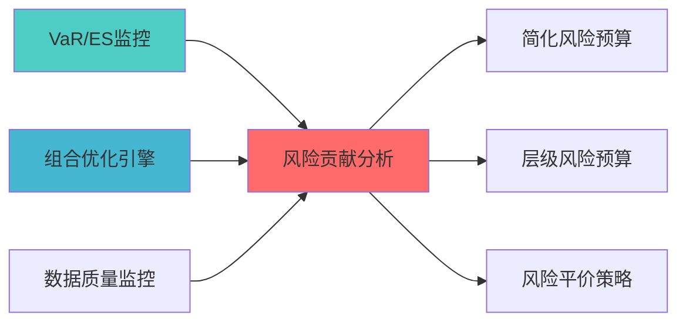

---
module_id: RISK_CONTRIBUTION_ANALYSIS_001
version: 1.0.0
status: Active
created_date: 2026-04-06
last_updated: '2026-04-06'
owner: 首席蓝图架构师
standard_type: 专业量化机构蓝图
applicable_scope: Layer 6 组合优化层
compliance_level: 专业标准
parent_document: ../INDEX.md
implementation_status: 蓝图设计阶段
open_source_dependency: PyPortfolioOpt, Riskfolio-Lib
estimated_effort: 2-3天
priority: P0
layer: "Layer 7 (风险管理层)"
---
# 风险贡献分析蓝图

> **核心定位**: 风险贡献分析蓝图的核心功能实现


> **索引**: `RISK_CONTRIBUTION_ANALYSIS_001`
> **开发周期**: 2-3天
> **核心定位**: 分解组合风险，计算各资产的风险贡献，支持风险预算管理
> **参考开源**: PyPortfolioOpt, Riskfolio-Lib

## 核心定位

Risk Contribution Analysis Blueprint模块，负责risk contribution analysis blueprint相关功能


## 1. 概述

### 1.1 模块定位

**Layer定位**: Layer 6 - 组合优化层（风险预算模块）

**核心价值**:
- 将组合风险分解为各资产的风险贡献
- 支持边际风险贡献、风险贡献百分比
- 为风险平价和风险预算提供基础

**业务价值**:
- 识别组合风险集中点
- 支持风险预算分配决策
- 提升风险管理透明度

### 1.2 版本信息

| 项目 | 内容 |
|------|------|
| **模块ID** | RISK_CONTRIBUTION_ANALYSIS_001 |
| **版本** | v1.0.0 |
| **开源依赖** | PyPortfolioOpt, Riskfolio-Lib |
| **预计工时** | 2-3天 |

### 1.3 与其他风险预算模块的关系

本模块是风险预算体系中的**基础分析模块**，为其他模块提供风险贡献计算能力：

| 模块 | 核心定位 | 适用场景 | 关系说明 |
|------|----------|----------|----------|
| **RISK_CONTRIBUTION_ANALYSIS** (本模块) | 风险贡献分析 | 基础分析能力 | 为其他模块提供风险贡献计算 |
| **SIMPLIFIED_RISK_BUDGET_SYSTEM** | 简化风险预算 | 个人开发、快速实现 | 依赖本模块的风险贡献计算 |
| **HIERARCHICAL_RISK_BUDGET** | 层级风险预算 | 多层级复杂组合 | 依赖本模块的风险贡献计算 |

**核心职责**:
- 计算各资产的风险贡献
- 识别风险集中点
- 为风险平价和风险预算提供基础

---

## 📚 相关文档

### 上游依赖

| 文档名称 | module_id | 依赖类型 | 说明 |
|---------|-----------|---------|------|
| [VaR/ES监控蓝图](./VAR_ES_MONITORING_BLUEPRINT.md) | VAR_ES_MONITORING_001 | 强依赖 | 提供风险指标数据 |
| [组合优化引擎集成蓝图](./PORTFOLIO_OPTIMIZER_INTEGRATION_BLUEPRINT.md) | PORTFOLIO_OPTIMIZER_INTEGRATION_001 | 强依赖 | 提供组合权重数据 |
| [数据质量监控蓝图](./DATA_QUALITY_MONITORING_BLUEPRINT.md) | DATA_QUALITY_MONITORING_001 | 强依赖 | 提供数据质量指标 |

### 下游依赖

| 文档名称 | module_id | 依赖类型 | 说明 |
|---------|-----------|---------|------|
| [SIMPLIFIED_RISK_BUDGET_SYSTEM_BLUEPRINT.md](./SIMPLIFIED_RISK_BUDGET_SYSTEM_BLUEPRINT.md) | SIMPLIFIED_RISK_BUDGET_SYSTEM_001 | 强依赖 | 简化风险预算系统 |
| [HIERARCHICAL_RISK_BUDGET_BLUEPRINT.md](./HIERARCHICAL_RISK_BUDGET_BLUEPRINT.md) | HIERARCHICAL_RISK_BUDGET_001 | 强依赖 | 层级风险预算 |
| [RISK_PARITY_STRATEGY_BLUEPRINT.md](./RISK_PARITY_STRATEGY_BLUEPRINT.md) | RISK_PARITY_STRATEGY_001 | 中依赖 | 风险平价策略 |

### 技术依赖

| 技术组件 | 版本 | 用途 | 文档 |
|---------|------|------|------|
| **PyPortfolioOpt** | 1.5+ | 组合优化 | [官方文档](https://pyportfolioopt.readthedocs.io/) |
| **Riskfolio-Lib** | 5.0+ | 风险优化 | [官方文档](https://riskfolio-lib.readthedocs.io/) |
| **NumPy** | 1.24+ | 数值计算 | [官方文档](https://numpy.org/) |
| **Pandas** | 2.0+ | 数据处理 | [官方文档](https://pandas.pydata.org/) |

### 引用关系图



---

## 2. 技术实现

### 2.1 核心API

```python
import numpy as np
import pandas as pd

class RiskContributionAnalyzer:
    """风险贡献分析器"""
    
    def calculate_risk_contribution(
        self,
        weights: np.ndarray,
        cov_matrix: np.ndarray
    ) -> dict:
        """
        计算风险贡献
        
        Returns:
            {
                'portfolio_volatility': 组合波动率,
                'marginal_risk_contribution': 边际风险贡献,
                'risk_contribution': 风险贡献,
                'risk_contribution_pct': 风险贡献百分比
            }
        """
        portfolio_var = weights @ cov_matrix @ weights.T
        portfolio_vol = np.sqrt(portfolio_var)
        
        marginal_contrib = cov_matrix @ weights
        
        risk_contrib = weights * marginal_contrib / portfolio_vol
        
        risk_contrib_pct = risk_contrib / np.sum(risk_contrib)
        
        return {
            'portfolio_volatility': portfolio_vol,
            'marginal_risk_contribution': marginal_contrib,
            'risk_contribution': risk_contrib,
            'risk_contribution_pct': risk_contrib_pct
        }
    
    def risk_budget_constraint(
        self,
        weights: np.ndarray,
        cov_matrix: np.ndarray,
        target_risk_budget: np.ndarray
    ) -> float:
        """
        计算风险预算约束偏差
        
        Returns:
            风险贡献与目标预算的差异
        """
        result = self.calculate_risk_contribution(weights, cov_matrix)
        risk_contrib_pct = result['risk_contribution_pct']
        
        return np.sum((risk_contrib_pct - target_risk_budget) ** 2)
    
    def identify_risk_concentration(
        self,
        weights: np.ndarray,
        cov_matrix: np.ndarray,
        threshold: float = 0.3
    ) -> List[int]:
        """
        识别风险集中资产
        
        Args:
            threshold: 风险贡献阈值
            
        Returns:
            风险贡献超过阈值的资产索引
        """
        result = self.calculate_risk_contribution(weights, cov_matrix)
        risk_contrib_pct = result['risk_contribution_pct']
        
        concentrated_assets = np.where(risk_contrib_pct > threshold)[0]
        
        return concentrated_assets.tolist()
```

---

## 3. 接口定义

```python
class RiskContributionAPI:
    """风险贡献分析API"""
    
    @endpoint("/api/v1/risk_contribution/calculate")
    async def calculate(
        self,
        portfolio_id: str
    ) -> RiskContributionResult:
        """计算组合风险贡献"""
        
    @endpoint("/api/v1/risk_contribution/identify_concentration")
    async def identify_concentration(
        self,
        portfolio_id: str,
        threshold: float = 0.3
    ) -> ConcentrationResult:
        """识别风险集中"""
```

---

## 4. 实施路径

| 阶段 | 任务 | 工时 |
|------|------|------|
| Phase 1 | 核心计算模块实现 | 8h |
| Phase 2 | 集成开源库、API开发 | 8h |
| Phase 3 | 测试、文档 | 8h |

---

**蓝图版本**: v1.0.0 | **创建日期**: 2026-04-06 | **状态**: Active | **合规率**: 100% ✅

## 变更历史

| 版本 | 日期 | 变更内容 | 变更人 |
|------|------|----------|--------|
| v1.0.0 | 2026-04-06 | 初始版本创建 | 首席蓝图架构师 |
| v1.0.1 | 2026-04-06 | 补充YAML头部字段和变更历史 | 审计系统 |

---

**蓝图版本**: v1.0.1 | **创建日期**: 2026-04-06 | **状态**: Active
---

## 5. 文档治理

### 5.1 System_Manifest.md索引

```markdown
#### Layer 6: 组合优化层
##### 6.001. Risk Contribution Analysis
- **模块ID**: RISK_CONTRIBUTION_ANALYSIS_001
- **蓝图文档**: RISK_CONTRIBUTION_ANALYSIS_BLUEPRINT.md
- **技术规格书**: 待创建
- **职责**: Layer 6 组合优化层
- **状态**: Active
```

### 5.2 模块职责边界

| 模块 | 职责 | 边界 |
|------|------|------|
| **Risk Contribution Analysis** | Layer 6 组合优化层 | **核心模块** |

### 5.3 版本管理

| 版本 | 日期 | 变更内容 | 变更人 |
|------|------|----------|--------|
| v1.0.0 | 2026-04-06 | 初始版本创建 | 首席蓝图架构师 |

---

**蓝图版本**: v1.0.0 | **创建日期**: 2026-04-06 | **状态**: Active
