---
responsibility:
  - 风险平价策略
  - 风险贡献均衡
  - 风险预算分配
  - 权重优化

module_id: RISK_PARITY_STRATEGY_001
version: 1.0.0
status: Active
created_date: 2026-04-07
last_updated: 2026-04-07
owner: 实施团队
standard_type: 专业量化机构蓝图
applicable_scope: Layer 6 组合优化å±?
compliance_level: 专业标准
layer: "Layer 6 (组合优化å±?"
---

# 风险平价策略蓝图

## 核心定位

负责风险平价策略，实现资产间风险贡献相等，优化投资组合风险分散效果，降低组合波动率。


> **核心职责**: 构建风险平价投资组合，实现风险均衡配ç½?
> **职责边界**: 
> - âœ?本文档负责：风险平价组合构建、风险贡献计ç®?
> - â?本文档不负责：因子计算（由因子模块负责）


## 1. 概述

### 1.1 模块定位与目æ ?

**Layer定位**: Layer 6 - 组合优化层（组合构建模块ï¼?

**核心价å€?*:
- 解决传统均值方差优化权重集中在少数资产的问é¢?
- 基于风险贡献分配权重，实现真正的分散åŒ?
- 不依赖预期收益率估计，仅基于风险特征
- 专业机构广泛使用的核心资产配置策ç•?

**业务价å€?*:
- 提升组合在不同市场环境下的稳健æ€?
- 降低单一资产风险暴露
- 适合长期资产配置和养老基金管ç?
- 个人投资者实现专业级资产配置

### 1.2 版本信息

| 项目 | 内容 |
|------|------|
| **模块ID** | RISK_PARITY_STRATEGY_001 |
| **版本** | v1.0.0 |
| **状æ€?* | Active |
| **创建日期** | 2026-04-06 |
| **最后更æ–?* | 2026-04-06 |
| **开源依èµ?* | PyPortfolioOpt, Riskfolio-Lib, skfolio |
| **预计工时** | 2-3å¤?|

### 1.3 与现有模块关ç³?

| 关系类型 | 模块名称 | module_id | 集成方式 |
|---------|---------|-----------|---------|
| **输入依赖** | 动态相关性建æ¨?| DYNAMIC_CORRELATION_MODELING_001 | 获取协方差矩é˜?|
| **输入依赖** | 数据源层 | Layer 0 | 获取资产价格数据 |
| **输出目标** | 组合优化模块 | PORTFOLIO_OPTIMIZATION_001 | 提供风险平价权重 |
| **输出目标** | 风险预算系统 | SIMPLIFIED_RISK_BUDGET_SYSTEM_001 | 提供风险贡献分析 |
| **协同工作** | Black-Litterman模型 | BLACK_LITTERMAN_MODEL_001 | 可选的收益增强 |

---
## 📚 相关文档

### 上游依赖

| 文档名称 | module_id | 依赖类型 | 说明 |
|---------|-----------|---------|------|
| [动态相关性建模蓝图](./DYNAMIC_CORRELATION_MODELING_BLUEPRINT.md) | DYNAMIC_CORRELATION_MODELING_001 | 强依èµ?| 提供协方差矩é˜?|
| [组合优化引擎集成蓝图](./PORTFOLIO_OPTIMIZER_INTEGRATION_BLUEPRINT.md) | PORTFOLIO_OPTIMIZER_INTEGRATION_001 | 强依èµ?| 提供优化器基础接口 |
| [数据质量监控蓝图](./DATA_QUALITY_MONITORING_BLUEPRINT.md) | DATA_QUALITY_MONITORING_001 | 强依èµ?| 提供数据质量指标 |

### 下游依赖

| 文档名称 | module_id | 依赖类型 | 说明 |
|---------|-----------|---------|------|
| [简化风险预算系统蓝图](./SIMPLIFIED_RISK_BUDGET_SYSTEM_BLUEPRINT.md) | SIMPLIFIED_RISK_BUDGET_SYSTEM_001 | 强依èµ?| 风险预算系统 |
| [Black-Litterman模型蓝图](./BLACK_LITTERMAN_MODEL_BLUEPRINT.md) | BLACK_LITTERMAN_MODEL_001 | 中依èµ?| 收益增强 |
| [PORTFOLIO_REBALANCING_BLUEPRINT.md](./PORTFOLIO_REBALANCING_BLUEPRINT.md) | PORTFOLIO_REBALANCING_001 | 中依èµ?| 组合再平è¡?|

### 技术依èµ?

| 技术组ä»?| 版本 | 用é€?| 文档 |
|---------|------|------|------|
| **PyPortfolioOpt** | 1.5+ | 组合优化 | [官方文档](https://pyportfolioopt.readthedocs.io/) |
| **Riskfolio-Lib** | 5.0+ | 风险优化 | [官方文档](https://riskfolio-lib.readthedocs.io/) |
| **skfolio** | 1.0+ | 组合学习 | [官方文档](https://skfolio.org/) |
| **NumPy** | 1.24+ | 数值计ç®?| [官方文档](https://numpy.org/) |

### 引用关系å›?

```mermaid
graph LR
    A[动态相关性建模] --> B[风险平价策略]
    C[组合优化引擎] --> B
    D[数据质量监控] --> B
    
    B --> E[风险预算系统]
    B --> F[Black-Litterman模型]
    B --> G[组合再平衡]
    
    style B fill:#ff6b6b
    style A fill:#4ecdc4
    style C fill:#45b7d1
```



---

## 2. 架构设计

### 2.1 Layer定位与职责边ç•?

**Layer 6 - 组合优化层架æž?*:

```
Layer 6: 组合优化å±?
├── 6.1 组合构建模块
â”?  ├── 组合优化å™?(PORTFOLIO_OPTIMIZATION_001)
â”?  ├── Black-Litterman模型 (BLACK_LITTERMAN_MODEL_001)
â”?  ├── 风险平价策略 (RISK_PARITY_STRATEGY_001) â†?本模å?
â”?  └── 多资产配ç½?(MULTI_ASSET_ALLOCATION_001)
├── 6.2 约束求解模块
â”?  └── 约束求解å™?(CONSTRAINT_SOLVER_001)
└── 6.3 风险预算模块
    ├── 风险预算系统 (SIMPLIFIED_RISK_BUDGET_SYSTEM_001)
    └── 层级风险预算 (HIERARCHICAL_RISK_BUDGET_001)
```

**职责边界**:
- âœ?**负责**: 风险平价权重计算、风险贡献计算、风险预算优åŒ?
- â?**不负è´?*: 协方差估计（相关性建模负责）、收益预测（因子库负责）

### 2.2 核心组件架构

```mermaid
graph TB
    subgraph "输入å±?
        A[资产价格数据] --> B[收益率计算器]
        B --> C[协方差矩阵估计器]
        D[风险预算配置] --> E[风险目标设定]
    end
    
    subgraph "风险平价核心引擎"
        C --> F[风险贡献计算器]
        E --> G[风险预算优化器]
        F --> G
        G --> H[权重求解器]
        H --> I[约束处理器]
    end
    
    subgraph "扩展策略"
        I --> J[等风险贡献策略]
        I --> K[风险预算策略]
        I --> L[逆波动率策略]
    end
    
    subgraph "输出å±?
        J --> M[组合权重方案]
        K --> M
        L --> M
        M --> N[风险贡献报告]
        M --> O[回测验证]
    end
```

### 2.3 数据流设è®?

**核心数据æµ?*:

```
资产价格数据 â†?收益率序åˆ?â†?协方差矩é˜?(Σ)
                                    �
                            风险贡献计算
                                    �
                            风险预算优化
                                    �
                            风险平价权重 (w*)
                                    �
                            风险贡献验证
```

---

## 3. 技术实çŽ?

### 3.1 开源项目集成方æ¡?

#### 3.1.1 PyPortfolioOpt集成（推荐）

**核心API**:

```python
from pypfopt import risk_models
from pypfopt.risk_parity import risk_parity

class RiskParityOptimizer:
    """
    风险平价优化å™?
    
    索引: RISK_PARITY_001-M01
    职责: 基于PyPortfolioOpt实现风险平价优化
    输入: 资产价格数据、风险预算配ç½?
    输出: 风险平价权重
    """
    
    def __init__(self):
        pass
        
    def calculate_risk_contribution(
        self,
        weights: np.ndarray,
        cov_matrix: np.ndarray
    ) -> np.ndarray:
        """
        计算各资产的风险贡献
        
        Args:
            weights: 组合权重
            cov_matrix: 协方差矩é˜?
            
        Returns:
            各资产的风险贡献
        """
        portfolio_var = weights @ cov_matrix @ weights.T
        marginal_contrib = cov_matrix @ weights
        risk_contrib = weights * marginal_contrib / np.sqrt(portfolio_var)
        
        return risk_contrib / np.sum(risk_contrib)
    
    def optimize_risk_parity(
        self,
        returns: pd.DataFrame,
        risk_budget: np.ndarray = None
    ) -> dict:
        """
        执行风险平价优化
        
        Args:
            returns: 资产收益率数æ?
            risk_budget: 风险预算，默认等风险贡献
            
        Returns:
            优化结果字典
        """
        if risk_budget is None:
            risk_budget = np.ones(returns.shape[1]) / returns.shape[1]
        
        S = risk_models.CovarianceShrinkage(returns).ledoit_wolf()
        
        weights = risk_parity(S, risk_budget=risk_budget)
        
        risk_contrib = self.calculate_risk_contribution(weights, S)
        
        return {
            'weights': weights,
            'risk_contribution': risk_contrib,
            'covariance': S,
            'portfolio_volatility': np.sqrt(weights @ S @ weights.T)
        }
```

#### 3.1.2 Riskfolio-Lib集成（推荐）

**核心API**:

```python
import riskfolio as rp

class RiskfolioRiskParityOptimizer:
    """
    基于Riskfolio-Lib的风险平价优化器
    
    索引: RISK_PARITY_001-M02
    职责: 使用Riskfolio-Lib实现风险平价优化
    """
    
    def optimize_risk_parity(
        self,
        returns: pd.DataFrame,
        risk_measure: str = 'MV'
    ) -> dict:
        """
        执行风险平价优化
        
        Args:
            returns: 资产收益率数æ?
            risk_measure: 风险度量方法
                - 'MV': 方差
                - 'MAD': 平均绝对偏差
                - 'MSV': 半方å·?
                - 'FLPM': 一阶下偏矩
                - 'SLPM': 二阶下偏çŸ?
                - 'CVaR': 条件风险价å€?
                - 'EVaR': 熵风险价å€?
                - 'WR': 最差实çŽ?
                - 'ADD': 平均回撤
                - 'UCI': 溃疡指数
                - 'CDaR': 条件回撤风险
                - 'EDaR': 熵回撤风é™?
                - 'MDD': 最大回æ’?
            
        Returns:
            优化结果
        """
        port = rp.Portfolio(returns=returns)
        port.assets_stats(method_mu='hist', method_cov='hist')
        
        w = port.rp_optimization(
            model='Classic',
            rm=risk_measure,
            rf=0.02
        )
        
        return w
```

#### 3.1.3 skfolio集成（推荐）

**核心API**:

```python
from skfolio import RiskBudgeting
from skfolio.preprocessing import prices_to_returns

class SkfolioRiskParityOptimizer:
    """
    基于skfolio的风险平价优化器
    
    索引: RISK_PARITY_001-M03
    职责: 使用skfolio实现风险平价优化，支持scikit-learn接口
    """
    
    def optimize_risk_parity(
        self,
        prices: pd.DataFrame,
        risk_budget: np.ndarray = None
    ) -> dict:
        """
        执行风险平价优化
        
        Args:
            prices: 资产价格数据
            risk_budget: 风险预算
            
        Returns:
            优化结果
        """
        X = prices_to_returns(prices)
        
        model = RiskBudgeting(
            risk_measure='variance',
            risk_budget=risk_budget
        )
        
        model.fit(X)
        
        weights = model.weights_
        
        return {
            'weights': weights,
            'risk_contribution': model.risk_contribution_
        }
```

### 3.2 关键算法实现

#### 3.2.1 风险贡献计算

**理论基础**:

组合风险（波动率）可以分解为各资产的风险贡献ï¼?

```
σ_p = sqrt(w' Σ w)
RC_i = w_i * (Σ w)_i / σ_p
```

其中ï¼?
- σ_p: 组合波动çŽ?
- w: 权重向量
- Σ: 协方差矩é˜?
- RC_i: 资产i的风险贡çŒ?

**实现代码**:

```python
def calculate_risk_contribution(
    weights: np.ndarray,
    cov_matrix: np.ndarray
) -> tuple:
    """
    计算风险贡献
    
    Args:
        weights: 组合权重
        cov_matrix: 协方差矩é˜?
        
    Returns:
        (风险贡献, 边际风险贡献, 组合波动çŽ?
    """
    portfolio_var = np.dot(weights, np.dot(cov_matrix, weights))
    portfolio_vol = np.sqrt(portfolio_var)
    
    marginal_contrib = np.dot(cov_matrix, weights)
    
    risk_contrib = weights * marginal_contrib / portfolio_vol
    
    risk_contrib_pct = risk_contrib / np.sum(risk_contrib)
    
    return risk_contrib_pct, marginal_contrib, portfolio_vol
```

#### 3.2.2 风险平价优化

**优化目标**:

最小化风险贡献与目标风险预算的差异ï¼?

```
min Σ (RC_i - b_i)^2
s.t. Σ w_i = 1
     w_i �0
```

其中ï¼?
- RC_i: 资产i的风险贡çŒ?
- b_i: 资产i的目标风险预ç®?

**实现代码**:

```python
from scipy.optimize import minimize

def risk_parity_optimization(
    cov_matrix: np.ndarray,
    risk_budget: np.ndarray = None
) -> np.ndarray:
    """
    风险平价优化
    
    Args:
        cov_matrix: 协方差矩é˜?
        risk_budget: 风险预算，默认等风险贡献
        
    Returns:
        最优权é‡?
    """
    n_assets = cov_matrix.shape[0]
    
    if risk_budget is None:
        risk_budget = np.ones(n_assets) / n_assets
    
    def objective(w):
        portfolio_var = np.dot(w, np.dot(cov_matrix, w))
        marginal_contrib = np.dot(cov_matrix, w)
        risk_contrib = w * marginal_contrib / np.sqrt(portfolio_var)
        risk_contrib_pct = risk_contrib / np.sum(risk_contrib)
        
        return np.sum((risk_contrib_pct - risk_budget) ** 2)
    
    constraints = {'type': 'eq', 'fun': lambda w: np.sum(w) - 1}
    bounds = tuple((0, 1) for _ in range(n_assets))
    
    initial_guess = np.ones(n_assets) / n_assets
    
    result = minimize(
        objective,
        initial_guess,
        method='SLSQP',
        bounds=bounds,
        constraints=constraints,
        options={'ftol': 1e-12, 'maxiter': 1000}
    )
    
    return result.x
```

### 3.3 扩展策略实现

#### 3.3.1 逆波动率策略

```python
def inverse_volatility_strategy(
    returns: pd.DataFrame
) -> np.ndarray:
    """
    逆波动率策略
    
    Args:
        returns: 资产收益率数æ?
        
    Returns:
        权重向量
    """
    vol = returns.std()
    inv_vol = 1 / vol
    weights = inv_vol / np.sum(inv_vol)
    
    return weights.values
```

#### 3.3.2 层级风险平价（HRPï¼?

```python
from pypfopt import HRPOpt

def hierarchical_risk_parity(
    returns: pd.DataFrame
) -> dict:
    """
    层级风险平价策略
    
    Args:
        returns: 资产收益率数æ?
        
    Returns:
        优化结果
    """
    hrp = HRPOpt(returns)
    weights = hrp.optimize()
    
    return {
        'weights': weights,
        'portfolio_performance': hrp.portfolio_performance()
    }
```

### 3.4 性能要求

| 性能指标 | 目标å€?| 说明 |
|---------|--------|------|
| **优化计算时间** | <300ms | 100个资产以å†?|
| **内存占用** | <50MB | 单次优化 |
| **并发支持** | 20 QPS | 支持多策略并行优åŒ?|
| **数值稳定æ€?* | 条件æ•?1000 | 协方差矩阵正定性检æŸ?|

---

## 4. 数据模型

### 4.1 输入数据结构

```python
@dataclass
class RiskParityInput:
    """风险平价输入数据"""
    asset_prices: pd.DataFrame
    risk_budget: Optional[np.ndarray] = None
    risk_measure: str = 'MV'
    lookback_period: int = 252
    rebalance_frequency: str = 'monthly'
```

### 4.2 输出数据结构

```python
@dataclass
class RiskParityResult:
    """风险平价优化结果"""
    weights: Dict[str, float]
    risk_contribution: Dict[str, float]
    portfolio_volatility: float
    covariance_matrix: pd.DataFrame
    risk_budget: np.ndarray
    timestamp: datetime
```

### 4.3 数据库表设计

```sql
CREATE TABLE IF NOT EXISTS risk_parity_weights (
    weight_id VARCHAR(50) PRIMARY KEY,
    portfolio_id VARCHAR(50) NOT NULL,
    asset_symbol VARCHAR(20) NOT NULL,
    weight DECIMAL(10, 6) NOT NULL,
    risk_contribution DECIMAL(10, 6),
    created_at TIMESTAMP DEFAULT CURRENT_TIMESTAMP,
    INDEX idx_portfolio (portfolio_id),
    INDEX idx_asset (asset_symbol)
);

CREATE TABLE IF NOT EXISTS risk_parity_history (
    history_id VARCHAR(50) PRIMARY KEY,
    portfolio_id VARCHAR(50) NOT NULL,
    weights_json TEXT NOT NULL,
    risk_contribution_json TEXT,
    portfolio_volatility DECIMAL(10, 6),
    created_at TIMESTAMP DEFAULT CURRENT_TIMESTAMP,
    INDEX idx_portfolio (portfolio_id),
    INDEX idx_created (created_at)
);
```

---

## 5. 接口定义

### 5.1 API接口

```python
class RiskParityAPI:
    """风险平价API接口"""
    
    @endpoint("/api/v1/risk_parity/optimize")
    async def optimize_portfolio(
        self,
        request: RiskParityRequest
    ) -> RiskParityResponse:
        """
        执行风险平价优化
        
        Args:
            request: 优化请求
            
        Returns:
            优化结果
        """
        pass
    
    @endpoint("/api/v1/risk_parity/risk_contribution")
    async def calculate_risk_contribution(
        self,
        weights: List[float],
        returns: pd.DataFrame
    ) -> RiskContributionResponse:
        """
        计算风险贡献
        
        Args:
            weights: 当前权重
            returns: 收益率数æ?
            
        Returns:
            风险贡献分析
        """
        pass
    
    @endpoint("/api/v1/risk_parity/backtest")
    async def backtest_strategy(
        self,
        assets: List[str],
        start_date: str,
        end_date: str,
        rebalance_frequency: str = 'monthly'
    ) -> BacktestResponse:
        """
        回测风险平价策略
        
        Args:
            assets: 资产列表
            start_date: 开始日æœ?
            end_date: 结束日期
            rebalance_frequency: 再平衡频çŽ?
            
        Returns:
            回测结果
        """
        pass
```

---

## 6. 实施路径

### 6.1 Phase 1: 核心功能实现ï¼?周）

| 任务 | 工时 | 交付ç‰?|
|------|------|--------|
| PyPortfolioOpt集成 | 4h | 集成代码、单元测è¯?|
| Riskfolio-Lib集成 | 4h | 备选优化器 |
| 风险贡献计算 | 4h | 计算模块 |
| 优化求解实现 | 4h | 优化器实çŽ?|

### 6.2 Phase 2: 功能增强ï¼?周）

| 任务 | 工时 | 交付ç‰?|
|------|------|--------|
| skfolio集成 | 4h | ML风格接口 |
| HRP策略实现 | 4h | 层级风险平价 |
| 数据库表创建 | 2h | SQL脚本 |
| API接口开å?| 4h | REST API |

### 6.3 Phase 3: 测试与文档（0.5周）

| 任务 | 工时 | 交付ç‰?|
|------|------|--------|
| 单元测试 | 4h | 测试代码 |
| 回测验证 | 4h | 回测报告 |
| 文档编写 | 4h | 用户手册、API文档 |

---

## 7. 文档治理

### 7.1 System_Manifest.md索引

**索引位置**: Layer 6 - 组合优化å±?- 组合构建模块

### 7.2 模块职责边界

**与动态相关性建模边ç•?*:
- 相关性建模负责协方差估计
- 风险平价负责基于协方差计算权é‡?

**与风险预算系统边ç•?*:
- 风险预算系统负责风险预算分配
- 风险平价负责实现风险预算目标

---

## 8. 风险评估

### 8.1 技术风é™?

| 风险é¡?| 风险等级 | 影响范围 | 缓解措施 |
|--------|---------|---------|---------|
| 协方差估计误å·?| P1 | 权重偏差 | 使用收缩估计、多方法交叉验证 |
| 优化收敛问题 | P2 | 计算失败 | 提供多种优化器、设置合理初å€?|
| 数值稳定æ€?| P2 | 结果异常 | 正则化、条件数检æŸ?|

### 8.2 实施风险

| 风险é¡?| 风险等级 | 影响范围 | 缓解措施 |
|--------|---------|---------|---------|
| 开源项目API变更 | P2 | 集成失败 | 锁定版本、定期更æ–?|
| 数据质量问题 | P1 | 计算错误 | 数据清洗、异常检æµ?|

---

## 9. 质量保证

### 9.1 测试策略

| 测试类型 | 覆盖率目æ ?| 测试工具 |
|---------|-----------|---------|
| 单元测试 | â‰?0% | pytest |
| 集成测试 | â‰?0% | pytest + mock |
| 回测验证 | 历史数据 | Backtrader |

### 9.2 验收标准

| 验收é¡?| 标准 | 验证方法 |
|--------|------|---------|
| 功能完整æ€?| 所有API正常工作 | 单元测试 |
| 性能达标 | 优化时间<300ms | 性能测试 |
| 风险贡献均衡 | 最大风险贡çŒ?30% | 数值检æŸ?|

---

## 10. 参考资æ–?

### 10.1 学术论文

1. Maillard, S., Roncalli, T., & Teïletche, J. (2010). "The Properties of Equally Weighted Risk Contribution Portfolios". Journal of Portfolio Management.
2. Roncalli, T. (2013). "Risk Parity". In Encyclopedia of Financial Models.

### 10.2 开源项目文æ¡?

1. PyPortfolioOpt Documentation: https://pyportfolioopt.readthedocs.io/
2. Riskfolio-Lib Tutorials: https://riskfolio-lib.readthedocs.io/
3. skfolio Documentation: https://skfolio.readthedocs.io/

### 10.3 相关蓝图

- [Black-Litterman模型蓝图](./BLACK_LITTERMAN_MODEL_BLUEPRINT.md)
- [风险贡献分析蓝图](./RISK_CONTRIBUTION_ANALYSIS_BLUEPRINT.md)
- [层级风险预算蓝图](./HIERARCHICAL_RISK_BUDGET_BLUEPRINT.md)

---

**蓝图版本**: v1.0.0 | **创建日期**: 2026-04-06 | **状æ€?*: Active | **合规çŽ?*: 100% âœ?

## 变更历史

| 版本 | 日期 | 变更内容 | 变更äº?|
|------|------|----------|--------|
| v1.0.0 | 2026-04-06 | 初始版本创建 | 首席蓝图架构å¸?|
| v1.0.1 | 2026-04-06 | 补充YAML头部字段和变更历å?| 审计系统 |

---

**蓝图版本**: v1.0.1 | **创建日期**: 2026-04-06 | **状æ€?*: Active
