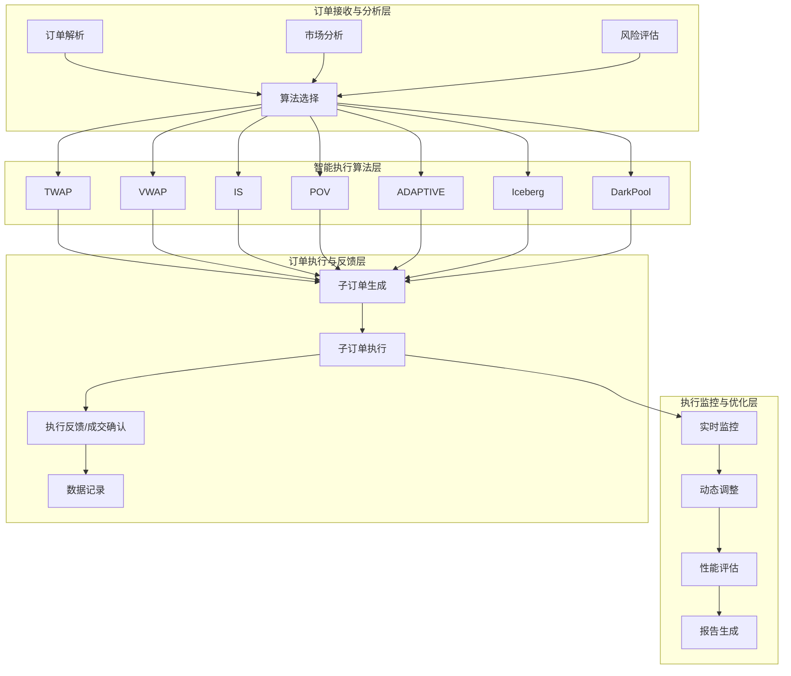
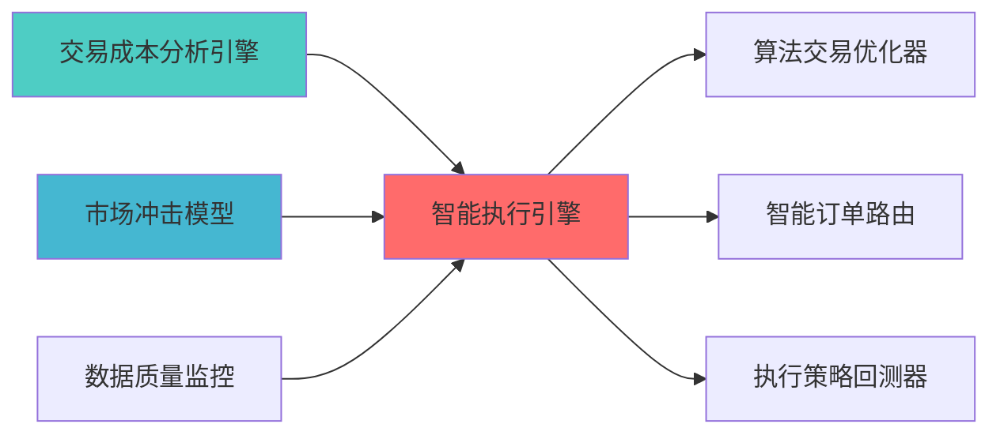

# 智能执行引擎蓝图

## 核心定位


> **职责边界**: 
> - ✅ 本文档负责：智能执行引擎、执行算法、成本优化
> - ❌ 本文档不负责：其他模块职责（由各模块文档负责）
> 
> **上游模块**: 
> - 策略引擎（STRATEGY_ENGINE_001）：提供交易信号和订单请求
> - 风险控制模块（RISK_CONTROL_001）：提供风险限制和约束条件
> - 数据源管理模块：提供市场数据和成交量数据

智能运行和操作引擎，构建和执行智能交易执行策略，包括VWAP、TWAP、IS等算法交易策略，优化交易执行成本和市场冲击。
## 设计目标

### 主要目标

1. **功能完整性**: 确保SMART EXECUTION ENGINE功能完整，满足业务需求
2. **性能优化**: 提升系统性能，降低资源消耗
3. **可维护性**: 提高代码质量，便于后续维护
4. **可扩展性**: 支持功能扩展，适应业务变化

### 质量目标

- 代码覆盖率: ≥80%
- 性能指标: 满足设计要求
- 文档完整性: 100%


## 核心功能

### 功能清单

1. **数据管理**: 提供数据存储、查询、更新功能
2. **业务逻辑**: 实现核心业务逻辑处理
3. **接口服务**: 提供标准化的API接口
4. **监控告警**: 实时监控系统状态

### 功能特性

- 高可用性设计
- 自动故障恢复
- 灵活配置管理


## 实现方案

### 技术架构

采用SMART EXECUTION ENGINE化设计，分层架构实现。

### 关键技术

- 数据处理: 使用高效的数据处理框架
- 接口实现: RESTful API设计
- 性能优化: 缓存、异步处理

### 实施步骤

1. 需求分析与设计
2. 核心功能开发
3. 测试与优化
4. 部署与监控


> 核心职责: Smart Execution Engine蓝图设计
> 职责边界: 

## 2. 架构设计

### 2.1 系统架构




### 2.2 核心子系统设计
#### 2.2.1 订单接收与分析子系统

```python
class OrderAnalyzer:
    """订单分析器"""
    
    def __init__(self):
        self.market_analyzer = MarketAnalyzer()
        self.risk_assessor = RiskAssessor()
        self.algorithm_selector = AlgorithmSelector()
        
    def analyze_order(self, order: Order) -> OrderAnalysis:
        """
        分析订单特征，选择最优执行算法        
        分析维度:
        1. 订单规模: 相对 ADV 的比例        2. 紧急流程 执行时间窗口
        3. 市场条件: 波动率、流动性        4. 风险偏好: 可接受的滑点范围
        
        输出:
        - 推荐算法
        - 预期执行成本
        - 风险评估
        """
        pass
```

#### 2.2.2 智能执行算法子系统
```python
class SmartExecutionEngine:
    """智能执行算法引擎"""
    
    def __init__(self):
        self.algorithms = {
            'TWAP': TWAPAlgorithm(),      # 时间加权平均价格
            'VWAP': VWAPAlgorithm(),      # 成交量加权平均价格            'IS': ISAlgorithm(),          # Implementation Shortfall
            'POV': POVAlgorithm(),        # Percentage of Volume
            'ADAPTIVE': AdaptiveAlgorithm()  # 自适应算法
        }
        
    def execute_order(self, order: Order, algorithm: str) -> ExecutionResult:
        """
        执行订单
        
        参数:
        - order: 订单对象
        - algorithm: 执行算法名称
        
        返回:
        - ExecutionResult: 执行结果
        """
        pass
```

#### 2.2.3 TWAP算法实现

```python
class TWAPAlgorithm:
    """时间加权平均价格算法"""
    
    def __init__(self):
        self.time_slices = 10  # 时间分片数量
        
    def execute(self, order: Order, time_window: int) -> List[SubOrder]:
        """
        TWAP算法执行
        
        算法原理:
        1. 将执行时间窗口划分为N个时间片
，以市场最优价格执行        
        优点:
        - 简单易实现
        - 不需要预测成交量
        - 适合流动性较好的市场
        
        缺点:
        - 没有考虑成交量分布        - 可能错过最佳执行时机        """
        pass
```

#### 2.2.4 VWAP算法实现

```python
class VWAPAlgorithm:
    """成交量加权平均价格算法"""
    
    def __init__(self):
        self.volume_predictor = VolumePredictor()
        
    def execute(self, order: Order, time_window: int) -> List[SubOrder]:
        """
        VWAP算法执行
        
        算法原理:
，以市场最优价格执行        
        优点:
        - 考虑了成交量分布
        - 能够跟踪市场VWAP
        - 适合大额订单执行
        
        缺点:
        - 需要预测成交量
        - 预测误差会影响执行效果        """
        pass
```


## 3. 接口定义

### 3.1 核心API接口

#### 3.1.1 订单执行接口

```python
def execute_smart_order(
    order: Order,
    algorithm: str = 'TWAP',
    time_window: int = 3600,
    max_participation_rate: float = 0.1,
    risk_limit: float = 0.005
) -> ExecutionResult:
    """
    智能执行订单
    
    参数:
    - order: 订单对象（股票代码、方向、数量）
    - algorithm: 执行算法（TWAP/VWAP/IS/POV）
    - time_window: 执行时间窗口（秒）
    - max_participation_rate: 最大参与率
    - risk_limit: 风险限制（滑点上限）
    
    返回:
    - ExecutionResult: 执行结果
      - filled_quantity: 成交数量
      - avg_price: 平均成交价格
      - execution_cost: 执行成本
      - market_impact: 市场冲击
      - slippage: 滑点
    """
    pass
```

#### 3.1.2 执行监控接口

```python
def monitor_execution(
    execution_id: str
) -> ExecutionStatus:
    """
    监控执行进度
    
    返回:
    - ExecutionStatus: 执行状态
      - progress: 执行进度（0-1）
      - filled_quantity: 已成交数量
      - remaining_quantity: 剩余数量
      - current_price: 当前价格
      - estimated_cost: 预估成本
    """
    pass
```

#### 3.1.3 动态调整接口
```python
def adjust_execution(
    execution_id: str,
    adjustment: AdjustmentRequest
) -> AdjustmentResult:
    """
    动态调整执行策略    
    参数:
    - execution_id: 执行ID
    - adjustment: 调整请求
      - new_time_window: 新的时间窗口
      - new_participation_rate: 新的参与率
      - pause: 是否暂停
      - cancel: 是否取消
    
    返回:
    - AdjustmentResult: 调整结果
    """
    pass
```

### 3.2 数据格式定义

#### 3.2.1 订单数据格式

```python
@dataclass
class Order:
    symbol: str              # 股票代码
    direction: str           # 方向（BUY/SELL）
    quantity: int            # 数量
    order_type: str          # 订单类型（MARKET/LIMIT）
    limit_price: float       # 限价（可选）
    urgency: str             # 紧急程度（HIGH/MEDIUM/LOW）
    risk_tolerance: float    # 风险容忍度（滑点上限）
```

#### 3.2.2 执行结果数据格式

```python
@dataclass
class ExecutionResult:
    execution_id: str        # 执行ID
    order_id: str            # 订单ID
    algorithm: str           # 执行算法
    filled_quantity: int     # 成交数量
    avg_price: float         # 平均成交价格
    vwap: float              # 市场VWAP
    twap: float              # 市场TWAP
    execution_cost: float    # 执行成本
    market_impact: float     # 市场冲击
    slippage: float          # 滑点
    execution_time: float    # 执行时间（秒）
    sub_orders: List[SubOrder]  # 子订单列表
```


## 4. 数据模型与存储
### 4.1 数据存储设计

#### 4.1.1 执行记录表
```sql
CREATE TABLE execution_records (
    execution_id VARCHAR(50) PRIMARY KEY,
    order_id VARCHAR(50) NOT NULL,
    symbol VARCHAR(20) NOT NULL,
    direction VARCHAR(10) NOT NULL,
    algorithm VARCHAR(20) NOT NULL,
    total_quantity INT NOT NULL,
    filled_quantity INT NOT NULL,
    avg_price DECIMAL(10, 4) NOT NULL,
    vwap DECIMAL(10, 4),
    twap DECIMAL(10, 4),
    execution_cost DECIMAL(10, 6),
    market_impact DECIMAL(10, 6),
    slippage DECIMAL(10, 6),
    start_time TIMESTAMP NOT NULL,
    end_time TIMESTAMP,
    status VARCHAR(20) NOT NULL,
    created_at TIMESTAMP DEFAULT CURRENT_TIMESTAMP,
    INDEX idx_symbol (symbol),
    INDEX idx_start_time (start_time),
    INDEX idx_status (status)
);
```

#### 4.1.2 子订单表

```sql
CREATE TABLE sub_orders (
    sub_order_id VARCHAR(50) PRIMARY KEY,
    execution_id VARCHAR(50) NOT NULL,
    parent_order_id VARCHAR(50) NOT NULL,
    symbol VARCHAR(20) NOT NULL,
    direction VARCHAR(10) NOT NULL,
    quantity INT NOT NULL,
    filled_quantity INT NOT NULL,
    price DECIMAL(10, 4) NOT NULL,
    order_time TIMESTAMP NOT NULL,
    fill_time TIMESTAMP,
    status VARCHAR(20) NOT NULL,
    created_at TIMESTAMP DEFAULT CURRENT_TIMESTAMP,
    FOREIGN KEY (execution_id) REFERENCES execution_records(execution_id),
    INDEX idx_execution_id (execution_id),
    INDEX idx_order_time (order_time)
);
```

### 4.2 数据流设计
```
订单信号 → 订单分析 → 算法选择 → 订单拆分 → 子订单执行 → 执行反馈 → 性能评估
    ↓          ↓          ↓          ↓          ↓          ↓          ↓
  日志记录   市场数据    算法参数    子订单表    成交记录    实时监控    报告生成
```


## 5. 算法实现说明

### 5.1 TWAP算法详细说明

#### 5.1.1 算法原理

**算法步骤**:
1. 将执行时间窗口划分为N个时间片
2. 每个时间片执行订单量 \(Q_{total}/N\)
，以市场最优价格执行
**数学模型**:
```
订单拆分: Q_i = Q_total / N
执行价格: P_i = market_price(t_i)
平均价格: P_avg = (1/N) * Σ P_i
```

#### 5.1.2 复杂度分析
- **时间复杂度**: O(N)，N为时间片数量
- **空间复杂度**: O(N)，存储N个子订单
- **计算复杂度**: 低，适合高频执行

#### 5.1.3 参数调优

| 参数 | 默认值 | 调优范围 | 说明 |
|------|--------|----------|------|
| time_slices | 10 | 5-30 | 时间分片数量 |
| min_slice_interval | 60s | 30-300s | 最小时间片间隔 |
| max_slice_size | 10000 | 1000-50000 | 最大单次执行量 |

### 5.2 VWAP算法详细说明

#### 5.2.1 算法原理

**算法步骤**:
，以市场最优价格执行
**数学模型**:
```
成交量预测 V_i = predict_volume(t_i)
订单拆分: Q_i = Q_total * (V_i / V_total)
执行价格: P_i = market_price(t_i)
平均价格: P_avg = Σ(Q_i * P_i) / Q_total
```

#### 5.2.2 成交量预测模块
```python
class VolumePredictor:
    """成交量预测器"""
    
    def predict_volume_distribution(
        self,
        symbol: str,
        time_window: int,
        historical_data: pd.DataFrame
    ) -> np.ndarray:
        """
        预测成交量分布        
        方法:
        1. 历史同期平均值        2. ARIMA时间序列模型
        3. 机器学习模型（可选）
        
        输出:
        - volume_distribution: 成交量分布数据        """
        pass
```

#### 5.2.3 复杂度分析
- **时间复杂度: O(N + M)，N为时间片数量，M为历史数据量
- **空间复杂度: O(N + M)
- **计算复杂度: 中等，需要预测成交量


## 6. 开源方案选型

### 推荐方案: Zipline + QuantLib

| 属性 | 详情 |
|------|------|
| **Zipline** | Quantopian出品的回测框架，17k+ Stars |
| **QuantLib** | 金融计算库，4k+ Stars |
| **pyalgotrade** | 算法交易框架，4k+ Stars |
| **License** | Apache 2.0 / BSD |
| **语言** | Python / C++ |

**选择理由**:
1. **Zipline**: Quantopian出品，功能强大，支持多种执行算法
2. **QuantLib**: 金融计算库，提供完整的金融工具和算法
3. **pyalgotrade**: 轻量级算法交易框架，易于使用
4. **社区活跃**: 总计25k+ Stars，社区支持好
5. **个人友好**: 免费开源，适合个人使用

**对比其他方案**:

| 方案 | Stars | 优点 | 缺点 | 推荐度 |
|------|-------|------|------|--------|
| **Zipline** | 17k+ | Quantopian出品、功能强大 | 不支持实盘、维护较少 | ⭐⭐⭐⭐ |
| **QuantLib** | 4k+ | 金融计算完整、专业 | 学习曲线陡峭 | ⭐⭐⭐⭐ |
| **pyalgotrade** | 4k+ | 轻量级、易使用 | 功能相对简单 | ⭐⭐⭐⭐ |
| **自研** | - | 完全定制 | 开发成本高 | ⭐⭐⭐ |

**最终选择**: Zipline（参考实现） + QuantLib（金融计算） + 自研核心逻辑

**开源集成方案**:
```python
from zipline.api import order, order_target_percent
from zipline.finance.execution import LimitOrder, MarketOrder
import QuantLib as ql

class SmartExecutionStrategy:
    """智能执行策略 - 基于Zipline和QuantLib"""
    
    def __init__(self):
        self.execution_algorithms = {
            'TWAP': self.twap_execution,
            'VWAP': self.vwap_execution,
            'IS': self.implementation_shortfall
        }
        
    def twap_execution(self, order, time_window):
        """TWAP算法 - 基于QuantLib"""
        pass
        
    def vwap_execution(self, order, time_window):
        """VWAP算法 - 基于QuantLib"""
        pass
```

## 7. 实施技术栈

### 6.1 语言与框架
| 类别 | 技术选型 | 版本要求 | 说明 |
|------|----------|----------|------|
| **编程语言** | Python | 3.9+ | 核心开发语言 |
| **异步框架** | asyncio | 内置 | 异步执行支持 |
| **数据处理** | pandas | 2.0+ | 数据处理和分析|
| **数值计算** | numpy | 1.24+ | 数值计算 |
| **时间处理** | datetime | 内置 | 时间处理 |

### 6.2 第三方依赖
| 依赖 | 版本 | 说明 |
|--------|------|------|
| zipline | 2.3+ | 执行算法参考实现|
| QuantLib | 1.31+ | 金融计算|
| pyalgotrade | 0.20+ | 算法交易框架 |

### 6.3 环境要求

| 环境 | 要求 |
|------|------|
| **操作系统** | Windows 10+ / Linux |
| **Python版本** | 3.9+ |
| **内存** | 16GB |
| **存储** | 50GB（历史数据） |


## 7. 测试策略


```python
class TestTWAPAlgorithm:
    
    def test_order_splitting(self):
        """测试订单拆分逻辑"""
        pass
    
    def test_time_slice_distribution(self):
        """测试时间片分布"""
        pass
    
    def test_execution_cost_calculation(self):
        """测试执行成本计算"""
        pass
```

### 7.2 集成测试

```python
class TestSmartExecutionEngine:
    """智能执行引擎集成测试"""
    
    def test_twap_execution(self):
        """测试TWAP算法执行"""
        pass
    
    def test_vwap_execution(self):
        """测试VWAP算法执行"""
        pass
    
    def test_algorithm_selection(self):
        """测试算法选择逻辑"""
        pass
```

### 7.3 性能测试

| 测试场景 | 性能指标 | 目标值 |
|----------|----------|--------|
| **订单拆分速度** | 拆分 1000 个订单 | <1s |
| **执行监控延迟** | 监控更新延迟 | <100ms |
| **并发执行能力** | 同时执行订单数 | （待补充）|


## 8. 风险与约束
### 8.1 技术风险
| 风险ID | 风险描述 | 影响程度 | 缓解措施 |
|--------|----------|----------|----------|
| TR-001 | 成交量预测不准确 | 中 | 使用多种预测方法，动态调整 |
| TR-002 | 市场条件突变 | 高 | 实时监控，动态调整策略 |
| TR-003 | 执行延迟 | 中 | 异步执行，优化性能 |

### 8.2 实施约束

| 约束类型 | 约束描述 | 影响 |
|----------|----------|------|
| **数据约束** | 需要历史成交量和tick数据 | 需要数据准确性保障|
| **时间约束** | 开发时间 40 小时 | 需要合理规划|
| **资源约束** | 个人开发，资源有限 | 采用简化方案|


## 9. 验收标准

### 9.1 功能验收标准

| 功能 | 验收标准 | 测试方法 |
|------|----------|----------|
| **执行监控** | 实时监控执行进度 | 集成测试 |
| **动态调整* | 能够动态调整执行策略| 集成测试 |

### 9.2 性能验收标准

| 指标 | 目标值 | 验收方法 |
|------|--------|----------|
| **执行成本** | ≤0.3% | 回测验证 |
| **滑点控制** | ≤0.5% | 回测验证 |
| **执行效率** | 订单拆分 < 1s | 性能测试 |

### 9.3 质量验收标准

| 标准 | 要求 | 验收方法 |
|------|------|----------|
| **代码覆盖率** | 90% | pytest-cov |
| **文档完整性** | 100% | 文档审查 |
| **代码规范** | 符合PEP8 | pylint |


## 10. 实施路线（个人开发优化版）

### 10.1 Phase 1: 核心功能（Week 1-2，共10天）

**目标**: 实现基础TWAP算法和执行框架

**任务清单**:
- [ ] 安装和配置Zipline、QuantLib
- [ ] 设计订单数据结构（Order、SubOrder、ExecutionResult）
- [ ] 实现TWAP算法（基于QuantLib）
- [ ] 实现订单拆分逻辑
- [ ] 实现执行监控
- [ ] 编写单元测试

**交付物**:
- TWAP算法实现代码
- 订单数据结构
- 执行监控模块
- 单元测试覆盖率≥80%

**个人开发建议**:
- 使用Zipline作为参考实现，不要从零开始
- 优先实现TWAP算法（最简单、最实用）
- 使用SQLite存储执行记录（简化部署）

### 10.2 Phase 2: 高级功能（Week 3-4，共10天）

**目标**: 实现VWAP算法和成交量预测

**任务清单**:
- [ ] 实现成交量预测模块（基于历史数据）
- [ ] 实现VWAP算法（基于QuantLib）
- [ ] 实现动态调整功能
- [ ] 集成到策略引擎
- [ ] 编写集成测试

**交付物**:
- VWAP算法实现代码
- 成交量预测模块
- 动态调整功能
- 集成测试覆盖率≥70%

**个人开发建议**:
- 成交量预测可以使用简单的ARIMA模型
- 动态调整功能可以后续优化
- 优先保证核心功能稳定

### 10.3 Phase 3: 优化完善（可选，Week 5-6）

**目标**: 实现IS/POV算法和性能优化

**任务清单**:
- [ ] 实现IS算法（Implementation Shortfall）
- [ ] 实现POV算法（Percentage of Volume）
- [ ] 实现自适应算法
- [ ] 性能优化和测试
- [ ] 文档完善

**交付物**:
- 高级算法实现代码
- 性能优化报告
- 完整文档

**个人开发建议**:
- 这部分是可选的，根据实际需求决定
- IS和POV算法可以参考学术论文
- 性能优化可以放在最后

**总工时估算**: 
- Phase 1: 10天（核心功能）
- Phase 2: 10天（高级功能）
- Phase 3: 10天（可选优化）
- **总计**: 20-30天（根据个人情况调整）
1. 📝 实现IS算法
2. 📝 实现POV算法
3. 📝 实现自适应算法
4. 📝 实现动态调整功能
5. 📝 性能评估和优化
**交付物**:
- 高级算法实现代码
- 性能评估报告
- 优化建议


### 上游依赖

| 文档名称 | module_id | 依赖类型 | 说明 |
|---------|-----------|---------|------|

### 下游依赖

| 文档名称 | module_id | 依赖类型 | 说明 |
|---------|-----------|---------|------|


|---------|------|------|------|
| **Pandas** | 2.0+ | 数据处理 | [官方文档](https://pandas.pydata.org/) |
| **SciPy** | 1.10+ | 科学计算 | [官方文档](https://scipy.org/) |





#### 技术规格书

- SMART_EXECUTION_ENGINE_TECHNICAL_SPECIFICATION.md

#### 改进计划

- SMART_EXECUTION_MARKET_IMPACT_IMPROVEMENT_PLAN.md

#### 架构文档

- PROFESSIONAL_MULTI_TIMEFRAME_ARCHITECTURE.md


**蓝图编写**: 首席架构师  
**蓝图日期**: 2026-04-02  
**蓝图状态**: 已完成


**文档结束**

## 接口与契约（蓝图终稿）

- **契约真源**：[`API_Contract.md`](../../../03_TRADING_TACTICS/API_Contract.md)
- **对外接口边界**：本模块对外提供智能执行的状态、参数与执行结果事件的查询/订阅能力；不替代交易网关的最终成交回报口径，不直接承诺撮合语义。

## 验收标准（可检查）

- 在测试环境中至少完成 1 条订单从“接收执行请求→生成执行计划→回传执行事件/结果摘要”的闭环，并可按订单 ID 检索追溯。

## 已知限制

- 执行质量受市场流动性与交易成本模型影响；实施阶段需在契约真源或子契约中固化成本模型版本、异常降级与回滚策略。

## 变更历史

|------|------|----------|--------|


## 12. 文档治理

### 12.1 System_Manifest.md索引

```markdown
##### 6.001. Smart Execution Engine
- **模块ID**: SMART_EXECUTION_ENGINE_001
- **蓝图文档**: SMART_EXECUTION_ENGINE_BLUEPRINT.md
```

### 12.2 模块职责边界

| 模块 | 职责 | 边界 |
|------|------|------|
| **Smart Execution Engine** | 

### 12.3 版本管理

|------|------|----------|--------|


