# 智能订单路由器蓝å›?

> **核心职责**: 智能订单路由，优化订单拆分和执行
> **职责边界**: 
> - âœ?本文档负责：订单路由优化、订单拆分、执行优化、成本最小化
> - â?本文档不负责：订单生成、策略决策、风险控åˆ?
ï»? 智能订单路由器蓝å›?

> **核心定位**: 智能订单路由器蓝图的核心功能实现


> **版本**: v1.0
> **创建日期**: 2026-04-06
> **开源项ç›?*: 自研简化版（个人单券商场景ï¼?
> **目标**: 构建简化版智能订单路由器，优化订单拆分和执è¡?

## 核心定位

负责Smart Order Router的设计、实现和维护，提供核心功能支持，确保系统模块的稳定运行和高效执行ã€?

## 设计目标

### 主要目标

1. **功能完整性**: 确保SMART ORDER ROUTER功能完整，满足业务需求
2. **性能优化**: 提升系统性能，降低资源消耗
3. **可维护性**: 提高代码质量，便于后续维护
4. **可扩展性**: 支持功能扩展，适应业务变化

### 质量目标

- 代码覆盖率: ≥80%
- 性能指标: 满足设计要求
- 文档完整性: 100%


## 核心功能

### 功能清单

1. **数据管理**: 提供数据存储、查询、更新功能
2. **业务逻辑**: 实现核心业务逻辑处理
3. **接口服务**: 提供标准化的API接口
4. **监控告警**: 实时监控系统状态

### 功能特性

- 高可用性设计
- 自动故障恢复
- 灵活配置管理


## 实现方案

### 技术架构

采用SMART ORDER ROUTER化设计，分层架构实现。

### 关键技术

- 数据处理: 使用高效的数据处理框架
- 接口实现: RESTful API设计
- 性能优化: 缓存、异步处理

### 实施步骤

1. 需求分析与设计
2. 核心功能开发
3. 测试与优化
4. 部署与监控


## 二、架构设è®?

### 2.1 Layer定位

**Layer归属**: Layer 5 - 策略执行å±?

**模块类别**: 订单路由模块

**架构角色**: 
- 作为策略执行层的订单路由核心
- 为QMT执行器提供订单拆分优åŒ?
- 为交易审计器提供路由记录

### 2.2 系统架构å›?

```
┌─────────────────────────────────────────────────────────────────â”?
â”?                 智能订单路由器架构（简化版ï¼?                      â”?
├─────────────────────────────────────────────────────────────────â”?
â”?                                                                â”?
â”? ┌───────────────────────────────────────────────────────────â”?â”?
â”? â”?             订单接收å±?                                  â”?â”?
â”? â”? ┌─────────────────────────────────────────────────────â”?â”?â”?
â”? â”? â”?订单信息                                            â”?â”?â”?
â”? â”? â”? ├── 订单ID                                        â”?â”?â”?
â”? â”? â”? ├── 股票代码                                      â”?â”?â”?
â”? â”? â”? ├── 方向                                          â”?â”?â”?
â”? â”? â”? ├── 数量                                          â”?â”?â”?
â”? â”? â”? └── ä»·æ ¼                                          â”?â”?â”?
â”? â”? └─────────────────────────────────────────────────────â”?â”?â”?
â”? â”? ┌─────────────────────────────────────────────────────â”?â”?â”?
â”? â”? â”?订单分析                                            â”?â”?â”?
â”? â”? â”? ├── 订单大小分析                                  â”?â”?â”?
â”? â”? â”? ├── 流动性分æž?                                   â”?â”?â”?
â”? â”? â”? ├── 市场冲击分析                                  â”?â”?â”?
â”? â”? â”? └── 执行时间分析                                  â”?â”?â”?
â”? â”? └─────────────────────────────────────────────────────â”?â”?â”?
â”? └───────────────────────────────────────────────────────────â”?â”?
â”?                                                                â”?
â”? ┌───────────────────────────────────────────────────────────â”?â”?
â”? â”?             订单拆分å±?                                  â”?â”?
â”? â”? ┌─────────────────────────────────────────────────────â”?â”?â”?
â”? â”? â”?拆分策略                                            â”?â”?â”?
â”? â”? â”? ├── 固定拆分                                      â”?â”?â”?
â”? â”? â”? ├── 百分比拆åˆ?                                   â”?â”?â”?
â”? â”? â”? ├── VWAP拆分                                      â”?â”?â”?
â”? â”? â”? └── TWAP拆分                                      â”?â”?â”?
â”? â”? └─────────────────────────────────────────────────────â”?â”?â”?
â”? â”? ┌─────────────────────────────────────────────────────â”?â”?â”?
â”? â”? â”?拆分优化                                            â”?â”?â”?
â”? â”? â”? ├── 流动性优åŒ?                                   â”?â”?â”?
â”? â”? â”? ├── 冲击优化                                      â”?â”?â”?
â”? â”? â”? ├── 时间优化                                      â”?â”?â”?
â”? â”? â”? └── 成本优化                                      â”?â”?â”?
â”? â”? └─────────────────────────────────────────────────────â”?â”?â”?
â”? â”? ┌─────────────────────────────────────────────────────â”?â”?â”?
â”? â”? â”?子订单生æˆ?                                         â”?â”?â”?
â”? â”? â”? ├── 子订单列è¡?                                   â”?â”?â”?
â”? â”? â”? ├── 执行时间è¡?                                   â”?â”?â”?
â”? â”? â”? ├── 价格限制                                      â”?â”?â”?
â”? â”? â”? └── 执行条件                                      â”?â”?â”?
â”? â”? └─────────────────────────────────────────────────────â”?â”?â”?
â”? └───────────────────────────────────────────────────────────â”?â”?
â”?                                                                â”?
â”? ┌───────────────────────────────────────────────────────────â”?â”?
â”? â”?             执行监控å±?                                  â”?â”?
â”? â”? ┌─────────────────────────────────────────────────────â”?â”?â”?
â”? â”? â”?执行状态监æŽ?                                       â”?â”?â”?
â”? â”? â”? ├── 已执行数é‡?                                   â”?â”?â”?
â”? â”? â”? ├── 未执行数é‡?                                   â”?â”?â”?
â”? â”? â”? ├── 执行价格                                      â”?â”?â”?
â”? â”? â”? └── 执行时间                                      â”?â”?â”?
â”? â”? └─────────────────────────────────────────────────────â”?â”?â”?
â”? â”? ┌─────────────────────────────────────────────────────â”?â”?â”?
â”? â”? â”?执行调整                                            â”?â”?â”?
â”? â”? â”? ├── 动态调æ•?                                     â”?â”?â”?
â”? â”? â”? ├── 价格调整                                      â”?â”?â”?
â”? â”? â”? ├── 时间调整                                      â”?â”?â”?
â”? â”? â”? └── 取消处理                                      â”?â”?â”?
â”? â”? └─────────────────────────────────────────────────────â”?â”?â”?
â”? â”? ┌─────────────────────────────────────────────────────â”?â”?â”?
â”? â”? â”?执行报告                                            â”?â”?â”?
â”? â”? â”? ├── 执行摘要                                      â”?â”?â”?
â”? â”? â”? ├── 成本分析                                      â”?â”?â”?
â”? â”? â”? ├── 执行质量                                      â”?â”?â”?
â”? â”? â”? └── 优化建议                                      â”?â”?â”?
â”? â”? └─────────────────────────────────────────────────────â”?â”?â”?
â”? └───────────────────────────────────────────────────────────â”?â”?
└─────────────────────────────────────────────────────────────────â”?
```

### 2.3 模块职责与边ç•?

**核心职责**: 为订单提供拆分优化和执行监控能力

**职责边界**:
- âœ?本模块负è´?
  - 订单拆分优化
  - 执行路径选择（简化版ï¼?
  - 执行监控
  - 执行报告
  
- â?本模块不负责:
  - 订单生成（由SignalGenerator负责ï¼?
  - 订单执行（由QMTExecutor负责ï¼?
  - 风险控制（由RiskHedgeEngine负责ï¼?
  - 成本分析（由TCAEngine负责ï¼?

---

## 三、技术实现方æ¡?

### 3.1 自研简化版实现

**设计理念**:
- 个人交易者通常只有1个券商账户（QMTï¼?
- 专业级SOR的多市场路由功能价值有é™?
- 重点优化订单拆分逻辑，而非多市场路ç”?

**核心功能**:
- 订单拆分优化
- 执行时间安排
- 执行监控
- 执行报告

**集成方案**:
```python
class SmartOrderRouter:
    def __init__(self):
        self.split_strategies = {
            'fixed': self.fixed_split,
            'percentage': self.percentage_split,
            'vwap': self.vwap_split,
            'twap': self.twap_split
        }
        
    def route_order(self, order, strategy='vwap'):
        split_func = self.split_strategies.get(strategy, self.vwap_split)
        sub_orders = split_func(order)
        return sub_orders
        
    def vwap_split(self, order, num_splits=10):
        volume_profile = self.predict_volume_profile(order.symbol)
        split_volumes = self.calculate_vwap_splits(order.volume, volume_profile, num_splits)
        
        sub_orders = []
        for i, volume in enumerate(split_volumes):
            sub_order = {
                'order_id': f"{order.order_id}_{i}",
                'symbol': order.symbol,
                'direction': order.direction,
                'volume': volume,
                'price': order.price,
                'execution_time': self.calculate_execution_time(i, num_splits)
            }
            sub_orders.append(sub_order)
            
        return sub_orders
```

### 3.2 核心算法设计

#### 3.2.1 订单拆分算法

**固定拆分**:
```python
def fixed_split(self, order, num_splits=10):
    split_volume = order.volume // num_splits
    remainder = order.volume % num_splits
    
    sub_orders = []
    for i in range(num_splits):
        volume = split_volume + (1 if i < remainder else 0)
        sub_order = self.create_sub_order(order, volume, i)
        sub_orders.append(sub_order)
        
    return sub_orders
```

**VWAP拆分**:
```python
def vwap_split(self, order, num_splits=10):
    volume_profile = self.predict_volume_profile(order.symbol)
    total_volume = sum(volume_profile.values())
    
    split_volumes = []
    for time_slot, volume in volume_profile.items():
        split_volume = int(order.volume * (volume / total_volume))
        split_volumes.append((time_slot, split_volume))
        
    return split_volumes
```

**TWAP拆分**:
```python
def twap_split(self, order, duration_minutes=30, interval_minutes=5):
    num_splits = duration_minutes // interval_minutes
    split_volume = order.volume // num_splits
    remainder = order.volume % num_splits
    
    sub_orders = []
    for i in range(num_splits):
        volume = split_volume + (1 if i < remainder else 0)
        execution_time = datetime.now() + timedelta(minutes=i * interval_minutes)
        sub_order = self.create_sub_order(order, volume, i, execution_time)
        sub_orders.append(sub_order)
        
    return sub_orders
```

#### 3.2.2 执行监控算法

**执行状态监æŽ?*:
```python
def monitor_execution(self, order_id):
    execution_status = {
        'total_volume': self.get_total_volume(order_id),
        'executed_volume': self.get_executed_volume(order_id),
        'remaining_volume': self.get_remaining_volume(order_id),
        'avg_execution_price': self.calculate_avg_execution_price(order_id),
        'execution_progress': self.calculate_execution_progress(order_id)
    }
    return execution_status
```

**动态调æ•?*:
```python
def adjust_execution(self, order_id, market_conditions):
    if market_conditions['volatility'] > self.volatility_threshold:
        self.reduce_execution_speed(order_id)
    elif market_conditions['liquidity'] < self.liquidity_threshold:
        self.pause_execution(order_id)
    else:
        self.continue_execution(order_id)
```

### 3.3 数据模型设计

#### 3.3.1 订单数据模型

```python
class Order:
    order_id: str
    symbol: str
    direction: str  # buy/sell
    volume: float
    price: float
    order_type: str  # market/limit
    timestamp: datetime
```

#### 3.3.2 子订单数据模åž?

```python
class SubOrder:
    sub_order_id: str
    parent_order_id: str
    symbol: str
    direction: str
    volume: float
    price: float
    execution_time: datetime
    status: str  # pending/executed/cancelled
```

---

## 四、个人开发适用性分æž?

### 4.1 个人场景分析

| 场景维度 | 专业机构 | 个人交易è€?| 说明 |
|---------|---------|-----------|------|
| **券商账户** | 多个 | 1个（QMTï¼?| 无需多市场路ç”?|
| **交易频率** | 高频 | 中低é¢?| 拆分需求较ä½?|
| **订单大小** | 大单 | 中小å?| 拆分需求较ä½?|
| **流动性需æ±?* | 多源聚合 | 单源优化 | 聚合价值有é™?|

### 4.2 简化版优势

| 优势维度 | 说明 | 评分 |
|---------|------|------|
| **实施简å?* | 仅需订单拆分逻辑 | ⭐⭐⭐⭐â­?|
| **维护简å?* | 功能简单，易于维护 | ⭐⭐⭐⭐â­?|
| **成本可控** | 无需额外投入 | ⭐⭐⭐⭐â­?|
| **价值有é™?* | 个人场景价值有é™?| ⭐⭐ |

### 4.3 实施成本评估

| 成本维度 | 评估结果 | 说明 |
|---------|---------|------|
| **开发工æ—?* | 3å‘?| 自研简化版 |
| **学习成本** | ä½?| 功能简å?|
| **维护成本** | ä½?| 功能简å?|
| **硬件成本** | æ—?| 无需额外硬件投入 |

---

## 五、实施路径规åˆ?

### 5.1 Phase 1: 基础功能（Week 1-2ï¼?

**目标**: 实现基础订单拆分功能

**任务清单**:
1. âœ?创建SOR基础ç±?
2. âœ?实现固定拆分策略
3. âœ?实现VWAP拆分策略
4. âœ?实现TWAP拆分策略
5. âœ?单元测试和集成测è¯?

**交付成果**:
- SOR基础框架
- 订单拆分功能
- 单元测试覆盖

### 5.2 Phase 2: 执行监控（Week 3ï¼?

**目标**: 实现执行监控功能

**任务清单**:
1. âœ?实现执行状态监æŽ?
2. âœ?实现动态调整功èƒ?
3. âœ?实现执行报告功能
4. âœ?集成测试
5. âœ?文档完善

**交付成果**:
- 执行监控功能
- 动态调整功èƒ?
- 执行报告功能
- API接口文档
- 用户手册

---

## 六、质量保证标å‡?

### 6.1 功能完整性检æŸ?

| 功能é¡?| 完整性要æ±?| 验证方法 |
|--------|-----------|---------|
| **订单拆分** | 支持多种拆分策略 | 功能测试 |
| **执行监控** | 支持实时监控 | 单元测试 |
| **动态调æ•?* | 支持条件调整 | 集成测试 |
| **执行报告** | 支持完整报告 | 性能测试 |

### 6.2 性能要求

| 性能指标 | 要求 | 说明 |
|---------|------|------|
| **拆分速度** | <100ms | 订单拆分时间 |
| **监控频率** | 1æ¬?ç§?| 执行监控频率 |
| **调整延迟** | <1s | 动态调整延è¿?|

### 6.3 准确性要æ±?

| 准确性指æ ?| 要求 | 说明 |
|---------|------|------|
| **拆分精度** | 100% | 拆分数量准确 |
| **执行监控准确æ€?* | 99% | 监控数据准确 |
| **调整有效æ€?* | 90% | 调整决策有效 |

---

## 七、风险评估与缓解

### 7.1 技术风é™?

| 风险é¡?| 风险等级 | 缓解措施 |
|--------|---------|---------|
| **功能简å?* | ä½?| 功能简单，风险ä½?|
| **性能瓶颈** | ä½?| 功能简单，性能要求ä½?|
| **数据质量** | ä½?| 数据来源单一 |

### 7.2 实施风险

| 风险é¡?| 风险等级 | 缓解措施 |
|--------|---------|---------|
| **学习曲线** | ä½?| 功能简单，易于学习 |
| **集成复杂åº?* | ä½?| 功能简单，集成容易 |
| **维护成本** | ä½?| 功能简单，维护容易 |

---

## 八、专业机构对æ ?

### 8.1 Citadel对标

| 功能模块 | Citadel实现 | 本蓝图实çŽ?| 对标程度 |
|---------|------------|-----------|---------|
| **多市场路ç”?* | 多市场智能路ç”?| 单券商优åŒ?| ⭐⭐ (40%) |
| **流动性聚å?* | 多源流动性聚å?| 单源优化 | ⭐⭐ (40%) |
| **订单拆分** | 专业拆分算法 | 简化拆分逻辑 | ⭐⭐⭐⭐ (80%) |
| **执行监控** | 实时监控 | 批量+实时监控 | ⭐⭐⭐⭐ (80%) |

### 8.2 Two Sigma对标

| 功能模块 | Two Sigma实现 | 本蓝图实çŽ?| 对标程度 |
|---------|--------------|-----------|---------|
| **AI路由** | AI驱动路由 | 规则路由 | ⭐⭐ (40%) |
| **实时优化** | 实时路径优化 | 批量优化 | ⭐⭐â­?(60%) |

---

## 九、相关文æ¡?

### 上游依赖

| 文档名称 | module_id | 依赖类型 | 说明 |
|---------|-----------|---------|------|
| [智能执行引擎蓝图](./SMART_EXECUTION_ENGINE_BLUEPRINT.md) | SMART_EXECUTION_ENGINE_001 | 强依èµ?| 提供执行算法 |
| [数据质量监控蓝图](./DATA_QUALITY_MONITORING_BLUEPRINT.md) | DATA_QUALITY_MONITORING_001 | 强依èµ?| 提供数据质量指标 |
| [市场冲击模型蓝图](./MARKET_IMPACT_MODEL_BLUEPRINT.md) | MARKET_IMPACT_MODEL_001 | 中依èµ?| 提供市场冲击预测 |

### 下游依赖

| 文档名称 | module_id | 依赖类型 | 说明 |
|---------|-----------|---------|------|
| [算法交易优化器蓝图](./ALGORITHMIC_TRADING_OPTIMIZER_BLUEPRINT.md) | ALGORITHMIC_TRADING_OPTIMIZER_001 | 强依èµ?| 算法交易优化 |
| [交易成本分析引擎蓝图](./TRANSACTION_COST_ANALYSIS_ENGINE_BLUEPRINT.md) | TRANSACTION_COST_ANALYSIS_ENGINE_001 | 中依èµ?| 交易成本分析 |
| [执行策略回测器蓝图](./EXECUTION_STRATEGY_BACKTESTER_BLUEPRINT.md) | EXECUTION_STRATEGY_BACKTESTER_001 | 中依èµ?| 执行策略回测 |

### 技术依èµ?

| 技术组ä»?| 版本 | 用é€?| 文档 |
|---------|------|------|------|
| **Pandas** | 2.0+ | 数据处理 | [官方文档](https://pandas.pydata.org/) |
| **NumPy** | 1.24+ | 数值计ç®?| [官方文档](https://numpy.org/) |

### 引用关系å›?

```mermaid
graph LR
    A[智能执行引擎] --> B[智能订单路由器]
    C[数据质量监控] --> B
    D[市场冲击模型] --> B
    
    B --> E[算法交易优化器]
    B --> F[交易成本分析引擎]
    B --> G[执行策略回测器]
    
    style B fill:#ff6b6b
    style A fill:#4ecdc4
    style C fill:#45b7d1
```



### 相关蓝图文档

| 文档名称 | 说明 |
|---------|------|
| ARCHITECTURE.md | 系统架构文档 |
| STRATEGY_EXECUTION_LAYER_BLUEPRINT.md | 策略执行层蓝å›?|
| QMT_EXECUTOR_TECHNICAL_SPECIFICATION.md | QMT执行器技术规æ ?|

---

**蓝图版本**: v1.0
**蓝图日期**: 2026-04-06
**蓝图编写**: 首席架构å¸?
**蓝图状æ€?*: 已完æˆ?

## 变更历史

| 版本 | 日期 | 变更内容 | 变更äº?|
|------|------|----------|--------|
| v1.0.0 | 2026-04-06 | 初始版本创建 | 首席架构å¸?|

---

**蓝图版本**: v1.0.0 | **创建日期**: 2026-04-06 | **状æ€?*: Active
---

## 1. 文档治理

### 1.1 System_Manifest.md索引

```markdown
#### Layer 5: 策略执行å±?
##### 6.001. Smart Order Router
- **模块ID**: SMART_ORDER_ROUTER_001
- **蓝图文档**: SMART_ORDER_ROUTER_BLUEPRINT.md
- **技术规格书**: 待创å»?
- **职责**: Layer 5 - 策略执行å±?
- **状æ€?*: Active
```

### 1.2 模块职责边界

| 模块 | 职责 | 边界 |
|------|------|------|
| **Smart Order Router** | Layer 5 - 策略执行å±?| **核心模块** |

### 1.3 版本管理

| 版本 | 日期 | 变更内容 | 变更äº?|
|------|------|----------|--------|
| v1.0.0 | 2026-04-06 | 初始版本创建 | 首席蓝图架构å¸?|

---

**蓝图版本**: v1.0.0 | **创建日期**: 2026-04-06 | **状æ€?*: Active
