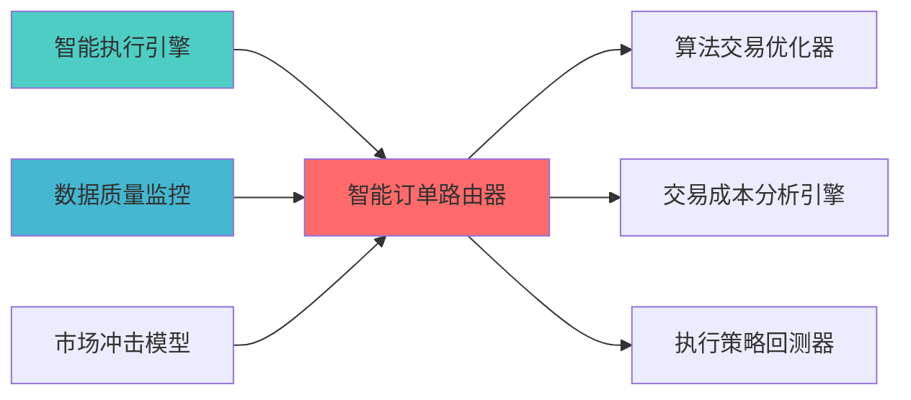

---
module_id: SMART_ORDER_ROUTER_001
version: 1.0.0
status: Active
created_date: 2026-04-07
last_updated: 2026-04-07
owner: 实施团队
standard_type: 专业量化机构蓝图
compliance_level: 专业标准
responsibility:
  - 智能订单路由
  - 路由优化
  - 执行场所
  - 订单路由成本最小化

layer: Layer 5.4 (交易执行)
---


> **核心职责**: 智能订单路由，优化订单拆分和执行
> **职责边界**: 

> **核心定位**: 智能订单路由器蓝图的核心功能实现


> **版本**: v1.0
> **创建日期**: 2026-04-06

## 核心定位


智能订单路由器，实现订单的智能路由和分配，根据市场状况和交易成本选择最优的交易场所和执行路径，优化交易执行效率。
### 主要目标

1. **功能完整性**: 确保SMART ORDER ROUTER功能完整，满足业务需求
2. **性能优化**: 提升系统性能，降低资源消耗
3. **可维护性**: 提高代码质量，便于后续维护
4. **可扩展性**: 支持功能扩展，适应业务变化

### 质量目标

- 代码覆盖率: ≥80%
- 性能指标: 满足设计要求
- 文档完整性: 100%


## 核心功能

### 功能清单

1. **数据管理**: 提供数据存储、查询、更新功能
2. **业务逻辑**: 实现核心业务逻辑处理
3. **接口服务**: 提供标准化的API接口
4. **监控告警**: 实时监控系统状态

### 功能特性

- 高可用性设计
- 自动故障恢复
- 灵活配置管理


## 实现方案

### 技术架构

采用SMART ORDER ROUTER化设计，分层架构实现。

### 关键技术

- 数据处理: 使用高效的数据处理框架
- 接口实现: RESTful API设计
- 性能优化: 缓存、异步处理

### 实施步骤

1. 需求分析与设计
2. 核心功能开发
3. 测试与优化
4. 部署与监控


### 2.1 Layer定位


**模块类别**: 订单路由模块

**架构角色**: 
- 作为策略执行层的订单路由核心
- 为交易审计器提供路由记录


```
```


**核心职责**: 为订单提供拆分优化和执行监控能力

**职责边界**:
  - 订单拆分优化
  - 执行监控
  - 执行报告
  


### 3.1 自研简化版实现

**设计理念**:

**核心功能**:
- 订单拆分优化
- 执行时间安排
- 执行监控
- 执行报告

**集成方案**:
```python
class SmartOrderRouter:
    def __init__(self):
        self.split_strategies = {
            'fixed': self.fixed_split,
            'percentage': self.percentage_split,
            'vwap': self.vwap_split,
            'twap': self.twap_split
        }
        
    def route_order(self, order, strategy='vwap'):
        split_func = self.split_strategies.get(strategy, self.vwap_split)
        sub_orders = split_func(order)
        return sub_orders
        
    def vwap_split(self, order, num_splits=10):
        volume_profile = self.predict_volume_profile(order.symbol)
        split_volumes = self.calculate_vwap_splits(order.volume, volume_profile, num_splits)
        
        sub_orders = []
        for i, volume in enumerate(split_volumes):
            sub_order = {
                'order_id': f"{order.order_id}_{i}",
                'symbol': order.symbol,
                'direction': order.direction,
                'volume': volume,
                'price': order.price,
                'execution_time': self.calculate_execution_time(i, num_splits)
            }
            sub_orders.append(sub_order)
            
        return sub_orders
```

### 3.2 核心算法设计

#### 3.2.1 订单拆分算法

**固定拆分**:
```python
def fixed_split(self, order, num_splits=10):
    split_volume = order.volume // num_splits
    remainder = order.volume % num_splits
    
    sub_orders = []
    for i in range(num_splits):
        volume = split_volume + (1 if i < remainder else 0)
        sub_order = self.create_sub_order(order, volume, i)
        sub_orders.append(sub_order)
        
    return sub_orders
```

**VWAP拆分**:
```python
def vwap_split(self, order, num_splits=10):
    volume_profile = self.predict_volume_profile(order.symbol)
    total_volume = sum(volume_profile.values())
    
    split_volumes = []
    for time_slot, volume in volume_profile.items():
        split_volume = int(order.volume * (volume / total_volume))
        split_volumes.append((time_slot, split_volume))
        
    return split_volumes
```

**TWAP拆分**:
```python
def twap_split(self, order, duration_minutes=30, interval_minutes=5):
    num_splits = duration_minutes // interval_minutes
    split_volume = order.volume // num_splits
    remainder = order.volume % num_splits
    
    sub_orders = []
    for i in range(num_splits):
        volume = split_volume + (1 if i < remainder else 0)
        execution_time = datetime.now() + timedelta(minutes=i * interval_minutes)
        sub_order = self.create_sub_order(order, volume, i, execution_time)
        sub_orders.append(sub_order)
        
    return sub_orders
```

#### 3.2.2 执行监控算法

```python
def monitor_execution(self, order_id):
    execution_status = {
        'total_volume': self.get_total_volume(order_id),
        'executed_volume': self.get_executed_volume(order_id),
        'remaining_volume': self.get_remaining_volume(order_id),
        'avg_execution_price': self.calculate_avg_execution_price(order_id),
        'execution_progress': self.calculate_execution_progress(order_id)
    }
    return execution_status
```

```python
def adjust_execution(self, order_id, market_conditions):
    if market_conditions['volatility'] > self.volatility_threshold:
        self.reduce_execution_speed(order_id)
    elif market_conditions['liquidity'] < self.liquidity_threshold:
        self.pause_execution(order_id)
    else:
        self.continue_execution(order_id)
```

### 3.3 数据模型设计

#### 3.3.1 订单数据模型

```python
class Order:
    order_id: str
    symbol: str
    direction: str  # buy/sell
    volume: float
    price: float
    order_type: str  # market/limit
    timestamp: datetime
```


```python
class SubOrder:
    sub_order_id: str
    parent_order_id: str
    symbol: str
    direction: str
    volume: float
    price: float
    execution_time: datetime
    status: str  # pending/executed/cancelled
```


### 4.1 个人场景分析

|---------|---------|-----------|------|

### 4.2 简化版优势

| 优势维度 | 说明 | 评分 |
|---------|------|------|

### 4.3 实施成本评估

| 成本维度 | 评估结果 | 说明 |
|---------|---------|------|
|


**目标**: 实现基础订单拆分功能

单**:

**交付成果**:
- SOR基础框架
- 订单拆分功能


**目标**: 实现执行监控功能

单**:

**交付成果**:
- 执行监控功能
- 执行报告功能
- API接口文档
- 用户手册


## 


|--------|-----------|---------|
| **订单拆分** | 支持多种拆分策略 | 功能测试 |
| **执行报告** | 支持完整报告 | 性能测试 |

### 6.2 性能要求

| 性能指标 | 要求 | 说明 |
|---------|------|------|
| **拆分速度** | <100ms | 订单拆分时间 |


|---------|------|------|
| **拆分精度** | 100% | 拆分数量准确 |


## 七、风险评估与缓解


|--------|---------|---------|

### 7.2 实施风险

|--------|---------|---------|


## 

### 8.1 Citadel对标

|---------|------------|-----------|---------|
| **订单拆分** | 专业拆分算法 | 简化拆分逻辑 | ⭐⭐⭐⭐ (80%) |
| **执行监控** | 实时监控 | 批量+实时监控 | ⭐⭐⭐⭐ (80%) |

### 8.2 Two Sigma对标

|---------|--------------|-----------|---------|
| **AI路由** | AI驱动路由 | 规则路由 | ⭐⭐ (40%) |


### 上游依赖

| 文档名称 | module_id | 依赖类型 | 说明 |
|---------|-----------|---------|------|

### 下游依赖

| 文档名称 | module_id | 依赖类型 | 说明 |
|---------|-----------|---------|------|


|---------|------|------|------|
| **Pandas** | 2.0+ | 数据处理 | [官方文档](https://pandas.pydata.org/) |





| 文档名称 | 说明 |
|---------|------|
| ARCHITECTURE.md | 系统架构文档 |


**蓝图版本**: v1.0
**蓝图日期**: 2026-04-06

## 变更历史

|------|------|----------|--------|


## 1. 文档治理

### 1.1 System_Manifest.md索引

```markdown
##### 6.001. Smart Order Router
- **模块ID**: SMART_ORDER_ROUTER_001
- **蓝图文档**: SMART_ORDER_ROUTER_BLUEPRINT.md
```

### 1.2 模块职责边界

| 模块 | 职责 | 边界 |
|------|------|------|

### 1.3 版本管理

|------|------|----------|--------|


