## 核心定位

负责统计套利模块的设计与实现，基于统计套利策略，识别套利机会，提供交易信号和风险控制，支持策略执行。

# 统计套利模块蓝图

> **核心职责**: 统计套利，实现配对交易和市场中性策ç•?
> **职责边界**: 
> - âœ?本文档负责：配对交易、市场中性策略、统计套利、价差交æ˜?
> - â?本文档不负责：因子挖掘、组合优化、风险控åˆ?
ï»? 模块概述

> **索引**: `STATISTICAL_ARBITRAGE_001`
> **开发时?*: 160h
> **核心定位**: 实现配对交易和市场中性策略，为文艺复兴风格的市场中性收益提供技术支?
## 核心定位

> 核心职责: Statistical Arbitrage Module蓝图设计
> 职责边界: 
> - âœ?本文档负责：Statistical Arbitrage Module蓝图设计相关内容
> - â?本文档不负责：其他模块内容，确保系统功能的稳定运行和高效执行ã€?

## 2. 架构设计

### 2.1 系统架构?
```
┌─────────────────────────────────────────────────────────────────??                   统计套利模块架构                               ?├─────────────────────────────────────────────────────────────────??                                                                ?? ┌──────────────────────────────────────────────────────────? ?? ?             配对选择与协整分析层                          ? ?? ? ┌──────────? ┌──────────? ┌──────────? ┌──────────?? ?? ? ?相关?  ? ?协整检?? ?半衰?  ? ?配对??? ?? ? ?计算     ? ?(ADF)    ? ?计算     ? ?排序     ?? ?? ? └──────────? └──────────? └──────────? └──────────?? ?? └──────────────────────────────────────────────────────────? ??                         ?                                     ?? ┌──────────────────────────────────────────────────────────? ?? ?             价差交易与信号生成层                          ? ?? ? ┌──────────? ┌──────────? ┌──────────? ┌──────────?? ?? ? ?价差计算 ? ?Z-score  ? ?信号生成 ? ?仓位管理 ?? ?? ? ?         ? ?计算     ? ?         ? ?         ?? ?? ? └──────────? └──────────? └──────────? └──────────?? ?? └──────────────────────────────────────────────────────────? ??                         ?                                     ?? ┌──────────────────────────────────────────────────────────? ?? ?             市场中性组合构建层                            ? ?? ? ┌──────────? ┌──────────? ┌──────────? ┌──────────?? ?? ? ?多空优化 ? ?行业?? ?风格?? ?杠杆控制 ?? ?? ? └──────────? └──────────? └──────────? └──────────?? ?? └──────────────────────────────────────────────────────────? ??                         ?                                     ?? ┌──────────────────────────────────────────────────────────? ?? ?             风险管理与监控层                              ? ?? ? ┌──────────? ┌──────────? ┌──────────? ┌──────────?? ?? ? ?止损机制 ? ?风险预算 ? ?流动?  ? ?实时监控 ?? ?? ? ?         ? ?控制     ? ?管理     ? ?         ?? ?? ? └──────────? └──────────? └──────────? └──────────?? ?? └──────────────────────────────────────────────────────────? ??                                                                ?└─────────────────────────────────────────────────────────────────?```

### 2.2 核心子系统设?
#### 2.2.1 配对选择与协整分析子系统
```python
class PairSelectionEngine:
    """配对选择引擎"""
    
    def __init__(self):
        self.correlation_threshold = 0.7  # 相关性阈?        self.max_pairs = 50               # 最大配对数?        
    def select_pairs(
        self, 
        price_data: pd.DataFrame,
        stock_pool: List[str]
    ) -> List[CandidatePair]:
        """
        选择候选股票对
        
        步骤:
        1. 计算股票收益率相关系数矩?        2. 筛选相?> 0.7 的股票对
        3. 按相关性排?        4. 返回前N对股?        
        Returns:
            List[CandidatePair]: 候选股票对列表
        """
        pass


class CointegrationAnalyzer:
    """协整分析?""
    
    def __init__(self):
        self.adf_critical_value = 0.05  # ADF检验临?        self.min_half_life = 5          # 最小半衰期（天?        self.max_half_life = 60         # 最大半衰期（天?        
    def test_cointegration(
        self, 
        series_a: pd.Series,
        series_b: pd.Series
    ) -> CointegrationResult:
        """
        协整检?        
        使用Engle-Granger两步?
        1. 对价格序列进行线性回?        2. 对残差序列进行ADF检?        3. 计算半衰?        
        Returns:
            CointegrationResult: 包含协整关系、对冲比例、半衰期
        """
        pass
```

#### 2.2.2 价差交易与信号生成子系统
```python
class SpreadTradingEngine:
    """价差交易引擎"""
    
    def __init__(self):
        self.entry_zscore = 2.0   # 开仓Z-score?        self.exit_zscore = 0.5    # 平仓Z-score?        self.stop_loss = 0.05     # 止损比例
        
    def generate_signal(
        self,
        price_a: pd.Series,
        price_b: pd.Series,
        hedge_ratio: float
    ) -> TradingSignal:
        """
        生成交易信号
        
        基于Z-score的价差交易策?
        1. 计算价差: spread = price_a - hedge_ratio * price_b
        2. 计算Z-score: z = (spread - mean) / std
        3. 生成信号:
           - z > 2: 做空价差（做空A，做多B?           - z < -2: 做多价差（做多A，做空B?           - |z| < 0.5: 平仓
        
        Returns:
            TradingSignal: 包含信号类型、Z-score、仓位比?        """
        pass


class SignalQualityFilter:
    """信号质量过滤?""
    
    def __init__(self):
        self.min_signal_strength = 0.5  # 最小信号强?        self.max_signals_per_day = 20   # 每日最大信号数
        
    def filter_signals(
        self, 
        signals: List[TradingSignal]
    ) -> List[TradingSignal]:
        """
        过滤低质量信?        
        过滤标准:
        1. 信号强度（Z-score绝对值）
        2. 协整关系稳定?        3. 流动性要?        4. 信号数量限制
        """
        pass
```

#### 2.2.3 市场中性组合构建子系统
```python
class MarketNeutralPortfolioConstructor:
    """市场中性组合构建器"""
    
    def __init__(self):
        self.industry_neutral = True   # 行业?        self.style_neutral = True      # 风格?        self.max_leverage = 2.0        # 最大杠?        
    def construct_portfolio(
        self,
        signals: List[TradingSignal],
        constraints: PortfolioConstraints
    ) -> PortfolioAllocation:
        """
        构建市场中性组?        
        步骤:
        1. 多空优化：优化多空头?        2. 行业中性：确保行业暴露为零
        3. 风格中性：确保风格因子暴露为零
        4. 杠杆控制：限制总杠?        
        Returns:
            PortfolioAllocation: 包含多空头寸、净敞口、总敞?        """
        pass


class IndustryNeutralizer:
    """行业中性化?""
    
    def neutralize(
        self, 
        allocation: PortfolioAllocation,
        industry_data: pd.DataFrame
    ) -> PortfolioAllocation:
        """
        行业中性化
        
        确保组合在各行业的暴露为?
        Σ w_long_i - w_short_i = 0 (for each industry)
        """
        pass


class StyleNeutralizer:
    """风格中性化?""
    
    def neutralize(
        self, 
        allocation: PortfolioAllocation,
        style_factors: pd.DataFrame
    ) -> PortfolioAllocation:
        """
        风格中性化
        
        确保组合在各风格因子的暴露为?
        Σ w_i * factor_i = 0 (for each factor)
        """
        pass
```

#### 2.2.4 风险管理与监控子系统
```python
class RiskManager:
    """风险管理?""
    
    def __init__(self):
        self.max_position_per_pair = 0.1  # 单对配对最大仓?        self.max_total_position = 1.0     # 总仓位上?        self.stop_loss_threshold = 0.05   # 止损?        
    def apply_risk_controls(
        self, 
        allocation: PortfolioAllocation
    ) -> PortfolioAllocation:
        """
        应用风险控制
        
        控制措施:
        1. 单对配对仓位限制
        2. 总仓位限?        3. 止损机制
        4. 流动性约?        """
        pass


class RealTimeMonitor:
    """实时监控?""
    
    def monitor_positions(
        self, 
        positions: Dict[str, Position]
    ) -> MonitoringReport:
        """
        实时监控持仓
        
        监控指标:
        1. 协整关系稳定?        2. 价差异常检?        3. 流动性变?        4. 市场冲击成本
        """
        pass
```

---

## 3. 核心功能详细设计

### 3.1 协整检验算?
```
算法名称: Engle-Granger两步法协整检?输入: 两只股票的价格序?输出: 协整检验结?
步骤:
1. 线性回?   - 对价格序列进行OLS回归: y = α + βx + ε
   - 计算对冲比例β

2. ADF检?   - 对残差序列ε进行ADF检?   - 检验残差的平稳?
3. 半衰期计?   - 计算价差的半衰期
   - 半衰?= -ln(2) / λ
   - λ为均值回归速度参数

4. 协整判断
   - 如果ADF检验p?< 0.05
   - 且半衰期在合理范围（5-60天）
   - 则存在协整关?
时间复杂? O(T), T=时间序列长度
空间复杂? O(T)
```

### 3.2 价差交易算法

```
算法名称: 基于Z-score的价差交?输入: 协整股票对、价差序?输出: 交易信号

步骤:
1. 计算价差
   spread = price_a - hedge_ratio * price_b

2. 计算Z-score
   z = (spread - mean) / std

3. 生成信号
   if z > entry_zscore:
       signal = SHORT_SPREAD  # 做空价差
   elif z < -entry_zscore:
       signal = LONG_SPREAD   # 做多价差
   elif abs(z) < exit_zscore:
       signal = CLOSE_POSITION  # 平仓
   else:
       signal = HOLD  # 持有

4. 计算仓位比例
   position_ratio = min(abs(z) / entry_zscore, 2.0)

时间复杂? O(T)
空间复杂? O(T)
```

### 3.3 市场中性组合构建算?
```
算法名称: 市场中性组合优?输入: 交易信号、约束条?输出: 组合配置

步骤:
1. 多空头寸优化
   - 最大化预期收益
   - 约束：净敞口 = 0

2. 行业中性化
   - 计算各行业暴?   - 调整权重使行业暴露为?
3. 风格中性化
   - 计算各风格因子暴?   - 调整权重使风格暴露为?
4. 杠杆控制
   - 限制总杠??max_leverage
   - 调整仓位比例

时间复杂? O(N^2), N=股票数量
空间复杂? O(N)
```

---

## 4. 数据流设?
### 4.1 数据输入
- **行情数据**: 股票价格、成交量、涨跌幅
- **基本面数?*: 财务指标、行业分?- **因子数据**: 风格因子、行业因?
### 4.2 数据输出
- **交易信号**: 配对交易信号、统计套利信?- **组合配置**: 多空头寸、权重分?- **风险报告**: 组合风险、对冲效?
### 4.3 数据流图
```
行情数据 ?配对选择 ?协整检??价差交易 ?信号生成
    ?基本面数??行业??风格??组合优化 ?风险控制
    ?因子数据 ?信号过滤 ?风险调整 ?仓位管理 ?执行指令
```

---

## 5. 接口设计

### 5.1 对外接口
```python
class StatisticalArbitrageModule:
    """统计套利模块主接?""
    
    def find_cointegrated_pairs(
        self, 
        price_data: pd.DataFrame,
        stock_pool: Optional[List[str]] = None
    ) -> List[CointegratedPair]:
        """
        寻找协整股票?        
        Returns:
            List[CointegratedPair]: 协整股票对列?        """
        pass
    
    def generate_trading_signals(
        self,
        price_data: pd.DataFrame,
        pairs: List[CointegratedPair]
    ) -> List[PairTradingSignal]:
        """
        生成交易信号
        
        Returns:
            List[PairTradingSignal]: 交易信号列表
        """
        pass
    
    def construct_neutral_portfolio(
        self,
        signals: List[PairTradingSignal],
        constraints: Optional[PortfolioConstraints] = None
    ) -> PortfolioAllocation:
        """
        构建市场中性组?        
        Returns:
            PortfolioAllocation: 组合配置
        """
        pass
    
    def run_full_pipeline(
        self,
        price_data: pd.DataFrame,
        stock_pool: Optional[List[str]] = None
    ) -> Tuple[List[CointegratedPair], List[PairTradingSignal], PortfolioAllocation]:
        """
        运行完整流程
        
        Returns:
            Tuple: 协整股票对、交易信号、组合配?        """
        pass
```

### 5.2 配置参数
```yaml
statistical_arbitrage:
  # 配对选择参数
  pair_selection:
    min_correlation: 0.7          # 最小相关系?    max_pairs: 50                 # 最大配对数?    lookback_period: 252          # 回溯?    
  # 协整检验参?  cointegration:
    adf_critical_value: 0.05      # ADF检验临?    min_half_life: 5              # 最小半衰期（天?    max_half_life: 60             # 最大半衰期（天?    
  # 价差交易参数
  spread_trading:
    entry_zscore: 2.0             # 开仓Z-score?    exit_zscore: 0.5              # 平仓Z-score?    stop_loss: 0.05               # 止损比例
    
  # 市场中性参?  market_neutral:
    industry_neutral: true        # 行业?    style_neutral: true           # 风格?    max_leverage: 2.0             # 最大杠?    
  # 风险控制参数
  risk_control:
    max_position_per_pair: 0.1    # 单对配对最大仓?    max_total_position: 1.0       # 总仓位上?    min_liquidity: 1000000        # 最小流动性（元）
```

---

## 6. 风险管理

### 6.1 风险识别
| 风险类型 | 风险等级 | 影响范围 | 缓解措施 |
|----------|----------|----------|----------|
| 协整关系失效 | P1 | 配对交易 | 动态监控、止损机?|
| 市场冲击成本 | P2 | 交易执行 | 交易量限制、分批建?|
| 模型过拟?| P2 | 信号质量 | 样本外测试、交叉验?|
| 流动性风?| P1 | 交易执行 | 流动性筛选、仓位限?|

### 6.2 风险控制措施
1. **动态监?*: 实时监控协整关系稳定?2. **止损机制**: 设置价差异常止损
3. **仓位限制**: 限制单对配对的仓?4. **流动性筛?*: 只交易流动性好的股?
---

## 7. 实施计划

### 7.1 Phase 1: 配对交易策略开发（Week 1-2?- Day 1-3: 配对选择算法实现
- Day 4-5: 协整检验算法实?- Day 6-7: 价差交易策略实现

### 7.2 Phase 2: 市场中性组合构建（Week 3-4?- Day 1-3: 多空优化算法实现
- Day 4-5: 行业中性化实现
- Day 6-7: 风格中性化实现

### 7.3 Phase 3: 信号生成与风险管理（Week 5-6?- Day 1-3: 信号生成模块实现
- Day 4-5: 风险控制模块实现
- Day 6-7: 实时监控模块实现

### 7.4 Phase 4: 集成与测试（Week 7-8?- Day 1-3: 系统集成
- Day 4-5: 单元测试与集成测?- Day 6-7: 性能测试与优?
---

## 8. 验收标准

### 8.1 功能验收
- ?能够识别协整股票?- ?能够生成配对交易信号
- ?能够构建市场中性组?- ?能够生成统计套利信号

### 8.2 性能验收
- ?配对识别准确??60%
- ?信号胜率 ?55%
- ?组合夏普比率 ?1.5
- ?最大回??10%

### 8.3 质量验收
- ?代码覆盖??80%
- ?文档完整??95%
- ?架构合规?100%

---

## 📚 相关文档

### 上游依赖

| 文档名称 | module_id | 依赖类型 | 说明 |
|---------|-----------|---------|------|
| [协整分析蓝图](./COINTEGRATION_ANALYSIS_BLUEPRINT.md) | COINTEGRATION_ANALYSIS_001 | 强依èµ?| 提供协整关系分析 |
| [数据质量监控蓝图](./DATA_QUALITY_MONITORING_BLUEPRINT.md) | DATA_QUALITY_MONITORING_001 | 强依èµ?| 提供数据质量指标 |
| [市场冲击模型蓝图](./MARKET_IMPACT_MODEL_BLUEPRINT.md) | MARKET_IMPACT_MODEL_001 | 中依èµ?| 提供市场冲击预测 |

### 下游依赖

| 文档名称 | module_id | 依赖类型 | 说明 |
|---------|-----------|---------|------|
| [组合优化引擎集成蓝图](./PORTFOLIO_OPTIMIZER_INTEGRATION_BLUEPRINT.md) | PORTFOLIO_OPTIMIZER_INTEGRATION_001 | 强依èµ?| 组合优化 |
| [VaR/ES监控蓝图](./VAR_ES_MONITORING_BLUEPRINT.md) | VAR_ES_MONITORING_001 | 中依èµ?| VaR/ES监控 |
| [算法交易优化器蓝图](./ALGORITHMIC_TRADING_OPTIMIZER_BLUEPRINT.md) | ALGORITHMIC_TRADING_OPTIMIZER_001 | 中依èµ?| 算法交易执行 |

### 技术依èµ?

| 技术组ä»?| 版本 | 用é€?| 文档 |
|---------|------|------|------|
| **statsmodels** | 0.14+ | 统计建模 | [官方文档](https://www.statsmodels.org/) |
| **SciPy** | 1.10+ | 科学计算 | [官方文档](https://scipy.org/) |
| **NumPy** | 1.24+ | 数值计ç®?| [官方文档](https://numpy.org/) |
| **Pandas** | 2.0+ | 数据处理 | [官方文档](https://pandas.pydata.org/) |

### 引用关系å›?

```mermaid
graph LR
    A[协整分析] --> B[统计套利模块]
    C[数据质量监控] --> B
    D[市场冲击模型] --> B
    
    B --> E[组合优化引擎]
    B --> F[VaR/ES监控]
    B --> G[算法交易优化器]
    
    style B fill:#ff6b6b
    style A fill:#4ecdc4
    style C fill:#45b7d1
```



---

## 9. 依赖关系

### 9.1 上游依赖
- Layer 4 数据层：提供行情数据
- Layer 5 策略层：提供策略信号

### 9.2 下游依赖
- Layer 7 AI报告层：接收套利报告
- Layer 8 执行层：执行交易指令

### 9.3 外部依赖
- scipy库：统计检éª?
- statsmodels库：协整检éª?
- cvxpy库：组合优化

---

## 10. 关键里程ç¢?

| 里程ç¢?| 时间 | 交付ç‰?| 验收标准 |
|--------|------|--------|----------|
| **M1: 配对交易完成** | Week 2 | 配对交易模块 | 准确率≥60% |
| **M2: 市场中性完æˆ?* | Week 4 | 市场中性组合模å?| 净敞口â‰?.1 |
| **M3: 信号生成完成** | Week 6 | 信号生成与风控模å?| 胜率â‰?5% |
| **M4: 测试通过** | Week 8 | 测试报告 | 所有测试通过 |

---

## 11. 变更历史

| 版本 | 日期 | 变更内容 | 变更äº?|
|------|------|----------|--------|
| v1.0.0 | 2026-04-02 | 初始版本创建 | 组合优化层负责人 |
| v1.0.1 | 2026-04-06 | 补充YAML头部字段（open_source_dependency, priorityï¼?| 审计系统 |

---

**蓝图版本**: v1.0.1 | **创建日期**: 2026-04-02 | **状æ€?*: Draft | **下一æ­?*: 技术规格书编写
---

## 12. 文档治理

### 12.1 System_Manifest.md索引

```markdown
#### Layer 6: 组合优化å±?
##### 6.001. Statistical Arbitrage Module
- **模块ID**: STATISTICAL_ARBITRAGE_MODULE_001
- **蓝图文档**: STATISTICAL_ARBITRAGE_MODULE_BLUEPRINT.md
- **技术规格书**: 待创å»?
- **职责**: 全系ç»?
- **状æ€?*: Active
```

### 12.2 模块职责边界

| 模块 | 职责 | 边界 |
|------|------|------|
| **Statistical Arbitrage Module** | 全系ç»?| **核心模块** |

### 12.3 版本管理

| 版本 | 日期 | 变更内容 | 变更äº?|
|------|------|----------|--------|
| v1.0.0 | 2026-04-02 | 初始版本创建 | 首席蓝图架构å¸?|

---

**蓝图版本**: v1.0.0 | **创建日期**: 2026-04-02 | **状æ€?*: Active
