## 核心定位

负责战略配置引擎的设计与实现，基于长期资产配置模型，提供战略配置方案，支持长期投资决策。

# 战略配置引擎蓝图

> **核心职责**: 战略资产配置引擎，负责长期资产配置决ç­?
> **职责边界**: 
> - âœ?本文档负责：战略资产配置、风险预算分配、投资组合优化、再平衡决策
> - â?本文档不负责：战术配置、日内交易、实时风æŽ?
ï»? 战略配置引擎蓝图

> **核心定位**: 战略配置引擎蓝图的核心功能实çŽ?


> **版本**: v1.0
> **创建日期**: 2026-04-06
> **开源项ç›?*: PyPortfolioOpt (4k+ Stars, MIT License)
> **目标**: 构建专业级战略资产配置引擎，对标桥水、AQR、贝莱德标准

## 设计目标

### 主要目标

1. **功能完整性**: 确保STRATEGIC ALLOCATION ENGINE功能完整，满足业务需求
2. **性能优化**: 提升系统性能，降低资源消耗
3. **可维护性**: 提高代码质量，便于后续维护
4. **可扩展性**: 支持功能扩展，适应业务变化

### 质量目标

- 代码覆盖率: ≥80%
- 性能指标: 满足设计要求
- 文档完整性: 100%


## 核心功能

### 功能清单

1. **数据管理**: 提供数据存储、查询、更新功能
2. **业务逻辑**: 实现核心业务逻辑处理
3. **接口服务**: 提供标准化的API接口
4. **监控告警**: 实时监控系统状态

### 功能特性

- 高可用性设计
- 自动故障恢复
- 灵活配置管理


## 实现方案

### 技术架构

采用STRATEGIC ALLOCATION ENGINE化设计，分层架构实现。

### 关键技术

- 数据处理: 使用高效的数据处理框架
- 接口实现: RESTful API设计
- 性能优化: 缓存、异步处理

### 实施步骤

1. 需求分析与设计
2. 核心功能开发
3. 测试与优化
4. 部署与监控


## 核心定位

> 核心职责: 战略资产配置引擎，负责长期资产配置决ç­?
> 职责边界: 
> - âœ?本文档负责：战略资产配置、风险预算分配、投资组合优化、再平衡决策
> - â?本文档不负责：战术配置、日内交易、实时风æŽ?
ï»? 战略配置引擎蓝图，确保系统功能的稳定运行和高效执行ã€?

## 一、架构设è®?

### 1.1 Layer 11整体架构

```
┌─────────────────────────────────────────────────────────────────â”?
â”?                 Layer 11: 战略决策层架æž?                        â”?
├─────────────────────────────────────────────────────────────────â”?
â”?                                                                â”?
â”? ┌───────────────────────────────────────────────────────────â”?â”?
â”? â”?             11.1 战略配置引擎                             â”?â”?
â”? â”? ┌─────────────────────────────────────────────────────â”?â”?â”?
â”? â”? â”?资产配置决策 (Asset Allocation)                     â”?â”?â”?
â”? â”? â”? ├── 战略资产配置                                  â”?â”?â”?
â”? â”? â”? ├── 战术资产配置                                  â”?â”?â”?
â”? â”? â”? ├── 动态资产配ç½?                                 â”?â”?â”?
â”? â”? â”? └── 目标日期配置                                  â”?â”?â”?
â”? â”? └─────────────────────────────────────────────────────â”?â”?â”?
â”? â”? ┌─────────────────────────────────────────────────────â”?â”?â”?
â”? â”? â”?风险预算分配 (Risk Budgeting)                       â”?â”?â”?
â”? â”? â”? ├── 风险平价配置                                  â”?â”?â”?
â”? â”? â”? ├── 风险预算分配                                  â”?â”?â”?
â”? â”? â”? ├── 风险贡献分析                                  â”?â”?â”?
â”? â”? â”? └── 风险调整优化                                  â”?â”?â”?
â”? â”? └─────────────────────────────────────────────────────â”?â”?â”?
â”? â”? ┌─────────────────────────────────────────────────────â”?â”?â”?
â”? â”? â”?投资组合优化 (Portfolio Optimization)               â”?â”?â”?
â”? â”? â”? ├── 均值方差优åŒ?                                 â”?â”?â”?
â”? â”? â”? ├── Black-Litterman模型                           â”?â”?â”?
â”? â”? â”? ├── 最大夏普比çŽ?                                 â”?â”?â”?
â”? â”? â”? └── 最小方差组å?                                 â”?â”?â”?
â”? â”? └─────────────────────────────────────────────────────â”?â”?â”?
â”? â”? ┌─────────────────────────────────────────────────────â”?â”?â”?
â”? â”? â”?再平衡决ç­?(Rebalancing)                            â”?â”?â”?
â”? â”? â”? ├── 定期再平è¡?                                   â”?â”?â”?
â”? â”? â”? ├── 阈值再平衡                                    â”?â”?â”?
â”? â”? â”? ├── 动态再平衡                                    â”?â”?â”?
â”? â”? â”? └── 成本优化再平è¡?                               â”?â”?â”?
â”? â”? └─────────────────────────────────────────────────────â”?â”?â”?
â”? └───────────────────────────────────────────────────────────â”?â”?
└─────────────────────────────────────────────────────────────────â”?
```

### 1.2 模块职责边界

| 模块 | 核心职责 | 输入 | 输出 | 对接模块 |
|------|---------|------|------|---------|
| **资产配置决策** | 战略资产配置 | 市场数据、风险偏å¥?| 目标权重 | 组合优化å±?|
| **风险预算分配** | 风险预算分配 | 风险预算、资产数æ?| 风险权重 | 组合优化å±?|
| **投资组合优化** | 组合优化 | 目标权重、约束条ä»?| 最优权é‡?| 策略执行å±?|
| **再平衡决ç­?* | 再平衡决ç­?| 当前持仓、目标权é‡?| 再平衡信å?| 策略执行å±?|

---

## 二、开源项目集成方æ¡?

### 2.1 PyPortfolioOpt集成

#### 2.1.1 项目信息

| 项目信息 | 说明 |
|---------|------|
| **项目名称** | PyPortfolioOpt |
| **GitHub Stars** | 4k+ |
| **许可�* | MIT License |
| **成熟åº?* | 生产就绪 |
| **个人适用æ€?* | ⭐⭐⭐⭐â­?|
| **集成难度** | ä½?|

#### 2.1.2 核心功能

```python
from pypfopt import (
    EfficientFrontier,
    risk_models,
    expected_returns,
    HRPOpt,
    black_litterman
)

class StrategicAllocationEngine:
    """战略配置引擎"""
    
    def __init__(self):
        self.optimizer = None
        
    def strategic_allocation(
        self,
        prices: pd.DataFrame,
        risk_free_rate: float = 0.02
    ) -> Dict[str, float]:
        """战略资产配置
        
        参数:
            prices: 价格数据
            risk_free_rate: 无风险利çŽ?
            
        返回:
            目标权重字典
        """
        mu = expected_returns.mean_historical_return(prices)
        S = risk_models.sample_cov(prices)
        
        ef = EfficientFrontier(mu, S)
        weights = ef.max_sharpe(risk_free_rate=risk_free_rate)
        
        return dict(weights)
    
    def risk_parity_allocation(
        self,
        prices: pd.DataFrame
    ) -> Dict[str, float]:
        """风险平价配置
        
        参数:
            prices: 价格数据
            
        返回:
            风险平价权重字典
        """
        returns = prices.pct_change().dropna()
        hrp = HRPOpt(returns)
        weights = hrp.optimize()
        
        return dict(weights)
    
    def black_litterman_allocation(
        self,
        prices: pd.DataFrame,
        market_caps: Dict[str, float],
        views: Dict[str, float],
        omega: np.ndarray
    ) -> Dict[str, float]:
        """Black-Litterman配置
        
        参数:
            prices: 价格数据
            market_caps: 市值数æ?
            views: 观点数据
            omega: 观点不确定性矩é˜?
            
        返回:
            BL权重字典
        """
        S = risk_models.sample_cov(prices)
        
        bl = black_litterman.BlackLittermanModel(
            S,
            pi="market",
            market_caps=market_caps,
            absolute_views=views,
            omega=omega
        )
        
        rets = bl.bl_returns()
        ef = EfficientFrontier(rets, S)
        weights = ef.max_sharpe()
        
        return dict(weights)
```

### 2.2 集成架构

```
┌─────────────────────────────────────────────────────────────────â”?
â”?                 战略配置引擎集成架构                             â”?
├─────────────────────────────────────────────────────────────────â”?
â”?                                                                â”?
â”? ┌───────────────────────────────────────────────────────────â”?â”?
â”? â”?             清风量化系统接口å±?                           â”?â”?
â”? â”? - 统一API接口                                            â”?â”?
â”? â”? - 数据格式转换                                            â”?â”?
â”? â”? - 异常处理                                                â”?â”?
â”? └───────────────────────────────────────────────────────────â”?â”?
�                           �                                   �
â”? ┌───────────────────────────────────────────────────────────â”?â”?
â”? â”?             PyPortfolioOpt核心å±?                        â”?â”?
â”? â”? - EfficientFrontier (均值方差优åŒ?                       â”?â”?
â”? â”? - HRPOpt (层次风险平价)                                  â”?â”?
â”? â”? - BlackLittermanModel (BL模型)                           â”?â”?
â”? â”? - expected_returns (预期收益)                            â”?â”?
â”? â”? - risk_models (风险模型)                                 â”?â”?
â”? └───────────────────────────────────────────────────────────â”?â”?
�                           �                                   �
â”? ┌───────────────────────────────────────────────────────────â”?â”?
â”? â”?             数据å±?                                      â”?â”?
â”? â”? - 价格数据 (Layer 0)                                     â”?â”?
â”? â”? - 市值数æ?(Layer 0)                                     â”?â”?
â”? â”? - 风险偏好 (Layer 8)                                     â”?â”?
â”? └───────────────────────────────────────────────────────────â”?â”?
└─────────────────────────────────────────────────────────────────â”?
```

---

## 三、核心功能设è®?

### 3.1 资产配置决策

#### 3.1.1 战略资产配置

**功能说明**ï¼?
- 基于长期市场数据确定战略资产配置
- 考虑投资者的风险偏好和投资期é™?
- 提供长期稳定的资产配置基å‡?

**技术实çŽ?*ï¼?

```python
def strategic_asset_allocation(
    self,
    prices: pd.DataFrame,
    risk_tolerance: str = 'moderate',
    investment_horizon: int = 10
) -> Dict[str, float]:
    """战略资产配置
    
    参数:
        prices: 价格数据
        risk_tolerance: 风险容忍åº?(conservative/moderate/aggressive)
        investment_horizon: 投资期限 (å¹?
        
    返回:
        战略资产配置权重
    """
    mu = expected_returns.mean_historical_return(prices)
    S = risk_models.sample_cov(prices)
    
    ef = EfficientFrontier(mu, S)
    
    if risk_tolerance == 'conservative':
        weights = ef.min_volatility()
    elif risk_tolerance == 'moderate':
        weights = ef.max_sharpe()
    else:  # aggressive
        weights = ef.max_sharpe()
        # 增加风险资产权重
        
    return dict(weights)
```

### 3.2 风险预算分配

#### 3.2.1 风险平价配置

**功能说明**ï¼?
- 基于风险贡献分配资产权重
- 实现风险平价策略
- 降低组合整体风险

**技术实çŽ?*ï¼?

```python
def risk_budget_allocation(
    self,
    prices: pd.DataFrame,
    risk_budget: Dict[str, float] = None
) -> Dict[str, float]:
    """风险预算配置
    
    参数:
        prices: 价格数据
        risk_budget: 风险预算字典
        
    返回:
        风险预算权重
    """
    returns = prices.pct_change().dropna()
    
    if risk_budget is None:
        # 默认风险平价
        hrp = HRPOpt(returns)
        weights = hrp.optimize()
    else:
        # 自定义风险预ç®?
        # TODO: 实现自定义风险预ç®?
        
    return dict(weights)
```

### 3.3 投资组合优化

#### 3.3.1 均值方差优åŒ?

**功能说明**ï¼?
- 基于均值方差模型优化投资组å?
- 考虑收益、风险、约束条ä»?
- 提供最优投资组合权é‡?

**技术实çŽ?*ï¼?

```python
def mean_variance_optimization(
    self,
    prices: pd.DataFrame,
    constraints: Dict[str, Any] = None
) -> Dict[str, float]:
    """均值方差优åŒ?
    
    参数:
        prices: 价格数据
        constraints: 约束条件
        
    返回:
        最优权é‡?
    """
    mu = expected_returns.mean_historical_return(prices)
    S = risk_models.sample_cov(prices)
    
    ef = EfficientFrontier(mu, S)
    
    # 添加约束条件
    if constraints:
        if 'min_weight' in constraints:
            ef.add_constraint(lambda w: w >= constraints['min_weight'])
        if 'max_weight' in constraints:
            ef.add_constraint(lambda w: w <= constraints['max_weight'])
    
    weights = ef.max_sharpe()
    
    return dict(weights)
```

### 3.4 再平衡决ç­?

#### 3.4.1 动态再平衡

**功能说明**ï¼?
- 基于市场变化动态调整资产配ç½?
- 考虑交易成本和税收影å“?
- 提供再平衡信å?

**技术实çŽ?*ï¼?

```python
def dynamic_rebalancing(
    self,
    current_weights: Dict[str, float],
    target_weights: Dict[str, float],
    threshold: float = 0.05
) -> Dict[str, float]:
    """动态再平衡
    
    参数:
        current_weights: 当前权重
        target_weights: 目标权重
        threshold: 再平衡阈å€?
        
    返回:
        再平衡权é‡?
    """
    rebalance_weights = {}
    
    for asset in target_weights:
        current = current_weights.get(asset, 0)
        target = target_weights[asset]
        
        if abs(current - target) > threshold:
            rebalance_weights[asset] = target - current
    
    return rebalance_weights
```

---

## 四、数据模型设è®?

### 4.1 核心数据模型

```python
from dataclasses import dataclass
from datetime import datetime
from typing import Dict, List, Optional

@dataclass
class StrategicAllocation:
    """战略配置"""
    allocation_id: str
    timestamp: datetime
    target_weights: Dict[str, float]
    risk_budget: Dict[str, float]
    expected_return: float
    expected_volatility: float
    sharpe_ratio: float
    allocation_type: str  # strategic/tactical/dynamic

@dataclass
class RebalancingSignal:
    """再平衡信å?""
    signal_id: str
    timestamp: datetime
    current_weights: Dict[str, float]
    target_weights: Dict[str, float]
    rebalance_weights: Dict[str, float]
    rebalance_reason: str
    estimated_cost: float
```

---

## 五、实施路çº?

### 5.1 Phase 1: 核心功能 (Week 1)

**任务清单**ï¼?
- [ ] 集成PyPortfolioOptåº?
- [ ] 实现战略资产配置
- [ ] 实现风险平价配置
- [ ] 单元测试

**预计工时**: 5å¤?

### 5.2 Phase 2: 扩展功能 (Week 2)

**任务清单**ï¼?
- [ ] 实现Black-Litterman模型
- [ ] 实现动态再平衡
- [ ] 实现约束条件处理
- [ ] 集成测试

**预计工时**: 3å¤?

### 5.3 Phase 3: 优化完善 (Week 3)

**任务清单**ï¼?
- [ ] 性能优化
- [ ] 文档完善
- [ ] 部署上线

**预计工时**: 2å¤?

---

## 六、质量保è¯?

### 6.1 测试策略

| 测试类型 | 覆盖率目æ ?| 测试工具 |
|---------|-----------|---------|
| **单元测试** | â‰?0% | pytest |
| **集成测试** | â‰?0% | pytest |
| **性能测试** | 关键路径 | locust |

### 6.2 性能指标

| 指标 | 目标å€?|
|------|--------|
| **配置计算时间** | <1s |
| **优化计算时间** | <5s |
| **系统可用æ€?* | â‰?9.9% |

---

## 七、成功指æ ?

| 指标 | 目标å€?|
|------|--------|
| **配置准确çŽ?* | â‰?5% |
| **优化效率** | â‰?0% |
| **风险控制** | VaR <5% |
| **系统可用æ€?* | â‰?9.9% |

---

## 八、相关文æ¡?

### 上游依赖

| 文档名称 | module_id | 依赖类型 | 说明 |
|---------|-----------|---------|------|
| [组合优化引擎集成蓝图](./PORTFOLIO_OPTIMIZER_INTEGRATION_BLUEPRINT.md) | PORTFOLIO_OPTIMIZER_INTEGRATION_001 | 强依èµ?| 提供优化器基础接口 |
| [多目标优化蓝图](./MULTI_OBJECTIVE_OPTIMIZATION_BLUEPRINT.md) | MULTI_OBJECTIVE_OPTIMIZATION_001 | 强依èµ?| 提供多目标优化能åŠ?|
| [数据质量监控蓝图](./DATA_QUALITY_MONITORING_BLUEPRINT.md) | DATA_QUALITY_MONITORING_001 | 强依èµ?| 提供数据质量指标 |
| [PORTFOLIO_CONSTRAINT_MANAGEMENT_BLUEPRINT.md](./PORTFOLIO_CONSTRAINT_MANAGEMENT_BLUEPRINT.md) | PORTFOLIO_CONSTRAINT_MANAGEMENT_001 | 强依èµ?| 提供约束条件 |

### 下游依赖

| 文档名称 | module_id | 依赖类型 | 说明 |
|---------|-----------|---------|------|
| [STRATEGY_PORTFOLIO_OPTIMIZATION_BLUEPRINT.md](./STRATEGY_PORTFOLIO_OPTIMIZATION_BLUEPRINT.md) | STRATEGY_PORTFOLIO_OPTIMIZATION_001 | 强依èµ?| 策略组合优化 |
| [PORTFOLIO_SCENARIO_ANALYSIS_BLUEPRINT.md](./PORTFOLIO_SCENARIO_ANALYSIS_BLUEPRINT.md) | PORTFOLIO_SCENARIO_ANALYSIS_001 | 中依èµ?| 场景分析 |
| [RISK_PARITY_STRATEGY_BLUEPRINT.md](./RISK_PARITY_STRATEGY_BLUEPRINT.md) | RISK_PARITY_STRATEGY_001 | 中依èµ?| 风险平价策略 |

### 技术依èµ?

| 技术组ä»?| 版本 | 用é€?| 文档 |
|---------|------|------|------|
| **PyPortfolioOpt** | 1.5+ | 组合优化 | [官方文档](https://pyportfolioopt.readthedocs.io/) |
| **CVXPY** | 1.5+ | 凸优化求è§?| [官方文档](https://www.cvxpy.org/) |
| **NumPy** | 1.24+ | 数值计ç®?| [官方文档](https://numpy.org/) |
| **Pandas** | 2.0+ | 数据处理 | [官方文档](https://pandas.pydata.org/) |

### 引用关系å›?

```mermaid
graph LR
    A[组合优化引擎] --> B[战略配置引擎]
    C[多目标优化] --> B
    D[数据质量监控] --> B
    E[组合约束管理] --> B
    
    B --> F[策略组合优化]
    B --> G[场景分析]
    B --> H[风险平价策略]
    
    style B fill:#ff6b6b
    style A fill:#4ecdc4
    style C fill:#45b7d1
```



### 其他相关文档

| 文档 | 说明 |
|------|------|
| ARCHITECTURE.md | 系统架构 |
| PORTFOLIO_OPTIMIZATION_LAYER_BLUEPRINT.md | 组合优化层蓝å›?|

---

**蓝图版本**: v1.0
**蓝图日期**: 2026-04-06
**蓝图编写**: 首席架构å¸?
**蓝图状æ€?*: 已完æˆ?

## 变更历史

| 版本 | 日期 | 变更内容 | 变更äº?|
|------|------|----------|--------|
| v1.0.0 | 2026-04-06 | 初始版本创建 | 首席架构å¸?|

---

**蓝图版本**: v1.0.1 | **创建日期**: 2026-04-06 | **状æ€?*: Active
---

## 1. 文档治理

### 1.1 System_Manifest.md索引

```markdown
#### Layer 11: 战略决策å±?
##### 6.001. Strategic Allocation Engine
- **模块ID**: STRATEGIC_ALLOCATION_ENGINE_001
- **蓝图文档**: STRATEGIC_ALLOCATION_ENGINE_BLUEPRINT.md
- **技术规格书**: 待创å»?
- **职责**: Layer 11 - 战略决策å±?
- **状æ€?*: Active
```

### 1.2 模块职责边界

| 模块 | 职责 | 边界 |
|------|------|------|
| **Strategic Allocation Engine** | Layer 11 - 战略决策å±?| **核心模块** |

### 1.3 版本管理

| 版本 | 日期 | 变更内容 | 变更äº?|
|------|------|----------|--------|
| v1.0.0 | 2026-04-06 | 初始版本创建 | 首席蓝图架构å¸?|

---

**蓝图版本**: v1.0.0 | **创建日期**: 2026-04-06 | **状æ€?*: Active
