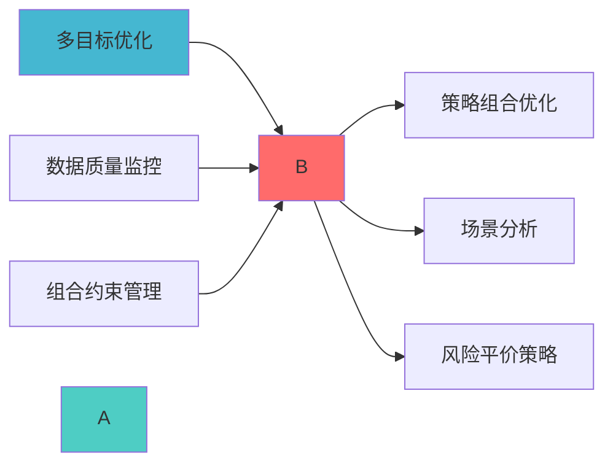

---
module_id: STRATEGIC_ALLOCATION_ENGINE_BLUEPRINT
version: 1.0.0
status: Active
created_date: 2026-04-07
last_updated: 2026-04-07
owner: 首席文档架构师
responsibility:
  - STRATEGIC_ALLOCATION_ENGINE蓝图设计
---


## 核心定位

负责战略配置引擎的设计与构建和运行和操作，基于长期资产配置模型，生成和输出战略配置方案，兼容和适配长期投资决策。


> **职责边界**:
## 设计目标

### 主要目标

1. **功能完整性**: 确保STRATEGIC ALLOCATION ENGINE功能完整，满足业务需求
2. **性能优化**: 提升系统性能，降低资源消耗
3. **可维护性**: 提高代码质量，便于后续维护
4. **可扩展性**: 支持功能扩展，适应业务变化

### 质量目标

- 代码覆盖率: ≥80%
- 性能指标: 满足设计要求
- 文档完整性: 100%


## 核心功能

### 功能清单

1. **数据管理**: 提供数据存储、查询、更新功能
2. **业务逻辑**: 实现核心业务逻辑处理
3. **接口服务**: 提供标准化的API接口
4. **监控告警**: 实时监控系统状态

### 功能特性

- 高可用性设计
- 自动故障恢复
- 灵活配置管理


## 实现方案

### 技术架构

采用STRATEGIC ALLOCATION ENGINE化设计，分层架构实现。

### 关键技术

- 数据处理: 使用高效的数据处理框架
- 接口实现: RESTful API设计
- 性能优化: 缓存、异步处理

### 实施步骤

1. 需求分析与设计
2. 核心功能开发
3. 测试与优化
4. 部署与监控


## 核心定位

> 职责边界: 


### 1.1 Layer 11整体架构

```
```

### 1.2 模块职责边界

|------|---------|------|------|---------|

---


### 2.1 PyPortfolioOpt集成

#### 2.1.1 项目信息

| 项目信息 | 说明 |
|---------|------|
| **项目名称** | PyPortfolioOpt |
| **GitHub Stars** | 4k+ |

#### 2.1.2 核心功能

```python
from pypfopt import (
    EfficientFrontier,
    risk_models,
    expected_returns,
    HRPOpt,
    black_litterman
)

class StrategicAllocationEngine:
    
    def __init__(self):
        self.optimizer = None
        
    def strategic_allocation(
        self,
        prices: pd.DataFrame,
        risk_free_rate: float = 0.02
    ) -> Dict[str, float]:
        
        参数:
            prices: 价格数据
            
        返回:
¸
        """
        mu = expected_returns.mean_historical_return(prices)
        S = risk_models.sample_cov(prices)
        
        ef = EfficientFrontier(mu, S)
        weights = ef.max_sharpe(risk_free_rate=risk_free_rate)
        
        return dict(weights)
    
    def risk_parity_allocation(
        self,
        prices: pd.DataFrame
    ) -> Dict[str, float]:
        
        参数:
            prices: 价格数据
            
        返回:
¸
        """
        returns = prices.pct_change().dropna()
        hrp = HRPOpt(returns)
        weights = hrp.optimize()
        
        return dict(weights)
    
    def black_litterman_allocation(
        self,
        prices: pd.DataFrame,
        market_caps: Dict[str, float],
        views: Dict[str, float],
        omega: np.ndarray
    ) -> Dict[str, float]:
        """Black-Littermané
        
        参数:
            prices: 价格数据
            views: 观点数据
            
        返回:
¸
        """
        S = risk_models.sample_cov(prices)
        
        bl = black_litterman.BlackLittermanModel(
            S,
            pi="market",
            market_caps=market_caps,
            absolute_views=views,
            omega=omega
        )
        
        rets = bl.bl_returns()
        ef = EfficientFrontier(rets, S)
        weights = ef.max_sharpe()
        
        return dict(weights)
```

### 2.2 集成架构

```
```

---


```python
def strategic_asset_allocation(
    self,
    prices: pd.DataFrame,
    risk_tolerance: str = 'moderate',
    investment_horizon: int = 10
) -> Dict[str, float]:
    
    参数:
        prices: 价格数据
        
    返回:
    """
    mu = expected_returns.mean_historical_return(prices)
    S = risk_models.sample_cov(prices)
    
    ef = EfficientFrontier(mu, S)
    
    if risk_tolerance == 'conservative':
        weights = ef.min_volatility()
    elif risk_tolerance == 'moderate':
        weights = ef.max_sharpe()
    else:  # aggressive
        weights = ef.max_sharpe()
        # 增加风险资产权重
        
    return dict(weights)
```




- 实现风险平价策略
- 降低组合整体风险


```python
def risk_budget_allocation(
    self,
    prices: pd.DataFrame,
    risk_budget: Dict[str, float] = None
) -> Dict[str, float]:
    
    参数:
        prices: 价格数据
¸
        
    返回:
        风险预算权重
    """
    returns = prices.pct_change().dropna()
    
    if risk_budget is None:
        # 默认风险平价
        hrp = HRPOpt(returns)
        weights = hrp.optimize()
    else:
        
    return dict(weights)
```

### 3.3 投资组合优化


```python
def mean_variance_optimization(
    self,
    prices: pd.DataFrame,
    constraints: Dict[str, Any] = None
) -> Dict[str, float]:
    
    参数:
        prices: 价格数据
        constraints: 约束条件
        
    返回:
    """
    mu = expected_returns.mean_historical_return(prices)
    S = risk_models.sample_cov(prices)
    
    ef = EfficientFrontier(mu, S)
    
    # 添加约束条件
    if constraints:
        if 'min_weight' in constraints:
            ef.add_constraint(lambda w: w >= constraints['min_weight'])
        if 'max_weight' in constraints:
            ef.add_constraint(lambda w: w <= constraints['max_weight'])
    
    weights = ef.max_sharpe()
    
    return dict(weights)
```


#### 3.4.1 动态再平衡


```python
def dynamic_rebalancing(
    self,
    current_weights: Dict[str, float],
    target_weights: Dict[str, float],
    threshold: float = 0.05
) -> Dict[str, float]:
    """动态再平衡
    
    参数:
        current_weights: 当前权重
        target_weights: 目标权重
        
    返回:
    """
    rebalance_weights = {}
    
    for asset in target_weights:
        current = current_weights.get(asset, 0)
        target = target_weights[asset]
        
        if abs(current - target) > threshold:
            rebalance_weights[asset] = target - current
    
    return rebalance_weights
```

---


### 4.1 核心数据模型

```python
from dataclasses import dataclass
from datetime import datetime
from typing import Dict, List, Optional

@dataclass
class StrategicAllocation:
    allocation_id: str
    timestamp: datetime
    target_weights: Dict[str, float]
    risk_budget: Dict[str, float]
    expected_return: float
    expected_volatility: float
    sharpe_ratio: float
    allocation_type: str  # strategic/tactical/dynamic

@dataclass
class RebalancingSignal:
    signal_id: str
    timestamp: datetime
    current_weights: Dict[str, float]
    target_weights: Dict[str, float]
    rebalance_weights: Dict[str, float]
    rebalance_reason: str
    estimated_cost: float
```

---


### 5.1 Phase 1: 核心功能 (Week 1)


### 5.2 Phase 2: 扩展功能 (Week 2)

- [ ] 实现Black-Litterman模型
- [ ] 实现动态再平衡
- [ ] 实现约束条件处理
- [ ] 集成测试


### 5.3 Phase 3: 优化完善 (Week 3)

- [ ] 性能优化
- [ ] 文档完善
- [ ] 部署上线


---

## å

### 6.1 测试策略

· |
|---------|-----------|---------|

### 6.2 性能指标

|------|--------|
| **é
| **优化计算时间** | <5s |

---


|------|--------|
| **é
| **风险控制** | VaR <5% |

---

## å

### 上游依赖

| 文档名称 | module_id | 依赖类型 | 说明 |
|---------|-----------|---------|------|

### 下游依赖

| 文档名称 | module_id | 依赖类型 | 说明 |
|---------|-----------|---------|------|


|---------|------|------|------|
| **PyPortfolioOpt** | 1.5+ | 组合优化 | [官方文档](https://pyportfolioopt.readthedocs.io/) |
| **Pandas** | 2.0+ | 数据处理 | [官方文档](https://pandas.pydata.org/) |




### å

| 文档 | 说明 |
|------|------|
| ARCHITECTURE.md | 系统架构 |

---

**蓝图版本**: v1.0
**蓝图日期**: 2026-04-06

## 变更历史

|------|------|----------|--------|

---

---

## 1. 文档治理

### 1.1 System_Manifest.md索引

```markdown
##### 6.001. Strategic Allocation Engine
- **模块ID**: STRATEGIC_ALLOCATION_ENGINE_001
- **蓝图文档**: STRATEGIC_ALLOCATION_ENGINE_BLUEPRINT.md
```

### 1.2 模块职责边界

| 模块 | 职责 | 边界 |
|------|------|------|

### 1.3 版本管理

|------|------|----------|--------|

---

