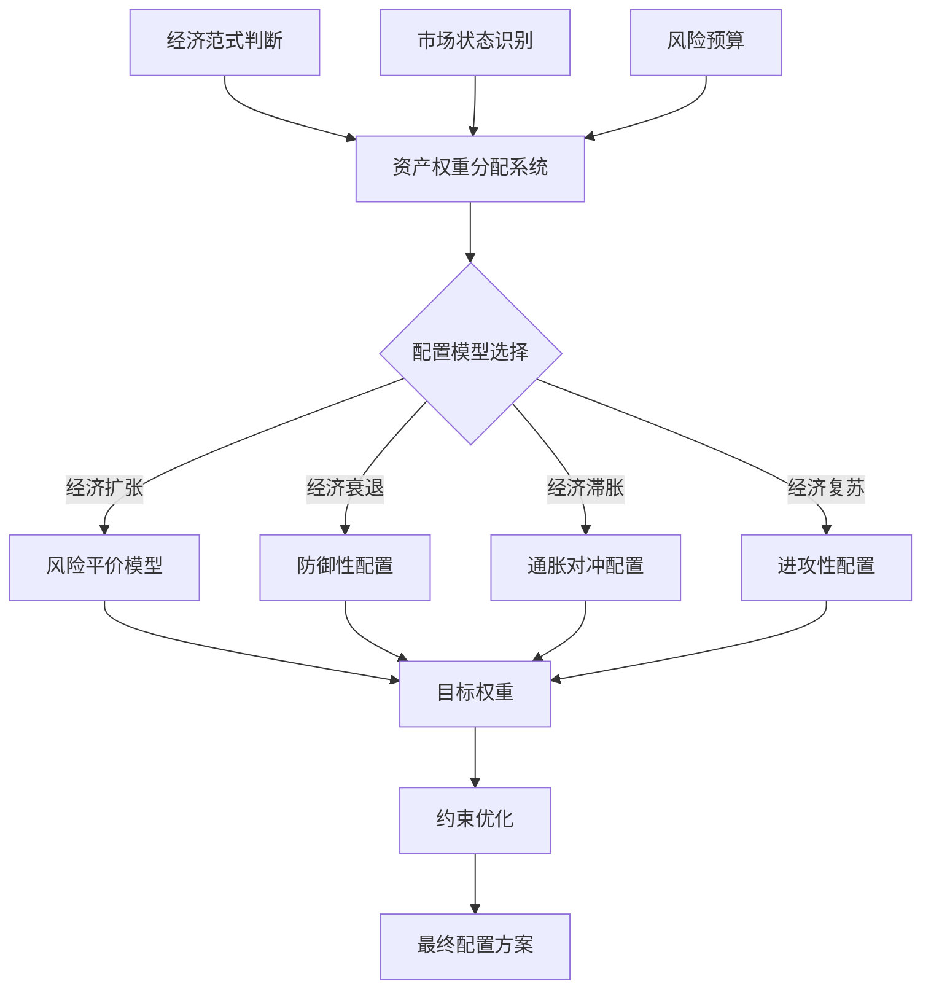

---
module_id: STRATEGIC_WEIGHTING_001
version: 1.0.0
status: Active
created_date: 2026-04-06
last_updated: 2026-04-06
owner: 首席架构师
standard_type: 专业量化机构蓝图
applicable_scope: 宏观配置层战略资产配置
compliance_level: 专业标准
parent_document: ../INDEX.md
implementation_status: 设计阶段
priority: P0
layer: "Layer 5 (宏观配置层) | 业务架构: 三级时间框架融合架构"
estimated_effort: 2.5周
open_source_dependency: cvxpy, pandas, numpy, scipy, PyPortfolioOpt
---

# 战略资产权重分配系统蓝图 v1.0

> **版本**: v1.0
> **创建日期**: 2026-04-06
> **核心定位**: 宏观配置层战略资产权重分配
> **索引**: `STRATEGIC_WEIGHTING_001`
> **开发周期**: 2.5周

---

## 📋 执行摘要

战略资产权重分配系统是清风量化系统宏观配置层的核心模块，负责根据经济范式判断和市场状态，制定长期战略资产配置方案，为季度调仓决策提供目标配置基准。

### 核心价值

- **全天候配置**: 基于桥水全天候模型的资产配置
- **动态调整**: 根据经济范式动态调整权重
- **风险平价**: 实现风险平价配置
- **多目标优化**: 平衡收益、风险、流动性多个目标

---

## 🎯 模块定位与职责

### 核心职责

| 职责类别 | 具体职责 | 输出产物 |
|---------|---------|---------|
| **权重计算** | 计算战略资产权重 | 目标权重方案 |
| **风险平价** | 实现风险平价配置 | 风险平价权重 |
| **优化求解** | 多目标优化求解 | 最优权重 |
| **约束处理** | 处理配置约束 | 约束满足权重 |

---

## 🏗️ 架构设计

### 资产配置框架



---

## 🔧 关键组件设计

### 1. 风险平价模型

```python
from typing import Dict, Any
import pandas as pd
import numpy as np
import cvxpy as cp

class RiskParityModel:
    """风险平价模型"""
    
    def __init__(self):
        self.target_risk_contribution = None
        
    def optimize(self,
                covariance_matrix: pd.DataFrame,
                target_risk: Dict[str, float] = None) -> Dict[str, float]:
        """优化风险平价权重"""
        n_assets = len(covariance_matrix)
        
        # 如果没有指定目标风险贡献，则平均分配
        if target_risk is None:
            target_risk_contribution = np.ones(n_assets) / n_assets
        else:
            target_risk_contribution = np.array(list(target_risk.values()))
        
        # 定义优化变量
        weights = cp.Variable(n_assets)
        
        # 计算组合风险
        portfolio_risk = cp.quad_form(weights, covariance_matrix.values)
        
        # 计算风险贡献
        marginal_risk = covariance_matrix.values @ weights
        risk_contribution = cp.multiply(weights, marginal_risk) / portfolio_risk
        
        # 目标函数：最小化风险贡献与目标风险贡献的差异
        objective = cp.Minimize(
            cp.sum_squares(risk_contribution - target_risk_contribution)
        )
        
        # 约束条件
        constraints = [
            cp.sum(weights) == 1,  # 权重和为1
            weights >= 0,  # 不允许做空
            weights <= 0.40  # 单资产最大权重40%
        ]
        
        # 求解
        problem = cp.Problem(objective, constraints)
        problem.solve()
        
        # 返回权重
        optimal_weights = dict(zip(
            covariance_matrix.columns,
            weights.value
        ))
        
        return optimal_weights


class AllWeatherModel:
    """全天候配置模型"""
    
    def __init__(self):
        # 四种经济环境
        self.economic_environments = {
            'GROWTH': '经济增长',
            'INFLATION': '通胀上升',
            'DEFLATION': '通缩衰退',
            'RECESSION': '经济衰退'
        }
        
        # 各环境下的资产权重
        self.environment_weights = {
            'GROWTH': {
                '股票': 0.30,
                '债券': 0.15,
                '商品': 0.40,
                '现金': 0.15
            },
            'INFLATION': {
                '股票': 0.20,
                '债券': 0.10,
                '商品': 0.50,
                '现金': 0.20
            },
            'DEFLATION': {
                '股票': 0.10,
                '债券': 0.50,
                '商品': 0.10,
                '现金': 0.30
            },
            'RECESSION': {
                '股票': 0.10,
                '债券': 0.40,
                '商品': 0.10,
                '现金': 0.40
            }
        }
        
    def allocate(self,
                economic_regime: str,
                regime_probability: float) -> Dict[str, float]:
        """根据经济范式分配权重"""
        # 获取基准权重
        base_weights = self.environment_weights.get(economic_regime, 
                                                   self.environment_weights['GROWTH'])
        
        # 根据概率调整权重
        adjusted_weights = {}
        for asset, weight in base_weights.items():
            adjusted_weights[asset] = weight * regime_probability
        
        # 归一化
        total_weight = sum(adjusted_weights.values())
        if total_weight > 0:
            adjusted_weights = {
                asset: weight / total_weight
                for asset, weight in adjusted_weights.items()
            }
        
        return adjusted_weights
```

### 2. 多目标优化器

```python
from typing import Dict, Any, List
import pandas as pd
import numpy as np
import cvxpy as cp

class MultiObjectiveOptimizer:
    """多目标优化器"""
    
    def __init__(self):
        self.objectives = {
            'return': self._maximize_return,
            'risk': self._minimize_risk,
            'sharpe': self._maximize_sharpe,
            'diversification': self._maximize_diversification
        }
        
    def optimize(self,
                expected_returns: pd.Series,
                covariance_matrix: pd.DataFrame,
                objective_weights: Dict[str, float],
                constraints: Dict[str, Any]) -> Dict[str, float]:
        """多目标优化"""
        n_assets = len(expected_returns)
        
        # 定义优化变量
        weights = cp.Variable(n_assets)
        
        # 计算各目标
        portfolio_return = expected_returns.values @ weights
        portfolio_risk = cp.sqrt(cp.quad_form(weights, covariance_matrix.values))
        
        # 构建综合目标函数
        objective_value = 0
        
        if 'return' in objective_weights:
            objective_value += objective_weights['return'] * portfolio_return
        
        if 'risk' in objective_weights:
            objective_value -= objective_weights['risk'] * portfolio_risk
        
        if 'sharpe' in objective_weights:
            risk_free_rate = 0.02
            objective_value += objective_weights['sharpe'] * (portfolio_return - risk_free_rate) / portfolio_risk
        
        # 目标函数
        objective = cp.Maximize(objective_value)
        
        # 约束条件
        constraint_list = [
            cp.sum(weights) == 1,
            weights >= constraints.get('min_weight', 0),
            weights <= constraints.get('max_weight', 1)
        ]
        
        # 行业约束
        if 'sector_constraints' in constraints:
            for sector, (min_weight, max_weight) in constraints['sector_constraints'].items():
                sector_mask = self._get_sector_mask(sector)
                constraint_list.append(cp.sum(weights[sector_mask]) >= min_weight)
                constraint_list.append(cp.sum(weights[sector_mask]) <= max_weight)
        
        # 求解
        problem = cp.Problem(objective, constraint_list)
        problem.solve()
        
        # 返回权重
        optimal_weights = dict(zip(
            expected_returns.index,
            weights.value
        ))
        
        return optimal_weights
    
    def _maximize_return(self, weights, expected_returns):
        """最大化收益"""
        return expected_returns @ weights
    
    def _minimize_risk(self, weights, covariance_matrix):
        """最小化风险"""
        return cp.quad_form(weights, covariance_matrix)
    
    def _maximize_sharpe(self, weights, expected_returns, covariance_matrix, risk_free_rate=0.02):
        """最大化夏普比率"""
        portfolio_return = expected_returns @ weights
        portfolio_risk = cp.sqrt(cp.quad_form(weights, covariance_matrix))
        return (portfolio_return - risk_free_rate) / portfolio_risk
    
    def _maximize_diversification(self, weights, covariance_matrix):
        """最大化分散度"""
        n = len(weights)
        return -cp.sum_squares(weights - 1/n)
    
    def _get_sector_mask(self, sector: str) -> np.ndarray:
        """获取行业掩码"""
        # 简化实现，实际应根据行业分类映射
        return np.ones(100, dtype=bool)
```

### 3. 约束处理器

```python
class ConstraintHandler:
    """约束处理器"""
    
    def __init__(self):
        self.constraints = {}
        
    def add_constraint(self, constraint_type: str, constraint_params: Dict[str, Any]) -> None:
        """添加约束"""
        self.constraints[constraint_type] = constraint_params
        
    def apply_constraints(self,
                         weights: Dict[str, float],
                         portfolio_value: float) -> Dict[str, float]:
        """应用约束"""
        adjusted_weights = weights.copy()
        
        # 应用权重约束
        if 'weight_bounds' in self.constraints:
            min_weight = self.constraints['weight_bounds'].get('min', 0)
            max_weight = self.constraints['weight_bounds'].get('max', 1)
            
            for asset in adjusted_weights:
                adjusted_weights[asset] = np.clip(
                    adjusted_weights[asset],
                    min_weight,
                    max_weight
                )
        
        # 应用流动性约束
        if 'liquidity' in self.constraints:
            min_liquidity = self.constraints['liquidity'].get('min', 0)
            
            for asset, weight in adjusted_weights.items():
                asset_value = weight * portfolio_value
                # 检查流动性是否足够
                # 如果不足，降低权重
                # adjusted_weights[asset] = ...
                pass
        
        # 归一化
        total_weight = sum(adjusted_weights.values())
        if total_weight > 0:
            adjusted_weights = {
                asset: weight / total_weight
                for asset, weight in adjusted_weights.items()
            }
        
        return adjusted_weights
```

---

## 🚀 实施要点

### 阶段1：风险平价模型开发（第1周）

**任务**:
1. ✅ 实现风险平价优化
2. ✅ 实现全天候配置
3. ✅ 实现协方差矩阵估计
4. ✅ 编写单元测试

---

### 阶段2：多目标优化器开发（第1-2周）

**任务**:
1. ✅ 实现收益最大化
2. ✅ 实现风险最小化
3. ✅ 实现夏普比率最大化
4. ✅ 实现分散度最大化
5. ✅ 编写单元测试

---

### 阶段3：约束处理器开发（第2-3周）

**任务**:
1. ✅ 实现权重约束
2. ✅ 实现流动性约束
3. ✅ 实现行业约束
4. ✅ 集成测试

---

## 📈 性能指标

### 配置质量指标

| 指标 | 目标值 |
|------|--------|
| **风险贡献均衡度** | < 10% |
| **夏普比率提升** | > 0.2 |
| **分散度** | > 0.7 |
| **约束满足率** | 100% |

---

## 🔗 相关文档

- [季度调仓决策系统蓝图](./QUARTERLY_REBALANCE_BLUEPRINT.md)
- [经济范式判断引擎蓝图](./ECONOMIC_REGIME_ENGINE_BLUEPRINT.md)
- [专业多时间框架策略架构](../../01_FRAMEWORK/PROFESSIONAL_MULTI_TIMEFRAME_ARCHITECTURE.md)

---

## 📝 变更历史

| 版本 | 日期 | 变更内容 | 作者 |
|------|------|---------|------|
| v1.0.0 | 2026-04-06 | 初始版本创建 | 首席架构师 |

---

**蓝图状态**: ✅ 设计完成
**下一步**: 开始实施阶段1 - 风险平价模型开发
---

## 1. 文档治理

### 1.1 System_Manifest.md索引

```markdown
#### Layer 5: 宏观配置层
##### 6.001. Strategic Weighting
- **模块ID**: STRATEGIC_WEIGHTING_001
- **蓝图文档**: [STRATEGIC_WEIGHTING_BLUEPRINT.md](../05_IMPLEMENTATION/06_CONSTRUCTION_DOCS/01_BLUEPRINTS/STRATEGIC_WEIGHTING_BLUEPRINT.md)
- **技术规格书**: 待创建
- **职责**: 宏观配置层战略资产配置
- **状态**: Active
```

### 1.2 模块职责边界

| 模块 | 职责 | 边界 |
|------|------|------|
| **Strategic Weighting** | 宏观配置层战略资产配置 | **核心模块** |

### 1.3 版本管理

| 版本 | 日期 | 变更内容 | 变更人 |
|------|------|----------|--------|
| v1.0.0 | 2026-04-06 | 初始版本创建 | 首席蓝图架构师 |

---

**蓝图版本**: v1.0.0 | **创建日期**: 2026-04-06 | **状态**: Active
