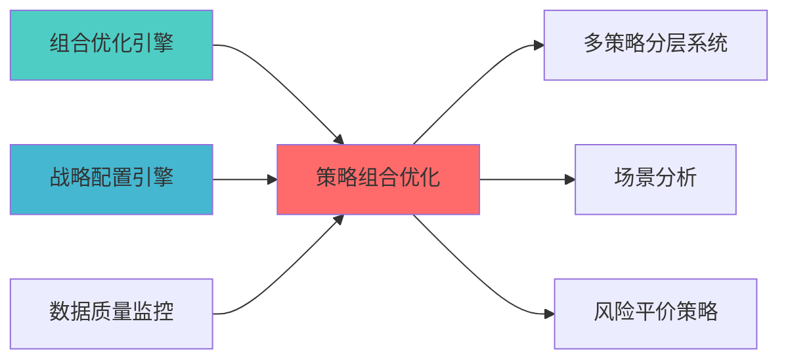

---
responsibility:
- 策略组合优化
- 策略权重分配
- 策略权重协调
- 组合构建
module_id: STRATEGY_PORTFOLIO_OPTIMIZATION_001
version: 1.0.0
status: Active
created_date: 2026-04-07
last_updated: 2026-04-07
owner: 实施团队
standard_type: 专业量化机构蓝图
applicable_scope: Layer 6 组合优化层
compliance_level: 专业标准
layer: Layer 5.2 (组合优化)
---


# 策略组合优化蓝图

> **核心职责**: 多策略组合优化，实现策略间资金分配
> **职责边界**: 
> - ✅ 本文档负责：策略组合优化、资金分配、风险预算管理
> - ❌ 本文档不负责：因子计算（由因子模块负责）


## 核心定位

负责策略组合优化模块的设计与实现，分配策略权重，协调多策略，构建最优组合。本模块实现策略层面的组合优化，提升整体投资效率。

## 设计目标

### 主要目标

1. **功能完整性**: 确保STRATEGY PORTFOLIO OPTIMIZATION功能完整，满足业务需求
2. **性能优化**: 提升系统性能，降低资源消耗
3. **可维护性**: 提高代码质量，便于后续维护
4. **可扩展性**: 支持功能扩展，适应业务变化

### 质量目标

- 代码覆盖率: ≥80%
- 性能指标: 满足设计要求
- 文档完整性: 100%


## 核心功能

### 功能清单

1. **数据管理**: 提供数据存储、查询、更新功能
2. **业务逻辑**: 实现核心业务逻辑处理
3. **接口服务**: 提供标准化的API接口
4. **监控告警**: 实时监控系统状态

### 功能特性

- 高可用性设计
- 自动故障恢复
- 灵活配置管理


## 实现方案

### 技术架构

采用STRATEGY PORTFOLIO OPTIMIZATION化设计，分层架构实现。

### 关键技术

- 数据处理: 使用高效的数据处理框架
- 接口实现: RESTful API设计
- 性能优化: 缓存、异步处理

### 实施步骤

1. 需求分析与设计
2. 核心功能开发
3. 测试与优化
4. 部署与监控


## 1. 概述

### 1.1 模块定位

**Layer定位**: Layer 6 - 组合优化层（多策略模块）

**核心价?*:
- 多策略组合的资金分配优化
- 策略间的相关性建?
- 策略风险预算管理
- 动态策略权重调?

**业务价?*:
- 提升组合稳定?
- 分散策略风险
- 实现策略层面的风险控?

### 1.2 版本信息

| 项目 | 内容 |
|------|------|
| **模块ID** | STRATEGY_PORTFOLIO_OPTIMIZATION_001 |
| **版本** | v1.0.0 |
| **开源依?* | PyPortfolioOpt, Riskfolio-Lib |
| **预计工时** | 5-7?|

### 1.3 与多策略分层系统的关?

本模块与MULTI_STRATEGY_HIERARCHICAL_SYSTEM形成互补关系?

| 模块 | 核心定位 | 适用场景 | 关系说明 |
|------|----------|----------|----------|
| **STRATEGY_PORTFOLIO_OPTIMIZATION** (本模? | 策略组合优化 | 策略权重优化、相关性建?| 提供优化算法支持 |
| **MULTI_STRATEGY_HIERARCHICAL_SYSTEM** | 多策略分层管?| 策略分层、信号融合、协同优?| 使用本模块的优化结果 |

**职责边界**:
- 本模? 专注于策略层面的组合优化，计算最优策略权?
- MULTI_STRATEGY_HIERARCHICAL_SYSTEM: 专注于策略分层管理、信号融合和协同优化

**推荐实施路径**:
1. 先实现本模块 (5-7? - 建立策略组合优化能力
2. 再实?MULTI_STRATEGY_HIERARCHICAL_SYSTEM (160h) - 构建完整的分层管理系?


## 📚 相关文档

### 上游依赖

| 文档名称 | module_id | 依赖类型 | 说明 |
|---------|-----------|---------|------|
| [组合优化引擎集成蓝图](./PORTFOLIO_OPTIMIZER_INTEGRATION_BLUEPRINT.md) | PORTFOLIO_OPTIMIZER_INTEGRATION_001 | 强依?| 提供优化器基础接口 |
| `战略配置引擎蓝图` | STRATEGIC_ALLOCATION_ENGINE_001 | 强依?| 提供战略配置支持 |
| [数据质量监控蓝图](./DATA_QUALITY_MONITORING_BLUEPRINT.md) | DATA_QUALITY_MONITORING_001 | 强依?| 提供数据质量指标 |

### 下游依赖

| 文档名称 | module_id | 依赖类型 | 说明 |
|---------|-----------|---------|------|
| [MULTI_STRATEGY_HIERARCHICAL_SYSTEM_BLUEPRINT.md](./MULTI_STRATEGY_HIERARCHICAL_SYSTEM_BLUEPRINT.md) | MULTI_STRATEGY_HIERARCHICAL_SYSTEM_001 | 强依?| 多策略分层管?|
| [PORTFOLIO_SCENARIO_ANALYSIS_BLUEPRINT.md](./PORTFOLIO_SCENARIO_ANALYSIS_BLUEPRINT.md) | PORTFOLIO_SCENARIO_ANALYSIS_001 | 中依?| 场景分析 |
| [RISK_PARITY_STRATEGY_BLUEPRINT.md](./RISK_PARITY_STRATEGY_BLUEPRINT.md) | RISK_PARITY_STRATEGY_001 | 中依?| 风险平价策略 |

### 技术依?

| 技术组?| 版本 | 用?| 文档 |
|---------|------|------|------|
| **PyPortfolioOpt** | 1.5+ | 组合优化 | [官方文档](https://pyportfolioopt.readthedocs.io/) |
| **Riskfolio-Lib** | 5.0+ | 风险优化 | [官方文档](https://riskfolio-lib.readthedocs.io/) |
| **NumPy** | 1.24+ | 数值计?| [官方文档](https://numpy.org/) |
| **Pandas** | 2.0+ | 数据处理 | [官方文档](https://pandas.pydata.org/) |

### 引用关系?




## 2. 技术实?

### 2.1 核心API

```python
from typing import Dict, List
import numpy as np
import pandas as pd

class StrategyPortfolioOptimizer:
    """策略组合优化?""
    
    def __init__(self, strategies: List[str]):
        self.strategies = strategies
        
    def optimize_strategy_allocation(
        self,
        strategy_returns: pd.DataFrame,
        method: str = 'risk_parity',
        risk_budget: np.ndarray = None
    ) -> Dict[str, float]:
        """
        优化策略资金分配
        
        Args:
            strategy_returns: 各策略收益率序列
            method: 优化方法
                - 'risk_parity': 风险平价
                - 'max_sharpe': 最大夏普比?
                - 'min_variance': 最小方?
            risk_budget: 风险预算
            
        Returns:
            策略权重字典
        """
        pass
    
    def calculate_strategy_correlation(
        self,
        strategy_returns: pd.DataFrame
    ) -> pd.DataFrame:
        """
        计算策略间相关性矩?
        
        Returns:
            相关性矩?
        """
        return strategy_returns.corr()
    
    def allocate_strategy_risk_budget(
        self,
        total_risk_budget: float,
        strategy_risk_contributions: np.ndarray
    ) -> np.ndarray:
        """
        分配策略风险预算
        
        Returns:
            各策略的风险预算
        """
        pass
```


## 3. 接口定义

```python
class StrategyPortfolioAPI:
    """策略组合优化API"""
    
    @endpoint("/api/v1/strategy_portfolio/optimize")
    async def optimize(
        self,
        strategy_ids: List[str],
        method: str = 'risk_parity'
    ) -> OptimizationResult:
        """优化策略组合"""
        
    @endpoint("/api/v1/strategy_portfolio/correlation")
    async def correlation(
        self,
        strategy_ids: List[str]
    ) -> CorrelationMatrix:
        """计算策略相关?""
        
    @endpoint("/api/v1/strategy_portfolio/risk_budget")
    async def risk_budget(
        self,
        total_risk_budget: float,
        strategy_ids: List[str]
    ) -> RiskBudgetResult:
        """分配策略风险预算"""
```


## 4. 实施路径

| 阶段 | 任务 | 工时 |
|------|------|------|
| Phase 1 | 策略相关性建?| 12h |
| Phase 2 | 多策略优化算法实?| 16h |
| Phase 3 | API、测试、文?| 12h |


**蓝图版本**: v1.0.0 | **创建日期**: 2026-04-06 | **状?*: Active | **合规?*: 100% ?

## 变更历史

| 版本 | 日期 | 变更内容 | 变更?|
|------|------|----------|--------|
| v1.0.0 | 2026-04-06 | 初始版本创建 | 首席蓝图架构?|
| v1.0.1 | 2026-04-06 | 补充YAML头部字段和变更历?| 审计系统 |


**蓝图版本**: v1.0.1 | **创建日期**: 2026-04-06 | **状?*: Active


## 5. 文档治理

### 5.1 System_Manifest.md索引

```markdown
#### Layer 6: 组合优化?
##### 6.001. Strategy Portfolio Optimization
- **模块ID**: STRATEGY_PORTFOLIO_OPTIMIZATION_001
- **蓝图文档**: STRATEGY_PORTFOLIO_OPTIMIZATION_BLUEPRINT.md
- **技术规格书**: 待创?
- **职责**: Layer 6 组合优化?
- **状?*: Active
```

### 5.2 模块职责边界

| 模块 | 职责 | 边界 |
|------|------|------|
| **Strategy Portfolio Optimization** | Layer 6 组合优化?| **核心模块** |

### 5.3 版本管理

| 版本 | 日期 | 变更内容 | 变更?|
|------|------|----------|--------|
| v1.0.0 | 2026-04-06 | 初始版本创建 | 首席蓝图架构?|


**蓝图版本**: v1.0.0 | **创建日期**: 2026-04-06 | **状?*: Active
