---
responsibility:
  - 策略选择
  - 策略排名
  - 策略评估
  - 策略决策

module_id: STRATEGY_SELECTION_001
version: 1.0.0
status: Active
created_date: 2026-04-07
last_updated: 2026-04-07
owner: 实施团队
standard_type: 专业量化机构蓝图
applicable_scope: Layer 3 策略å±?
compliance_level: 专业标准
layer: "Layer 3 (策略å±?"
---

# 策略排名与选择系统技术蓝å›?

## 核心定位

负责策略选择，基于策略评估和预测，选择最优策略组合，提升投资决策质量。


> **核心职责**: 根据市场环境动态选择最优策略组å?
> **职责边界**: 
> - âœ?本文档负责：策略评分、智能排名、动态选择
> - â?本文档不负责：因子计算（由因子模块负责）


## 一、设计目标与约束

### 1.1 核心设计目标

| 目标 | 优先?| 技术实?|
|------|--------|----------|
| **多维度评分体?* | P0 | 收益、风险、稳定性、适应性等20+维度评分 |
| **动态权重调?* | P0 | 基于市场状态、风险偏好动态调整评分权?|
| **策略相关性分?* | P1 | 收益相关性矩阵、风险分散度计算 |
| **AI辅助决策** | P1 | AI推荐策略组合、风险评估、市场匹配度分析 |
| **实时性能监控** | P2 | 策略运行状态监控、性能衰减检?|
| **用户友好界面** | P2 | 可视化排名仪表盘、自然语言策略推荐 |

### 1.2 技术约束与原则

1. **客观公正原则**：评分标准透明可解释，避免黑箱决策
2. **动态适应性原?*：评分权重随市场状态、用户风险偏好动态调?
3. **风险分散原则**：避免选择高度相关的策略组?
4. **持续优化原则**：基于实盘表现持续更新策略评?
5. **用户友好原则**：不懂编程的用户也能理解评分逻辑和推荐理?

### 1.3 与现有系统集?

| 已有模块 | 集成方式 | 接口定义 |
|----------|----------|----------|
| **BatchEvaluation系统** | 绩效数据?| 获取策略历史绩效数据 |
| **ParameterOptimization系统** | 参数优化结果 | 获取最优参数配?|
| **StrategyEngine核心** | 策略元数?| 获取策略类型、参数空间等信息 |
| **MarketStateDetector** | 市场状态输?| 获取当前市场状态（牛市/熊市/震荡市） |

## 二、系统架构设?

### 2.1 整体架构?

```
策略排名与选择系统四层架构?
┌─────────────────────────────────────────────────────────?
?                  用户交互?(User Interaction)          ?
├─────────────────────────────────────────────────────────?
?1. RankingDashboard - 排名仪表?                       ?
?2. RecommendationEngine - 推荐引擎                       ?
?3. NaturalLanguageExplainer - 自然语言解释?            ?
└─────────────────────────────────────────────────────────?
                              ?
┌─────────────────────────────────────────────────────────?
?               决策逻辑?(Decision Logic)               ?
├─────────────────────────────────────────────────────────?
?1. MultiCriteriaEvaluator - 多准则评估器                 ?
?2. WeightOptimizer - 权重优化?                         ?
?3. PortfolioConstructor - 组合构建?                    ?
?4. RiskDiversifier - 风险分散?                         ?
└─────────────────────────────────────────────────────────?
                              ?
┌─────────────────────────────────────────────────────────?
?               评分计算?(Scoring Layer)                ?
├─────────────────────────────────────────────────────────?
?1. PerformanceScorer - 绩效评分?                       ?
?2. RiskScorer - 风险评分?                              ?
?3. StabilityScorer - 稳定性评分器                        ?
?4. AdaptabilityScorer - 适应性评分器                     ?
?5. ComplexityScorer - 复杂度评分器                       ?
└─────────────────────────────────────────────────────────?
                              ?
┌─────────────────────────────────────────────────────────?
?               数据源层 (Data Sources)                   ?
├─────────────────────────────────────────────────────────?
?1. BatchEvaluationResults - 批量评估结果                 ?
?2. RealTimePerformance - 实时绩效数据                    ?
?3. MarketStateData - 市场状态数?                       ?
?4. UserPreferences - 用户偏好数据                        ?
└─────────────────────────────────────────────────────────?
```

### 2.2 核心组件职责

**MultiCriteriaEvaluator (多准则评估器)**
- 整合各维度评分，计算综合得分
- 实现TOPSIS、AHP等多准则决策算法
- 处理评分标准化和归一?

**WeightOptimizer (权重优化?**
- 基于市场状态动态调整评分权?
- 考虑用户风险偏好个性化权重
- 使用优化算法寻找最优权重分?

**PerformanceScorer (绩效评分?**
- 计算收益类指标评分（夏普比率、年化收益、胜率等?
- 时间衰减加权（近期绩效权重更高）
- 统计显著性检?

**RiskScorer (风险评分?**
- 计算风险类指标评分（最大回撤、波动率、下行风险等?
- 极端风险事件检?
- 风险调整收益计算

**StabilityScorer (稳定性评分器)**
- 评估策略绩效稳定?
- 收益序列自相关性分?
- 参数敏感性测?

**AdaptabilityScorer (适应性评分器)**
- 评估策略对不同市场状态的适应?
- 市场状态切换检?
- 策略鲁棒性分?

## 三、核心组件设?

### 3.1 MultiCriteriaEvaluator 详细设计

```python
class TOPSISEvaluator:
    """TOPSIS多准则决策评估器
    
    索引: STRAT.SELECTION.001-M01
    职责: 使用TOPSIS算法进行多维度策略排?
    特点: 客观权重分配，避免主观偏?
    """
    
    def __init__(self, criteria_weights: Dict[str, float] = None):
        self.criteria_weights = criteria_weights or self._default_weights()
        self.normalizer = MinMaxNormalizer()
        
    def evaluate(self, strategies: List[Strategy], 
                criteria_matrix: pd.DataFrame) -> RankingResult:
        """使用TOPSIS算法评估策略
        
        TOPSIS（Technique for Order Preference by Similarity to Ideal Solution）：
        1. 构建决策矩阵
        2. 标准化决策矩?
        3. 计算加权标准化矩?
        4. 确定正理想解和负理想?
        5. 计算各方案到理想解的距离
        6. 计算相对接近度并排序
        """
        
        # 1. 构建决策矩阵（策?× 准则?
        decision_matrix = self._build_decision_matrix(strategies, criteria_matrix)
        
        # 2. 标准化决策矩阵（消除量纲影响?
        normalized_matrix = self.normalizer.normalize(decision_matrix)
        
        # 3. 计算加权标准化矩?
        weighted_matrix = self._apply_weights(normalized_matrix)
        
        # 4. 确定正理想解和负理想?
        positive_ideal, negative_ideal = self._calculate_ideal_solutions(weighted_matrix)
        
        # 5. 计算距离
        distances_to_positive = self._calculate_distances(weighted_matrix, positive_ideal)
        distances_to_negative = self._calculate_distances(weighted_matrix, negative_ideal)
        
        # 6. 计算相对接近?
        closeness_scores = distances_to_negative / (distances_to_positive + distances_to_negative)
        
        # 7. 排序并生成结?
        ranking = self._create_ranking(strategies, closeness_scores, criteria_matrix)
        
        return RankingResult(
            ranking=ranking,
            closeness_scores=closeness_scores,
            decision_matrix=decision_matrix,
            weighted_matrix=weighted_matrix,
            ideal_solutions={
                'positive': positive_ideal,
                'negative': negative_ideal
            }
        )
        
    def _default_weights(self) -> Dict[str, float]:
        """默认评分权重分配"""
        return {
            'sharpe_ratio': 0.25,      # 夏普比率：收益风险平?
            'max_drawdown': 0.20,       # 最大回撤：风险控制
            'annual_return': 0.15,      # 年化收益：盈利能?
            'win_rate': 0.10,           # 胜率：交易质?
            'stability_score': 0.10,    # 稳定性：绩效一?
            'adaptability_score': 0.10, # 适应性：市场环境适应能力
            'complexity_score': 0.05,   # 复杂度：策略简?
            'turnover': 0.05           # 换手率：交易成本考虑
        }
        
    def _apply_weights(self, normalized_matrix: pd.DataFrame) -> pd.DataFrame:
        """应用权重到标准化矩阵"""
        weighted_matrix = normalized_matrix.copy()
        
        for criterion in weighted_matrix.columns:
            if criterion in self.criteria_weights:
                weighted_matrix[criterion] *= self.criteria_weights[criterion]
                
        return weighted_matrix
        
    def _calculate_ideal_solutions(self, weighted_matrix: pd.DataFrame) -> Tuple[pd.Series, pd.Series]:
        """计算正理想解和负理想?
        
        对于效益型指标（越大越好）：正理想解取最大值，负理想解取最?
        对于成本型指标（越小越好）：正理想解取最小值，负理想解取最?
        """
        # 定义指标类型
        benefit_criteria = ['sharpe_ratio', 'annual_return', 'win_rate', 
                          'stability_score', 'adaptability_score']
        cost_criteria = ['max_drawdown', 'complexity_score', 'turnover']
        
        positive_ideal = pd.Series()
        negative_ideal = pd.Series()
        
        for criterion in weighted_matrix.columns:
            if criterion in benefit_criteria:
                positive_ideal[criterion] = weighted_matrix[criterion].max()
                negative_ideal[criterion] = weighted_matrix[criterion].min()
            elif criterion in cost_criteria:
                positive_ideal[criterion] = weighted_matrix[criterion].min()
                negative_ideal[criterion] = weighted_matrix[criterion].max()
            else:
                # 默认按效益型指标处理
                positive_ideal[criterion] = weighted_matrix[criterion].max()
                negative_ideal[criterion] = weighted_matrix[criterion].min()
                
        return positive_ideal, negative_ideal
```

### 3.2 WeightOptimizer 详细设计

```python
class DynamicWeightOptimizer:
    """动态权重优化器
    
    索引: STRAT.SELECTION.001-M02
    职责: 基于市场状态和用户偏好动态调整评分权?
    特点: 自适应权重分配，提高策略选择准确?
    """
    
    def __init__(self, market_state_detector: MarketStateDetector,
                user_preference_store: UserPreferenceStore):
        self.market_state_detector = market_state_detector
        self.user_preference_store = user_preference_store
        self.weight_history = []
        
    def optimize_weights(self, strategies: List[Strategy], 
                        historical_performance: pd.DataFrame) -> Dict[str, float]:
        """优化评分权重
        
        基于以下因素动态调整权重：
        1. 当前市场?
        2. 用户风险偏好
        3. 策略历史表现
        4. 经济周期阶段
        """
        
        # 1. 获取当前市场?
        market_state = self.market_state_detector.get_current_state()
        
        # 2. 获取用户风险偏好
        user_prefs = self.user_preference_store.get_preferences()
        
        # 3. 计算基础权重（基于市场状态）
        base_weights = self._calculate_base_weights(market_state)
        
        # 4. 调整权重（基于用户偏好）
        adjusted_weights = self._adjust_for_user_preferences(base_weights, user_prefs)
        
        # 5. 学习调整（基于历史表现）
        learned_weights = self._learn_from_history(adjusted_weights, historical_performance)
        
        # 6. 归一化确保权重和?
        final_weights = self._normalize_weights(learned_weights)
        
        # 记录权重历史
        self.weight_history.append({
            'timestamp': datetime.now(),
            'market_state': market_state,
            'weights': final_weights.copy()
        })
        
        return final_weights
        
    def _calculate_base_weights(self, market_state: MarketState) -> Dict[str, float]:
        """基于市场状态计算基础权重"""
        
        # 不同市场状态的权重偏好
        weight_templates = {
            'bull_market': {
                'sharpe_ratio': 0.20,
                'max_drawdown': 0.15,
                'annual_return': 0.25,  # 牛市更看重收?
                'win_rate': 0.10,
                'stability_score': 0.10,
                'adaptability_score': 0.10,
                'complexity_score': 0.05,
                'turnover': 0.05
            },
            'bear_market': {
                'sharpe_ratio': 0.25,
                'max_drawdown': 0.25,   # 熊市更看重风险控?
                'annual_return': 0.10,
                'win_rate': 0.10,
                'stability_score': 0.15,
                'adaptability_score': 0.10,
                'complexity_score': 0.05,
                'turnover': 0.00       # 熊市减少交易频率
            },
            'range_market': {
                'sharpe_ratio': 0.20,
                'max_drawdown': 0.20,
                'annual_return': 0.15,
                'win_rate': 0.15,      # 震荡市更看重胜率
                'stability_score': 0.15,
                'adaptability_score': 0.10,
                'complexity_score': 0.05,
                'turnover': 0.00
            },
            'high_volatility': {
                'sharpe_ratio': 0.25,
                'max_drawdown': 0.30,   # 高波动市场特别重视风险控?
                'annual_return': 0.10,
                'win_rate': 0.10,
                'stability_score': 0.15,
                'adaptability_score': 0.05,
                'complexity_score': 0.05,
                'turnover': 0.00
            }
        }
        
        # 根据市场状态选择权重模板
        template = weight_templates.get(market_state.name, weight_templates['range_market'])
        
        # 根据市场状态强度调整权?
        strength_factor = market_state.strength  # 0-1之间的强?
        adjusted_weights = {}
        
        for criterion, base_weight in template.items():
            if criterion in ['max_drawdown', 'stability_score']:
                # 风险相关指标随市场波动强度增加而增?
                adjusted = base_weight * (1 + strength_factor * 0.5)
            elif criterion == 'annual_return':
                # 收益指标在强趋势市场增加权重
                if market_state.name in ['bull_market', 'bear_market']:
                    adjusted = base_weight * (1 + strength_factor * 0.3)
                else:
                    adjusted = base_weight
            else:
                adjusted = base_weight
                
            adjusted_weights[criterion] = min(adjusted, 0.5)  # 限制单指标最大权?
            
        return adjusted_weights
        
    def _adjust_for_user_preferences(self, base_weights: Dict[str, float],
                                   user_prefs: UserPreferences) -> Dict[str, float]:
        """根据用户偏好调整权重"""
        
        adjusted = base_weights.copy()
        
        # 风险偏好调整
        risk_tolerance = user_prefs.risk_tolerance  # 1-5?为极度保守，5为极度激?
        
        if risk_tolerance <= 2:  # 保守?
            adjusted['max_drawdown'] *= 1.5
            adjusted['stability_score'] *= 1.3
            adjusted['annual_return'] *= 0.7
            adjusted['sharpe_ratio'] *= 0.9
            
        elif risk_tolerance >= 4:  # 激进型
            adjusted['max_drawdown'] *= 0.7
            adjusted['annual_return'] *= 1.5
            adjusted['sharpe_ratio'] *= 1.2
            adjusted['stability_score'] *= 0.8
            
        # 投资期限调整
        investment_horizon = user_prefs.investment_horizon  # 短期/中期/长期
        
        if investment_horizon == 'short_term':
            adjusted['win_rate'] *= 1.3
            adjusted['turnover'] *= 0.5  # 短期减少换手率考虑
            
        elif investment_horizon == 'long_term':
            adjusted['stability_score'] *= 1.3
            adjusted['adaptability_score'] *= 1.2
            adjusted['turnover'] *= 1.2  # 长期可接受一定换手率
            
        return adjusted
        
    def _learn_from_history(self, weights: Dict[str, float],
                          historical_performance: pd.DataFrame) -> Dict[str, float]:
        """从历史表现中学习优化权重
        
        基于历史数据验证不同权重的有效性，优化权重分配
        """
        
        if len(self.weight_history) < 10:
            return weights  # 历史数据不足，返回原始权?
            
        # 分析历史权重表现
        performance_by_weight = self._analyze_weight_performance()
        
        # 找出表现最好的权重模式
        best_pattern = self._find_best_weight_pattern(performance_by_weight)
        
        # 混合当前权重和历史最佳权?
        learning_rate = 0.3  # 学习?
        learned_weights = {}
        
        for criterion in weights.keys():
            if criterion in best_pattern:
                learned = (1 - learning_rate) * weights[criterion] + \
                         learning_rate * best_pattern[criterion]
                learned_weights[criterion] = learned
            else:
                learned_weights[criterion] = weights[criterion]
                
        return learned_weights
```

### 3.3 PerformanceScorer 详细设计

```python
class TimeWeightedPerformanceScorer:
    """时间加权绩效评分?
    
    索引: STRAT.SELECTION.001-M03
    职责: 计算绩效指标评分，近期表现权重更?
    特点: 指数衰减加权，重视近期表?
    """
    
    def __init__(self, decay_factor: float = 0.9, min_periods: int = 20):
        self.decay_factor = decay_factor  # 衰减因子，越大表示历史权重越?
        self.min_periods = min_periods     # 最小计算周?
        
    def calculate_scores(self, strategy: Strategy, 
                        performance_data: pd.DataFrame) -> PerformanceScores:
        """计算时间加权绩效评分"""
        
        scores = {}
        
        # 1. 计算基础指标
        returns = performance_data['returns']
        equity_curve = performance_data['equity']
        
        # 2. 计算时间加权指标
        scores['sharpe_ratio'] = self._time_weighted_sharpe(returns)
        scores['annual_return'] = self._time_weighted_annual_return(equity_curve)
        scores['max_drawdown'] = self._time_weighted_max_drawdown(equity_curve)
        scores['win_rate'] = self._time_weighted_win_rate(returns)
        scores['profit_factor'] = self._time_weighted_profit_factor(returns)
        
        # 3. 计算综合绩效评分
        scores['composite_performance'] = self._composite_performance_score(scores)
        
        return PerformanceScores(**scores)
        
    def _time_weighted_sharpe(self, returns: pd.Series) -> float:
        """时间加权夏普比率
        
        近期收益给予更高权重，反映策略最新表?
        """
        if len(returns) < self.min_periods:
            return 0
            
        # 计算指数衰减权重
        weights = self._exponential_decay_weights(len(returns))
        
        # 加权收益和波动率
        weighted_returns = (returns * weights).sum() / weights.sum()
        weighted_volatility = np.sqrt(((returns - weighted_returns) ** 2 * weights).sum() / weights.sum())
        
        if weighted_volatility == 0:
            return 0
            
        # 年化处理（假设日收益?
        annualized_sharpe = weighted_returns / weighted_volatility * np.sqrt(252)
        
        return annualized_sharpe
        
    def _time_weighted_annual_return(self, equity_curve: pd.Series) -> float:
        """时间加权年化收益"""
        if len(equity_curve) < self.min_periods:
            return 0
            
        # 将权益曲线分段计算收?
        n_segments = min(10, len(equity_curve) // 30)  # 每段?0个交易日
        segment_returns = []
        
        for i in range(n_segments):
            start_idx = i * len(equity_curve) // n_segments
            end_idx = (i + 1) * len(equity_curve) // n_segments - 1
            
            if end_idx > start_idx:
                segment_return = (equity_curve.iloc[end_idx] / equity_curve.iloc[start_idx]) - 1
                # 近期段权重更?
                weight = self.decay_factor ** (n_segments - i - 1)
                segment_returns.append(segment_return * weight)
                
        if not segment_returns:
            return 0
            
        # 加权平均并年?
        weighted_return = sum(segment_returns) / sum(self.decay_factor ** i for i in range(n_segments))
        annualized_return = (1 + weighted_return) ** (252 / (len(equity_curve) / n_segments)) - 1
        
        return annualized_return
        
    def _time_weighted_max_drawdown(self, equity_curve: pd.Series) -> float:
        """时间加权最大回?
        
        近期回撤给予更高权重，反映最新风险状?
        """
        if len(equity_curve) < self.min_periods:
            return 0
            
        # 计算滚动最大回?
        rolling_dd = self._rolling_drawdown(equity_curve, window=60)  # 60日滚动窗?
        
        if rolling_dd.empty:
            return 0
            
        # 计算时间加权平均最大回?
        weights = self._exponential_decay_weights(len(rolling_dd))
        weighted_dd = (rolling_dd * weights).sum() / weights.sum()
        
        return abs(weighted_dd)  # 返回?
        
    def _exponential_decay_weights(self, n_periods: int) -> np.ndarray:
        """生成指数衰减权重向量"""
        weights = np.array([self.decay_factor ** i for i in range(n_periods)])
        # 反转使最近期权重最?
        weights = weights[::-1]
        # 归一?
        weights = weights / weights.sum()
        return weights
```

### 3.4 StrategyCorrelationAnalyzer 详细设计

```python
class StrategyCorrelationAnalyzer:
    """策略相关性分析器
    
    索引: STRAT.SELECTION.001-M04
    职责: 分析策略间收益相关性，支持风险分散
    特点: 多维度相关性分析，动态相关性检?
    """
    
    def __init__(self, correlation_threshold: float = 0.7):
        self.correlation_threshold = correlation_threshold
        
    def analyze(self, strategies: List[Strategy], 
               returns_data: Dict[str, pd.Series]) -> CorrelationAnalysis:
        """分析策略相关?""
        
        # 1. 计算收益相关性矩?
        corr_matrix = self._calculate_correlation_matrix(returns_data)
        
        # 2. 识别高度相关策略?
        high_corr_groups = self._find_high_correlation_groups(corr_matrix)
        
        # 3. 计算风险分散潜力
        diversification_potential = self._calculate_diversification_potential(corr_matrix)
        
        # 4. 动态相关性分析（滚动窗口?
        dynamic_corr = self._analyze_dynamic_correlation(returns_data)
        
        # 5. 市场状态相关性分?
        market_state_corr = self._analyze_market_state_correlation(returns_data)
        
        return CorrelationAnalysis(
            correlation_matrix=corr_matrix,
            high_correlation_groups=high_corr_groups,
            diversification_potential=diversification_potential,
            dynamic_correlation=dynamic_corr,
            market_state_correlation=market_state_corr,
            recommendations=self._generate_recommendations(
                corr_matrix, high_corr_groups, diversification_potential
            )
        )
        
    def _calculate_correlation_matrix(self, returns_data: Dict[str, pd.Series]) -> pd.DataFrame:
        """计算收益相关性矩?""
        # 对齐数据时间
        aligned_returns = self._align_returns_data(returns_data)
        
        if aligned_returns.empty:
            return pd.DataFrame()
            
        # 计算Pearson相关系数
        corr_matrix = aligned_returns.corr()
        
        return corr_matrix
        
    def _find_high_correlation_groups(self, corr_matrix: pd.DataFrame) -> List[List[str]]:
        """识别高度相关策略组（聚类分析?""
        
        groups = []
        strategies = corr_matrix.columns.tolist()
        visited = set()
        
        for i, strategy1 in enumerate(strategies):
            if strategy1 in visited:
                continue
                
            group = [strategy1]
            visited.add(strategy1)
            
            for j, strategy2 in enumerate(strategies):
                if i != j and strategy2 not in visited:
                    corr = abs(corr_matrix.iloc[i, j])
                    if corr >= self.correlation_threshold:
                        group.append(strategy2)
                        visited.add(strategy2)
                        
            if len(group) > 1:
                groups.append(group)
                
        return groups
        
    def _calculate_diversification_potential(self, corr_matrix: pd.DataFrame) -> pd.DataFrame:
        """计算风险分散潜力
        
        衡量添加新策略到现有组合中的风险分散效果
        """
        n_strategies = len(corr_matrix)
        diversification = pd.DataFrame(index=corr_matrix.index, columns=['diversification_score'])
        
        for strategy in corr_matrix.index:
            # 计算该策略与其他策略的平均相?
            other_correlations = [corr_matrix.loc[strategy, other] 
                                for other in corr_matrix.index if other != strategy]
            
            if other_correlations:
                avg_correlation = np.mean(other_correlations)
                # 平均相关性越低，分散潜力越高
                diversification.loc[strategy, 'diversification_score'] = 1 - abs(avg_correlation)
            else:
                diversification.loc[strategy, 'diversification_score'] = 1.0
                
        return diversification
        
    def _generate_recommendations(self, corr_matrix: pd.DataFrame,
                                high_corr_groups: List[List[str]],
                                diversification: pd.DataFrame) -> List[Recommendation]:
        """生成策略选择推荐"""
        
        recommendations = []
        
        # 推荐1：避免选择高度相关的策?
        for group in high_corr_groups:
            if len(group) > 1:
                recommendations.append(
                    Recommendation(
                        type='warning',
                        message=f"策略 {', '.join(group)} 高度相关，建议最多选择其中一?,
                        priority='high',
                        action='avoid_high_correlation'
                    )
                )
                
        # 推荐2：优先选择分散潜力高的策略
        top_diversifiers = diversification.nlargest(3, 'diversification_score').index.tolist()
        if top_diversifiers:
            recommendations.append(
                Recommendation(
                    type='suggestion',
                    message=f"策略 {', '.join(top_diversifiers)} 具有高分散潜?,
                    priority='medium',
                    action='prioritize_diversification'
                )
            )
            
        # 推荐3：平衡收益相关性和风险相关?
        risk_corr_matrix = self._calculate_risk_correlation(corr_matrix)
        balanced_strategies = self._find_balanced_strategies(corr_matrix, risk_corr_matrix)
        
        if balanced_strategies:
            recommendations.append(
                Recommendation(
                    type='suggestion',
                    message=f"策略 {', '.join(balanced_strategies)} 提供良好的收?风险平衡",
                    priority='medium',
                    action='select_balanced'
                )
            )
            
        return recommendations
```

## 四、AI辅助决策系统

### 4.1 AI策略推荐引擎

```python
class AIStrategyRecommender:
    """AI策略推荐引擎
    
    索引: STRAT.SELECTION.001-M05
    职责: 基于AI模型推荐策略组合
    特点: 考虑市场状态、用户偏好、历史表现等多维度因?
    """
    
    def __init__(self, model_type: str = "ensemble"):
        self.model_type = model_type
        self.feature_engineer = StrategyFeatureEngineer()
        self.model = self._load_model(model_type)
        
    def recommend(self, strategies: List[Strategy],
                 market_state: MarketState,
                 user_prefs: UserPreferences,
                 historical_data: pd.DataFrame) -> AIRecommendation:
        """生成AI策略推荐"""
        
        # 1. 特征工程
        features = self.feature_engineer.extract_features(
            strategies, market_state, user_prefs, historical_data
        )
        
        # 2. AI模型预测
        predictions = self.model.predict(features)
        
        # 3. 生成推荐组合
        portfolio = self._construct_ai_portfolio(strategies, predictions, user_prefs)
        
        # 4. 风险评估
        risk_assessment = self._assess_portfolio_risk(portfolio, historical_data)
        
        # 5. 生成自然语言解释
        explanation = self._generate_explanation(portfolio, predictions, risk_assessment)
        
        return AIRecommendation(
            portfolio=portfolio,
            predictions=predictions,
            risk_assessment=risk_assessment,
            explanation=explanation,
            confidence_scores=self.model.get_confidence_scores()
        )
        
    def _construct_ai_portfolio(self, strategies: List[Strategy],
                              predictions: pd.DataFrame,
                              user_prefs: UserPreferences) -> Portfolio:
        """构建AI推荐的策略组?""
        
        # 基于预测得分排序
        sorted_strategies = sorted(
            zip(strategies, predictions['expected_return']),
            key=lambda x: x[1],
            reverse=True
        )
        
        # 根据用户风险偏好确定组合规模
        if user_prefs.risk_tolerance <= 2:  # 保守?
            n_strategies = min(5, len(strategies))
            diversification_weight = 0.7
        elif user_prefs.risk_tolerance >= 4:  # 激进型
            n_strategies = min(3, len(strategies))
            diversification_weight = 0.3
        else:  # 平衡?
            n_strategies = min(4, len(strategies))
            diversification_weight = 0.5
            
        # 选择策略并分配权?
        selected = []
        weights = []
        
        for i, (strategy, score) in enumerate(sorted_strategies[:n_strategies * 2]):
            if len(selected) >= n_strategies:
                break
                
            # 检查相?
            if self._is_diversified(selected, strategy, diversification_weight):
                selected.append(strategy)
                # 基于预测得分分配权重
                weight = score / sum(s for _, s in sorted_strategies[:n_strategies * 2])
                weights.append(weight)
                
        # 归一化权?
        if weights:
            total_weight = sum(weights)
            weights = [w / total_weight for w in weights]
            
        return Portfolio(strategies=selected, weights=weights)
        
    def _generate_explanation(self, portfolio: Portfolio,
                            predictions: pd.DataFrame,
                            risk_assessment: RiskAssessment) -> str:
        """生成自然语言推荐解释"""
        
        explanations = []
        
        # 收益预期解释
        expected_return = predictions.loc[portfolio.strategy_ids, 'expected_return'].mean()
        explanations.append(
            f"推荐组合预期年化收益: {expected_return:.1%}?
            f"基于历史表现和当前市场状态预?
        )
        
        # 风险特征解释
        if risk_assessment.overall_risk <= 0.3:
            risk_level = "低风?
        elif risk_assessment.overall_risk <= 0.6:
            risk_level = "中风?
        else:
            risk_level = "高风?
            
        explanations.append(
            f"组合风险等级: {risk_level}，最大回撤预? {risk_assessment.expected_max_dd:.1%}"
        )
        
        # 分散化解?
        diversification_score = risk_assessment.diversification_score
        if diversification_score >= 0.7:
            div_explanation = "高度分散"
        elif diversification_score >= 0.4:
            div_explanation = "适度分散"
        else:
            div_explanation = "集中度较?
            
        explanations.append(f"风险分散效果: {div_explanation}")
        
        # 市场适应性解?
        market_adaptability = risk_assessment.market_adaptability
        if market_adaptability >= 0.7:
            adapt_explanation = "适应性强"
        elif market_adaptability >= 0.4:
            adapt_explanation = "适应性中?
        else:
            adapt_explanation = "适应性有?
            
        explanations.append(f"市场适应? {adapt_explanation}")
        
        # 策略选择理由
        top_strategy = portfolio.strategies[0]
        explanations.append(
            f"首选策?{top_strategy.name}，因为其在当前{risk_assessment.current_market_state}市场环境下表现稳?
        )
        
        return "?.join(explanations)
```

## 五、用户接口设?

### 5.1 配置文件示例

```yaml
# config/strategy_selection.yaml
> **核心职责**: Strategy Selection蓝图设计
> **职责边界**: 
> - âœ?本文档负责：Strategy Selection蓝图设计相关内容
> - â?本文档不负责：其他模块内å®?


## 核心职责

策略选择，负责交易策略的评估和选择


---

## 📋 概述

本文档定义了STRATEGY SELECTION的核心功能和技术实现ã€?

strategy_selection:
  # 用户偏好配置
  user_preferences:
    risk_tolerance: 3  # 1-5?为中?
    investment_horizon: "medium_term"  # short_term, medium_term, long_term
    max_drawdown_tolerance: 0.15  # 最大可接受回撤
    target_annual_return: 0.20    # 目标年化收益
    
  # 排名算法配置
  ranking:
    algorithm: "topsis"  # topsis, ahp, electre
    criteria_weights:
      sharpe_ratio: 0.25
      max_drawdown: 0.20
      annual_return: 0.15
      win_rate: 0.10
      stability_score: 0.10
      adaptability_score: 0.10
      complexity_score: 0.05
      turnover: 0.05
      
    time_weighting:
      enabled: true
      decay_factor: 0.9  # 近期表现权重
    
  # 相关性分析配?
  correlation:
    threshold: 0.7
    analysis_period: "1y"  # 1m, 3m, 6m, 1y, 3y
    dynamic_analysis: true
    rolling_window: 60
    
  # AI推荐配置
  ai_recommendation:
    enabled: true
    model_type: "ensemble"  # random_forest, gradient_boosting, neural_network, ensemble
    confidence_threshold: 0.7
    explainability: true
    
  # 输出配置
  output:
    format: "html"  # json, html, pdf
    include_visualizations: true
    include_ai_explanation: true
    save_selection_history: true
```

### 5.2 命令行接?

```bash
# 生成策略排名
python strategy_selector.py rank \
  --strategies "strategies/*.yaml" \
  --period "2020-01-01:2023-12-31" \
  --algorithm "topsis" \
  --weights "config/weights.yaml" \
  --output "ranking_results/"

# AI策略推荐
python strategy_selector.py recommend \
  --user-prefs "config/user_preferences.yaml" \
  --market-state "current" \
  --ai-model "ensemble" \
  --output "recommendations/"

# 相关性分?
python strategy_selector.py analyze-correlation \
  --strategies "strategies/*.yaml" \
  --period "1y" \
  --threshold 0.7 \
  --output "correlation_analysis/"

# 组合构建
python strategy_selector.py construct-portfolio \
  --ranking "ranking_results/rankings.json" \
  --correlation "correlation_analysis/correlation.json" \
  --constraints "max_drawdown<0.2,sharpe_ratio>1.0" \
  --output "portfolio/"

# 自然语言查询
python strategy_selector.py query \
  --question "请为我推荐一个适合熊市的低风险策略组合，最大回撤不超过15%" \
  --ai-model "gpt-4" \
  --output "nlp_recommendation/"
```

### 5.3 Web仪表盘功?

**核心功能模块**?
1. **实时排名看板**：策略综合评分动态展?
2. **相关性热力图**：策略间收益相关性可视化
3. **AI推荐面板**：AI生成的策略组合推?
4. **绩效对比图表**：多策略绩效对比分析
5. **风险分析仪表**：组合风险指标监?
6. **自然语言问答**：用户问题AI解答

**技术栈建议**?
- 前端：Streamlit（快速原型）?Vue.js + D3.js（生产环境）
- 后端：FastAPI + 异步任务队列
- 数据库：SQLite（开发）?PostgreSQL（生产）
- 可视化：Plotly、ECharts、Highcharts

## 六、开发里程碑

### Phase 1: 基础排名系统?周）
- [ ] MultiCriteriaEvaluator TOPSIS实现
- [ ] PerformanceScorer 基础评分计算
- [ ] 策略数据接口和预处理
- [ ] 基础命令行接?

### Phase 2: 高级分析功能?周）
- [ ] WeightOptimizer 动态权重调?
- [ ] StrategyCorrelationAnalyzer 相关性分?
- [ ] 时间加权评分算法
- [ ] 可视化排名报?

### Phase 3: AI决策支持?周）
- [ ] AIStrategyRecommender AI推荐引擎
- [ ] 自然语言解释生成
- [ ] 用户偏好学习
- [ ] 预测模型集成

### Phase 4: 生产就绪?周）
- [ ] Web仪表盘开?
- [ ] 实时数据集成
- [ ] 性能优化和缓?
- [ ] 完整文档和示?

## 七、相关文æ¡?

### 上游依赖

| 文档名称 | module_id | 依赖类型 | 说明 |
|---------|-----------|---------|------|
| [数据质量监控蓝图](./DATA_QUALITY_MONITORING_BLUEPRINT.md) | DATA_QUALITY_MONITORING_001 | 强依èµ?| 提供数据质量指标 |
| [数据目录蓝图](./DATA_CATALOG_BLUEPRINT.md) | DATA_CATALOG_001 | 强依èµ?| 提供策略元数æ?|
| [组合优化引擎集成蓝图](./PORTFOLIO_OPTIMIZER_INTEGRATION_BLUEPRINT.md) | PORTFOLIO_OPTIMIZER_INTEGRATION_001 | 中依èµ?| 提供优化器基础接口 |

### 下游依赖

| 文档名称 | module_id | 依赖类型 | 说明 |
|---------|-----------|---------|------|
| [战略权重分配蓝图](./STRATEGIC_WEIGHTING_BLUEPRINT.md) | STRATEGIC_WEIGHTING_001 | 强依èµ?| 战略权重分配 |
| [季度调仓蓝图](./QUARTERLY_REBALANCE_BLUEPRINT.md) | QUARTERLY_REBALANCE_001 | 中依èµ?| 季度调仓决策 |
| [组合再平衡蓝图](./PORTFOLIO_REBALANCING_BLUEPRINT.md) | PORTFOLIO_REBALANCING_001 | 中依èµ?| 组合再平è¡?|

### 技术依èµ?

| 技术组ä»?| 版本 | 用é€?| 文档 |
|---------|------|------|------|
| **NumPy** | 1.24+ | 数值计ç®?| [官方文档](https://numpy.org/) |
| **Pandas** | 2.0+ | 数据处理 | [官方文档](https://pandas.pydata.org/) |
| **SciPy** | 1.10+ | 科学计算 | [官方文档](https://scipy.org/) |

### 引用关系å›?

```mermaid
graph LR
    A[数据质量监控] --> B[策略选择系统]
    C[数据目录] --> B
    D[组合优化引擎] --> B
    
    B --> E[战略权重分配]
    B --> F[季度调仓]
    B --> G[组合再平衡]
    
    style B fill:#ff6b6b
    style A fill:#4ecdc4
    style C fill:#45b7d1
```



### 相关蓝图文档

| 文档 | 说明 |
|------|------|
| STRATEGY_ENGINE_CORE_BLUEPRINT.md | 策略引擎核心蓝图 |
| BATCH_EVALUATION_BLUEPRINT.md | 批量评估蓝图 |
| PARAMETER_OPTIMIZATION_BLUEPRINT.md | 参数优化蓝图 |
| PORTFOLIO_OPTIMIZATION_BLUEPRINT.md | 组合优化蓝图 |

**文档版本**: v1.0  
**最后更æ–?*: 2026-04-01  
**维护è€?*: 策略研发中心  
**预计开发时é—?*: 80小时ï¼?周全职开发）

## 变更历史

| 版本 | 日期 | 变更内容 | 变更äº?|
|------|------|----------|--------|
| v1.0.0 | 2026-04-01 | 初始版本创建 | 首席文档架构å¸?|

## 1. 文档治理

### 1.1 System_Manifest.md索引

```markdown
#### Layer 6: 组合优化å±?
##### 6.001. Strategy Selection
- **模块ID**: STRATEGY_SELECTION_001
- **蓝图文档**: STRATEGY_SELECTION_BLUEPRINT.md
- **技术规格书**: 待创å»?
- **职责**: 全系统架构设è®?
- **状æ€?*: Active
```

### 1.2 模块职责边界

| 模块 | 职责 | 边界 |
|------|------|------|
| **Strategy Selection** | 全系统架构设è®?| **核心模块** |

### 1.3 版本管理

| 版本 | 日期 | 变更内容 | 变更äº?|
|------|------|----------|--------|
| v1.0.0 | 2026-04-01 | 初始版本创建 | 首席蓝图架构å¸?|

---

**蓝图版本**: v1.0.0 | **创建日期**: 2026-04-01 | **状æ€?*: Active
