---
responsibility:
  - 压力测试
  - 极端场景模拟
  - 风险评估
  - 压力测试报告

module_id: STRESS_TESTING_SYSTEM_001
version: 1.0.0
status: Active
created_date: 2026-04-07
last_updated: 2026-04-07
owner: 实施团队
standard_type: 专业量化机构蓝图
applicable_scope: Layer 7 风险管理å±?
compliance_level: 专业标准
layer: "Layer 7 (风险管理å±?"
---

# 压力测试系统蓝图

## 核心定位

负责压力测试，构建极端市场情景，评估投资组合风险暴露，制定风险应对措施。


> **核心职责**: 模拟极端市场情景，评估投资组合抗压能åŠ?
> **职责边界**: 
> - âœ?本文档负责：压力测试、情景分析、风险预è­?
> - â?本文档不负责：因子计算（由因子模块负责）


## 1. 模块概述

### 1.1 业务背景与价值主å¼?

**业务需æ±?*:
- 当前系统缺乏系统的压力测试框æž?
- 无法模拟极端市场情景下的风险暴露
- 缺乏历史危机事件情景分析能力
- 无法提供应急预警和风险缓释措施

**价值主å¼?*:
- 实现历史情景分析ï¼?008金融危机ã€?020疫情等）
- 提供蒙特卡洛压力测试能力
- 生成极端市场情景下的风险暴露报告
- 提供应急预警和风险缓释措施

**个人开发可行æ€?*:
- 实现简单：历史情景分析 + 蒙特卡洛模拟
- 数据公开：历史危机事件数据公开可获å?
- 维护简单：定期更新情景库即å?
- 价值明确：极端风险监控必备

### 1.2 技术定位与架构层归å±?

**Layer定位**: Layer 6 - 组合优化层（风险预算层）

**模块类别**: 核心模块

**架构角色**: 
- 作为风险预算层的核心组件，监控极端市场风é™?
- 作为组合优化的输入，提供风险约束
- 作为应急预警系统的基础，提供风险缓释措æ–?

### 1.3 核心功能清单

1. **历史情景分析**: 分析历史危机事件的风险暴éœ?
2. **蒙特卡洛压力测试**: 模拟极端市场情景
3. **风险暴露报告**: 生成极端情景下的风险暴露报告
4. **应急预警系ç»?*: 提供应急预警和风险缓释措施

---

## 2. 架构设计

### 2.1 系统架构å›?

```
┌─────────────────────────────────────────────────────────────────â”?
â”?              压力测试与情景分析系统架æž?                         â”?
├─────────────────────────────────────────────────────────────────â”?
â”?                                                                â”?
â”?┌──────────────────────────────────────────────────────────â”?  â”?
â”?â”?            输入å±?                                       â”?  â”?
â”?â”?┌──────────â”?┌──────────â”?┌──────────â”?┌──────────â”?    â”?  â”?
â”?â”?│历史危æœ? â”?│当前组å? â”?│市场数æ? â”?│情景参æ•? â”?    â”?  â”?
â”?â”?│事件数æ? â”?│持ä»?     â”?â”?         â”?│配ç½?     â”?    â”?  â”?
â”?â”?└──────────â”?└──────────â”?└──────────â”?└──────────â”?    â”?  â”?
â”?└──────────────────────────────────────────────────────────â”?  â”?
�                        �                                      �
â”?┌──────────────────────────────────────────────────────────â”?  â”?
â”?â”?            情景分析å±?                                   â”?  â”?
â”?â”?┌────────────────────────────────────────────────────â”?  â”?  â”?
â”?â”?â”?Scenario Analysis Engine                           â”?  â”?  â”?
â”?â”?â”?- 历史情景分析                                     â”?  â”?  â”?
â”?â”?â”?- 蒙特卡洛模拟                                     â”?  â”?  â”?
â”?â”?â”?- 自定义情æ™?                                      â”?  â”?  â”?
â”?â”?└────────────────────────────────────────────────────â”?  â”?  â”?
â”?└──────────────────────────────────────────────────────────â”?  â”?
�                        �                                      �
â”?┌──────────────────────────────────────────────────────────â”?  â”?
â”?â”?            风险评估å±?                                   â”?  â”?
â”?â”?┌──────────â”?┌──────────â”?┌──────────â”?                 â”?  â”?
â”?â”?│风险暴éœ? â”?│损失分å¸? â”?│风险指æ ? â”?                 â”?  â”?
â”?â”?│计ç®?     â”?│估è®?     â”?│计ç®?     â”?                 â”?  â”?
â”?â”?└──────────â”?└──────────â”?└──────────â”?                 â”?  â”?
â”?└──────────────────────────────────────────────────────────â”?  â”?
�                        �                                      �
â”?┌──────────────────────────────────────────────────────────â”?  â”?
â”?â”?            输出å±?                                       â”?  â”?
â”?â”?┌──────────â”?┌──────────â”?┌──────────â”?                 â”?  â”?
â”?â”?│压力测è¯? â”?│风险暴éœ? â”?│应急预è­? â”?                 â”?  â”?
â”?â”?│报å‘?     â”?│报å‘?     â”?│报å‘?     â”?                 â”?  â”?
â”?â”?└──────────â”?└──────────â”?└──────────â”?                 â”?  â”?
â”?└──────────────────────────────────────────────────────────â”?  â”?
â”?                                                                â”?
└─────────────────────────────────────────────────────────────────â”?
```

### 2.2 核心数据æµ?

```
历史危机事件数据 + 当前组合持仓
    �
情景分析（历史情景分æž?+ 蒙特卡洛模拟ï¼?
    �
风险评估（风险暴露计ç®?+ 损失分布估计ï¼?
    �
生成压力测试报告
    �
输出：风险暴露报告、应急预警报å‘?
```

---

## 3. 核心模块设计

### 3.1 压力测试系统核心类（StressTestingSystemï¼?

```python
class StressTestingSystem:
    """
    压力测试与情景分析系ç»?
    
    索引: STRESS_TEST_001-M01
    职责: 实现压力测试和情景分æž?
    输入: 历史危机事件数据、当前组合持ä»?
    输出: 压力测试报告、风险暴露报å‘?
    """
    
    def __init__(self, config: StressTestConfig):
        self.config = config
        self.scenario_analyzer = ScenarioAnalyzer(config.scenario_config)
        self.risk_assessor = RiskAssessor(config.risk_config)
        self.report_generator = StressTestReportGenerator()
        
    def run_stress_test(
        self,
        portfolio: Portfolio,
        scenarios: List[Scenario]
    ) -> StressTestResult:
        """
        执行压力测试
        
        Args:
            portfolio: 当前组合
            scenarios: 情景列表（历史情æ™?+ 蒙特卡洛情景ï¼?
            
        Returns:
            StressTestResult: 压力测试结果
        """
        results = []
        
        for scenario in scenarios:
            # 1. 应用情景冲击
            shocked_portfolio = self.scenario_analyzer.apply_shock(
                portfolio, scenario
            )
            
            # 2. 计算风险暴露
            risk_exposure = self.risk_assessor.calculate_exposure(
                shocked_portfolio
            )
            
            # 3. 估计损失分布
            loss_distribution = self.risk_assessor.estimate_loss_distribution(
                shocked_portfolio, scenario
            )
            
            results.append(ScenarioResult(
                scenario=scenario,
                risk_exposure=risk_exposure,
                loss_distribution=loss_distribution
            ))
        
        return StressTestResult(
            scenario_results=results,
            summary=self._generate_summary(results)
        )
```

### 3.2 情景分析器（ScenarioAnalyzerï¼?

```python
class ScenarioAnalyzer:
    """
    情景分析å™?
    
    索引: STRESS_TEST_001-M02
    职责: 分析历史情景和生成蒙特卡洛情æ™?
    """
    
    def apply_shock(
        self,
        portfolio: Portfolio,
        scenario: Scenario
    ) -> Portfolio:
        """
        应用情景冲击到组å?
        
        Args:
            portfolio: 原始组合
            scenario: 情景定义
            
        Returns:
            Portfolio: 冲击后的组合
        """
        # 根据情景类型应用不同的冲å‡?
        if scenario.type == 'historical':
            return self._apply_historical_shock(portfolio, scenario)
        elif scenario.type == 'monte_carlo':
            return self._apply_monte_carlo_shock(portfolio, scenario)
        elif scenario.type == 'custom':
            return self._apply_custom_shock(portfolio, scenario)
```

---

## 4. 压力测试场景设计

### 4.1 历史情景åº?

| 情景名称 | 时间范围 | 触发事件 | 主要冲击 | 适用场景 |
|----------|----------|----------|----------|----------|
| **2008金融危机** | 2008-09è‡?009-03 | 雷曼兄弟破产 | 股票-50%、信用利å·?500bp | 极端信用风险 |
| **2020疫情冲击** | 2020-02è‡?020-03 | COVID-19爆发 | 股票-35%、波动率+300% | 突发事件风险 |
| **2015股灾** | 2015-06è‡?015-08 | 杠杆去化 | Aè‚?45%、流动性枯ç«?| 流动性风é™?|
| **2018贸易æˆ?* | 2018-03è‡?018-12 | 中美贸易摩擦 | 科技è‚?25%、汇率波åŠ?| 地缘政治风险 |
| **2022加息周期** | 2022-01è‡?022-12 | 美联储加æ?| 成长è‚?40%、利çŽ?400bp | 利率风险 |
| **1997亚洲金融危机** | 1997-07è‡?998-01 | 泰铢贬å€?| 亚洲股市-60%、汇率崩æº?| 新兴市场风险 |

### 4.2 情景参数配置

```yaml
# stress_test_scenarios.yaml
historical_scenarios:
  - name: "2008_financial_crisis"
    type: "historical"
    start_date: "2008-09-01"
    end_date: "2009-03-31"
    shocks:
      equity: -0.50
      credit_spread: 0.05
      volatility: 0.80
      liquidity: -0.60
    factors:
      - name: "market_beta"
        shock: -0.45
      - name: "size_factor"
        shock: -0.30
      - name: "value_factor"
        shock: -0.20
        
  - name: "2020_covid_crash"
    type: "historical"
    start_date: "2020-02-20"
    end_date: "2020-03-23"
    shocks:
      equity: -0.35
      volatility: 3.00
      liquidity: -0.40
    factors:
      - name: "market_beta"
        shock: -0.35
      - name: "momentum"
        shock: -0.25

monte_carlo_scenarios:
  - name: "tail_risk_simulation"
    type: "monte_carlo"
    n_simulations: 10000
    confidence_levels: [0.95, 0.99, 0.999]
    distribution: "student_t"
    degrees_of_freedom: 5
    
  - name: "correlation_breakdown"
    type: "monte_carlo"
    n_simulations: 5000
    correlation_shock: 0.30
    volatility_multiplier: 2.0

custom_scenarios:
  - name: "china_real_estate_crisis"
    type: "custom"
    shocks:
      real_estate: -0.40
      banking: -0.25
      construction: -0.35
      consumer_discretionary: -0.20
      
  - name: "tech_bubble_burst"
    type: "custom"
    shocks:
      technology: -0.45
      communication_services: -0.30
      growth_stocks: -0.50
```

### 4.3 蒙特卡洛情景生成å™?

```python
class MonteCarloScenarioGenerator:
    """蒙特卡洛情景生成å™?""
    
    def __init__(
        self,
        n_simulations: int = 10000,
        distribution: str = "student_t",
        degrees_of_freedom: int = 5
    ):
        self.n_simulations = n_simulations
        self.distribution = distribution
        self.degrees_of_freedom = degrees_of_freedom
    
    def generate_scenarios(
        self,
        returns: pd.DataFrame,
        confidence_levels: List[float] = [0.95, 0.99]
    ) -> Dict[str, Scenario]:
        """生成蒙特卡洛情景"""
        scenarios = {}
        
        mean_returns = returns.mean()
        cov_matrix = returns.cov()
        
        if self.distribution == "student_t":
            simulated_returns = self._simulate_t_distribution(
                mean_returns, cov_matrix
            )
        else:
            simulated_returns = self._simulate_normal(
                mean_returns, cov_matrix
            )
        
        for conf_level in confidence_levels:
            var_threshold = np.percentile(
                simulated_returns.sum(axis=1),
                (1 - conf_level) * 100
            )
            
            tail_scenarios = simulated_returns[
                simulated_returns.sum(axis=1) <= var_threshold
            ]
            
            worst_case = tail_scenarios.iloc[0]
            
            scenarios[f"monte_carlo_{int(conf_level*100)}"] = Scenario(
                name=f"Monte Carlo {int(conf_level*100)}% VaR",
                type="monte_carlo",
                shocks=worst_case.to_dict(),
                probability=1 - conf_level
            )
        
        return scenarios
    
    def _simulate_t_distribution(
        self,
        mean: pd.Series,
        cov: pd.DataFrame
    ) -> pd.DataFrame:
        """使用t分布模拟"""
        n_assets = len(mean)
        
        L = np.linalg.cholesky(cov)
        
        z = np.random.standard_t(
            self.degrees_of_freedom,
            size=(self.n_simulations, n_assets)
        )
        
        simulated = z @ L.T + mean.values
        
        return pd.DataFrame(simulated, columns=mean.index)
    
    def _simulate_normal(
        self,
        mean: pd.Series,
        cov: pd.DataFrame
    ) -> pd.DataFrame:
        """使用正态分布模æ‹?""
        simulated = np.random.multivariate_normal(
            mean.values,
            cov.values,
            size=self.n_simulations
        )
        return pd.DataFrame(simulated, columns=mean.index)
```

---

## 5. 测试指标体系

### 5.1 压力测试指标分类

| 指标类别 | 指标名称 | 计算方法 | 风险阈å€?| 说明 |
|----------|----------|----------|----------|------|
| **损失指标** | 最大损å¤?| Max(情景损失) | -20% | 极端情景下的最大损å¤?|
| **损失指标** | 平均损失 | Mean(情景损失) | -10% | 所有情景的平均损失 |
| **损失指标** | 损失标准å·?| Std(情景损失) | 5% | 损失的波动程åº?|
| **风险暴露** | 因子暴露 | β×因子冲击 | 0.5 | 因子风险暴露 |
| **风险暴露** | 行业暴露 | 权重×行业冲击 | 30% | 行业风险暴露 |
| **风险暴露** | 风格暴露 | 风格因子×冲击 | 0.3 | 风格风险暴露 |
| **流动性指æ ?* | 平仓天数 | 持仓/日均成交é‡?| 5å¤?| 极端情况下平仓所需天数 |
| **流动性指æ ?* | 价格冲击 | 成交量×冲击系æ•?| 2% | 大额交易的价格冲å‡?|
| **尾部风险** | VaR(99%) | ç¬?百分位损å¤?| -15% | 99%置信度下的损å¤?|
| **尾部风险** | ES(99%) | 尾部平均损失 | -20% | 超过VaR的平均损å¤?|

### 5.2 指标计算å™?

```python
class StressTestMetricsCalculator:
    """压力测试指标计算å™?""
    
    def calculate_loss_metrics(
        self,
        scenario_results: List[ScenarioResult]
    ) -> Dict[str, float]:
        """计算损失指标"""
        losses = [r.portfolio_loss for r in scenario_results]
        
        return {
            "max_loss": min(losses),
            "avg_loss": np.mean(losses),
            "loss_std": np.std(losses),
            "loss_skewness": pd.Series(losses).skew(),
            "loss_kurtosis": pd.Series(losses).kurtosis()
        }
    
    def calculate_exposure_metrics(
        self,
        portfolio: Portfolio,
        scenario: Scenario
    ) -> Dict[str, float]:
        """计算风险暴露指标"""
        exposures = {}
        
        for factor, shock in scenario.factor_shocks.items():
            factor_exposure = portfolio.get_factor_exposure(factor)
            exposures[f"{factor}_exposure"] = factor_exposure * shock
        
        for sector, shock in scenario.sector_shocks.items():
            sector_weight = portfolio.get_sector_weight(sector)
            exposures[f"{sector}_exposure"] = sector_weight * shock
        
        return exposures
    
    def calculate_liquidity_metrics(
        self,
        portfolio: Portfolio,
        market_data: pd.DataFrame,
        stress_multiplier: float = 2.0
    ) -> Dict[str, float]:
        """计算流动性指æ ?""
        metrics = {}
        
        total_value = portfolio.total_value
        
        liquidation_days = 0
        price_impact = 0
        
        for position in portfolio.positions:
            avg_volume = market_data[position.symbol]["volume"].mean()
            position_value = position.market_value
            
            daily_liquidation = avg_volume * market_data[position.symbol]["close"].iloc[-1]
            days_needed = position_value / daily_liquidation
            liquidation_days = max(liquidation_days, days_needed)
            
            participation_rate = position_value / (avg_volume * 20)
            impact = participation_rate * 0.1 * stress_multiplier
            price_impact += impact * position.weight
        
        metrics["liquidation_days"] = liquidation_days
        metrics["price_impact"] = price_impact
        
        return metrics
    
    def calculate_tail_risk_metrics(
        self,
        scenario_results: List[ScenarioResult],
        confidence_levels: List[float] = [0.95, 0.99, 0.999]
    ) -> Dict[str, float]:
        """计算尾部风险指标"""
        losses = sorted([r.portfolio_loss for r in scenario_results])
        n = len(losses)
        
        metrics = {}
        
        for conf in confidence_levels:
            var_index = int(n * (1 - conf))
            var = losses[var_index]
            
            tail_losses = losses[:var_index]
            es = np.mean(tail_losses) if tail_losses else var
            
            metrics[f"var_{int(conf*100)}"] = var
            metrics[f"es_{int(conf*100)}"] = es
        
        return metrics
```

### 5.3 压力测试报告模板

```markdown
# 压力测试报告

## 1. 测试概况
- **测试日期**: {test_date}
- **测试范围**: {test_scope}
- **情景数量**: {n_scenarios}
- **测试结论**: {conclusion}

## 2. 情景分析结果

### 2.1 历史情景
| 情景名称 | 组合损失 | 风险等级 | 主要风险因子 |
|----------|----------|----------|--------------|
| {scenario_1} | {loss_1:.2%} | {risk_level_1} | {factors_1} |
| {scenario_2} | {loss_2:.2%} | {risk_level_2} | {factors_2} |

### 2.2 蒙特卡洛情景
| 置信åº?| VaR | ES | 概率 |
|--------|-----|-----|------|
| 95% | {var_95:.2%} | {es_95:.2%} | 5% |
| 99% | {var_99:.2%} | {es_99:.2%} | 1% |
| 99.9% | {var_999:.2%} | {es_999:.2%} | 0.1% |

## 3. 风险暴露分析

### 3.1 因子暴露
| 因子 | 当前暴露 | 冲击后暴éœ?| 敞口变化 |
|------|----------|------------|----------|
| {factor_1} | {exposure_1:.3f} | {shocked_1:.3f} | {change_1:.3f} |

### 3.2 行业暴露
| 行业 | 当前权重 | 冲击后权é‡?| 风险贡献 |
|------|----------|------------|----------|
| {sector_1} | {weight_1:.2%} | {shocked_1:.2%} | {contribution_1:.2%} |

## 4. 流动性风é™?
- **平仓天数**: {liquidation_days:.1f}å¤?
- **价格冲击**: {price_impact:.2%}
- **流动性风险等çº?*: {liquidity_risk_level}

## 5. 风险缓释建议
{recommendations}
```

---

## 6. 接口设计

### 4.1 主要API接口

```python
# 压力测试接口
> **核心职责**: Stress Testing System蓝图设计
> **职责边界**: 
> - âœ?本文档负责：Stress Testing System蓝图设计相关内容
> - â?本文档不负责：其他模块内å®?


## 核心职责

压力测试系统，负责极端市场情景的风险评估


---

## 📋 概述

本文档定义了STRESS TESTING SYSTEM的核心功能和技术实现ã€?


> **核心定位**: 压力测试接口的核心功能实çŽ?

def run_stress_test(
    portfolio: Portfolio,
    scenarios: List[Scenario]
) -> StressTestResult:
    """
    执行压力测试
    
    Args:
        portfolio: 当前组合
        scenarios: 情景列表
        
    Returns:
        StressTestResult: 压力测试结果
    """
    pass

# 情景生成接口
def generate_scenarios(
    scenario_type: str,
    config: ScenarioConfig
) -> List[Scenario]:
    """
    生成压力测试情景
    
    Args:
        scenario_type: 情景类型（historical/monte_carlo/customï¼?
        config: 情景配置
        
    Returns:
        List[Scenario]: 情景列表
    """
    pass
```

---

## 5. 与其他模块的关系

### 5.1 模块依赖关系

| 模块 | 关系类型 | 说明 |
|------|----------|------|
| RISK_BUDGET_SYSTEM | 依赖 | 提供风险预算约束 |
| RISK_ATTRIBUTION_SYSTEM | 依赖 | 提供风险归因能力 |
| PORTFOLIO_OPTIMIZATION | 被依èµ?| 为组合优化提供极端风险约æ?|

### 5.2 推荐实施路径

1. 先实现历史情景分æž?(3-4å¤? - 基础能力
2. 再实现蒙特卡洛模æ‹?(4-5å¤? - 高级能力
3. 最后实现应急预警系ç»?(2-3å¤? - 输出å±?

---

## 6. 性能指标

| 指标 | 目标å€?| 测量方法 |
|------|--------|----------|
| **情景分析准确åº?* | â‰?5% | 历史回测验证 |
| **压力测试执行时间** | <10s | 性能测试 |
| **风险暴露计算精度** | â‰?0% | 功能测试 |
| **应急预警及时æ€?* | <1s | 实时监控 |

---

## 📚 相关文档

### 上游依赖

| 文档名称 | module_id | 依赖类型 | 说明 |
|---------|-----------|---------|------|
| [VaR/ES监控蓝图](./VAR_ES_MONITORING_BLUEPRINT.md) | VAR_ES_MONITORING_001 | 强依èµ?| 提供VaR/ES指标 |
| [组合情景分析蓝图](./PORTFOLIO_SCENARIO_ANALYSIS_BLUEPRINT.md) | PORTFOLIO_SCENARIO_ANALYSIS_001 | 强依èµ?| 提供情景分析 |
| [数据质量监控蓝图](./DATA_QUALITY_MONITORING_BLUEPRINT.md) | DATA_QUALITY_MONITORING_001 | 中依èµ?| 提供数据质量指标 |

### 下游依赖

| 文档名称 | module_id | 依赖类型 | 说明 |
|---------|-----------|---------|------|
| [尾部风险对冲蓝图](./TAIL_RISK_HEDGING_BLUEPRINT.md) | TAIL_RISK_HEDGING_001 | 强依èµ?| 尾部风险对冲 |
| [风险归因系统蓝图](./RISK_ATTRIBUTION_SYSTEM_BLUEPRINT.md) | RISK_ATTRIBUTION_SYSTEM_001 | 中依èµ?| 风险归因 |
| [组合绩效评估蓝图](./PORTFOLIO_PERFORMANCE_EVALUATION_BLUEPRINT.md) | PORTFOLIO_PERFORMANCE_EVALUATION_001 | 中依èµ?| 组合绩效评估 |

### 技术依èµ?

| 技术组ä»?| 版本 | 用é€?| 文档 |
|---------|------|------|------|
| **NumPy** | 1.24+ | 数值计ç®?| [官方文档](https://numpy.org/) |
| **Pandas** | 2.0+ | 数据处理 | [官方文档](https://pandas.pydata.org/) |
| **SciPy** | 1.10+ | 科学计算 | [官方文档](https://scipy.org/) |

### 引用关系å›?

```mermaid
graph LR
    A[VaR/ES监控] --> B[压力测试系统]
    C[组合情景分析] --> B
    D[数据质量监控] --> B
    
    B --> E[尾部风险对冲]
    B --> F[风险归因系统]
    B --> G[组合绩效评估]
    
    style B fill:#ff6b6b
    style A fill:#4ecdc4
    style C fill:#45b7d1
```



---

## 变更历史

| 版本 | 日期 | 变更内容 | 变更äº?|
|------|------|----------|--------|
| v1.0.0 | 2026-04-03 | 初始版本创建 | 组合优化层负责人 |
| v1.0.1 | 2026-04-06 | 修复编码问题，删除乱码YAML头部 | 审计系统 |
| v1.0.2 | 2026-04-06 | 重新生成正确内容结构 | 审计系统 |

---

**蓝图版本**: v1.0.2 | **创建日期**: 2026-04-03 | **状æ€?*: Active
---

## 7. 文档治理

### 7.1 System_Manifest.md索引

```markdown
#### Layer 6: 组合优化å±?
##### 6.001. Stress Testing System
- **模块ID**: STRESS_TESTING_SYSTEM_001
- **蓝图文档**: STRESS_TESTING_SYSTEM_BLUEPRINT.md
- **技术规格书**: 待创å»?
- **职责**: 全系ç»?
- **状æ€?*: Active
```

### 7.2 模块职责边界

| 模块 | 职责 | 边界 |
|------|------|------|
| **Stress Testing System** | 全系ç»?| **核心模块** |

### 7.3 版本管理

| 版本 | 日期 | 变更内容 | 变更äº?|
|------|------|----------|--------|
| v1.0.0 | 2026-04-03 | 初始版本创建 | 首席蓝图架构å¸?|

---

**蓝图版本**: v1.0.0 | **创建日期**: 2026-04-03 | **状æ€?*: Active
