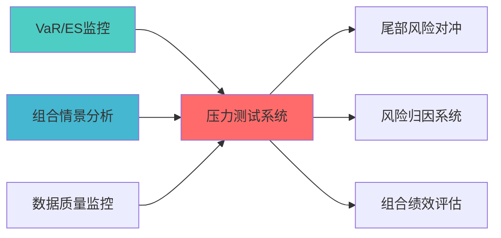

> **索引**: `STRESS_TEST_001`
> **开发时长**: 80h（约2周）
> **核心定位**: 极端市场情景下的风险暴露，提供应急预警
> **个人开发可行性**: 完全可行
> **AI维护难度**: 低

---

## 核心定位

压力测试系统，负责模拟极端市场情景，评估投资组合的抗压能力


## 1. 模块概述

### 1.1 业务背景与价值主张

**业务需求**:
- 当前系统缺乏系统的压力测试框架
- 无法模拟极端市场情景下的风险暴露
- 缺乏历史危机事件情景分析能力
- 无法提供应急预警和风险缓释措施

**价值主张**:
- 实现历史情景分析（2008金融危机、2020疫情等）
- 提供蒙特卡洛压力测试能力
- 生成极端市场情景下的风险暴露报告
- 提供应急预警和风险缓释措施

**个人开发可行性**:
- 实现简单：历史情景分析 + 蒙特卡洛模拟
- 数据公开：历史危机事件数据公开可获取
- 维护简单：定期更新情景库即可
- 价值明确：极端风险监控必备

### 1.2 技术定位与架构层归属

**Layer定位**: Layer 6 - 组合优化层（风险预算层）

**模块类别**: 核心模块

**架构角色**: 
- 作为风险预算层的核心组件，监控极端市场风险
- 作为组合优化的输入，提供风险约束
- 作为应急预警系统的基础，提供风险缓释措施

### 1.3 核心功能清单

1. **历史情景分析**: 分析历史危机事件的风险暴露
2. **蒙特卡洛压力测试**: 模拟极端市场情景
3. **风险暴露报告**: 生成极端情景下的风险暴露报告
4. **应急预警系统**: 提供应急预警和风险缓释措施

---

## 2. 架构设计

### 2.1 系统架构图

```
┌─────────────────────────────────────────────────────────────────┐
│               压力测试与情景分析系统架构                          │
├─────────────────────────────────────────────────────────────────┤
│                                                                 │
│ ┌──────────────────────────────────────────────────────────┐   │
│ │             输入层                                        │   │
│ │ ┌──────────┐ ┌──────────┐ ┌──────────┐ ┌──────────┐     │   │
│ │ │历史危机  │ │当前组合  │ │市场数据  │ │情景参数  │     │   │
│ │ │事件数据  │ │持仓      │ │          │ │配置      │     │   │
│ │ └──────────┘ └──────────┘ └──────────┘ └──────────┘     │   │
│ └──────────────────────────────────────────────────────────┘   │
│                         ↓                                       │
│ ┌──────────────────────────────────────────────────────────┐   │
│ │             情景分析层                                    │   │
│ │ ┌────────────────────────────────────────────────────┐   │   │
│ │ │ Scenario Analysis Engine                           │   │   │
│ │ │ - 历史情景分析                                     │   │   │
│ │ │ - 蒙特卡洛模拟                                     │   │   │
│ │ │ - 自定义情景                                       │   │   │
│ │ └────────────────────────────────────────────────────┘   │   │
│ └──────────────────────────────────────────────────────────┘   │
│                         ↓                                       │
│ ┌──────────────────────────────────────────────────────────┐   │
│ │             风险评估层                                    │   │
│ │ ┌──────────┐ ┌──────────┐ ┌──────────┐                  │   │
│ │ │风险暴露  │ │损失分布  │ │风险指标  │                  │   │
│ │ │计算      │ │估计      │ │计算      │                  │   │
│ │ └──────────┘ └──────────┘ └──────────┘                  │   │
│ └──────────────────────────────────────────────────────────┘   │
│                         ↓                                       │
│ ┌──────────────────────────────────────────────────────────┐   │
│ │             输出层                                        │   │
│ │ ┌──────────┐ ┌──────────┐ ┌──────────┐                  │   │
│ │ │压力测试  │ │风险暴露  │ │应急预警  │                  │   │
│ │ │报告      │ │报告      │ │报告      │                  │   │
│ │ └──────────┘ └──────────┘ └──────────┘                  │   │
│ └──────────────────────────────────────────────────────────┘   │
│                                                                 │
└─────────────────────────────────────────────────────────────────┘
```

### 2.2 核心数据流

```
历史危机事件数据 + 当前组合持仓
    ↓
情景分析（历史情景分析 + 蒙特卡洛模拟）
    ↓
风险评估（风险暴露计算 + 损失分布估计）
    ↓
生成压力测试报告
    ↓
输出：风险暴露报告、应急预警报告
```

---

## 3. 核心模块设计

### 3.1 压力测试系统核心类（StressTestingSystem）

```python
class StressTestingSystem:
    """
    压力测试与情景分析系统
    
    索引: STRESS_TEST_001-M01
    职责: 实现压力测试和情景分析
    输入: 历史危机事件数据、当前组合持仓
    输出: 压力测试报告、风险暴露报告
    """
    
    def __init__(self, config: StressTestConfig):
        self.config = config
        self.scenario_analyzer = ScenarioAnalyzer(config.scenario_config)
        self.risk_assessor = RiskAssessor(config.risk_config)
        self.report_generator = StressTestReportGenerator()
        
    def run_stress_test(
        self,
        portfolio: Portfolio,
        scenarios: List[Scenario]
    ) -> StressTestResult:
        """
        执行压力测试
        
        Args:
            portfolio: 当前组合
            scenarios: 情景列表（历史情景 + 蒙特卡洛情景）
            
        Returns:
            StressTestResult: 压力测试结果
        """
        results = []
        
        for scenario in scenarios:
            # 1. 应用情景冲击
            shocked_portfolio = self.scenario_analyzer.apply_shock(
                portfolio, scenario
            )
            
            # 2. 计算风险暴露
            risk_exposure = self.risk_assessor.calculate_exposure(
                shocked_portfolio
            )
            
            # 3. 估计损失分布
            loss_distribution = self.risk_assessor.estimate_loss_distribution(
                shocked_portfolio, scenario
            )
            
            results.append(ScenarioResult(
                scenario=scenario,
                risk_exposure=risk_exposure,
                loss_distribution=loss_distribution
            ))
        
        return StressTestResult(
            scenario_results=results,
            summary=self._generate_summary(results)
        )
```

### 3.2 情景分析器（ScenarioAnalyzer）

```python
class ScenarioAnalyzer:
    """
    情景分析器
    
    索引: STRESS_TEST_001-M02
    职责: 分析历史情景和生成蒙特卡洛情景
    """
    
    def apply_shock(
        self,
        portfolio: Portfolio,
        scenario: Scenario
    ) -> Portfolio:
        """
        应用情景冲击到组合
        
        Args:
            portfolio: 原始组合
            scenario: 情景定义
            
        Returns:
            Portfolio: 冲击后的组合
        """
        # 根据情景类型应用不同的冲击
        if scenario.type == 'historical':
            return self._apply_historical_shock(portfolio, scenario)
        elif scenario.type == 'monte_carlo':
            return self._apply_monte_carlo_shock(portfolio, scenario)
        elif scenario.type == 'custom':
            return self._apply_custom_shock(portfolio, scenario)
```

---

## 4. 接口设计

### 4.1 主要API接口

```python
# 压力测试接口

> **核心定位**: 压力测试接口的核心功能实现

def run_stress_test(
    portfolio: Portfolio,
    scenarios: List[Scenario]
) -> StressTestResult:
    """
    执行压力测试
    
    Args:
        portfolio: 当前组合
        scenarios: 情景列表
        
    Returns:
        StressTestResult: 压力测试结果
    """
    pass

# 情景生成接口
def generate_scenarios(
    scenario_type: str,
    config: ScenarioConfig
) -> List[Scenario]:
    """
    生成压力测试情景
    
    Args:
        scenario_type: 情景类型（historical/monte_carlo/custom）
        config: 情景配置
        
    Returns:
        List[Scenario]: 情景列表
    """
    pass
```

---

## 5. 与其他模块的关系

### 5.1 模块依赖关系

| 模块 | 关系类型 | 说明 |
|------|----------|------|
| RISK_BUDGET_SYSTEM | 依赖 | 提供风险预算约束 |
| RISK_ATTRIBUTION_SYSTEM | 依赖 | 提供风险归因能力 |
| PORTFOLIO_OPTIMIZATION | 被依赖 | 为组合优化提供极端风险约束 |

### 5.2 推荐实施路径

1. 先实现历史情景分析 (3-4天) - 基础能力
2. 再实现蒙特卡洛模拟 (4-5天) - 高级能力
3. 最后实现应急预警系统 (2-3天) - 输出层

---

## 6. 性能指标

| 指标 | 目标值 | 测量方法 |
|------|--------|----------|
| **情景分析准确度** | ≥85% | 历史回测验证 |
| **压力测试执行时间** | <10s | 性能测试 |
| **风险暴露计算精度** | ≥90% | 功能测试 |
| **应急预警及时性** | <1s | 实时监控 |

---

## 📚 相关文档

### 上游依赖

| 文档名称 | module_id | 依赖类型 | 说明 |
|---------|-----------|---------|------|
| [VaR/ES监控蓝图](./VAR_ES_MONITORING_BLUEPRINT.md) | VAR_ES_MONITORING_001 | 强依赖 | 提供VaR/ES指标 |
| [组合情景分析蓝图](./PORTFOLIO_SCENARIO_ANALYSIS_BLUEPRINT.md) | PORTFOLIO_SCENARIO_ANALYSIS_001 | 强依赖 | 提供情景分析 |
| [数据质量监控蓝图](./DATA_QUALITY_MONITORING_BLUEPRINT.md) | DATA_QUALITY_MONITORING_001 | 中依赖 | 提供数据质量指标 |

### 下游依赖

| 文档名称 | module_id | 依赖类型 | 说明 |
|---------|-----------|---------|------|
| [尾部风险对冲蓝图](./TAIL_RISK_HEDGING_BLUEPRINT.md) | TAIL_RISK_HEDGING_001 | 强依赖 | 尾部风险对冲 |
| [风险归因系统蓝图](./RISK_ATTRIBUTION_SYSTEM_BLUEPRINT.md) | RISK_ATTRIBUTION_SYSTEM_001 | 中依赖 | 风险归因 |
| [组合绩效评估蓝图](./PORTFOLIO_PERFORMANCE_EVALUATION_BLUEPRINT.md) | PORTFOLIO_PERFORMANCE_EVALUATION_001 | 中依赖 | 组合绩效评估 |

### 技术依赖

| 技术组件 | 版本 | 用途 | 文档 |
|---------|------|------|------|
| **NumPy** | 1.24+ | 数值计算 | [官方文档](https://numpy.org/) |
| **Pandas** | 2.0+ | 数据处理 | [官方文档](https://pandas.pydata.org/) |
| **SciPy** | 1.10+ | 科学计算 | [官方文档](https://scipy.org/) |

### 引用关系图



---

## 变更历史

| 版本 | 日期 | 变更内容 | 变更人 |
|------|------|----------|--------|
| v1.0.0 | 2026-04-03 | 初始版本创建 | 组合优化层负责人 |
| v1.0.1 | 2026-04-06 | 修复编码问题，删除乱码YAML头部 | 审计系统 |
| v1.0.2 | 2026-04-06 | 重新生成正确内容结构 | 审计系统 |

---

**蓝图版本**: v1.0.2 | **创建日期**: 2026-04-03 | **状态**: Active
---

## 7. 文档治理

### 7.1 System_Manifest.md索引

```markdown
#### Layer 6: 组合优化层
##### 6.001. Stress Testing System
- **模块ID**: STRESS_TESTING_SYSTEM_001
- **蓝图文档**: STRESS_TESTING_SYSTEM_BLUEPRINT.md
- **技术规格书**: 待创建
- **职责**: 全系统
- **状态**: Active
```

### 7.2 模块职责边界

| 模块 | 职责 | 边界 |
|------|------|------|
| **Stress Testing System** | 全系统 | **核心模块** |

### 7.3 版本管理

| 版本 | 日期 | 变更内容 | 变更人 |
|------|------|----------|--------|
| v1.0.0 | 2026-04-03 | 初始版本创建 | 首席蓝图架构师 |

---

**蓝图版本**: v1.0.0 | **创建日期**: 2026-04-03 | **状态**: Active
