---
responsibility:
  - 系统增强
  - 功能扩展
  - 性能优化
  - 系统升级

module_id: SYSTEM_ENHANCEMENT_001
version: 1.0.0
status: Active
created_date: 2026-04-07
last_updated: 2026-04-07
owner: 实施团队
standard_type: 专业量化机构蓝图
applicable_scope: Layer 7 AI报告å±?
compliance_level: 专业标准
layer: Layer 5 (策略执行层)
---

# Layer 7 AI报告层增强蓝å›?

## 核心定位

负责系统增强，识别系统瓶颈，优化系统性能，提升系统稳定性和效率。


> **核心职责**: 系统功能增强和性能优化
> **职责边界**: 
> - âœ?本文档负责：功能增强、性能优化、扩展模å?
> - â?本文档不负责：因子计算（由因子模块负责）


## 设计目标

### 主要目标

1. **功能完整性**: 确保SYSTEM ENHANCEMENT功能完整，满足业务需求
2. **性能优化**: 提升系统性能，降低资源消耗
3. **可维护性**: 提高代码质量，便于后续维护
4. **可扩展性**: 支持功能扩展，适应业务变化

### 质量目标

- 代码覆盖率: ≥80%
- 性能指标: 满足设计要求
- 文档完整性: 100%


## 核心功能

### 功能清单

1. **数据管理**: 提供数据存储、查询、更新功能
2. **业务逻辑**: 实现核心业务逻辑处理
3. **接口服务**: 提供标准化的API接口
4. **监控告警**: 实时监控系统状态

### 功能特性

- 高可用性设计
- 自动故障恢复
- 灵活配置管理


## 实现方案

### 技术架构

采用SYSTEM ENHANCEMENT化设计，分层架构实现。

### 关键技术

- 数据处理: 使用高效的数据处理框架
- 接口实现: RESTful API设计
- 性能优化: 缓存、异步处理

### 实施步骤

1. 需求分析与设计
2. 核心功能开发
3. 测试与优化
4. 部署与监控


## 一、蓝图概?
### 1.1 设计背景

**当前差距分析**?对标桥水基金、文艺复兴科技等专业量化机构，Layer 7 AI报告层存在以下核心差距：

| 优先?| 差距?| 桥水/文艺复兴 | 当前系统 | 影响 |
|--------|--------|--------------|----------|------|
| P0 | 情景分析和压力测?| 完整体系 | 完全缺失 | 无法评估极端风险 |
| P0 | 实时风险监控 | 秒级监控 | 仅日度报?| 风险响应滞后 |
| P0 | 多时间框架报告融?| 宏观/中观/微观三层 | 仅日?月度 | 缺乏全局视角 |
| P1 | 策略生命周期管理 | 全流程追?| ?| 策略退役无依据 |
| P1 | 监管合规报告 | 满足证监会要?| ?| 合规风险 |
| P1 | AI决策可解é‡?| SHAP/LIME解释 | ?| 黑盒风险 |
| P1 | 执行成本分析 | 滑点/冲击成本 | ?| 成本失控 |

### 1.2 设计目标

**核心目标**?1. ?补齐P0级三大核心差距，达到专业机构80%能力水平
2. ?补齐P1级四大高优先级差距，满足监管和运营需?3. ?建立统一的报告生成和分发架构
4. ?实现与现有Layer 7模块的无缝集?
**量化指标**?- 报告生成效率：≤5分钟/报告
- 实时风险监控延迟：≤2秒（优化后目标）
- 模块集成成功率：100%
- API接口覆盖率：100%

### 1.3 技术定?
**Layer定位**: Layer 7 - AI报告?**模块类型**: 核心报告模块
**依赖关系**:
- Layer 2: 数据层（行情数据、因子数据）
- Layer 4: 策略层（组合数据、交易数据）
- Layer 5: 执行层（成交数据、滑点数据）
- Layer 6: 风控层（风险指标、限额数据）

---

## 二、模块架构设?
### 2.1 整体架构?
```
┌─────────────────────────────────────────────────────────────────??                   Layer 7: AI报告层增强架?                     ?├─────────────────────────────────────────────────────────────────??                                                                  ?? ┌──────────────? ┌──────────────? ┌──────────────?         ?? ? P0-01       ? ? P0-02       ? ? P0-03       ?         ?? ?情景分析?  ? ?压力测试     ? ?实时风险     ?         ?? ?Scenario     ? ?StressTest   ? ?RealTimeRisk ?         ?? ?Analyzer     ? ?Reporter     ? ?Reporter     ?         ?? └──────┬───────? └──────┬───────? └──────┬───────?         ??        ?                 ?                 ?                 ??        └──────────────────┼──────────────────?                 ??                           ?                                     ?? ┌─────────────────────────▼─────────────────────────?         ?? ?         P0-04: 多时间框架报告融合器               ?         ?? ?       MultiTimeframeReportFusion                 ?         ?? └─────────────────────┬─────────────────────────────?         ??                       ?                                         ?? ┌─────────────────────▼─────────────────────────────?         ?? ?             统一报告分发中心                      ?         ?? ?        ReportDistributionHub                     ?         ?? └──────┬──────────┬──────────┬──────────┬──────────?         ??        ?         ?         ?         ?                     ?? ┌──────▼────?┌───▼────?┌──▼───?┌───▼────?                 ?? ?P1-01     ??P1-02  ??P1-03??P1-04  ?                 ?? ?策略生命  ??监管   ??AI   ??执行   ?                 ?? ?周期报告  ??合规   ??可解 ??成本   ?                 ?? ?Lifecycle ??Regul  ??Expl ??Exec   ?                 ?? └───────────?└────────?└──────?└────────?                 ??                                                                  ?└─────────────────────────────────────────────────────────────────?         ?                   ?                   ?         ?                   ?                   ?    ┌─────────?        ┌─────────?        ┌─────────?    ?Layer 2 ?        ?Layer 4 ?        ?Layer 5 ?    ?数据? ?        ?策略? ?        ?执行? ?    └─────────?        └─────────?        └─────────?```

### 2.2 模块职责边界

#### P0级模块（核心差距?
**P0-01: 情景分析?(ScenarioAnalyzer)**
- 职责：分析不同市场情景下的组合表?- 输入：投资组合、情景类型、自定义冲击参数
- 输出：情景分析报告（收益影响、风险指标、敏感度分析?- 调用频率：按需调用 / 周度定期分析

**P0-02: 压力测试报告生成?(StressTestReporter)**
- 职责：执行历史、假设、反向压力测?- 输入：投资组合、压力情景定?- 输出：压力测试报告（极端损失、风险敞口、生存能力评估）
- 调用频率：月度定期测?/ 市场异常时触?
**P0-03: 实时风险监控报告?(RealTimeRiskReporter)**
- 职责：秒级实时风险监控和预警
- 输入：实时组合数据、市场行?- 输出：实时风险报告（VaR/CVaR、Greeks、流动性、集中度?- 调用频率：实时（每秒更新?
**P0-04: 多时间框架报告融合器 (MultiTimeframeReportFusion)**
- 职责：融合宏?中观/微观三层报告
- 输入：宏观报告、策略报告、执行报?- 输出：融合报告（一致性评分、跨时间框架风险、优化建议）
- 调用频率：日度融?
#### P1级模块（高优先级差距?
**P1-01: 策略生命周期报告?(StrategyLifecycleReporter)**
- 职责：追踪策略从萌芽到退役的全生命周?- 输入：策略性能数据、交易记?- 输出：生命周期报告（阶段判定、性能趋势、退役建议）
- 调用频率：周度更?
**P1-02: 监管合规报告?(RegulatoryReporter)**
- 职责：生成证监会合规报告
- 输入：投资组合、交易记录、风险数?- 输出：合规报告（合规检查项、违规事项、整改措施）
- 调用频率：季度定?/ 监管要求?
**P1-03: AI决策可解释性报告器 (AIExplainabilityReporter)**
- 职责：提供AI决策的SHAP/LIME解释
- 输入：模型特征、模型输?- 输出：可解释性报告（特征重要性、决策路径、置信度?- 调用频率：模型更新时 / 用户请求?
**SHAP采样计算方案**（性能优化）：
```python
# 方案1: 采样计算（推荐）
> **核心职责**: System Enhancement蓝图设计
> **职责边界**: 
> - âœ?本文档负责：System Enhancement蓝图设计相关内容
> - â?本文档不负责：其他模块内å®?


## 核心职责

系统增强，负责系统功能的扩展和优åŒ?


---

## 📋 概述

本文档定义了SYSTEM ENHANCEMENT的核心功能和技术实现ã€?

# 采样策略：从全量数据中随机采?000个样?# 性能提升：计算时间从O(n²)降低到O(1000²)
# 准确性：采样误差<5%，满足业务需?
import shap
import numpy as np

def optimized_shap_analysis(model, X_train, X_test, sample_size=1000):
    """优化的SHAP分析"""
    # 采样训练数据
    if len(X_train) > sample_size:
        X_sample = shap.sample(X_train, sample_size)
    else:
        X_sample = X_train
    
    # 使用TreeSHAP（适用于树模型?    explainer = shap.TreeExplainer(model, X_sample)
    
    # 并行计算SHAP?    shap_values = explainer.shap_values(X_test, check_additivity=False)
    
    return shap_values

# 方案2: 近似算法
# 使用KernelSHAP的近似版本，牺牲少量精度换取速度
# 适用于非树模?
def approximate_shap_analysis(model, X_train, X_test, nsamples=100):
    """近似SHAP分析"""
    explainer = shap.KernelExplainer(model.predict, shap.kmeans(X_train, 10))
    shap_values = explainer.shap_values(X_test[:100], nsamples=nsamples)
    return shap_values
```

**性能对比**?| 方案 | 数据?| 计算时间 | 准确?| 适用场景 |
|------|--------|---------|--------|---------|
| 全量SHAP | 10000 | 120?| 100% | 小数据集 |
| 采样SHAP | 1000 | 8?| 95%+ | 大数据集（推荐） |
| 近似SHAP | 100 | 2?| 90%+ | 快速预?|

**P1-04: 执行成本分析报告?(ExecutionCostReporter)**
- 职责：分析交易执行成?- 输入：交易执行记录、市场数?- 输出：成本分析报告（滑点、市场冲击、执行效率）
- 调用频率：日度汇?/ 交易后分?
---

### 2.3 P1级扩展模块规划（待实施）

**说明**: 以下模块已完成蓝图设计，待进入施工阶段实æ–?
#### P1-05: 风险预算执行报告?(RiskBudgetReporter)

**模块ID**: RISK_BUDGET_REPORTER_001
**优先?*: P1-最?**预计工期**: 3?
**职责**: 监控风险预算执行情况，分析预算偏?
**核心功能**:
1. 风险预算分配管理
2. 实际风险预算计算
3. 预算偏差分析与预?4. 再平衡建议生?
**输入数据**:
- 风险预算配置（目标风险预算）
- 实际组合风险数据（VaR、波动率等）
- 资产权重数据

**输出报告**:
- 预算执行偏差报告
- 预算超限预警
- 再平衡建?
**接口设计**:
```python
POST /api/v1/reports/risk-budget/analyze
{
  "portfolio_id": "PORTFOLIO_001",
  "target_budget": {
    "equity_risk": 0.10,
    "bond_risk": 0.05,
    "commodity_risk": 0.03
  },
  "output_format": "json"
}
```

**数据模型**:
```python
@dataclass
class RiskBudgetReport:
    target_budget: Dict[str, float]
    actual_budget: Dict[str, float]
    budget_deviation: Dict[str, float]
    deviation_alerts: List[str]
    rebalance_suggestions: List[str]
```

#### P1-06: 模型稳定性报告器 (ModelStabilityReporter)

**模块ID**: MODEL_STABILITY_REPORTER_001
**优先?*: P1-最?**预计工期**: 1?
**职责**: 监控模型稳定性，检测模型漂?
**核心功能**:
1. 模型漂移检测（PSI、KS检验）
2. 特征分布变化监控
3. 模型性能衰减预警
4. 重训练建议生?
**输入数据**:
- 模型预测结果
- 特征数据分布
- 模型性能指标

**输出报告**:
- 模型稳定性评?- 漂移检测报?- 重训练预?
**接口设计**:
```python
POST /api/v1/reports/model-stability/analyze
{
  "model_id": "MODEL_001",
  "training_data_stats": {...},
  "current_data_stats": {...},
  "output_format": "json"
}
```

**数据模型**:
```python
@dataclass
class ModelStabilityReport:
    model_id: str
    stability_score: float
    drift_detection: Dict[str, float]
    feature_drift: Dict[str, float]
    performance_decay: float
    retrain_recommendation: bool
```

#### P1-07: 回测过拟合检测报告器 (BacktestOverfitReporter)

**模块ID**: BACKTEST_OVERFIT_REPORTER_001
**优先?*: P1-?**预计工期**: 1?
**职责**: 检测回测过拟合，评估策略稳å?
**核心功能**:
1. PBO（Probability of Backtest Overfitting）计?2. CSCV（Combinatorially Symmetric Cross-Validation）检?3. 样本外性能预测
4. 策略稳健性评?
**输入数据**:
- 回测收益率序?- 参数配置集合
- 样本外测试数?
**输出报告**:
- 过拟合概率评?- 样本外性能预测
- 策略稳健性评?
**接口设计**:
```python
POST /api/v1/reports/backtest-overfit/analyze
{
  "strategy_id": "STRATEGY_001",
  "backtest_returns": [...],
  "parameter_sets": [...],
  "output_format": "json"
}
```

**数据模型**:
```python
@dataclass
class BacktestOverfitReport:
    strategy_id: str
    pbo_score: float
    oos_performance_prediction: float
    robustness_score: float
    overfit_risk_level: str
```

#### P1-08: 跨资产相关性报告器 (CrossAssetCorrelationReporter)

**模块ID**: CROSS_ASSET_CORRELATION_REPORTER_001
**优先?*: P1-?**预计工期**: 1?
**职责**: 监控跨资产相关性，预警相关性突?
**核心功能**:
1. 动态相关性矩阵计?2. 相关性突变检?3. 相关性聚类分?4. 风险传染路径识别

**输入数据**:
- 多资产价格序?- 相关性历史数?- 市场状态数?
**输出报告**:
- 动态相关性矩?- 相关性突变预?- 风险传染分析

**接口设计**:
```python
POST /api/v1/reports/cross-asset-correlation/analyze
{
  "portfolio_id": "PORTFOLIO_001",
  "assets": ["600519.SH", "000858.SZ", "601318.SH"],
  "lookback_period": 252,
  "output_format": "json"
}
```

**数据模型**:
```python
@dataclass
class CrossAssetCorrelationReport:
    correlation_matrix: pd.DataFrame
    correlation_changes: Dict[str, float]
    regime_shift_alerts: List[str]
    contagion_paths: List[Dict]
```

---

### 2.4 P2级优化模块规划（可选实施）

**说明**: 以下模块为可选优化项，根据实际需求决定是否实æ–?
#### P2-01: 投资委员会决策报告器 (InvestmentCommitteeReporter)

**优先?*: P2-?**预计工期**: 3?
**职责**: 记录投资决策过程，提供决策追?
**核心功能**:
1. 投资决策记录
2. 决策依据追溯
3. 决策效果评估
4. 决策流程管理

#### P2-02: 高频交易性能报告?(HFTPerformanceReporter)

**优先?*: P2-?**预计工期**: 1?
**职责**: 分析高频交易性能，优化执行质?
**核心功能**:
1. 毫秒级执行质量分?2. 延迟分析
3. 订单流分?4. 执行算法优化建议

#### P2-03: 统计套利机会报告?(StatArbOpportunityReporter)

**优先?*: P2-?**预计工期**: 1?
**职责**: 识别统计套利机会，监控套利信?
**核心功能**:
1. 配对交易机会识别
2. 均值回归信号监?3. 套利空间评估
4. 风险收益分析

---

## 三、接口定?
### 3.1 统一API接口规范

**基础URL**: `http://localhost:8000/api/v1/reports/`

**认证方式**: JWT Token

**请求格式**: JSON

**响应格式**: JSON

### 3.2 API接口概述

**说明**: 详细的API接口定义请参?LAYER7_API_REFERENCE.md

#### 3.2.1 核心模块API接口

| 模块 | API路径 | 功能描述 | 详细文档位置 |
|------|---------|---------|-------------|
| 情景分析?| POST /api/v1/reports/scenario/analyze | 执行情景分析 | SCENARIO_ANALYZER_TECHNICAL_SPECIFICATION.md |
| 压力测试 | POST /api/v1/reports/stress-test/run | 执行压力测试 | [STRESS_TESTING_SYSTEM_BLUEPRINT.md](./STRESS_TESTING_SYSTEM_BLUEPRINT.md) |
| 实时风险监控 | GET /api/v1/reports/realtime-risk/current | 获取实时风险指标 | REALTIME_RISK_MONITORING_BLUEPRINT.md |
| 多时间框架融?| POST /api/v1/reports/multi-timeframe/fuse | 融合多层报告 | 本文?2.1?|
| 经济范式分析 | POST /api/v1/reports/economic-regime/analyze | 分析经济范式 | ECONOMIC_REGIME_REPORTER_TECHNICAL_SPECIFICATION.md |
| 信号质量监控 | POST /api/v1/reports/signal-quality/analyze | 分析信号质量 | SIGNAL_QUALITY_REPORTER_TECHNICAL_SPECIFICATION.md |
| 策略生命周期 | GET /api/v1/reports/strategy-lifecycle/{strategy_id} | 获取策略生命周期报告 | 本文?2.2?|
| 监管合规 | POST /api/v1/reports/regulatory/generate | 生成监管合规报告 | 本文?2.2?|
| AI可解é‡?| POST /api/v1/reports/ai-explainability/analyze | AI决策可解释性分?| 本文?2.2?|
| 执行成本 | GET /api/v1/reports/execution-cost/summary | 获取执行成本分析 | 本文?2.2?|

#### 3.2.2 P1级扩展模块API接口（待实施?
| 模块 | API路径 | 功能描述 | çŠ?|
|------|---------|---------|------|
| 风险预算执行 | POST /api/v1/reports/risk-budget/analyze | 风险预算偏差分析 | 蓝图设计完成 |
| 模型稳定?| POST /api/v1/reports/model-stability/analyze | 模型漂移检?| 蓝图设计完成 |
| 回测过拟?| POST /api/v1/reports/backtest-overfit/analyze | 过拟合检?| 蓝图设计完成 |
| 跨资产相å…?| POST /api/v1/reports/cross-asset-correlation/analyze | 相关性突变检?| 蓝图设计完成 |

### 3.3 职责边界说明

**说明**: 详细的模块职责边界定义请å?LAYER7_MODULE_RESPONSIBILITY_BOUNDARIES.md

**核心原则**:
- **单一职责原则**: 每个模块只负责一个核心功?- **接口隔离原则**: 模块间通过明确定义的接口通信
- **依赖倒置原则**: 高层模块不依赖低层模块，都依赖抽?
---

## 四、数据流设计

### 4.1 数据模型定义

**说明**: 详细的数据模型定义请参考各模块的技术规格书

#### 4.1.1 核心数据模型

| 数据模型 | 描述 | 详细定义位置 |
|---------|------|-------------|
| Portfolio | 投资组合数据 | 各模块技术规格书 |
| Position | 持仓数据 | 各模块技术规格书 |
| RiskMetrics | 风险指标数据 | REALTIME_RISK_MONITORING_BLUEPRINT.md |
| BaseReport | 报告基础数据 | 各模块技术规格书 |

### 4.2 数据流向?
```
┌─────────────??Layer 2     ?行情数据、因子数??数据?     ?└──────┬──────?       ?       ?┌─────────────??Layer 4     ?组合数据、策略信??策略?     ?└──────┬──────?       ?       ?┌─────────────??Layer 5     ?成交数据、滑点数??执行?     ?└──────┬──────?       ?       ?┌─────────────────────────────────────────??     Layer 7: AI报告层增强模?          ??                                         ?? ┌────────────?   ┌────────────?      ?? ?数据聚合?│───▶│ 报告生成??      ?? └────────────?   └─────┬──────?      ??                         ?              ??                         ?              ??                  ┌────────────?        ??                  ?报告分发??        ??                  └─────┬──────?        ?└─────────────────────────┼─────────────────?                          ?          ┌───────────────┼───────────────?          ?              ?              ?          ?              ?              ?    ┌──────────?  ┌──────────?  ┌──────────?    ?邮件通知 ?  ?APIæŽ? ?  ?数据?  ?    └──────────?  └──────────?  └──────────?```

### 4.2 数据依赖关系

| 模块 | 依赖数据 | 数据?| 更新频率 |
|------|---------|--------|---------|
| 情景分析?| 组合数据、因子暴?| Layer 4 | 日度 |
| 压力测试 | 组合数据、历史行?| Layer 2, 4 | 月度 |
| 实时风险 | 实时行情、组合快?| Layer 2, 4 | 秒级 |
| 多时间框架融?| 宏观/策略/执行报告 | Layer 7内部 | 日度 |
| 策略生命周期 | 策略性能、交易记?| Layer 4, 5 | 周度 |
| 监管合规 | 组合数据、交易记?| Layer 4, 5 | 季度 |
| AI可解é‡?| 模型特征、预测输?| Layer 4 | 按需 |
| 执行成本 | 成交记录、市场数?| Layer 5 | 日度 |

---

## 五、实施路线图

**总工?*: 7周（含缓冲时间）

### 5.1 Phase 1: P0级核心模块（3周）

**Week 1: 情景分析 + 压力测试**
- Day 1-2: 情景分析器开发与单元测试
- Day 3-4: 压力测试报告生成器开?- Day 5: 集成测试与文档编?
**Week 2-3: 实时风险 + 多时间框架融?*
- Day 1-3: 实时风险监控报告器开发（重点：性能优化?  - 增量计算实现
  - Redis缓存集成
  - 性能测试与优化（目标?秒）
- Day 4-5: 多时间框架报告融合器开?- Day 6-7: 集成测试与API联调
- Day 8-10: 缓冲时间（处理技术难点）

### 5.2 Phase 2: P1级扩展模块（2周）

**Week 4: 策略生命周期 + 监管合规**
- Day 1-2: 策略生命周期报告器开?- Day 3-4: 监管合规报告器开?- Day 5: 集成测试

**Week 5: AI可解é‡?+ 执行成本**
- Day 1-2: AI决策可解释性报告器开发（使用SHAP采样方案?- Day 3-4: 执行成本分析报告器开?- Day 5: 全面集成测试

### 5.3 Phase 3: 集成与优化（2周）

**Week 6: 系统集成**
- Day 1-2: 统一API网关开?- Day 3: 报告分发中心开?- Day 4-5: 端到端集成测?
**Week 7: 性能优化与文?*
- Day 1-2: 性能测试与优?- Day 3-4: 文档完善与培?- Day 5: 最终验收与上线准备

### 5.4 Phase 4: P1级扩展模块（2-3周，可选）

**说明**: 以下模块已完成蓝图设计，可根据实际需求决定是否实æ–?
**Week 8-9: P1-最高优先级模块**
- Day 1-3: 风险预算执行报告器开?  - 风险预算分配管理
  - 预算偏差分析
  - 再平衡建议生?- Day 4-7: 模型稳定性报告器开?  - 模型漂移检测（PSI、KS检验）
  - 特征分布变化监控
  - 重训练预?
**Week 10: P1-高优先级模块**
- Day 1-3: 回测过拟合检测报告器开?  - PBO/CSCV过拟合检?  - 样本外性能预测
- Day 4-5: 跨资产相关性报告器开?  - 动态相关性矩阵计?  - 相关性突变检?
### 5.5 Phase 5: P2级优化模块（可选）

**说明**: P2级模块为可选优化项，根据实际需求决定是否实æ–?
**预计工期**: 2-3?- 投资委员会决策报告器?天）
- 高频交易性能报告器（1周，可选）
- 统计套利机会报告器（1周，可选）

---

## 六、验收标?
### 6.1 功能验收标准

#### 6.1.1 P0级核心模块验收标?
| 模块 | 验收标准 | 测试方法 |
|------|---------|---------|
| 情景分析?| 支持?种预设情景，自定义情景配?| 单元测试 + 集成测试 |
| 压力测试 | 支持历史/假设/反向三种测试类型 | 回测验证 |
| 实时风险 | 延迟?秒，准确率≥95% | 性能测试 |
| 多时间框架融?| 一致性评分算法准确率?0% | 专家评审 |
| 经济范式分析 | 范式判断准确率≥80%，因子暴露误差≤5% | 历史数据验证 |
| 信号质量监控 | 衰减检测准确率?5%，拥挤度评分合理性≥85% | 专家评审 |

#### 6.1.2 P1级模块验收标?
| 模块 | 验收标准 | 测试方法 |
|------|---------|---------|
| 策略生命周期 | 阶段判定准确率≥85% | 历史数据验证 |
| 监管合规 | 合规检查覆盖率100% | 规则库验?|
| AI可解é‡?| 特征重要性计算准确率?0% | SHAP库对?|
| 执行成本 | 成本计算误差?% | 实际成交对比 |
| 风险预算执行 | 预算偏差计算准确率≥95% | 专家评审 |
| 模型稳定?| 漂移检测准确率?5% | 历史数据验证 |
| 回测过拟?| PBO计算准确率≥90% | 合成数据验证 |
| 跨资产相å…?| 相关性突变检测准确率?0% | 历史事件验证 |

#### 6.1.3 P2级模块验收标准（可选）

| 模块 | 验收标准 | 测试方法 |
|------|---------|---------|
| 投资委员会决?| 决策记录完整?00% | 流程验证 |
| 高频交易性能 | 延迟分析精度?ms | 性能测试 |
| 统计套利机会 | 套利信号准确率≥75% | 回测验证 |

### 6.2 性能验收标准

| 指标 | 目标?| 测试方法 |
|------|--------|---------|
| 报告生成时间 | ?分钟 | 性能测试 |
| 实时监控延迟 | ??| 压力测试 |
| API响应时间 | ?00ms | 性能测试 |
| 并发支持 | ?00 QPS | 负载测试 |
| 系统可用?| ?9.9% | 监控统计 |

### 6.3 质量验收标准

| 指标 | 目标?| 验证方法 |
|------|--------|---------|
| 代码覆盖?| ?0% | 单元测试 |
| 文档完整?| 100% | 文档审查 |
| API一è‡?| 100% | 接口测试 |
| 架构合规?| 100% | 架构审查 |

---

## 七、风险与约束

### 7.1 技术风?
| 风险?| 风险等级 | 缓解措施 |
|--------|---------|---------|
| 实时风险计算性能瓶颈 | P1 | 使用缓存、增量计?|
| 多时间框架数据不一?| P2 | 数据校验机制 |
| SHAP计算耗时过长 | P2 | 采样计算、并行化 |

### 7.2 实施约束

| 约束?| 约束内容 | 应对策略 |
|--------|---------|---------|
| 开发周?| 5周内完成 | 分阶段交?|
| 资源限制 | 1名开å?| 优先P0级模?|
| 技术栈 | Python + FastAPI | 使用成熟框架 |

### 7.3 依赖风险

| 依赖?| 风险描述 | 应对措施 |
|--------|---------|---------|
| Layer 2数据质量 | 数据缺失或错?| 数据校验 + 默认?|
| Layer 4策略稳定?| 策略频繁变更 | 版本管理 |
| Layer 5执行延迟 | 实时数据延迟 | 异步处理 |

---

## 八、附?
### 8.1 参考文?
- ARCHITECTURE.md - 系统架构定义
- MODULE_RESPONSIBILITY_BOUNDARIES.md - 模块职责边界
- TECHNICAL_SPECIFICATION_TEMPLATE.md - 技术规格模?
### 8.2 术语?
| 术语 | 定义 |
|------|------|
| VaR | Value at Risk，风险价?|
| CVaR | Conditional VaR，条件风险价?|
| SHAP | SHapley Additive exPlanations |
| LIME | Local Interpretable Model-agnostic Explanations |
| IC | Information Coefficient，信息系?|
| IR | Information Ratio，信息比?|

### 8.3 版本历史

| 版本 | 日期 | 变更内容 | ä½?|
|------|------|---------|------|
| v1.0.0 | 2026-04-02 | 初始版本创建 | Spec-Approver |

---

**审批çŠ?*: ?待审?**下一?*: 提交?@blueprint-architect 进行架构评审

---

## 📚 相关文档

### 上游依赖

| 文档名称 | module_id | 依赖类型 | 说明 |
|---------|-----------|---------|------|
| [系统集成蓝图](./SYSTEM_INTEGRATION_BLUEPRINT.md) | SYSTEM_INTEGRATION_001 | 强依èµ?| 提供系统集成数据 |
| [监控仪表板增强蓝图](./MONITORING_DASHBOARD_ENHANCEMENT_BLUEPRINT.md) | MONITORING_DASHBOARD_ENHANCEMENT_001 | 强依èµ?| 提供监控数据 |
| [质量报告自动化蓝图](./QUALITY_REPORT_AUTOMATION_BLUEPRINT.md) | QUALITY_REPORT_AUTOMATION_001 | 中依èµ?| 提供质量报告数据 |

### 下游依赖

| 文档名称 | module_id | 依赖类型 | 说明 |
|---------|-----------|---------|------|
| [增强告警系统蓝图](./ENHANCED_ALERT_SYSTEM_BLUEPRINT.md) | ENHANCED_ALERT_SYSTEM_001 | 强依èµ?| 增强告警系统 |
| [自动化数据修复引擎蓝图](./AUTO_REPAIR_ENGINE_BLUEPRINT.md) | AUTO_REPAIR_ENGINE_001 | 中依èµ?| 自动化数据修å¤?|
| [质量评分系统蓝图](./QUALITY_SCORING_SYSTEM_BLUEPRINT.md) | QUALITY_SCORING_SYSTEM_001 | 中依èµ?| 质量评分系统 |

### 技术依èµ?

| 技术组ä»?| 版本 | 用é€?| 文档 |
|---------|------|------|------|
| **FastAPI** | 0.100+ | Web框架 | [官方文档](https://fastapi.tiangolo.com/) |
| **Redis** | 7.0+ | 缓存系统 | [官方文档](https://redis.io/) |
| **PostgreSQL** | 15+ | 数据åº?| [官方文档](https://www.postgresql.org/) |
| **Docker** | 24.0+ | 容器åŒ?| [官方文档](https://www.docker.com/) |

### 引用关系å›?

```mermaid
graph LR
    A[系统集成] --> B[系统增强]
    C[监控仪表板增强] --> B
    D[质量报告自动化] --> B
    
    B --> E[增强告警系统]
    B --> F[自动化数据修复引擎]
    B --> G[质量评分系统]
    
    style B fill:#ff6b6b
    style A fill:#4ecdc4
    style C fill:#45b7d1
```



---

## 变更历史

| 版本 | 日期 | 变更内容 | 变更äº?|
|------|------|----------|--------|
| v1.0.0 | 2026-04-02 | 初始版本创建 | 首席技术评审官 |
| v1.0.1 | 2026-04-06 | 补充YAML头部字段和变更历å?| 审计系统 |

---

**蓝图版本**: v1.0.1 | **创建日期**: 2026-04-02 | **状æ€?*: Active
---

## 1. 文档治理

### 1.1 System_Manifest.md索引

```markdown
#### Layer 6: 组合优化å±?
##### 6.001. System Enhancement
- **模块ID**: SYSTEM_ENHANCEMENT_001
- **蓝图文档**: SYSTEM_ENHANCEMENT_BLUEPRINT.md
- **技术规格书**: 待创å»?
- **职责**: Layer 7 AI报告å±?
- **状æ€?*: Active
```

### 1.2 模块职责边界

| 模块 | 职责 | 边界 |
|------|------|------|
| **System Enhancement** | Layer 7 AI报告å±?| **核心模块** |

### 1.3 版本管理

| 版本 | 日期 | 变更内容 | 变更äº?|
|------|------|----------|--------|
| v1.0.0 | 2026-04-02 | 初始版本创建 | 首席蓝图架构å¸?|

---

**蓝图版本**: v1.0.0 | **创建日期**: 2026-04-02 | **状æ€?*: Active
