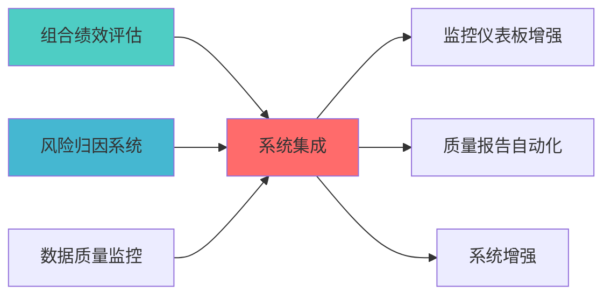

---
responsibility:
  - 实施指南、部署文档
  - 风险预算
  - 数据质量

module_id: SYSTEM_INTEGRATION_001
version: 1.0.0
status: Active
created_date: 2026-04-07
last_updated: 2026-04-07
owner: 实施团队
standard_type: 专业量化机构蓝图
applicable_scope: Layer 7 AI报告层
compliance_level: 专业标准
layer: "Layer 7 (AI报告层)"
---

# Layer 7 AI报告层 - 模块集成架构蓝图

> **核心职责**: AI报告层模块集成架构
> **职责边界**: 
> - ✅ 本文档负责：API网关、统一调度、模块服务集成
> - ❌ 本文档不负责：因子计算（由因子模块负责）
## 二、集成架构设?
### 2.1 整体架构?
```
┌─────────────────────────────────────────────────────────────────────??                       Layer 7: AI报告层集成架?                     ?├─────────────────────────────────────────────────────────────────────??                                                                      ?? ┌───────────────────────────────────────────────────────────────? ?? ?                   API网关?(API Gateway)                     ? ?? ? ┌─────────? ┌─────────? ┌─────────? ┌─────────?        ? ?? ? ?REST API? │WebSocket? ? gRPC   ? ?GraphQL ?        ? ?? ? └────┬────? └────┬────? └────┬────? └────┬────?        ? ?? └───────┼────────────┼────────────┼────────────┼───────────────? ??         └────────────┴────────────┴────────────?                  ??                             ?                                      ?? ┌───────────────────────────▼───────────────────────────────────? ?? ?                 统一调度?(Orchestrator)                     ? ?? ? ┌────────────────────────────────────────────────────────?  ? ?? ? ? ReportOrchestrator (报告编排?                       ?  ? ?? ? ? - 任务调度  - 依赖管理  - 结果聚合                    ?  ? ?? ? └────────────────────────────────────────────────────────?  ? ?? └───────────────────────────┬───────────────────────────────────? ??                             ?                                      ?? ┌───────────────────────────▼───────────────────────────────────? ?? ?                   模块服务?(Services)                       ? ?? ?                                                                ? ?? ? ┌──────────────? ┌──────────────? ┌──────────────?       ? ?? ? ?P0-01        ? ?P0-02        ? ?P0-03        ?       ? ?? ? ?Scenario     ? ?StressTest   ? ?RealTimeRisk ?       ? ?? ? ?Analyzer     ? ?Reporter     ? ?Reporter     ?       ? ?? ? └──────────────? └──────────────? └──────────────?       ? ?? ?                                                                ? ?? ? ┌──────────────? ┌──────────────? ┌──────────────?       ? ?? ? ?P0-04        ? ?P1-01        ? ?P1-02        ?       ? ?? ? ?MultiTime    ? ?Strategy     ? ?Regulatory   ?       ? ?? ? ?frameFusion  ? ?Lifecycle    ? ?Reporter     ?       ? ?? ? └──────────────? └──────────────? └──────────────?       ? ?? ?                                                                ? ?? ? ┌──────────────? ┌──────────────?                          ? ?? ? ?P1-03        ? ?P1-04        ?                          ? ?? ? ?AIExplain    ? ?Execution    ?                          ? ?? ? ?ability      ? ?CostReporter ?                          ? ?? ? └──────────────? └──────────────?                          ? ?? └───────────────────────────┬───────────────────────────────────? ??                             ?                                      ?? ┌───────────────────────────▼───────────────────────────────────? ?? ?                   数据访问?(Data Access)                    ? ?? ? ┌────────────? ┌────────────? ┌────────────?            ? ?? ? ?Portfolio  ? ?MarketData ? ?TradeData  ?            ? ?? ? ?Repository ? ?Repository ? ?Repository ?            ? ?? ? └────────────? └────────────? └────────────?            ? ?? └───────────────────────────┬───────────────────────────────────? ??                             ?                                      ?? ┌───────────────────────────▼───────────────────────────────────? ?? ?                   报告分发?(Distribution)                   ? ?? ? ┌──────────? ┌──────────? ┌──────────? ┌──────────?    ? ?? ? ?Email    ? ?API Push ? ?Database ? ?File     ?    ? ?? ? ?Sender   ? ?Service  ? ?Storage  ? ?Export   ?    ? ?? ? └──────────? └──────────? └──────────? └──────────?    ? ?? └───────────────────────────────────────────────────────────────? ??                                                                      ?└─────────────────────────────────────────────────────────────────────?         ?                   ?                   ?         ?                   ?                   ?    ┌─────────?        ┌─────────?        ┌─────────?    ?Layer 2 ?        ?Layer 4 ?        ?Layer 5 ?    ?数据? ?        ?策略? ?        ?执行? ?    └─────────?        └─────────?        └─────────?```

### 2.2 分层职责定义

#### 2.2.1 API网关?
**职责**?- 统一入口管理
- 认证授权
- 请求路由
- 限流熔断
- 日志记录

**核心组件**?```python
class APIGateway:
    """API网关"""
    
    def __init__(self):
        self.auth_manager = AuthManager()
        self.router = APIRouter()
        self.rate_limiter = RateLimiter()
        self.logger = APILogger()
    
    def handle_request(self, request: Request) -> Response:
        """处理请求"""
        if not self.auth_manager.authenticate(request):
            return Response(status=401, message="Unauthorized")
        
        if not self.rate_limiter.check_limit(request.client_id):
            return Response(status=429, message="Rate limit exceeded")
        
        route = self.router.match(request.path)
        response = route.handle(request)
        
        self.logger.log(request, response)
        return response
```

#### 2.2.2 统一调度?
**职责**?- 任务编排
- 依赖管理
- 并行调度
- 结果聚合
- 错误处理

**核心组件**?```python
class ReportOrchestrator:
    """报告编排?""
    
    def __init__(self):
        self.task_queue = TaskQueue()
        self.dependency_graph = DependencyGraph()
        self.executor = ParallelExecutor()
        self.result_aggregator = ResultAggregator()
    
    def orchestrate(self, workflow: Workflow) -> Dict:
        """编排工作?""
        tasks = self.dependency_graph.resolve(workflow.tasks)
        
        futures = []
        for task in tasks:
            future = self.executor.submit(task)
            futures.append(future)
        
        results = [f.result() for f in futures]
        return self.result_aggregator.aggregate(results)
```

#### 2.2.3 模块服务?
**职责**?- 业务逻辑实现
- 数据处理
- 报告生成
- 缓存管理

**模块注册机制**?```python
class ModuleRegistry:
    """模块注册中心"""
    
    def __init__(self):
        self._modules = {}
    
    def register(self, module_id: str, module: BaseModule):
        """注册模块"""
        self._modules[module_id] = module
    
    def get(self, module_id: str) -> BaseModule:
        """获取模块"""
        return self._modules.get(module_id)
    
    def list_all(self) -> List[str]:
        """列出所有模?""
        return list(self._modules.keys())

registry = ModuleRegistry()
registry.register('scenario_analyzer', ScenarioAnalyzer())
registry.register('stress_test_reporter', StressTestReporter())
registry.register('realtime_risk_reporter', RealTimeRiskReporter())
```

#### 2.2.4 数据访问?
**职责**?- 数据获取
- 数据缓存
- 数据转换
- 数据验证

**统一数据接口**?```python
class DataRepository:
    """数据仓库基类"""
    
    @abstractmethod
    def get(self, id: str) -> Any:
        """获取数据"""
        pass
    
    @abstractmethod
    def query(self, filters: Dict) -> List[Any]:
        """查询数据"""
        pass
    
    @abstractmethod
    def cache(self, key: str, value: Any, ttl: int):
        """缓存数据"""
        pass

class PortfolioRepository(DataRepository):
    """投资组合数据仓库"""
    
    def get(self, portfolio_id: str) -> Portfolio:
        """获取投资组合"""
        cache_key = f"portfolio:{portfolio_id}"
        cached = self.cache.get(cache_key)
        if cached:
            return cached
        
        portfolio = self.db.query(Portfolio).filter_by(id=portfolio_id).first()
        self.cache.set(cache_key, portfolio, ttl=3600)
        return portfolio
```

#### 2.2.5 报告分发?
**职责**?- 报告分发
- 通知推?- 文件导出
- 数据库存?
**分发策略**?```python
class ReportDistributor:
    """报告分发?""
    
    def __init__(self):
        self.email_sender = EmailSender()
        self.api_pusher = APIPusher()
        self.db_storage = DBStorage()
        self.file_exporter = FileExporter()
    
    def distribute(self, report: Report, channels: List[str]):
        """分发报告"""
        for channel in channels:
            if channel == 'email':
                self.email_sender.send(report)
            elif channel == 'api':
                self.api_pusher.push(report)
            elif channel == 'database':
                self.db_storage.save(report)
            elif channel == 'file':
                self.file_exporter.export(report)
```

---
## 三、模块间通信机制

### 3.1 同步通信

**适用场景**：实时性要求高的场?
**实现方式**：REST API / gRPC

```python
class ModuleClient:
    """模块客户?""
    
    def __init__(self, base_url: str):
        self.base_url = base_url
        self.http_client = HTTPClient()
    
    def call(self, module_id: str, method: str, params: Dict) -> Dict:
        """调用模块方法"""
        url = f"{self.base_url}/api/v1/modules/{module_id}/{method}"
        response = self.http_client.post(url, json=params)
        return response.json()

client = ModuleClient("http://localhost:8000")
result = client.call("scenario_analyzer", "analyze", {
    "portfolio_id": "PORTFOLIO_001",
    "scenario_type": "market_crash"
})
```

### 3.2 异步通信

**适用场景**：耗时任务、批量处?
**实现方式**：消息队?(RabbitMQ / Kafka)

```python
class MessageQueue:
    """消息队列"""
    
    def __init__(self, broker_url: str):
        self.broker = Broker(broker_url)
    
    def publish(self, queue: str, message: Dict):
        """发布消息"""
        self.broker.publish(queue, json.dumps(message))
    
    def subscribe(self, queue: str, callback: Callable):
        """订阅消息"""
        self.broker.subscribe(queue, lambda m: callback(json.loads(m)))

mq = MessageQueue("amqp://localhost:5672")

mq.publish("stress_test_queue", {
    "task_id": "TASK_001",
    "portfolio_id": "PORTFOLIO_001",
    "test_type": "comprehensive"
})

def handle_stress_test_result(message):
    print(f"压力测试完成: {message['task_id']}")

mq.subscribe("stress_test_result_queue", handle_stress_test_result)
```

### 3.3 事件驱动通信

**适用场景**：模块解耦、事件通知

**实现方式**：事件总线

```python
class EventBus:
    """事件总线"""
    
    def __init__(self):
        self._subscribers = defaultdict(list)
    
    def subscribe(self, event_type: str, handler: Callable):
        """订阅事件"""
        self._subscribers[event_type].append(handler)
    
    def publish(self, event_type: str, data: Any):
        """发布事件"""
        for handler in self._subscribers[event_type]:
            handler(data)

event_bus = EventBus()

event_bus.subscribe("risk_threshold_breach", lambda e: send_alert(e))
event_bus.subscribe("report_generated", lambda e: distribute_report(e))

event_bus.publish("risk_threshold_breach", {
    "metric": "VaR",
    "threshold": 0.05,
    "actual": 0.06
})
```

---

## 四、数据流设计

### 4.1 数据流向?
```
┌─────────────??Layer 2     ?──??数据?     ?  ?└─────────────?  ?                  ?┌─────────────?  ?    ┌──────────────────────────────??Layer 4     ?──┼────▶│      数据聚合?             ??策略?     ?  ?    ? ┌──────────────────────?  ?└─────────────?  ?    ? ?DataAggregator       ?  ?                  ?    ? ?- 数据清洗           ?  ?┌─────────────?  ?    ? ?- 数据转换           ?  ??Layer 5     ?──?    ? ?- 数据验证           ?  ??执行?     ?        ? └──────────┬───────────?  ?└─────────────?        └─────────────┼────────────────?                                      ?                                      ?                        ┌──────────────────────────────?                        ?     模块处理?             ?                        ? ┌──────────────────────?  ?                        ? ?Module Processing    ?  ?                        ? ?- 情景分析           ?  ?                        ? ?- 压力测试           ?  ?                        ? ?- 风险监控           ?  ?                        ? ?- 报告融合           ?  ?                        ? └──────────┬───────────?  ?                        └─────────────┼────────────────?                                      ?                                      ?                        ┌──────────────────────────────?                        ?     报告生成?             ?                        ? ┌──────────────────────?  ?                        ? ?ReportGenerator      ?  ?                        ? ?- 格式?            ?  ?                        ? ?- 模板渲染           ?  ?                        ? ?- 图表生成           ?  ?                        ? └──────────┬───────────?  ?                        └─────────────┼────────────────?                                      ?                                      ?                        ┌──────────────────────────────?                        ?     报告分发?             ?                        ? ┌──────────────────────?  ?                        ? ?ReportDistributor    ?  ?                        ? ?- 邮件发?          ?  ?                        ? ?- API推?           ?  ?                        ? ?- 数据库存?        ?  ?                        ? ?- 文件导出           ?  ?                        ? └──────────────────────?  ?                        └──────────────────────────────?```

### 4.2 数据转换管道

```python
class DataPipeline:
    """数据转换管道"""
    
    def __init__(self):
        self.transformers = []
    
    def add_transformer(self, transformer: Transformer):
        """添加转换?""
        self.transformers.append(transformer)
    
    def process(self, data: Any) -> Any:
        """处理数据"""
        for transformer in self.transformers:
            data = transformer.transform(data)
        return data

pipeline = DataPipeline()
pipeline.add_transformer(DataCleaner())
pipeline.add_transformer(DataValidator())
pipeline.add_transformer(DataNormalizer())
pipeline.add_transformer(DataEnricher())

processed_data = pipeline.process(raw_data)
```

---

## 五、集成测试策?
### 5.1 单元测试

**测试范围**：单个模块功?
```python
import pytest
from zephyr_alpha.reports import ScenarioAnalyzer

def test_scenario_analyzer_market_crash():
    """测试市场崩盘情景分析"""
    analyzer = ScenarioAnalyzer()
    portfolio = create_test_portfolio()
    
    result = analyzer.analyze_scenario(
        portfolio=portfolio,
        scenario_type=ScenarioType.MARKET_CRASH
    )
    
    assert result.portfolio_impact < 0
    assert result.var_increase > 0
    assert result.scenario_name == "市场崩盘情景"
```

### 5.2 集成测试

**测试范围**：模块间交互

```python
def test_realtime_risk_to_alert_integration():
    """测试实时风险监控与告警集?""
    reporter = RealTimeRiskReporter()
    alert_manager = AlertManager()
    
    reporter.set_alert_manager(alert_manager)
    
    risk_report = reporter.generate_realtime_report(
        portfolio=create_test_portfolio(),
        returns=create_test_returns()
    )
    
    alerts = alert_manager.get_active_alerts()
    assert len(alerts) > 0
```

### 5.3 端到端测?
**测试范围**：完整工作流

```python
def test_complete_report_workflow():
    """测试完整报告工作?""
    orchestrator = ReportOrchestrator()
    
    workflow = Workflow([
        Task("scenario_analysis", module="scenario_analyzer"),
        Task("stress_test", module="stress_test_reporter"),
        Task("risk_monitoring", module="realtime_risk_reporter"),
        Task("fusion", module="multi_timeframe_fusion")
    ])
    
    result = orchestrator.orchestrate(workflow)
    
    assert result['status'] == 'success'
    assert 'scenario_report' in result
    assert 'stress_test_report' in result
    assert 'risk_report' in result
    assert 'fused_report' in result
```

---

## 六、部署架?
### 6.1 容器化部?
**Docker Compose配置**?
```yaml
version: '3.8'

services:
  api-gateway:
    build: ./api-gateway
    ports:
      - "8000:8000"
    environment:
      - REDIS_URL=redis://redis:6379
      - RABBITMQ_URL=amqp://rabbitmq:5672
    depends_on:
      - redis
      - rabbitmq
  
  scenario-analyzer:
    build: ./modules/scenario-analyzer
    environment:
      - DB_URL=postgresql://postgres:5432/zephyr
    depends_on:
      - postgres
  
  stress-test-reporter:
    build: ./modules/stress-test-reporter
    environment:
      - DB_URL=postgresql://postgres:5432/zephyr
    depends_on:
      - postgres
  
  realtime-risk-reporter:
    build: ./modules/realtime-risk-reporter
    environment:
      - REDIS_URL=redis://redis:6379
    depends_on:
      - redis
  
  orchestrator:
    build: ./orchestrator
    environment:
      - RABBITMQ_URL=amqp://rabbitmq:5672
    depends_on:
      - rabbitmq
  
  redis:
    image: redis:7-alpine
    ports:
      - "6379:6379"
  
  rabbitmq:
    image: rabbitmq:3-management
    ports:
      - "5672:5672"
      - "15672:15672"
  
  postgres:
    image: postgres:15
    environment:
      - POSTGRES_DB=zephyr
      - POSTGRES_USER=postgres
      - POSTGRES_PASSWORD=postgres
    ports:
      - "5432:5432"
```

### 6.2 Kubernetes部署

**Deployment配置**?
```yaml
apiVersion: apps/v1
kind: Deployment
metadata:
  name: layer7-reports
spec:
  replicas: 3
  selector:
    matchLabels:
      app: layer7-reports
  template:
    metadata:
      labels:
        app: layer7-reports
    spec:
      containers:
      - name: api-gateway
        ports:
        - containerPort: 8000
        env:
        - name: REDIS_URL
          valueFrom:
            secretKeyRef:
              name: layer7-secrets
              key: redis-url
---
apiVersion: v1
kind: Service
metadata:
  name: layer7-reports-service
spec:
  selector:
    app: layer7-reports
  ports:
  - port: 80
    targetPort: 8000
  type: LoadBalancer
```

---

## 七、监控与运维

### 7.1 监控指标

**关键指标**?
| 指标类型 | 指标名称 | 阈?| 告警级别 |
|---------|---------|------|---------|
| 性能 | API响应时间 | >200ms | P2 |
| 性能 | 报告生成时间 | >5min | P1 |
| 可用?| 服务可用?| <99.9% | P0 |
| 错误 | 错误?| >1% | P1 |
| 资源 | CPU使用?| >80% | P2 |
| 资源 | 内存使用?| >85% | P2 |

### 7.2 日志管理

**日志格式**?```json
{
  "timestamp": "2026-04-02T10:30:00Z",
  "level": "INFO",
  "module": "scenario_analyzer",
  "action": "analyze_scenario",
  "portfolio_id": "PORTFOLIO_001",
  "scenario_type": "market_crash",
  "duration_ms": 1250,
  "status": "success"
}
```

### 7.3 告警规则

```yaml
groups:
- name: layer7_alerts
  rules:
  - alert: HighAPILatency
    expr: histogram_quantile(0.95, rate(http_request_duration_seconds_bucket[5m])) > 0.2
    for: 5m
    labels:
      severity: warning
    annotations:
      summary: "API延迟过高"
  
  - alert: ReportGenerationFailed
    expr: rate(report_generation_errors_total[5m]) > 0.01
    for: 1m
    labels:
      severity: critical
    annotations:
      summary: "报告生成失败率过?
```

---

## 八、安全设?
### 8.1 认证授权

**JWT认证**?```python
from fastapi import FastAPI, Depends, HTTPException
from fastapi.security import HTTPBearer, HTTPAuthorizationCredentials

app = FastAPI()
security = HTTPBearer()

def verify_token(credentials: HTTPAuthorizationCredentials = Depends(security)):
    """验证Token"""
    token = credentials.credentials
    payload = jwt.decode(token, SECRET_KEY, algorithms=["HS256"])
    
    if payload['exp'] < time.time():
        raise HTTPException(status_code=401, detail="Token expired")
    
    return payload

@app.post("/api/v1/reports/scenario/analyze")
def analyze_scenario(
    request: ScenarioRequest,
    user: dict = Depends(verify_token)
):
    """情景分析接口"""
    if 'scenario:analyze' not in user['permissions']:
        raise HTTPException(status_code=403, detail="Permission denied")
    
    return scenario_analyzer.analyze(request)
```

### 8.2 数据加密

**敏感数据加密**?```python
from cryptography.fernet import Fernet

class DataEncryptor:
    """数据加密?""
    
    def __init__(self, key: bytes):
        self.cipher = Fernet(key)
    
    def encrypt(self, data: str) -> bytes:
        """加密数据"""
        return self.cipher.encrypt(data.encode())
    
    def decrypt(self, encrypted_data: bytes) -> str:
        """解密数据"""
        return self.cipher.decrypt(encrypted_data).decode()
```

### 8.3 访问控制

**RBAC权限模型**?```python
class RBACManager:
    """基于角色的访问控?""
    
    def __init__(self):
        self.roles = {
            'analyst': ['read:reports', 'read:portfolio'],
            'manager': ['read:reports', 'write:reports', 'read:portfolio'],
            'admin': ['read:*', 'write:*', 'delete:*']
        }
    
    def check_permission(self, user_role: str, permission: str) -> bool:
        """检查权?""
        role_permissions = self.roles.get(user_role, [])
        return permission in role_permissions or '*:' + permission.split(':')[1] in role_permissions
```

---

## 九、性能优化

### 9.1 缓存策略

**多级缓存**?```python
class MultiLevelCache:
    """多级缓存"""
    
    def __init__(self):
        self.l1_cache = LRUCache(max_size=1000)  # 本地缓存
        self.l2_cache = RedisCache()  # Redis缓存
    
    def get(self, key: str) -> Any:
        """获取缓存"""
        value = self.l1_cache.get(key)
        if value is not None:
            return value
        
        value = self.l2_cache.get(key)
        if value is not None:
            self.l1_cache.set(key, value)
            return value
        
        return None
    
    def set(self, key: str, value: Any, ttl: int = 3600):
        """设置缓存"""
        self.l1_cache.set(key, value)
        self.l2_cache.set(key, value, ttl=ttl)
```

### 9.2 并行处理

**并行任务执行**?```python
from concurrent.futures import ThreadPoolExecutor, as_completed

class ParallelExecutor:
    """并行执行?""
    
    def __init__(self, max_workers: int = 8):
        self.executor = ThreadPoolExecutor(max_workers=max_workers)
    
    def map(self, func: Callable, items: List[Any]) -> List[Any]:
        """并行映射"""
        futures = [self.executor.submit(func, item) for item in items]
        return [f.result() for f in as_completed(futures)]
```

### 9.3 异步处理

**异步任务队列**?```python
from celery import Celery

app = Celery('layer7_reports', broker='amqp://localhost:5672')

@app.task
def generate_stress_test_report(portfolio_id: str):
    """异步生成压力测试报告"""
    reporter = StressTestReporter()
    portfolio = load_portfolio(portfolio_id)
    return reporter.run_comprehensive_stress_test(portfolio)

result = generate_stress_test_report.delay("PORTFOLIO_001")
```

---

## 十、验收标?
### 10.1 功能验收

| 验收?| 验收标准 | 验证方法 |
|--------|---------|---------|
| 模块集成 | 8个模块全部集成成?| 集成测试 |
| API可用?| 所有API接口可访?| API测试 |
| 数据?| 数据流正确无?| 数据验证 |
| 报告生成 | 报告生成正确 | 结果验证 |

### 10.2 性能验收

| 指标 | 目标?| 验证方法 |
|------|--------|---------|
| API响应时间 | ?00ms | 性能测试 |
| 报告生成时间 | ?min | 性能测试 |
| 并发支持 | ?00 QPS | 负载测试 |
| 系统可用?| ?9.9% | 监控统计 |

### 10.3 安全验收

| 验收?| 验收标准 | 验证方法 |
|--------|---------|---------|
| 认证机制 | JWT认证有效 | 安全测试 |
| 权限控制 | RBAC权限正确 | 权限测试 |
| 数据加密 | 敏感数据加密 | 加密验证 |
| 审计日志 | 操作日志完整 | 日志审查 |

---

**蓝图状?*: ?待审?**下一?*: 提交给架构评审委员会进行最终评?

---

## 📚 相关文档

### 上游依赖

| 文档名称 | module_id | 依赖类型 | 说明 |
|---------|-----------|---------|------|
| [组合绩效评估蓝图](./PORTFOLIO_PERFORMANCE_EVALUATION_BLUEPRINT.md) | PORTFOLIO_PERFORMANCE_EVALUATION_001 | 强依赖 | 提供绩效评估数据 |
| [风险归因系统蓝图](./RISK_ATTRIBUTION_SYSTEM_BLUEPRINT.md) | RISK_ATTRIBUTION_SYSTEM_001 | 强依赖 | 提供风险归因数据 |
| [数据质量监控蓝图](./DATA_QUALITY_MONITORING_BLUEPRINT.md) | DATA_QUALITY_MONITORING_001 | 中依赖 | 提供数据质量指标 |

### 下游依赖

| 文档名称 | module_id | 依赖类型 | 说明 |
|---------|-----------|---------|------|
| [监控仪表板增强蓝图](./MONITORING_DASHBOARD_ENHANCEMENT_BLUEPRINT.md) | MONITORING_DASHBOARD_ENHANCEMENT_001 | 强依赖 | 监控仪表板增强 |
| [质量报告自动化蓝图](./QUALITY_REPORT_AUTOMATION_BLUEPRINT.md) | QUALITY_REPORT_AUTOMATION_001 | 中依赖 | 质量报告自动化 |
| [系统增强蓝图](./SYSTEM_ENHANCEMENT_BLUEPRINT.md) | SYSTEM_ENHANCEMENT_001 | 中依赖 | 系统增强 |

### 技术依赖

| 技术组件 | 版本 | 用途 | 文档 |
|---------|------|------|------|
| **FastAPI** | 0.100+ | Web框架 | [官方文档](https://fastapi.tiangolo.com/) |
| **Redis** | 7.0+ | 缓存系统 | [官方文档](https://redis.io/) |
| **PostgreSQL** | 15+ | 数据库 | [官方文档](https://www.postgresql.org/) |
| **Docker** | 24.0+ | 容器化 | [官方文档](https://www.docker.com/) |

### 引用关系图



---

## 变更历史

| 版本 | 日期 | 变更内容 | 变更人 |
|------|------|----------|--------|
| v1.0.0 | 2026-04-02 | 初始版本创建 | 首席技术评审官 |

---

**蓝图版本**: v1.0.1 | **创建日期**: 2026-04-02 | **状态**: Active
---

## 1. 文档治理

### 1.1 System_Manifest.md索引

```markdown
#### Layer 6: 组合优化层
##### 6.001. System Integration
- **模块ID**: SYSTEM_INTEGRATION_001
- **蓝图文档**: SYSTEM_INTEGRATION_BLUEPRINT.md
- **技术规格书**: 待创建
- **职责**: Layer 7 AI报告层
- **状态**: Active
```

### 1.2 模块职责边界

| 模块 | 职责 | 边界 |
|------|------|------|
| **System Integration** | Layer 7 AI报告层 | **核心模块** |

### 1.3 版本管理

| 版本 | 日期 | 变更内容 | 变更人 |
|------|------|----------|--------|
| v1.0.0 | 2026-04-02 | 初始版本创建 | 首席蓝图架构师 |

---

**蓝图版本**: v1.0.0 | **创建日期**: 2026-04-02 | **状态**: Active
