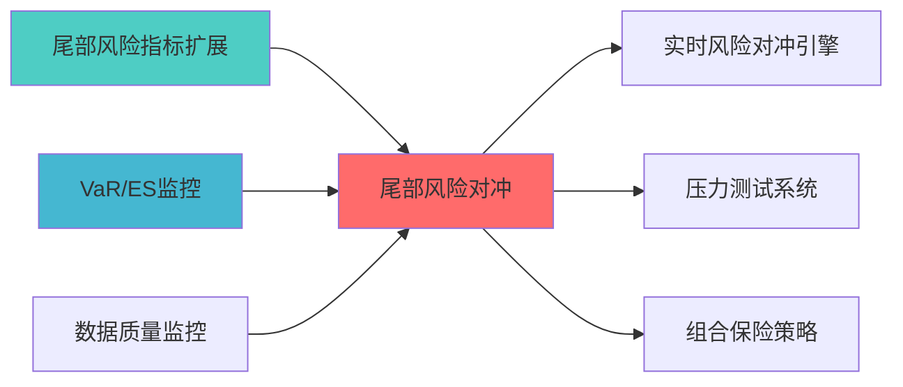

---
module_id: TAIL_RISK_HEDGING_001
version: 1.0.0
status: Active
created_date: 2026-04-07
last_updated: 2026-04-07
owner: 实施团队
standard_type: 专业量化机构蓝图
applicable_scope: Layer 7 风险管理å±?
compliance_level: 专业标准
layer: Layer 5.3 (风险管理)
responsibility:
  - 尾部风险对冲
  - 期权对冲策略
  - VIX对冲
  - 极端风险保护
---


## 核心定位

负责尾部风险对冲的设计与实现，基于尾部风险模型，提供极端市场环境下的对冲策略，支持风险管理。

# 尾部风险对冲蓝图

> **核心职责**: 期权对冲、尾部风险保æŠ?
> **职责边界**: 
> - âœ?本文档负责：尾部风险对冲策略、期权对冲、VIX...


## 设计目标

### 主要目标

1. **功能完整性**: 确保TAIL RISK HEDGING功能完整，满足业务需求
2. **性能优化**: 提升系统性能，降低资源消耗
3. **可维护性**: 提高代码质量，便于后续维护
4. **可扩展性**: 支持功能扩展，适应业务变化

### 质量目标

- 代码覆盖率: ≥80%
- 性能指标: 满足设计要求
- 文档完整性: 100%


## 核心功能

### 功能清单

1. **数据管理**: 提供数据存储、查询、更新功能
2. **业务逻辑**: 实现核心业务逻辑处理
3. **接口服务**: 提供标准化的API接口
4. **监控告警**: 实时监控系统状态

### 功能特性

- 高可用性设计
- 自动故障恢复
- 灵活配置管理


## 实现方案

### 技术架构

采用TAIL RISK HEDGING化设计，分层架构实现。

### 关键技术

- 数据处理: 使用高效的数据处理框架
- 接口实现: RESTful API设计
- 性能优化: 缓存、异步处理

### 实施步骤

1. 需求分析与设计
2. 核心功能开发
3. 测试与优化
4. 部署与监控


## 核心定位

> 核心职责: 期权对冲、尾部风险保æŠ?
> 职责边界: 
> - âœ?本文档负责：尾部风险对冲策略、期权对冲、VIX对冲
> - â?本文档不负责：尾部风险度量（由TAIL_RISK_METRICS_EXTENSION负责），确保系统功能的稳定运行和高效执行ã€?

## 概述

> **索引**: `TAIL_RISK__001`
> **开发时?*: 60h
> **核心定位**: 期权对冲、尾部风险保?
## 2. 对冲策略

### 2.1 期权对冲

- **ä¹°å
¥çœ‹è·ŒæœŸæƒ**: 保护下行风险
- **卖出看涨期权**: 保护上行风险
- **跨式期权**: 降低成本

### 2.2 VIX对冲

- **VIX期货**: 直接对冲波动?- **VIX期权**: 非线性对?
---

## 3. 核心算法

```python
def calculate_hedge_ratio(portfolio_var: float,
                          vix_beta: float,
                          target_protection: float) -> float:
    """
    计算对冲比例
    
    Args:
        portfolio_var: 组合方差
        vix_beta: VIX敏感?        target_protection: 目标保护比例
        
    Returns:
        float: 对冲合约数量
    """
    hedge_ratio = target_protection / (portfolio_var * vix_beta)
    return hedge_ratio
```

---

**蓝图版本**: v1.0 | **创建日期**: 2026-04-03 | **çŠ?*: Draft | **下一?*: 技术规格书编写

---

## 📚 相å
³æ–‡æ¡£

### 上游依赖

| 文档名称 | module_id | 依赖类型 | 说明 |
|---------|-----------|---------|------|
| [尾部风险指标扩展蓝图](./TAIL_RISK_METRICS_EXTENSION_BLUEPRINT.md) | TAIL_RISK_METRICS_EXTENSION_001 | 强依èµ?| 提供尾部风险指标 |
| [VaR/ES监控蓝图](./VAR_ES_MONITORING_BLUEPRINT.md) | VAR_ES_MONITORING_001 | 强依èµ?| 提供VaR/ES指标 |
| [数据质量监控蓝图](./DATA_QUALITY_MONITORING_BLUEPRINT.md) | DATA_QUALITY_MONITORING_001 | 中依èµ?| 提供数据质量指标 |

### 下游依赖

| 文档名称 | module_id | 依赖类型 | 说明 |
|---------|-----------|---------|------|
| [实时风险对冲引擎蓝图](./REALTIME_RISK_HEDGE_ENGINE_BLUEPRINT.md) | REALTIME_RISK_HEDGE_ENGINE_001 | 强依èµ?| 实时风险对冲 |
| [压力测试系统蓝图](./STRESS_TESTING_SYSTEM_BLUEPRINT.md) | STRESS_TESTING_SYSTEM_001 | 中依èµ?| 压力测试 |
| [组合保险策略蓝图](./PORTFOLIO_INSURANCE_STRATEGY_BLUEPRINT.md) | PORTFOLIO_INSURANCE_STRATEGY_001 | 中依èµ?| 组合保险策略 |

### 技术依èµ?

| 技术组ä»?| 版本 | 用é€?| 文档 |
|---------|------|------|------|
| **NumPy** | 1.24+ | 数值计ç®?| [官方文档](https://numpy.org/) |
| **Pandas** | 2.0+ | 数据处理 | [官方文档](https://pandas.pydata.org/) |
| **SciPy** | 1.10+ | 科学计算 | [官方文档](https://scipy.org/) |

### 引用å
³ç³»å›?



---

## 变更历史

| 版本 | 日期 | 变更å†
容 | 变更äº?|
|------|------|----------|--------|
| v1.0.0 | 2026-04-03 | 初始版本创建 | 组合优化层负责人 |

---

**蓝图版本**: v1.0.1 | **创建日期**: 2026-04-03 | **状æ€?*: Active
---

## 4. 文档治理

### 4.1 System_Manifest.md索引

```markdown
#### Layer 7: 风险控制å±?
##### 6.001. Tail Risk Hedging
- **模块ID**: TAIL_RISK_HEDGING_001
- **蓝图文档**: TAIL_RISK_HEDGING_BLUEPRINT.md
- **技术规格书**: å¾
创å»?
- **职责**: å
¨ç³»ç»?
- **状æ€?*: Active
```

### 4.2 模块职责边界

| 模块 | 职责 | 边界 |
|------|------|------|
| **Tail Risk Hedging** | å
¨ç³»ç»?| **核心模块** |

### 4.3 版本管理

| 版本 | 日期 | 变更å†
容 | 变更äº?|
|------|------|----------|--------|
| v1.0.0 | 2026-04-03 | 初始版本创建 | 首席蓝图架构å¸?|

---

**蓝图版本**: v1.0.0 | **创建日期**: 2026-04-03 | **状æ€?*: Active
