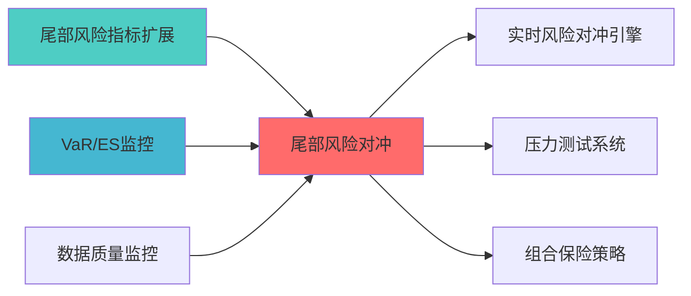

# 尾部风险对冲蓝图

> **核心职责**: 期权对冲、尾部风险保护
> **职责边界**: 
> - ✅ 本文档负责：尾部风险对冲策略、期权对冲、VIX对冲
> - ❌ 本文档不负责：尾部风险度量（由TAIL_RISK_METRICS_EXTENSION负责）

## 核心定位

> 核心职责: 期权对冲、尾部风险保护
> 职责边界: 
> - ✅ 本文档负责：尾部风险对冲策略、期权对冲、VIX对冲
> - ❌ 本文档不负责：尾部风险度量（由TAIL_RISK_METRICS_EXTENSION负责），确保系统功能的稳定运行和高效执行。

## 概述

> **索引**: `TAIL_RISK_BLUEPRINT_001`
> **开发时?*: 60h
> **核心定位**: 期权对冲、尾部风险保?
## 2. 对冲策略

### 2.1 期权对冲

- **买入看跌期权**: 保护下行风险
- **卖出看涨期权**: 保护上行风险
- **跨式期权**: 降低成本

### 2.2 VIX对冲

- **VIX期货**: 直接对冲波动?- **VIX期权**: 非线性对?
---

## 3. 核心算法

```python
def calculate_hedge_ratio(portfolio_var: float,
                          vix_beta: float,
                          target_protection: float) -> float:
    """
    计算对冲比例
    
    Args:
        portfolio_var: 组合方差
        vix_beta: VIX敏感?        target_protection: 目标保护比例
        
    Returns:
        float: 对冲合约数量
    """
    hedge_ratio = target_protection / (portfolio_var * vix_beta)
    return hedge_ratio
```

---

**蓝图版本**: v1.0 | **创建日期**: 2026-04-03 | **状?*: Draft | **下一?*: 技术规格书编写

---

## 📚 相关文档

### 上游依赖

| 文档名称 | module_id | 依赖类型 | 说明 |
|---------|-----------|---------|------|
| [尾部风险指标扩展蓝图](./TAIL_RISK_METRICS_EXTENSION_BLUEPRINT.md) | TAIL_RISK_METRICS_EXTENSION_001 | 强依赖 | 提供尾部风险指标 |
| [VaR/ES监控蓝图](./VAR_ES_MONITORING_BLUEPRINT.md) | VAR_ES_MONITORING_001 | 强依赖 | 提供VaR/ES指标 |
| [数据质量监控蓝图](./DATA_QUALITY_MONITORING_BLUEPRINT.md) | DATA_QUALITY_MONITORING_001 | 中依赖 | 提供数据质量指标 |

### 下游依赖

| 文档名称 | module_id | 依赖类型 | 说明 |
|---------|-----------|---------|------|
| [实时风险对冲引擎蓝图](./REALTIME_RISK_HEDGE_ENGINE_BLUEPRINT.md) | REALTIME_RISK_HEDGE_ENGINE_001 | 强依赖 | 实时风险对冲 |
| [压力测试系统蓝图](./STRESS_TESTING_SYSTEM_BLUEPRINT.md) | STRESS_TESTING_SYSTEM_001 | 中依赖 | 压力测试 |
| [组合保险策略蓝图](./PORTFOLIO_INSURANCE_STRATEGY_BLUEPRINT.md) | PORTFOLIO_INSURANCE_STRATEGY_001 | 中依赖 | 组合保险策略 |

### 技术依赖

| 技术组件 | 版本 | 用途 | 文档 |
|---------|------|------|------|
| **NumPy** | 1.24+ | 数值计算 | [官方文档](https://numpy.org/) |
| **Pandas** | 2.0+ | 数据处理 | [官方文档](https://pandas.pydata.org/) |
| **SciPy** | 1.10+ | 科学计算 | [官方文档](https://scipy.org/) |

### 引用关系图



---

## 变更历史

| 版本 | 日期 | 变更内容 | 变更人 |
|------|------|----------|--------|
| v1.0.0 | 2026-04-03 | 初始版本创建 | 组合优化层负责人 |

---

**蓝图版本**: v1.0.1 | **创建日期**: 2026-04-03 | **状态**: Active
---

## 4. 文档治理

### 4.1 System_Manifest.md索引

```markdown
#### Layer 7: 风险控制层
##### 6.001. Tail Risk Hedging
- **模块ID**: TAIL_RISK_HEDGING_001
- **蓝图文档**: TAIL_RISK_HEDGING_BLUEPRINT.md
- **技术规格书**: 待创建
- **职责**: 全系统
- **状态**: Active
```

### 4.2 模块职责边界

| 模块 | 职责 | 边界 |
|------|------|------|
| **Tail Risk Hedging** | 全系统 | **核心模块** |

### 4.3 版本管理

| 版本 | 日期 | 变更内容 | 变更人 |
|------|------|----------|--------|
| v1.0.0 | 2026-04-03 | 初始版本创建 | 首席蓝图架构师 |

---

**蓝图版本**: v1.0.0 | **创建日期**: 2026-04-03 | **状态**: Active
