## 核心定位

负责尾部风险指标扩展的设计与实现，扩展尾部风险度量指标，提供尾部风险监控和分析功能，支持风险管理。

# 尾部风险度量扩展蓝图

> **核心职责**: 扩展尾部风险度量，支持CVaR、EVaR、CDaR等高级风险指æ ?
> **职责边界**: 
> - âœ?本文档负责：尾部风险度量、CVaR/EVaR/CDaR计算、高级风险指æ ?
> - â?本文档不负责：尾部风险对冲策略（由TAIL_RISK_HEDGING负责ï¼?

> **核心定位**: 尾部风险度量扩展蓝图的核心功能实çŽ?


> **模块ID**: TAIL_RISK_METRICS_EXTENSION_001
> **创建日期**: 2026-04-07
> **核心定位**: 扩展尾部风险度量，支持CVaR、EVaR、CDaR等高级风险指æ ?
> **索引**: `TAIL_RISK_METRICS_EXTENSION_001`
> **开发周æœ?*: 1å‘?

## 核心定位

> 核心职责: 扩展尾部风险度量，支持CVaR、EVaR、CDaR等高级风险指æ ?
> 职责边界: 
> - âœ?本文档负责：尾部风险度量、CVaR/EVaR/CDaR计算、高级风险指æ ?
> - â?本文档不负责：尾部风险对冲策略（由TAIL_RISK_HEDGING负责），确保系统功能的稳定运行和高效执行ã€?

## 2. 功能设计

### 2.1 核心功能

```python
class TailRiskMetrics:
    """
    尾部风险度量å™?
    
    开源依èµ? Riskfolio-Lib
    """
    
    def cvar(
        self,
        returns: np.ndarray,
        alpha: float = 0.05
    ) -> float:
        """
        条件风险价值（CVaR / Expected Shortfallï¼?
        
        CVaR = E[R | R <= VaR]
        
        超过VaR的平均损å¤?
        """
        pass
    
    def evar(
        self,
        returns: np.ndarray,
        alpha: float = 0.05
    ) -> float:
        """
        熵风险价值（EVaRï¼?
        
        基于熵的风险度量，更保守的尾部风险估è®?
        """
        pass
    
    def cdar(
        self,
        returns: np.ndarray,
        alpha: float = 0.05
    ) -> float:
        """
        条件回撤风险（CDaRï¼?
        
        基于回撤的尾部风险度é‡?
        """
        pass
    
    def max_drawdown(
        self,
        returns: np.ndarray
    ) -> float:
        """
        最大回æ’?
        """
        pass
    
    def ulcer_index(
        self,
        returns: np.ndarray
    ) -> float:
        """
        Ulcer指数
        
        考虑回撤持续时间的风险度é‡?
        """
        pass
    
    def optimize_min_cvar(
        self,
        returns: np.ndarray,
        alpha: float = 0.05,
        constraints: Optional[Dict] = None
    ) -> Dict:
        """
        最小CVaR优化
        
        开源依èµ? Riskfolio-Lib
        """
        pass
```

---

## 3. 配置参数

```yaml
tail_risk_metrics:
  # CVaR配置
  cvar:
    alpha: 0.05  # 95%置信水平
    
  # EVaR配置
  evar:
    alpha: 0.05
    
  # CDaR配置
  cdar:
    alpha: 0.05
    
  # 回撤配置
  drawdown:
    max_threshold: 0.20  # 最大回撤阈å€?
```

---

## 📚 相关文档

### 上游依赖

| 文档名称 | module_id | 依赖类型 | 说明 |
|---------|-----------|---------|------|
| [VaR/ES监控蓝图](./VAR_ES_MONITORING_BLUEPRINT.md) | VAR_ES_MONITORING_001 | 强依èµ?| 提供VaR/ES指标 |
| [数据质量监控蓝图](./DATA_QUALITY_MONITORING_BLUEPRINT.md) | DATA_QUALITY_MONITORING_001 | 强依èµ?| 提供数据质量指标 |
| [组合情景分析蓝图](./PORTFOLIO_SCENARIO_ANALYSIS_BLUEPRINT.md) | PORTFOLIO_SCENARIO_ANALYSIS_001 | 中依èµ?| 提供情景分析 |

### 下游依赖

| 文档名称 | module_id | 依赖类型 | 说明 |
|---------|-----------|---------|------|
| [尾部风险对冲蓝图](./TAIL_RISK_HEDGING_BLUEPRINT.md) | TAIL_RISK_HEDGING_001 | 强依èµ?| 尾部风险对冲 |
| [压力测试系统蓝图](./STRESS_TESTING_SYSTEM_BLUEPRINT.md) | STRESS_TESTING_SYSTEM_001 | 中依èµ?| 压力测试 |
| [风险归因系统蓝图](./RISK_ATTRIBUTION_SYSTEM_BLUEPRINT.md) | RISK_ATTRIBUTION_SYSTEM_001 | 中依èµ?| 风险归因 |

### 技术依èµ?

| 技术组ä»?| 版本 | 用é€?| 文档 |
|---------|------|------|------|
| **NumPy** | 1.24+ | 数值计ç®?| [官方文档](https://numpy.org/) |
| **Pandas** | 2.0+ | 数据处理 | [官方文档](https://pandas.pydata.org/) |
| **SciPy** | 1.10+ | 科学计算 | [官方文档](https://scipy.org/) |

### 引用关系å›?

```mermaid
graph LR
    A[VaR/ES监控] --> B[尾部风险指标扩展]
    C[数据质量监控] --> B
    D[组合情景分析] --> B
    
    B --> E[尾部风险对冲]
    B --> F[压力测试系统]
    B --> G[风险归因系统]
    
    style B fill:#ff6b6b
    style A fill:#4ecdc4
    style C fill:#45b7d1
```



---

## 4. 变更历史

| 版本 | 日期 | 变更内容 | 变更äº?|
|------|------|----------|--------|
| v1.0.0 | 2026-04-07 | 初始版本创建 | 首席蓝图架构å¸?|

---

**蓝图版本**: v1.0.0 | **创建日期**: 2026-04-07 | **状æ€?*: Active

## 5. 文档治理

### 5.1 文档索引

**本文档在系统中的位置**:
- **所属层çº?*: Layer 0 (系统架构)
- **模块索引**: 001
- **模块名称**: TAIL_RISK_METRICS_EXTENSION
- **文档路径**: docs/05_IMPLEMENTATION/06_CONSTRUCTION_DOCS/01_BLUEPRINTS/

### 5.2 版本管理

**版本历史**:
- v1.0.0 (2026-04-07): 初始版本

### 5.3 维护责任

**文档维护**:
- **责任模块**: TAIL_RISK_METRICS_EXTENSION
- **维护周期**: 每季度审æŸ?
- **变更流程**: 提交变更申请 â†?技术评å®?â†?更新文档

---

**蓝图版本**: v1.0.0 | **创建日期**: 2026-04-07 | **状æ€?*: Active
