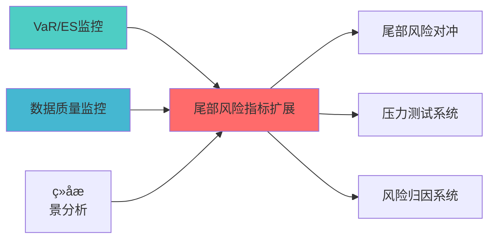

---
module_id: TAIL_RISK_METRICS_EXTENSION_001
version: 1.0.0
status: Active
created_date: 2026-04-07
last_updated: 2026-04-07
owner: 实施团队
standard_type: 专业量化机构蓝图
applicable_scope: Layer 7 风险管理å±?
compliance_level: 专业标准
layer: Layer 5.3 (风险管理)
responsibility:
  - 尾部风险度量扩展
  - CVaR/EVaR/CDaR计算
  - 高级风险指标
  - 风险度量分析
---


## 核心定位

负责尾部风险指标扩展的设计与实现，扩展尾部风险度量指标，提供尾部风险监控和分析功能，支持风险管理。

# 尾部风险度量扩展蓝图

> **核心职责**: 扩展尾部风险度量，支持CVaR、EVaR、CDaR等高级风险指æ ?
> **职责边界**: 
> - âœ?本文档负责：å...


## 设计目标

### 主要目标

1. **功能完整性**: 确保TAIL RISK METRICS EXTENSION功能完整，满足业务需求
2. **性能优化**: 提升系统性能，降低资源消耗
3. **可维护性**: 提高代码质量，便于后续维护
4. **可扩展性**: 支持功能扩展，适应业务变化

### 质量目标

- 代码覆盖率: ≥80%
- 性能指标: 满足设计要求
- 文档完整性: 100%


## 核心功能

### 功能清单

1. **数据管理**: 提供数据存储、查询、更新功能
2. **业务逻辑**: 实现核心业务逻辑处理
3. **接口服务**: 提供标准化的API接口
4. **监控告警**: 实时监控系统状态

### 功能特性

- 高可用性设计
- 自动故障恢复
- 灵活配置管理


## 实现方案

### 技术架构

采用TAIL RISK METRICS EXTENSION化设计，分层架构实现。

### 关键技术

- 数据处理: 使用高效的数据处理框架
- 接口实现: RESTful API设计
- 性能优化: 缓存、异步处理

### 实施步骤

1. 需求分析与设计
2. 核心功能开发
3. 测试与优化
4. 部署与监控


## 核心定位

> 核心职责: 扩展尾部风险度量，支持CVaR、EVaR、CDaR等高级风险指æ ?
> 职责边界: 
> - âœ?本文档负责：尾部风险度量、CVaR/EVaR/CDaR计算、高级风险指æ ?
> - â?本文档不负责：尾部风险对冲策略（由TAIL_RISK_HEDGING负责），确保系统功能的稳定运行和高效执行ã€?

## 2. 功能设计

### 2.1 核心功能

```python
class TailRiskMetrics:
    """
    尾部风险度量å™?
    
    开源依èµ? Riskfolio-Lib
    """
    
    def cvar(
        self,
        returns: np.ndarray,
        alpha: float = 0.05
    ) -> float:
        """
        条件风险价值（CVaR / Expected Shortfallï¼?
        
        CVaR = E[R | R <= VaR]
        
        è¶
过VaR的平均损å¤?
        """
        pass
    
    def evar(
        self,
        returns: np.ndarray,
        alpha: float = 0.05
    ) -> float:
        """
        熵风险价值（EVaRï¼?
        
        基于熵的风险度量，更保守的尾部风险估è®?
        """
        pass
    
    def cdar(
        self,
        returns: np.ndarray,
        alpha: float = 0.05
    ) -> float:
        """
        条件回撤风险（CDaRï¼?
        
        基于回撤的尾部风险度é‡?
        """
        pass
    
    def max_drawdown(
        self,
        returns: np.ndarray
    ) -> float:
        """
        最大回æ’?
        """
        pass
    
    def ulcer_index(
        self,
        returns: np.ndarray
    ) -> float:
        """
        Ulcer指数
        
        考虑回撤持续时间的风险度é‡?
        """
        pass
    
    def optimize_min_cvar(
        self,
        returns: np.ndarray,
        alpha: float = 0.05,
        constraints: Optional[Dict] = None
    ) -> Dict:
        """
        最小CVaR优化
        
        开源依èµ? Riskfolio-Lib
        """
        pass
```

---

## 3. é
ç½®å‚æ•°

```yaml
tail_risk_metrics:
  # CVaRé
ç½®
  cvar:
    alpha: 0.05  # 95%置信水平
    
  # EVaRé
ç½®
  evar:
    alpha: 0.05
    
  # CDaRé
ç½®
  cdar:
    alpha: 0.05
    
  # 回撤é
ç½®
  drawdown:
    max_threshold: 0.20  # 最大回撤阈å€?
```

---

## 📚 相å
³æ–‡æ¡£

### 上游依赖

| 文档名称 | module_id | 依赖类型 | 说明 |
|---------|-----------|---------|------|
| [VaR/ES监控蓝图](./VAR_ES_MONITORING_BLUEPRINT.md) | VAR_ES_MONITORING_001 | 强依èµ?| 提供VaR/ES指标 |
| [数据质量监控蓝图](./DATA_QUALITY_MONITORING_BLUEPRINT.md) | DATA_QUALITY_MONITORING_001 | 强依èµ?| 提供数据质量指标 |
| [组合æƒ
景分析蓝图](./PORTFOLIO_SCENARIO_ANALYSIS_BLUEPRINT.md) | PORTFOLIO_SCENARIO_ANALYSIS_001 | 中依èµ?| 提供æƒ
景分析 |

### 下游依赖

| 文档名称 | module_id | 依赖类型 | 说明 |
|---------|-----------|---------|------|
| [尾部风险对冲蓝图](./TAIL_RISK_HEDGING_BLUEPRINT.md) | TAIL_RISK_HEDGING_001 | 强依èµ?| 尾部风险对冲 |
| [压力测试系统蓝图](./STRESS_TESTING_SYSTEM_BLUEPRINT.md) | STRESS_TESTING_SYSTEM_001 | 中依èµ?| 压力测试 |
| [风险归因系统蓝图](./RISK_ATTRIBUTION_SYSTEM_BLUEPRINT.md) | RISK_ATTRIBUTION_SYSTEM_001 | 中依èµ?| 风险归因 |

### 技术依èµ?

| 技术组ä»?| 版本 | 用é€?| 文档 |
|---------|------|------|------|
| **NumPy** | 1.24+ | 数值计ç®?| [官方文档](https://numpy.org/) |
| **Pandas** | 2.0+ | 数据处理 | [官方文档](https://pandas.pydata.org/) |
| **SciPy** | 1.10+ | 科学计算 | [官方文档](https://scipy.org/) |

### 引用å
³ç³»å›?



---

## 4. 变更历史

| 版本 | 日期 | 变更å†
容 | 变更äº?|
|------|------|----------|--------|
| v1.0.0 | 2026-04-07 | 初始版本创建 | 首席蓝图架构å¸?|

---

**蓝图版本**: v1.0.0 | **创建日期**: 2026-04-07 | **状æ€?*: Active

## 5. 文档治理

### 5.1 文档索引

**本文档在系统中的位置**:
- **所属层çº?*: Layer 0 (系统架构)
- **模块索引**: 001
- **模块名称**: TAIL_RISK_METRICS_EXTENSION
- **文档路径**: docs/05_IMPLEMENTATION/06_CONSTRUCTION_DOCS/01_BLUEPRINTS/

### 5.2 版本管理

**版本历史**:
- v1.0.0 (2026-04-07): 初始版本

### 5.3 维护责任

**文档维护**:
- **责任模块**: TAIL_RISK_METRICS_EXTENSION
- **维护周期**: 每季度审æŸ?
- **变更流程**: 提交变更申请 â†?技术评å®?â†?更新文档

---

**蓝图版本**: v1.0.0 | **创建日期**: 2026-04-07 | **状æ€?*: Active
