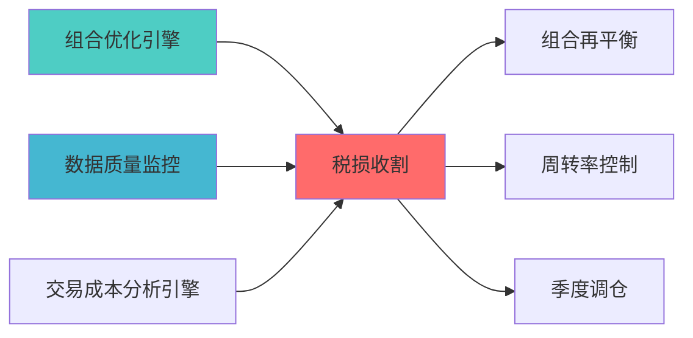

---

# TAX LOSS HARVESTING BLUEPRINT

> **核心职责**: Tax Loss Harvesting蓝图设计
> **职责边界**: 
> - ✅ 本文档负责：Tax Loss Harvesting蓝图设计相关内容
> - ❌ 本文档不负责：其他模块内容

---
module_id: TAX_LOSS_HARVESTING_001
version: 1.0.0
status: Active
created_date: 2026-04-07
last_updated: 2026-04-07
owner: 个人开发者
responsibility:
  - 数据质量
  - 组合优化
  - 交易执行
standard_type: 专业量化机构文档
layer: "Layer 6 (组合优化层)"
# 税收优化（税损收割）蓝图

> **核心定位**: 税收优化（税损收割）蓝图的核心功能实现


> **模块ID**: TAX_LOSS_HARVESTING_001
> **创建日期**: 2026-04-07
> **核心定位**: 实现税损收割策略，优化税后收益，对个人投资者至关重要
> **索引**: `TAX_LOSS_HARVESTING_001`
> **开发周期**: 2周

---
## 核心定位

税务损失收割模块，负责识别和实施税务优化策略，降低税负


## 1. 模块概述

### 1.1 核心职责

**单一职责**: 识别和执行税损收割机会，最大化税后收益

**职责边界**:
- ✅ 负责: 未实现损益计算、洗售规则检测、税损收割机会识别、替代证券选择
- ❌ 不负责: 基础组合优化（由MEAN_VARIANCE_OPTIMIZATION负责）
- ❌ 不负责: 再平衡决策（由PORTFOLIO_REBALANCING负责）

### 1.2 适用场景

**个人投资者专属功能**:
- 降低年度税负
- 延迟资本利得税
- 提高税后收益
- 符合税务合规

### 1.3 开源依赖

| 库名 | 用途 | 说明 |
|------|------|------|
| rebalancer | 参考 | 税损收割逻辑参考 |
| 自研核心 | 主要 | 针对中国/美国税法 |

---

## 2. 功能设计

### 2.1 核心功能

#### 2.1.1 未实现损益计算

```python
class UnrealizedGainLossCalculator:
    """
    未实现损益计算器
    """
    
    def calculate_unrealized_pnl(
        self,
        positions: Dict[str, float],
        cost_basis: Dict[str, float],
        current_prices: Dict[str, float]
    ) -> pd.DataFrame:
        """
        计算未实现损益
        
        参数:
            positions: 持仓数量
            cost_basis: 成本基础
            current_prices: 当前价格
            
        返回:
            未实现损益明细
        """
        pass
    
    def identify_harvest_candidates(
        self,
        unrealized_pnl: pd.DataFrame,
        min_loss_threshold: float = 1000.0
    ) -> List[Dict]:
        """
        识别税损收割候选
        
        参数:
            unrealized_pnl: 未实现损益
            min_loss_threshold: 最小损失阈值
            
        返回:
            候选列表
        """
        pass
```

#### 2.1.2 洗售规则检测

```python
class WashSaleDetector:
    """
    洗售规则检测器
    
    美国: 30天内不能买入相同或实质相同证券
    中国: 无洗售规则限制
    """
    
    def check_wash_sale(
        self,
        security: str,
        trade_date: datetime,
        lookback_days: int = 30,
        forward_days: int = 30
    ) -> bool:
        """
        检查是否违反洗售规则
        
        返回:
            True: 违反洗售规则
            False: 可以执行
        """
        pass
    
    def find_wash_sale_period(
        self,
        security: str,
        trade_date: datetime
    ) -> Tuple[datetime, datetime]:
        """
        查找洗售规则禁止期
        """
        pass
```

#### 2.1.3 替代证券选择

```python
class SubstituteSecuritySelector:
    """
    替代证券选择器
    
    选择与原证券高度相关但不违反洗售规则的替代品
    """
    
    def find_substitutes(
        self,
        security: str,
        correlation_threshold: float = 0.9,
        exclude_list: List[str] = None
    ) -> List[Dict]:
        """
        查找替代证券
        
        参数:
            security: 原证券
            correlation_threshold: 相关性阈值
            exclude_list: 排除列表（洗售规则相关）
            
        返回:
            替代证券列表（按相关性排序）
        """
        pass
```

#### 2.1.4 税后收益优化

```python
class AfterTaxReturnOptimizer:
    """
    税后收益优化器
    """
    
    def optimize_after_tax(
        self,
        expected_returns: np.ndarray,
        short_term_tax_rate: float = 0.35,
        long_term_tax_rate: float = 0.15,
        holding_periods: Dict[str, int] = None
    ) -> Dict:
        """
        税后收益优化
        
        参数:
            expected_returns: 税前预期收益
            short_term_tax_rate: 短期资本利得税率
            long_term_tax_rate: 长期资本利得税率
            holding_periods: 持仓周期（天）
            
        返回:
            税后优化结果
        """
        pass
    
    def calculate_tax_savings(
        self,
        harvest_amount: float,
        tax_rate: float
    ) -> float:
        """
        计算税收节省
        """
        pass
```

---

## 3. 技术规格

### 3.1 接口设计

```python
class TaxLossHarvester:
    """
    税损收割器
    
    主要接口类
    """
    
    def __init__(
        self,
        tax_jurisdiction: str = 'US',  # US, CN
        wash_sale_days: int = 30
    ):
        self.jurisdiction = tax_jurisdiction
        self.pnl_calculator = UnrealizedGainLossCalculator()
        self.wash_detector = WashSaleDetector()
        self.substitute_selector = SubstituteSecuritySelector()
        self.tax_optimizer = AfterTaxReturnOptimizer()
    
    def scan_harvest_opportunities(
        self,
        portfolio: Dict,
        market_data: Dict
    ) -> List[Dict]:
        """
        扫描税损收割机会
        """
        pass
    
    def execute_harvest(
        self,
        opportunity: Dict,
        auto_substitute: bool = True
    ) -> Dict:
        """
        执行税损收割
        """
        pass
```

### 3.2 配置参数

```yaml
tax_loss_harvesting:
  # 税务管辖
  jurisdiction: 'US'  # US, CN
  
  # 税率
  tax_rates:
    short_term: 0.35  # 短期资本利得
    long_term: 0.15   # 长期资本利得
    
  # 洗售规则
  wash_sale:
    enabled: true
    lookback_days: 30
    forward_days: 30
    
  # 收割阈值
  harvest:
    min_loss_amount: 1000  # 最小损失金额
    min_tax_savings: 150   # 最小税收节省
    
  # 替代证券
  substitute:
    correlation_threshold: 0.9
    max_tracking_error: 0.02
```

---

## 📚 相关文档

### 上游依赖

| 文档名称 | module_id | 依赖类型 | 说明 |
|---------|-----------|---------|------|
| [组合优化引擎集成蓝图](./PORTFOLIO_OPTIMIZER_INTEGRATION_BLUEPRINT.md) | PORTFOLIO_OPTIMIZER_INTEGRATION_001 | 强依赖 | 提供优化器基础接口 |
| [数据质量监控蓝图](./DATA_QUALITY_MONITORING_BLUEPRINT.md) | DATA_QUALITY_MONITORING_001 | 强依赖 | 提供数据质量指标 |
| [交易成本分析引擎蓝图](./TRANSACTION_COST_ANALYSIS_ENGINE_BLUEPRINT.md) | TRANSACTION_COST_ANALYSIS_ENGINE_001 | 中依赖 | 提供成本分析 |

### 下游依赖

| 文档名称 | module_id | 依赖类型 | 说明 |
|---------|-----------|---------|------|
| [组合再平衡蓝图](./PORTFOLIO_REBALANCING_BLUEPRINT.md) | PORTFOLIO_REBALANCING_001 | 强依赖 | 组合再平衡 |
| [周转率控制蓝图](./TURNOVER_CONTROL_BLUEPRINT.md) | TURNOVER_CONTROL_001 | 中依赖 | 周转率控制 |
| [季度调仓蓝图](./QUARTERLY_REBALANCE_BLUEPRINT.md) | QUARTERLY_REBALANCE_001 | 中依赖 | 季度调仓决策 |

### 技术依赖

| 技术组件 | 版本 | 用途 | 文档 |
|---------|------|------|------|
| **NumPy** | 1.24+ | 数值计算 | [官方文档](https://numpy.org/) |
| **Pandas** | 2.0+ | 数据处理 | [官方文档](https://pandas.pydata.org/) |
| **SciPy** | 1.10+ | 科学计算 | [官方文档](https://scipy.org/) |

### 引用关系图



---

## 4. 变更历史

| 版本 | 日期 | 变更内容 | 变更人 |
|------|------|----------|--------|
| v1.0.0 | 2026-04-07 | 初始版本创建 | 首席蓝图架构师 |

---

**蓝图版本**: v1.0.0 | **创建日期**: 2026-04-07 | **状态**: Active

## 5. 文档治理

### 5.1 文档索引

**本文档在系统中的位置**:
- **所属层级**: Layer 6 (组合优化层)
- **模块索引**: 001
- **模块名称**: TAX_LOSS_HARVESTING
- **文档路径**: docs/05_IMPLEMENTATION/06_CONSTRUCTION_DOCS/01_BLUEPRINTS/

### 5.2 版本管理

**版本历史**:
- v1.0.0 (2026-04-07): 初始版本

### 5.3 维护责任

**文档维护**:
- **责任模块**: TAX_LOSS_HARVESTING
- **维护周期**: 每季度审查
- **变更流程**: 提交变更申请 → 技术评审 → 更新文档

---

**蓝图版本**: v1.0.0 | **创建日期**: 2026-04-07 | **状态**: Active
