---
responsibility:
  - 税收优化
  - 税损收割
  - 税务筹划
  - 成本优化

module_id: TAX_LOSS_HARVESTING_001
version: 1.0.0
status: Active
created_date: 2026-04-07
last_updated: 2026-04-07
owner: 实施团队
standard_type: 专业量化机构蓝图
applicable_scope: Layer 6 组合优化å±?
compliance_level: 专业标准
layer: Layer 5.2 (组合优化)
---

# 税收优化（税损收割）蓝图

> **核心职责**: 实现税损收割策略，优化税后收ç›?
> **职责边界**: 
> - âœ?本文档负责：税损识别、收割策略、wash sale规避
> - â?本文档不负责：因子计算（由因子模块负责）


## 核心定位

负责Tax Loss Harvesting的设计、实现和维护，提供核心功能支持，确保系统模块的稳定运行和高效执行ã€?

## 设计目标

### 主要目标

1. **功能完整性**: 确保TAX LOSS HARVESTING功能完整，满足业务需求
2. **性能优化**: 提升系统性能，降低资源消耗
3. **可维护性**: 提高代码质量，便于后续维护
4. **可扩展性**: 支持功能扩展，适应业务变化

### 质量目标

- 代码覆盖率: ≥80%
- 性能指标: 满足设计要求
- 文档完整性: 100%


## 核心功能

### 功能清单

1. **数据管理**: 提供数据存储、查询、更新功能
2. **业务逻辑**: 实现核心业务逻辑处理
3. **接口服务**: 提供标准化的API接口
4. **监控告警**: 实时监控系统状态

### 功能特性

- 高可用性设计
- 自动故障恢复
- 灵活配置管理


## 实现方案

### 技术架构

采用TAX LOSS HARVESTING化设计，分层架构实现。

### 关键技术

- 数据处理: 使用高效的数据处理框架
- 接口实现: RESTful API设计
- 性能优化: 缓存、异步处理

### 实施步骤

1. 需求分析与设计
2. 核心功能开发
3. 测试与优化
4. 部署与监控


## 1. 模块概述

### 1.1 核心职责

**单一职责**: 识别和执行税损收割机会，最大化税后收益

**职责边界**:
- âœ?负责: 未实现损益计算、洗售规则检测、税损收割机会识别、替代证券选择
- â?不负è´? 基础组合优化（由MEAN_VARIANCE_OPTIMIZATION负责ï¼?
- â?不负è´? 再平衡决策（由PORTFOLIO_REBALANCING负责ï¼?

### 1.2 适用场景

**个人投资者专属功èƒ?*:
- 降低年度税负
- 延迟资本利得ç¨?
- 提高税后收益
- 符合税务合规

### 1.3 开源依èµ?

| 库名 | 用é€?| 说明 |
|------|------|------|
| rebalancer | 参è€?| 税损收割逻辑参è€?|
| 自研核心 | 主要 | 针对中国/美国税法 |

---

## 2. 功能设计

### 2.1 核心功能

#### 2.1.1 未实现损益计ç®?

```python
class UnrealizedGainLossCalculator:
    """
    未实现损益计算器
    """
    
    def calculate_unrealized_pnl(
        self,
        positions: Dict[str, float],
        cost_basis: Dict[str, float],
        current_prices: Dict[str, float]
    ) -> pd.DataFrame:
        """
        计算未实现损ç›?
        
        参数:
            positions: 持仓数量
            cost_basis: 成本基础
            current_prices: 当前价格
            
        返回:
            未实现损益明ç»?
        """
        pass
    
    def identify_harvest_candidates(
        self,
        unrealized_pnl: pd.DataFrame,
        min_loss_threshold: float = 1000.0
    ) -> List[Dict]:
        """
        识别税损收割候é€?
        
        参数:
            unrealized_pnl: 未实现损ç›?
            min_loss_threshold: 最小损失阈å€?
            
        返回:
            候选列è¡?
        """
        pass
```

#### 2.1.2 洗售规则检æµ?

```python
class WashSaleDetector:
    """
    洗售规则检测器
    
    美国: 30天内不能买入相同或实质相同证åˆ?
    中国: 无洗售规则限åˆ?
    """
    
    def check_wash_sale(
        self,
        security: str,
        trade_date: datetime,
        lookback_days: int = 30,
        forward_days: int = 30
    ) -> bool:
        """
        检查是否违反洗售规åˆ?
        
        返回:
            True: 违反洗售规则
            False: 可以执行
        """
        pass
    
    def find_wash_sale_period(
        self,
        security: str,
        trade_date: datetime
    ) -> Tuple[datetime, datetime]:
        """
        查找洗售规则禁止æœ?
        """
        pass
```

#### 2.1.3 替代证券选择

```python
class SubstituteSecuritySelector:
    """
    替代证券选择å™?
    
    选择与原证券高度相关但不违反洗售规则的替代品
    """
    
    def find_substitutes(
        self,
        security: str,
        correlation_threshold: float = 0.9,
        exclude_list: List[str] = None
    ) -> List[Dict]:
        """
        查找替代证券
        
        参数:
            security: 原证åˆ?
            correlation_threshold: 相关性阈å€?
            exclude_list: 排除列表（洗售规则相关）
            
        返回:
            替代证券列表（按相关性排序）
        """
        pass
```

#### 2.1.4 税后收益优化

```python
class AfterTaxReturnOptimizer:
    """
    税后收益优化å™?
    """
    
    def optimize_after_tax(
        self,
        expected_returns: np.ndarray,
        short_term_tax_rate: float = 0.35,
        long_term_tax_rate: float = 0.15,
        holding_periods: Dict[str, int] = None
    ) -> Dict:
        """
        税后收益优化
        
        参数:
            expected_returns: 税前预期收益
            short_term_tax_rate: 短期资本利得税率
            long_term_tax_rate: 长期资本利得税率
            holding_periods: 持仓周期（天ï¼?
            
        返回:
            税后优化结果
        """
        pass
    
    def calculate_tax_savings(
        self,
        harvest_amount: float,
        tax_rate: float
    ) -> float:
        """
        计算税收节省
        """
        pass
```

---

## 3. 技术规æ ?

### 3.1 接口设计

```python
class TaxLossHarvester:
    """
    税损收割å™?
    
    主要接口�
    """
    
    def __init__(
        self,
        tax_jurisdiction: str = 'US',  # US, CN
        wash_sale_days: int = 30
    ):
        self.jurisdiction = tax_jurisdiction
        self.pnl_calculator = UnrealizedGainLossCalculator()
        self.wash_detector = WashSaleDetector()
        self.substitute_selector = SubstituteSecuritySelector()
        self.tax_optimizer = AfterTaxReturnOptimizer()
    
    def scan_harvest_opportunities(
        self,
        portfolio: Dict,
        market_data: Dict
    ) -> List[Dict]:
        """
        扫描税损收割机会
        """
        pass
    
    def execute_harvest(
        self,
        opportunity: Dict,
        auto_substitute: bool = True
    ) -> Dict:
        """
        执行税损收割
        """
        pass
```

### 3.2 配置参数

```yaml
tax_loss_harvesting:
  # 税务管辖
  jurisdiction: 'US'  # US, CN
  
  # 税率
  tax_rates:
    short_term: 0.35  # 短期资本利得
    long_term: 0.15   # 长期资本利得
    
  # 洗售规则
  wash_sale:
    enabled: true
    lookback_days: 30
    forward_days: 30
    
  # 收割阈å€?
  harvest:
    min_loss_amount: 1000  # 最小损失金é¢?
    min_tax_savings: 150   # 最小税收节çœ?
    
  # 替代证券
  substitute:
    correlation_threshold: 0.9
    max_tracking_error: 0.02
```

---

## 📚 相关文档

### 上游依赖

| 文档名称 | module_id | 依赖类型 | 说明 |
|---------|-----------|---------|------|
| [组合优化引擎集成蓝图](./PORTFOLIO_OPTIMIZER_INTEGRATION_BLUEPRINT.md) | PORTFOLIO_OPTIMIZER_INTEGRATION_001 | 强依èµ?| 提供优化器基础接口 |
| [数据质量监控蓝图](./DATA_QUALITY_MONITORING_BLUEPRINT.md) | DATA_QUALITY_MONITORING_001 | 强依èµ?| 提供数据质量指标 |
| [交易成本分析引擎蓝图](./TRANSACTION_COST_ANALYSIS_ENGINE_BLUEPRINT.md) | TRANSACTION_COST_ANALYSIS_ENGINE_001 | 中依èµ?| 提供成本分析 |

### 下游依赖

| 文档名称 | module_id | 依赖类型 | 说明 |
|---------|-----------|---------|------|
| [组合再平衡蓝图](./PORTFOLIO_REBALANCING_BLUEPRINT.md) | PORTFOLIO_REBALANCING_001 | 强依èµ?| 组合再平è¡?|
| [周转率控制蓝图](./TURNOVER_CONTROL_BLUEPRINT.md) | TURNOVER_CONTROL_001 | 中依èµ?| 周转率控åˆ?|
| [季度调仓蓝图](./QUARTERLY_REBALANCE_BLUEPRINT.md) | QUARTERLY_REBALANCE_001 | 中依èµ?| 季度调仓决策 |

### 技术依èµ?

| 技术组ä»?| 版本 | 用é€?| 文档 |
|---------|------|------|------|
| **NumPy** | 1.24+ | 数值计ç®?| [官方文档](https://numpy.org/) |
| **Pandas** | 2.0+ | 数据处理 | [官方文档](https://pandas.pydata.org/) |
| **SciPy** | 1.10+ | 科学计算 | [官方文档](https://scipy.org/) |

### 引用关系å›?

```mermaid
graph LR
    A[组合优化引擎] --> B[税损收割]
    C[数据质量监控] --> B
    D[交易成本分析引擎] --> B
    
    B --> E[组合再平衡]
    B --> F[周转率控制]
    B --> G[季度调仓]
    
    style B fill:#ff6b6b
    style A fill:#4ecdc4
    style C fill:#45b7d1
```



---

## 4. 变更历史

| 版本 | 日期 | 变更内容 | 变更äº?|
|------|------|----------|--------|
| v1.0.0 | 2026-04-07 | 初始版本创建 | 首席蓝图架构å¸?|

---

**蓝图版本**: v1.0.0 | **创建日期**: 2026-04-07 | **状æ€?*: Active

## 5. 文档治理

### 5.1 文档索引

**本文档在系统中的位置**:
- **所属层çº?*: Layer 6 (组合优化å±?
- **模块索引**: 001
- **模块名称**: TAX_LOSS_HARVESTING
- **文档路径**: docs/05_IMPLEMENTATION/06_CONSTRUCTION_DOCS/01_BLUEPRINTS/

### 5.2 版本管理

**版本历史**:
- v1.0.0 (2026-04-07): 初始版本

### 5.3 维护责任

**文档维护**:
- **责任模块**: TAX_LOSS_HARVESTING
- **维护周期**: 每季度审æŸ?
- **变更流程**: 提交变更申请 â†?技术评å®?â†?更新文档

---

**蓝图版本**: v1.0.0 | **创建日期**: 2026-04-07 | **状æ€?*: Active
