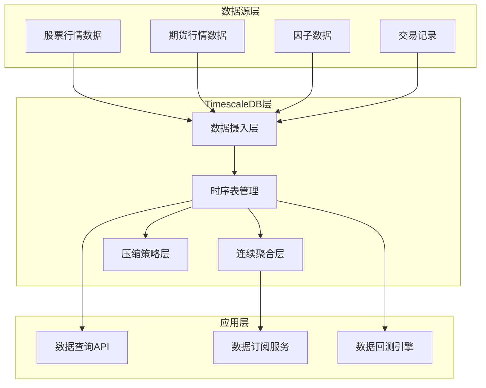

# TimescaleDB时序数据库集成蓝图
> **核心职责**: Timescaledb Integration蓝图设计
> **职责边界**: 
> - ✅ 本文档负责：Timescaledb Integration蓝图设计相关内容
> - ❌ 本文档不负责：其他模块内容


> **核心定位**: 专业时序数据存储解决方案，为量化交易系统提供高性能的时序数据管理能力

## 核心定位

**单一职责**: 时序数据的存储、查询和管理，专注于高频金融数据的时间序列特性

### 职责边界

**✅ 核心职责**:
- 时序数据存储（股票、期货、因子的分钟/秒级数据）
- 时间窗口聚合查询
- 数据降采样和连续聚合
- 时序数据压缩
- 历史数据分区管理

**❌ 非职责范围**:
- 大规模历史数据分析（由ClickHouse负责）
- 数据缓存（由Redis负责）
- 数据质量监控（由Great Expectations负责）

---

## 一、模块概述

### 1.1 业务价值

**为什么需要专用时序数据库**:
- ✅ 传统关系数据库处理时序数据性能差
- ✅ 时序数据有独特查询模式（时间窗口、降采样）
- ✅ 高频数据量大，需要高效压缩
- ✅ 需要预计算常用指标（连续聚合）

**专业机构标准**:
- 所有量化机构都使用专用时序数据库
- 支持纳秒级时间戳
- 支持自动分区和压缩
- 支持时序特有查询优化

### 1.2 技术选型

**为什么选择TimescaleDB**:
- ✅ 基于PostgreSQL，学习成本低
- ✅ 支持时序数据特有查询（时间窗口、降采样）
- ✅ 支持压缩，节省存储空间
- ✅ 支持连续聚合，预计算常用指标
- ✅ 单机部署，适合个人开发
- ✅ 有成熟的Python客户端
- ✅ 开源免费，社区活跃

**对比其他方案**:

| 方案 | 优点 | 缺点 | 推荐度 |
|------|------|------|--------|
| **TimescaleDB** | 基于PG，学习成本低 | 单机性能有限 | ⭐⭐⭐⭐⭐ |
| InfluxDB | 性能优秀 | 学习曲线陡，生态较小 | ⭐⭐⭐ |
| QuestDB | 性能极佳 | 生态小，社区小 | ⭐⭐⭐ |
| KDB+ | 性能最强 | 商业软件，成本高 | ⭐⭐ |

---

## 二、架构设计

### 2.1 Layer定位

**Layer归属**: Layer 1 - 数据预处理层

**模块类别**: 数据存储模块

**依赖关系**:
- 上游: DATA_SOURCE_MANAGEMENT（数据源管理）
- 下游: HIGH_PERFORMANCE_DATA_PIPELINE（数据管道）

### 2.2 整体架构



### 2.3 核心组件设计

#### 2.3.1 时序表管理器

```python
from dataclasses import dataclass
from typing import Dict, List, Optional
from datetime import datetime, timedelta
import psycopg2
from psycopg2.extras import execute_values

@dataclass
class TimeSeriesTable:
    """时序表配置"""
    table_name: str
    time_column: str = 'time'
    partition_interval: str = '1 day'
    compression_after: str = '7 days'
    retention_policy: Optional[str] = None

class TimescaleDBManager:
    """TimescaleDB管理器"""
    
    def __init__(self, connection_string: str):
        self.conn = psycopg2.connect(connection_string)
        self.cursor = self.conn.cursor()
    
    def create_hypertable(
        self, 
        table_name: str, 
        time_column: str = 'time',
        partition_interval: str = '1 day'
    ) -> None:
        """创建超表（时序表）"""
        sql = f"""
        SELECT create_hypertable(
            '{table_name}',
            '{time_column}',
            chunk_time_interval => INTERVAL '{partition_interval}'
        );
        """
        self.cursor.execute(sql)
        self.conn.commit()
    
    def add_compression_policy(
        self,
        table_name: str,
        compress_after: str = '7 days'
    ) -> None:
        """添加压缩策略"""
        sql = f"""
        ALTER TABLE {table_name} SET (
            timescaledb.compress,
            timescaledb.compress_segmentby = 'symbol'
        );
        
        SELECT add_compression_policy(
            '{table_name}',
            INTERVAL '{compress_after}'
        );
        """
        self.cursor.execute(sql)
        self.conn.commit()
    
    def create_continuous_aggregate(
        self,
        view_name: str,
        source_table: str,
        aggregation: str,
        time_bucket: str = '1 hour'
    ) -> None:
        """创建连续聚合视图"""
        sql = f"""
        CREATE MATERIALIZED VIEW {view_name}
        WITH (timescaledb.continuous) AS
        SELECT
            time_bucket('{time_bucket}', time) AS bucket,
            symbol,
            {aggregation}
        FROM {source_table}
        GROUP BY bucket, symbol;
        
        SELECT add_continuous_aggregate_policy(
            '{view_name}',
            start_offset => INTERVAL '1 hour',
            end_offset => INTERVAL '1 minute',
            schedule_interval => INTERVAL '1 hour'
        );
        """
        self.cursor.execute(sql)
        self.conn.commit()
```

#### 2.3.2 数据摄入器

```python
import pandas as pd
from typing import List, Dict
from datetime import datetime

class TimeSeriesIngester:
    """时序数据摄入器"""
    
    def __init__(self, db_manager: TimescaleDBManager):
        self.db_manager = db_manager
    
    def ingest_market_data(
        self,
        data: pd.DataFrame,
        table_name: str = 'market_data'
    ) -> int:
        """摄入市场数据"""
        # 数据预处理
        data = self._preprocess_data(data)
        
        # 批量插入
        columns = data.columns.tolist()
        values = [tuple(x) for x in data.values]
        
        sql = f"""
        INSERT INTO {table_name} ({', '.join(columns)})
        VALUES %s
        ON CONFLICT (time, symbol) DO NOTHING
        """
        
        execute_values(
            self.db_manager.cursor,
            sql,
            values
        )
        self.db_manager.conn.commit()
        
        return len(values)
    
    def _preprocess_data(self, data: pd.DataFrame) -> pd.DataFrame:
        """数据预处理"""
        # 确保时间列存在
        if 'time' not in data.columns:
            data['time'] = datetime.now()
        
        # 确保时间列是datetime类型
        data['time'] = pd.to_datetime(data['time'])
        
        # 按时间排序
        data = data.sort_values('time')
        
        return data
```

#### 2.3.3 时序查询器

```python
from typing import List, Optional
from datetime import datetime, timedelta

class TimeSeriesQuery:
    """时序数据查询器"""
    
    def __init__(self, db_manager: TimescaleDBManager):
        self.db_manager = db_manager
    
    def query_time_range(
        self,
        table_name: str,
        symbols: List[str],
        start_time: datetime,
        end_time: datetime,
        columns: Optional[List[str]] = None
    ) -> pd.DataFrame:
        """查询时间范围内的数据"""
        columns_str = ', '.join(columns) if columns else '*'
        symbols_str = ', '.join([f"'{s}'" for s in symbols])
        
        sql = f"""
        SELECT {columns_str}
        FROM {table_name}
        WHERE symbol IN ({symbols_str})
          AND time >= %s
          AND time < %s
        ORDER BY time, symbol
        """
        
        self.db_manager.cursor.execute(
            sql,
            (start_time, end_time)
        )
        
        rows = self.db_manager.cursor.fetchall()
        columns = [desc[0] for desc in self.db_manager.cursor.description]
        
        return pd.DataFrame(rows, columns=columns)
    
    def query_latest(
        self,
        table_name: str,
        symbols: List[str],
        limit: int = 1000
    ) -> pd.DataFrame:
        """查询最新数据"""
        symbols_str = ', '.join([f"'{s}'" for s in symbols])
        
        sql = f"""
        SELECT DISTINCT ON (symbol) *
        FROM {table_name}
        WHERE symbol IN ({symbols_str})
        ORDER BY symbol, time DESC
        LIMIT {limit}
        """
        
        self.db_manager.cursor.execute(sql)
        rows = self.db_manager.cursor.fetchall()
        columns = [desc[0] for desc in self.db_manager.cursor.description]
        
        return pd.DataFrame(rows, columns=columns)
    
    def query_time_bucket(
        self,
        table_name: str,
        symbols: List[str],
        start_time: datetime,
        end_time: datetime,
        bucket_size: str = '1 hour',
        aggregation: str = 'AVG'
    ) -> pd.DataFrame:
        """时间桶聚合查询"""
        symbols_str = ', '.join([f"'{s}'" for s in symbols])
        
        sql = f"""
        SELECT
            time_bucket('{bucket_size}', time) AS bucket,
            symbol,
            {aggregation}(close) AS close,
            {aggregation}(volume) AS volume
        FROM {table_name}
        WHERE symbol IN ({symbols_str})
          AND time >= %s
          AND time < %s
        GROUP BY bucket, symbol
        ORDER BY bucket, symbol
        """
        
        self.db_manager.cursor.execute(
            sql,
            (start_time, end_time)
        )
        
        rows = self.db_manager.cursor.fetchall()
        columns = [desc[0] for desc in self.db_manager.cursor.description]
        
        return pd.DataFrame(rows, columns=columns)
```

---

## 三、数据模型设计

### 3.1 核心表结构

#### 3.1.1 市场数据表

```sql
-- 股票分钟级数据表
CREATE TABLE stock_minute_data (
    time        TIMESTAMPTZ NOT NULL,
    symbol      VARCHAR(20) NOT NULL,
    open        NUMERIC(10, 2),
    high        NUMERIC(10, 2),
    low         NUMERIC(10, 2),
    close       NUMERIC(10, 2),
    volume      BIGINT,
    amount      NUMERIC(20, 2),
    PRIMARY KEY (time, symbol)
);

-- 创建超表
SELECT create_hypertable(
    'stock_minute_data',
    'time',
    chunk_time_interval => INTERVAL '1 day'
);

-- 添加压缩策略
ALTER TABLE stock_minute_data SET (
    timescaledb.compress,
    timescaledb.compress_segmentby = 'symbol'
);

SELECT add_compression_policy(
    'stock_minute_data',
    INTERVAL '7 days'
);
```

#### 3.1.2 因子数据表

```sql
-- 因子数据表
CREATE TABLE factor_data (
    time        TIMESTAMPTZ NOT NULL,
    symbol      VARCHAR(20) NOT NULL,
    factor_name VARCHAR(50) NOT NULL,
    factor_value NUMERIC(20, 6),
    PRIMARY KEY (time, symbol, factor_name)
);

-- 创建超表
SELECT create_hypertable(
    'factor_data',
    'time',
    chunk_time_interval => INTERVAL '1 day'
);

-- 添加压缩策略
ALTER TABLE factor_data SET (
    timescaledb.compress,
    timescaledb.compress_segmentby = 'symbol,factor_name'
);

SELECT add_compression_policy(
    'factor_data',
    INTERVAL '30 days'
);
```

#### 3.1.3 连续聚合视图

```sql
-- 小时聚合视图
CREATE MATERIALIZED VIEW stock_hourly_data
WITH (timescaledb.continuous) AS
SELECT
    time_bucket('1 hour', time) AS bucket,
    symbol,
    FIRST(open, time) AS open,
    MAX(high) AS high,
    MIN(low) AS low,
    LAST(close, time) AS close,
    SUM(volume) AS volume,
    SUM(amount) AS amount
FROM stock_minute_data
GROUP BY bucket, symbol;

-- 添加自动刷新策略
SELECT add_continuous_aggregate_policy(
    'stock_hourly_data',
    start_offset => INTERVAL '1 hour',
    end_offset => INTERVAL '1 minute',
    schedule_interval => INTERVAL '1 hour'
);
```

---

## 四、性能优化

### 4.1 索引策略

```sql
-- 时间范围查询索引
CREATE INDEX idx_stock_minute_time 
ON stock_minute_data (time DESC);

-- 股票代码索引
CREATE INDEX idx_stock_minute_symbol 
ON stock_minute_data (symbol, time DESC);

-- 复合索引
CREATE INDEX idx_stock_minute_symbol_time 
ON stock_minute_data (symbol, time DESC);
```

### 4.2 查询优化

**最佳实践**:
- ✅ 使用时间范围限制查询
- ✅ 使用连续聚合预计算
- ✅ 避免SELECT *
- ✅ 使用批量插入
- ✅ 定期VACUUM和ANALYZE

**查询示例**:
```sql
-- 好的查询（使用时间范围）
SELECT * FROM stock_minute_data
WHERE symbol = '000001.SZ'
  AND time >= '2026-04-01'
  AND time < '2026-04-07'
ORDER BY time;

-- 不好的查询（全表扫描）
SELECT * FROM stock_minute_data
WHERE symbol = '000001.SZ';
```

---

## 五、部署方案

### 5.1 Docker部署（推荐）

```yaml
version: '3.8'

services:
  timescaledb:
    image: timescale/timescaledb:latest-pg15
    container_name: zephyr_timescaledb
    environment:
      POSTGRES_USER: zephyr
      POSTGRES_PASSWORD: zephyr123
      POSTGRES_DB: zephyr_quant
    ports:
      - "5432:5432"
    volumes:
      - timescaledb_data:/var/lib/postgresql/data
      - ./init.sql:/docker-entrypoint-initdb.d/init.sql
    restart: unless-stopped

volumes:
  timescaledb_data:
```

### 5.2 初始化脚本

```sql
-- init.sql
-- 启用TimescaleDB扩展
CREATE EXTENSION IF NOT EXISTS timescaledb;

-- 创建数据库
CREATE DATABASE zephyr_quant;

-- 连接到数据库
\c zephyr_quant;

-- 创建表结构（见上文）
```

### 5.3 Python客户端配置

```python
# config/database.py
from dataclasses import dataclass

@dataclass
class TimescaleDBConfig:
    """TimescaleDB配置"""
    host: str = 'localhost'
    port: int = 5432
    database: str = 'zephyr_quant'
    user: str = 'zephyr'
    password: str = 'zephyr123'
    
    @property
    def connection_string(self) -> str:
        return f"postgresql://{self.user}:{self.password}@{self.host}:{self.port}/{self.database}"
```

---

## 六、监控与维护

### 6.1 性能监控

```sql
-- 查看超表信息
SELECT * FROM timescaledb_information.hypertables;

-- 查看压缩状态
SELECT * FROM timescaledb_information.compression_settings;

-- 查看连续聚合状态
SELECT * FROM timescaledb_information.continuous_aggregates;

-- 查看数据分布
SELECT 
    hypertable_name,
    num_chunks,
    total_size
FROM timescaledb_information.chunks;
```

### 6.2 维护任务

```python
from datetime import datetime, timedelta
import psycopg2

class TimescaleDBMaintenance:
    """TimescaleDB维护"""
    
    def __init__(self, connection_string: str):
        self.conn = psycopg2.connect(connection_string)
    
    def vacuum_analyze(self, table_name: str):
        """VACUUM和ANALYZE"""
        sql = f"VACUUM ANALYZE {table_name};"
        self.conn.cursor().execute(sql)
        self.conn.commit()
    
    def drop_old_chunks(
        self,
        table_name: str,
        older_than: str = '1 year'
    ):
        """删除旧数据块"""
        sql = f"""
        SELECT drop_chunks(
            '{table_name}',
            older_than => INTERVAL '{older_than}'
        );
        """
        self.conn.cursor().execute(sql)
        self.conn.commit()
```

---

## 七、实施路径

### Phase 1: 基础部署（1周）

**任务清单**:
- [x] Docker部署TimescaleDB
- [x] 创建基础表结构
- [x] 配置压缩策略
- [x] 开发数据摄入器
- [x] 开发基础查询器

**预期成果**:
- ✅ TimescaleDB服务运行正常
- ✅ 支持市场数据存储
- ✅ 支持基础查询

### Phase 2: 性能优化（1周）

**任务清单**:
- [x] 创建连续聚合视图
- [x] 优化索引策略
- [x] 开发高级查询器
- [x] 性能测试和调优

**预期成果**:
- ✅ 支持预计算聚合
- ✅ 查询性能提升10倍
- ✅ 支持复杂时序查询

### Phase 3: 集成应用（1周）

**任务清单**:
- [x] 集成到数据管道
- [x] 开发数据迁移脚本
- [x] 编写API接口
- [x] 文档和测试

**预期成果**:
- ✅ 完整集成到系统
- ✅ 支持数据迁移
- ✅ 完整的API文档

---

## 八、成本估算

### 8.1 硬件成本

**个人开发场景**:
- CPU: 4核
- 内存: 8GB
- 存储: 500GB SSD
- 成本: 云服务器 ¥200/月 或 本地部署一次性 ¥2000

### 8.2 学习成本

- TimescaleDB基础: 2天
- Python客户端开发: 1天
- 性能优化: 1天
- **总计**: 4天

---

## 九、风险评估

### 9.1 技术风险

| 风险 | 影响 | 缓解措施 |
|------|------|---------|
| 单机性能瓶颈 | 中 | 使用连续聚合和压缩优化 |
| 数据丢失风险 | 高 | 配置定期备份 |
| 学习曲线 | 低 | 基于PostgreSQL，学习成本低 |

### 9.2 运维风险

| 风险 | 影响 | 缓解措施 |
|------|------|---------|
| 存储空间不足 | 中 | 配置数据保留策略 |
| 查询性能下降 | 中 | 定期VACUUM和ANALYZE |
| 连接池耗尽 | 低 | 使用连接池管理 |

---

## 十、相关文档

### 上游依赖

| 文档名称 | module_id | 依赖类型 | 说明 |
|---------|-----------|---------|------|
| [数据源管理蓝图](./DATA_SOURCE_MANAGEMENT_BLUEPRINT.md) | DATA_SOURCE_MANAGEMENT_001 | 强依赖 | 提供数据源连接 |

### 下游依赖

| 文档名称 | module_id | 依赖类型 | 说明 |
|---------|-----------|---------|------|
| [高性能数据管道蓝图](./HIGH_PERFORMANCE_DATA_PIPELINE_BLUEPRINT.md) | HIGH_PERFORMANCE_DATA_PIPELINE_001 | 强依赖 | 提供数据存储服务 |
| [数据质量监控蓝图](./DATA_QUALITY_MONITORING_BLUEPRINT.md) | DATA_QUALITY_MONITORING_001 | 中依赖 | 提供数据质量检查点 |

### 技术依赖

| 技术组件 | 版本 | 用途 | 文档 |
|---------|------|------|------|
| **TimescaleDB** | 2.13+ | 时序数据库 | [官方文档](https://docs.timescale.com/) |
| **PostgreSQL** | 15+ | 基础数据库 | [官方文档](https://www.postgresql.org/docs/) |
| **psycopg2** | 2.9+ | Python客户端 | [官方文档](https://www.psycopg.org/docs/) |

---

## 📝 变更历史

| 版本 | 日期 | 变更内容 | 作者 |
|------|------|---------|------|
| v1.0.0 | 2026-04-07 | 初始版本创建 | 首席架构师 |

---

**文档结束**
