---
responsibility:
  - 交易成本优化
  - 成本分析
  - 成本预测
  - 成本控制

module_id: TRADING_COST_OPTIMIZATION_001
version: 1.0.0
status: Active
created_date: 2026-04-07
last_updated: 2026-04-07
owner: 实施团队
standard_type: 专业量化机构蓝图
applicable_scope: Layer 5 交易成本å±?
compliance_level: 专业标准
layer: Layer 5.4 (交易执行)
---

# 交易成本优化蓝图

## 核心定位

负责交易成本优化，分析交易成本构成，优化执行策略，降低交易成本。


> **核心职责**: 使用Almgren-Chriss市场冲击模型优化交易执行
> **职责边界**: 
> - âœ?本文档负责：交易成本优化、市场冲击建模、最优执è¡?
> - â?本文档不负责：因子计算（由因子模块负责）
## 设计目标

### 主要目标

1. **功能完整性**: 确保TRADING COST OPTIMIZATION功能完整，满足业务需求
2. **性能优化**: 提升系统性能，降低资源消耗
3. **可维护性**: 提高代码质量，便于后续维护
4. **可扩展性**: 支持功能扩展，适应业务变化

### 质量目标

- 代码覆盖率: ≥80%
- 性能指标: 满足设计要求
- 文档完整性: 100%


## 核心功能

### 功能清单

1. **数据管理**: 提供数据存储、查询、更新功能
2. **业务逻辑**: 实现核心业务逻辑处理
3. **接口服务**: 提供标准化的API接口
4. **监控告警**: 实时监控系统状态

### 功能特性

- 高可用性设计
- 自动故障恢复
- 灵活配置管理


## 实现方案

### 技术架构

采用TRADING COST OPTIMIZATION化设计，分层架构实现。

### 关键技术

- 数据处理: 使用高效的数据处理框架
- 接口实现: RESTful API设计
- 性能优化: 缓存、异步处理

### 实施步骤

1. 需求分析与设计
2. 核心功能开发
3. 测试与优化
4. 部署与监控


## 📚 相关文档

### 上游依赖

| 文档名称 | module_id | 依赖类型 | 说明 |
|---------|-----------|---------|------|
| [交易成本分析引擎蓝图](./TRANSACTION_COST_ANALYSIS_ENGINE_BLUEPRINT.md) | TRANSACTION_COST_ANALYSIS_ENGINE_001 | 强依èµ?| 提供成本分析数据 |
| [市场冲击模型蓝图](./MARKET_IMPACT_MODEL_BLUEPRINT.md) | MARKET_IMPACT_MODEL_001 | 强依èµ?| 提供市场冲击预测 |
| [组合优化引擎集成蓝图](./PORTFOLIO_OPTIMIZER_INTEGRATION_BLUEPRINT.md) | PORTFOLIO_OPTIMIZER_INTEGRATION_001 | 强依èµ?| 提供优化器基础接口 |

### 下游依赖

| 文档名称 | module_id | 依赖类型 | 说明 |
|---------|-----------|---------|------|
| [交易成本感知再平衡蓝图](./TRANSACTION_COST_AWARE_REBALANCING_BLUEPRINT.md) | TRANSACTION_COST_AWARE_REBALANCING_001 | 强依èµ?| 成本感知再平è¡?|
| [算法交易优化器蓝图](./ALGORITHMIC_TRADING_OPTIMIZER_BLUEPRINT.md) | ALGORITHMIC_TRADING_OPTIMIZER_001 | 中依èµ?| 算法交易执行 |
| [智能订单路由蓝图](./SMART_ORDER_ROUTER_BLUEPRINT.md) | SMART_ORDER_ROUTER_001 | 中依èµ?| 订单路由优化 |

### 技术依èµ?

| 技术组ä»?| 版本 | 用é€?| 文档 |
|---------|------|------|------|
| **NumPy** | 1.24+ | 数值计ç®?| [官方文档](https://numpy.org/) |
| **Pandas** | 2.0+ | 数据处理 | [官方文档](https://pandas.pydata.org/) |
| **SciPy** | 1.10+ | 科学计算 | [官方文档](https://scipy.org/) |
| **CVXPY** | 1.4+ | 凸优åŒ?| [官方文档](https://www.cvxpy.org/) |

### 引用关系å›?

```mermaid
graph LR
    A[交易成本分析引擎] --> B[交易成本优化模型]
    C[市场冲击模型] --> B
    D[组合优化引擎] --> B
    
    B --> E[交易成本感知再平衡]
    B --> F[算法交易优化器]
    B --> G[智能订单路由]
    
    style B fill:#ff6b6b
    style A fill:#4ecdc4
    style C fill:#45b7d1
```



---
## 2. 架构设计

### 2.1 系统架构?
```
┌─────────────────────────────────────────────────────────────────??                   交易成本优化系统架构                           ?├─────────────────────────────────────────────────────────────────??                                                                ?? ┌──────────────────────────────────────────────────────────? ?? ?             输入?                                       ? ?? ? ┌──────────? ┌──────────? ┌──────────? ┌──────────?? ?? ? ?目标组合 ? ?当前组合 ? ?市场数据 ? ?交易约束 ?? ?? ? ?权重     ? ?权重     ? ?(流动? ? ?         ?? ?? ? └──────────? └──────────? └──────────? └──────────?? ?? └──────────────────────────────────────────────────────────? ??                         ?                                     ?? ┌──────────────────────────────────────────────────────────? ?? ?             市场冲击建模?                               ? ?? ? ┌────────────────────────────────────────────────────? ? ?? ? ? Almgren-Chriss Market Impact Model                ? ? ?? ? ? Cost = 0.5·σ·(X/T)^(3/2)·?V)                     ? ? ?? ? ? 其中：X=交易量，T=交易时间，V=市场波动?          ? ? ?? ? └────────────────────────────────────────────────────? ? ?? └──────────────────────────────────────────────────────────? ??                         ?                                     ?? ┌──────────────────────────────────────────────────────────? ?? ?             最优执行算法层                                ? ?? ? ┌──────────? ┌──────────? ┌──────────?              ? ?? ? ?VWAP     ? ?TWAP     ? ?IS       ?              ? ?? ? ?算法     ? ?算法     ? ?算法     ?              ? ?? ? └──────────? └──────────? └──────────?              ? ?? └──────────────────────────────────────────────────────────? ??                         ?                                     ?? ┌──────────────────────────────────────────────────────────? ?? ?             执行计划生成?                               ? ?? ? ┌──────────? ┌──────────? ┌──────────?              ? ?? ? ?交易拆分 ? ?时间安排 ? ?成本估算 ?              ? ?? ? ?策略     ? ?         ? ?         ?              ? ?? ? └──────────? └──────────? └──────────?              ? ?? └──────────────────────────────────────────────────────────? ??                         ?                                     ?? ┌──────────────────────────────────────────────────────────? ?? ?             输出?                                       ? ?? ? ┌──────────? ┌──────────? ┌──────────?              ? ?? ? ?最优执?? ?成本报告 ? ?执行监控 ?              ? ?? ? ?计划     ? ?         ? ?         ?              ? ?? ? └──────────? └──────────? └──────────?              ? ?? └──────────────────────────────────────────────────────────? ?└─────────────────────────────────────────────────────────────────?```

### 2.2 核心数据?
```
目标组合权重 - 当前组合权重
    ?计算交易需求（买入/卖出数量?    ?市场冲击成本估计（Almgren-Chriss模型?    ?选择最优执行算法（VWAP/TWAP/IS?    ?生成执行计划（时间表、分批交易）
    ?输出执行计划与成本估?```

---

## 3. 核心模块设计

### 3.1 交易成本优化器（TradingCostOptimizer?
```python
class TradingCostOptimizer:
    """
    交易成本优化?    
    索引: TRADING_COST_001-M01
    职责: 优化交易执行成本，生成最优执行计?    输入: 目标组合、当前组合、市场数?    输出: 最优执行计划、成本估?    """
    
    def __init__(self, config: TradingCostConfig):
        self.config = config
        self.impact_model = AlmgrenChrissModel(config.impact_config)
        self.execution_algorithms = {
            'VWAP': VWAPAlgorithm(),
            'TWAP': TWAPAlgorithm(),
            'IS': ImplementationShortfallAlgorithm()
        }
        
    def optimize_execution(
        self,
        target_portfolio: pd.Series,
        current_portfolio: pd.Series,
        market_data: pd.DataFrame,
        constraints: Optional[ExecutionConstraints] = None
    ) -> ExecutionPlan:
        """
        优化交易执行
        
        Args:
            target_portfolio: 目标组合权重
            current_portfolio: 当前组合权重
            market_data: 市场数据（包含流动性、波动率?            constraints: 执行约束（可选）
            
        Returns:
            ExecutionPlan: 最优执行计?        """
        # 1. 计算交易需?        trades = self._calculate_trades(target_portfolio, current_portfolio)
        
        # 2. 估计市场冲击成本
        impact_cost = self.impact_model.estimate(trades, market_data)
        
        # 3. 选择最优执行算?        best_algorithm = self._select_algorithm(trades, impact_cost, constraints)
        
        # 4. 生成执行计划
        execution_plan = self._generate_execution_plan(
            trades, best_algorithm, impact_cost
        )
        
        # 5. 计算总成?        total_cost = self._calculate_total_cost(execution_plan, impact_cost)
        
        return ExecutionPlan(
            trades=trades,
            execution_schedule=execution_plan,
            estimated_cost=total_cost,
            algorithm=best_algorithm,
            impact_cost=impact_cost,
            timestamp=datetime.now()
        )
    
    def estimate_market_impact(
        self,
        trades: pd.Series,
        market_data: pd.DataFrame,
        execution_time: int = 1
    ) -> MarketImpactResult:
        """
        估计市场冲击成本
        
        Args:
            trades: 交易需求（买入/卖出数量?            market_data: 市场数据
            execution_time: 执行时间（天?            
        Returns:
            MarketImpactResult: 市场冲击成本结果
        """
        return self.impact_model.estimate(trades, market_data, execution_time)
    
    def compare_algorithms(
        self,
        trades: pd.Series,
        market_data: pd.DataFrame
    ) -> AlgorithmComparison:
        """
        比较不同执行算法的成?        
        Args:
            trades: 交易需?            market_data: 市场数据
            
        Returns:
            AlgorithmComparison: 算法比较结果
        """
        results = {}
        
        for algo_name, algorithm in self.execution_algorithms.items():
            cost = algorithm.estimate_cost(trades, market_data)
            results[algo_name] = cost
        
        return AlgorithmComparison(
            algorithm_costs=results,
            best_algorithm=min(results, key=results.get),
            cost_range=(min(results.values()), max(results.values()))
        )
    
    def _calculate_trades(
        self,
        target: pd.Series,
        current: pd.Series
    ) -> pd.Series:
        """计算交易需?""
        trades = target - current
        return trades[trades != 0]  # 仅返回需要交易的资产
    
    def _select_algorithm(
        self,
        trades: pd.Series,
        impact_cost: MarketImpactResult,
        constraints: Optional[ExecutionConstraints]
    ) -> str:
        """选择最优执行算?""
        # 根据交易规模和市场冲击选择算法
        total_trade_value = abs(trades).sum()
        
        if constraints and constraints.algorithm:
            return constraints.algorithm
        
        # 简单规则：大额交易用VWAP，小额用IS
        if total_trade_value > self.config.large_trade_threshold:
            return 'VWAP'
        else:
            return 'IS'
    
    def _generate_execution_plan(
        self,
        trades: pd.Series,
        algorithm: str,
        impact_cost: MarketImpactResult
    ) -> ExecutionSchedule:
        """生成执行计划"""
        algo = self.execution_algorithms[algorithm]
        return algo.generate_schedule(trades, impact_cost)
    
    def _calculate_total_cost(
        self,
        execution_plan: ExecutionSchedule,
        impact_cost: MarketImpactResult
    ) -> TotalCost:
        """计算总成?""
        # 市场冲击成本
        impact = impact_cost.total_impact
        
        # 交易费用（佣金、印花税等）
        fees = self._calculate_fees(execution_plan)
        
        # 滑点成本
        slippage = self._estimate_slippage(execution_plan)
        
        return TotalCost(
            market_impact=impact,
            fees=fees,
            slippage=slippage,
            total=impact + fees + slippage
        )
```

### 3.2 Almgren-Chriss市场冲击模型

```python
class AlmgrenChrissModel:
    """
    Almgren-Chriss市场冲击模型
    
    索引: TRADING_COST_001-M02
    职责: 估计交易的市场冲击成?    """
    
    def __init__(self, config: ImpactModelConfig):
        self.config = config
        # 市场冲击参数（需要根据历史数据校准）
        self.temporary_impact_coeff = config.temporary_impact_coeff  # σ
        self.permanent_impact_coeff = config.permanent_impact_coeff  # γ
        
    def estimate(
        self,
        trades: pd.Series,
        market_data: pd.DataFrame,
        execution_time: int = 1
    ) -> MarketImpactResult:
        """
        估计市场冲击成本
        
        Args:
            trades: 交易需?            market_data: 市场数据（包含波动率、成交量?            execution_time: 执行时间（天?            
        Returns:
            MarketImpactResult: 市场冲击成本结果
        """
        impacts = {}
        
        for asset, trade_size in trades.items():
            # 获取资产数据
            volatility = market_data.loc[asset, 'volatility']
            avg_volume = market_data.loc[asset, 'avg_volume']
            price = market_data.loc[asset, 'price']
            
            # 计算临时冲击成本
            temp_impact = self._temporary_impact(
                trade_size, volatility, avg_volume, execution_time
            )
            
            # 计算永久冲击成本
            perm_impact = self._permanent_impact(
                trade_size, avg_volume
            )
            
            # 总冲击成本（货币单位?            total_impact = (temp_impact + perm_impact) * abs(trade_size) * price
            
            impacts[asset] = {
                'temporary_impact': temp_impact,
                'permanent_impact': perm_impact,
                'total_impact': total_impact,
                'impact_bps': (temp_impact + perm_impact) * 10000  # 基点
            }
        
        return MarketImpactResult(
            asset_impacts=impacts,
            total_impact=sum(imp['total_impact'] for imp in impacts.values()),
            execution_time=execution_time
        )
    
    def _temporary_impact(
        self,
        trade_size: float,
        volatility: float,
        avg_volume: float,
        execution_time: int
    ) -> float:
        """
        计算临时冲击成本
        
        公式: σ · (X/V)^(1/2) · (1/T)^(1/2)
        其中: X=交易? V=平均成交? T=执行时间, σ=波动?        """
        participation_rate = abs(trade_size) / avg_volume
        temp_impact = (
            self.temporary_impact_coeff * 
            volatility * 
            np.sqrt(participation_rate / execution_time)
        )
        return temp_impact
    
    def _permanent_impact(
        self,
        trade_size: float,
        avg_volume: float
    ) -> float:
        """
        计算永久冲击成本
        
        公式: γ · (X/V)
        其中: X=交易? V=平均成交? γ=永久冲击系数
        """
        participation_rate = abs(trade_size) / avg_volume
        perm_impact = self.permanent_impact_coeff * participation_rate
        return perm_impact
```

### 3.3 执行算法

```python
class VWAPAlgorithm:
    """
    VWAP（成交量加权平均价格）算?    
    索引: TRADING_COST_001-M03
    职责: 按照市场成交量分布执行交?    """
    
    def estimate_cost(
        self,
        trades: pd.Series,
        market_data: pd.DataFrame
    ) -> float:
        """估计VWAP执行成本"""
        # VWAP通常比市场冲击低10-20%
        return self._calculate_base_cost(trades, market_data) * 0.85
    
    def generate_schedule(
        self,
        trades: pd.Series,
        impact_cost: MarketImpactResult
    ) -> ExecutionSchedule:
        """生成VWAP执行计划"""
        # 按照市场成交量分布分配交?        # 简化实现：按时间均匀分配
        schedule = {}
        
        for asset, trade_size in trades.items():
            # 将交易拆分为多个小时
            hourly_trades = trade_size / 6.5  # 假设6.5小时交易时间
            schedule[asset] = {
                'total': trade_size,
                'hourly': hourly_trades,
                'algorithm': 'VWAP'
            }
        
        return ExecutionSchedule(schedule=schedule)
```

```python
class TWAPAlgorithm:
    """
    TWAP（时间加权平均价格）算法
    
    索引: TRADING_COST_001-M04
    职责: 按照时间均匀执行交易
    """
    
    def estimate_cost(
        self,
        trades: pd.Series,
        market_data: pd.DataFrame
    ) -> float:
        """估计TWAP执行成本"""
        # TWAP成本通常比VWAP?-10%
        return self._calculate_base_cost(trades, market_data) * 0.90
    
    def generate_schedule(
        self,
        trades: pd.Series,
        impact_cost: MarketImpactResult
    ) -> ExecutionSchedule:
        """生成TWAP执行计划"""
        # 按时间均匀分配
        schedule = {}
        
        for asset, trade_size in trades.items():
            schedule[asset] = {
                'total': trade_size,
                'hourly': trade_size / 6.5,
                'algorithm': 'TWAP'
            }
        
        return ExecutionSchedule(schedule=schedule)
```

```python
class ImplementationShortfallAlgorithm:
    """
    IS（Implementation Shortfall）算?    
    索引: TRADING_COST_001-M05
    职责: 最小化执行 shortfall（实际成本与理论成本的差异）
    """
    
    def estimate_cost(
        self,
        trades: pd.Series,
        market_data: pd.DataFrame
    ) -> float:
        """估计IS执行成本"""
        # IS算法成本最低，但执行风险较?        return self._calculate_base_cost(trades, market_data) * 0.75
    
    def generate_schedule(
        self,
        trades: pd.Series,
        impact_cost: MarketImpactResult
    ) -> ExecutionSchedule:
        """生成IS执行计划"""
        # IS算法：快速执行以减少价格变动风险
        schedule = {}
        
        for asset, trade_size in trades.items():
            # 前半小时执行50%，剩余均匀分配
            schedule[asset] = {
                'total': trade_size,
                'initial_burst': trade_size * 0.5,  # ?0分钟
                'remaining': trade_size * 0.5 / 6.0,  # 剩余6小时
                'algorithm': 'IS'
            }
        
        return ExecutionSchedule(schedule=schedule)
```

### 3.4 配置类定?
```python
@dataclass
class TradingCostConfig:
    """交易成本优化配置"""
    impact_config: ImpactModelConfig
    large_trade_threshold: float = 1000000  # 大额交易阈值（元）
    default_algorithm: str = 'VWAP'
    max_participation_rate: float = 0.1  # 最大参与率（不超过市场成交量的10%?    
@dataclass
class ImpactModelConfig:
    """市场冲击模型配置"""
    temporary_impact_coeff: float = 0.1  # 临时冲击系数
    permanent_impact_coeff: float = 0.05  # 永久冲击系数
    volatility_lookback: int = 20  # 波动率计算回看期
```

---

## 4. 数据模型定义

### 4.1 输入数据模型

```python
@dataclass
class ExecutionConstraints:
    """执行约束"""
    algorithm: Optional[str] = None  # 指定执行算法
    max_execution_time: int = 1  # 最大执行时间（天）
    max_participation_rate: float = 0.1  # 最大参与率
    avoid_auction: bool = True  # 避免集合竞价
```

### 4.2 输出数据模型

```python
@dataclass
class ExecutionPlan:
    """执行计划"""
    trades: pd.Series
    execution_schedule: ExecutionSchedule
    estimated_cost: TotalCost
    algorithm: str
    impact_cost: MarketImpactResult
    timestamp: datetime
    
@dataclass
class MarketImpactResult:
    """市场冲击成本结果"""
    asset_impacts: Dict[str, Dict[str, float]]
    total_impact: float
    execution_time: int
    
@dataclass
class TotalCost:
    """总成?""
    market_impact: float
    fees: float
    slippage: float
    total: float
```

---

## 5. 技术实现细?
### 5.1 Almgren-Chriss模型原理

**市场冲击成本** = 临时冲击 + 永久冲击

**临时冲击**（Temporary Impact）：
```
σ · (X/V)^(1/2) · (1/T)^(1/2)
```

**永久冲击**（Permanent Impact）：
```
γ · (X/V)
```

其中?- X: 交易?- V: 平均成交?- T: 执行时间
- σ: 波动?- γ: 永久冲击系数

### 5.2 参数校准

**临时冲击系数（σ）**?- 范围?.05 - 0.15
- 影响：交易速度对价格的影响
- 校准方法：使用历史交易数据回?
**永久冲击系数（γ）**?- 范围?.01 - 0.10
- 影响：交易对价格的长期影?- 校准方法：使用订单流数据估计

### 5.3 性能优化

**计算优化**?- 缓存市场数据（波动率、成交量?- 预计算冲击成本矩?- 使用向量化计?
**实时优化**?- 实时更新市场数据
- 动态调整执行计?
---

## 6. 集成方案

### 6.1 与组合优化器集成

```python
class PortfolioOptimizer:
    """组合优化器（集成交易成本?""
    
    def __init__(self, cost_optimizer: TradingCostOptimizer):
        self.cost_optimizer = cost_optimizer
        
    def optimize_with_cost(
        self,
        target_weights: pd.Series,
        current_weights: pd.Series,
        market_data: pd.DataFrame
    ) -> OptimizationResult:
        """成本感知的组合优?""
        # 1. 计算交易需?        trades = target_weights - current_weights
        
        # 2. 估计交易成本
        execution_plan = self.cost_optimizer.optimize_execution(
            target_weights, current_weights, market_data
        )
        
        # 3. 调整目标权重（考虑交易成本?        adjusted_weights = self._adjust_for_cost(
            target_weights, execution_plan.estimated_cost
        )
        
        return OptimizationResult(
            weights=adjusted_weights,
            execution_plan=execution_plan,
            net_return=self._calculate_net_return(adjusted_weights, execution_plan)
        )
```

### 6.2 与调仓系统集?
```python
class RebalancingSystem:
    """调仓系统（集成交易成本优化）"""
    
    def __init__(self, cost_optimizer: TradingCostOptimizer):
        self.cost_optimizer = cost_optimizer
        
    def rebalance(
        self,
        target_portfolio: Portfolio,
        current_portfolio: Portfolio,
        market_data: pd.DataFrame
    ) -> RebalancingResult:
        """执行调仓"""
        # 1. 优化执行计划
        execution_plan = self.cost_optimizer.optimize_execution(
            target_portfolio.weights,
            current_portfolio.weights,
            market_data
        )
        
        # 2. 检查成本是否可接受
        if execution_plan.estimated_cost.total > self.config.max_cost_threshold:
            return RebalancingResult(
                status='REJECTED',
                reason='交易成本过高',
                cost=execution_plan.estimated_cost
            )
        
        # 3. 执行交易
        execution_result = self._execute_trades(execution_plan)
        
        return RebalancingResult(
            status='SUCCESS',
            execution_plan=execution_plan,
            execution_result=execution_result
        )
```

---

## 7. 测试策略

### 7.1 单元测试

```python
def test_market_impact_estimation():
    """测试市场冲击成本估计"""
    trades = pd.Series({'AAPL': 1000, 'GOOGL': -500})
    market_data = pd.DataFrame({
        'volatility': [0.02, 0.025],
        'avg_volume': [1000000, 500000],
        'price': [150, 2800]
    }, index=['AAPL', 'GOOGL'])
    
    model = AlmgrenChrissModel(ImpactModelConfig())
    result = model.estimate(trades, market_data)
    
    assert result.total_impact > 0
    assert 'AAPL' in result.asset_impacts
    assert 'GOOGL' in result.asset_impacts

def test_execution_plan_generation():
    """测试执行计划生成"""
    optimizer = TradingCostOptimizer(TradingCostConfig())
    
    target = pd.Series({'AAPL': 0.6, 'GOOGL': 0.4})
    current = pd.Series({'AAPL': 0.5, 'GOOGL': 0.5})
    
    plan = optimizer.optimize_execution(target, current, market_data)
    
    assert plan.algorithm in ['VWAP', 'TWAP', 'IS']
    assert plan.estimated_cost.total > 0
```

### 7.2 集成测试

```python
def test_integration_with_portfolio_optimizer():
    """测试与组合优化器集成"""
    cost_optimizer = TradingCostOptimizer(TradingCostConfig())
    portfolio_optimizer = PortfolioOptimizer(cost_optimizer)
    
    result = portfolio_optimizer.optimize_with_cost(
        target_weights, current_weights, market_data
    )
    
    assert result.weights is not None
    assert result.execution_plan is not None
    assert result.net_return is not None
```

---

## 8. 实施路线?
### 8.1 开发阶段（1.5周）

**Week 1: 核心模型开?*
- Day 1-2: Almgren-Chriss市场冲击模型
- Day 3-4: 执行算法（VWAP/TWAP/IS?- Day 5: 执行计划生成?
**Week 2: 集成与测?*
- Day 1-2: 与组合优化器集成
- Day 3: 单元测试与集成测?- Day 4: 参数校准与优?- Day 5: 文档编写与代码审?
### 8.2 里程?
| 里程?| 时间 | 交付?| 验收标准 |
|--------|------|--------|----------|
| **M1: 冲击模型完成** | Day 2 | 市场冲击模型 | 成本估计准确 |
| **M2: 执行算法完成** | Day 4 | VWAP/TWAP/IS算法 | 算法正常工作 |
| **M3: 集成完成** | Day 7 | 完整系统 | 所有接口正?|
| **M4: 测试通过** | Day 8 | 测试报告 | 所有测试通过 |
| **M5: 生产就绪** | Day 10 | 生产系统 | 系统稳定运行 |

---

## 9. AI维护指南

### 9.1 自动化监控指?
**模型健康度指?*?- 冲击成本预测准确?- 执行算法效率
- 成本节约?
**业务指标**?- 平均交易成本降低?- 执行时间优化
- 滑点控制

### 9.2 自动化维护任?
**每日任务**?- 更新市场数据（波动率、成交量?- 监控执行成本
- 记录实际交易成本

**每周任务**?- 校准冲击模型参数
- 评估算法性能
- 优化执行策略

**每月任务**?- 重新校准模型参数
- 更新成本基准
- 生成月度成本报告

### 9.3 异常处理

**模型异常**?- 冲击成本估计异常 ?使用历史平均?- 执行算法失败 ?切换到简单算?- 参数越界 ?使用默认参数

**数据异常**?- 缺失市场数据 ?使用最近可用数?- 异常波动??使用历史平均?
---

## 10. 预期收益评估

### 10.1 定量收益

| 指标 | 当前水平 | 目标水平 | 提升幅度 |
|------|---------|---------|---------|
| **交易成本占比** | 2.0% | ?.0% | -50% |
| **市场冲击成本** | 未知 | 可预?| 新增能力 |
| **执行效率** | ?| ?| 提升2?|
| **调仓频率** | 低频 | 中高?| 提升2?|

### 10.2 定性收?
- ?实现文艺复兴核心能力：交易成本优?- ?降低交易成本，提升净收益
- ?支持高频调仓策略
- ?提供成本感知的组合优?
---

## 11. 风险与约?
### 11.1 技术风?
| 风险?| 风险等级 | 缓解措施 |
|--------|----------|----------|
| **模型参数不准** | P2 | 定期校准、使用保守估?|
| **执行算法失效** | P3 | 多算法备选、人工干?|
| **市场数据缺失** | P3 | 使用历史数据、多数据?|

### 11.2 实施约束

1. **数据约束**: 需要市场成交量数据
2. **计算约束**: 实时计算需要优?3. **时间约束**: 开发周?.5?
---

## 附录

### A. 参考文?
1. **Almgren-Chriss模型**:
   - Almgren, R. and Chriss, N. (2001). "Optimal Execution of Portfolio Transactions"

2. **执行算法**:
   - Kissell, R. (2013). "The Science of Algorithmic Trading and Portfolio Management"

### B. 开源资?
- 交易成本模型示例: docs/examples/trading_cost_example.py
- 参数校准工具: tools/impact_model_calibration.py

---

**蓝图版本**: v1.0 | **创建日期**: 2026-04-03 | **?*: Final | **下一?*: 技术规格书编写

## 变更历史

| 版本 | 日期 | 变更内容 | 变更äº?|
|------|------|----------|--------|
| v1.0.0 | 2026-04-03 | 初始版本创建 | 组合优化层负责人 |

---

**蓝图版本**: v1.0.1 | **创建日期**: 2026-04-03 | **状æ€?*: Active
---

## 12. 文档治理

### 12.1 System_Manifest.md索引

```markdown
#### Layer 5: 执行å±?
##### 6.001. Trading Cost Optimization
- **模块ID**: TRADING_COST_OPTIMIZATION_001
- **蓝图文档**: TRADING_COST_OPTIMIZATION_BLUEPRINT.md
- **技术规格书**: 待创å»?
- **职责**: 全系ç»?
- **状æ€?*: Active
```

### 12.2 模块职责边界

| 模块 | 职责 | 边界 |
|------|------|------|
| **Trading Cost Optimization** | 全系ç»?| **核心模块** |

### 12.3 版本管理

| 版本 | 日期 | 变更内容 | 变更äº?|
|------|------|----------|--------|
| v1.0.0 | 2026-04-03 | 初始版本创建 | 首席蓝图架构å¸?|

---

**蓝图版本**: v1.0.0 | **创建日期**: 2026-04-03 | **状æ€?*: Active
