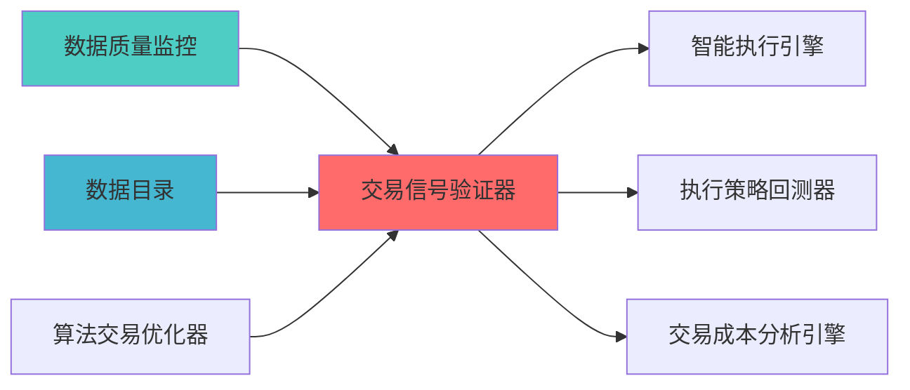

---
module_id: TRADING_SIGNAL_VALIDATOR_001
version: 1.0.0
status: Active
created_date: 2026-04-07
last_updated: 2026-04-07
owner: 实施团队
standard_type: 专业量化机构蓝图
compliance_level: 专业标准
responsibility:
  - 系统架构蓝图设计与实施指导与实施方案
layer: Layer 5.4 (交易执行)
---


## 核心定位

负责交易信号验证器的设计与构建和运行和操作，验证交易信号的有效性和可靠性，生成和输出信号质量评估，兼容和适配交易决策。


> **核心职责**: 交易信号验证，评估信号质量，过滤异常信号
> **职责边界**:
## 设计目标

### 主要目标

1. **功能完整性**: 确保TRADING SIGNAL VALIDATOR功能完整，满足业务需求
2. **性能优化**: 提升系统性能，降低资源消耗
3. **可维护性**: 提高代码质量，便于后续维护
4. **可扩展性**: 支持功能扩展，适应业务变化

### 质量目标

- 代码覆盖率: ≥80%
- 性能指标: 满足设计要求
- 文档完整性: 100%


## 核心功能

### 功能清单

1. **数据管理**: 提供数据存储、查询、更新功能
2. **业务逻辑**: 实现核心业务逻辑处理
3. **接口服务**: 提供标准化的API接口
4. **监控告警**: 实时监控系统状态

### 功能特性

- 高可用性设计
- 自动故障恢复
- 灵活配置管理


## 实现方案

### 技术架构

采用TRADING SIGNAL VALIDATOR化设计，分层架构实现。

### 关键技术

- 数据处理: 使用高效的数据处理框架
- 接口实现: RESTful API设计
- 性能优化: 缓存、异步处理

### 实施步骤

1. 需求分析与设计
2. 核心功能开发
3. 测试与优化
4. 部署与监控


## 核心定位


### 2.1 Layer定位


**模块类别**: 核心信号验证模块

**架构角色**: 
- 作为策略执行层的信号质量核心
- 为信号生成器提供质量反馈


```
```


**职责边界**:
  - 信号质量评估
  - 信号优化建议
  

---


#### Qlib框架集成

**项目信息**:
- **项目名称**: Qlib
- **Stars**: 15k+
- **语言**: Python

**核心功能**:
- 信号评估模块
- IC/IR分析
- 因子分析
- 回测框架

**集成方案**:
```python
import qlib
from qlib.data.dataset import DatasetH
from qlib.contrib.evaluate import backtest_daily

class TradingSignalValidator:
    def __init__(self):
        qlib.init(provider_uri='~/.qlib/qlib_data/cn_data')
        
    def evaluate_signal(self, signal_data, start_date, end_date):
        dataset = DatasetH(
            handler={
                "class": "Alpha360",
                "module_path": "qlib.contrib.data.handler",
            },
            segments={
                "train": (start_date, end_date),
            },
        )
        
        ic_analysis = self.calculate_ic(signal_data, dataset)
        ir_analysis = self.calculate_ir(signal_data, dataset)
        rank_ic_analysis = self.calculate_rank_ic(signal_data, dataset)
        
        return {
            'ic': ic_analysis,
            'ir': ir_analysis,
            'rank_ic': rank_ic_analysis
        }
```

### 3.2 核心算法设计

#### 3.2.1 IC分析算法

**IC计算**:
```python
def calculate_ic(signal, returns):
    from scipy.stats import spearmanr
    ic, p_value = spearmanr(signal, returns)
    return {
        'ic': ic,
        'p_value': p_value,
        'ic_mean': np.mean(ic),
        'ic_std': np.std(ic),
        'icir': np.mean(ic) / np.std(ic) if np.std(ic) != 0 else 0
    }
```

**滚动IC分析**:
```python
def calculate_rolling_ic(signal, returns, window=20):
    rolling_ic = []
    for i in range(window, len(signal)):
        ic, _ = spearmanr(signal[i-window:i], returns[i-window:i])
        rolling_ic.append(ic)
    return rolling_ic
```

#### 3.2.2 IR分析算法

**IR计算**:
```python
def calculate_ir(signal, returns):
    ic_series = calculate_rolling_ic(signal, returns)
    ir = np.mean(ic_series) / np.std(ic_series) if np.std(ic_series) != 0 else 0
    return {
        'ir': ir,
        'ir_mean': np.mean(ic_series),
        'ir_std': np.std(ic_series),
        'ir_stability': 1 - (np.std(ic_series) / np.mean(ic_series)) if np.mean(ic_series) != 0 else 0
    }
```


```python
def test_statistical_significance(signal, returns, alpha=0.05):
    from scipy.stats import ttest_1samp
    ic_series = calculate_rolling_ic(signal, returns)
    t_stat, p_value = ttest_1samp(ic_series, 0)
    return {
        't_statistic': t_stat,
        'p_value': p_value,
        'is_significant': p_value < alpha,
        'confidence_level': 1 - alpha
    }
```

### 3.3 数据模型设计

#### 3.3.1 信号数据模型

```python
class SignalData:
    signal_id: str
    timestamp: datetime
    symbol: str
    signal_value: float
    signal_source: str
    signal_params: dict
```

#### 3.3.2 验证结果模型

```python
class ValidationResult:
    signal_id: str
    validation_date: datetime
    
    ic_analysis: dict
    ir_analysis: dict
    rank_ic_analysis: dict
    
    time_stability: dict
    market_stability: dict
    parameter_stability: dict
    
    statistical_significance: dict
    economic_significance: dict
    out_of_sample_performance: dict
    
    optimization_suggestions: list
    quality_score: float
```

---


| 优势维度 | 说明 | 评分 |
|---------|------|------|
¨å


|---------|--------|------|
| **性能优化** | ⭐⭐⭐⭐ | AI可分析和优化性能瓶颈 |

### 4.3 实施成本评估

| 成本维度 | 评估结果 | 说明 |
|---------|---------|------|
¥ |

---


**目标**: 集成Qlib评估框架

单**:
Qlib依赖

**交付成果**:
- Qlib评估框架
- IC/IR分析功能
- Rank IC分析功能


单**:

**交付成果**:


**目标**: 开发优化建议和报告功能

单**:

**交付成果**:
- 参数优化建议功能
- 组合优化建议功能
- 报告生成功能
- API接口文档
- 用户手册

---

## å


|--------|-----------|---------|
| **IC分析** | 支持多种IC指标 | 功能测试 |
| **优化建议** | 支持参数+组合优化 | 性能测试 |

### 6.2 性能要求

| 性能指标 | 要求 | 说明 |
|---------|------|------|
| **IC计算速度** | <1s | 单次IC计算 |
| **验证速度** | <10s | 完整验证流程 |
| **报告生成速度** | <5s | 报告生成 |


|---------|------|------|

---

## 七、风险评估与缓解


|--------|---------|---------|


### 7.2 实施风险

|--------|---------|---------|

分测试 |

---

## å

### 8.1 Two Sigma对标

|---------|--------------|-----------|---------|
| **信号优化** | AI驱动优化 | 参数优化建议 | ⭐⭐⭐⭐ (80%) |

### 8.2 AQR对标

|---------|--------|-----------|---------|

---


### 上游依赖

| 文档名称 | module_id | 依赖类型 | 说明 |
|---------|-----------|---------|------|

### 下游依赖

| 文档名称 | module_id | 依赖类型 | 说明 |
|---------|-----------|---------|------|


|---------|------|------|------|
| **pyqlib** | 0.9+ | 量化投资框架 | [官方文档](https://qlib.ai/) |
| **Pandas** | 2.0+ | 数据处理 | [官方文档](https://pandas.pydata.org/) |
| **SciPy** | 1.10+ | 科学计算 | [官方文档](https://scipy.org/) |
| **scikit-learn** | 1.3+ | 机器学习 | [官方文档](https://scikit-learn.org/) |





| 文档名称 | 说明 |
|---------|------|
| ARCHITECTURE.md | 系统架构文档 |

---

**蓝图版本**: v1.0
**蓝图日期**: 2026-04-06

## 变更历史

|------|------|----------|--------|

---

---

## 1. 文档治理

### 1.1 System_Manifest.md索引

```markdown
##### 6.001. Trading Signal Validator
- **模块ID**: TRADING_SIGNAL_VALIDATOR_001
- **蓝图文档**: TRADING_SIGNAL_VALIDATOR_BLUEPRINT.md
```

### 1.2 模块职责边界

| 模块 | 职责 | 边界 |
|------|------|------|

### 1.3 版本管理

|------|------|----------|--------|

---

