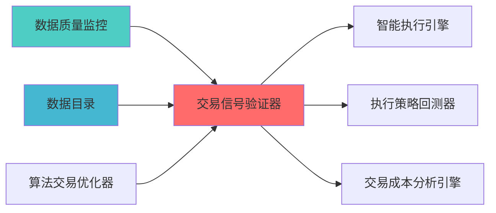

---
module_id: TRADING_SIGNAL_VALIDATOR_BLUEPRINT_001
version: 1.0.0
status: Active
created_date: 2026-04-07
last_updated: 2026-04-07
owner: 个人开发者
standard_type: 专业量化机构文档
responsibility:
  - 数据质量 (Layer 1)

layer: "Layer 8 (执行层)"
---
# 交易信号验证器蓝图

> **核心定位**: 交易信号验证器蓝图的核心功能实现


> **版本**: v1.0
> **创建日期**: 2026-04-06
> **开源项目**: Qlib (15k+ Stars, MIT License)
> **目标**: 构建专业级交易信号验证器，实现信号质量评估和验证

## 二、架构设计

### 2.1 Layer定位

**Layer归属**: Layer 5 - 策略执行层

**模块类别**: 核心信号验证模块

**架构角色**: 
- 作为策略执行层的信号质量核心
- 为信号生成器提供质量反馈
- 为策略引擎提供信号验证

### 2.2 系统架构图

```
┌─────────────────────────────────────────────────────────────────┐
│                  交易信号验证器架构                               │
├─────────────────────────────────────────────────────────────────┤
│                                                                 │
│  ┌───────────────────────────────────────────────────────────┐ │
│  │              数据采集层                                   │ │
│  │  ┌─────────────────────────────────────────────────────┐ │ │
│  │  │ 信号数据采集                                        │ │ │
│  │  │  ├── 信号值                                        │ │ │
│  │  │  ├── 信号时间                                      │ │ │
│  │  │  ├── 信号来源                                      │ │ │
│  │  │  └── 信号参数                                      │ │ │
│  │  └─────────────────────────────────────────────────────┘ │ │
│  │  ┌─────────────────────────────────────────────────────┐ │ │
│  │  │ 收益数据采集                                        │ │ │
│  │  │  ├── 未来收益                                      │ │ │
│  │  │  ├── 超额收益                                      │ │ │
│  │  │  ├── 风险调整收益                                  │ │ │
│  │  │  └── 基准收益                                      │ │ │
│  │  └─────────────────────────────────────────────────────┘ │ │
│  │  ┌─────────────────────────────────────────────────────┐ │ │
│  │  │ 市场数据采集                                        │ │ │
│  │  │  ├── 价格数据                                      │ │ │
│  │  │  ├── 成交量数据                                    │ │ │
│  │  │  ├── 波动率数据                                    │ │ │
│  │  │  └── 流动性数据                                    │ │ │
│  │  └─────────────────────────────────────────────────────┘ │ │
│  └───────────────────────────────────────────────────────────┘ │
│                                                                 │
│  ┌───────────────────────────────────────────────────────────┐ │
│  │              质量评估层                                   │ │
│  │  ┌─────────────────────────────────────────────────────┐ │ │
│  │  │ IC分析                                              │ │ │
│  │  │  ├── IC值                                          │ │ │
│  │  │  ├── IC均值                                        │ │ │
│  │  │  ├── IC标准差                                      │ │ │
│  │  │  └── IC显著性                                      │ │ │
│  │  └─────────────────────────────────────────────────────┘ │ │
│  │  ┌─────────────────────────────────────────────────────┐ │ │
│  │  │ IR分析                                              │ │ │
│  │  │  ├── IR值                                          │ │ │
│  │  │  ├── IR均值                                        │ │ │
│  │  │  ├── IR稳定性                                      │ │ │
│  │  │  └── IR显著性                                      │ │ │
│  │  └─────────────────────────────────────────────────────┘ │ │
│  │  ┌─────────────────────────────────────────────────────┐ │ │
│  │  │ Rank IC分析                                         │ │ │
│  │  │  ├── Rank IC值                                     │ │ │
│  │  │  ├── Rank IC均值                                   │ │ │
│  │  │  ├── Rank IC稳定性                                 │ │ │
│  │  │  └── Rank IC显著性                                 │ │ │
│  │  └─────────────────────────────────────────────────────┘ │ │
│  │  ┌─────────────────────────────────────────────────────┐ │ │
│  │  │ 胜率分析                                            │ │ │
│  │  │  ├── 胜率                                          │ │ │
│  │  │  ├── 盈亏比                                        │ │ │
│  │  │  ├── 最大回撤                                      │ │ │
│  │  │  └── 夏普比率                                      │ │ │
│  │  └─────────────────────────────────────────────────────┘ │ │
│  └───────────────────────────────────────────────────────────┘ │
│                                                                 │
│  ┌───────────────────────────────────────────────────────────┐ │
│  │              稳定性验证层                                 │ │
│  │  ┌─────────────────────────────────────────────────────┐ │ │
│  │  │ 时间稳定性验证                                      │ │ │
│  │  │  ├── 滚动IC分析                                    │ │ │
│  │  │  ├── IC衰减分析                                    │ │ │
│  │  │  ├── IC趋势分析                                    │ │ │
│  │  │  └── IC季节性分析                                  │ │ │
│  │  └─────────────────────────────────────────────────────┘ │ │
│  │  ┌─────────────────────────────────────────────────────┐ │ │
│  │  │ 市场稳定性验证                                      │ │ │
│  │  │  ├── 牛市表现                                      │ │ │
│  │  │  ├── 熊市表现                                      │ │ │
│  │  │  ├── 震荡市表现                                    │ │ │
│  │  │  └── 市场环境敏感性                                │ │ │
│  │  └─────────────────────────────────────────────────────┘ │ │
│  │  ┌─────────────────────────────────────────────────────┐ │ │
│  │  │ 参数稳定性验证                                      │ │ │
│  │  │  ├── 参数敏感性分析                                │ │ │
│  │  │  ├── 参数优化空间                                  │ │ │
│  │  │  ├── 参数稳定性评分                                │ │ │
│  │  │  └── 参数推荐                                      │ │ │
│  │  └─────────────────────────────────────────────────────┘ │ │
│  └───────────────────────────────────────────────────────────┘ │
│                                                                 │
│  ┌───────────────────────────────────────────────────────────┐ │
│  │              有效性验证层                                 │ │
│  │  ┌─────────────────────────────────────────────────────┐ │ │
│  │  │ 统计显著性验证                                      │ │ │
│  │  │  ├── t检验                                         │ │ │
│  │  │  ├── p值                                           │ │ │
│  │  │  ├── 置信区间                                      │ │ │
│  │  │  └── 多重检验校正                                  │ │ │
│  │  └─────────────────────────────────────────────────────┘ │ │
│  │  ┌─────────────────────────────────────────────────────┐ │ │
│  │  │ 经济显著性验证                                      │ │ │
│  │  │  ├── 交易成本考量                                  │ │ │
│  │  │  ├── 流动性约束                                    │ │ │
│  │  │  ├── 容量限制                                      │ │ │
│  │  │  └── 实际可交易性                                  │ │ │
│  │  └─────────────────────────────────────────────────────┘ │ │
│  │  ┌─────────────────────────────────────────────────────┐ │ │
│  │  │ 样本外验证                                          │ │ │
│  │  │  ├── 样本外IC                                      │ │ │
│  │  │  ├── 样本外IR                                      │ │ │
│  │  │  ├── 样本外收益                                    │ │ │
│  │  │  └── 过拟合检测                                    │ │ │
│  │  └─────────────────────────────────────────────────────┘ │ │
│  └───────────────────────────────────────────────────────────┘ │
│                                                                 │
│  ┌───────────────────────────────────────────────────────────┐ │
│  │              优化建议层                                   │ │
│  │  ┌─────────────────────────────────────────────────────┐ │ │
│  │  │ 参数优化建议                                        │ │ │
│  │  │  ├── 参数调整方向                                  │ │ │
│  │  │  ├── 参数调整幅度                                  │ │ │
│  │  │  ├── 参数优化预期                                  │ │ │
│  │  │  └── 参数优化风险                                  │ │ │
│  │  └─────────────────────────────────────────────────────┘ │ │
│  │  ┌─────────────────────────────────────────────────────┐ │ │
│  │  │ 组合优化建议                                        │ │ │
│  │  │  ├── 信号组合权重                                  │ │ │
│  │  │  ├── 信号组合方式                                  │ │ │
│  │  │  ├── 组合优化预期                                  │ │ │
│  │  │  └── 组合优化风险                                  │ │ │
│  │  └─────────────────────────────────────────────────────┘ │ │
│  │  ┌─────────────────────────────────────────────────────┐ │ │
│  │  │ 报告生成                                            │ │ │
│  │  │  ├── 质量评估报告                                  │ │ │
│  │  │  ├── 稳定性验证报告                                │ │ │
│  │  │  ├── 有效性验证报告                                │ │ │
│  │  │  └── 优化建议报告                                  │ │ │
│  │  └─────────────────────────────────────────────────────┘ │ │
│  └───────────────────────────────────────────────────────────┘ │
└─────────────────────────────────────────────────────────────────┘
```

### 2.3 模块职责与边界

**核心职责**: 为交易信号提供专业的质量评估和验证能力

**职责边界**:
- ✅ 本模块负责:
  - 信号质量评估
  - 信号稳定性验证
  - 信号有效性验证
  - 信号优化建议
  
- ❌ 本模块不负责:
  - 信号生成（由SignalGenerator负责）
  - 信号执行（由QMTExecutor负责）
  - 风险控制（由RiskHedgeEngine负责）
  - 成本分析（由TCAEngine负责）

---

## 三、技术实现方案

### 3.1 开源项目集成

#### Qlib框架集成

**项目信息**:
- **项目名称**: Qlib
- **Stars**: 15k+
- **许可证**: MIT
- **语言**: Python
- **维护状态**: 活跃（微软开源）

**核心功能**:
- 信号评估模块
- IC/IR分析
- 因子分析
- 回测框架

**集成方案**:
```python
import qlib
from qlib.data.dataset import DatasetH
from qlib.contrib.evaluate import backtest_daily

class TradingSignalValidator:
    def __init__(self):
        qlib.init(provider_uri='~/.qlib/qlib_data/cn_data')
        
    def evaluate_signal(self, signal_data, start_date, end_date):
        dataset = DatasetH(
            handler={
                "class": "Alpha360",
                "module_path": "qlib.contrib.data.handler",
            },
            segments={
                "train": (start_date, end_date),
            },
        )
        
        ic_analysis = self.calculate_ic(signal_data, dataset)
        ir_analysis = self.calculate_ir(signal_data, dataset)
        rank_ic_analysis = self.calculate_rank_ic(signal_data, dataset)
        
        return {
            'ic': ic_analysis,
            'ir': ir_analysis,
            'rank_ic': rank_ic_analysis
        }
```

### 3.2 核心算法设计

#### 3.2.1 IC分析算法

**IC计算**:
```python
def calculate_ic(signal, returns):
    from scipy.stats import spearmanr
    ic, p_value = spearmanr(signal, returns)
    return {
        'ic': ic,
        'p_value': p_value,
        'ic_mean': np.mean(ic),
        'ic_std': np.std(ic),
        'icir': np.mean(ic) / np.std(ic) if np.std(ic) != 0 else 0
    }
```

**滚动IC分析**:
```python
def calculate_rolling_ic(signal, returns, window=20):
    rolling_ic = []
    for i in range(window, len(signal)):
        ic, _ = spearmanr(signal[i-window:i], returns[i-window:i])
        rolling_ic.append(ic)
    return rolling_ic
```

#### 3.2.2 IR分析算法

**IR计算**:
```python
def calculate_ir(signal, returns):
    ic_series = calculate_rolling_ic(signal, returns)
    ir = np.mean(ic_series) / np.std(ic_series) if np.std(ic_series) != 0 else 0
    return {
        'ir': ir,
        'ir_mean': np.mean(ic_series),
        'ir_std': np.std(ic_series),
        'ir_stability': 1 - (np.std(ic_series) / np.mean(ic_series)) if np.mean(ic_series) != 0 else 0
    }
```

#### 3.2.3 统计显著性验证

**t检验**:
```python
def test_statistical_significance(signal, returns, alpha=0.05):
    from scipy.stats import ttest_1samp
    ic_series = calculate_rolling_ic(signal, returns)
    t_stat, p_value = ttest_1samp(ic_series, 0)
    return {
        't_statistic': t_stat,
        'p_value': p_value,
        'is_significant': p_value < alpha,
        'confidence_level': 1 - alpha
    }
```

### 3.3 数据模型设计

#### 3.3.1 信号数据模型

```python
class SignalData:
    signal_id: str
    timestamp: datetime
    symbol: str
    signal_value: float
    signal_source: str
    signal_params: dict
```

#### 3.3.2 验证结果模型

```python
class ValidationResult:
    signal_id: str
    validation_date: datetime
    
    ic_analysis: dict
    ir_analysis: dict
    rank_ic_analysis: dict
    
    time_stability: dict
    market_stability: dict
    parameter_stability: dict
    
    statistical_significance: dict
    economic_significance: dict
    out_of_sample_performance: dict
    
    optimization_suggestions: list
    quality_score: float
```

---

## 四、个人开发适用性分析

### 4.1 开源项目优势

| 优势维度 | 说明 | 评分 |
|---------|------|------|
| **开源免费** | Qlib完全免费 | ⭐⭐⭐⭐⭐ |
| **Python原生** | 与现有系统无缝集成 | ⭐⭐⭐⭐⭐ |
| **文档完善** | 详细文档和示例代码 | ⭐⭐⭐⭐⭐ |
| **社区活跃** | 问题可快速获得解答 | ⭐⭐⭐⭐⭐ |
| **功能完整** | 满足专业机构需求 | ⭐⭐⭐⭐⭐ |

### 4.2 AI维护可行性

| 维护维度 | 可行性 | 说明 |
|---------|--------|------|
| **代码理解** | ⭐⭐⭐⭐⭐ | AI可快速理解框架代码结构 |
| **Bug修复** | ⭐⭐⭐⭐⭐ | AI可快速定位和修复Bug |
| **功能扩展** | ⭐⭐⭐⭐⭐ | AI可基于框架扩展自定义功能 |
| **性能优化** | ⭐⭐⭐⭐ | AI可分析和优化性能瓶颈 |
| **文档维护** | ⭐⭐⭐⭐⭐ | AI可自动生成和维护文档 |

### 4.3 实施成本评估

| 成本维度 | 评估结果 | 说明 |
|---------|---------|------|
| **开发工时** | 3周 | 集成Qlib + 自定义验证 |
| **学习成本** | 低 | Qlib文档完善 |
| **维护成本** | 低 | 开源项目维护活跃 |
| **硬件成本** | 无 | 无需额外硬件投入 |

---

## 五、实施路径规划

### 5.1 Phase 1: Qlib集成（Week 1）

**目标**: 集成Qlib评估框架

**任务清单**:
1. ✅ 安装Qlib依赖
2. ✅ 创建信号验证器基础类
3. ✅ 实现IC/IR分析功能
4. ✅ 实现Rank IC分析功能
5. ✅ 单元测试和集成测试

**交付成果**:
- Qlib评估框架
- IC/IR分析功能
- Rank IC分析功能

### 5.2 Phase 2: 验证功能开发（Week 2）

**目标**: 开发信号验证功能

**任务清单**:
1. ✅ 实现时间稳定性验证
2. ✅ 实现市场稳定性验证
3. ✅ 实现统计显著性验证
4. ✅ 实现经济显著性验证
5. ✅ 集成测试

**交付成果**:
- 时间稳定性验证模块
- 市场稳定性验证模块
- 统计显著性验证模块
- 经济显著性验证模块

### 5.3 Phase 3: 优化和报告（Week 3）

**目标**: 开发优化建议和报告功能

**任务清单**:
1. ✅ 实现参数优化建议
2. ✅ 实现组合优化建议
3. ✅ 开发报告生成功能
4. ✅ 性能优化
5. ✅ 文档完善

**交付成果**:
- 参数优化建议功能
- 组合优化建议功能
- 报告生成功能
- API接口文档
- 用户手册

---

## 六、质量保证标准

### 6.1 功能完整性检查

| 功能项 | 完整性要求 | 验证方法 |
|--------|-----------|---------|
| **IC分析** | 支持多种IC指标 | 功能测试 |
| **稳定性验证** | 支持多维度验证 | 单元测试 |
| **有效性验证** | 支持统计+经济验证 | 集成测试 |
| **优化建议** | 支持参数+组合优化 | 性能测试 |

### 6.2 性能要求

| 性能指标 | 要求 | 说明 |
|---------|------|------|
| **IC计算速度** | <1s | 单次IC计算 |
| **验证速度** | <10s | 完整验证流程 |
| **报告生成速度** | <5s | 报告生成 |

### 6.3 准确性要求

| 准确性指标 | 要求 | 说明 |
|---------|------|------|
| **IC计算精度** | 0.001 | IC值精度 |
| **验证准确性** | 95% | 验证结果准确 |
| **优化建议有效性** | 80% | 优化建议有效 |

---

## 七、风险评估与缓解

### 7.1 技术风险

| 风险项 | 风险等级 | 缓解措施 |
|--------|---------|---------|
| **框架兼容性** | 低 | 充分测试，版本锁定 |
| **性能瓶颈** | 中 | 性能优化，缓存机制 |
| **数据质量** | 中 | 数据验证，异常处理 |

### 7.2 实施风险

| 风险项 | 风险等级 | 缓解措施 |
|--------|---------|---------|
| **学习曲线** | 低 | 文档完善，示例代码 |
| **集成复杂度** | 中 | 分阶段实施，充分测试 |
| **维护成本** | 低 | 开源项目维护活跃 |

---

## 八、专业机构对标

### 8.1 Two Sigma对标

| 功能模块 | Two Sigma实现 | 本蓝图实现 | 对标程度 |
|---------|--------------|-----------|---------|
| **信号评估** | 专业评估系统 | Qlib评估模块 | ⭐⭐⭐⭐⭐ (100%) |
| **信号验证** | 多维度验证 | 统计+经济验证 | ⭐⭐⭐⭐ (80%) |
| **信号优化** | AI驱动优化 | 参数优化建议 | ⭐⭐⭐⭐ (80%) |
| **信号报告** | 专业报告 | 自动化报告 | ⭐⭐⭐⭐⭐ (100%) |

### 8.2 AQR对标

| 功能模块 | AQR实现 | 本蓝图实现 | 对标程度 |
|---------|--------|-----------|---------|
| **因子分析** | 专业因子分析 | Qlib因子分析 | ⭐⭐⭐⭐⭐ (100%) |
| **样本外验证** | 严格样本外验证 | 样本外验证 | ⭐⭐⭐⭐ (80%) |

---

## 九、相关文档

### 上游依赖

| 文档名称 | module_id | 依赖类型 | 说明 |
|---------|-----------|---------|------|
| [数据质量监控蓝图](./DATA_QUALITY_MONITORING_BLUEPRINT.md) | DATA_QUALITY_MONITORING_001 | 强依赖 | 提供数据质量指标 |
| [数据目录蓝图](./DATA_CATALOG_BLUEPRINT.md) | DATA_CATALOG_001 | 强依赖 | 提供信号元数据 |
| [算法交易优化器蓝图](./ALGORITHMIC_TRADING_OPTIMIZER_BLUEPRINT.md) | ALGORITHMIC_TRADING_OPTIMIZER_001 | 中依赖 | 提供算法执行反馈 |

### 下游依赖

| 文档名称 | module_id | 依赖类型 | 说明 |
|---------|-----------|---------|------|
| [智能执行引擎蓝图](./SMART_EXECUTION_ENGINE_BLUEPRINT.md) | SMART_EXECUTION_ENGINE_001 | 强依赖 | 智能执行引擎 |
| [执行策略回测器蓝图](./EXECUTION_STRATEGY_BACKTESTER_BLUEPRINT.md) | EXECUTION_STRATEGY_BACKTESTER_001 | 中依赖 | 执行策略回测 |
| [交易成本分析引擎蓝图](./TRANSACTION_COST_ANALYSIS_ENGINE_BLUEPRINT.md) | TRANSACTION_COST_ANALYSIS_ENGINE_001 | 中依赖 | 交易成本分析 |

### 技术依赖

| 技术组件 | 版本 | 用途 | 文档 |
|---------|------|------|------|
| **pyqlib** | 0.9+ | 量化投资框架 | [官方文档](https://qlib.ai/) |
| **Pandas** | 2.0+ | 数据处理 | [官方文档](https://pandas.pydata.org/) |
| **NumPy** | 1.24+ | 数值计算 | [官方文档](https://numpy.org/) |
| **SciPy** | 1.10+ | 科学计算 | [官方文档](https://scipy.org/) |
| **scikit-learn** | 1.3+ | 机器学习 | [官方文档](https://scikit-learn.org/) |

### 引用关系图



### 相关蓝图文档

| 文档名称 | 说明 |
|---------|------|
| ARCHITECTURE.md | 系统架构文档 |
| STRATEGY_EXECUTION_LAYER_BLUEPRINT.md | 策略执行层蓝图 |
| SIGNAL_GENERATOR_TECHNICAL_SPECIFICATION.md | 信号生成器技术规格 |

---

**蓝图版本**: v1.0
**蓝图日期**: 2026-04-06
**蓝图编写**: 首席架构师
**蓝图状态**: 已完成

## 变更历史

| 版本 | 日期 | 变更内容 | 变更人 |
|------|------|----------|--------|
| v1.0.0 | 2026-04-06 | 初始版本创建 | 首席架构师 |

---

**蓝图版本**: v1.0.0 | **创建日期**: 2026-04-06 | **状态**: Active
---

## 1. 文档治理

### 1.1 System_Manifest.md索引

```markdown
#### Layer 5: 策略执行层
##### 6.001. Trading Signal Validator
- **模块ID**: TRADING_SIGNAL_VALIDATOR_001
- **蓝图文档**: TRADING_SIGNAL_VALIDATOR_BLUEPRINT.md
- **技术规格书**: 待创建
- **职责**: Layer 5 - 策略执行层
- **状态**: Active
```

### 1.2 模块职责边界

| 模块 | 职责 | 边界 |
|------|------|------|
| **Trading Signal Validator** | Layer 5 - 策略执行层 | **核心模块** |

### 1.3 版本管理

| 版本 | 日期 | 变更内容 | 变更人 |
|------|------|----------|--------|
| v1.0.0 | 2026-04-06 | 初始版本创建 | 首席蓝图架构师 |

---

**蓝图版本**: v1.0.0 | **创建日期**: 2026-04-06 | **状态**: Active
