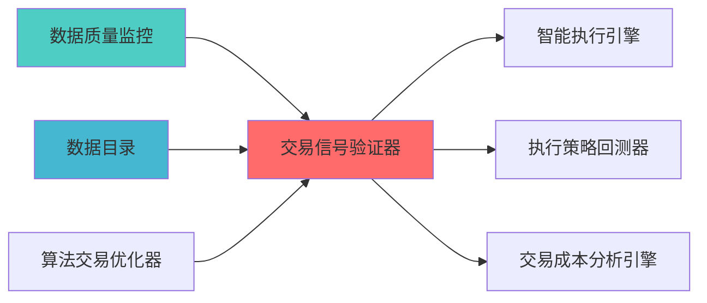

---
module_id: TRADING_SIGNAL_VALIDATOR_001
version: 1.0.0
status: Active
created_date: 2026-04-07
last_updated: 2026-04-07
owner: 实施团队
standard_type: 专业量化机构蓝图
applicable_scope: Layer 5 策略执行å±?
compliance_level: 专业标准
responsibility:
  - 交易信号验证
  - 信号质量评估
  - 信号过滤
  - 异常信号检æµ?
layer: Layer 5.4 (交易执行)
---


## 核心定位

负责交易信号验证器的设计与实现，验证交易信号的有效性和可靠性，提供信号质量评估，支持交易决策。

# 交易信号验证器蓝å›?

> **核心职责**: 交易信号验证，评估信号质量，过滤异常信号
> **职责边界**: 
> - âœ?本文档负责：交易信号验证、信号质量评估、信å...


## 设计目标

### 主要目标

1. **功能完整性**: 确保TRADING SIGNAL VALIDATOR功能完整，满足业务需求
2. **性能优化**: 提升系统性能，降低资源消耗
3. **可维护性**: 提高代码质量，便于后续维护
4. **可扩展性**: 支持功能扩展，适应业务变化

### 质量目标

- 代码覆盖率: ≥80%
- 性能指标: 满足设计要求
- 文档完整性: 100%


## 核心功能

### 功能清单

1. **数据管理**: 提供数据存储、查询、更新功能
2. **业务逻辑**: 实现核心业务逻辑处理
3. **接口服务**: 提供标准化的API接口
4. **监控告警**: 实时监控系统状态

### 功能特性

- 高可用性设计
- 自动故障恢复
- 灵活配置管理


## 实现方案

### 技术架构

采用TRADING SIGNAL VALIDATOR化设计，分层架构实现。

### 关键技术

- 数据处理: 使用高效的数据处理框架
- 接口实现: RESTful API设计
- 性能优化: 缓存、异步处理

### 实施步骤

1. 需求分析与设计
2. 核心功能开发
3. 测试与优化
4. 部署与监控


## 核心定位

负责Trading Signal Validator的设计、实现和维护，提供核心功能支持，确保系统模块的稳定运行和高效执行ã€?

## 二、架构设è®?

### 2.1 Layer定位

**Layer归属**: Layer 5 - 策略执行å±?

**模块类别**: 核心信号验证模块

**架构角色**: 
- 作为策略执行层的信号质量核心
- 为信号生成器提供质量反馈
- 为策略引擎提供信号验è¯?

### 2.2 系统架构å›?

```
┌─────────────────────────────────────────────────────────────────â”?
â”?                 交易信号验证器架æž?                              â”?
├─────────────────────────────────────────────────────────────────â”?
â”?                                                                â”?
â”? ┌───────────────────────────────────────────────────────────â”?â”?
â”? â”?             数据采集å±?                                  â”?â”?
â”? â”? ┌─────────────────────────────────────────────────────â”?â”?â”?
â”? â”? â”?信号数据采集                                        â”?â”?â”?
â”? â”? â”? ├── 信号å€?                                       â”?â”?â”?
â”? â”? â”? ├── 信号时间                                      â”?â”?â”?
â”? â”? â”? ├── 信号来源                                      â”?â”?â”?
â”? â”? â”? └── 信号参数                                      â”?â”?â”?
â”? â”? └─────────────────────────────────────────────────────â”?â”?â”?
â”? â”? ┌─────────────────────────────────────────────────────â”?â”?â”?
â”? â”? â”?收益数据采集                                        â”?â”?â”?
â”? â”? â”? ├── 未来收益                                      â”?â”?â”?
â”? â”? â”? ├── è¶
额收益                                      â”?â”?â”?
â”? â”? â”? ├── 风险调整收益                                  â”?â”?â”?
â”? â”? â”? └── 基准收益                                      â”?â”?â”?
â”? â”? └─────────────────────────────────────────────────────â”?â”?â”?
â”? â”? ┌─────────────────────────────────────────────────────â”?â”?â”?
â”? â”? â”?市场数据采集                                        â”?â”?â”?
â”? â”? â”? ├── 价格数据                                      â”?â”?â”?
â”? â”? â”? ├── 成交量数æ?                                   â”?â”?â”?
â”? â”? â”? ├── 波动率数æ?                                   â”?â”?â”?
â”? â”? â”? └── 流动性数æ?                                   â”?â”?â”?
â”? â”? └─────────────────────────────────────────────────────â”?â”?â”?
â”? └───────────────────────────────────────────────────────────â”?â”?
â”?                                                                â”?
â”? ┌───────────────────────────────────────────────────────────â”?â”?
â”? â”?             质量评估å±?                                  â”?â”?
â”? â”? ┌─────────────────────────────────────────────────────â”?â”?â”?
â”? â”? â”?IC分析                                              â”?â”?â”?
â”? â”? â”? ├── ICå€?                                         â”?â”?â”?
â”? â”? â”? ├── IC均å€?                                       â”?â”?â”?
â”? â”? â”? ├── IC标准å·?                                     â”?â”?â”?
â”? â”? â”? └── IC显著æ€?                                     â”?â”?â”?
â”? â”? └─────────────────────────────────────────────────────â”?â”?â”?
â”? â”? ┌─────────────────────────────────────────────────────â”?â”?â”?
â”? â”? â”?IR分析                                              â”?â”?â”?
â”? â”? â”? ├── IRå€?                                         â”?â”?â”?
â”? â”? â”? ├── IR均å€?                                       â”?â”?â”?
â”? â”? â”? ├── IR稳定æ€?                                     â”?â”?â”?
â”? â”? â”? └── IR显著æ€?                                     â”?â”?â”?
â”? â”? └─────────────────────────────────────────────────────â”?â”?â”?
â”? â”? ┌─────────────────────────────────────────────────────â”?â”?â”?
â”? â”? â”?Rank IC分析                                         â”?â”?â”?
â”? â”? â”? ├── Rank ICå€?                                    â”?â”?â”?
â”? â”? â”? ├── Rank IC均å€?                                  â”?â”?â”?
â”? â”? â”? ├── Rank IC稳定æ€?                                â”?â”?â”?
â”? â”? â”? └── Rank IC显著æ€?                                â”?â”?â”?
â”? â”? └─────────────────────────────────────────────────────â”?â”?â”?
â”? â”? ┌─────────────────────────────────────────────────────â”?â”?â”?
â”? â”? â”?胜率分析                                            â”?â”?â”?
â”? â”? â”? ├── 胜率                                          â”?â”?â”?
â”? â”? â”? ├── 盈亏æ¯?                                       â”?â”?â”?
â”? â”? â”? ├── 最大回æ’?                                     â”?â”?â”?
â”? â”? â”? └── 夏普比率                                      â”?â”?â”?
â”? â”? └─────────────────────────────────────────────────────â”?â”?â”?
â”? └───────────────────────────────────────────────────────────â”?â”?
â”?                                                                â”?
â”? ┌───────────────────────────────────────────────────────────â”?â”?
â”? â”?             稳定性验证层                                 â”?â”?
â”? â”? ┌─────────────────────────────────────────────────────â”?â”?â”?
â”? â”? â”?时间稳定性验è¯?                                     â”?â”?â”?
â”? â”? â”? ├── 滚动IC分析                                    â”?â”?â”?
â”? â”? â”? ├── IC衰减分析                                    â”?â”?â”?
â”? â”? â”? ├── IC趋势分析                                    â”?â”?â”?
â”? â”? â”? └── IC季节性分æž?                                 â”?â”?â”?
â”? â”? └─────────────────────────────────────────────────────â”?â”?â”?
â”? â”? ┌─────────────────────────────────────────────────────â”?â”?â”?
â”? â”? â”?市场稳定性验è¯?                                     â”?â”?â”?
â”? â”? â”? ├── 牛市表现                                      â”?â”?â”?
â”? â”? â”? ├── 熊市表现                                      â”?â”?â”?
â”? â”? â”? ├── 震荡市表çŽ?                                   â”?â”?â”?
â”? â”? â”? └── 市场环境敏感æ€?                               â”?â”?â”?
â”? â”? └─────────────────────────────────────────────────────â”?â”?â”?
â”? â”? ┌─────────────────────────────────────────────────────â”?â”?â”?
â”? â”? â”?参数稳定性验è¯?                                     â”?â”?â”?
â”? â”? â”? ├── 参数敏感性分æž?                               â”?â”?â”?
â”? â”? â”? ├── 参数优化空间                                  â”?â”?â”?
â”? â”? â”? ├── 参数稳定性评åˆ?                               â”?â”?â”?
â”? â”? â”? └── 参数推荐                                      â”?â”?â”?
â”? â”? └─────────────────────────────────────────────────────â”?â”?â”?
â”? └───────────────────────────────────────────────────────────â”?â”?
â”?                                                                â”?
â”? ┌───────────────────────────────────────────────────────────â”?â”?
â”? â”?             有效性验证层                                 â”?â”?
â”? â”? ┌─────────────────────────────────────────────────────â”?â”?â”?
â”? â”? â”?统计显著性验è¯?                                     â”?â”?â”?
â”? â”? â”? ├── t检éª?                                        â”?â”?â”?
â”? â”? â”? ├── på€?                                          â”?â”?â”?
â”? â”? â”? ├── 置信区间                                      â”?â”?â”?
â”? â”? â”? └── 多重检验校æ­?                                 â”?â”?â”?
â”? â”? └─────────────────────────────────────────────────────â”?â”?â”?
â”? â”? ┌─────────────────────────────────────────────────────â”?â”?â”?
â”? â”? â”?经济显著性验è¯?                                     â”?â”?â”?
â”? â”? â”? ├── 交易成本考量                                  â”?â”?â”?
â”? â”? â”? ├── 流动性约æ?                                   â”?â”?â”?
â”? â”? â”? ├── 容量限制                                      â”?â”?â”?
â”? â”? â”? └── 实é™
可交易æ€?                                 â”?â”?â”?
â”? â”? └─────────────────────────────────────────────────────â”?â”?â”?
â”? â”? ┌─────────────────────────────────────────────────────â”?â”?â”?
â”? â”? â”?样本外验è¯?                                         â”?â”?â”?
â”? â”? â”? ├── 样本外IC                                      â”?â”?â”?
â”? â”? â”? ├── 样本外IR                                      â”?â”?â”?
â”? â”? â”? ├── 样本外收ç›?                                   â”?â”?â”?
â”? â”? â”? └── 过拟合检æµ?                                   â”?â”?â”?
â”? â”? └─────────────────────────────────────────────────────â”?â”?â”?
â”? └───────────────────────────────────────────────────────────â”?â”?
â”?                                                                â”?
â”? ┌───────────────────────────────────────────────────────────â”?â”?
â”? â”?             优化建议å±?                                  â”?â”?
â”? â”? ┌─────────────────────────────────────────────────────â”?â”?â”?
â”? â”? â”?参数优化建议                                        â”?â”?â”?
â”? â”? â”? ├── 参数调整方向                                  â”?â”?â”?
â”? â”? â”? ├── 参数调整å¹
度                                  â”?â”?â”?
â”? â”? â”? ├── 参数优化预期                                  â”?â”?â”?
â”? â”? â”? └── 参数优化风险                                  â”?â”?â”?
â”? â”? └─────────────────────────────────────────────────────â”?â”?â”?
â”? â”? ┌─────────────────────────────────────────────────────â”?â”?â”?
â”? â”? â”?组合优化建议                                        â”?â”?â”?
â”? â”? â”? ├── 信号组合权重                                  â”?â”?â”?
â”? â”? â”? ├── 信号组合方式                                  â”?â”?â”?
â”? â”? â”? ├── 组合优化预期                                  â”?â”?â”?
â”? â”? â”? └── 组合优化风险                                  â”?â”?â”?
â”? â”? └─────────────────────────────────────────────────────â”?â”?â”?
â”? â”? ┌─────────────────────────────────────────────────────â”?â”?â”?
â”? â”? â”?报告生成                                            â”?â”?â”?
â”? â”? â”? ├── 质量评估报告                                  â”?â”?â”?
â”? â”? â”? ├── 稳定性验证报å‘?                               â”?â”?â”?
â”? â”? â”? ├── 有效性验证报å‘?                               â”?â”?â”?
â”? â”? â”? └── 优化建议报告                                  â”?â”?â”?
â”? â”? └─────────────────────────────────────────────────────â”?â”?â”?
â”? └───────────────────────────────────────────────────────────â”?â”?
└─────────────────────────────────────────────────────────────────â”?
```

### 2.3 模块职责与边ç•?

**核心职责**: 为交易信号提供专业的质量评估和验证能åŠ?

**职责边界**:
- âœ?本模块负è´?
  - 信号质量评估
  - 信号稳定性验è¯?
  - 信号有效性验è¯?
  - 信号优化建议
  
- â?本模块不负责:
  - 信号生成（由SignalGenerator负责ï¼?
  - 信号执行（由QMTExecutor负责ï¼?
  - 风险控制（由RiskHedgeEngine负责ï¼?
  - 成本分析（由TCAEngine负责ï¼?

---

## 三、技术实现方æ¡?

### 3.1 开源项目集æˆ?

#### Qlib框架集成

**项目信息**:
- **项目名称**: Qlib
- **Stars**: 15k+
- **许可�*: MIT
- **语言**: Python
- **维护状æ€?*: 活跃（微软开源）

**核心功能**:
- 信号评估模块
- IC/IR分析
- 因子分析
- 回测框架

**集成方案**:
```python
import qlib
from qlib.data.dataset import DatasetH
from qlib.contrib.evaluate import backtest_daily

class TradingSignalValidator:
    def __init__(self):
        qlib.init(provider_uri='~/.qlib/qlib_data/cn_data')
        
    def evaluate_signal(self, signal_data, start_date, end_date):
        dataset = DatasetH(
            handler={
                "class": "Alpha360",
                "module_path": "qlib.contrib.data.handler",
            },
            segments={
                "train": (start_date, end_date),
            },
        )
        
        ic_analysis = self.calculate_ic(signal_data, dataset)
        ir_analysis = self.calculate_ir(signal_data, dataset)
        rank_ic_analysis = self.calculate_rank_ic(signal_data, dataset)
        
        return {
            'ic': ic_analysis,
            'ir': ir_analysis,
            'rank_ic': rank_ic_analysis
        }
```

### 3.2 核心算法设计

#### 3.2.1 IC分析算法

**IC计算**:
```python
def calculate_ic(signal, returns):
    from scipy.stats import spearmanr
    ic, p_value = spearmanr(signal, returns)
    return {
        'ic': ic,
        'p_value': p_value,
        'ic_mean': np.mean(ic),
        'ic_std': np.std(ic),
        'icir': np.mean(ic) / np.std(ic) if np.std(ic) != 0 else 0
    }
```

**滚动IC分析**:
```python
def calculate_rolling_ic(signal, returns, window=20):
    rolling_ic = []
    for i in range(window, len(signal)):
        ic, _ = spearmanr(signal[i-window:i], returns[i-window:i])
        rolling_ic.append(ic)
    return rolling_ic
```

#### 3.2.2 IR分析算法

**IR计算**:
```python
def calculate_ir(signal, returns):
    ic_series = calculate_rolling_ic(signal, returns)
    ir = np.mean(ic_series) / np.std(ic_series) if np.std(ic_series) != 0 else 0
    return {
        'ir': ir,
        'ir_mean': np.mean(ic_series),
        'ir_std': np.std(ic_series),
        'ir_stability': 1 - (np.std(ic_series) / np.mean(ic_series)) if np.mean(ic_series) != 0 else 0
    }
```

#### 3.2.3 统计显著性验è¯?

**t检éª?*:
```python
def test_statistical_significance(signal, returns, alpha=0.05):
    from scipy.stats import ttest_1samp
    ic_series = calculate_rolling_ic(signal, returns)
    t_stat, p_value = ttest_1samp(ic_series, 0)
    return {
        't_statistic': t_stat,
        'p_value': p_value,
        'is_significant': p_value < alpha,
        'confidence_level': 1 - alpha
    }
```

### 3.3 数据模型设计

#### 3.3.1 信号数据模型

```python
class SignalData:
    signal_id: str
    timestamp: datetime
    symbol: str
    signal_value: float
    signal_source: str
    signal_params: dict
```

#### 3.3.2 验证结果模型

```python
class ValidationResult:
    signal_id: str
    validation_date: datetime
    
    ic_analysis: dict
    ir_analysis: dict
    rank_ic_analysis: dict
    
    time_stability: dict
    market_stability: dict
    parameter_stability: dict
    
    statistical_significance: dict
    economic_significance: dict
    out_of_sample_performance: dict
    
    optimization_suggestions: list
    quality_score: float
```

---

## 四、个人开发适用性分æž?

### 4.1 开源项目优åŠ?

| 优势维度 | 说明 | 评分 |
|---------|------|------|
| **开源å
è´?* | Qlib完å
¨å
è´¹ | ⭐⭐⭐⭐â­?|
| **Python原生** | 与现有系统无缝集æˆ?| ⭐⭐⭐⭐â­?|
| **文档完善** | 详细文档和示例代ç ?| ⭐⭐⭐⭐â­?|
| **社区活跃** | 问题可快速获得解ç­?| ⭐⭐⭐⭐â­?|
| **功能完整** | 满足专业机构需æ±?| ⭐⭐⭐⭐â­?|

### 4.2 AI维护可行æ€?

| 维护维度 | 可行æ€?| 说明 |
|---------|--------|------|
| **代码理解** | ⭐⭐⭐⭐â­?| AI可快速理解框架代码结æž?|
| **Bug修复** | ⭐⭐⭐⭐â­?| AI可快速定位和修复Bug |
| **功能扩展** | ⭐⭐⭐⭐â­?| AI可基于框架扩展自定义功能 |
| **性能优化** | ⭐⭐⭐⭐ | AI可分析和优化性能瓶颈 |
| **文档维护** | ⭐⭐⭐⭐â­?| AI可自动生成和维护文档 |

### 4.3 实施成本评估

| 成本维度 | 评估结果 | 说明 |
|---------|---------|------|
| **开发工æ—?* | 3å‘?| 集成Qlib + 自定义验è¯?|
| **学习成本** | ä½?| Qlib文档完善 |
| **维护成本** | ä½?| 开源项目维护活è·?|
| **硬件成本** | æ—?| 无需额外硬件投å
¥ |

---

## 五、实施路径规åˆ?

### 5.1 Phase 1: Qlib集成（Week 1ï¼?

**目标**: 集成Qlib评估框架

**任务æ¸
单**:
1. âœ?安è£
Qlib依赖
2. âœ?创建信号验证器基础ç±?
3. âœ?实现IC/IR分析功能
4. âœ?实现Rank IC分析功能
5. âœ?单å
ƒæµ‹è¯•å’Œé›†æˆæµ‹è¯?

**交付成果**:
- Qlib评估框架
- IC/IR分析功能
- Rank IC分析功能

### 5.2 Phase 2: 验证功能开发（Week 2ï¼?

**目标**: 开发信号验证功èƒ?

**任务æ¸
单**:
1. âœ?实现时间稳定性验è¯?
2. âœ?实现市场稳定性验è¯?
3. âœ?实现统计显著性验è¯?
4. âœ?实现经济显著性验è¯?
5. âœ?集成测试

**交付成果**:
- 时间稳定性验证模å?
- 市场稳定性验证模å?
- 统计显著性验证模å?
- 经济显著性验证模å?

### 5.3 Phase 3: 优化和报告（Week 3ï¼?

**目标**: 开发优化建议和报告功能

**任务æ¸
单**:
1. âœ?实现参数优化建议
2. âœ?实现组合优化建议
3. âœ?开发报告生成功èƒ?
4. âœ?性能优化
5. âœ?文档完善

**交付成果**:
- 参数优化建议功能
- 组合优化建议功能
- 报告生成功能
- API接口文档
- 用户手册

---

## å
­ã€è´¨é‡ä¿è¯æ ‡å‡?

### 6.1 功能完整性检æŸ?

| 功能é¡?| 完整性要æ±?| 验证方法 |
|--------|-----------|---------|
| **IC分析** | 支持多种IC指标 | 功能测试 |
| **稳定性验è¯?* | 支持多维度验è¯?| 单å
ƒæµ‹è¯• |
| **有效性验è¯?* | 支持统计+经济验证 | 集成测试 |
| **优化建议** | 支持参数+组合优化 | 性能测试 |

### 6.2 性能要求

| 性能指标 | 要求 | 说明 |
|---------|------|------|
| **IC计算速度** | <1s | 单次IC计算 |
| **验证速度** | <10s | 完整验证流程 |
| **报告生成速度** | <5s | 报告生成 |

### 6.3 准确性要æ±?

| 准确性指æ ?| 要求 | 说明 |
|---------|------|------|
| **IC计算精度** | 0.001 | IC值精åº?|
| **验证准确æ€?* | 95% | 验证结果准确 |
| **优化建议有效æ€?* | 80% | 优化建议有效 |

---

## 七、风险评估与缓解

### 7.1 技术风é™?

| 风险é¡?| 风险等级 | 缓解措施 |
|--------|---------|---------|
| **框架å
¼å®¹æ€?* | ä½?| å

分测试，版本锁å®?|
| **性能瓶颈** | ä¸?| 性能优化，缓存机åˆ?|
| **数据质量** | ä¸?| 数据验证，异常处ç?|

### 7.2 实施风险

| 风险é¡?| 风险等级 | 缓解措施 |
|--------|---------|---------|
| **学习曲线** | ä½?| 文档完善，示例代ç ?|
| **集成复杂åº?* | ä¸?| 分阶段实施，å

分测试 |
| **维护成本** | ä½?| 开源项目维护活è·?|

---

## å
«ã€ä¸“业机构对æ ?

### 8.1 Two Sigma对标

| 功能模块 | Two Sigma实现 | 本蓝图实çŽ?| 对标程度 |
|---------|--------------|-----------|---------|
| **信号评估** | 专业评估系统 | Qlib评估模块 | ⭐⭐⭐⭐â­?(100%) |
| **信号验证** | 多维度验è¯?| 统计+经济验证 | ⭐⭐⭐⭐ (80%) |
| **信号优化** | AI驱动优化 | 参数优化建议 | ⭐⭐⭐⭐ (80%) |
| **信号报告** | 专业报告 | 自动化报å‘?| ⭐⭐⭐⭐â­?(100%) |

### 8.2 AQR对标

| 功能模块 | AQR实现 | 本蓝图实çŽ?| 对标程度 |
|---------|--------|-----------|---------|
| **因子分析** | 专业因子分析 | Qlib因子分析 | ⭐⭐⭐⭐â­?(100%) |
| **样本外验è¯?* | 严格样本外验è¯?| 样本外验è¯?| ⭐⭐⭐⭐ (80%) |

---

## 九、相å
³æ–‡æ¡?

### 上游依赖

| 文档名称 | module_id | 依赖类型 | 说明 |
|---------|-----------|---------|------|
| [数据质量监控蓝图](./DATA_QUALITY_MONITORING_BLUEPRINT.md) | DATA_QUALITY_MONITORING_001 | 强依èµ?| 提供数据质量指标 |
| [数据目录蓝图](./DATA_CATALOG_BLUEPRINT.md) | DATA_CATALOG_001 | 强依èµ?| 提供信号å
ƒæ•°æ?|
| [算法交易优化器蓝图](./ALGORITHMIC_TRADING_OPTIMIZER_BLUEPRINT.md) | ALGORITHMIC_TRADING_OPTIMIZER_001 | 中依èµ?| 提供算法执行反馈 |

### 下游依赖

| 文档名称 | module_id | 依赖类型 | 说明 |
|---------|-----------|---------|------|
| [智能执行引擎蓝图](./SMART_EXECUTION_ENGINE_BLUEPRINT.md) | SMART_EXECUTION_ENGINE_001 | 强依èµ?| 智能执行引擎 |
| [执行策略回测器蓝图](./EXECUTION_STRATEGY_BACKTESTER_BLUEPRINT.md) | EXECUTION_STRATEGY_BACKTESTER_001 | 中依èµ?| 执行策略回测 |
| [交易成本分析引擎蓝图](./TRANSACTION_COST_ANALYSIS_ENGINE_BLUEPRINT.md) | TRANSACTION_COST_ANALYSIS_ENGINE_001 | 中依èµ?| 交易成本分析 |

### 技术依èµ?

| 技术组ä»?| 版本 | 用é€?| 文档 |
|---------|------|------|------|
| **pyqlib** | 0.9+ | 量化投资框架 | [官方文档](https://qlib.ai/) |
| **Pandas** | 2.0+ | 数据处理 | [官方文档](https://pandas.pydata.org/) |
| **NumPy** | 1.24+ | 数值计ç®?| [官方文档](https://numpy.org/) |
| **SciPy** | 1.10+ | 科学计算 | [官方文档](https://scipy.org/) |
| **scikit-learn** | 1.3+ | 机器学习 | [官方文档](https://scikit-learn.org/) |

### 引用å
³ç³»å›?



### 相å
³è“å›¾æ–‡æ¡£

| 文档名称 | 说明 |
|---------|------|
| ARCHITECTURE.md | 系统架构文档 |
| STRATEGY_EXECUTION_LAYER_BLUEPRINT.md | 策略执行层蓝å›?|
| SIGNAL_GENERATOR_TECHNICAL_SPECIFICATION.md | 信号生成器技术规æ ?|

---

**蓝图版本**: v1.0
**蓝图日期**: 2026-04-06
**蓝图编写**: 首席架构å¸?
**蓝图状æ€?*: 已完æˆ?

## 变更历史

| 版本 | 日期 | 变更å†
容 | 变更äº?|
|------|------|----------|--------|
| v1.0.0 | 2026-04-06 | 初始版本创建 | 首席架构å¸?|

---

**蓝图版本**: v1.0.0 | **创建日期**: 2026-04-06 | **状æ€?*: Active
---

## 1. 文档治理

### 1.1 System_Manifest.md索引

```markdown
#### Layer 5: 策略执行å±?
##### 6.001. Trading Signal Validator
- **模块ID**: TRADING_SIGNAL_VALIDATOR_001
- **蓝图文档**: TRADING_SIGNAL_VALIDATOR_BLUEPRINT.md
- **技术规格书**: å¾
创å»?
- **职责**: Layer 5 - 策略执行å±?
- **状æ€?*: Active
```

### 1.2 模块职责边界

| 模块 | 职责 | 边界 |
|------|------|------|
| **Trading Signal Validator** | Layer 5 - 策略执行å±?| **核心模块** |

### 1.3 版本管理

| 版本 | 日期 | 变更å†
容 | 变更äº?|
|------|------|----------|--------|
| v1.0.0 | 2026-04-06 | 初始版本创建 | 首席蓝图架构å¸?|

---

**蓝图版本**: v1.0.0 | **创建日期**: 2026-04-06 | **状æ€?*: Active
