## 核心定位

负责交易成本分析引擎的设计与实现，分析交易成本构成，提供成本优化建议，支持交易执行优化。

# 交易成本分析引擎蓝图

> **核心职责**: 交易成本分析引擎，提供全面的成本分析和质量评ä¼?
> **职责边界**: 
> - âœ?本文档负责：交易成本分析、成本计算、基准对比、成本归因、执行质量评åˆ?
> - â?本文档不负责：交易执行、订单管理、风险控åˆ?
ï»? 交易成本分析引擎蓝图

> **核心定位**: 交易成本分析引擎蓝图的核心功能实çŽ?


> **版本**: v1.0
> **创建日期**: 2026-04-06
> **开源项ç›?*: tcapy (500+ Stars, Apache 2.0 License)
> **目标**: 构建专业级交易成本分析引擎，对标Citadel、Two Sigma标准

## 核心定位

> 核心职责: 交易成本分析引擎，提供全面的成本分析和质量评ä¼?
> 职责边界: 
> - âœ?本文档负责：交易成本分析、成本计算、基准对比、成本归因、执行质量评åˆ?
> - â?本文档不负责：交易执行、订单管理、风险控åˆ?
ï»? 交易成本分析引擎蓝图，确保系统功能的稳定运行和高效执行ã€?

## 二、架构设è®?

### 2.1 Layer定位

**Layer归属**: Layer 5 - 策略执行å±?

**模块类别**: 核心成本分析模块

**架构角色**: 
- 作为策略执行层的成本分析核心
- 为智能执行算法提供成本反é¦?
- 为交易审计器提供成本数据

### 2.2 系统架构å›?

```
┌─────────────────────────────────────────────────────────────────â”?
â”?                 交易成本分析引擎架构                             â”?
├─────────────────────────────────────────────────────────────────â”?
â”?                                                                â”?
â”? ┌───────────────────────────────────────────────────────────â”?â”?
â”? â”?             数据采集å±?                                  â”?â”?
â”? â”? ┌─────────────────────────────────────────────────────â”?â”?â”?
â”? â”? â”?交易数据采集                                        â”?â”?â”?
â”? â”? â”? ├── 订单数据                                      â”?â”?â”?
â”? â”? â”? ├── 成交数据                                      â”?â”?â”?
â”? â”? â”? ├── 行情数据                                      â”?â”?â”?
â”? â”? â”? └── 基准数据                                      â”?â”?â”?
â”? â”? └─────────────────────────────────────────────────────â”?â”?â”?
â”? └───────────────────────────────────────────────────────────â”?â”?
â”?                                                                â”?
â”? ┌───────────────────────────────────────────────────────────â”?â”?
â”? â”?             成本计算å±?                                  â”?â”?
â”? â”? ┌─────────────────────────────────────────────────────â”?â”?â”?
â”? â”? â”?显性成本计ç®?                                       â”?â”?â”?
â”? â”? â”? ├── 佣金成本                                      â”?â”?â”?
â”? â”? â”? ├── 印花ç¨?                                       â”?â”?â”?
â”? â”? â”? ├── 过户è´?                                       â”?â”?â”?
â”? â”? â”? └── 其他费用                                      â”?â”?â”?
â”? â”? └─────────────────────────────────────────────────────â”?â”?â”?
â”? â”? ┌─────────────────────────────────────────────────────â”?â”?â”?
â”? â”? â”?隐性成本计ç®?                                       â”?â”?â”?
â”? â”? â”? ├── 市场冲击成本                                  â”?â”?â”?
â”? â”? â”? ├── 时机成本                                      â”?â”?â”?
â”? â”? â”? ├── 价差成本                                      â”?â”?â”?
â”? â”? â”? └── 机会成本                                      â”?â”?â”?
â”? â”? └─────────────────────────────────────────────────────â”?â”?â”?
â”? └───────────────────────────────────────────────────────────â”?â”?
â”?                                                                â”?
â”? ┌───────────────────────────────────────────────────────────â”?â”?
â”? â”?             基准对比å±?                                  â”?â”?
â”? â”? ┌─────────────────────────────────────────────────────â”?â”?â”?
â”? â”? â”?VWAP基准                                            â”?â”?â”?
â”? â”? â”? ├── 成交量加权平均价æ ?                           â”?â”?â”?
â”? â”? â”? ├── VWAP偏离åº?                                   â”?â”?â”?
â”? â”? â”? └── VWAP成本                                      â”?â”?â”?
â”? â”? └─────────────────────────────────────────────────────â”?â”?â”?
â”? â”? ┌─────────────────────────────────────────────────────â”?â”?â”?
â”? â”? â”?TWAP基准                                            â”?â”?â”?
â”? â”? â”? ├── 时间加权平均价格                              â”?â”?â”?
â”? â”? â”? ├── TWAP偏离åº?                                   â”?â”?â”?
â”? â”? â”? └── TWAP成本                                      â”?â”?â”?
â”? â”? └─────────────────────────────────────────────────────â”?â”?â”?
â”? â”? ┌─────────────────────────────────────────────────────â”?â”?â”?
â”? â”? â”?Implementation Shortfall基准                        â”?â”?â”?
â”? â”? â”? ├── 决策价格                                      â”?â”?â”?
â”? â”? â”? ├── 执行价格                                      â”?â”?â”?
â”? â”? â”? └── IS成本                                        â”?â”?â”?
â”? â”? └─────────────────────────────────────────────────────â”?â”?â”?
â”? └───────────────────────────────────────────────────────────â”?â”?
â”?                                                                â”?
â”? ┌───────────────────────────────────────────────────────────â”?â”?
â”? â”?             成本归因å±?                                  â”?â”?
â”? â”? ┌─────────────────────────────────────────────────────â”?â”?â”?
â”? â”? â”?市场冲击归因                                        â”?â”?â”?
â”? â”? â”? ├── 价格冲击                                      â”?â”?â”?
â”? â”? â”? ├── 流动性冲å‡?                                   â”?â”?â”?
â”? â”? â”? └── 信息冲击                                      â”?â”?â”?
â”? â”? └─────────────────────────────────────────────────────â”?â”?â”?
â”? â”? ┌─────────────────────────────────────────────────────â”?â”?â”?
â”? â”? â”?时机成本归因                                        â”?â”?â”?
â”? â”? â”? ├── 延迟成本                                      â”?â”?â”?
â”? â”? â”? ├── 执行时机                                      â”?â”?â”?
â”? â”? â”? └── 市场波动                                      â”?â”?â”?
â”? â”? └─────────────────────────────────────────────────────â”?â”?â”?
â”? â”? ┌─────────────────────────────────────────────────────â”?â”?â”?
â”? â”? â”?价差成本归因                                        â”?â”?â”?
â”? â”? â”? ├── 买卖价差                                      â”?â”?â”?
â”? â”? â”? ├── 中间价偏ç¦?                                   â”?â”?â”?
â”? â”? â”? └── 价格改善                                      â”?â”?â”?
â”? â”? └─────────────────────────────────────────────────────â”?â”?â”?
â”? └───────────────────────────────────────────────────────────â”?â”?
â”?                                                                â”?
â”? ┌───────────────────────────────────────────────────────────â”?â”?
â”? â”?             质量评分å±?                                  â”?â”?
â”? â”? ┌─────────────────────────────────────────────────────â”?â”?â”?
â”? â”? â”?执行质量评分                                        â”?â”?â”?
â”? â”? â”? ├── 成本效率评分                                  â”?â”?â”?
â”? â”? â”? ├── 执行速度评分                                  â”?â”?â”?
â”? â”? â”? ├── 价格改善评分                                  â”?â”?â”?
â”? â”? â”? └── 综合质量评分                                  â”?â”?â”?
â”? â”? └─────────────────────────────────────────────────────â”?â”?â”?
â”? â”? ┌─────────────────────────────────────────────────────â”?â”?â”?
â”? â”? â”?报告生成                                            â”?â”?â”?
â”? â”? â”? ├── 成本分析报告                                  â”?â”?â”?
â”? â”? â”? ├── 执行质量报告                                  â”?â”?â”?
â”? â”? â”? ├── 归因分析报告                                  â”?â”?â”?
â”? â”? â”? └── 可视化图è¡?                                   â”?â”?â”?
â”? â”? └─────────────────────────────────────────────────────â”?â”?â”?
â”? └───────────────────────────────────────────────────────────â”?â”?
└─────────────────────────────────────────────────────────────────â”?
```

### 2.3 模块职责与边ç•?

**核心职责**: 为交易执行提供全面的成本分析和质量评ä¼?

**职责边界**:
- âœ?本模块负è´?
  - 交易成本计算和分æž?
  - 基准对比和偏离度分析
  - 成本归因分析
  - 执行质量评分和报å‘?
  
- â?本模块不负责:
  - 订单生成（由SignalGenerator负责ï¼?
  - 订单执行（由QMTExecutor负责ï¼?
  - 风险控制（由RiskHedgeEngine负责ï¼?
  - 市场冲击预测（由MarketImpactModel负责ï¼?

---

## 三、技术实现方æ¡?

### 3.1 开源项目集æˆ?

#### tcapy框架集成

**项目信息**:
- **项目名称**: tcapy
- **Stars**: 500+
- **许可�*: Apache 2.0
- **语言**: Python
- **维护状æ€?*: 活跃

**核心功能**:
- 交易成本分析（TCAï¼?
- 多基准对比（VWAP、TWAP、ISï¼?
- 成本归因分析
- 执行质量评估

**集成方案**:
```python
from tcapy import TCA
import pandas as pd

class TransactionCostAnalyzer:
    def __init__(self):
        self.tca = TCA()
        
    def analyze_execution(self, trades, market_data, benchmark='vwap'):
        cost_analysis = self.tca.calculate_cost(
            trades=trades,
            market_data=market_data,
            benchmark=benchmark
        )
        return {
            'total_cost': cost_analysis.total_cost,
            'market_impact': cost_analysis.market_impact,
            'timing_cost': cost_analysis.timing_cost,
            'spread_cost': cost_analysis.spread_cost,
            'benchmark_deviation': cost_analysis.benchmark_deviation
        }
```

### 3.2 核心算法设计

#### 3.2.1 成本计算算法

**显性成本计ç®?*:
```python
def calculate_explicit_costs(trade):
    commission = trade.volume * trade.price * trade.commission_rate
    stamp_duty = trade.volume * trade.price * trade.stamp_duty_rate
    transfer_fee = trade.volume * trade.transfer_fee_rate
    other_fees = trade.other_fees
    
    total_explicit_cost = commission + stamp_duty + transfer_fee + other_fees
    return {
        'commission': commission,
        'stamp_duty': stamp_duty,
        'transfer_fee': transfer_fee,
        'other_fees': other_fees,
        'total_explicit_cost': total_explicit_cost
    }
```

**隐性成本计ç®?*:
```python
def calculate_implicit_costs(trade, market_data):
    market_impact = calculate_market_impact(trade, market_data)
    timing_cost = calculate_timing_cost(trade, market_data)
    spread_cost = calculate_spread_cost(trade, market_data)
    opportunity_cost = calculate_opportunity_cost(trade, market_data)
    
    total_implicit_cost = market_impact + timing_cost + spread_cost + opportunity_cost
    return {
        'market_impact': market_impact,
        'timing_cost': timing_cost,
        'spread_cost': spread_cost,
        'opportunity_cost': opportunity_cost,
        'total_implicit_cost': total_implicit_cost
    }
```

#### 3.2.2 基准对比算法

**VWAP基准计算**:
```python
def calculate_vwap_benchmark(trades, market_data):
    vwap = (market_data['volume'] * market_data['price']).sum() / market_data['volume'].sum()
    trade_vwap = (trades['volume'] * trades['price']).sum() / trades['volume'].sum()
    vwap_deviation = (trade_vwap - vwap) / vwap
    vwap_cost = abs(vwap_deviation) * trades['volume'].sum() * vwap
    
    return {
        'vwap': vwap,
        'trade_vwap': trade_vwap,
        'vwap_deviation': vwap_deviation,
        'vwap_cost': vwap_cost
    }
```

**Implementation Shortfall计算**:
```python
def calculate_implementation_shortfall(trade, decision_price, execution_price):
    is_cost = (execution_price - decision_price) * trade['volume']
    is_cost_bps = (is_cost / (decision_price * trade['volume'])) * 10000
    
    return {
        'decision_price': decision_price,
        'execution_price': execution_price,
        'is_cost': is_cost,
        'is_cost_bps': is_cost_bps
    }
```

### 3.3 数据模型设计

#### 3.3.1 交易数据模型

```python
class TradeData:
    trade_id: str
    symbol: str
    direction: str  # buy/sell
    volume: float
    price: float
    timestamp: datetime
    commission: float
    stamp_duty: float
    transfer_fee: float
    other_fees: float
```

#### 3.3.2 成本分析结果模型

```python
class CostAnalysisResult:
    trade_id: str
    symbol: str
    
    total_cost: float
    total_cost_bps: float
    
    explicit_cost: float
    implicit_cost: float
    
    market_impact: float
    timing_cost: float
    spread_cost: float
    opportunity_cost: float
    
    vwap_deviation: float
    twap_deviation: float
    is_cost: float
    
    execution_quality_score: float
```

---

## 四、个人开发适用性分æž?

### 4.1 开源项目优åŠ?

| 优势维度 | 说明 | 评分 |
|---------|------|------|
| **开源免è´?* | tcapy完全免费，Apache 2.0许可è¯?| ⭐⭐⭐⭐â­?|
| **Python原生** | 与现有系统无缝集æˆ?| ⭐⭐⭐⭐â­?|
| **文档完善** | 详细文档和示例代ç ?| ⭐⭐⭐⭐â­?|
| **社区活跃** | 问题可快速获得解ç­?| ⭐⭐⭐⭐ |
| **功能完整** | 满足专业机构需æ±?| ⭐⭐⭐⭐â­?|

### 4.2 AI维护可行æ€?

| 维护维度 | 可行æ€?| 说明 |
|---------|--------|------|
| **代码理解** | ⭐⭐⭐⭐â­?| AI可快速理解tcapy代码结构 |
| **Bug修复** | ⭐⭐⭐⭐â­?| AI可快速定位和修复Bug |
| **功能扩展** | ⭐⭐⭐⭐â­?| AI可基于tcapy扩展自定义功èƒ?|
| **性能优化** | ⭐⭐⭐⭐ | AI可分析和优化性能瓶颈 |
| **文档维护** | ⭐⭐⭐⭐â­?| AI可自动生成和维护文档 |

### 4.3 实施成本评估

| 成本维度 | 评估结果 | 说明 |
|---------|---------|------|
| **开发工æ—?* | 3å‘?| 集成tcapy + 自定义扩å±?|
| **学习成本** | ä½?| tcapy文档完善，易于学ä¹?|
| **维护成本** | ä½?| 开源项目维护活è·?|
| **硬件成本** | æ—?| 无需额外硬件投入 |

---

## 五、实施路径规åˆ?

### 5.1 Phase 1: 基础集成（Week 1ï¼?

**目标**: 集成tcapy基础功能

**任务清单**:
1. âœ?安装tcapy依赖
2. âœ?创建TCA引擎基础ç±?
3. âœ?实现交易数据采集接口
4. âœ?实现基础成本计算功能
5. âœ?单元测试和集成测è¯?

**交付成果**:
- TCA引擎基础框架
- 基础成本计算功能
- 单元测试覆盖

### 5.2 Phase 2: 功能扩展（Week 2ï¼?

**目标**: 开发自定义成本归因逻辑

**任务清单**:
1. âœ?实现多基准对比功èƒ?
2. âœ?开发成本归因分析模å?
3. âœ?实现执行质量评分系统
4. âœ?开发可视化报告功能
5. âœ?集成测试

**交付成果**:
- 多基准对比功èƒ?
- 成本归因分析模块
- 执行质量评分系统
- 可视化报å‘?

### 5.3 Phase 3: 系统集成（Week 3ï¼?

**目标**: 集成到现有系ç»?

**任务清单**:
1. âœ?集成到交易审计器
2. âœ?集成到智能执行算法引æ“?
3. âœ?开发API接口
4. âœ?性能优化
5. âœ?文档完善

**交付成果**:
- 完整的TCA系统
- 系统集成完成
- API接口文档
- 用户手册

---

## 六、质量保证标å‡?

### 6.1 功能完整性检æŸ?

| 功能é¡?| 完整性要æ±?| 验证方法 |
|--------|-----------|---------|
| **成本计算** | 100%覆盖显性和隐性成æœ?| 单元测试 |
| **基准对比** | 支持VWAP/TWAP/IS三种基准 | 集成测试 |
| **成本归因** | 支持市场/时机/价差归因 | 功能测试 |
| **质量评分** | 提供综合质量评分 | 性能测试 |

### 6.2 性能要求

| 性能指标 | 要求 | 说明 |
|---------|------|------|
| **计算速度** | <100ms | 单笔交易成本分析 |
| **并发能力** | 100+ TPS | 支持高频交易场景 |
| **数据吞吐** | 10万笔/å¤?| 满足个人交易需æ±?|

### 6.3 准确性要æ±?

| 准确性指æ ?| 要求 | 说明 |
|---------|------|------|
| **成本计算精度** | 0.01bps | 基点级别精度 |
| **基准对比精度** | 0.1% | 百分比精åº?|
| **归因分析精度** | 95% | 归因准确çŽ?|

---

## 七、风险评估与缓解

### 7.1 技术风é™?

| 风险é¡?| 风险等级 | 缓解措施 |
|--------|---------|---------|
| **tcapy兼容æ€?* | ä½?| 充分测试，版本锁å®?|
| **性能瓶颈** | ä¸?| 性能优化，缓存机åˆ?|
| **数据质量** | ä¸?| 数据验证，异常处ç?|

### 7.2 实施风险

| 风险é¡?| 风险等级 | 缓解措施 |
|--------|---------|---------|
| **学习曲线** | ä½?| 文档完善，示例代ç ?|
| **集成复杂åº?* | ä¸?| 分阶段实施，充分测试 |
| **维护成本** | ä½?| 开源项目维护活è·?|

---

## 八、专业机构对æ ?

### 8.1 Citadel对标

| 功能模块 | Citadel实现 | 本蓝图实çŽ?| 对标程度 |
|---------|------------|-----------|---------|
| **成本分析** | 专业TCA系统 | tcapy框架 | ⭐⭐⭐⭐ (80%) |
| **基准对比** | 多基准分æž?| VWAP/TWAP/IS | ⭐⭐⭐⭐ (80%) |
| **成本归因** | 多维度归å›?| 市场/时机/ä»·å·® | ⭐⭐⭐⭐ (80%) |
| **质量评分** | 实时评分 | 自动化评åˆ?| ⭐⭐⭐⭐ (80%) |

### 8.2 Two Sigma对标

| 功能模块 | Two Sigma实现 | 本蓝图实çŽ?| 对标程度 |
|---------|--------------|-----------|---------|
| **实时TCA** | 实时成本监控 | 批量+实时分析 | ⭐⭐⭐⭐ (80%) |
| **执行优化** | AI驱动优化 | 基准对比反馈 | ⭐⭐â­?(60%) |

---

## 九、相关文æ¡?

### 上游依赖

| 文档名称 | module_id | 依赖类型 | 说明 |
|---------|-----------|---------|------|
| [数据质量监控蓝图](./DATA_QUALITY_MONITORING_BLUEPRINT.md) | DATA_QUALITY_MONITORING_001 | 强依èµ?| 提供数据质量指标 |
| [市场冲击模型蓝图](./MARKET_IMPACT_MODEL_BLUEPRINT.md) | MARKET_IMPACT_MODEL_001 | 强依èµ?| 提供市场冲击预测 |
| [数据目录蓝图](./DATA_CATALOG_BLUEPRINT.md) | DATA_CATALOG_001 | 中依èµ?| 提供资产元数æ?|

### 下游依赖

| 文档名称 | module_id | 依赖类型 | 说明 |
|---------|-----------|---------|------|
| [智能执行引擎蓝图](./SMART_EXECUTION_ENGINE_BLUEPRINT.md) | SMART_EXECUTION_ENGINE_001 | 强依èµ?| 智能执行引擎 |
| [算法交易优化器蓝图](./ALGORITHMIC_TRADING_OPTIMIZER_BLUEPRINT.md) | ALGORITHMIC_TRADING_OPTIMIZER_001 | 强依èµ?| 算法交易优化 |
| [组合再平衡蓝图](./PORTFOLIO_REBALANCING_BLUEPRINT.md) | PORTFOLIO_REBALANCING_001 | 中依èµ?| 组合再平è¡?|

### 技术依èµ?

| 技术组ä»?| 版本 | 用é€?| 文档 |
|---------|------|------|------|
| **tcapy** | 0.5+ | 交易成本分析 | [官方文档](https://github.com/hamishramsay/tcapy) |
| **Pandas** | 2.0+ | 数据处理 | [官方文档](https://pandas.pydata.org/) |
| **NumPy** | 1.24+ | 数值计ç®?| [官方文档](https://numpy.org/) |
| **Matplotlib** | 3.7+ | 可视åŒ?| [官方文档](https://matplotlib.org/) |

### 引用关系å›?

```mermaid
graph LR
    A[数据质量监控] --> B[交易成本分析引擎]
    C[市场冲击模型] --> B
    D[数据目录] --> B
    
    B --> E[智能执行引擎]
    B --> F[算法交易优化器]
    B --> G[组合再平衡]
    
    style B fill:#ff6b6b
    style A fill:#4ecdc4
    style C fill:#45b7d1
```



### 相关蓝图文档

| 文档名称 | 说明 |
|---------|------|
| ARCHITECTURE.md | 系统架构文档 |
| STRATEGY_EXECUTION_LAYER_BLUEPRINT.md | 策略执行层蓝å›?|
| [SMART_EXECUTION_ENGINE_BLUEPRINT.md](./SMART_EXECUTION_ENGINE_BLUEPRINT.md) | 智能执行引擎蓝图 |
| TRADE_AUDITOR_TECHNICAL_SPECIFICATION.md | 交易审计器技术规æ ?|

---

**蓝图版本**: v1.0
**蓝图日期**: 2026-04-06
**蓝图编写**: 首席架构å¸?
**蓝图状æ€?*: 已完æˆ?

## 变更历史

| 版本 | 日期 | 变更内容 | 变更äº?|
|------|------|----------|--------|
| v1.0.0 | 2026-04-06 | 初始版本创建 | 首席架构å¸?|

---

**蓝图版本**: v1.0.0 | **创建日期**: 2026-04-06 | **状æ€?*: Active
---

## 1. 文档治理

### 1.1 System_Manifest.md索引

```markdown
#### Layer 5: 策略执行å±?
##### 6.001. Transaction Cost Analysis Engine
- **模块ID**: TRANSACTION_COST_ANALYSIS_ENGINE_001
- **蓝图文档**: TRANSACTION_COST_ANALYSIS_ENGINE_BLUEPRINT.md
- **技术规格书**: 待创å»?
- **职责**: Layer 5 - 策略执行å±?
- **状æ€?*: Active
```

### 1.2 模块职责边界

| 模块 | 职责 | 边界 |
|------|------|------|
| **Transaction Cost Analysis Engine** | Layer 5 - 策略执行å±?| **核心模块** |

### 1.3 版本管理

| 版本 | 日期 | 变更内容 | 变更äº?|
|------|------|----------|--------|
| v1.0.0 | 2026-04-06 | 初始版本创建 | 首席蓝图架构å¸?|

---

**蓝图版本**: v1.0.0 | **创建日期**: 2026-04-06 | **状æ€?*: Active
