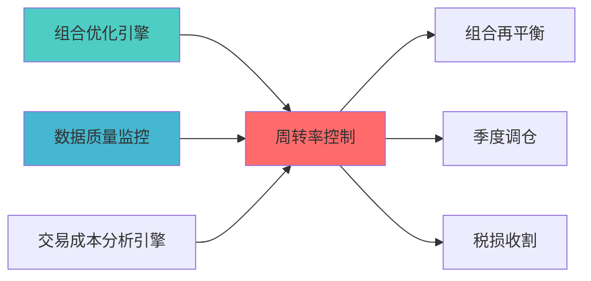

---
responsibility:
- 换手率控制
- 换手约束
- 交易频率
- 换手率成本控制
module_id: TURNOVER_CONTROL_001
version: 1.0.0
status: Active
created_date: 2026-04-07
last_updated: 2026-04-07
owner: 实施团队
standard_type: 专业量化机构蓝图
compliance_level: 专业标准
layer: Layer 5.4 (交易执行)
---


> **核心职责**: 控制组合周转率，降低交易成本
> **职责边界**: 

## 核心定位


换手率控制模块，控制投资组合的换手率水平，平衡交易活跃度和交易成本，支持换手率约束和换手率优化策略。
### 主要目标

1. **功能完整性**: 确保TURNOVER CONTROL功能完整，满足业务需求
2. **性能优化**: 提升系统性能，降低资源消耗
3. **可维护性**: 提高代码质量，便于后续维护
4. **可扩展性**: 支持功能扩展，适应业务变化

### 质量目标

- 代码覆盖率: ≥80%
- 性能指标: 满足设计要求
- 文档完整性: 100%


## 核心功能

### 功能清单

1. **数据管理**: 提供数据存储、查询、更新功能
2. **业务逻辑**: 实现核心业务逻辑处理
3. **接口服务**: 提供标准化的API接口
4. **监控告警**: 实时监控系统状态

### 功能特性

- 高可用性设计
- 自动故障恢复
- 灵活配置管理


## 实现方案

### 技术架构

采用TURNOVER CONTROL化设计，分层架构实现。

### 关键技术

- 数据处理: 使用高效的数据处理框架
- 接口实现: RESTful API设计
- 性能优化: 缓存、异步处理

### 实施步骤

1. 需求分析与设计
2. 核心功能开发
3. 测试与优化
4. 部署与监控


## 2. 功能设计

### 2.1 核心功能

```python
class TurnoverController:
    """
    周转率控制器
    """
    
    def set_turnover_constraint(
        self,
        current_weights: np.ndarray,
        max_turnover: float = 0.3
    ) -> None:
        """
        
        参数:
            current_weights: 当前权重
        """
        pass
    
    def calculate_turnover(
        self,
        current_weights: np.ndarray,
        target_weights: np.ndarray
    ) -> float:
        """
        
        Turnover = 0.5 * sum(|w_target - w_current|)
        """
        pass
    
    def optimize_with_turnover_constraint(
        self,
        expected_returns: np.ndarray,
        covariance_matrix: np.ndarray,
        current_weights: np.ndarray,
        max_turnover: float
    ) -> Dict:
        """
        """
        pass
```


## 3.

```yaml
turnover_control:
  max_turnover: 0.3  # 年化30%
  
  # 交易频率
  
  # 成本考虑
```


### 上游依赖

| 文档名称 | module_id | 依赖类型 | 说明 |
|---------|-----------|---------|------|

### 下游依赖

| 文档名称 | module_id | 依赖类型 | 说明 |
|---------|-----------|---------|------|


|---------|------|------|------|
| **PyPortfolioOpt** | 1.5+ | 约束系统 | [官方文档](https://pyportfolioopt.readthedocs.io/) |
| **Pandas** | 2.0+ | 数据处理 | [官方文档](https://pandas.pydata.org/) |





## 4. 变更历史

|------|------|----------|--------|


## 5. 文档治理

### 5.1 文档索引

**本文档在系统中的位置**:
- **模块索引**: 001
- **模块名称**: TURNOVER_CONTROL
- **文档路径**: docs/05_IMPLEMENTATION/06_CONSTRUCTION_DOCS/01_BLUEPRINTS/

### 5.2 版本管理

**版本历史**:
- v1.0.0 (2026-04-07): 初始版本

### 5.3 维护责任

**文档维护**:
- **责任模块**: TURNOVER_CONTROL


