---
responsibility:
  - 周转率控åˆ?
  - 交易成本优化
  - 换手率管ç?
  - 成本约束

module_id: TURNOVER_CONTROL_001
version: 1.0.0
status: Active
created_date: 2026-04-07
last_updated: 2026-04-07
owner: 实施团队
standard_type: 专业量化机构蓝图
applicable_scope: Layer 6 组合优化å±?
compliance_level: 专业标准
layer: Layer 5.4 (交易执行)
---

# 组合周转率控制蓝å›?

> **核心职责**: 控制组合周转率，降低交易成本
> **职责边界**: 
> - âœ?本文档负责：周转率控制、交易成本优åŒ?
> - â?本文档不负责：因子计算（由因子模块负责）

## 核心定位

负责TURNOVER CONTROL的设计与实现，保障核心功能，优化用户体验。支持业务需求，确保系统稳定运行ã€?

## 2. 功能设计

### 2.1 核心功能

```python
class TurnoverController:
    """
    周转率控制器
    """
    
    def set_turnover_constraint(
        self,
        current_weights: np.ndarray,
        max_turnover: float = 0.3
    ) -> None:
        """
        设置周转率约æ?
        
        参数:
            current_weights: 当前权重
            max_turnover: 最大周转率（如0.3表示30%ï¼?
        """
        pass
    
    def calculate_turnover(
        self,
        current_weights: np.ndarray,
        target_weights: np.ndarray
    ) -> float:
        """
        计算周转çŽ?
        
        Turnover = 0.5 * sum(|w_target - w_current|)
        """
        pass
    
    def optimize_with_turnover_constraint(
        self,
        expected_returns: np.ndarray,
        covariance_matrix: np.ndarray,
        current_weights: np.ndarray,
        max_turnover: float
    ) -> Dict:
        """
        带周转率约束的优åŒ?
        """
        pass
```

---

## 3. 配置参数

```yaml
turnover_control:
  # 周转率约æ?
  max_turnover: 0.3  # 年化30%
  
  # 交易频率
  min_holding_period: 5  # 最小持仓天æ•?
  
  # 成本考虑
  transaction_cost_rate: 0.001  # 交易成本çŽ?
```

---

## 📚 相关文档

### 上游依赖

| 文档名称 | module_id | 依赖类型 | 说明 |
|---------|-----------|---------|------|
| [组合优化引擎集成蓝图](./PORTFOLIO_OPTIMIZER_INTEGRATION_BLUEPRINT.md) | PORTFOLIO_OPTIMIZER_INTEGRATION_001 | 强依èµ?| 提供优化器基础接口 |
| [数据质量监控蓝图](./DATA_QUALITY_MONITORING_BLUEPRINT.md) | DATA_QUALITY_MONITORING_001 | 强依èµ?| 提供数据质量指标 |
| [交易成本分析引擎蓝图](./TRANSACTION_COST_ANALYSIS_ENGINE_BLUEPRINT.md) | TRANSACTION_COST_ANALYSIS_ENGINE_001 | 中依èµ?| 提供成本分析 |

### 下游依赖

| 文档名称 | module_id | 依赖类型 | 说明 |
|---------|-----------|---------|------|
| [组合再平衡蓝图](./PORTFOLIO_REBALANCING_BLUEPRINT.md) | PORTFOLIO_REBALANCING_001 | 强依èµ?| 组合再平è¡?|
| [季度调仓蓝图](./QUARTERLY_REBALANCE_BLUEPRINT.md) | QUARTERLY_REBALANCE_001 | 中依èµ?| 季度调仓决策 |
| [税损收割蓝图](./TAX_LOSS_HARVESTING_BLUEPRINT.md) | TAX_LOSS_HARVESTING_001 | 中依èµ?| 税损收割策略 |

### 技术依èµ?

| 技术组ä»?| 版本 | 用é€?| 文档 |
|---------|------|------|------|
| **Riskfolio-Lib** | 7.0+ | 周转率约æ?| [官方文档](https://riskfolio-lib.readthedocs.io/) |
| **PyPortfolioOpt** | 1.5+ | 约束系统 | [官方文档](https://pyportfolioopt.readthedocs.io/) |
| **NumPy** | 1.24+ | 数值计ç®?| [官方文档](https://numpy.org/) |
| **Pandas** | 2.0+ | 数据处理 | [官方文档](https://pandas.pydata.org/) |

### 引用关系å›?

```mermaid
graph LR
    A[组合优化引擎] --> B[周转率控制]
    C[数据质量监控] --> B
    D[交易成本分析引擎] --> B
    
    B --> E[组合再平衡]
    B --> F[季度调仓]
    B --> G[税损收割]
    
    style B fill:#ff6b6b
    style A fill:#4ecdc4
    style C fill:#45b7d1
```



---

## 4. 变更历史

| 版本 | 日期 | 变更内容 | 变更äº?|
|------|------|----------|--------|
| v1.0.0 | 2026-04-07 | 初始版本创建 | 首席蓝图架构å¸?|

---

**蓝图版本**: v1.0.0 | **创建日期**: 2026-04-07 | **状æ€?*: Active

## 5. 文档治理

### 5.1 文档索引

**本文档在系统中的位置**:
- **所属层çº?*: Layer 6 (组合优化å±?
- **模块索引**: 001
- **模块名称**: TURNOVER_CONTROL
- **文档路径**: docs/05_IMPLEMENTATION/06_CONSTRUCTION_DOCS/01_BLUEPRINTS/

### 5.2 版本管理

**版本历史**:
- v1.0.0 (2026-04-07): 初始版本

### 5.3 维护责任

**文档维护**:
- **责任模块**: TURNOVER_CONTROL
- **维护周期**: 每季度审æŸ?
- **变更流程**: 提交变更申请 â†?技术评å®?â†?更新文档

---

**蓝图版本**: v1.0.0 | **创建日期**: 2026-04-07 | **状æ€?*: Active
