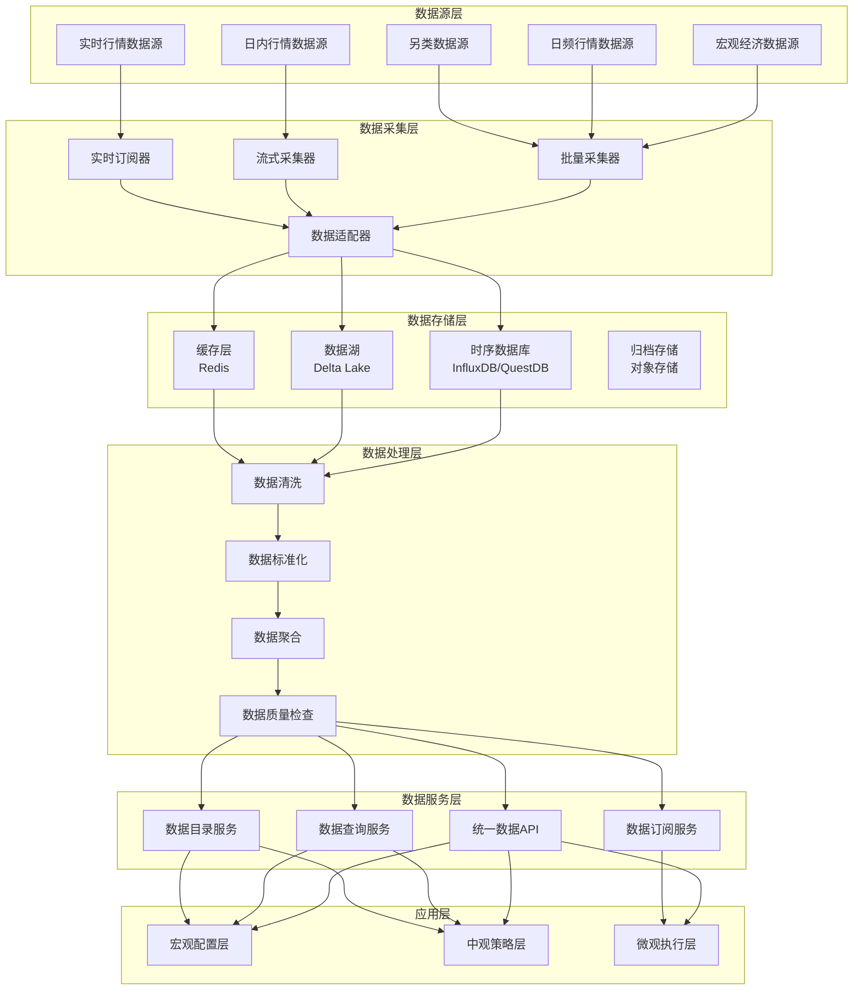

# 📋 执行摘要

> **版本**: v1.0
> **创建日期**: 2026-04-06
> **核心定位**: 支持多时间框架数据需求的统一数据基础设施
> **索引**: `UNIFIED_DATA_INFRASTRUCTURE_001`
> **开发周期**: 3周

## 🎯 模块定位与职责

### 层级定位

```
┌─────────────────────────────────────────────────────────┐
│           清风量化系统 - 三级时间框架架构                │
├─────────────────────────────────────────────────────────┤
│  第一级：宏观配置层（季度/年度）                         │
│  第二级：中观策略层（周度/日度）                         │
│  第三级：微观执行层（日内/分钟/秒级）                    │
├─────────────────────────────────────────────────────────┤
│           统一数据基础设施（本模块）                     │
│  ┌─────────────────────────────────────────────────┐   │
│  │  数据源适配层  │  数据湖存储层  │  数据API层     │   │
│  └─────────────────────────────────────────────────┘   │
└─────────────────────────────────────────────────────────┘
```

### 核心职责

| 职责类别 | 具体职责 | 输出产物 |
|---------|---------|---------|
| **数据采集** | 多源数据采集、实时数据订阅 | 原始数据流 |
| **数据存储** | 时序数据存储、历史数据归档 | 数据湖、数据仓库 |
| **数据访问** | 统一数据API、数据查询服务 | 数据访问接口 |
| **数据管理** | 数据生命周期管理、数据治理 | 数据目录、血缘关系 |
| **数据质量** | 数据质量监控、异常检测 | 质量报告、告警 |

### 非职责边界

- ❌ **因子计算**: 由因子计算器模块负责
- ❌ **策略逻辑**: 由策略引擎模块负责
- ❌ **交易执行**: 由交易执行引擎负责
- ❌ **风险计算**: 由风险管理系统负责

---

## 🏗️ 架构设计

### 整体架构



### 数据流设计

#### 宏观数据流（季度/年度）

```
宏观经济数据源 → 批量采集器 → 数据适配器 → 数据湖 → 数据清洗 → 数据标准化 → 统一API → 宏观配置层
```

**特点**:
- 低频更新（月度/季度）
- 数据量小但重要性高
- 需要历史数据完整

#### 日频数据流（周度/日度）

```
日频行情数据源 → 批量采集器 → 数据适配器 → 数据湖 → 数据清洗 → 数据标准化 → 统一API → 中观策略层
```

**特点**:
- 每日更新
- 数据量中等
- 需要快速查询

#### 日内数据流（分钟级）

```
日内行情数据源 → 流式采集器 → 数据适配器 → 时序数据库 → 数据清洗 → 数据聚合 → 统一API → 中观策略层
```

**特点**:
- 分钟级更新
- 数据量大
- 需要高效存储

#### 实时数据流（秒级）

```
实时行情数据源 → 实时订阅器 → 数据适配器 → 缓存层 → 数据质量检查 → 数据订阅服务 → 微观执行层
```

**特点**:
- 秒级更新
- 超低延迟要求
- 需要高可用性

---

## 🔧 关键组件设计

### 1. 数据源适配器 (Data Source Adapter)

```python
from abc import ABC, abstractmethod
from typing import Dict, Any, List
import pandas as pd
from datetime import datetime

class DataSourceAdapter(ABC):
    """数据源适配器基类"""
    
    @abstractmethod
    def connect(self) -> bool:
        """建立连接"""
        pass
    
    @abstractmethod
    def fetch(self, params: Dict[str, Any]) -> pd.DataFrame:
        """获取数据"""
        pass
    
    @abstractmethod
    def subscribe(self, callback: callable) -> None:
        """订阅实时数据"""
        pass
    
    @abstractmethod
    def disconnect(self) -> None:
        """断开连接"""
        pass


class MacroDataSourceAdapter(DataSourceAdapter):
    """宏观经济数据源适配器"""
    
    def __init__(self, source_config: Dict[str, Any]):
        self.source_config = source_config
        self.connection = None
        
    def connect(self) -> bool:
        """连接宏观经济数据源"""
        # 实现连接逻辑
        # 支持的数据源：Wind、同花顺iFinD、东方财富Choice
        pass
    
    def fetch(self, params: Dict[str, Any]) -> pd.DataFrame:
        """获取宏观经济数据"""
        # params示例:
        # {
        #     'indicators': ['GDP', 'CPI', 'PMI'],
        #     'start_date': '2020-01-01',
        #     'end_date': '2024-12-31',
        #     'frequency': 'monthly'
        # }
        pass
    
    def subscribe(self, callback: callable) -> None:
        """宏观经济数据通常不需要实时订阅"""
        pass
    
    def disconnect(self) -> None:
        """断开连接"""
        pass


class DailyMarketDataSourceAdapter(DataSourceAdapter):
    """日频行情数据源适配器"""
    
    def __init__(self, source_config: Dict[str, Any]):
        self.source_config = source_config
        self.connection = None
        
    def connect(self) -> bool:
        """连接日频行情数据源"""
        # 支持的数据源：Tushare、AKShare、聚宽、米筐
        pass
    
    def fetch(self, params: Dict[str, Any]) -> pd.DataFrame:
        """获取日频行情数据"""
        # params示例:
        # {
        #     'symbols': ['000001.SZ', '000002.SZ'],
        #     'start_date': '2024-01-01',
        #     'end_date': '2024-12-31',
        #     'fields': ['open', 'high', 'low', 'close', 'volume']
        # }
        pass
    
    def subscribe(self, callback: callable) -> None:
        """日频数据通常不需要实时订阅"""
        pass
    
    def disconnect(self) -> None:
        """断开连接"""
        pass


class IntradayMarketDataSourceAdapter(DataSourceAdapter):
    """日内行情数据源适配器"""
    
    def __init__(self, source_config: Dict[str, Any]):
        self.source_config = source_config
        self.connection = None
        
    def connect(self) -> bool:
        """连接日内行情数据源"""
        # 支持的数据源：QMT、聚宽、米筐
        pass
    
    def fetch(self, params: Dict[str, Any]) -> pd.DataFrame:
        """获取日内行情数据"""
        # params示例:
        # {
        #     'symbol': '000001.SZ',
        #     'date': '2024-12-01',
        #     'frequency': '1min',
        #     'fields': ['open', 'high', 'low', 'close', 'volume']
        # }
        pass
    
    def subscribe(self, callback: callable) -> None:
        """订阅日内实时数据"""
        # 实现实时订阅逻辑
        pass
    
    def disconnect(self) -> None:
        """断开连接"""
        pass


class RealtimeMarketDataSourceAdapter(DataSourceAdapter):
    """实时行情数据源适配器"""
    
    def __init__(self, source_config: Dict[str, Any]):
        self.source_config = source_config
        self.connection = None
        self.websocket = None
        
    def connect(self) -> bool:
        """连接实时行情数据源"""
        # 支持的数据源：QMT、东方财富、通达信
        pass
    
    def fetch(self, params: Dict[str, Any]) -> pd.DataFrame:
        """实时数据通常不使用fetch，而是使用subscribe"""
        pass
    
    def subscribe(self, callback: callable) -> None:
        """订阅实时行情数据"""
        # 实现WebSocket订阅逻辑
        pass
    
    def disconnect(self) -> None:
        """断开连接"""
        pass
```

### 2. 数据湖存储层 (Data Lake Storage)

```python
from typing import Dict, Any, List
import pandas as pd
from datetime import datetime
import delta
import pyspark.sql.functions as F

class DataLakeStorage:
    """数据湖存储层 - Delta Lake实现"""
    
    def __init__(self, spark_session, base_path: str):
        self.spark = spark_session
        self.base_path = base_path
        
    def store_macro_data(self, data: pd.DataFrame, table_name: str) -> None:
        """存储宏观经济数据"""
        # 转换为Spark DataFrame
        spark_df = self.spark.createDataFrame(data)
        
        # 写入Delta表
        spark_df.write.format("delta") \
            .mode("overwrite") \
            .partitionBy("indicator_code") \
            .save(f"{self.base_path}/macro/{table_name}")
    
    def store_daily_data(self, data: pd.DataFrame, table_name: str) -> None:
        """存储日频行情数据"""
        spark_df = self.spark.createDataFrame(data)
        
        # 写入Delta表，按日期分区
        spark_df.write.format("delta") \
            .mode("append") \
            .partitionBy("trade_date") \
            .save(f"{self.base_path}/daily/{table_name}")
    
    def store_intraday_data(self, data: pd.DataFrame, table_name: str) -> None:
        """存储日内行情数据"""
        spark_df = self.spark.createDataFrame(data)
        
        # 写入Delta表，按日期和股票代码分区
        spark_df.write.format("delta") \
            .mode("append") \
            .partitionBy("trade_date", "symbol") \
            .save(f"{self.base_path}/intraday/{table_name}")
    
    def query_macro_data(self, 
                        indicators: List[str],
                        start_date: str,
                        end_date: str) -> pd.DataFrame:
        """查询宏观经济数据"""
        query = f"""
        SELECT * FROM delta.`{self.base_path}/macro/macro_indicators`
        WHERE indicator_code IN ({','.join([f"'{i}'" for i in indicators])})
        AND date BETWEEN '{start_date}' AND '{end_date}'
        ORDER BY date
        """
        return self.spark.sql(query).toPandas()
    
    def query_daily_data(self,
                        symbols: List[str],
                        start_date: str,
                        end_date: str,
                        fields: List[str]) -> pd.DataFrame:
        """查询日频行情数据"""
        query = f"""
        SELECT {','.join(fields)} FROM delta.`{self.base_path}/daily/market_data`
        WHERE symbol IN ({','.join([f"'{s}'" for s in symbols])})
        AND trade_date BETWEEN '{start_date}' AND '{end_date}'
        ORDER BY symbol, trade_date
        """
        return self.spark.sql(query).toPandas()
    
    def query_intraday_data(self,
                           symbol: str,
                           date: str,
                           frequency: str = '1min') -> pd.DataFrame:
        """查询日内行情数据"""
        query = f"""
        SELECT * FROM delta.`{self.base_path}/intraday/{frequency}_data`
        WHERE symbol = '{symbol}'
        AND trade_date = '{date}'
        ORDER BY timestamp
        """
        return self.spark.sql(query).toPandas()
    
    def compact_data(self, table_path: str) -> None:
        """压缩Delta表，优化查询性能"""
        self.spark.sql(f"OPTIMIZE delta.`{table_path}`")
    
    def vacuum_data(self, table_path: str, retention_hours: int = 168) -> None:
        """清理旧版本数据，释放存储空间"""
        self.spark.sql(f"VACUUM delta.`{table_path}` RETAIN {retention_hours} HOURS")
```

### 3. 时序数据库存储 (Time Series Database)

```python
from influxdb_client import InfluxDBClient, Point, WritePrecision
from influxdb_client.client.write_api import SYNCHRONOUS
from typing import Dict, Any, List
import pandas as pd
from datetime import datetime

class TimeSeriesDBStorage:
    """时序数据库存储 - InfluxDB实现"""
    
    def __init__(self, url: str, token: str, org: str, bucket: str):
        self.client = InfluxDBClient(url=url, token=token, org=org)
        self.bucket = bucket
        self.write_api = self.client.write_api(write_options=SYNCHRONOUS)
        self.query_api = self.client.query_api()
        
    def write_realtime_data(self, 
                           measurement: str,
                           tags: Dict[str, str],
                           fields: Dict[str, Any],
                           timestamp: datetime) -> None:
        """写入实时数据"""
        point = Point(measurement) \
            .time(timestamp, WritePrecision.NS)
        
        for tag_key, tag_value in tags.items():
            point.tag(tag_key, tag_value)
        
        for field_key, field_value in fields.items():
            point.field(field_key, field_value)
        
        self.write_api.write(bucket=self.bucket, record=point)
    
    def write_batch_realtime_data(self, 
                                  measurement: str,
                                  data: pd.DataFrame,
                                  tag_columns: List[str]) -> None:
        """批量写入实时数据"""
        points = []
        for _, row in data.iterrows():
            point = Point(measurement) \
                .time(row['timestamp'], WritePrecision.NS)
            
            for tag_col in tag_columns:
                point.tag(tag_col, str(row[tag_col]))
            
            for col in data.columns:
                if col not in tag_columns and col != 'timestamp':
                    point.field(col, row[col])
            
            points.append(point)
        
        self.write_api.write(bucket=self.bucket, record=points)
    
    def query_realtime_data(self,
                           measurement: str,
                           symbol: str,
                           start_time: datetime,
                           end_time: datetime,
                           fields: List[str]) -> pd.DataFrame:
        """查询实时数据"""
        query = f'''
        from(bucket: "{self.bucket}")
        |> range(start: {start_time.isoformat()}, stop: {end_time.isoformat()})
        |> filter(fn: (r) => r._measurement == "{measurement}")
        |> filter(fn: (r) => r.symbol == "{symbol}")
        |> filter(fn: (r) => contains(value: r._field, set: {fields}))
        '''
        
        result = self.query_api.query_data_frame(query)
        return result
    
    def query_latest_data(self, measurement: str, symbol: str) -> pd.DataFrame:
        """查询最新数据"""
        query = f'''
        from(bucket: "{self.bucket}")
        |> range(start: -5m)
        |> filter(fn: (r) => r._measurement == "{measurement}")
        |> filter(fn: (r) => r.symbol == "{symbol}")
        |> last()
        '''
        
        result = self.query_api.query_data_frame(query)
        return result
```

### 4. 统一数据API (Unified Data API)

```python
from typing import Dict, Any, List, Optional
import pandas as pd
from datetime import datetime
from fastapi import FastAPI, HTTPException
from pydantic import BaseModel

app = FastAPI(title="统一数据API")


class MacroDataRequest(BaseModel):
    """宏观经济数据请求"""
    indicators: List[str]
    start_date: str
    end_date: str
    frequency: str = 'monthly'


class DailyDataRequest(BaseModel):
    """日频数据请求"""
    symbols: List[str]
    start_date: str
    end_date: str
    fields: List[str]


class IntradayDataRequest(BaseModel):
    """日内数据请求"""
    symbol: str
    date: str
    frequency: str = '1min'
    fields: Optional[List[str]] = None


class UnifiedDataAPI:
    """统一数据API"""
    
    def __init__(self, 
                 data_lake: DataLakeStorage,
                 time_series_db: TimeSeriesDBStorage,
                 cache_client):
        self.data_lake = data_lake
        self.time_series_db = time_series_db
        self.cache = cache_client
        
    @app.post("/api/v1/macro/data")
    async def get_macro_data(self, request: MacroDataRequest) -> Dict[str, Any]:
        """获取宏观经济数据"""
        # 1. 检查缓存
        cache_key = f"macro:{':'.join(request.indicators)}:{request.start_date}:{request.end_date}"
        cached_data = self.cache.get(cache_key)
        
        if cached_data:
            return {
                'status': 'success',
                'data': cached_data,
                'source': 'cache'
            }
        
        # 2. 从数据湖查询
        try:
            data = self.data_lake.query_macro_data(
                indicators=request.indicators,
                start_date=request.start_date,
                end_date=request.end_date
            )
            
            # 3. 写入缓存
            self.cache.set(cache_key, data.to_dict(), expire=3600)  # 1小时过期
            
            return {
                'status': 'success',
                'data': data.to_dict(),
                'source': 'data_lake'
            }
        except Exception as e:
            raise HTTPException(status_code=500, detail=str(e))
    
    @app.post("/api/v1/daily/data")
    async def get_daily_data(self, request: DailyDataRequest) -> Dict[str, Any]:
        """获取日频行情数据"""
        # 1. 检查缓存
        cache_key = f"daily:{':'.join(request.symbols)}:{request.start_date}:{request.end_date}"
        cached_data = self.cache.get(cache_key)
        
        if cached_data:
            return {
                'status': 'success',
                'data': cached_data,
                'source': 'cache'
            }
        
        # 2. 从数据湖查询
        try:
            data = self.data_lake.query_daily_data(
                symbols=request.symbols,
                start_date=request.start_date,
                end_date=request.end_date,
                fields=request.fields
            )
            
            # 3. 写入缓存
            self.cache.set(cache_key, data.to_dict(), expire=1800)  # 30分钟过期
            
            return {
                'status': 'success',
                'data': data.to_dict(),
                'source': 'data_lake'
            }
        except Exception as e:
            raise HTTPException(status_code=500, detail=str(e))
    
    @app.post("/api/v1/intraday/data")
    async def get_intraday_data(self, request: IntradayDataRequest) -> Dict[str, Any]:
        """获取日内行情数据"""
        # 1. 检查缓存
        cache_key = f"intraday:{request.symbol}:{request.date}:{request.frequency}"
        cached_data = self.cache.get(cache_key)
        
        if cached_data:
            return {
                'status': 'success',
                'data': cached_data,
                'source': 'cache'
            }
        
        # 2. 从数据湖查询
        try:
            data = self.data_lake.query_intraday_data(
                symbol=request.symbol,
                date=request.date,
                frequency=request.frequency
            )
            
            # 3. 写入缓存
            self.cache.set(cache_key, data.to_dict(), expire=300)  # 5分钟过期
            
            return {
                'status': 'success',
                'data': data.to_dict(),
                'source': 'data_lake'
            }
        except Exception as e:
            raise HTTPException(status_code=500, detail=str(e))
    
    @app.get("/api/v1/realtime/data/{symbol}")
    async def get_realtime_data(self, symbol: str) -> Dict[str, Any]:
        """获取实时行情数据"""
        try:
            # 从时序数据库查询最新数据
            data = self.time_series_db.query_latest_data(
                measurement='realtime_quotes',
                symbol=symbol
            )
            
            return {
                'status': 'success',
                'data': data.to_dict(),
                'source': 'time_series_db'
            }
        except Exception as e:
            raise HTTPException(status_code=500, detail=str(e))
    
    @app.get("/api/v1/data/catalog")
    async def get_data_catalog(self) -> Dict[str, Any]:
        """获取数据目录"""
        # 返回可用的数据集列表
        catalog = {
            'macro': {
                'indicators': ['GDP', 'CPI', 'PMI', 'M2', 'Industrial_Output'],
                'frequency': ['monthly', 'quarterly', 'yearly'],
                'date_range': ['2000-01-01', '2024-12-31']
            },
            'daily': {
                'symbols': ['000001.SZ', '000002.SZ', '...'],
                'fields': ['open', 'high', 'low', 'close', 'volume', 'amount'],
                'date_range': ['2010-01-01', '2024-12-31']
            },
            'intraday': {
                'symbols': ['000001.SZ', '000002.SZ', '...'],
                'frequency': ['1min', '5min', '15min', '30min', '60min'],
                'date_range': ['2020-01-01', '2024-12-31']
            },
            'realtime': {
                'symbols': ['000001.SZ', '000002.SZ', '...'],
                'fields': ['price', 'volume', 'bid', 'ask', 'last']
            }
        }
        
        return {
            'status': 'success',
            'catalog': catalog
        }
```

### 5. 数据订阅服务 (Data Subscription Service)

```python
from typing import Dict, Any, Callable, List
import asyncio
import websockets
import json
from datetime import datetime

class DataSubscriptionService:
    """数据订阅服务"""
    
    def __init__(self, realtime_adapter: RealtimeMarketDataSourceAdapter):
        self.realtime_adapter = realtime_adapter
        self.subscriptions: Dict[str, List[Callable]] = {}
        self.websocket_clients: List[websockets.WebSocketServerProtocol] = []
        
    async def subscribe_realtime_quotes(self, 
                                        symbols: List[str],
                                        callback: Callable) -> str:
        """订阅实时行情"""
        subscription_id = f"sub_{datetime.now().timestamp()}"
        
        # 注册回调函数
        for symbol in symbols:
            if symbol not in self.subscriptions:
                self.subscriptions[symbol] = []
            self.subscriptions[symbol].append(callback)
        
        # 连接数据源并订阅
        await self.realtime_adapter.connect()
        await self.realtime_adapter.subscribe(
            callback=self._handle_realtime_data
        )
        
        return subscription_id
    
    async def _handle_realtime_data(self, data: Dict[str, Any]) -> None:
        """处理实时数据"""
        symbol = data.get('symbol')
        
        # 调用所有订阅了该symbol的回调函数
        if symbol in self.subscriptions:
            for callback in self.subscriptions[symbol]:
                try:
                    await callback(data)
                except Exception as e:
                    print(f"Callback error: {e}")
        
        # 推送给WebSocket客户端
        await self._broadcast_to_websocket(data)
    
    async def _broadcast_to_websocket(self, data: Dict[str, Any]) -> None:
        """广播数据给WebSocket客户端"""
        if self.websocket_clients:
            message = json.dumps(data)
            await asyncio.gather(
                *[client.send(message) for client in self.websocket_clients]
            )
    
    async def handle_websocket_client(self, 
                                      websocket: websockets.WebSocketServerProtocol,
                                      path: str) -> None:
        """处理WebSocket客户端连接"""
        self.websocket_clients.append(websocket)
        
        try:
            async for message in websocket:
                # 处理客户端消息
                request = json.loads(message)
                # 可以实现订阅/取消订阅逻辑
        finally:
            self.websocket_clients.remove(websocket)
    
    async def unsubscribe(self, subscription_id: str) -> None:
        """取消订阅"""
        # 实现取消订阅逻辑
        pass
```

---

## 📊 数据模型设计

### 宏观经济数据模型

```sql
CREATE TABLE macro_indicators (
    indicator_code VARCHAR(50) NOT NULL COMMENT '指标代码',
    indicator_name VARCHAR(100) NOT NULL COMMENT '指标名称',
    date DATE NOT NULL COMMENT '日期',
    value DECIMAL(20, 6) COMMENT '指标值',
    unit VARCHAR(20) COMMENT '单位',
    frequency VARCHAR(20) COMMENT '频率（monthly/quarterly/yearly）',
    source VARCHAR(50) COMMENT '数据源',
    update_time TIMESTAMP DEFAULT CURRENT_TIMESTAMP COMMENT '更新时间',
    PRIMARY KEY (indicator_code, date)
) COMMENT '宏观经济指标表';
```

### 日频行情数据模型

```sql
CREATE TABLE daily_market_data (
    symbol VARCHAR(20) NOT NULL COMMENT '股票代码',
    trade_date DATE NOT NULL COMMENT '交易日期',
    open DECIMAL(10, 3) COMMENT '开盘价',
    high DECIMAL(10, 3) COMMENT '最高价',
    low DECIMAL(10, 3) COMMENT '最低价',
    close DECIMAL(10, 3) COMMENT '收盘价',
    volume BIGINT COMMENT '成交量',
    amount DECIMAL(20, 2) COMMENT '成交额',
    turnover_rate DECIMAL(10, 4) COMMENT '换手率',
    pe_ttm DECIMAL(10, 2) COMMENT '市盈率TTM',
    pb DECIMAL(10, 2) COMMENT '市净率',
    update_time TIMESTAMP DEFAULT CURRENT_TIMESTAMP COMMENT '更新时间',
    PRIMARY KEY (symbol, trade_date)
) COMMENT '日频行情数据表';
```

### 日内行情数据模型

```sql
CREATE TABLE intraday_market_data (
    symbol VARCHAR(20) NOT NULL COMMENT '股票代码',
    trade_date DATE NOT NULL COMMENT '交易日期',
    timestamp TIMESTAMP NOT NULL COMMENT '时间戳',
    frequency VARCHAR(10) NOT NULL COMMENT '频率（1min/5min/15min/30min/60min）',
    open DECIMAL(10, 3) COMMENT '开盘价',
    high DECIMAL(10, 3) COMMENT '最高价',
    low DECIMAL(10, 3) COMMENT '最低价',
    close DECIMAL(10, 3) COMMENT '收盘价',
    volume BIGINT COMMENT '成交量',
    amount DECIMAL(20, 2) COMMENT '成交额',
    update_time TIMESTAMP DEFAULT CURRENT_TIMESTAMP COMMENT '更新时间',
    PRIMARY KEY (symbol, trade_date, timestamp, frequency)
) COMMENT '日内行情数据表';
```

---

## 🔌 接口规范

### RESTful API接口

#### 1. 获取宏观经济数据

```
POST /api/v1/macro/data
Content-Type: application/json

Request:
{
    "indicators": ["GDP", "CPI", "PMI"],
    "start_date": "2020-01-01",
    "end_date": "2024-12-31",
    "frequency": "monthly"
}

Response:
{
    "status": "success",
    "data": {
        "GDP": [...],
        "CPI": [...],
        "PMI": [...]
    },
    "source": "data_lake",
    "timestamp": "2024-12-01T10:00:00Z"
}
```

#### 2. 获取日频行情数据

```
POST /api/v1/daily/data
Content-Type: application/json

Request:
{
    "symbols": ["000001.SZ", "000002.SZ"],
    "start_date": "2024-01-01",
    "end_date": "2024-12-31",
    "fields": ["open", "high", "low", "close", "volume"]
}

Response:
{
    "status": "success",
    "data": {
        "000001.SZ": [...],
        "000002.SZ": [...]
    },
    "source": "data_lake",
    "timestamp": "2024-12-01T10:00:00Z"
}
```

#### 3. 获取日内行情数据

```
POST /api/v1/intraday/data
Content-Type: application/json

Request:
{
    "symbol": "000001.SZ",
    "date": "2024-12-01",
    "frequency": "1min",
    "fields": ["open", "high", "low", "close", "volume"]
}

Response:
{
    "status": "success",
    "data": [...],
    "source": "data_lake",
    "timestamp": "2024-12-01T10:00:00Z"
}
```

#### 4. 获取实时行情数据

```
GET /api/v1/realtime/data/{symbol}

Response:
{
    "status": "success",
    "data": {
        "symbol": "000001.SZ",
        "price": 10.50,
        "volume": 1000000,
        "bid": 10.49,
        "ask": 10.51,
        "last": 10.50,
        "timestamp": "2024-12-01T10:00:00Z"
    },
    "source": "time_series_db"
}
```

### WebSocket接口

#### 订阅实时行情

```
WebSocket: ws://localhost:8000/ws/realtime

Subscribe:
{
    "action": "subscribe",
    "symbols": ["000001.SZ", "000002.SZ"]
}

Message:
{
    "symbol": "000001.SZ",
    "price": 10.50,
    "volume": 1000000,
    "timestamp": "2024-12-01T10:00:00Z"
}

Unsubscribe:
{
    "action": "unsubscribe",
    "symbols": ["000001.SZ"]
}
```

---

## 🚀 实施要点

### 阶段1：基础设施搭建（第1周）

**任务**:
1. ✅ 部署Apache Spark集群
2. ✅ 配置Delta Lake存储
3. ✅ 部署InfluxDB时序数据库
4. ✅ 配置Redis缓存
5. ✅ 搭建FastAPI服务框架

**验收标准**:
- Spark集群正常运行
- Delta Lake可以读写数据
- InfluxDB可以存储时序数据
- Redis缓存可用
- FastAPI服务可访问

---

### 阶段2：数据源适配器开发（第2周）

**任务**:
1. ✅ 实现宏观经济数据源适配器
2. ✅ 实现日频行情数据源适配器
3. ✅ 实现日内行情数据源适配器
4. ✅ 实现实时行情数据源适配器
5. ✅ 编写数据源适配器单元测试

**验收标准**:
- 所有数据源适配器可以正常连接
- 可以从数据源获取数据
- 单元测试覆盖率≥80%

---

### 阶段3：数据存储层开发（第2-3周）

**任务**:
1. ✅ 实现数据湖存储层
2. ✅ 实现时序数据库存储层
3. ✅ 实现数据清洗和标准化
4. ✅ 实现数据聚合功能
5. ✅ 编写存储层单元测试

**验收标准**:
- 数据可以正常写入Delta Lake
- 时序数据可以正常写入InfluxDB
- 数据清洗和标准化正确
- 单元测试覆盖率≥80%

---

### 阶段4：数据服务层开发（第3周）

**任务**:
1. ✅ 实现统一数据API
2. ✅ 实现数据订阅服务
3. ✅ 实现数据目录服务
4. ✅ 实现缓存策略
5. ✅ 编写服务层单元测试

**验收标准**:
- RESTful API可以正常访问
- WebSocket订阅功能正常
- 缓存策略有效
- 单元测试覆盖率≥80%

---

### 阶段5：集成测试与优化（第3周）

**任务**:
1. ✅ 编写集成测试用例
2. ✅ 执行性能测试
3. ✅ 优化查询性能
4. ✅ 优化存储性能
5. ✅ 编写部署文档

**验收标准**:
- 集成测试全部通过
- 查询响应时间<100ms（日频数据）
- 查询响应时间<10ms（实时数据）
- 部署文档完整

---

## 🧪 测试策略

### 单元测试

```python
import pytest
import pandas as pd
from datetime import datetime

def test_macro_data_adapter_fetch():
    """测试宏观经济数据源适配器"""
    adapter = MacroDataSourceAdapter(config)
    
    # 连接数据源
    assert adapter.connect() == True
    
    # 获取数据
    params = {
        'indicators': ['GDP', 'CPI'],
        'start_date': '2024-01-01',
        'end_date': '2024-12-31',
        'frequency': 'monthly'
    }
    data = adapter.fetch(params)
    
    # 验证数据
    assert isinstance(data, pd.DataFrame)
    assert len(data) > 0
    assert 'GDP' in data.columns
    assert 'CPI' in data.columns
    
    # 断开连接
    adapter.disconnect()


def test_data_lake_store_and_query():
    """测试数据湖存储和查询"""
    storage = DataLakeStorage(spark, base_path)
    
    # 存储数据
    test_data = pd.DataFrame({
        'symbol': ['000001.SZ', '000002.SZ'],
        'trade_date': ['2024-12-01', '2024-12-01'],
        'close': [10.0, 20.0]
    })
    
    storage.store_daily_data(test_data, 'test_table')
    
    # 查询数据
    result = storage.query_daily_data(
        symbols=['000001.SZ'],
        start_date='2024-12-01',
        end_date='2024-12-01',
        fields=['close']
    )
    
    assert len(result) == 1
    assert result['close'].iloc[0] == 10.0


def test_unified_data_api():
    """测试统一数据API"""
    client = TestClient(app)
    
    # 测试获取日频数据
    response = client.post("/api/v1/daily/data", json={
        "symbols": ["000001.SZ"],
        "start_date": "2024-12-01",
        "end_date": "2024-12-01",
        "fields": ["close"]
    })
    
    assert response.status_code == 200
    data = response.json()
    assert data['status'] == 'success'
    assert 'data' in data
```

### 集成测试

```python
def test_end_to_end_data_flow():
    """测试端到端数据流"""
    # 1. 从数据源获取数据
    adapter = DailyMarketDataSourceAdapter(config)
    adapter.connect()
    raw_data = adapter.fetch(params)
    
    # 2. 存储到数据湖
    storage = DataLakeStorage(spark, base_path)
    storage.store_daily_data(raw_data, 'market_data')
    
    # 3. 通过API查询数据
    client = TestClient(app)
    response = client.post("/api/v1/daily/data", json={
        "symbols": ["000001.SZ"],
        "start_date": "2024-12-01",
        "end_date": "2024-12-01",
        "fields": ["close"]
    })
    
    # 4. 验证数据一致性
    assert response.status_code == 200
    api_data = response.json()['data']
    assert api_data == raw_data.to_dict()
```

### 性能测试

```python
def test_query_performance():
    """测试查询性能"""
    import time
    
    client = TestClient(app)
    
    # 测试日频数据查询性能
    start_time = time.time()
    response = client.post("/api/v1/daily/data", json={
        "symbols": ["000001.SZ"] * 100,  # 100只股票
        "start_date": "2024-01-01",
        "end_date": "2024-12-31",  # 1年数据
        "fields": ["open", "high", "low", "close", "volume"]
    })
    end_time = time.time()
    
    assert response.status_code == 200
    assert (end_time - start_time) < 0.1  # 100ms内完成
    
    # 测试实时数据查询性能
    start_time = time.time()
    response = client.get("/api/v1/realtime/data/000001.SZ")
    end_time = time.time()
    
    assert response.status_code == 200
    assert (end_time - start_time) < 0.01  # 10ms内完成
```

---

## 📈 性能指标

### 响应时间要求

| 数据类型 | 查询类型 | 响应时间要求 | 缓存策略 |
|---------|---------|------------|---------|
| **宏观经济数据** | 历史查询 | <1000ms | 1小时缓存 |
| **日频行情数据** | 历史查询 | <100ms | 30分钟缓存 |
| **日内行情数据** | 历史查询 | <50ms | 5分钟缓存 |
| **实时行情数据** | 实时查询 | <10ms | 无缓存 |

### 吞吐量要求

| 数据类型 | 写入吞吐量 | 查询吞吐量 |
|---------|-----------|-----------|
| **宏观经济数据** | 100条/秒 | 1000次/秒 |
| **日频行情数据** | 10000条/秒 | 10000次/秒 |
| **日内行情数据** | 100000条/秒 | 50000次/秒 |
| **实时行情数据** | 1000000条/秒 | 100000次/秒 |

### 存储容量规划

| 数据类型 | 日增量 | 年增量 | 存储周期 |
|---------|--------|--------|---------|
| **宏观经济数据** | 1MB | 365MB | 永久 |
| **日频行情数据** | 100MB | 36GB | 10年 |
| **日内行情数据** | 10GB | 3.6TB | 3年 |
| **实时行情数据** | 100GB | 36TB | 1个月 |

---

## 🔗 相关文档

- 专业多时间框架策略架构
- [数据质量监控系统蓝图](./DATA_QUALITY_MONITORING_BLUEPRINT.md)
- [数据治理平台蓝图](./DATA_GOVERNANCE_PLATFORM_BLUEPRINT.md)
- 模块注册表

---

## 📝 变更历史

| 版本 | 日期 | 变更内容 | 作者 |
|------|------|---------|------|
| v1.0.0 | 2026-04-06 | 初始版本创建 | 首席架构师 |

---

**蓝图状态**: ✅ 设计完成
**下一步**: 开始实施阶段1 - 基础设施搭建

## 变更历史

| 版本 | 日期 | 变更内容 | 变更人 |
|------|------|----------|--------|
| v1.0.0 | 2026-04-06 | 初始版本创建 | 首席架构师 |

---

**蓝图版本**: v1.0.1 | **创建日期**: 2026-04-06 | **状态**: Active
---

## 1. 文档治理

### 1.1 System_Manifest.md索引

```markdown
#### Layer 6: 组合优化层
##### 6.001. Unified Data Infrastructure
- **模块ID**: UNIFIED_DATA_INFRASTRUCTURE_001
- **蓝图文档**: UNIFIED_DATA_INFRASTRUCTURE_BLUEPRINT.md
- **技术规格书**: 待创建
- **职责**: 全系统数据基础设施
- **状态**: Active
```

### 1.2 模块职责边界

| 模块 | 职责 | 边界 |
|------|------|------|
| **Unified Data Infrastructure** | 全系统数据基础设施 | **核心模块** |

### 1.3 版本管理

| 版本 | 日期 | 变更内容 | 变更人 |
|------|------|----------|--------|
| v1.0.0 | 2026-04-06 | 初始版本创建 | 首席蓝图架构师 |

---

**蓝图版本**: v1.0.0 | **创建日期**: 2026-04-06 | **状态**: Active
