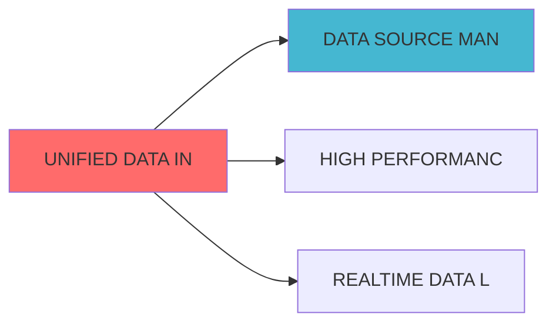

## 核心定位

负责统一数据基础设施的设计与实现，构建统一的数据平台架构，提供数据存储、计算和服务功能，支持数据管理。

# UNIFIED DATA INFRASTRUCTURE BLUEPRINT

> **核心职责**: 统一数据基础设施，构建数据采集、存储和处理框架
> **职责边界**: 
> - âœ?本文档负责：数据采集、数据存储、数据处理、基础设施管理
> - â?本文档不负责：业务数据处理、数据质量监控、数据治ç?
ï»? 📋 执行摘要

> **版本**: v1.0
> **创建日期**: 2026-04-06
> **核心定位**: 支持多时间框架数据需求的统一数据基础设施
> **索引**: `UNIFIED_DATA_INFRASTRUCTURE_001`
> **开发周æœ?*: 3å‘?


## 设计目标

### 主要目标

1. **功能完整性**: 确保UNIFIED DATA INFRASTRUCTURE功能完整，满足业务需求
2. **性能优化**: 提升系统性能，降低资源消耗
3. **可维护性**: 提高代码质量，便于后续维护
4. **可扩展性**: 支持功能扩展，适应业务变化

### 质量目标

- 代码覆盖率: ≥80%
- 性能指标: 满足设计要求
- 文档完整性: 100%


## 核心功能

### 功能清单

1. **数据管理**: 提供数据存储、查询、更新功能
2. **业务逻辑**: 实现核心业务逻辑处理
3. **接口服务**: 提供标准化的API接口
4. **监控告警**: 实时监控系统状态

### 功能特性

- 高可用性设计
- 自动故障恢复
- 灵活配置管理


## 实现方案

### 技术架构

采用UNIFIED DATA INFRASTRUCTURE化设计，分层架构实现。

### 关键技术

- 数据处理: 使用高效的数据处理框架
- 接口实现: RESTful API设计
- 性能优化: 缓存、异步处理

### 实施步骤

1. 需求分析与设计
2. 核心功能开发
3. 测试与优化
4. 部署与监控


## 核心定位

**单一职责**: 统一数据基础设施，构建统一的数据采集、存储和处理基础设施

### 职责边界

**âœ?核心职责**:

- 数据采集框架
- 数据存储架构
- 数据处理引擎
- 基础设施管理

**â?非职责范å›?*:
- 业务数据处理
- 数据质量监控
- 数据治理

## 🎯 模块定位与职è´?

### 层级定位

```
┌─────────────────────────────────────────────────────────â”?
â”?          清风量化系统 - 三级时间框架架构                â”?
├─────────────────────────────────────────────────────────â”?
â”? 第一级：宏观配置层（季度/年度ï¼?                        â”?
â”? 第二级：中观策略层（周度/日度ï¼?                        â”?
â”? 第三级：微观执行层（日内/分钟/秒级ï¼?                   â”?
├─────────────────────────────────────────────────────────â”?
â”?          统一数据基础设施（本模块ï¼?                    â”?
â”? ┌─────────────────────────────────────────────────â”?  â”?
â”? â”? 数据源适配å±? â”? 数据湖存储层  â”? 数据APIå±?    â”?  â”?
â”? └─────────────────────────────────────────────────â”?  â”?
└─────────────────────────────────────────────────────────â”?
```

### 核心职责

| 职责类别 | 具体职责 | 输出产物 |
|---------|---------|---------|
| **数据采集** | 多源数据采集、实时数据订é˜?| 原始数据æµ?|
| **数据存储** | 时序数据存储、历史数据归æ¡?| 数据湖、数据仓åº?|
| **数据访问** | 统一数据API、数据查询服åŠ?| 数据访问接口 |
| **数据管理** | 数据生命周期管理、数据治ç?| 数据目录、血缘关ç³?|
| **数据质量** | 数据质量监控、异常检æµ?| 质量报告、告è­?|

### 非职责边ç•?

- â?**因子计算**: 由因子计算器模块负责
- â?**策略逻辑**: 由策略引擎模块负è´?
- â?**交易执行**: 由交易执行引擎负è´?
- â?**风险计算**: 由风险管理系统负è´?

---

## 🏗ï¸?架构设计

### 整体架构

```mermaid
graph TB
    subgraph "数据源层"
        A1[宏观经济数据源]
        A2[日频行情数据源]
        A3[日内行情数据源]
        A4[实时行情数据源]
        A5[另类数据源]
    end
    
    subgraph "数据采集å±?
        B1[批量采集器]
        B2[流式采集器]
        B3[实时订阅器]
        B4[数据适配器]
    end
    
    subgraph "数据存储å±?
        C1[时序数据åº?br/>InfluxDB/QuestDB]
        C2[数据æ¹?br/>Delta Lake]
        C3[缓存å±?br/>Redis]
        C4[归档存储<br/>对象存储]
    end
    
    subgraph "数据处理å±?
        D1[数据清洗]
        D2[数据标准化]
        D3[数据聚合]
        D4[数据质量检查]
    end
    
    subgraph "数据服务å±?
        E1[统一数据API]
        E2[数据查询服务]
        E3[数据订阅服务]
        E4[数据目录服务]
    end
    
    subgraph "应用å±?
        F1[宏观配置层]
        F2[中观策略层]
        F3[微观执行层]
    end
    
    A1 --> B1
    A2 --> B1
    A3 --> B2
    A4 --> B3
    A5 --> B1
    
    B1 --> B4
    B2 --> B4
    B3 --> B4
    
    B4 --> C1
    B4 --> C2
    B4 --> C3
    
    C1 --> D1
    C2 --> D1
    C3 --> D1
    
    D1 --> D2
    D2 --> D3
    D3 --> D4
    
    D4 --> E1
    D4 --> E2
    D4 --> E3
    D4 --> E4
    
    E1 --> F1
    E1 --> F2
    E1 --> F3
    E2 --> F1
    E2 --> F2
    E3 --> F3
    E4 --> F1
    E4 --> F2
```

### 数据流设è®?

#### 宏观数据流（季度/年度ï¼?

```
宏观经济数据æº?â†?批量采集å™?â†?数据适配å™?â†?数据æ¹?â†?数据清洗 â†?数据标准åŒ?â†?统一API â†?宏观配置å±?
```

**特点**:
- 低频更新（月åº?季度ï¼?
- 数据量小但重要性高
- 需要历史数据完æ•?

#### 日频数据流（周度/日度ï¼?

```
日频行情数据æº?â†?批量采集å™?â†?数据适配å™?â†?数据æ¹?â†?数据清洗 â†?数据标准åŒ?â†?统一API â†?中观策略å±?
```

**特点**:
- 每日更新
- 数据量中ç­?
- 需要快速查è¯?

#### 日内数据流（分钟级）

```
日内行情数据æº?â†?流式采集å™?â†?数据适配å™?â†?时序数据åº?â†?数据清洗 â†?数据聚合 â†?统一API â†?中观策略å±?
```

**特点**:
- 分钟级更æ–?
- 数据量大
- 需要高效存å‚?

#### 实时数据流（秒级ï¼?

```
实时行情数据æº?â†?实时订阅å™?â†?数据适配å™?â†?缓存å±?â†?数据质量检æŸ?â†?数据订阅服务 â†?微观执行å±?
```

**特点**:
- 秒级更新
- 超低延迟要求
- 需要高可用æ€?

---

## 🔧 关键组件设计

### 1. 数据源适配å™?(Data Source Adapter)

```python
from abc import ABC, abstractmethod
from typing import Dict, Any, List
import pandas as pd
from datetime import datetime

class DataSourceAdapter(ABC):
    """数据源适配器基ç±?""
    
    @abstractmethod
    def connect(self) -> bool:
        """建立连接"""
        pass
    
    @abstractmethod
    def fetch(self, params: Dict[str, Any]) -> pd.DataFrame:
        """获取数据"""
        pass
    
    @abstractmethod
    def subscribe(self, callback: callable) -> None:
        """订阅实时数据"""
        pass
    
    @abstractmethod
    def disconnect(self) -> None:
        """断开连接"""
        pass


class MacroDataSourceAdapter(DataSourceAdapter):
    """宏观经济数据源适配å™?""
    
    def __init__(self, source_config: Dict[str, Any]):
        self.source_config = source_config
        self.connection = None
        
    def connect(self) -> bool:
        """连接宏观经济数据æº?""
        # 实现连接逻辑
        # 支持的数据源：Wind、同花顺iFinD、东方财富Choice
        pass
    
    def fetch(self, params: Dict[str, Any]) -> pd.DataFrame:
        """获取宏观经济数据"""
        # params示例:
        # {
        #     'indicators': ['GDP', 'CPI', 'PMI'],
        #     'start_date': '2020-01-01',
        #     'end_date': '2024-12-31',
        #     'frequency': 'monthly'
        # }
        pass
    
    def subscribe(self, callback: callable) -> None:
        """宏观经济数据通常不需要实时订é˜?""
        pass
    
    def disconnect(self) -> None:
        """断开连接"""
        pass


class DailyMarketDataSourceAdapter(DataSourceAdapter):
    """日频行情数据源适配å™?""
    
    def __init__(self, source_config: Dict[str, Any]):
        self.source_config = source_config
        self.connection = None
        
    def connect(self) -> bool:
        """连接日频行情数据æº?""
        # 支持的数据源：Tushare、AKShare、聚宽、米ç­?
        pass
    
    def fetch(self, params: Dict[str, Any]) -> pd.DataFrame:
        """获取日频行情数据"""
        # params示例:
        # {
        #     'symbols': ['000001.SZ', '000002.SZ'],
        #     'start_date': '2024-01-01',
        #     'end_date': '2024-12-31',
        #     'fields': ['open', 'high', 'low', 'close', 'volume']
        # }
        pass
    
    def subscribe(self, callback: callable) -> None:
        """日频数据通常不需要实时订é˜?""
        pass
    
    def disconnect(self) -> None:
        """断开连接"""
        pass


class IntradayMarketDataSourceAdapter(DataSourceAdapter):
    """日内行情数据源适配å™?""
    
    def __init__(self, source_config: Dict[str, Any]):
        self.source_config = source_config
        self.connection = None
        
    def connect(self) -> bool:
        """连接日内行情数据æº?""
        # 支持的数据源：QMT、聚宽、米ç­?
        pass
    
    def fetch(self, params: Dict[str, Any]) -> pd.DataFrame:
        """获取日内行情数据"""
        # params示例:
        # {
        #     'symbol': '000001.SZ',
        #     'date': '2024-12-01',
        #     'frequency': '1min',
        #     'fields': ['open', 'high', 'low', 'close', 'volume']
        # }
        pass
    
    def subscribe(self, callback: callable) -> None:
        """订阅日内实时数据"""
        # 实现实时订阅逻辑
        pass
    
    def disconnect(self) -> None:
        """断开连接"""
        pass


class RealtimeMarketDataSourceAdapter(DataSourceAdapter):
    """实时行情数据源适配å™?""
    
    def __init__(self, source_config: Dict[str, Any]):
        self.source_config = source_config
        self.connection = None
        self.websocket = None
        
    def connect(self) -> bool:
        """连接实时行情数据æº?""
        # 支持的数据源：QMT、东方财富、通达ä¿?
        pass
    
    def fetch(self, params: Dict[str, Any]) -> pd.DataFrame:
        """实时数据通常不使用fetch，而是使用subscribe"""
        pass
    
    def subscribe(self, callback: callable) -> None:
        """订阅实时行情数据"""
        # 实现WebSocket订阅逻辑
        pass
    
    def disconnect(self) -> None:
        """断开连接"""
        pass
```

### 2. 数据湖存储层 (Data Lake Storage)

```python
from typing import Dict, Any, List
import pandas as pd
from datetime import datetime
import delta
import pyspark.sql.functions as F

class DataLakeStorage:
    """数据湖存储层 - Delta Lake实现"""
    
    def __init__(self, spark_session, base_path: str):
        self.spark = spark_session
        self.base_path = base_path
        
    def store_macro_data(self, data: pd.DataFrame, table_name: str) -> None:
        """存储宏观经济数据"""
        # 转换为Spark DataFrame
        spark_df = self.spark.createDataFrame(data)
        
        # 写入Deltaè¡?
        spark_df.write.format("delta") \
            .mode("overwrite") \
            .partitionBy("indicator_code") \
            .save(f"{self.base_path}/macro/{table_name}")
    
    def store_daily_data(self, data: pd.DataFrame, table_name: str) -> None:
        """存储日频行情数据"""
        spark_df = self.spark.createDataFrame(data)
        
        # 写入Delta表，按日期分åŒ?
        spark_df.write.format("delta") \
            .mode("append") \
            .partitionBy("trade_date") \
            .save(f"{self.base_path}/daily/{table_name}")
    
    def store_intraday_data(self, data: pd.DataFrame, table_name: str) -> None:
        """存储日内行情数据"""
        spark_df = self.spark.createDataFrame(data)
        
        # 写入Delta表，按日期和股票代码分区
        spark_df.write.format("delta") \
            .mode("append") \
            .partitionBy("trade_date", "symbol") \
            .save(f"{self.base_path}/intraday/{table_name}")
    
    def query_macro_data(self, 
                        indicators: List[str],
                        start_date: str,
                        end_date: str) -> pd.DataFrame:
        """查询宏观经济数据"""
        query = f"""
        SELECT * FROM delta.`{self.base_path}/macro/macro_indicators`
        WHERE indicator_code IN ({','.join([f"'{i}'" for i in indicators])})
        AND date BETWEEN '{start_date}' AND '{end_date}'
        ORDER BY date
        """
        return self.spark.sql(query).toPandas()
    
    def query_daily_data(self,
                        symbols: List[str],
                        start_date: str,
                        end_date: str,
                        fields: List[str]) -> pd.DataFrame:
        """查询日频行情数据"""
        query = f"""
        SELECT {','.join(fields)} FROM delta.`{self.base_path}/daily/market_data`
        WHERE symbol IN ({','.join([f"'{s}'" for s in symbols])})
        AND trade_date BETWEEN '{start_date}' AND '{end_date}'
        ORDER BY symbol, trade_date
        """
        return self.spark.sql(query).toPandas()
    
    def query_intraday_data(self,
                           symbol: str,
                           date: str,
                           frequency: str = '1min') -> pd.DataFrame:
        """查询日内行情数据"""
        query = f"""
        SELECT * FROM delta.`{self.base_path}/intraday/{frequency}_data`
        WHERE symbol = '{symbol}'
        AND trade_date = '{date}'
        ORDER BY timestamp
        """
        return self.spark.sql(query).toPandas()
    
    def compact_data(self, table_path: str) -> None:
        """压缩Delta表，优化查询性能"""
        self.spark.sql(f"OPTIMIZE delta.`{table_path}`")
    
    def vacuum_data(self, table_path: str, retention_hours: int = 168) -> None:
        """清理旧版本数据，释放存储空间"""
        self.spark.sql(f"VACUUM delta.`{table_path}` RETAIN {retention_hours} HOURS")
```

### 3. 时序数据库存å‚?(Time Series Database)

```python
from influxdb_client import InfluxDBClient, Point, WritePrecision
from influxdb_client.client.write_api import SYNCHRONOUS
from typing import Dict, Any, List
import pandas as pd
from datetime import datetime

class TimeSeriesDBStorage:
    """时序数据库存å‚?- InfluxDB实现"""
    
    def __init__(self, url: str, token: str, org: str, bucket: str):
        self.client = InfluxDBClient(url=url, token=token, org=org)
        self.bucket = bucket
        self.write_api = self.client.write_api(write_options=SYNCHRONOUS)
        self.query_api = self.client.query_api()
        
    def write_realtime_data(self, 
                           measurement: str,
                           tags: Dict[str, str],
                           fields: Dict[str, Any],
                           timestamp: datetime) -> None:
        """写入实时数据"""
        point = Point(measurement) \
            .time(timestamp, WritePrecision.NS)
        
        for tag_key, tag_value in tags.items():
            point.tag(tag_key, tag_value)
        
        for field_key, field_value in fields.items():
            point.field(field_key, field_value)
        
        self.write_api.write(bucket=self.bucket, record=point)
    
    def write_batch_realtime_data(self, 
                                  measurement: str,
                                  data: pd.DataFrame,
                                  tag_columns: List[str]) -> None:
        """批量写入实时数据"""
        points = []
        for _, row in data.iterrows():
            point = Point(measurement) \
                .time(row['timestamp'], WritePrecision.NS)
            
            for tag_col in tag_columns:
                point.tag(tag_col, str(row[tag_col]))
            
            for col in data.columns:
                if col not in tag_columns and col != 'timestamp':
                    point.field(col, row[col])
            
            points.append(point)
        
        self.write_api.write(bucket=self.bucket, record=points)
    
    def query_realtime_data(self,
                           measurement: str,
                           symbol: str,
                           start_time: datetime,
                           end_time: datetime,
                           fields: List[str]) -> pd.DataFrame:
        """查询实时数据"""
        query = f'''
        from(bucket: "{self.bucket}")
        |> range(start: {start_time.isoformat()}, stop: {end_time.isoformat()})
        |> filter(fn: (r) => r._measurement == "{measurement}")
        |> filter(fn: (r) => r.symbol == "{symbol}")
        |> filter(fn: (r) => contains(value: r._field, set: {fields}))
        '''
        
        result = self.query_api.query_data_frame(query)
        return result
    
    def query_latest_data(self, measurement: str, symbol: str) -> pd.DataFrame:
        """查询最新数æ?""
        query = f'''
        from(bucket: "{self.bucket}")
        |> range(start: -5m)
        |> filter(fn: (r) => r._measurement == "{measurement}")
        |> filter(fn: (r) => r.symbol == "{symbol}")
        |> last()
        '''
        
        result = self.query_api.query_data_frame(query)
        return result
```

### 4. 统一数据API (Unified Data API)

```python
from typing import Dict, Any, List, Optional
import pandas as pd
from datetime import datetime
from fastapi import FastAPI, HTTPException
from pydantic import BaseModel

app = FastAPI(title="统一数据API")


class MacroDataRequest(BaseModel):
    """宏观经济数据请求"""
    indicators: List[str]
    start_date: str
    end_date: str
    frequency: str = 'monthly'


class DailyDataRequest(BaseModel):
    """日频数据请求"""
    symbols: List[str]
    start_date: str
    end_date: str
    fields: List[str]


class IntradayDataRequest(BaseModel):
    """日内数据请求"""
    symbol: str
    date: str
    frequency: str = '1min'
    fields: Optional[List[str]] = None


class UnifiedDataAPI:
    """统一数据API"""
    
    def __init__(self, 
                 data_lake: DataLakeStorage,
                 time_series_db: TimeSeriesDBStorage,
                 cache_client):
        self.data_lake = data_lake
        self.time_series_db = time_series_db
        self.cache = cache_client
        
    @app.post("/api/v1/macro/data")
    async def get_macro_data(self, request: MacroDataRequest) -> Dict[str, Any]:
        """获取宏观经济数据"""
        # 1. 检查缓å­?
        cache_key = f"macro:{':'.join(request.indicators)}:{request.start_date}:{request.end_date}"
        cached_data = self.cache.get(cache_key)
        
        if cached_data:
            return {
                'status': 'success',
                'data': cached_data,
                'source': 'cache'
            }
        
        # 2. 从数据湖查询
        try:
            data = self.data_lake.query_macro_data(
                indicators=request.indicators,
                start_date=request.start_date,
                end_date=request.end_date
            )
            
            # 3. 写入缓存
            self.cache.set(cache_key, data.to_dict(), expire=3600)  # 1小时过期
            
            return {
                'status': 'success',
                'data': data.to_dict(),
                'source': 'data_lake'
            }
        except Exception as e:
            raise HTTPException(status_code=500, detail=str(e))
    
    @app.post("/api/v1/daily/data")
    async def get_daily_data(self, request: DailyDataRequest) -> Dict[str, Any]:
        """获取日频行情数据"""
        # 1. 检查缓å­?
        cache_key = f"daily:{':'.join(request.symbols)}:{request.start_date}:{request.end_date}"
        cached_data = self.cache.get(cache_key)
        
        if cached_data:
            return {
                'status': 'success',
                'data': cached_data,
                'source': 'cache'
            }
        
        # 2. 从数据湖查询
        try:
            data = self.data_lake.query_daily_data(
                symbols=request.symbols,
                start_date=request.start_date,
                end_date=request.end_date,
                fields=request.fields
            )
            
            # 3. 写入缓存
            self.cache.set(cache_key, data.to_dict(), expire=1800)  # 30分钟过期
            
            return {
                'status': 'success',
                'data': data.to_dict(),
                'source': 'data_lake'
            }
        except Exception as e:
            raise HTTPException(status_code=500, detail=str(e))
    
    @app.post("/api/v1/intraday/data")
    async def get_intraday_data(self, request: IntradayDataRequest) -> Dict[str, Any]:
        """获取日内行情数据"""
        # 1. 检查缓å­?
        cache_key = f"intraday:{request.symbol}:{request.date}:{request.frequency}"
        cached_data = self.cache.get(cache_key)
        
        if cached_data:
            return {
                'status': 'success',
                'data': cached_data,
                'source': 'cache'
            }
        
        # 2. 从数据湖查询
        try:
            data = self.data_lake.query_intraday_data(
                symbol=request.symbol,
                date=request.date,
                frequency=request.frequency
            )
            
            # 3. 写入缓存
            self.cache.set(cache_key, data.to_dict(), expire=300)  # 5分钟过期
            
            return {
                'status': 'success',
                'data': data.to_dict(),
                'source': 'data_lake'
            }
        except Exception as e:
            raise HTTPException(status_code=500, detail=str(e))
    
    @app.get("/api/v1/realtime/data/{symbol}")
    async def get_realtime_data(self, symbol: str) -> Dict[str, Any]:
        """获取实时行情数据"""
        try:
            # 从时序数据库查询最新数æ?
            data = self.time_series_db.query_latest_data(
                measurement='realtime_quotes',
                symbol=symbol
            )
            
            return {
                'status': 'success',
                'data': data.to_dict(),
                'source': 'time_series_db'
            }
        except Exception as e:
            raise HTTPException(status_code=500, detail=str(e))
    
    @app.get("/api/v1/data/catalog")
    async def get_data_catalog(self) -> Dict[str, Any]:
        """获取数据目录"""
        # 返回可用的数据集列表
        catalog = {
            'macro': {
                'indicators': ['GDP', 'CPI', 'PMI', 'M2', 'Industrial_Output'],
                'frequency': ['monthly', 'quarterly', 'yearly'],
                'date_range': ['2000-01-01', '2024-12-31']
            },
            'daily': {
                'symbols': ['000001.SZ', '000002.SZ', '...'],
                'fields': ['open', 'high', 'low', 'close', 'volume', 'amount'],
                'date_range': ['2010-01-01', '2024-12-31']
            },
            'intraday': {
                'symbols': ['000001.SZ', '000002.SZ', '...'],
                'frequency': ['1min', '5min', '15min', '30min', '60min'],
                'date_range': ['2020-01-01', '2024-12-31']
            },
            'realtime': {
                'symbols': ['000001.SZ', '000002.SZ', '...'],
                'fields': ['price', 'volume', 'bid', 'ask', 'last']
            }
        }
        
        return {
            'status': 'success',
            'catalog': catalog
        }
```

### 5. 数据订阅服务 (Data Subscription Service)

```python
from typing import Dict, Any, Callable, List
import asyncio
import websockets
import json
from datetime import datetime

class DataSubscriptionService:
    """数据订阅服务"""
    
    def __init__(self, realtime_adapter: RealtimeMarketDataSourceAdapter):
        self.realtime_adapter = realtime_adapter
        self.subscriptions: Dict[str, List[Callable]] = {}
        self.websocket_clients: List[websockets.WebSocketServerProtocol] = []
        
    async def subscribe_realtime_quotes(self, 
                                        symbols: List[str],
                                        callback: Callable) -> str:
        """订阅实时行情"""
        subscription_id = f"sub_{datetime.now().timestamp()}"
        
        # 注册回调函数
        for symbol in symbols:
            if symbol not in self.subscriptions:
                self.subscriptions[symbol] = []
            self.subscriptions[symbol].append(callback)
        
        # 连接数据源并订阅
        await self.realtime_adapter.connect()
        await self.realtime_adapter.subscribe(
            callback=self._handle_realtime_data
        )
        
        return subscription_id
    
    async def _handle_realtime_data(self, data: Dict[str, Any]) -> None:
        """处理实时数据"""
        symbol = data.get('symbol')
        
        # 调用所有订阅了该symbol的回调函æ•?
        if symbol in self.subscriptions:
            for callback in self.subscriptions[symbol]:
                try:
                    await callback(data)
                except Exception as e:
                    print(f"Callback error: {e}")
        
        # 推送给WebSocket客户ç«?
        await self._broadcast_to_websocket(data)
    
    async def _broadcast_to_websocket(self, data: Dict[str, Any]) -> None:
        """广播数据给WebSocket客户ç«?""
        if self.websocket_clients:
            message = json.dumps(data)
            await asyncio.gather(
                *[client.send(message) for client in self.websocket_clients]
            )
    
    async def handle_websocket_client(self, 
                                      websocket: websockets.WebSocketServerProtocol,
                                      path: str) -> None:
        """处理WebSocket客户端连æŽ?""
        self.websocket_clients.append(websocket)
        
        try:
            async for message in websocket:
                # 处理客户端消æ?
                request = json.loads(message)
                # 可以实现订阅/取消订阅逻辑
        finally:
            self.websocket_clients.remove(websocket)
    
    async def unsubscribe(self, subscription_id: str) -> None:
        """取消订阅"""
        # 实现取消订阅逻辑
        pass
```

---

## 📊 数据模型设计

### 宏观经济数据模型

```sql
CREATE TABLE macro_indicators (
    indicator_code VARCHAR(50) NOT NULL COMMENT '指标代码',
    indicator_name VARCHAR(100) NOT NULL COMMENT '指标名称',
    date DATE NOT NULL COMMENT '日期',
    value DECIMAL(20, 6) COMMENT '指标å€?,
    unit VARCHAR(20) COMMENT '单位',
    frequency VARCHAR(20) COMMENT '频率（monthly/quarterly/yearlyï¼?,
    source VARCHAR(50) COMMENT '数据æº?,
    update_time TIMESTAMP DEFAULT CURRENT_TIMESTAMP COMMENT '更新时间',
    PRIMARY KEY (indicator_code, date)
) COMMENT '宏观经济指标è¡?;
```

### 日频行情数据模型

```sql
CREATE TABLE daily_market_data (
    symbol VARCHAR(20) NOT NULL COMMENT '股票代码',
    trade_date DATE NOT NULL COMMENT '交易日期',
    open DECIMAL(10, 3) COMMENT '开盘价',
    high DECIMAL(10, 3) COMMENT '最高价',
    low DECIMAL(10, 3) COMMENT '最低价',
    close DECIMAL(10, 3) COMMENT '收盘ä»?,
    volume BIGINT COMMENT '成交é‡?,
    amount DECIMAL(20, 2) COMMENT '成交é¢?,
    turnover_rate DECIMAL(10, 4) COMMENT '换手çŽ?,
    pe_ttm DECIMAL(10, 2) COMMENT '市盈率TTM',
    pb DECIMAL(10, 2) COMMENT '市净çŽ?,
    update_time TIMESTAMP DEFAULT CURRENT_TIMESTAMP COMMENT '更新时间',
    PRIMARY KEY (symbol, trade_date)
) COMMENT '日频行情数据è¡?;
```

### 日内行情数据模型

```sql
CREATE TABLE intraday_market_data (
    symbol VARCHAR(20) NOT NULL COMMENT '股票代码',
    trade_date DATE NOT NULL COMMENT '交易日期',
    timestamp TIMESTAMP NOT NULL COMMENT '时间æˆ?,
    frequency VARCHAR(10) NOT NULL COMMENT '频率ï¼?min/5min/15min/30min/60minï¼?,
    open DECIMAL(10, 3) COMMENT '开盘价',
    high DECIMAL(10, 3) COMMENT '最高价',
    low DECIMAL(10, 3) COMMENT '最低价',
    close DECIMAL(10, 3) COMMENT '收盘ä»?,
    volume BIGINT COMMENT '成交é‡?,
    amount DECIMAL(20, 2) COMMENT '成交é¢?,
    update_time TIMESTAMP DEFAULT CURRENT_TIMESTAMP COMMENT '更新时间',
    PRIMARY KEY (symbol, trade_date, timestamp, frequency)
) COMMENT '日内行情数据è¡?;
```

---

## 🔌 接口规范

### RESTful API接口

#### 1. 获取宏观经济数据

```
POST /api/v1/macro/data
Content-Type: application/json

Request:
{
    "indicators": ["GDP", "CPI", "PMI"],
    "start_date": "2020-01-01",
    "end_date": "2024-12-31",
    "frequency": "monthly"
}

Response:
{
    "status": "success",
    "data": {
        "GDP": [...],
        "CPI": [...],
        "PMI": [...]
    },
    "source": "data_lake",
    "timestamp": "2024-12-01T10:00:00Z"
}
```

#### 2. 获取日频行情数据

```
POST /api/v1/daily/data
Content-Type: application/json

Request:
{
    "symbols": ["000001.SZ", "000002.SZ"],
    "start_date": "2024-01-01",
    "end_date": "2024-12-31",
    "fields": ["open", "high", "low", "close", "volume"]
}

Response:
{
    "status": "success",
    "data": {
        "000001.SZ": [...],
        "000002.SZ": [...]
    },
    "source": "data_lake",
    "timestamp": "2024-12-01T10:00:00Z"
}
```

#### 3. 获取日内行情数据

```
POST /api/v1/intraday/data
Content-Type: application/json

Request:
{
    "symbol": "000001.SZ",
    "date": "2024-12-01",
    "frequency": "1min",
    "fields": ["open", "high", "low", "close", "volume"]
}

Response:
{
    "status": "success",
    "data": [...],
    "source": "data_lake",
    "timestamp": "2024-12-01T10:00:00Z"
}
```

#### 4. 获取实时行情数据

```
GET /api/v1/realtime/data/{symbol}

Response:
{
    "status": "success",
    "data": {
        "symbol": "000001.SZ",
        "price": 10.50,
        "volume": 1000000,
        "bid": 10.49,
        "ask": 10.51,
        "last": 10.50,
        "timestamp": "2024-12-01T10:00:00Z"
    },
    "source": "time_series_db"
}
```

### WebSocket接口

#### 订阅实时行情

```
WebSocket: ws://localhost:8000/ws/realtime

Subscribe:
{
    "action": "subscribe",
    "symbols": ["000001.SZ", "000002.SZ"]
}

Message:
{
    "symbol": "000001.SZ",
    "price": 10.50,
    "volume": 1000000,
    "timestamp": "2024-12-01T10:00:00Z"
}

Unsubscribe:
{
    "action": "unsubscribe",
    "symbols": ["000001.SZ"]
}
```

---

## 🚀 实施要点

### 阶段1：基础设施搭建（第1周）

**任务**:
1. âœ?部署Apache Spark集群
2. âœ?配置Delta Lake存储
3. âœ?部署InfluxDB时序数据åº?
4. âœ?配置Redis缓存
5. âœ?搭建FastAPI服务框架

**验收标准**:
- Spark集群正常运行
- Delta Lake可以读写数据
- InfluxDB可以存储时序数据
- Redis缓存可用
- FastAPI服务可访é—?

---

### 阶段2：数据源适配器开发（ç¬?周）

**任务**:
1. âœ?实现宏观经济数据源适配å™?
2. âœ?实现日频行情数据源适配å™?
3. âœ?实现日内行情数据源适配å™?
4. âœ?实现实时行情数据源适配å™?
5. âœ?编写数据源适配器单元测è¯?

**验收标准**:
- 所有数据源适配器可以正常连æŽ?
- 可以从数据源获取数据
- 单元测试覆盖率≥80%

---

### 阶段3：数据存储层开发（ç¬?-3周）

**任务**:
1. âœ?实现数据湖存储层
2. âœ?实现时序数据库存储层
3. âœ?实现数据清洗和标准化
4. âœ?实现数据聚合功能
5. âœ?编写存储层单元测è¯?

**验收标准**:
- 数据可以正常写入Delta Lake
- 时序数据可以正常写入InfluxDB
- 数据清洗和标准化正确
- 单元测试覆盖率≥80%

---

### 阶段4：数据服务层开发（ç¬?周）

**任务**:
1. âœ?实现统一数据API
2. âœ?实现数据订阅服务
3. âœ?实现数据目录服务
4. âœ?实现缓存策略
5. âœ?编写服务层单元测è¯?

**验收标准**:
- RESTful API可以正常访问
- WebSocket订阅功能正常
- 缓存策略有效
- 单元测试覆盖率≥80%

---

### 阶段5：集成测试与优化（第3周）

**任务**:
1. âœ?编写集成测试用例
2. âœ?执行性能测试
3. âœ?优化查询性能
4. âœ?优化存储性能
5. âœ?编写部署文档

**验收标准**:
- 集成测试全部通过
- 查询响应时间<100ms（日频数据）
- 查询响应时间<10ms（实时数据）
- 部署文档完整

---

## 🧪 测试策略

### 单元测试

```python
import pytest
import pandas as pd
from datetime import datetime

def test_macro_data_adapter_fetch():
    """测试宏观经济数据源适配å™?""
    adapter = MacroDataSourceAdapter(config)
    
    # 连接数据æº?
    assert adapter.connect() == True
    
    # 获取数据
    params = {
        'indicators': ['GDP', 'CPI'],
        'start_date': '2024-01-01',
        'end_date': '2024-12-31',
        'frequency': 'monthly'
    }
    data = adapter.fetch(params)
    
    # 验证数据
    assert isinstance(data, pd.DataFrame)
    assert len(data) > 0
    assert 'GDP' in data.columns
    assert 'CPI' in data.columns
    
    # 断开连接
    adapter.disconnect()


def test_data_lake_store_and_query():
    """测试数据湖存储和查询"""
    storage = DataLakeStorage(spark, base_path)
    
    # 存储数据
    test_data = pd.DataFrame({
        'symbol': ['000001.SZ', '000002.SZ'],
        'trade_date': ['2024-12-01', '2024-12-01'],
        'close': [10.0, 20.0]
    })
    
    storage.store_daily_data(test_data, 'test_table')
    
    # 查询数据
    result = storage.query_daily_data(
        symbols=['000001.SZ'],
        start_date='2024-12-01',
        end_date='2024-12-01',
        fields=['close']
    )
    
    assert len(result) == 1
    assert result['close'].iloc[0] == 10.0


def test_unified_data_api():
    """测试统一数据API"""
    client = TestClient(app)
    
    # 测试获取日频数据
    response = client.post("/api/v1/daily/data", json={
        "symbols": ["000001.SZ"],
        "start_date": "2024-12-01",
        "end_date": "2024-12-01",
        "fields": ["close"]
    })
    
    assert response.status_code == 200
    data = response.json()
    assert data['status'] == 'success'
    assert 'data' in data
```

### 集成测试

```python
def test_end_to_end_data_flow():
    """测试端到端数据流"""
    # 1. 从数据源获取数据
    adapter = DailyMarketDataSourceAdapter(config)
    adapter.connect()
    raw_data = adapter.fetch(params)
    
    # 2. 存储到数据湖
    storage = DataLakeStorage(spark, base_path)
    storage.store_daily_data(raw_data, 'market_data')
    
    # 3. 通过API查询数据
    client = TestClient(app)
    response = client.post("/api/v1/daily/data", json={
        "symbols": ["000001.SZ"],
        "start_date": "2024-12-01",
        "end_date": "2024-12-01",
        "fields": ["close"]
    })
    
    # 4. 验证数据一致æ€?
    assert response.status_code == 200
    api_data = response.json()['data']
    assert api_data == raw_data.to_dict()
```

### 性能测试

```python
def test_query_performance():
    """测试查询性能"""
    import time
    
    client = TestClient(app)
    
    # 测试日频数据查询性能
    start_time = time.time()
    response = client.post("/api/v1/daily/data", json={
        "symbols": ["000001.SZ"] * 100,  # 100只股ç¥?
        "start_date": "2024-01-01",
        "end_date": "2024-12-31",  # 1年数æ?
        "fields": ["open", "high", "low", "close", "volume"]
    })
    end_time = time.time()
    
    assert response.status_code == 200
    assert (end_time - start_time) < 0.1  # 100ms内完æˆ?
    
    # 测试实时数据查询性能
    start_time = time.time()
    response = client.get("/api/v1/realtime/data/000001.SZ")
    end_time = time.time()
    
    assert response.status_code == 200
    assert (end_time - start_time) < 0.01  # 10ms内完æˆ?
```

---

## 📈 性能指标

### 响应时间要求

| 数据类型 | 查询类型 | 响应时间要求 | 缓存策略 |
|---------|---------|------------|---------|
| **宏观经济数据** | 历史查询 | <1000ms | 1小时缓存 |
| **日频行情数据** | 历史查询 | <100ms | 30分钟缓存 |
| **日内行情数据** | 历史查询 | <50ms | 5分钟缓存 |
| **实时行情数据** | 实时查询 | <10ms | 无缓å­?|

### 吞吐量要æ±?

| 数据类型 | 写入吞吐é‡?| 查询吞吐é‡?|
|---------|-----------|-----------|
| **宏观经济数据** | 100æ?ç§?| 1000æ¬?ç§?|
| **日频行情数据** | 10000æ?ç§?| 10000æ¬?ç§?|
| **日内行情数据** | 100000æ?ç§?| 50000æ¬?ç§?|
| **实时行情数据** | 1000000æ?ç§?| 100000æ¬?ç§?|

### 存储容量规划

| 数据类型 | 日增é‡?| 年增é‡?| 存储周期 |
|---------|--------|--------|---------|
| **宏观经济数据** | 1MB | 365MB | 永久 |
| **日频行情数据** | 100MB | 36GB | 10å¹?|
| **日内行情数据** | 10GB | 3.6TB | 3å¹?|
| **实时行情数据** | 100GB | 36TB | 1个月 |

---

## 🔗 相关文档

- 专业多时间框架策略架æž?
- [数据质量监控系统蓝图](./DATA_QUALITY_MONITORING_BLUEPRINT.md)
- [数据治理平台蓝图](./DATA_GOVERNANCE_PLATFORM_BLUEPRINT.md)
- 模块注册è¡?

---

## 📝 变更历史

| 版本 | 日期 | 变更内容 | 作è€?|
|------|------|---------|------|
| v1.0.0 | 2026-04-06 | 初始版本创建 | 首席架构å¸?|

---

**蓝图状æ€?*: âœ?设计完成
**下一æ­?*: 开始实施阶æ®? - 基础设施搭建

## 变更历史

| 版本 | 日期 | 变更内容 | 变更äº?|
|------|------|----------|--------|
| v1.0.0 | 2026-04-06 | 初始版本创建 | 首席架构å¸?|

---

**蓝图版本**: v1.0.1 | **创建日期**: 2026-04-06 | **状æ€?*: Active
---


---

## 📚 相关文档

### 下游依赖

| 文档名称 | module_id | 依赖类型 | 说明 |
|---------|-----------|---------|------|
| [DATA SOURCE MANAGEMENT BLUEPRINT](./DATA_SOURCE_MANAGEMENT_BLUEPRINT.md) | DATA_SOURCE_MANAGEMENT_001 | 强依èµ?| 提供基础设施支持 |
| [HIGH PERFORMANCE DATA PIPELINE BLUEPRINT](./HIGH_PERFORMANCE_DATA_PIPELINE_BLUEPRINT.md) | HIGH_PERFORMANCE_DATA_PIPELINE_001 | 强依èµ?| 提供数据处理引擎 |
| [REALTIME DATA LAKE BLUEPRINT](./REALTIME_DATA_LAKE_BLUEPRINT.md) | REALTIME_DATA_LAKE_001 | 强依èµ?| 提供存储架构 |

### 技术依èµ?

| 技术组ä»?| 版本 | 用é€?| 文档 |
|---------|------|------|------|
| **Apache Spark** | 3.5+ | 数据处理 | [官方文档](https://spark.apache.org/) |
| **Apache Kafka** | 3.5+ | 消息队列 | [官方文档](https://kafka.apache.org/) |
| **PostgreSQL** | 15+ | 关系数据åº?| [官方文档](https://www.postgresql.org/) |
| **Redis** | 7.0+ | 缓存 | [官方文档](https://redis.io/) |

### 引用关系å›?



## 1. 文档治理

### 1.1 System_Manifest.md索引

```markdown
#### Layer 6: 组合优化å±?
##### 6.001. Unified Data Infrastructure
- **模块ID**: UNIFIED_DATA_INFRASTRUCTURE_001
- **蓝图文档**: UNIFIED_DATA_INFRASTRUCTURE_BLUEPRINT.md
- **技术规格书**: 待创å»?
- **职责**: 全系统数据基础设施
- **状æ€?*: Active
```

### 1.2 模块职责边界

| 模块 | 职责 | 边界 |
|------|------|------|
| **Unified Data Infrastructure** | 全系统数据基础设施 | **核心模块** |

### 1.3 版本管理

| 版本 | 日期 | 变更内容 | 变更äº?|
|------|------|----------|--------|
| v1.0.0 | 2026-04-06 | 初始版本创建 | 首席蓝图架构å¸?|

---

**蓝图版本**: v1.0.0 | **创建日期**: 2026-04-06 | **状æ€?*: Active
