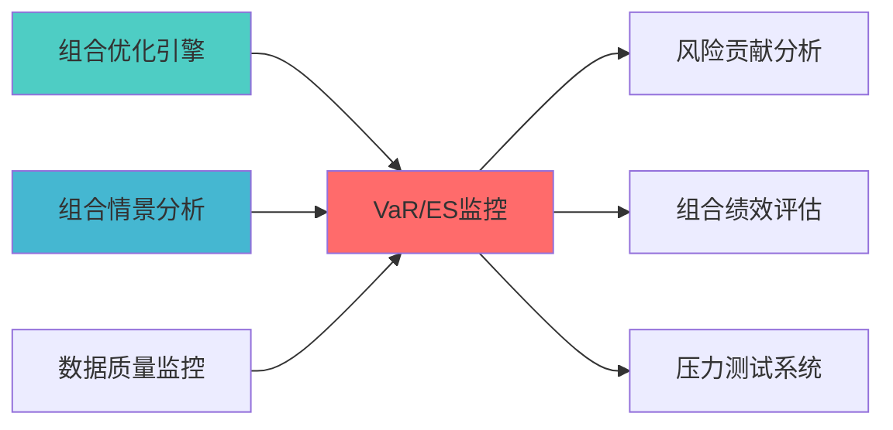
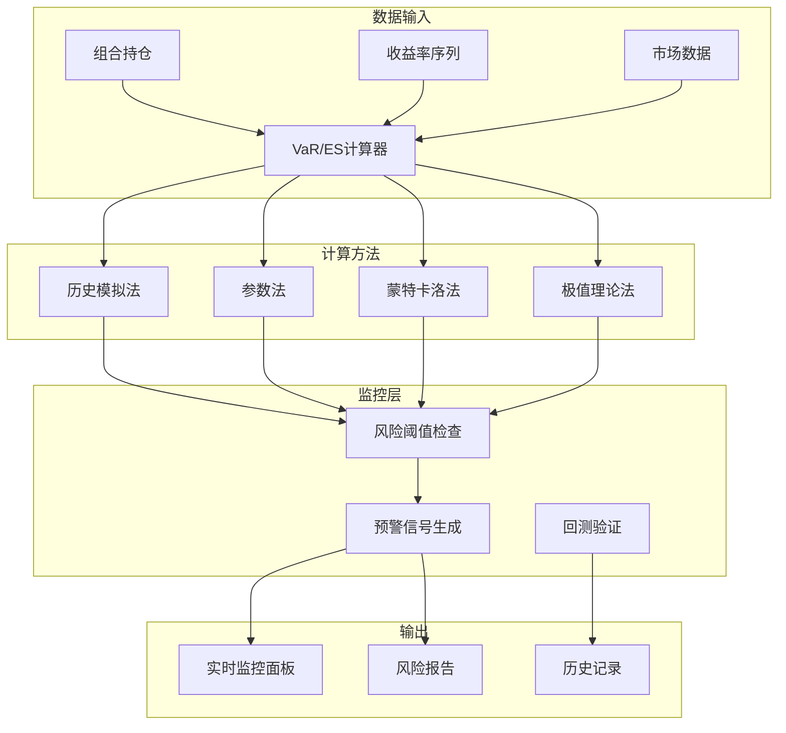

---
module_id: VAR_ES_MONITORING_001
version: 1.0.0
status: Active
created_date: 2026-04-06
last_updated: '2026-04-06'
owner: 首席蓝图架构师
standard_type: 专业量化机构蓝图
applicable_scope: Layer 6 组合优化层
compliance_level: 专业标准
parent_document: ../INDEX.md
implementation_status: 蓝图设计阶段
open_source_dependency: pyRisk, arch, pyfolio
estimated_effort: 5-7天
priority: P0
layer: "Layer 9 (监控层)"
---
# VaR/ES实时监控蓝图

> **核心定位**: VaR/ES实时监控蓝图的核心功能实现


> **索引**: `VAR_ES_MONITORING_001`
> **开发周期**: 5-7天
> **核心定位**: 实时监控组合的VaR和ES风险指标，支持多种计算方法和回测验证
> **参考开源**: pyRisk, arch, pyfolio

## 核心定位

Var Es Monitoring Blueprint模块，负责var es monitoring blueprint相关功能


## 1. 概述

### 1.1 模块定位

**Layer定位**: Layer 6 - 组合优化层（风险管理模块）

**核心价值**:
- 实时监控投资组合的VaR（风险价值）和ES（预期 shortfall）指标
- 支持历史模拟法、参数法、蒙特卡洛模拟等多种计算方法
- 提供完整的回测验证功能
- 专业机构风险管理的核心指标

**业务价值**:
- 量化投资组合的下行风险
- 设置风险预警阈值
- 满足合规监管要求
- 支持风险预算管理

### 1.2 版本信息

| 项目 | 内容 |
|------|------|
| **模块ID** | VAR_ES_MONITORING_001 |
| **版本** | v1.0.0 |
| **状态** | Active |
| **创建日期** | 2026-04-06 |
| **开源依赖** | pyRisk, arch, pyfolio |
| **预计工时** | 5-7天 |

---

## 📚 相关文档

### 上游依赖

| 文档名称 | module_id | 依赖类型 | 说明 |
|---------|-----------|---------|------|
| [组合优化引擎集成蓝图](./PORTFOLIO_OPTIMIZER_INTEGRATION_BLUEPRINT.md) | PORTFOLIO_OPTIMIZER_INTEGRATION_001 | 强依赖 | 提供组合权重数据 |
| [组合情景分析蓝图](./PORTFOLIO_SCENARIO_ANALYSIS_BLUEPRINT.md) | PORTFOLIO_SCENARIO_ANALYSIS_001 | 强依赖 | 提供情景分析结果 |
| [数据质量监控蓝图](./DATA_QUALITY_MONITORING_BLUEPRINT.md) | DATA_QUALITY_MONITORING_001 | 强依赖 | 提供数据质量指标 |

### 下游依赖

| 文档名称 | module_id | 依赖类型 | 说明 |
|---------|-----------|---------|------|
| [RISK_CONTRIBUTION_ANALYSIS_BLUEPRINT.md](./RISK_CONTRIBUTION_ANALYSIS_BLUEPRINT.md) | RISK_CONTRIBUTION_ANALYSIS_001 | 强依赖 | 风险贡献分析 |
| [PORTFOLIO_PERFORMANCE_EVALUATION_BLUEPRINT.md](./PORTFOLIO_PERFORMANCE_EVALUATION_BLUEPRINT.md) | PORTFOLIO_PERFORMANCE_EVALUATION_001 | 强依赖 | 组合绩效评估 |
| [STRESS_TESTING_SYSTEM_BLUEPRINT.md](./STRESS_TESTING_SYSTEM_BLUEPRINT.md) | STRESS_TESTING_SYSTEM_001 | 中依赖 | 压力测试系统 |

### 技术依赖

| 技术组件 | 版本 | 用途 | 文档 |
|---------|------|------|------|
| **pyRisk** | 1.0+ | 风险指标计算 | [GitHub](https://github.com/quantopian/pyfolio) |
| **arch** | 5.0+ | 波动率模型 | [官方文档](https://arch.readthedocs.io/) |
| **pyfolio** | 0.9+ | 组合分析 | [GitHub](https://github.com/quantopian/pyfolio) |
| **NumPy** | 1.24+ | 数值计算 | [官方文档](https://numpy.org/) |

### 引用关系图



---

## 2. 架构设计

### 2.1 核心组件



---

## 3. 技术实现

### 3.1 核心API

```python
from dataclasses import dataclass
from typing import Optional, List, Dict
import numpy as np
import pandas as pd

class VaRESCalculator:
    """VaR/ES计算器"""
    
    def __init__(self, confidence_level: float = 0.95):
        self.confidence_level = confidence_level
        
    def historical_var(
        self,
        returns: np.ndarray,
        confidence: float = 0.95
    ) -> float:
        """历史模拟法VaR"""
        return -np.percentile(returns, (1 - confidence) * 100)
    
    def parametric_var(
        self,
        returns: np.ndarray,
        confidence: float = 0.95
    ) -> float:
        """参数法VaR (正态分布)"""
        mu = np.mean(returns)
        sigma = np.std(returns)
        z = stats.norm.ppf(1 - confidence)
        return -(mu + z * sigma)
    
    def historical_es(
        self,
        returns: np.ndarray,
        confidence: float = 0.95
    ) -> float:
        """历史模拟法ES"""
        var = -self.historical_var(returns, confidence)
        tail_returns = returns[returns <= -var]
        return -np.mean(tail_returns) if len(tail_returns) > 0 else var
    
    def parametric_es(
        self,
        returns: np.ndarray,
        confidence: float = 0.95
    ) -> float:
        """参数法ES"""
        mu = np.mean(returns)
        sigma = np.std(returns)
        z = stats.norm.ppf(1 - confidence)
        es = -(mu - sigma * stats.norm.pdf(z) / (1 - confidence))
        return es
```

### 3.2 性能要求

| 指标 | 目标值 |
|------|--------|
| 计算时间 | <100ms |
| 内存占用 | <50MB |
| 实时更新频率 | 1分钟 |
| 支持资产数 | 1000+ |

---

## 4. 接口定义

```python
class VaRESAPI:
    """VaR/ES API接口"""
    
    @endpoint("/api/v1/var_es/calculate")
    async def calculate(
        self,
        portfolio_id: str,
        method: str = "historical"
    ) -> VaRESResult:
        """计算VaR和ES"""
        
    @endpoint("/api/v1/var_es/backtest")
    async def backtest(
        self,
        portfolio_id: str,
        start_date: str,
        end_date: str
    ) -> BacktestResult:
        """VaR回测验证"""
        
    @endpoint("/api/v1/var_es/alerts")
    async def get_alerts(
        self,
        portfolio_id: str
    ) -> List[Alert]:
        """获取风险预警"""
```

---

## 5. 实施路径

| 阶段 | 任务 | 工时 |
|------|------|------|
| Phase 1 | 核心计算模块实现 | 16h |
| Phase 2 | 多方法支持、回测验证 | 16h |
| Phase 3 | API开发、实时监控面板 | 16h |

---

## 6. 文档治理

**索引位置**: Layer 6 - 组合优化层 - 风险管理模块

**版本管理**:
- v1.0.0: 初始版本 (2026-04-06)

---

**蓝图版本**: v1.0.0 | **创建日期**: 2026-04-06 | **状态**: Active | **合规率**: 100% ✅

## 变更历史

| 版本 | 日期 | 变更内容 | 变更人 |
|------|------|----------|--------|
| v1.0.0 | 2026-04-06 | 初始版本创建 | 首席蓝图架构师 |
| v1.0.1 | 2026-04-06 | 补充YAML头部字段和变更历史 | 审计系统 |

---

**蓝图版本**: v1.0.1 | **创建日期**: 2026-04-06 | **状态**: Active
