---
responsibility:
  - VaR/ES计算
  - �险监�
  - �险预警
  - �险度�

module_id: VAR_ES_MONITORING_001
version: 1.0.0
status: Active
created_date: 2026-04-07
last_updated: 2026-04-07
owner: �施团队
standard_type: 专业�化机��图
applicable_scope: Layer 7 �险管��
compliance_level: 专业标准
layer: "Layer 7 (�险管��"
---

# VaR/ES�时监��图

> **核心�责**: �时监�组�的VaR和ES�险指标
> **�责边界**: 
> - �本文档负责：VaR/ES计算��时监���测验�
> - �本文档�负责：因�计算（由因�模�负责）


## 核心定�

建立VAR ES MONITORING的设计���，基�ELK Stack技术，告警核心功能，预防系统故障�

## 1. 概述

### 1.1 模�定�

**Layer定�**: Layer 6 - 组�优化层（�险管�模��

**核心价�*:
- �时监�投资组�的VaR（�险价值）和ES（预�shortfall）指�
- 支���模拟法��数法�蒙特�洛模拟等多�计算方法
- �供完整的�测验�功�
- 专业机��险管�的核心指�

**业务价�*:
- �化投资组�的下行��
- 设置�险预警阈�
- 满足�规监管�求
- 支��险预算管�

### 1.2 版本信�

| 项目 | 内容 |
|------|------|
| **模�ID** | VAR_ES_MONITORING_001 |
| **版本** | v1.0.0 |
| **状�* | Active |
| **创建日期** | 2026-04-06 |
| **开���* | pyRisk, arch, pyfolio |
| **预计工时** | 5-7�|

---
## 📚 相关文档

### 上游�赖

| 文档�称 | module_id | �赖类� | 说� |
|---------|-----------|---------|------|
| [组�优化引�集��图](./PORTFOLIO_OPTIMIZER_INTEGRATION_BLUEPRINT.md) | PORTFOLIO_OPTIMIZER_INTEGRATION_001 | 强��| �供组���数� |
| [组�情景分��图](./PORTFOLIO_SCENARIO_ANALYSIS_BLUEPRINT.md) | PORTFOLIO_SCENARIO_ANALYSIS_001 | 强��| �供情景分�结� |
| [数�质�监��图](./DATA_QUALITY_MONITORING_BLUEPRINT.md) | DATA_QUALITY_MONITORING_001 | 强��| �供数�质�指标 |

### 下游�赖

| 文档�称 | module_id | �赖类� | 说� |
|---------|-----------|---------|------|
| [RISK_CONTRIBUTION_ANALYSIS_BLUEPRINT.md](./RISK_CONTRIBUTION_ANALYSIS_BLUEPRINT.md) | RISK_CONTRIBUTION_ANALYSIS_001 | 强��| �险贡献分� |
| [PORTFOLIO_PERFORMANCE_EVALUATION_BLUEPRINT.md](./PORTFOLIO_PERFORMANCE_EVALUATION_BLUEPRINT.md) | PORTFOLIO_PERFORMANCE_EVALUATION_001 | 强��| 组�绩效评估 |
| [STRESS_TESTING_SYSTEM_BLUEPRINT.md](./STRESS_TESTING_SYSTEM_BLUEPRINT.md) | STRESS_TESTING_SYSTEM_001 | 中��| �力测试系统 |

### 技术��

| 技术组�| 版本 | 用�| 文档 |
|---------|------|------|------|
| **pyRisk** | 1.0+ | �险指标计算 | [GitHub](https://github.com/quantopian/pyfolio) |
| **arch** | 5.0+ | 波动�模�| [官方文档](https://arch.readthedocs.io/) |
| **pyfolio** | 0.9+ | 组�分� | [GitHub](https://github.com/quantopian/pyfolio) |
| **NumPy** | 1.24+ | 数值计�| [官方文档](https://numpy.org/) |

### 引用关系�

```mermaid
graph LR
    A[组�优化引�] --> B[VaR/ES监�]
    C[组�情景分�] --> B
    D[数�质�监�] --> B
    
    B --> E[�险贡献分�]
    B --> F[组�绩效评估]
    B --> G[�力测试系统]
    
    style B fill:#ff6b6b
    style A fill:#4ecdc4
    style C fill:#45b7d1
```



---

## 2. ��设计

### 2.1 核心组件

```mermaid
graph TB
    subgraph "数�输入"
        A[组��仓] --> D[VaR/ES计算器]
        B[收益��列] --> D
        C[市场数�] --> D
    end
    
    subgraph "计算方法"
        D --> E[��模拟法]
        D --> F[�数法]
        D --> G[蒙特�洛法]
        D --> H[�值�论法]
    end
    
    subgraph "监��
        I[�险阈值检查]
        J[预警信�生�]
        K[�测验�]
    end
    
    subgraph "输出"
        L[�时监���]
        M[�险报告]
        N[��记录]
    end
    
    E --> I
    F --> I
    G --> I
    H --> I
    I --> J
    J --> L
    J --> M
    K --> N
```

---

## 3. 技术��

### 3.1 核心API

```python
from dataclasses import dataclass
from typing import Optional, List, Dict
import numpy as np
import pandas as pd

class VaRESCalculator:
    """VaR/ES计算�""
    
    def __init__(self, confidence_level: float = 0.95):
        self.confidence_level = confidence_level
        
    def historical_var(
        self,
        returns: np.ndarray,
        confidence: float = 0.95
    ) -> float:
        """��模拟法VaR"""
        return -np.percentile(returns, (1 - confidence) * 100)
    
    def parametric_var(
        self,
        returns: np.ndarray,
        confidence: float = 0.95
    ) -> float:
        """�数法VaR (正�分�"""
        mu = np.mean(returns)
        sigma = np.std(returns)
        z = stats.norm.ppf(1 - confidence)
        return -(mu + z * sigma)
    
    def historical_es(
        self,
        returns: np.ndarray,
        confidence: float = 0.95
    ) -> float:
        """��模拟法ES"""
        var = -self.historical_var(returns, confidence)
        tail_returns = returns[returns <= -var]
        return -np.mean(tail_returns) if len(tail_returns) > 0 else var
    
    def parametric_es(
        self,
        returns: np.ndarray,
        confidence: float = 0.95
    ) -> float:
        """�数法ES"""
        mu = np.mean(returns)
        sigma = np.std(returns)
        z = stats.norm.ppf(1 - confidence)
        es = -(mu - sigma * stats.norm.pdf(z) / (1 - confidence))
        return es
```

### 3.2 性能�求

| 指标 | 目标�|
|------|--------|
| 计算时间 | <100ms |
| 内存�用 | <50MB |
| �时更新频� | 1分钟 |
| 支�资产�| 1000+ |

---

## 4. VaR/ES计算方法详解

### 4.1 ��模拟�(Historical Simulation)

**��**: 使用��收益�分布直�估计VaR和ES

**优点**:
- 无需�设收益�分�
- ��肥尾特�
- ��简�直�

**缺点**:
- �赖��数�质�
- 无法预测�端事件
- 样本��求高

```python
class HistoricalVaR:
    """��模拟法VaR计算�""
    
    def __init__(self, confidence_level: float = 0.95):
        self.confidence_level = confidence_level
    
    def calculate_var(
        self,
        returns: np.ndarray,
        portfolio_value: float
    ) -> Tuple[float, float]:
        """
        计算��模拟VaR
        
        �数:
            returns: ��收益���
            portfolio_value: 组�价�
            
        返�:
            (VaR金�, VaR百分�
        """
        var_percentile = np.percentile(
            returns, 
            (1 - self.confidence_level) * 100
        )
        var_value = -var_percentile * portfolio_value
        
        return var_value, -var_percentile
    
    def calculate_es(
        self,
        returns: np.ndarray,
        portfolio_value: float
    ) -> Tuple[float, float]:
        """
        计算��模拟ES (Expected Shortfall)
        
        �数:
            returns: ��收益���
            portfolio_value: 组�价�
            
        返�:
            (ES金�, ES百分�
        """
        var_percentile = np.percentile(
            returns,
            (1 - self.confidence_level) * 100
        )
        
        tail_returns = returns[returns <= var_percentile]
        
        if len(tail_returns) == 0:
            es_percentile = var_percentile
        else:
            es_percentile = np.mean(tail_returns)
        
        es_value = -es_percentile * portfolio_value
        
        return es_value, -es_percentile
```

### 4.2 �数�(Parametric Method)

**��**: �设收益���特定分布（通常为正�分布），使用�数估�

**优点**:
- 计算效��
- 数学�导清晰
- 易�扩展到多资产

**缺点**:
- 分布�设�能���
- 无法��肥尾特�
- 对�端事件估计��

```python
class ParametricVaR:
    """�数法VaR计算�""
    
    def __init__(
        self,
        confidence_level: float = 0.95,
        distribution: str = "normal"
    ):
        self.confidence_level = confidence_level
        self.distribution = distribution
    
    def calculate_var(
        self,
        returns: np.ndarray,
        portfolio_value: float
    ) -> Tuple[float, float]:
        """
        计算�数法VaR
        
        �数:
            returns: 收益���
            portfolio_value: 组�价�
            
        返�:
            (VaR金�, VaR百分�
        """
        mu = np.mean(returns)
        sigma = np.std(returns, ddof=1)
        
        if self.distribution == "normal":
            z_score = stats.norm.ppf(self.confidence_level)
        elif self.distribution == "t":
            df = self._estimate_degrees_of_freedom(returns)
            z_score = stats.t.ppf(self.confidence_level, df)
        
        var_percentile = mu - z_score * sigma
        var_value = -var_percentile * portfolio_value
        
        return var_value, -var_percentile
    
    def calculate_es(
        self,
        returns: np.ndarray,
        portfolio_value: float
    ) -> Tuple[float, float]:
        """
        计算�数法ES
        
        �数:
            returns: 收益���
            portfolio_value: 组�价�
            
        返�:
            (ES金�, ES百分�
        """
        mu = np.mean(returns)
        sigma = np.std(returns, ddof=1)
        
        if self.distribution == "normal":
            z_score = stats.norm.ppf(self.confidence_level)
            es_percentile = mu - sigma * stats.norm.pdf(z_score) / (1 - self.confidence_level)
        elif self.distribution == "t":
            df = self._estimate_degrees_of_freedom(returns)
            z_score = stats.t.ppf(self.confidence_level, df)
            es_percentile = mu - sigma * (df + z_score**2) / (df - 1) * \
                           stats.t.pdf(z_score, df) / (1 - self.confidence_level)
        
        es_value = -es_percentile * portfolio_value
        
        return es_value, -es_percentile
    
    def _estimate_degrees_of_freedom(
        self,
        returns: np.ndarray
    ) -> int:
        """估计t分布自由�""
        kurtosis = stats.kurtosis(returns)
        if kurtosis <= 0:
            return 30
        df = int(6 / kurtosis + 4)
        return max(3, min(df, 30))
```

### 4.3 蒙特�洛模拟�(Monte Carlo Simulation)

**��**: 通过�机模拟生�大�情景，估计VaR和ES

**优点**:
- �活性高
- �处���分�
- �纳入�线性关�

**缺点**:
- 计算�大
- �赖模��设
- 需�大�模拟次�

```python
class MonteCarloVaR:
    """蒙特�洛模拟VaR计算�""
    
    def __init__(
        self,
        confidence_level: float = 0.95,
        n_simulations: int = 10000,
        distribution: str = "student_t"
    ):
        self.confidence_level = confidence_level
        self.n_simulations = n_simulations
        self.distribution = distribution
    
    def calculate_var(
        self,
        returns: pd.DataFrame,
        weights: np.ndarray,
        portfolio_value: float
    ) -> Tuple[float, float]:
        """
        计算蒙特�洛VaR
        
        �数:
            returns: 资产收益�DataFrame
            weights: 组���
            portfolio_value: 组�价�
            
        返�:
            (VaR金�, VaR百分�
        """
        mean_returns = returns.mean().values
        cov_matrix = returns.cov().values
        
        simulated_returns = self._simulate_returns(mean_returns, cov_matrix)
        
        portfolio_returns = simulated_returns @ weights
        
        var_percentile = np.percentile(
            portfolio_returns,
            (1 - self.confidence_level) * 100
        )
        var_value = -var_percentile * portfolio_value
        
        return var_value, -var_percentile
    
    def calculate_es(
        self,
        returns: pd.DataFrame,
        weights: np.ndarray,
        portfolio_value: float
    ) -> Tuple[float, float]:
        """
        计算蒙特�洛ES
        
        �数:
            returns: 资产收益�DataFrame
            weights: 组���
            portfolio_value: 组�价�
            
        返�:
            (ES金�, ES百分�
        """
        mean_returns = returns.mean().values
        cov_matrix = returns.cov().values
        
        simulated_returns = self._simulate_returns(mean_returns, cov_matrix)
        
        portfolio_returns = simulated_returns @ weights
        
        var_percentile = np.percentile(
            portfolio_returns,
            (1 - self.confidence_level) * 100
        )
        
        tail_returns = portfolio_returns[portfolio_returns <= var_percentile]
        es_percentile = np.mean(tail_returns) if len(tail_returns) > 0 else var_percentile
        
        es_value = -es_percentile * portfolio_value
        
        return es_value, -es_percentile
    
    def _simulate_returns(
        self,
        mean: np.ndarray,
        cov: np.ndarray
    ) -> np.ndarray:
        """模拟收益�""
        n_assets = len(mean)
        
        L = np.linalg.cholesky(cov)
        
        if self.distribution == "normal":
            z = np.random.standard_normal((self.n_simulations, n_assets))
        elif self.distribution == "student_t":
            df = 5
            z = np.random.standard_t(df, (self.n_simulations, n_assets))
        
        simulated = z @ L.T + mean
        
        return simulated
```

### 4.4 方法比较�选择

| 方法 | 计算速度 | 准确�| 适用场景 | ��置信�|
|------|----------|--------|----------|------------|
| **��模拟�* | �| �| 数�充足�分布未�| 95%-99% |
| **�数�* | 最�| �| 正�分布�设��| 95%-99% |
| **蒙特�洛** | �| �| ��分布��线�| 95%-99.9% |

---

## 5. 监�指标体系

### 5.1 核心监�指标

| 指标类别 | 指标�称 | 计算方法 | 监�频� | 预警阈�| 说� |
|----------|----------|----------|----------|----------|------|
| **VaR指标** | 1日VaR(95%) | ��模拟�| �时 | -5% | 95%置信度下1日最大��|
| **VaR指标** | 1日VaR(99%) | ��模拟�| �时 | -8% | 99%置信度下1日最大��|
| **VaR指标** | 10日VaR(99%) | �0×1日VaR | �日 | -25% | 99%置信度下10日最大��|
| **ES指标** | 1日ES(95%) | 尾部平��失 | �时 | -7% | 超过VaR的平���|
| **ES指标** | 1日ES(99%) | 尾部平��失 | �时 | -12% | 超过VaR的平���|
| **�测指标** | Kupiec检�| LR统计�| �周 | p<0.05 | VaR模�有效性检�|
| **�测指标** | Christoffersen检�| 独立性检�| �周 | p<0.05 | �破�列独立性检�|
| **�测指标** | �破次数 | �际�失>VaR次数 | �日 | >5% | VaR�破频� |

### 5.2 监�指标计算�

```python
class VaRESMonitor:
    """VaR/ES监��""
    
    def __init__(
        self,
        confidence_levels: List[float] = [0.95, 0.99],
        holding_periods: List[int] = [1, 10]
    ):
        self.confidence_levels = confidence_levels
        self.holding_periods = holding_periods
        self.historical_var = HistoricalVaR()
        self.parametric_var = ParametricVaR()
        self.monte_carlo_var = MonteCarloVaR()
    
    def calculate_all_metrics(
        self,
        returns: np.ndarray,
        portfolio_value: float
    ) -> Dict[str, float]:
        """计算所有监�指�""
        metrics = {}
        
        for conf in self.confidence_levels:
            self.historical_var.confidence_level = conf
            
            var_value, var_pct = self.historical_var.calculate_var(
                returns, portfolio_value
            )
            metrics[f"var_{int(conf*100)}_value"] = var_value
            metrics[f"var_{int(conf*100)}_pct"] = var_pct
            
            es_value, es_pct = self.historical_var.calculate_es(
                returns, portfolio_value
            )
            metrics[f"es_{int(conf*100)}_value"] = es_value
            metrics[f"es_{int(conf*100)}_pct"] = es_pct
        
        for period in self.holding_periods:
            for conf in self.confidence_levels:
                var_1d = metrics[f"var_{int(conf*100)}_pct"]
                var_nd = var_1d * np.sqrt(period)
                metrics[f"var_{period}d_{int(conf*100)}_pct"] = var_nd
        
        return metrics
    
    def check_thresholds(
        self,
        metrics: Dict[str, float],
        thresholds: Dict[str, float]
    ) -> List[Dict[str, Any]]:
        """检查阈值并生�预警"""
        alerts = []
        
        for metric_name, value in metrics.items():
            if metric_name in thresholds:
                threshold = thresholds[metric_name]
                
                if value < threshold:
                    alerts.append({
                        "metric": metric_name,
                        "value": value,
                        "threshold": threshold,
                        "severity": "HIGH" if value < threshold * 1.5 else "MEDIUM",
                        "message": f"{metric_name} 超过阈� {value:.2%} > {threshold:.2%}"
                    })
        
        return alerts
```

### 5.3 �测验�系统

```python
class VaRBacktester:
    """VaR�测验��""
    
    def __init__(self, confidence_level: float = 0.95):
        self.confidence_level = confidence_level
    
    def kupiec_test(
        self,
        actual_returns: np.ndarray,
        var_estimates: np.ndarray
    ) -> Dict[str, float]:
        """
        Kupiec无�件覆盖检�
        
        �数:
            actual_returns: �际收益�
            var_estimates: VaR估计�
            
        返�:
            检验结�字�
        """
        n = len(actual_returns)
        x = np.sum(actual_returns < -var_estimates)
        p = 1 - self.confidence_level
        
        if x == 0 or x == n:
            lr_stat = 0
            p_value = 1.0
        else:
            lr_stat = -2 * (
                x * np.log(p / (x / n)) +
                (n - x) * np.log((1 - p) / (1 - x / n))
            )
            p_value = 1 - stats.chi2.cdf(lr_stat, 1)
        
        return {
            "test_name": "Kupiec Test",
            "n_observations": n,
            "n_breaches": x,
            "expected_breaches": n * p,
            "breach_rate": x / n,
            "expected_rate": p,
            "lr_statistic": lr_stat,
            "p_value": p_value,
            "passed": p_value > 0.05
        }
    
    def christoffersen_test(
        self,
        actual_returns: np.ndarray,
        var_estimates: np.ndarray
    ) -> Dict[str, float]:
        """
        Christoffersen独立性检�
        
        �数:
            actual_returns: �际收益�
            var_estimates: VaR估计�
            
        返�:
            检验结�字�
        """
        breaches = (actual_returns < -var_estimates).astype(int)
        
        n00 = np.sum((breaches[:-1] == 0) & (breaches[1:] == 0))
        n01 = np.sum((breaches[:-1] == 0) & (breaches[1:] == 1))
        n10 = np.sum((breaches[:-1] == 1) & (breaches[1:] == 0))
        n11 = np.sum((breaches[:-1] == 1) & (breaches[1:] == 1))
        
        if n01 + n00 == 0 or n10 + n11 == 0:
            lr_stat = 0
            p_value = 1.0
        else:
            p01 = n01 / (n00 + n01)
            p10 = n10 / (n10 + n11)
            p = (n01 + n11) / (n00 + n01 + n10 + n11)
            
            lr_stat = -2 * (
                (n00 + n01) * np.log(1 - p) + (n10 + n11) * np.log(p) -
                n00 * np.log(1 - p01) - n01 * np.log(p01) -
                n10 * np.log(1 - p10) - n11 * np.log(p10)
            )
            p_value = 1 - stats.chi2.cdf(lr_stat, 1)
        
        return {
            "test_name": "Christoffersen Test",
            "n_00": n00,
            "n_01": n01,
            "n_10": n10,
            "n_11": n11,
            "lr_statistic": lr_stat,
            "p_value": p_value,
            "passed": p_value > 0.05
        }
    
    def generate_backtest_report(
        self,
        actual_returns: np.ndarray,
        var_estimates: np.ndarray
    ) -> Dict[str, Any]:
        """生��测报告"""
        kupiec_result = self.kupiec_test(actual_returns, var_estimates)
        christoffersen_result = self.christoffersen_test(actual_returns, var_estimates)
        
        return {
            "summary": {
                "total_observations": len(actual_returns),
                "total_breaches": kupiec_result["n_breaches"],
                "breach_rate": kupiec_result["breach_rate"],
                "expected_rate": kupiec_result["expected_rate"]
            },
            "kupiec_test": kupiec_result,
            "christoffersen_test": christoffersen_result,
            "overall_passed": kupiec_result["passed"] and christoffersen_result["passed"]
        }
```

### 5.4 �时监���指标

```python
class VaRESMonitorDashboard:
    """VaR/ES�时监���"""
    
    def __init__(self):
        self.monitor = VaRESMonitor()
        self.backtester = VaRBacktester()
    
    def get_dashboard_metrics(
        self,
        portfolio_id: str,
        returns: np.ndarray,
        portfolio_value: float
    ) -> Dict[str, Any]:
        """��监���指标"""
        metrics = self.monitor.calculate_all_metrics(returns, portfolio_value)
        
        thresholds = {
            "var_95_pct": -0.05,
            "var_99_pct": -0.08,
            "es_95_pct": -0.07,
            "es_99_pct": -0.12
        }
        
        alerts = self.monitor.check_thresholds(metrics, thresholds)
        
        return {
            "portfolio_id": portfolio_id,
            "timestamp": datetime.now(),
            "metrics": metrics,
            "alerts": alerts,
            "risk_level": self._calculate_risk_level(metrics, thresholds)
        }
    
    def _calculate_risk_level(
        self,
        metrics: Dict[str, float],
        thresholds: Dict[str, float]
    ) -> str:
        """计算�险等级"""
        breach_count = 0
        
        for metric_name, value in metrics.items():
            if metric_name in thresholds and value < thresholds[metric_name]:
                breach_count += 1
        
        if breach_count >= 3:
            return "HIGH"
        elif breach_count >= 1:
            return "MEDIUM"
        else:
            return "LOW"
```

---

## 6. 性能�求

```python
class VaRESAPI:
    """VaR/ES API��"""
    
    @endpoint("/api/v1/var_es/calculate")
    async def calculate(
        self,
        portfolio_id: str,
        method: str = "historical"
    ) -> VaRESResult:
        """计算VaR和ES"""
        
    @endpoint("/api/v1/var_es/backtest")
    async def backtest(
        self,
        portfolio_id: str,
        start_date: str,
        end_date: str
    ) -> BacktestResult:
        """VaR�测验�"""
        
    @endpoint("/api/v1/var_es/alerts")
    async def get_alerts(
        self,
        portfolio_id: str
    ) -> List[Alert]:
        """���险预警"""
```

---

## 5. �施路径

| 阶段 | 任务 | 工时 |
|------|------|------|
| Phase 1 | 核心计算模��� | 16h |
| Phase 2 | 多方法支���测验�| 16h |
| Phase 3 | API开���时监���| 16h |

---

## 6. 文档治�

**索引�置**: Layer 6 - 组�优化�- �险管�模�

**版本管�**:
- v1.0.0: �始版本 (2026-04-06)

---

**�图版本**: v1.0.0 | **创建日期**: 2026-04-06 | **状�*: Active | **�规�*: 100% �

## �更��

| 版本 | 日期 | �更内容 | �更�|
|------|------|----------|--------|
| v1.0.0 | 2026-04-06 | �始版本创建 | 首席�图���|
| v1.0.1 | 2026-04-06 | 补充YAML头部字段和�更��| 审计系统 |

---

**�图版本**: v1.0.1 | **创建日期**: 2026-04-06 | **状�*: Active
