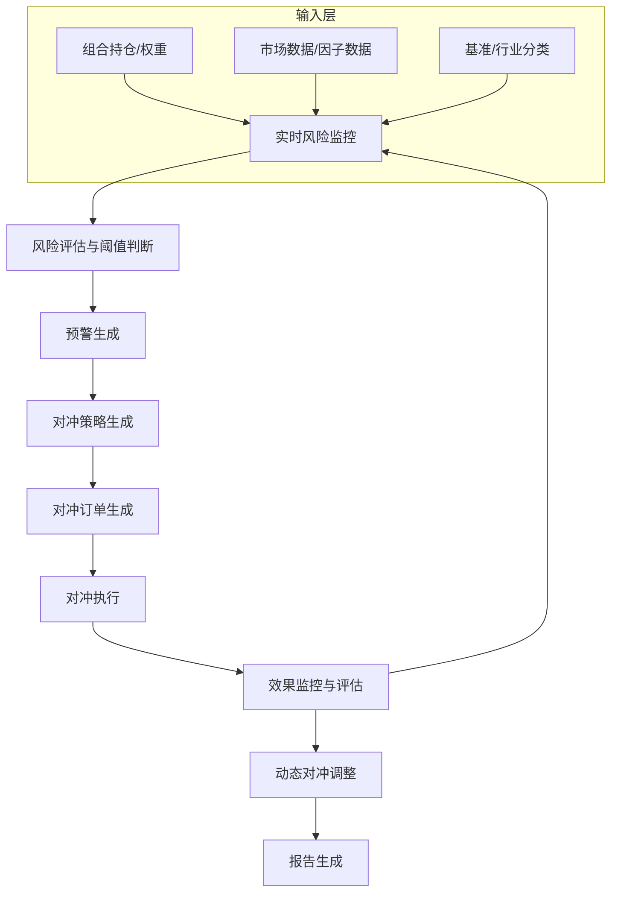

# 实时风险对冲引擎蓝图

## 核心定位


> **职责边界**: 
> - ✅ 本文档负责：实时风险对冲引擎、动态对冲、风险监控
> - ❌ 本文档不负责：其他模块职责（由各模块文档负责）

实时风险对冲引擎，构建和运行和操作动态风险对冲策略，包括Delta对冲、Gamma对冲等，兼容和适配实时风险监控和自动对冲执行。
## 设计目标

### 主要目标

1. **功能完整性**: 确保REALTIME RISK HEDGE ENGINE功能完整，满足业务需求
2. **性能优化**: 提升系统性能，降低资源消耗
3. **可维护性**: 提高代码质量，便于后续维护
4. **可扩展性**: 支持功能扩展，适应业务变化

### 质量目标

- 代码覆盖率: ≥80%
- 性能指标: 满足设计要求
- 文档完整性: 100%


## 核心功能

### 功能清
1. **数据管理**: 提供数据存储、查询、更新功能
2. **业务逻辑**: 实现核心业务逻辑处理
3. **接口服务**: 提供标准化的API接口
4. **监控告警**: 实时监控系统状态

### 功能特性

- 高可用性设计
- 自动故障恢复
- 灵活配置管理


## 实现方案

### 技术架构

采用REALTIME RISK HEDGE ENGINE化设计，分层架构实现。

### 关键技术

- 数据处理: 使用高效的数据处理框架
- 接口实现: RESTful API设计
- 性能优化: 缓存、异步处理

### 实施步骤

1. 需求分析与设计
2. 核心功能开发
3. 测试与优化
4. 部署与监控


> 核心职责: Realtime Risk Hedge Engine蓝图设计
> 职责边界: 

## 1. 模块概述

### 1.1 业务背景与价值主张
**业务需求**:- 当前系统缺乏实时风险对冲能力，无法应对突发市场风险- 组合风险暴露无法实时监控，风险控制滞后- 缺乏自动化的对冲交易生成机制
- 需要实现桥水模式的宏观对冲能力

**价值主张**:- 实时监控组合风险，提前预警风险暴露- 自动生成对冲交易，快速响应市场变化- 降低组合波动 20-50%
- 实现桥水模式的宏观对冲能力
### 1.2 技术定位与架构层归属
**Layer定位**: Layer 5 - 策略执行层（中观策略层）

**模块类别**: 核心模块（P1级）

**架构角色**: 


1. **实时风险监控**: 监控组合风险暴露（Beta、行业、风格）
2. 限时自动预警3. **对冲交易生成**: 自动生成对冲交易建议
4. **动态对冲调整: 根据市场变化动态调整对冲比例5. **对冲效果评估**: 评估对冲效果，持续优化

## 2. 架构设计

### 2.1 系统架构



### 2.2 核心子系统设计
#### 2.2.1 实时风险监控子系统
```python
class RealtimeRiskMonitor:
    """实时风险监控器"""
    
    def __init__(self):
        self.risk_metrics = {
            'beta': BetaMonitor(),           # Beta风险监控
            'sector': SectorMonitor(),       # 行业风险监控
            'style': StyleMonitor(),         # 风格风险监控
            'tail': TailRiskMonitor()        # 尾部风险监控
        }
        
    def monitor_portfolio_risk(
        self,
        portfolio: Portfolio
    ) -> RiskReport:
        """
        实时监控组合风险
        
        监控维度:
况下的风险敞口
        
        输出:
        - RiskReport: 风险报告
          - risk_metrics: 风险指标
          - risk_level: 风险级别（LOW/MEDIUM/HIGH）          - warnings: 风险预警列表
        """
        pass
```

#### 2.2.2 风险评估与预警子系统

```python
class RiskAssessor:
    """风险评估器"""
    
    def __init__(self):
        self.thresholds = {
            'beta_max': 1.2,              # Beta上限
            'sector_concentration': 0.3,  # 行业集中度上限            'style_deviation': 0.5,       # 风格偏离度上限            'var_95': 0.05                # 95% VaR上限
        }
        
    def assess_risk(
        self,
        risk_report: RiskReport
    ) -> RiskAssessment:
        """
        评估风险并生成预警        
        评估逻辑:
        1. 对比风险指标与阈值        2. 计算风险得分
        3. 生成预警信息
        4. 推荐对冲策略
        
        输出:
        - RiskAssessment: 风险评估结果
          - risk_score: 风险得分（0-100）          - risk_level: 风险级别
          - warnings: 预警列表
          - hedge_recommendations: 对冲建议
        """
        pass
```

#### 2.2.3 对冲策略生成子系统
```python
class HedgeStrategyGenerator:
    """对冲策略生成器"""
    
    def __init__(self):
        self.hedge_tools = {
            'index_futures': IndexFuturesHedge(),    # 股指期货对冲
            'etf': ETFHedge(),                       # ETF对冲
            'options': OptionsHedge(),               # 期权对冲
            'sector_rotation': SectorRotationHedge() # 行业轮动对冲
        }
        
    def generate_hedge_strategy(
        self,
        risk_assessment: RiskAssessment,
        portfolio: Portfolio
    ) -> HedgeStrategy:
        """
        生成对冲策略
        
        1. Beta风险: 使用股指期货对冲
        2. 行业风险: 使用行业ETF或期货对冲        3. 风格风险: 使用风格ETF对冲
        4. 尾部风险: 使用期权保护
        
        输出:
        - HedgeStrategy: 对冲策略
          - hedge_ratio: 对冲比例
          - hedge_orders: 对冲订          - expected_cost: 预期成本
        """
        pass
```

#### 2.2.4 Beta对冲实现

```python
class BetaHedge:
    """Beta对冲"""
    
    def __init__(self):
        self.beta_model = BetaModel()
        
    def calculate_hedge_ratio(
        self,
        portfolio: Portfolio,
        target_beta: float = 0.0
    ) -> float:
        """
        计算Beta对冲比例
        
        
        Hedge Ratio = (Current Beta - Target Beta) / Futures Beta
        
        参数:
        - portfolio: 当前组合
        - target_beta: 目标Beta（通常为 0 或接近 0）        
        输出:
        - hedge_ratio: 对冲比例（期货合约数量）
        """
        current_beta = self.beta_model.calculate_beta(portfolio)
        futures_beta = 1.0  # 股指期货Beta约为1
        
        hedge_ratio = (current_beta - target_beta) / futures_beta
        
        return hedge_ratio
```


## 3. 接口定义

### 3.1 核心API接口

#### 3.1.1 风险监控接口

```python
def monitor_realtime_risk(
    portfolio_id: str
) -> RealtimeRiskReport:
    """
    实时风险监控
    
    参数:
    - portfolio_id: 组合ID
    
    返回:
    - RealtimeRiskReport: 实时风险报告
      - beta: 组合Beta
      - sector_exposure: 行业暴露
      - style_exposure: 风格暴露
      - var_95: 95% VaR
      - risk_level: 风险级别
      - timestamp: 时间戳
+    """
    pass
```

#### 3.1.2 风险预警接口

```python
def generate_risk_warning(
    portfolio_id: str,
    risk_thresholds: Dict[str, float]
) -> RiskWarning:
    """
    生成风险预警
    
    参数:
    - portfolio_id: 组合ID
    返回:
    - RiskWarning: 风险预警
      - warning_level: 预警级别（GREEN/YELLOW/RED）      - risk_items: 风险项列表      - recommendations: 对冲建议
      - timestamp: 时间戳
+    """
    pass
```

#### 3.1.3 对冲交易生成接口

```python
def generate_hedge_orders(
    portfolio_id: str,
    risk_assessment: RiskAssessment
) -> List[HedgeOrder]:
    """
    生成对冲订    
    参数:
    - portfolio_id: 组合ID
    - risk_assessment: 风险评估结果
    
    返回:
    - List[HedgeOrder]: 对冲订单列表
      - order_id: 订单ID
      - symbol: 标的代码
      - direction: 方向（BUY/SELL）      - quantity: 数量
      - order_type: 订单类型
      - hedge_reason: 对冲原因
    """
    pass
```

### 3.2 数据格式定义

#### 3.2.1 风险报告数据格式

```python
@dataclass
class RealtimeRiskReport:
    portfolio_id: str                # 组合ID
    beta: float                      # 组合Beta
    sector_exposure: Dict[str, float]  # 行业暴露
    style_exposure: Dict[str, float]   # 风格暴露
    var_95: float                    # 95% VaR
    var_99: float                    # 99% VaR
    max_drawdown: float              # 最大回撤
    risk_level: str                  # 风险级别
    timestamp: datetime              # 时间戳
```

#### 3.2.2 对冲订单数据格式

```python
@dataclass
class HedgeOrder:
    order_id: str                    # 订单ID
    portfolio_id: str                # 组合ID
    symbol: str                      # 标的代码
    direction: str                   # 方向（BUY/SELL）
    quantity: int                    # 数量
    hedge_ratio: float               # 对冲比例
    hedge_reason: str                # 对冲原因
    expected_cost: float             # 预期成本
    timestamp: datetime              # 时间戳
```


## 4. 数据模型与存储
### 4.1 数据存储设计

#### 4.1.1 风险监控记录表
```sql
CREATE TABLE risk_monitoring_records (
    record_id VARCHAR(50) PRIMARY KEY,
    portfolio_id VARCHAR(50) NOT NULL,
    beta DECIMAL(10, 6),
    var_95 DECIMAL(10, 6),
    var_99 DECIMAL(10, 6),
    max_drawdown DECIMAL(10, 6),
    risk_level VARCHAR(20) NOT NULL,
    sector_exposure JSON,
    style_exposure JSON,
    monitor_time TIMESTAMP NOT NULL,
    created_at TIMESTAMP DEFAULT CURRENT_TIMESTAMP,
    INDEX idx_portfolio_id (portfolio_id),
    INDEX idx_monitor_time (monitor_time)
);
```

#### 4.1.2 风险预警记录表
```sql
CREATE TABLE risk_warnings (
    warning_id VARCHAR(50) PRIMARY KEY,
    portfolio_id VARCHAR(50) NOT NULL,
    warning_level VARCHAR(20) NOT NULL,
    risk_items JSON NOT NULL,
    recommendations JSON,
    warning_time TIMESTAMP NOT NULL,
    is_handled BOOLEAN DEFAULT FALSE,
    handled_time TIMESTAMP,
    created_at TIMESTAMP DEFAULT CURRENT_TIMESTAMP,
    INDEX idx_portfolio_id (portfolio_id),
    INDEX idx_warning_time (warning_time)
);
```

#### 4.1.3 对冲交易记录表
```sql
CREATE TABLE hedge_transactions (
    transaction_id VARCHAR(50) PRIMARY KEY,
    portfolio_id VARCHAR(50) NOT NULL,
    warning_id VARCHAR(50),
    hedge_tool VARCHAR(50) NOT NULL,
    hedge_ratio DECIMAL(10, 6) NOT NULL,
    symbol VARCHAR(20) NOT NULL,
    direction VARCHAR(10) NOT NULL,
    quantity INT NOT NULL,
    execution_price DECIMAL(10, 4),
    execution_cost DECIMAL(15, 4),
    execution_time TIMESTAMP,
    status VARCHAR(20) NOT NULL,
    created_at TIMESTAMP DEFAULT CURRENT_TIMESTAMP,
    FOREIGN KEY (warning_id) REFERENCES risk_warnings(warning_id),
    INDEX idx_portfolio_id (portfolio_id),
    INDEX idx_execution_time (execution_time)
);
```

### 4.2 数据流设计
```
组合数据 → 风险计算 → 风险评估 → 预警生成 → 对冲策略 → 订单生成
    ↓          ↓          ↓          ↓          ↓          ↓ 位置数据   风险指标   风险得分   预警记录   对冲建议   对冲订    对冲执行 → 效果监控 → 动态调整 → 报告生成
    ↓          ↓          ↓          ↓ 成交记录   效果评估   调整建议   对冲报告
```


## 5. 算法实现说明

### 5.1 Beta风险监控算法

#### 5.1.1 算法原理

**数学模型**:
```
Portfolio Beta = (w_i * _i)
```


#### 5.1.2 Beta计算方法

```python
def calculate_portfolio_beta(
    portfolio: Portfolio,
    benchmark: str = '000300.SH'
) -> float:
    """
    计算组合Beta
    
    方法: 回归    
    步骤:
    1. 获取组合中所有股票的Beta系数
    2. 按权重加权求和    3. 返回组合Beta
    
    返回:
    - portfolio_beta: 组合Beta
    """
    portfolio_beta = 0.0
    
    for position in portfolio.positions:
        stock_beta = get_stock_beta(position.symbol, benchmark)
        weight = position.market_value / portfolio.total_value
        portfolio_beta += weight * stock_beta
    
    return portfolio_beta
```

#### 5.1.3 复杂度分析
- **时间复杂度**: O(N)，N为组合股票数
- **空间复杂度**: O(N)
- **计算复杂度: 低，适合实时计算

### 5.2 行业风险监控算法

#### 5.2.1 算法原理

**数学模型**:
```
行业集中度 = max(w_sector_i)
行业偏离度 = Σ|w_sector_i - w_benchmark_i|
```


#### 5.2.2 行业暴露计算方法

```python
def calculate_sector_exposure(
    portfolio: Portfolio,
    benchmark_weights: Dict[str, float]
) -> Dict[str, float]:
    """
    计算行业暴露
    
    步骤:
    1. 获取所有股票的行业分类
    2. 计算组合在各行业的权重    3. 计算相对基准的偏离度
    
    返回:
    """
    sector_weights = {}
    
    for position in portfolio.positions:
        sector = get_stock_sector(position.symbol)
        weight = position.market_value / portfolio.total_value
        
        if sector not in sector_weights:
            sector_weights[sector] = 0.0
        sector_weights[sector] += weight
    
    sector_exposure = {}
    for sector, weight in sector_weights.items():
        benchmark_weight = benchmark_weights.get(sector, 0.0)
        sector_exposure[sector] = weight - benchmark_weight
    
    return sector_exposure
```

### 5.3 对冲比例计算算法

#### 5.3.1 算法原理

**数学模型**:
```
Hedge Ratio = Risk Exposure / Hedge Tool Sensitivity
```

#### 5.3.2 Beta对冲比例计算

```python
def calculate_beta_hedge_ratio(
    portfolio_beta: float,
    target_beta: float,
    portfolio_value: float,
    futures_multiplier: int,
    futures_price: float
) -> int:
    """
    计算Beta对冲需要的期货合约数量
    
    
    Contracts = (Portfolio Beta - Target Beta) * Portfolio Value / (Futures Price * Multiplier)
    
    参数:
    - portfolio_beta: 当前组合Beta
    - target_beta: 目标Beta
    - futures_price: 期货价格
    
    返回:
    - contracts: 期货合约数量（取整）
    """
    beta_gap = portfolio_beta - target_beta
    hedge_value = beta_gap * portfolio_value
    contract_value = futures_price * futures_multiplier
    
    contracts = int(hedge_value / contract_value)
    
    return contracts
```


## 6. 实施技术栈

### 6.1 语言与框架
|------|----------|----------|------|
| **编程语言** | Python | 3.9+ | 核心开发语言 |
置 | 异步监控支持 |
| **数值计算 | numpy | 1.24+ | 数值计算|
| **数据处理** | pandas | 2.0+ | 数据处理和分析|

### 6.2 第三方依赖
|--------|------|------|
| scipy | 1.11+ | 统计计算 |
| scikit-learn | 1.3+ | 机器学习模型 |

### 6.3 环境要求

| 环境 | 要求 |
|------|------|
| **操作系统** | Windows 10+ / Linux |
| **Python版本** | 3.9+ |
| **内存** | 16GB |
| **存储** | 50GB |


## 7. 测试策略


```python
class TestRealtimeRiskMonitor:
    
    def test_beta_calculation(self):
        """测试Beta计算"""
        pass
    
    def test_sector_exposure_calculation(self):
        """测试行业暴露计算"""
        pass
    
    def test_risk_warning_generation(self):
        """测试风险预警生成"""
        pass
```

### 7.2 集成测试

```python
class TestRiskHedgeEngine:
    """风险对冲引擎集成测试"""
    
    def test_end_to_end_hedge(self):
        """测试端到端对冲流程"""
        pass
    
    def test_dynamic_adjustment(self):
        """测试动态调整"""
        pass
    
    def test_hedge_effect_evaluation(self):
        """测试对冲效果评估"""
        pass
```

### 7.3 性能测试

| 测试场景 | 性能指标 | 目标值 |
|----------|----------|--------|
| **风险计算速度** | 单次计算 | <100ms |
| **预警响应时间** | 预警生成 | <1s|
| **并发监控能力** | 同时监控组合数 | **实施期压测核定**；蓝图目标下限 **≥24** 组合 |


## 8. 风险与约束
### 8.1 技术风险
| 风险ID | 风险描述 | 影响程度 | 缓解措施 |
|--------|----------|----------|----------|
| TR-001 | Beta计算不准确 | 中 | 使用多种数据源，定期校准 |
| TR-002 | 对冲执行滑点过大 | 中 | 拆分下单、限制冲击成本、监控成交偏离 |
| TR-003 | 对冲成本过高 | 中 | 优化对冲比例，控制成本 |

### 8.2 实施约束

| 约束类型 | 约束描述 | 影响 |
|----------|----------|------|
| **数据约束** | 需要市场数据和 Beta 数据 | 需要数据源支持 |
| **时间约束** | 开发时间 100 小时 | 需要合理规划|
| **资源约束** | 个人开发，资源有限 | 采用简化方案|


## 9. 验收标准

### 9.1 功能验收标准

| 功能 | 验收标准 | 测试方法 |
|------|----------|----------|
| **风险监控** | 能够实时监控组合风险 | 集成测试 |
2. 限时自动预警| 集成测试 |
| **对冲生成** | 能够自动生成对冲订单 | 集成测试 |

### 9.2 性能验收标准

| 指标 | 目标值 | 验收方法 |
|------|--------|----------|
| **风险计算速度** | <100ms | 性能测试 |
| **预警响应时间** | <1s | 性能测试 |
| **对冲效果** | 降低波动 20-50% | 回测验证 |

### 9.3 质量验收标准

| 标准 | 要求 | 验收方法 |
|------|------|----------|
| **代码覆盖率** | 90% | pytest-cov |
| **文档完整性** | 100% | 文档审查 |
| **代码规范** | 符合PEP8 | pylint |


## 10. 实施路线
### 10.1 Phase 1: 风险监控系统实现（1周）

**目标**: 实现实时风险监控

**任务清单**:
1. 设计风险指标体系
2. 实现Beta风险监控
3. 实现行业风险监控
4. 实现风格风险监控

**交付物**:
- 风险监控实现代码
- 技术文档
### 10.2 Phase 2: 预警和对冲系统实现（1周）

**目标**: 实现风险预警和对冲交易生成
**任务清单**:
1. 实现风险评估和预警
2. 实现Beta对冲策略
3. 实现行业对冲策略
5. 性能优化

**交付物**:

### 10.3 Phase 3: 高级功能实现（可选）

**目标**: 实现动态调整和效果评估

**任务清单**:
1. 📝 实现动态对冲调整
2. 📝 实现对冲效果评估
**交付物**:
- 高级功能实现代码
- 性能评估报告


### 11.1 架构文档

- PROFESSIONAL_MULTI_TIMEFRAME_ARCHITECTURE.md


- ECONOMIC_REGIME_ENGINE_BLUEPRINT.md - 经济范式判断引擎
- ALL_WEATHER_OPTIMIZER_BLUEPRINT.md - 


**蓝图编写**: 首席架构师  
**蓝图日期**: 2026-04-02


**文档结束**

## 接口与契约（蓝图终稿）

本模块遵循系统统一接口规范，详见 `API_Contract.md`。

## 验收标准（可检查）

- 在至少 1 个模拟环境中可跑通闭环：风险暴露计算→阈值判断→生成对冲建议→生成对冲订单草案（或等价指令），并可追溯。
- 关键风险指标（如 Beta/行业/风格暴露）计算口径明确，可用样例数据验证输出字段与单位。
- 对冲效果评估输出可检查：至少包含预期风险降低幅度/成本估计/执行约束提示等字段（或在“已知限制”声明暂缺）。

## 已知限制

- 对冲效果高度依赖市场冲击/滑点模型与执行能力；实施阶段需联动交易执行模块压测与回归，并回填契约真源字段字典。

## 变更历史

|------|------|----------|--------|


## 12. 文档治理

### 12.1 System_Manifest.md索引

```markdown
##### 6.001. Realtime Risk Hedge Engine
- **模块ID**: REALTIME_RISK_HEDGE_ENGINE_001
- **蓝图文档**: REALTIME_RISK_HEDGE_ENGINE_BLUEPRINT.md
```

### 12.2 模块职责边界

| 模块 | 职责 | 边界 |
|------|------|------|
| **Realtime Risk Hedge Engine** | 

### 12.3 版本管理

|------|------|----------|--------|


```
