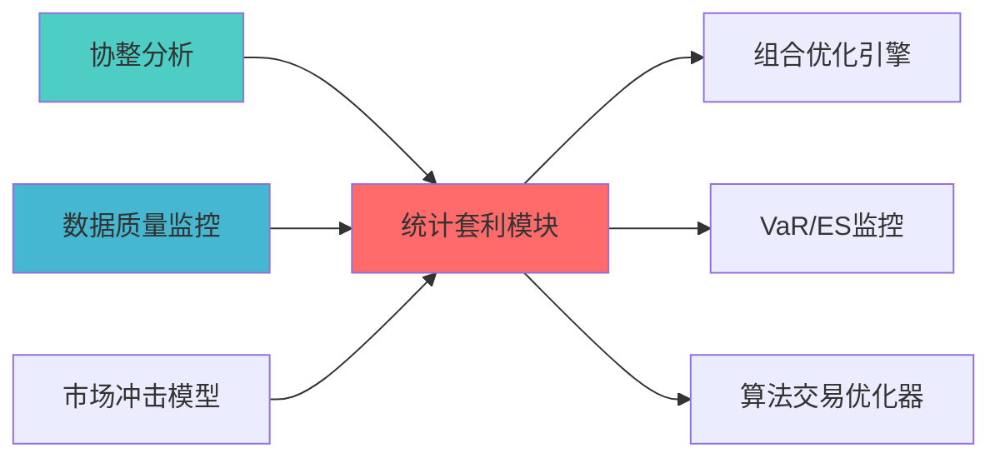

## 核心定位

负责统计套利模块的设计与构建和运行和操作，基于统计套利策略，识别套利机会，生成和输出交易信号和风险控制，兼容和适配策略执行。

# 统计套利模块蓝图

> **职责边界**:
## 设计目标

### 主要目标

1. **功能完整性**: 确保STATISTICAL ARBITRAGE MODULE功能完整，满足业务需求
2. **性能优化**: 提升系统性能，降低资源消耗
3. **可维护性**: 提高代码质量，便于后续维护
4. **可扩展性**: 支持功能扩展，适应业务变化

### 质量目标

- 代码覆盖率: ≥80%
- 性能指标: 满足设计要求
- 文档完整性: 100%


## 核心功能

### 功能清单

1. **数据管理**: 提供数据存储、查询、更新功能
2. **业务逻辑**: 实现核心业务逻辑处理
3. **接口服务**: 提供标准化的API接口
4. **监控告警**: 实时监控系统状态

### 功能特性

- 高可用性设计
- 自动故障恢复
- 灵活配置管理


## 实现方案

### 技术架构

采用STATISTICAL ARBITRAGE MODULE化设计，分层架构实现。

### 关键技术

- 数据处理: 使用高效的数据处理框架
- 接口实现: RESTful API设计
- 性能优化: 缓存、异步处理

### 实施步骤

1. 需求分析与设计
2. 核心功能开发
3. 测试与优化
4. 部署与监控


> 核心职责: Statistical Arbitrage Module蓝图设计
> 职责边界: 

## 2. 架构设计

### 2.1 系统架构
```

### 2.2 核心子系统设计
#### 2.2.1
```python
class PairSelectionEngine:
"""
    
    def __init__(self):
    def select_pairs(
        self, 
        price_data: pd.DataFrame,
        stock_pool: List[str]
    ) -> List[CandidatePair]:
        """
        选择候选股票对
        
        步骤:
        Returns:
            List[CandidatePair]: 候选股票对列表
        """
        pass


class CointegrationAnalyzer:
    """协整分析器"""
    
    def __init__(self):
        self.adf_critical_value = 0.05  # ADF检验临界值 self.min_half_life = 5          # 最小半衰期（天）        self.max_half_life = 60         # 最大半衰期（天）        
    def test_cointegration(
        self, 
        series_a: pd.Series,
        series_b: pd.Series
    ) -> CointegrationResult:
        """
        协整检查        
        使用 Engle-Granger 两步法：
        1. 对价格序列进行线性回归        2. 对残差序列进行ADF检查        3. 计算半衰期        
        Returns:
            CointegrationResult: 
        """
        pass
```

#### 2.2.2 价差交易与信号生成子系统
```python
class SpreadTradingEngine:
    """价差交易引擎"""
    
    def __init__(self):
        self.entry_zscore = 2.0   # 开仓 Z-score self.exit_zscore = 0.5    # 平仓 Z-score self.stop_loss = 0.05     # 止损比例
        
    def generate_signal(
        self,
        price_a: pd.Series,
        price_b: pd.Series,
        hedge_ratio: float
    ) -> TradingSignal:
        """
        生成交易信号
        
        基于 Z-score 的价差交易策略：
        1. 计算价差: spread = price_a - hedge_ratio * price_b
        2. 计算Z-score: z = (spread - mean) / std
        3. 生成信号:
           - z > 2: 做空价差（做空A，做多B）           - z < -2: 做多价差（做多A，做空B）           - |z| < 0.5: 平仓
        
        Returns:
            TradingSignal: 
包含信号类型、Z-score、仓位比例        """
        pass


class SignalQualityFilter:
    """信号质量过滤器"""
    
    def __init__(self):
        self.min_signal_strength = 0.5  # 最小信号强度        self.max_signals_per_day = 20   # 每日最大信号数
        
    def filter_signals(
        self, 
        signals: List[TradingSignal]
    ) -> List[TradingSignal]:
        """
        过滤低质量信号        
        过滤标准:
        1. 信号强度（Z-score绝对值）
        """
        pass
```

#### 2.2.3 市场中性组合构建子系统
```python
class MarketNeutralPortfolioConstructor:
    """市场中性组合构建器"""
    
    def __init__(self):
        self.industry_neutral = True   # 行业中性        self.style_neutral = True      # 风格中性        self.max_leverage = 2.0        # 最大杠杆        
    def construct_portfolio(
        self,
        signals: List[TradingSignal],
        constraints: PortfolioConstraints
    ) -> PortfolioAllocation:
        """
        构建市场中性组合        
        步骤:
        1. 多空优化：优化多空头寸        2. 行业中性：确保行业暴露为零
        3. 风格中性：确保风格因子暴露为零
        4. 杠杆控制：限制总杠杆        
        Returns:
            PortfolioAllocation: 
包含多空头寸、净敞口、总敞口        """
        pass


class IndustryNeutralizer:
    """行业中性化器"""
    
    def neutralize(
        self, 
        allocation: PortfolioAllocation,
        industry_data: pd.DataFrame
    ) -> PortfolioAllocation:
        """
        行业中性化
        
        确保组合在各行业的暴露为 0：
w_long_i - w_short_i = 0 (for each industry)
        """
        pass


class StyleNeutralizer:
    """风格中性化器"""
    
    def neutralize(
        self, 
        allocation: PortfolioAllocation,
        style_factors: pd.DataFrame
    ) -> PortfolioAllocation:
        """
        风格中性化
        
        确保组合在各风格因子的暴露为 0：
w_i * factor_i = 0 (for each factor)
        """
        pass
```

#### 2.2.4 风险管理与监控子系统
```python
class RiskManager:
    """风险管理器"""
    
    def __init__(self):
    def apply_risk_controls(
        self, 
        allocation: PortfolioAllocation
    ) -> PortfolioAllocation:
        """
        应用风险控制
        
        控制措施:
        2. 总仓位限制        3. 止损机制
        4. 流动性约束        """
        pass


class RealTimeMonitor:
    """实时监控器"""
    
    def monitor_positions(
        self, 
        positions: Dict[str, Position]
    ) -> MonitoringReport:
        """
        实时监控持仓
        
        监控指标:
        """
        pass
```


## 3. 核心功能详细设计

### 3.1 协整检验算法
```
步骤:
1. 线性回归   - 对价格序列进行OLS回归: y = α + βx + ε
   - 计算对冲比例β

2. ADF 检查   - 对残差序列ε进行ADF检查   - 检验残差的平稳性
3. 半衰期计划   - 计算价差的半衰期
   - 半衰期 = -ln(2) / λ
   - λ为均值回归速度参数

4. 协整判断
   - 如果 ADF 检验 p < 0.05
   - 且半衰期在合理范围（5-60天）
时间复杂度 O(T)，T 为时间序列长度  
空间复杂度 O(T)
```

### 3.2 价差交易算法

```text
步骤:
1. 计算价差
   spread = price_a - hedge_ratio * price_b

2. 计算Z-score
   z = (spread - mean) / std

3. 生成信号
   if z > entry_zscore:
       signal = SHORT_SPREAD  # 做空价差
   elif z < -entry_zscore:
       signal = LONG_SPREAD   # 做多价差
   elif abs(z) < exit_zscore:
       signal = CLOSE_POSITION  # 平仓
   else:
       signal = HOLD  # 持有

4. 计算仓位比例
   position_ratio = min(abs(z) / entry_zscore, 2.0)

时间复杂度 O(T)  
空间复杂度 O(T)
```

### 3.3 市场中性组合构建算法

```text
步骤:
1. 多空头寸优化
   - 最大化预期收益
   - 约束：净敞口 = 0

2. 行业中性化
   - 计算各行业暴露
   - 调整权重使行业暴露接近 0

3. 风格中性化
   - 计算各风格因子暴露
   - 调整权重使风格暴露接近 0

4. 杠杆控制
   - 限制总杠杆不超过 max_leverage
   - 调整仓位比例

时间复杂度 O(N^2)，N 为股票数量
空间复杂度 O(N)
```

## 4. 数据流设计

### 4.1 数据输入

- **基本面数据**：财务指标、行业分类等。
- **因子数据**：风格因子、行业因子等。

### 4.2 数据输出

- **交易与风控信号**：经统计套利流水线过滤与风险调整后的目标仓位或执行指令。

### 4.3 数据流图（示意）

```text
基本面数据 → 行业/风格标签 → 组合优化 / 风险控制
因子数据 → 信号过滤 → 风险调整 → 仓位管理 → 执行指令
```


## 5. 接口设计

### 5.1 对外接口
```python
class StatisticalArbitrageModule:
    """统计套利模块主接口""
    
    def find_cointegrated_pairs(
        self, 
        price_data: pd.DataFrame,
        stock_pool: Optional[List[str]] = None
    ) -> List[CointegratedPair]:
        """
        寻找协整股票对        
        Returns:
            List[CointegratedPair]: 协整股票对列表        """
        pass
    
    def generate_trading_signals(
        self,
        price_data: pd.DataFrame,
        pairs: List[CointegratedPair]
    ) -> List[PairTradingSignal]:
        """
        生成交易信号
        
        Returns:
            List[PairTradingSignal]: 交易信号列表
        """
        pass
    
    def construct_neutral_portfolio(
        self,
        signals: List[PairTradingSignal],
        constraints: Optional[PortfolioConstraints] = None
    ) -> PortfolioAllocation:
        """
        构建市场中性组合。
        
        Returns:
            PortfolioAllocation: 组合配置结果
        """
        pass
    
    def run_full_pipeline(
        self,
        price_data: pd.DataFrame,
        stock_pool: Optional[List[str]] = None
    ) -> Tuple[List[CointegratedPair], List[PairTradingSignal], PortfolioAllocation]:
        """
        运行完整流程（协整检验 → 信号 → 组合构建）。
        
        Returns:
            协整对、信号与组合配置元组
        """
        pass
```

### 5.2 配置说明
```yaml
statistical_arbitrage:
  pair_selection:
    cointegration:
      adf_critical_value: 0.05
      min_half_life: 5
      max_half_life: 60
  spread_trading:
    entry_zscore: 2.0
    exit_zscore: 0.5
    stop_loss: 0.05
  market_neutral:
    industry_neutral: true
    style_neutral: true
    max_leverage: 2.0
  risk_control: {}
```


## 6. 风险管理

### 6.1 风险识别
| 风险类型 | 风险等级 | 影响范围 | 缓解措施 |
|----------|----------|----------|----------|
| 市场冲击成本 | P2 | 交易执行 | 交易量限制、分批建仓 |
| 模型过拟合 | P2 | 信号质量 | 样本外测试、交叉验证 |
| 流动性风险 | P1 | 交易执行 | 流动性筛选、仓位限制 |

### 6.2 风险控制措施


## 7. 实施计划

### 7.1 Phase 1: 基础能力
- Day 4-5: 协整检验算法实现- Day 6-7: 价差交易策略实现

### 7.2 Phase 2: 市场中性组合构建（Week 3-4）
- Day 1-3: 多空优化算法实现
- Day 4-5: 行业中性化实现
- Day 6-7: 风格中性化实现

### 7.3 Phase 3: 信号生成与风险管理（Week 5-6）
- Day 1-3: 信号生成模块实现
- Day 4-5: 风险控制模块实现
- Day 6-7: 实时监控模块实现

### 7.4 Phase 4: 集成与测试（Week 7-8）
- Day 1-3: 系统集成


## 8. 验收标准

### 8.1 功能验收
- 能够构建市场中性组合
- 能够生成统计套利信号

### 8.2 性能验收
- 端到端回测（万级 Bar、单策略）单次全流程 **≤ 30min**（个人开发机基线；GPU/集群另评）
- 信号胜率 ≥ 55%
- 组合夏普比率 ≥ 1.5
- 最大回撤 ≤ 10%

### 8.3 质量验收
- 代码覆盖率 ≥ 80%
- 文档完整率 ≥ 95%
- 架构合规度 100%


### 上游依赖

| 文档名称 | module_id | 依赖类型 | 说明 |
|---------|-----------|---------|------|

### 下游依赖

| 文档名称 | module_id | 依赖类型 | 说明 |
|---------|-----------|---------|------|


|---------|------|------|------|
| **statsmodels** | 0.14+ | 统计建模 | [官方文档](https://www.statsmodels.org/) |
| **SciPy** | 1.10+ | 科学计算 | [官方文档](https://scipy.org/) |
| **Pandas** | 2.0+ | 数据处理 | [官方文档](https://pandas.pydata.org/) |





### 9.1 上游依赖
数据
- Layer 5 策略层：提供策略信号

### 9.2 下游依赖
- Layer 7 AI报告层：接收套利报告
- Layer 8 执行层：执行交易指令

### 9.3 外部依赖
- cvxpy库：组合优化


## 10. 

|--------|------|--------|----------|
| **M1:
| **M4: 测试通过** | Week 8 | 测试报告 | 所有测试通过 |


## 11. 变更历史

|------|------|----------|--------|
| v1.0.0 | 2026-04-02 | 初始版本创建 | 组合优化层负责人 |

## 接口与契约（蓝图终稿）

- **契约真源**：`API_Contract.md`
- **对外接口边界**：本模块对外提供统计套利信号/诊断输出与状态查询能力；不直接执行交易，不替代风控对套利约束口径的最终裁决。

## 验收标准（可检查）

- 在给定历史数据输入时，能够输出可复核的套利信号与关键诊断指标，并记录输入窗口/参数/版本信息以便追溯。

## 已知限制

- 模型稳定性与样本外表现受市场状态影响；实施阶段需在契约真源或子契约中固化回测验证方法、漂移监控与降级策略。


## 12. 文档治理

### 12.1 System_Manifest.md索引

```markdown
##### 6.001. Statistical Arbitrage Module
- **模块ID**: STATISTICAL_ARBITRAGE_MODULE_001
- **蓝图文档**: STATISTICAL_ARBITRAGE_MODULE_BLUEPRINT.md
```

### 12.2 模块职责边界

| 模块 | 职责 | 边界 |
|------|------|------|
| **Statistical Arbitrage Module** | 

### 12.3 版本管理

|------|------|----------|--------|


```
