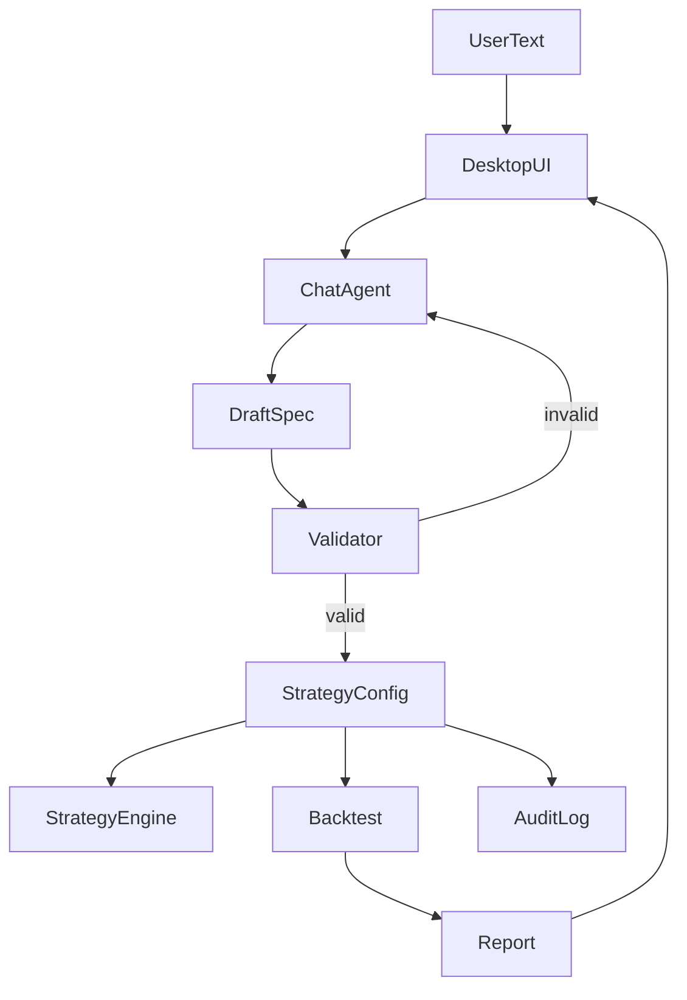

# 策略编写助手（文字/对话 → 策略配置）蓝图

> **核心职责**：让非编程用户用“文字/对话”表达策略经验，系统在 **Schema 约束** 下生成 **可执行策略配置（JSON/YAML）**，并可一键触发回测与报告。

>

> **职责边界**：  

> - ✅ 本文档负责：意图收集、澄清问答、结构化落盘（DraftSpec/StrategyConfig）、静态校验、版本化与审计字段落盘。  

> - ❌ 本文档不负责：策略真实收益承诺、数据拉取与清洗实现、撮合与成交仿真细节、绩效指标计算实现（分别由数据/回测/评估模块负责）。

## 1. 设计目标（面向“小白可用”）

1. **低门槛输入**：支持自然语言描述 + 表单化补全（桌面端 UI 友好）。  

2. **LLM 辅助但可控**：LLM 仅生成草案与建议，最终必须 **Schema 校验通过** 才能执行。  

3. **可复现**：执行只依赖落盘的 `StrategyConfig` 与 `dataset_id`/`seed` 等审计字段。  

4. **可追溯**：保留“用户原文”“澄清问答”“校验结果”“配置版本链”，便于复盘与合规审计。  

## 2. 核心概念与数据对象

### 2.1 DraftSpec（草案：允许不完整）

- 来源：用户自然语言输入 + 对话澄清

- 目的：作为中间态，允许缺字段，但必须标注 `missing_fields`

### 2.2 StrategyConfig（最终可执行配置：必须完整）

- 目的：交给 `STRATEGY_ENGINE` 执行、交给回测引擎回放

- 关键字段（示例，具体以契约真源为准）：

  - `strategy_id` / `version`

  - `universe` / `instruments`

  - `timeframe` / `holding_period`

  - `signals`（可为规则/因子组合的结构化表达）

  - `risk_controls`（如止损、仓位上限、杠杆约束）

  - `execution_assumptions`（成本/滑点模型选择、撮合假设）

  - `data_requirements`（字段、频率、缺失处理规则）

  - `backtest_plan`（区间、benchmark、seed、参数扫描范围）

## 3. 典型交互流程（桌面端 + 对话式 Agent）

### 3.1 澄清问答（最小集合）

- **标的与频率**：你要做什么市场/哪些标的/什么周期？  

- **信号逻辑**：你认为“买/卖/空仓”的触发条件是什么（阈值、排序、组合规则）？  

- **风险约束**：最大回撤容忍、仓位上限、止损/止盈是否需要？  

- **回测区间**：起止时间、基准、是否走分层/滚动回测？  

- **成本假设**：手续费、滑点、冲击模型选择。  

## 4. 开源参考（可复用模式，不建议直接照搬）

> 这里的目的不是“直接引入”，而是复用其 **配置组织方式/可复现工作流/输出校验** 思路。

### 4.1 配置驱动回测/交易框架（工作流参考）

- **Freqtrade**：JSON 配置 + 回测/干跑输出，可学习其配置结构与运行编排。  

  - 仓库：`https://github.com/freqtrade/freqtrade`

- **QuantConnect Lean**：`config.json` 驱动的模块化引擎 + CLI（backtest/optimize/live）。  

  - 仓库：`https://github.com/quantconnect/lean`

- **VnPy (VeighNa)**：面向交易的 GUI/回测/参数优化工作流参考（桌面端路径尤其相关）。  

  - 仓库：`https://github.com/vnpy/vnpy`

- **Backtrader**：事件驱动回测 + 参数化优化（适合参考策略参数组织）。  

  - 仓库：`https://github.com/mementum/backtrader`

- **vectorbt**：向量化回测 + 大规模参数扫描（适合参考“参数网格/快速评估”的接口设计）。  

  - 仓库：`https://github.com/polakowo/vectorbt`

### 4.2 文字/对话 → 结构化输出（Schema 约束参考）

- **Instructor**：用 Pydantic 约束 LLM 输出为结构化对象（适合 DraftSpec/StrategyConfig 生成）。  

  - 仓库：`https://github.com/instructor-ai/instructor`

- **Jsonformer**：基于 JSON Schema 的结构强约束生成，适合“结构绝不跑偏”的输出。  

  - 仓库：`https://github.com/1rgs/jsonformer`

- **Guardrails**：输出验证 + 失败重试（re-ask），适合做 Validator 的策略。  

  - 仓库：`https://github.com/guardrails-ai/guardrails`

## 接口与契约（蓝图终稿）

- **契约真源**：`API_Contract.md`

- **对外接口边界**：本模块对外提供“策略草案生成/校验/落盘/回测触发”的入口；不直接暴露底层回测器与策略引擎的内部对象模型。

- **下游依赖**：

  - `STRATEGY_ENGINE_001`：接收 `StrategyConfig` 并执行（或交给调度器）

  - `EXECUTION_STRATEGY_BACKTESTER_001` / `FACTOR_BACKTEST_INTEGRATION_001`：接收 `StrategyConfig` 与 `backtest_plan` 并运行回测

  - `PORTFOLIO_PERFORMANCE_EVALUATION_001`：消费回测结果并生成指标/报告

## 验收标准（可检查）

- 在桌面端完成 1 次“自然语言输入 → 至少 3 轮澄清 → 生成 `StrategyConfig` → Schema 校验通过 → 触发回测 → 生成报告”的闭环，且同一 `StrategyConfig` + `dataset_id` + `seed` 组合应得到可复现的回测结论（允许数值微差但方向一致，并记录差异来源）。

## 已知限制

- LLM 生成的策略表达可能存在误解；必须通过 **字段级校验、可解释回显（把配置用中文复述给用户确认）** 与回测回归用例逐步收敛稳定性。

