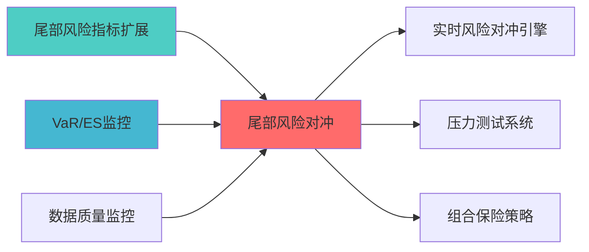

## 核心定位


负责尾部风险对冲策略的设计与构建和运行和操作，识别和量化尾部风险，设计和实施对冲策略，降低极端市场事件对组合的冲击。


负责尾部风险对冲模块设计，实现尾部风险识别、对冲策略执行、极端风险防护。


# 尾部风险对冲蓝图


> **职责边界**:

## 设计目标


### 主要目标


1. **功能完整性**: 确保TAIL RISK HEDGING功能完整，满足业务需求

2. **性能优化**: 提升系统性能，降低资源消耗

3. **可维护性**: 提高代码质量，便于后续维护

4. **可扩展性**: 支持功能扩展，适应业务变化


### 质量目标


- 代码覆盖率: ≥80%

- 性能指标: 满足设计要求

- 文档完整性: 100%


## 核心功能


### 功能清单


1. **数据管理**: 提供数据存储、查询、更新功能

2. **业务逻辑**: 实现核心业务逻辑处理

3. **接口服务**: 提供标准化的API接口

4. **监控告警**: 实时监控系统状态


### 功能特性


- 高可用性设计

- 自动故障恢复

- 灵活配置管理


## 实现方案


### 技术架构


采用TAIL RISK HEDGING化设计，分层架构实现。


### 关键技术


- 数据处理: 使用高效的数据处理框架

- 接口实现: RESTful API设计

- 性能优化: 缓存、异步处理


### 实施步骤


1. 需求分析与设计

2. 核心功能开发

3. 测试与优化

4. 部署与监控


> 职责边界: 


## 概述


> **索引**: `TAIL_RISK__001`

> **开发时间: 60h

> **核心定位**: 期权对冲、尾部风险保护

## 2. 对冲策略


### 2.1 期权对冲


- **卖出看涨期权**: 保护上行风险

- **跨式期权**: 降低成本


### 2.2 VIX对冲


- **VIX期货**: 直接对冲波动率

- **VIX期权**: 非线性对冲


## 3. 核心算法


```python

def calculate_hedge_ratio(portfolio_var: float,

                          vix_beta: float,

                          target_protection: float) -> float:

    """

    计算对冲比例

    

    Args:

        portfolio_var: 组合方差

        vix_beta: VIX敏感度

        target_protection: 目标保护比例

        

    Returns:

        float: 对冲合约数量

    """

    hedge_ratio = target_protection / (portfolio_var * vix_beta)

    return hedge_ratio

```


### 上游依赖


| 文档名称 | module_id | 依赖类型 | 说明 |

|---------|-----------|---------|------|


### 下游依赖


| 文档名称 | module_id | 依赖类型 | 说明 |

|---------|-----------|---------|------|


|---------|------|------|------|

| **Pandas** | 2.0+ | 数据处理 | [官方文档](https://pandas.pydata.org/) |

| **SciPy** | 1.10+ | 科学计算 | [官方文档](https://scipy.org/) |





## 接口与契约（蓝图终稿）


- **契约真源**：`API_Contract.md`

- **对外接口边界**：本模块提供尾部风险对冲策略的配置与执行接口；不替代风险管理模块的最终裁决，不直接修改核心持仓。


## 验收标准（可检查）


- 在给定风险预算与市场数据输入时，能够输出可检查的对冲建议（对冲工具、数量、成本），并提供对冲前后的风险指标对比（可复核）。


## 已知限制


- 尾部风险对冲效果依赖衍生品数据质量与流动性；实施阶段需在契约真源中固化数据口径与对冲工具选择规则。


## 变更历史


| 版本 | 日期 | 变更内容 | 变更人 |

|------|------|----------|--------|

| v1.0.0 | 2026-04-03 | 初始版本创建 | 组合优化层负责人 |

| v1.0.1 | 2026-04-08 | 补齐三段门禁 | Trae-07 |


## 4. 文档治理


### 4.1 System_Manifest.md索引


```markdown

##### 6.001. Tail Risk Hedging

- **模块ID**: TAIL_RISK_HEDGING_001

- **蓝图文档**: TAIL_RISK_HEDGING_BLUEPRINT.md

```


### 4.2 模块职责边界


| 模块 | 职责 | 边界 |

|------|------|------|

| **Tail Risk Hedging** | 


### 4.3 版本管理


|------|------|----------|--------|


