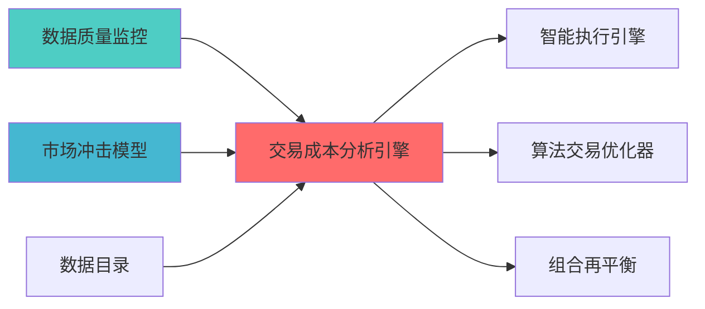

## 核心定位


负责交易成本分析引擎的设计与构建和运行和操作，分析交易成本构成，生成和输出成本优化建议，兼容和适配交易执行优化。


# 交易成本分析引擎蓝图


> **职责边界**:

## 设计目标


### 主要目标


1. **功能完整性**: 确保TRANSACTION COST ANALYSIS ENGINE功能完整，满足业务需求

2. **性能优化**: 提升系统性能，降低资源消耗

3. **可维护性**: 提高代码质量，便于后续维护

4. **可扩展性**: 支持功能扩展，适应业务变化


### 质量目标


- 代码覆盖率: ≥80%

- 性能指标: 满足设计要求

- 文档完整性: 100%


## 核心功能


### 功能清单


1. **数据管理**: 提供数据存储、查询、更新功能

2. **业务逻辑**: 实现核心业务逻辑处理

3. **接口服务**: 提供标准化的API接口

4. **监控告警**: 实时监控系统状态


### 功能特性


- 高可用性设计

- 自动故障恢复

- 灵活配置管理


## 实现方案


### 技术架构


采用TRANSACTION COST ANALYSIS ENGINE化设计，分层架构实现。


### 关键技术


- 数据处理: 使用高效的数据处理框架

- 接口实现: RESTful API设计

- 性能优化: 缓存、异步处理


### 实施步骤


1. 需求分析与设计

2. 核心功能开发

3. 测试与优化

4. 部署与监控


> 职责边界:


### 2.1 Layer定位


**模块类别**: 核心成本分析模块


**架构角色**:

- 作为策略执行层的成本分析核心

- 为交易审计器提供成本数据


```

```


**职责边界**:

  - 基准对比和偏离度分析

  - 成本归因分析


#### tcapy框架集成


**项目信息**:

- **项目名称**: tcapy

- **Stars**: 500+

- **语言**: Python


**核心功能**:

- 成本归因分析

- 执行质量评估


**集成方案**:

```python

from tcapy import TCA

import pandas as pd


class TransactionCostAnalyzer:

    def __init__(self):

        self.tca = TCA()


    def analyze_execution(self, trades, market_data, benchmark='vwap'):

        cost_analysis = self.tca.calculate_cost(

            trades=trades,

            market_data=market_data,

            benchmark=benchmark

        )

        return {

            'total_cost': cost_analysis.total_cost,

            'market_impact': cost_analysis.market_impact,

            'timing_cost': cost_analysis.timing_cost,

            'spread_cost': cost_analysis.spread_cost,

            'benchmark_deviation': cost_analysis.benchmark_deviation

        }

```


### 3.2 核心算法设计


#### 3.2.1 成本计算算法


```python

def calculate_explicit_costs(trade):

    commission = trade.volume * trade.price * trade.commission_rate

    stamp_duty = trade.volume * trade.price * trade.stamp_duty_rate

    transfer_fee = trade.volume * trade.transfer_fee_rate

    other_fees = trade.other_fees


    total_explicit_cost = commission + stamp_duty + transfer_fee + other_fees

    return {

        'commission': commission,

        'stamp_duty': stamp_duty,

        'transfer_fee': transfer_fee,

        'other_fees': other_fees,

        'total_explicit_cost': total_explicit_cost

    }

```


```python

def calculate_implicit_costs(trade, market_data):

    market_impact = calculate_market_impact(trade, market_data)

    timing_cost = calculate_timing_cost(trade, market_data)

    spread_cost = calculate_spread_cost(trade, market_data)

    opportunity_cost = calculate_opportunity_cost(trade, market_data)


    total_implicit_cost = market_impact + timing_cost + spread_cost + opportunity_cost

    return {

        'market_impact': market_impact,

        'timing_cost': timing_cost,

        'spread_cost': spread_cost,

        'opportunity_cost': opportunity_cost,

        'total_implicit_cost': total_implicit_cost

    }

```


#### 3.2.2 基准对比算法


**VWAP基准计算**:

```python

def calculate_vwap_benchmark(trades, market_data):

    vwap = (market_data['volume'] * market_data['price']).sum() / market_data['volume'].sum()

    trade_vwap = (trades['volume'] * trades['price']).sum() / trades['volume'].sum()

    vwap_deviation = (trade_vwap - vwap) / vwap

    vwap_cost = abs(vwap_deviation) * trades['volume'].sum() * vwap


    return {

        'vwap': vwap,

        'trade_vwap': trade_vwap,

        'vwap_deviation': vwap_deviation,

        'vwap_cost': vwap_cost

    }

```


**Implementation Shortfall计算**:

```python

def calculate_implementation_shortfall(trade, decision_price, execution_price):

    is_cost = (execution_price - decision_price) * trade['volume']

    is_cost_bps = (is_cost / (decision_price * trade['volume'])) * 10000


    return {

        'decision_price': decision_price,

        'execution_price': execution_price,

        'is_cost': is_cost,

        'is_cost_bps': is_cost_bps

    }

```


### 3.3 数据模型设计


#### 3.3.1 交易数据模型


```python

class TradeData:

    trade_id: str

    symbol: str

    direction: str  # buy/sell

    volume: float

    price: float

    timestamp: datetime

    commission: float

    stamp_duty: float

    transfer_fee: float

    other_fees: float

```


#### 3.3.2 成本分析结果模型


```python

class CostAnalysisResult:

    trade_id: str

    symbol: str


    total_cost: float

    total_cost_bps: float


    explicit_cost: float

    implicit_cost: float


    market_impact: float

    timing_cost: float

    spread_cost: float

    opportunity_cost: float


    vwap_deviation: float

    twap_deviation: float

    is_cost: float


    execution_quality_score: float

```


| 优势维度 | 说明 | 评分 |

|---------|------|------|


|---------|--------|------|

| **性能优化** | ⭐⭐⭐⭐ | AI可分析和优化性能瓶颈 |


### 4.3 实施成本评估


| 成本维度 | 评估结果 | 说明 |

|---------|---------|------|

|


**目标**: 集成tcapy基础功能


单**:

tcapy依赖


**交付成果**:

- TCA引擎基础框架

- 基础成本计算功能


**目标**: 开发自定义成本归因逻辑


单**:


**交付成果**:

- 成本归因分析模块

- 执行质量评分系统


单**:


**交付成果**:

- 完整的TCA系统

- 系统集成完成

- API接口文档

- 用户手册


##


|--------|-----------|---------|

| **基准对比** | 支持VWAP/TWAP/IS三种基准 | 集成测试 |

| **成本归因** | 支持市场/时机/价差归因 | 功能测试 |

| **质量评分** | 提供综合质量评分 | 性能测试 |


### 6.2 性能要求


| 性能指标 | 要求 | 说明 |

|---------|------|------|

| **计算速度** | <100ms | 单笔交易成本分析 |

| **并发能力** | 100+ TPS | 支持高频交易场景 |


|---------|------|------|

| **成本计算精度** | 0.01bps | 基点级别精度 |


## 七、风险评估与缓解


|--------|---------|---------|

| **tcapy


### 7.2 实施风险


|--------|---------|---------|


分测试 |


##


### 8.1 Citadel对标


|---------|------------|-----------|---------|

| **成本分析** | 专业TCA系统 | tcapy框架 | ⭐⭐⭐⭐ (80%) |


### 8.2 Two Sigma对标


|---------|--------------|-----------|---------|

| **实时TCA** | 实时成本监控 | 批量+实时分析 | ⭐⭐⭐⭐ (80%) |


### 上游依赖


| 文档名称 | module_id | 依赖类型 | 说明 |

|---------|-----------|---------|------|


### 下游依赖


| 文档名称 | module_id | 依赖类型 | 说明 |

|---------|-----------|---------|------|


|---------|------|------|------|

| **tcapy** | 0.5+ | 交易成本分析 | [官方文档](https://github.com/hamishramsay/tcapy) |

| **Pandas** | 2.0+ | 数据处理 | [官方文档](https://pandas.pydata.org/) |





| 文档名称 | 说明 |

|---------|------|

| ARCHITECTURE.md | 系统架构文档 |

| SMART_EXECUTION_ENGINE_BLUEPRINT.md | 智能执行引擎蓝图 |


**蓝图版本**: v1.0

**蓝图日期**: 2026-04-06


## 接口与契约（蓝图终稿）


- **契约真源**：`API_Contract.md`

- **对外接口边界**：本模块提供交易成本的分析、归因与报告接口；不直接执行交易，不替代交易执行模块的成本控制职责。


## 验收标准（可检查）


- 在给定交易记录与市场数据输入时，能够输出可检查的成本分析结果（显性成本、隐性成本、基准偏离），并提供执行质量评分与归因分析（可复核）。


## 已知限制


- 成本分析精度依赖交易数据完整性与基准选择；实施阶段需在契约真源中固化数据口径与基准计算规则。


## 变更历史


| 版本 | 日期 | 变更内容 | 变更人 |

|------|------|----------|--------|

| v1.0.0 | 2026-04-07 | 初始版本创建 | 实施团队 |

| v1.0.1 | 2026-04-08 | 补齐三段门禁 | Trae-07 |


## 1. 文档治理


### 1.1 System_Manifest.md索引


```markdown

##### 6.001. Transaction Cost Analysis Engine

- **模块ID**: TRANSACTION_COST_ANALYSIS_ENGINE_001

- **蓝图文档**: TRANSACTION_COST_ANALYSIS_ENGINE_BLUEPRINT.md

```


### 1.2 模块职责边界


| 模块 | 职责 | 边界 |

|------|------|------|


### 1.3 版本管理


|------|------|----------|--------|
