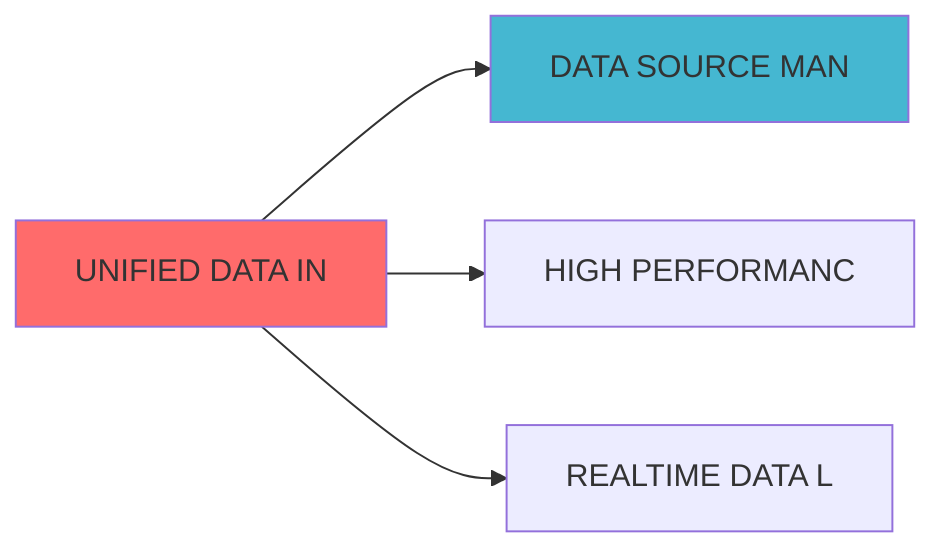

## 核心定位


负责统一数据基础设施的设计与构建和运行和操作，构建统一的数据平台架构，生成和输出数据存储、计算和服务功能，兼容和适配数据协调和监控。


## 接口与契约（蓝图终稿）


本模块遵循系统接口契约，详见：API_Contract.md


### 关键接口

- **数据采集接口**: `DataSourceAdapter` - 数据源适配器接口

- **数据存储接口**: `DataLakeStorage` - 数据湖存储接口

- **时序存储接口**: `TimeSeriesDBStorage` - 时序数据库存储接口

- **统一数据API**: `UnifiedDataAPI` - 统一数据访问接口


## 验收标准（可检查）


- 能够对至少 1 个数据源完成采集→存储→查询的端到端流程，并能输出可检查的数据质量指标（完整性、一致性、延迟）。


## 已知限制


- 数据基础设施依赖 Spark、Delta Lake、InfluxDB 等组件；实施阶段需在契约真源中固化组件版本、部署架构与运维策略。


# UNIFIED DATA INFRASTRUCTURE BLUEPRINT


> **核心职责**: 统一数据基础设施，构建数据采集、存储和分析和转换框架

> **职责边界**:

## 设计目标


### 主要目标


1. **功能完整性**: 确保UNIFIED DATA INFRASTRUCTURE功能完整，满足业务需求

2. **性能优化**: 提升系统性能，降低资源消耗

3. **可维护性**: 提高代码质量，便于后续维护

4. **可扩展性**: 支持功能扩展，适应业务变化


### 质量目标


- 代码覆盖率: ≥80%

- 性能指标: 满足设计要求

- 文档完整性: 100%


## 核心功能


### 功能清单


1. **数据管理**: 提供数据存储、查询、更新功能

2. **业务逻辑**: 实现核心业务逻辑处理

3. **接口服务**: 提供标准化的API接口

4. **监控告警**: 实时监控系统状态


### 功能特性


- 高可用性设计

- 自动故障恢复

- 灵活配置管理


## 实现方案


### 技术架构


采用UNIFIED DATA INFRASTRUCTURE化设计，分层架构实现。


### 关键技术


- 数据处理: 使用高效的数据处理框架

- 接口实现: RESTful API设计

- 性能优化: 缓存、异步处理


### 实施步骤


1. 需求分析与设计

2. 核心功能开发

3. 测试与优化

4. 部署与监控


**单一职责**: 统一数据基础设施，构建统一的数据采集、存储和处理基础设施


### 职责边界


- 数据采集框架

- 数据存储架构

- 数据处理引擎

- 基础设施管理


- 业务数据处理

- 数据质量监控

- 数据治理


### 层级定位


```

```


### 核心职责


|---------|---------|---------|


### 整体架构


```mermaid

graph TB

    subgraph "数据源层"

        A1[宏观经济数据源]

数据源]

数据源]

数据源]

        A5[另类数据源]

    end

    

        B1[批量采集器]

        B2[流式采集器]

器]

    end

    

        C4[归档存储<br/>对象存储]

    end

    

洗]

        D2[数据标准化]

        D3[数据聚合]

        D4[数据质量检查]

    end

    

        E1[统一数据API]

        E2[数据查询服务]

服务]

        E4[数据目录服务]

    end

    

        F2[中观策略层]

        F3[微观执行层]

    end

    

    A1 --> B1

    A2 --> B1

    A3 --> B2

    A4 --> B3

    A5 --> B1

    

    B1 --> B4

    B2 --> B4

    B3 --> B4

    

    B4 --> C1

    B4 --> C2

    B4 --> C3

    

    C1 --> D1

    C2 --> D1

    C3 --> D1

    

    D1 --> D2

    D2 --> D3

    D3 --> D4

    

    D4 --> E1

    D4 --> E2

    D4 --> E3

    D4 --> E4

    

    E1 --> F1

    E1 --> F2

    E1 --> F3

    E2 --> F1

    E2 --> F2

    E3 --> F3

    E4 --> F1

    E4 --> F2

```


```

```


**特点**:

- 数据量小但重要性高


```

```


**特点**:

- 每日更新


数据流（分钟级）


```

```


**特点**:

- 数据量大


```

```


**特点**:

- 秒级更新

低延迟要求


```python

from abc import ABC, abstractmethod

from typing import Dict, Any, List

import pandas as pd

from datetime import datetime


class DataSourceAdapter(ABC):

    

    @abstractmethod

    def connect(self) -> bool:

        """建立连接"""

        pass

    

    @abstractmethod

    def fetch(self, params: Dict[str, Any]) -> pd.DataFrame:

        """获取数据"""

        pass

    

    @abstractmethod

    def subscribe(self, callback: callable) -> None:

实时数据"""

        pass

    

    @abstractmethod

    def disconnect(self) -> None:

        """断开连接"""

        pass


class MacroDataSourceAdapter(DataSourceAdapter):

    

    def __init__(self, source_config: Dict[str, Any]):

        self.source_config = source_config

        self.connection = None

        

    def connect(self) -> bool:

        # 实现连接逻辑

        # 支持的数据源：Wind、同花顺iFinD、东方财富Choice

        pass

    

    def fetch(self, params: Dict[str, Any]) -> pd.DataFrame:

        """获取宏观经济数据"""

        # params示例:

        # {

        #     'indicators': ['GDP', 'CPI', 'PMI'],

        #     'start_date': '2020-01-01',

        #     'end_date': '2024-12-31',

        #     'frequency': 'monthly'

        # }

        pass

    

    def subscribe(self, callback: callable) -> None:

        pass

    

    def disconnect(self) -> None:

        """断开连接"""

        pass


class DailyMarketDataSourceAdapter(DataSourceAdapter):

    

    def __init__(self, source_config: Dict[str, Any]):

        self.source_config = source_config

        self.connection = None

        

    def connect(self) -> bool:

        pass

    

    def fetch(self, params: Dict[str, Any]) -> pd.DataFrame:

数据"""

        # params示例:

        # {

        #     'symbols': ['000001.SZ', '000002.SZ'],

        #     'start_date': '2024-01-01',

        #     'end_date': '2024-12-31',

        #     'fields': ['open', 'high', 'low', 'close', 'volume']

        # }

        pass

    

    def subscribe(self, callback: callable) -> None:

        pass

    

    def disconnect(self) -> None:

        """断开连接"""

        pass


class IntradayMarketDataSourceAdapter(DataSourceAdapter):

    

    def __init__(self, source_config: Dict[str, Any]):

        self.source_config = source_config

        self.connection = None

        

    def connect(self) -> bool:

        pass

    

    def fetch(self, params: Dict[str, Any]) -> pd.DataFrame:

数据"""

        # params示例:

        # {

        #     'symbol': '000001.SZ',

        #     'date': '2024-12-01',

        #     'frequency': '1min',

        #     'fields': ['open', 'high', 'low', 'close', 'volume']

        # }

        pass

    

    def subscribe(self, callback: callable) -> None:

实时数据"""

逻辑

        pass

    

    def disconnect(self) -> None:

        """断开连接"""

        pass


class RealtimeMarketDataSourceAdapter(DataSourceAdapter):

    

    def __init__(self, source_config: Dict[str, Any]):

        self.source_config = source_config

        self.connection = None

        self.websocket = None

        

    def connect(self) -> bool:

        pass

    

    def fetch(self, params: Dict[str, Any]) -> pd.DataFrame:

        """实时数据通常不使用fetch，而是使用subscribe"""

        pass

    

    def subscribe(self, callback: callable) -> None:

数据"""

逻辑

        pass

    

    def disconnect(self) -> None:

        """断开连接"""

        pass

```


### 2. 数据湖存储层 (Data Lake Storage)


```python

from typing import Dict, Any, List

import pandas as pd

from datetime import datetime

import delta

import pyspark.sql.functions as F


class DataLakeStorage:

    """数据湖存储层 - Delta Lake实现"""

    

    def __init__(self, spark_session, base_path: str):

        self.spark = spark_session

        self.base_path = base_path

        

    def store_macro_data(self, data: pd.DataFrame, table_name: str) -> None:

        """存储宏观经济数据"""

        # 转换为Spark DataFrame

        spark_df = self.spark.createDataFrame(data)

        

        spark_df.write.format("delta") \

            .mode("overwrite") \

            .partitionBy("indicator_code") \

            .save(f"{self.base_path}/macro/{table_name}")

    

    def store_daily_data(self, data: pd.DataFrame, table_name: str) -> None:

数据"""

        spark_df = self.spark.createDataFrame(data)

        

        spark_df.write.format("delta") \

            .mode("append") \

            .partitionBy("trade_date") \

            .save(f"{self.base_path}/daily/{table_name}")

    

    def store_intraday_data(self, data: pd.DataFrame, table_name: str) -> None:

数据"""

        spark_df = self.spark.createDataFrame(data)

        

        spark_df.write.format("delta") \

            .mode("append") \

            .partitionBy("trade_date", "symbol") \

            .save(f"{self.base_path}/intraday/{table_name}")

    

    def query_macro_data(self, 

                        indicators: List[str],

                        start_date: str,

                        end_date: str) -> pd.DataFrame:

        """查询宏观经济数据"""

        query = f"""

        SELECT * FROM delta.`{self.base_path}/macro/macro_indicators`

        WHERE indicator_code IN ({','.join([f"'{i}'" for i in indicators])})

        AND date BETWEEN '{start_date}' AND '{end_date}'

        ORDER BY date

        """

        return self.spark.sql(query).toPandas()

    

    def query_daily_data(self,

                        symbols: List[str],

                        start_date: str,

                        end_date: str,

                        fields: List[str]) -> pd.DataFrame:

数据"""

        query = f"""

        SELECT {','.join(fields)} FROM delta.`{self.base_path}/daily/market_data`

        WHERE symbol IN ({','.join([f"'{s}'" for s in symbols])})

        AND trade_date BETWEEN '{start_date}' AND '{end_date}'

        ORDER BY symbol, trade_date

        """

        return self.spark.sql(query).toPandas()

    

    def query_intraday_data(self,

                           symbol: str,

                           date: str,

                           frequency: str = '1min') -> pd.DataFrame:

数据"""

        query = f"""

        SELECT * FROM delta.`{self.base_path}/intraday/{frequency}_data`

        WHERE symbol = '{symbol}'

        AND trade_date = '{date}'

        ORDER BY timestamp

        """

        return self.spark.sql(query).toPandas()

    

    def compact_data(self, table_path: str) -> None:

        """压缩Delta表，优化查询性能"""

        self.spark.sql(f"OPTIMIZE delta.`{table_path}`")

    

    def vacuum_data(self, table_path: str, retention_hours: int = 168) -> None:

"""

理旧版本数据，释放存储空间"""

        self.spark.sql(f"VACUUM delta.`{table_path}` RETAIN {retention_hours} HOURS")

```


```python

from influxdb_client import InfluxDBClient, Point, WritePrecision

from influxdb_client.client.write_api import SYNCHRONOUS

from typing import Dict, Any, List

import pandas as pd

from datetime import datetime


class TimeSeriesDBStorage:

    

    def __init__(self, url: str, token: str, org: str, bucket: str):

        self.client = InfluxDBClient(url=url, token=token, org=org)

        self.bucket = bucket

        self.write_api = self.client.write_api(write_options=SYNCHRONOUS)

        self.query_api = self.client.query_api()

        

    def write_realtime_data(self, 

                           measurement: str,

                           tags: Dict[str, str],

                           fields: Dict[str, Any],

                           timestamp: datetime) -> None:

        point = Point(measurement) \

            .time(timestamp, WritePrecision.NS)

        

        for tag_key, tag_value in tags.items():

            point.tag(tag_key, tag_value)

        

        for field_key, field_value in fields.items():

            point.field(field_key, field_value)

        

        self.write_api.write(bucket=self.bucket, record=point)

    

    def write_batch_realtime_data(self, 

                                  measurement: str,

                                  data: pd.DataFrame,

                                  tag_columns: List[str]) -> None:

        points = []

        for _, row in data.iterrows():

            point = Point(measurement) \

                .time(row['timestamp'], WritePrecision.NS)

            

            for tag_col in tag_columns:

                point.tag(tag_col, str(row[tag_col]))

            

            for col in data.columns:

                if col not in tag_columns and col != 'timestamp':

                    point.field(col, row[col])

            

            points.append(point)

        

        self.write_api.write(bucket=self.bucket, record=points)

    

    def query_realtime_data(self,

                           measurement: str,

                           symbol: str,

                           start_time: datetime,

                           end_time: datetime,

                           fields: List[str]) -> pd.DataFrame:

        """查询实时数据"""

        query = f'''

        from(bucket: "{self.bucket}")

        |> range(start: {start_time.isoformat()}, stop: {end_time.isoformat()})

        |> filter(fn: (r) => r._measurement == "{measurement}")

        |> filter(fn: (r) => r.symbol == "{symbol}")

        |> filter(fn: (r) => contains(value: r._field, set: {fields}))

        '''

        

        result = self.query_api.query_data_frame(query)

        return result

    

    def query_latest_data(self, measurement: str, symbol: str) -> pd.DataFrame:

        query = f'''

        from(bucket: "{self.bucket}")

        |> range(start: -5m)

        |> filter(fn: (r) => r._measurement == "{measurement}")

        |> filter(fn: (r) => r.symbol == "{symbol}")

        |> last()

        '''

        

        result = self.query_api.query_data_frame(query)

        return result

```


### 4. 统一数据API (Unified Data API)


```python

from typing import Dict, Any, List, Optional

import pandas as pd

from datetime import datetime

from fastapi import FastAPI, HTTPException

from pydantic import BaseModel


app = FastAPI(title="统一数据API")


class MacroDataRequest(BaseModel):

    """宏观经济数据请求"""

    indicators: List[str]

    start_date: str

    end_date: str

    frequency: str = 'monthly'


class DailyDataRequest(BaseModel):

    """日频数据请求"""

    symbols: List[str]

    start_date: str

    end_date: str

    fields: List[str]


class IntradayDataRequest(BaseModel):

数据请求"""

    symbol: str

    date: str

    frequency: str = '1min'

    fields: Optional[List[str]] = None


class UnifiedDataAPI:

    """统一数据API"""

    

    def __init__(self, 

                 data_lake: DataLakeStorage,

                 time_series_db: TimeSeriesDBStorage,

                 cache_client):

        self.data_lake = data_lake

        self.time_series_db = time_series_db

        self.cache = cache_client

        

    @app.post("/api/v1/macro/data")

    async def get_macro_data(self, request: MacroDataRequest) -> Dict[str, Any]:

        """获取宏观经济数据"""

        cache_key = f"macro:{':'.join(request.indicators)}:{request.start_date}:{request.end_date}"

        cached_data = self.cache.get(cache_key)

        

        if cached_data:

            return {

                'status': 'success',

                'data': cached_data,

                'source': 'cache'

            }

        

        # 2. 从数据湖查询

        try:

            data = self.data_lake.query_macro_data(

                indicators=request.indicators,

                start_date=request.start_date,

                end_date=request.end_date

            )

            

            self.cache.set(cache_key, data.to_dict(), expire=3600)  # 1小时过期

            

            return {

                'status': 'success',

                'data': data.to_dict(),

                'source': 'data_lake'

            }

        except Exception as e:

            raise HTTPException(status_code=500, detail=str(e))

    

    @app.post("/api/v1/daily/data")

    async def get_daily_data(self, request: DailyDataRequest) -> Dict[str, Any]:

数据"""

        cache_key = f"daily:{':'.join(request.symbols)}:{request.start_date}:{request.end_date}"

        cached_data = self.cache.get(cache_key)

        

        if cached_data:

            return {

                'status': 'success',

                'data': cached_data,

                'source': 'cache'

            }

        

        # 2. 从数据湖查询

        try:

            data = self.data_lake.query_daily_data(

                symbols=request.symbols,

                start_date=request.start_date,

                end_date=request.end_date,

                fields=request.fields

            )

            

            self.cache.set(cache_key, data.to_dict(), expire=1800)  # 30分钟过期

            

            return {

                'status': 'success',

                'data': data.to_dict(),

                'source': 'data_lake'

            }

        except Exception as e:

            raise HTTPException(status_code=500, detail=str(e))

    

    @app.post("/api/v1/intraday/data")

    async def get_intraday_data(self, request: IntradayDataRequest) -> Dict[str, Any]:

数据"""

        cache_key = f"intraday:{request.symbol}:{request.date}:{request.frequency}"

        cached_data = self.cache.get(cache_key)

        

        if cached_data:

            return {

                'status': 'success',

                'data': cached_data,

                'source': 'cache'

            }

        

        # 2. 从数据湖查询

        try:

            data = self.data_lake.query_intraday_data(

                symbol=request.symbol,

                date=request.date,

                frequency=request.frequency

            )

            

            self.cache.set(cache_key, data.to_dict(), expire=300)  # 5分钟过期

            

            return {

                'status': 'success',

                'data': data.to_dict(),

                'source': 'data_lake'

            }

        except Exception as e:

            raise HTTPException(status_code=500, detail=str(e))

    

    @app.get("/api/v1/realtime/data/{symbol}")

    async def get_realtime_data(self, symbol: str) -> Dict[str, Any]:

数据"""

        try:

            data = self.time_series_db.query_latest_data(

                measurement='realtime_quotes',

                symbol=symbol

            )

            

            return {

                'status': 'success',

                'data': data.to_dict(),

                'source': 'time_series_db'

            }

        except Exception as e:

            raise HTTPException(status_code=500, detail=str(e))

    

    @app.get("/api/v1/data/catalog")

    async def get_data_catalog(self) -> Dict[str, Any]:

        """获取数据目录"""

        # 返回可用的数据集列表

        catalog = {

            'macro': {

                'indicators': ['GDP', 'CPI', 'PMI', 'M2', 'Industrial_Output'],

                'frequency': ['monthly', 'quarterly', 'yearly'],

                'date_range': ['2000-01-01', '2024-12-31']

            },

            'daily': {

                'symbols': ['000001.SZ', '000002.SZ', '...'],

                'fields': ['open', 'high', 'low', 'close', 'volume', 'amount'],

                'date_range': ['2010-01-01', '2024-12-31']

            },

            'intraday': {

                'symbols': ['000001.SZ', '000002.SZ', '...'],

                'frequency': ['1min', '5min', '15min', '30min', '60min'],

                'date_range': ['2020-01-01', '2024-12-31']

            },

            'realtime': {

                'symbols': ['000001.SZ', '000002.SZ', '...'],

                'fields': ['price', 'volume', 'bid', 'ask', 'last']

            }

        }

        

        return {

            'status': 'success',

            'catalog': catalog

        }

```


服务 (Data Subscription Service)


```python

from typing import Dict, Any, Callable, List

import asyncio

import websockets

import json

from datetime import datetime


class DataSubscriptionService:

服务"""

    

    def __init__(self, realtime_adapter: RealtimeMarketDataSourceAdapter):

        self.realtime_adapter = realtime_adapter

        self.subscriptions: Dict[str, List[Callable]] = {}

        self.websocket_clients: List[websockets.WebSocketServerProtocol] = []

        

    async def subscribe_realtime_quotes(self, 

                                        symbols: List[str],

                                        callback: Callable) -> str:

"""

        subscription_id = f"sub_{datetime.now().timestamp()}"

        

        # 注册回调函数

        for symbol in symbols:

            if symbol not in self.subscriptions:

                self.subscriptions[symbol] = []

            self.subscriptions[symbol].append(callback)

        


        await self.realtime_adapter.connect()

        await self.realtime_adapter.subscribe(

            callback=self._handle_realtime_data

        )

        

        return subscription_id

    

    async def _handle_realtime_data(self, data: Dict[str, Any]) -> None:

        """处理实时数据"""

        symbol = data.get('symbol')

        

        if symbol in self.subscriptions:

            for callback in self.subscriptions[symbol]:

                try:

                    await callback(data)

                except Exception as e:

                    print(f"Callback error: {e}")

        

        await self._broadcast_to_websocket(data)

    

    async def _broadcast_to_websocket(self, data: Dict[str, Any]) -> None:

        if self.websocket_clients:

            message = json.dumps(data)

            await asyncio.gather(

                *[client.send(message) for client in self.websocket_clients]

            )

    

    async def handle_websocket_client(self, 

                                      websocket: websockets.WebSocketServerProtocol,

                                      path: str) -> None:

        self.websocket_clients.append(websocket)

        

        try:

            async for message in websocket:

                request = json.loads(message)

逻辑

        finally:

            self.websocket_clients.remove(websocket)

    

    async def unsubscribe(self, subscription_id: str) -> None:

"""

逻辑

        pass

```


## 📊 数据模型设计


### 宏观经济数据模型


```sql

CREATE TABLE macro_indicators (

    indicator_code VARCHAR(50) NOT NULL COMMENT '指标代码',

    indicator_name VARCHAR(100) NOT NULL COMMENT '指标名称',

    date DATE NOT NULL COMMENT '日期',

    unit VARCHAR(20) COMMENT '单位',

    update_time TIMESTAMP DEFAULT CURRENT_TIMESTAMP COMMENT '更新时间',

    PRIMARY KEY (indicator_code, date)

```


数据模型


```sql

CREATE TABLE daily_market_data (

    symbol VARCHAR(20) NOT NULL COMMENT '股票代码',

    trade_date DATE NOT NULL COMMENT '交易日期',

    open DECIMAL(10, 3) COMMENT '开盘价',

    high DECIMAL(10, 3) COMMENT '最高价',

    low DECIMAL(10, 3) COMMENT '最低价',

    pe_ttm DECIMAL(10, 2) COMMENT '市盈率TTM',

    update_time TIMESTAMP DEFAULT CURRENT_TIMESTAMP COMMENT '更新时间',

    PRIMARY KEY (symbol, trade_date)

```


数据模型


```sql

CREATE TABLE intraday_market_data (

    symbol VARCHAR(20) NOT NULL COMMENT '股票代码',

    trade_date DATE NOT NULL COMMENT '交易日期',

    open DECIMAL(10, 3) COMMENT '开盘价',

    high DECIMAL(10, 3) COMMENT '最高价',

    low DECIMAL(10, 3) COMMENT '最低价',

    update_time TIMESTAMP DEFAULT CURRENT_TIMESTAMP COMMENT '更新时间',

    PRIMARY KEY (symbol, trade_date, timestamp, frequency)

```


## 🔌 接口规范


### RESTful API接口


#### 1. 获取宏观经济数据


```

POST /api/v1/macro/data

Content-Type: application/json


Request:

{

    "indicators": ["GDP", "CPI", "PMI"],

    "start_date": "2020-01-01",

    "end_date": "2024-12-31",

    "frequency": "monthly"

}


Response:

{

    "status": "success",

    "data": {

        "GDP": [...],

        "CPI": [...],

        "PMI": [...]

    },

    "source": "data_lake",

    "timestamp": "2024-12-01T10:00:00Z"

}

```


数据


```

POST /api/v1/daily/data

Content-Type: application/json


Request:

{

    "symbols": ["000001.SZ", "000002.SZ"],

    "start_date": "2024-01-01",

    "end_date": "2024-12-31",

    "fields": ["open", "high", "low", "close", "volume"]

}


Response:

{

    "status": "success",

    "data": {

        "000001.SZ": [...],

        "000002.SZ": [...]

    },

    "source": "data_lake",

    "timestamp": "2024-12-01T10:00:00Z"

}

```


数据


```

POST /api/v1/intraday/data

Content-Type: application/json


Request:

{

    "symbol": "000001.SZ",

    "date": "2024-12-01",

    "frequency": "1min",

    "fields": ["open", "high", "low", "close", "volume"]

}


Response:

{

    "status": "success",

    "data": [...],

    "source": "data_lake",

    "timestamp": "2024-12-01T10:00:00Z"

}

```


数据


```

GET /api/v1/realtime/data/{symbol}


Response:

{

    "status": "success",

    "data": {

        "symbol": "000001.SZ",

        "price": 10.50,

        "volume": 1000000,

        "bid": 10.49,

        "ask": 10.51,

        "last": 10.50,

        "timestamp": "2024-12-01T10:00:00Z"

    },

    "source": "time_series_db"

}

```


### WebSocket接口


```

WebSocket: ws://localhost:8000/ws/realtime


Subscribe:

{

    "action": "subscribe",

    "symbols": ["000001.SZ", "000002.SZ"]

}


Message:

{

    "symbol": "000001.SZ",

    "price": 10.50,

    "volume": 1000000,

    "timestamp": "2024-12-01T10:00:00Z"

}


Unsubscribe:

{

    "action": "unsubscribe",

    "symbols": ["000001.SZ"]

}

```


## 🚀 实施要点


### 阶段1：基础设施搭建（第1周）


**任务**:


**验收标准**:

- Spark集群正常运行

- Delta Lake可以读写数据

- InfluxDB可以存储时序数据

- Redis缓存可用


**任务**:


**验收标准**:

- 可以从数据源获取数据


**任务**:

洗和标准化


**验收标准**:

Delta Lake

InfluxDB

洗和标准化正确


**任务**:

服务


**验收标准**:

- RESTful API可以正常访问

功能正常

- 缓存策略有效


### 阶段5：集成测试与优化（第3周）


**任务**:


**验收标准**:

- 查询响应时间<100ms（日频数据）

- 查询响应时间<10ms（实时数据）

- 部署文档完整


## 🧪 测试策略


```python

import pytest

import pandas as pd

from datetime import datetime


def test_macro_data_adapter_fetch():

    adapter = MacroDataSourceAdapter(config)

    

    assert adapter.connect() == True

    

    # 获取数据

    params = {

        'indicators': ['GDP', 'CPI'],

        'start_date': '2024-01-01',

        'end_date': '2024-12-31',

        'frequency': 'monthly'

    }

    data = adapter.fetch(params)

    

    # 验证数据

    assert isinstance(data, pd.DataFrame)

    assert len(data) > 0

    assert 'GDP' in data.columns

    assert 'CPI' in data.columns

    

    # 断开连接

    adapter.disconnect()


def test_data_lake_store_and_query():

    """测试数据湖存储和查询"""

    storage = DataLakeStorage(spark, base_path)

    

    # 存储数据

    test_data = pd.DataFrame({

        'symbol': ['000001.SZ', '000002.SZ'],

        'trade_date': ['2024-12-01', '2024-12-01'],

        'close': [10.0, 20.0]

    })

    

    storage.store_daily_data(test_data, 'test_table')

    

    # 查询数据

    result = storage.query_daily_data(

        symbols=['000001.SZ'],

        start_date='2024-12-01',

        end_date='2024-12-01',

        fields=['close']

    )

    

    assert len(result) == 1

    assert result['close'].iloc[0] == 10.0


def test_unified_data_api():

    """测试统一数据API"""

    client = TestClient(app)

    

    # 测试获取日频数据

    response = client.post("/api/v1/daily/data", json={

        "symbols": ["000001.SZ"],

        "start_date": "2024-12-01",

        "end_date": "2024-12-01",

        "fields": ["close"]

    })

    

    assert response.status_code == 200

    data = response.json()

    assert data['status'] == 'success'

    assert 'data' in data

```


### 集成测试


```python

def test_end_to_end_data_flow():

    """测试端到端数据流"""

    # 1. 从数据源获取数据

    adapter = DailyMarketDataSourceAdapter(config)

    adapter.connect()

    raw_data = adapter.fetch(params)

    

    # 2. 存储到数据湖

    storage = DataLakeStorage(spark, base_path)

    storage.store_daily_data(raw_data, 'market_data')

    

    # 3. 通过API查询数据

    client = TestClient(app)

    response = client.post("/api/v1/daily/data", json={

        "symbols": ["000001.SZ"],

        "start_date": "2024-12-01",

        "end_date": "2024-12-01",

        "fields": ["close"]

    })

    

    assert response.status_code == 200

    api_data = response.json()['data']

    assert api_data == raw_data.to_dict()

```


### 性能测试


```python

def test_query_performance():

    """测试查询性能"""

    import time

    

    client = TestClient(app)

    

    # 测试日频数据查询性能

    start_time = time.time()

    response = client.post("/api/v1/daily/data", json={

        "start_date": "2024-01-01",

        "fields": ["open", "high", "low", "close", "volume"]

    })

    end_time = time.time()

    

    assert response.status_code == 200

    assert (end_time - start_time) < 0.1  # 100ms

    

    # 测试实时数据查询性能

    start_time = time.time()

    response = client.get("/api/v1/realtime/data/000001.SZ")

    end_time = time.time()

    

    assert response.status_code == 200

    assert (end_time - start_time) < 0.01  # 10ms

```


## 📈 性能指标


### 响应时间要求


| 数据类型 | 查询类型 | 响应时间要求 | 缓存策略 |

|---------|---------|------------|---------|

| **宏观经济数据** | 历史查询 | <1000ms | 1小时缓存 |

数据** | 历史查询 | <100ms | 30分钟缓存 |

数据** | 历史查询 | <50ms | 5分钟缓存 |


|---------|-----------|-----------|


### 存储容量规划


|---------|--------|--------|---------|

 |

数据** | 100GB | 36TB | 1个月 |


- 数据质量监控系统蓝图

- 数据治理平台蓝图


## 📝 变更历史


|------|------|---------|------|


## 变更历史


|------|------|----------|--------|


### 下游依赖


| 文档名称 | module_id | 依赖类型 | 说明 |

|---------|-----------|---------|------|


|---------|------|------|------|

| **Apache Spark** | 3.5+ | 数据处理 | [官方文档](https://spark.apache.org/) |

| **Apache Kafka** | 3.5+ | 消息队列 | [官方文档](https://kafka.apache.org/) |

| **PostgreSQL** | 15+ | 

| **Redis** | 7.0+ | 缓存 | [官方文档](https://redis.io/) |





## 1. 文档治理


### 1.1 System_Manifest.md索引


```markdown

##### 6.001. Unified Data Infrastructure

- **模块ID**: UNIFIED_DATA_INFRASTRUCTURE_001

- **蓝图文档**: UNIFIED_DATA_INFRASTRUCTURE_BLUEPRINT.md

```


### 1.2 模块职责边界


| 模块 | 职责 | 边界 |

|------|------|------|

| **Unified Data Infrastructure** | 


### 1.3 版本管理


|------|------|----------|--------|


