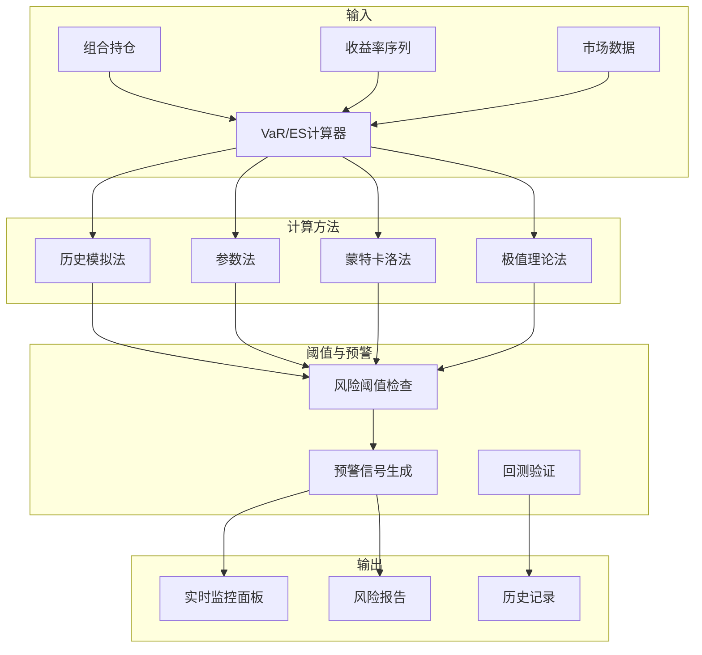

---
responsibility:
- VaR/ES监控
module_id: VAR_ES_MONITORING_001_3727
version: 1.0.0
status: Active
created_date: 2026-04-07
last_updated: 2026-04-07
owner: 实施团队
standard_type: 专业量化机构蓝图
compliance_level: 专业标准
layer: layer_05
---


## 核心定位


负责VaR/ES监控的设计与构建和运行和操作，基于VaR和ES模型，生成和输出风险度量和监控功能，兼容和适配风险协调和监控。


## 接口与契约（蓝图终稿）


本模块遵循系统接口契约，详见：API_Contract.md


### 关键接口

- **VaR计算接口**: `calculate_var()` - 计算风险价值

- **ES计算接口**: `calculate_es()` - 计算期望损失

- **回测接口**: `kupiec_test()` / `christoffersen_test()` - VaR回测验证

- **监控接口**: `get_dashboard_metrics()` - 获取监控面板指标


## 验收标准（可检查）


- 对至少 1 组收益率序列与置信水平，能够输出可检查的 VaR/ES 估计值，并能完成回测验证（突破次数、p值、通过/失败判定）。


## 已知限制


- VaR/ES 估计依赖收益率分布假设与历史窗口；实施阶段需在契约真源中固化分布假设、窗口参数与回测频率。


# VaR/ES实时监控蓝图


> **核心职责**: 实时监控组合的VaR和ES风险指标

> **职责边界**:

## 设计目标


### 主要目标


1. **功能完整性**: 确保VAR ES MONITORING功能完整，满足业务需求

2. **性能优化**: 提升系统性能，降低资源消耗

3. **可维护性**: 提高代码质量，便于后续维护

4. **可扩展性**: 支持功能扩展，适应业务变化


### 质量目标


- 代码覆盖率: ≥80%

- 性能指标: 满足设计要求

- 文档完整性: 100%


## 核心功能


### 功能清单


1. **数据管理**: 提供数据存储、查询、更新功能

2. **业务逻辑**: 实现核心业务逻辑处理

3. **接口服务**: 提供标准化的API接口

4. **监控告警**: 实时监控系统状态


### 功能特性


- 高可用性设计

- 自动故障恢复

- 灵活配置管理


## 实现方案


### 技术架构


采用VAR ES MONITORING化设计，分层架构实现。


### 关键技术


- 数据处理: 使用高效的数据处理框架

- 接口实现: RESTful API设计

- 性能优化: 缓存、异步处理


### 实施步骤


1. 需求分析与设计

2. 核心功能开发

3. 测试与优化

4. 部署与监控


## 1. 概述


### 1.1 模块定位


- 支持历史模拟法、参数法、蒙特卡洛模拟等多种计算方法


- 满足合规监管要求

- 支持风险预算管理


### 1.2 版本信息


|------|------|

| **模块ID** | VAR_ES_MONITORING_001 |

| **版本** | v1.0.0 |

| **创建日期** | 2026-04-06 |


### 上游依赖


| 文档名称 | module_id | 依赖类型 | 说明 |

|---------|-----------|---------|------|

景分析结果 |


### 下游依赖


| 文档名称 | module_id | 依赖类型 | 说明 |

|---------|-----------|---------|------|


|---------|------|------|------|

| **pyRisk** | 1.0+ | 风险指标计算 | [GitHub](https://github.com/quantopian/pyfolio) |

| **pyfolio** | 0.9+ | 组合分析 | [GitHub](https://github.com/quantopian/pyfolio) |


```mermaid

graph LR

    A[组合优化引擎] --> B[VaR/ES监控]

景分析] --> B

    D[数据质量监控] --> B

    

    B --> E[风险贡献分析]

    B --> F[组合绩效评估]

    B --> G[压力测试系统]

    

    style B fill:#ff6b6b

    style A fill:#4ecdc4

    style C fill:#45b7d1

```


## 2. 架构设计


### 2.1 核心组件





### 3.1 核心API


```python

from dataclasses import dataclass

from typing import Optional, List, Dict

import numpy as np

import pandas as pd


class VaRESCalculator:

    

    def __init__(self, confidence_level: float = 0.95):

        self.confidence_level = confidence_level

        

    def historical_var(

        self,

        returns: np.ndarray,

        confidence: float = 0.95

    ) -> float:

        """历史模拟法VaR"""

        return -np.percentile(returns, (1 - confidence) * 100)

    

    def parametric_var(

        self,

        returns: np.ndarray,

        confidence: float = 0.95

    ) -> float:

        mu = np.mean(returns)

        sigma = np.std(returns)

        z = stats.norm.ppf(1 - confidence)

        return -(mu + z * sigma)

    

    def historical_es(

        self,

        returns: np.ndarray,

        confidence: float = 0.95

    ) -> float:

        """历史模拟法ES"""

        var = -self.historical_var(returns, confidence)

        tail_returns = returns[returns <= -var]

        return -np.mean(tail_returns) if len(tail_returns) > 0 else var

    

    def parametric_es(

        self,

        returns: np.ndarray,

        confidence: float = 0.95

    ) -> float:

        """参数法ES"""

        mu = np.mean(returns)

        sigma = np.std(returns)

        z = stats.norm.ppf(1 - confidence)

        es = -(mu - sigma * stats.norm.pdf(z) / (1 - confidence))

        return es

```


### 3.2 性能要求


|------|--------|

| 计算时间 | <100ms |

| 内存占用 | <50MB |

| 实时更新频率 | 1分钟 |


## 4. VaR/ES计算方法详解


**原理**: 使用历史收益率分布直接估计VaR和ES


**优点**:

- 捕捉肥尾特征


**缺点**:

- 依赖历史数据质量

- 无法预测极端事件

- 样本量要求高


```python

class HistoricalVaR:

    

    def __init__(self, confidence_level: float = 0.95):

        self.confidence_level = confidence_level

    

    def calculate_var(

        self,

        returns: np.ndarray,

        portfolio_value: float

    ) -> Tuple[float, float]:

        """

        计算历史模拟VaR

        

        参数:

            

        返回:

        """

        var_percentile = np.percentile(

            returns, 

            (1 - self.confidence_level) * 100

        )

        var_value = -var_percentile * portfolio_value

        

        return var_value, -var_percentile

    

    def calculate_es(

        self,

        returns: np.ndarray,

        portfolio_value: float

    ) -> Tuple[float, float]:

        """

        计算历史模拟ES (Expected Shortfall)

        

        参数:

            

        返回:

        """

        var_percentile = np.percentile(

            returns,

            (1 - self.confidence_level) * 100

        )

        

        tail_returns = returns[returns <= var_percentile]

        

        if len(tail_returns) == 0:

            es_percentile = var_percentile

        else:

            es_percentile = np.mean(tail_returns)

        

        es_value = -es_percentile * portfolio_value

        

        return es_value, -es_percentile

```


**优点**:

晰

- 易于扩展到多资产


**缺点**:

- 无法捕捉肥尾特征


```python

class ParametricVaR:

    

    def __init__(

        self,

        confidence_level: float = 0.95,

        distribution: str = "normal"

    ):

        self.confidence_level = confidence_level

        self.distribution = distribution

    

    def calculate_var(

        self,

        returns: np.ndarray,

        portfolio_value: float

    ) -> Tuple[float, float]:

        """

        计算参数法VaR

        

        参数:

            

        返回:

        """

        mu = np.mean(returns)

        sigma = np.std(returns, ddof=1)

        

        if self.distribution == "normal":

            z_score = stats.norm.ppf(self.confidence_level)

        elif self.distribution == "t":

            df = self._estimate_degrees_of_freedom(returns)

            z_score = stats.t.ppf(self.confidence_level, df)

        

        var_percentile = mu - z_score * sigma

        var_value = -var_percentile * portfolio_value

        

        return var_value, -var_percentile

    

    def calculate_es(

        self,

        returns: np.ndarray,

        portfolio_value: float

    ) -> Tuple[float, float]:

        """

        计算参数法ES

        

        参数:

            

        返回:

        """

        mu = np.mean(returns)

        sigma = np.std(returns, ddof=1)

        

        if self.distribution == "normal":

            z_score = stats.norm.ppf(self.confidence_level)

            es_percentile = mu - sigma * stats.norm.pdf(z_score) / (1 - self.confidence_level)

        elif self.distribution == "t":

            df = self._estimate_degrees_of_freedom(returns)

            z_score = stats.t.ppf(self.confidence_level, df)

            es_percentile = mu - sigma * (df + z_score**2) / (df - 1) * \

                           stats.t.pdf(z_score, df) / (1 - self.confidence_level)

        

        es_value = -es_percentile * portfolio_value

        

        return es_value, -es_percentile

    

    def _estimate_degrees_of_freedom(

        self,

        returns: np.ndarray

    ) -> int:

        kurtosis = stats.kurtosis(returns)

        if kurtosis <= 0:

            return 30

        df = int(6 / kurtosis + 4)

        return max(3, min(df, 30))

```


景，估计VaR和ES


**优点**:

- 灵活性高


**缺点**:

- 计算量大

- 依赖模型假设


```python

class MonteCarloVaR:

    

    def __init__(

        self,

        confidence_level: float = 0.95,

        n_simulations: int = 10000,

        distribution: str = "student_t"

    ):

        self.confidence_level = confidence_level

        self.n_simulations = n_simulations

        self.distribution = distribution

    

    def calculate_var(

        self,

        returns: pd.DataFrame,

        weights: np.ndarray,

        portfolio_value: float

    ) -> Tuple[float, float]:

        """

        计算蒙特卡洛VaR

        

        参数:

            returns: 资产收益率DataFrame

            weights: 组合权重

            

        返回:

        """

        mean_returns = returns.mean().values

        cov_matrix = returns.cov().values

        

        simulated_returns = self._simulate_returns(mean_returns, cov_matrix)

        

        portfolio_returns = simulated_returns @ weights

        

        var_percentile = np.percentile(

            portfolio_returns,

            (1 - self.confidence_level) * 100

        )

        var_value = -var_percentile * portfolio_value

        

        return var_value, -var_percentile

    

    def calculate_es(

        self,

        returns: pd.DataFrame,

        weights: np.ndarray,

        portfolio_value: float

    ) -> Tuple[float, float]:

        """

        计算蒙特卡洛ES

        

        参数:

            returns: 资产收益率DataFrame

            weights: 组合权重

            

        返回:

        """

        mean_returns = returns.mean().values

        cov_matrix = returns.cov().values

        

        simulated_returns = self._simulate_returns(mean_returns, cov_matrix)

        

        portfolio_returns = simulated_returns @ weights

        

        var_percentile = np.percentile(

            portfolio_returns,

            (1 - self.confidence_level) * 100

        )

        

        tail_returns = portfolio_returns[portfolio_returns <= var_percentile]

        es_percentile = np.mean(tail_returns) if len(tail_returns) > 0 else var_percentile

        

        es_value = -es_percentile * portfolio_value

        

        return es_value, -es_percentile

    

    def _simulate_returns(

        self,

        mean: np.ndarray,

        cov: np.ndarray

    ) -> np.ndarray:

        n_assets = len(mean)

        

        L = np.linalg.cholesky(cov)

        

        if self.distribution == "normal":

            z = np.random.standard_normal((self.n_simulations, n_assets))

        elif self.distribution == "student_t":

            df = 5

            z = np.random.standard_t(df, (self.n_simulations, n_assets))

        

        simulated = z @ L.T + mean

        

        return simulated

```


### 4.4 方法比较与选择


|------|----------|--------|----------|------------|


## 5. 监控指标体系


### 5.1 核心监控指标


|----------|----------|----------|----------|----------|------|

损失>VaR次数 | 每日 | >5% | VaR突破频率 |


```python

class VaRESMonitor:

    

    def __init__(

        self,

        confidence_levels: List[float] = [0.95, 0.99],

        holding_periods: List[int] = [1, 10]

    ):

        self.confidence_levels = confidence_levels

        self.holding_periods = holding_periods

        self.historical_var = HistoricalVaR()

        self.parametric_var = ParametricVaR()

        self.monte_carlo_var = MonteCarloVaR()

    

    def calculate_all_metrics(

        self,

        returns: np.ndarray,

        portfolio_value: float

    ) -> Dict[str, float]:

        metrics = {}

        

        for conf in self.confidence_levels:

            self.historical_var.confidence_level = conf

            

            var_value, var_pct = self.historical_var.calculate_var(

                returns, portfolio_value

            )

            metrics[f"var_{int(conf*100)}_value"] = var_value

            metrics[f"var_{int(conf*100)}_pct"] = var_pct

            

            es_value, es_pct = self.historical_var.calculate_es(

                returns, portfolio_value

            )

            metrics[f"es_{int(conf*100)}_value"] = es_value

            metrics[f"es_{int(conf*100)}_pct"] = es_pct

        

        for period in self.holding_periods:

            for conf in self.confidence_levels:

                var_1d = metrics[f"var_{int(conf*100)}_pct"]

                var_nd = var_1d * np.sqrt(period)

                metrics[f"var_{period}d_{int(conf*100)}_pct"] = var_nd

        

        return metrics

    

    def check_thresholds(

        self,

        metrics: Dict[str, float],

        thresholds: Dict[str, float]

    ) -> List[Dict[str, Any]]:

        """检查阈值并生成预警"""

        alerts = []

        

        for metric_name, value in metrics.items():

            if metric_name in thresholds:

                threshold = thresholds[metric_name]

                

                if value < threshold:

                    alerts.append({

                        "metric": metric_name,

                        "value": value,

                        "threshold": threshold,

                        "severity": "HIGH" if value < threshold * 1.5 else "MEDIUM",

                    })

        

        return alerts

```


### 5.3 回测验证系统


```python

class VaRBacktester:

    

    def __init__(self, confidence_level: float = 0.95):

        self.confidence_level = confidence_level

    

    def kupiec_test(

        self,

        actual_returns: np.ndarray,

        var_estimates: np.ndarray

    ) -> Dict[str, float]:

        """

        

        参数:

            

        返回:

?

        """

        n = len(actual_returns)

        x = np.sum(actual_returns < -var_estimates)

        p = 1 - self.confidence_level

        

        if x == 0 or x == n:

            lr_stat = 0

            p_value = 1.0

        else:

            lr_stat = -2 * (

                x * np.log(p / (x / n)) +

                (n - x) * np.log((1 - p) / (1 - x / n))

            )

            p_value = 1 - stats.chi2.cdf(lr_stat, 1)

        

        return {

            "test_name": "Kupiec Test",

            "n_observations": n,

            "n_breaches": x,

            "expected_breaches": n * p,

            "breach_rate": x / n,

            "expected_rate": p,

            "lr_statistic": lr_stat,

            "p_value": p_value,

            "passed": p_value > 0.05

        }

    

    def christoffersen_test(

        self,

        actual_returns: np.ndarray,

        var_estimates: np.ndarray

    ) -> Dict[str, float]:

        """

        

        参数:

            

        返回:

?

        """

        breaches = (actual_returns < -var_estimates).astype(int)

        

        n00 = np.sum((breaches[:-1] == 0) & (breaches[1:] == 0))

        n01 = np.sum((breaches[:-1] == 0) & (breaches[1:] == 1))

        n10 = np.sum((breaches[:-1] == 1) & (breaches[1:] == 0))

        n11 = np.sum((breaches[:-1] == 1) & (breaches[1:] == 1))

        

        if n01 + n00 == 0 or n10 + n11 == 0:

            lr_stat = 0

            p_value = 1.0

        else:

            p01 = n01 / (n00 + n01)

            p10 = n10 / (n10 + n11)

            p = (n01 + n11) / (n00 + n01 + n10 + n11)

            

            lr_stat = -2 * (

                (n00 + n01) * np.log(1 - p) + (n10 + n11) * np.log(p) -

                n00 * np.log(1 - p01) - n01 * np.log(p01) -

                n10 * np.log(1 - p10) - n11 * np.log(p10)

            )

            p_value = 1 - stats.chi2.cdf(lr_stat, 1)

        

        return {

            "test_name": "Christoffersen Test",

            "n_00": n00,

            "n_01": n01,

            "n_10": n10,

            "n_11": n11,

            "lr_statistic": lr_stat,

            "p_value": p_value,

            "passed": p_value > 0.05

        }

    

    def generate_backtest_report(

        self,

        actual_returns: np.ndarray,

        var_estimates: np.ndarray

    ) -> Dict[str, Any]:

        """生成回测报告"""

        kupiec_result = self.kupiec_test(actual_returns, var_estimates)

        christoffersen_result = self.christoffersen_test(actual_returns, var_estimates)

        

        return {

            "summary": {

                "total_observations": len(actual_returns),

                "total_breaches": kupiec_result["n_breaches"],

                "breach_rate": kupiec_result["breach_rate"],

                "expected_rate": kupiec_result["expected_rate"]

            },

            "kupiec_test": kupiec_result,

            "christoffersen_test": christoffersen_result,

            "overall_passed": kupiec_result["passed"] and christoffersen_result["passed"]

        }

```


### 5.4 实时监控面板指标


```python

class VaRESMonitorDashboard:

    """VaR/ES实时监控面板"""

    

    def __init__(self):

        self.monitor = VaRESMonitor()

        self.backtester = VaRBacktester()

    

    def get_dashboard_metrics(

        self,

        portfolio_id: str,

        returns: np.ndarray,

        portfolio_value: float

    ) -> Dict[str, Any]:

        """获取监控面板指标"""

        metrics = self.monitor.calculate_all_metrics(returns, portfolio_value)

        

        thresholds = {

            "var_95_pct": -0.05,

            "var_99_pct": -0.08,

            "es_95_pct": -0.07,

            "es_99_pct": -0.12

        }

        

        alerts = self.monitor.check_thresholds(metrics, thresholds)

        

        return {

            "portfolio_id": portfolio_id,

            "timestamp": datetime.now(),

            "metrics": metrics,

            "alerts": alerts,

            "risk_level": self._calculate_risk_level(metrics, thresholds)

        }

    

    def _calculate_risk_level(

        self,

        metrics: Dict[str, float],

        thresholds: Dict[str, float]

    ) -> str:

        """计算风险等级"""

        breach_count = 0

        

        for metric_name, value in metrics.items():

            if metric_name in thresholds and value < thresholds[metric_name]:

                breach_count += 1

        

        if breach_count >= 3:

            return "HIGH"

        elif breach_count >= 1:

            return "MEDIUM"

        else:

            return "LOW"

```


## 6. 性能要求


```python

class VaRESAPI:

    """VaR/ES API接口"""

    

    @endpoint("/api/v1/var_es/calculate")

    async def calculate(

        self,

        portfolio_id: str,

        method: str = "historical"

    ) -> VaRESResult:

        """计算VaR和ES"""

        

    @endpoint("/api/v1/var_es/backtest")

    async def backtest(

        self,

        portfolio_id: str,

        start_date: str,

        end_date: str

    ) -> BacktestResult:

        """VaR回测验证"""

        

    @endpoint("/api/v1/var_es/alerts")

    async def get_alerts(

        self,

        portfolio_id: str

    ) -> List[Alert]:

        """获取风险预警"""

```


## 5. 实施路径


| 阶段 | 任务 | 工时 |

|------|------|------|

| Phase 1 | 核心计算模块实现 | 16h |


## 6. 文档治理


**版本管理**:

- v1.0.0: 初始版本 (2026-04-06)


## 变更历史


|------|------|----------|--------|


