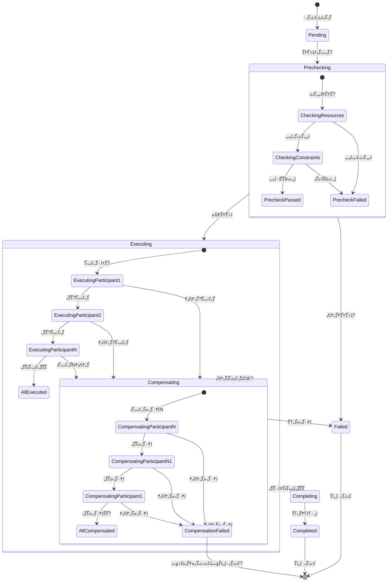
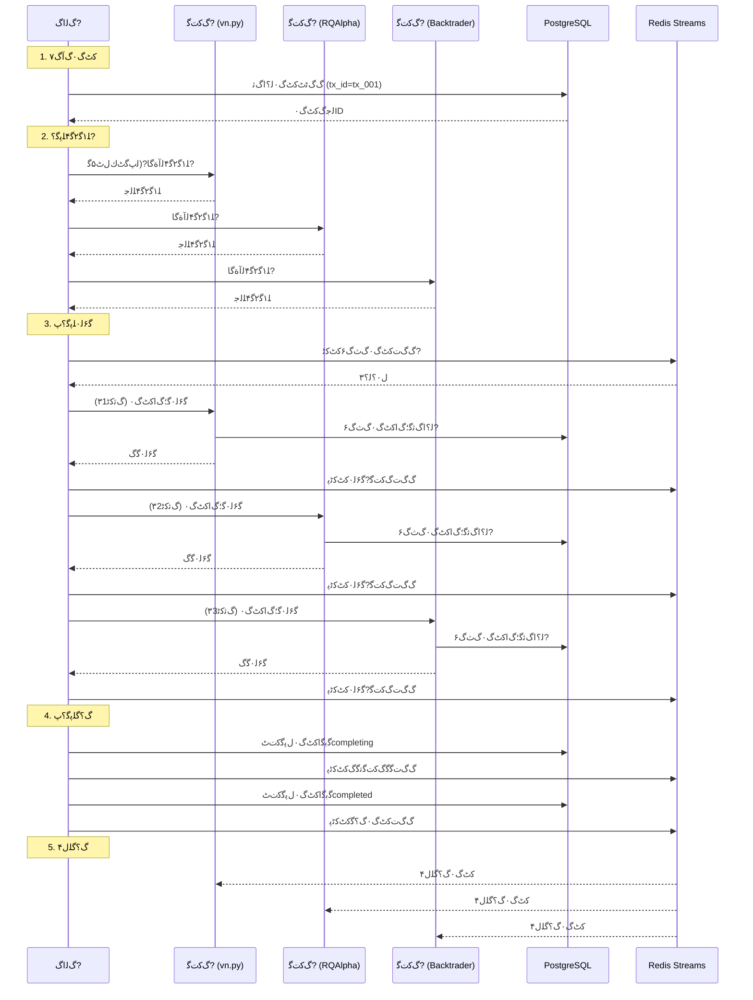
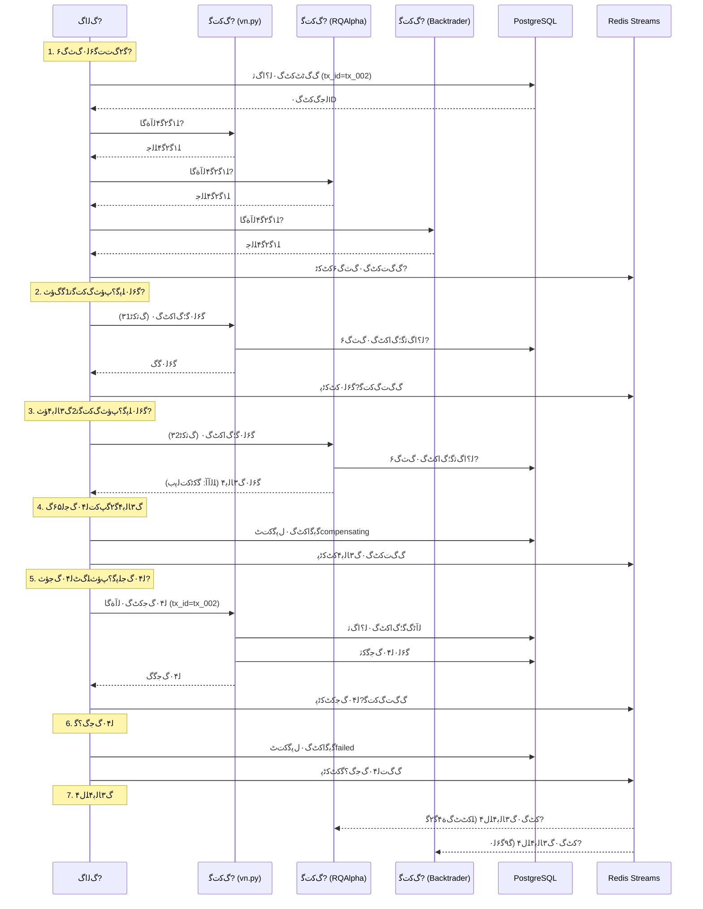
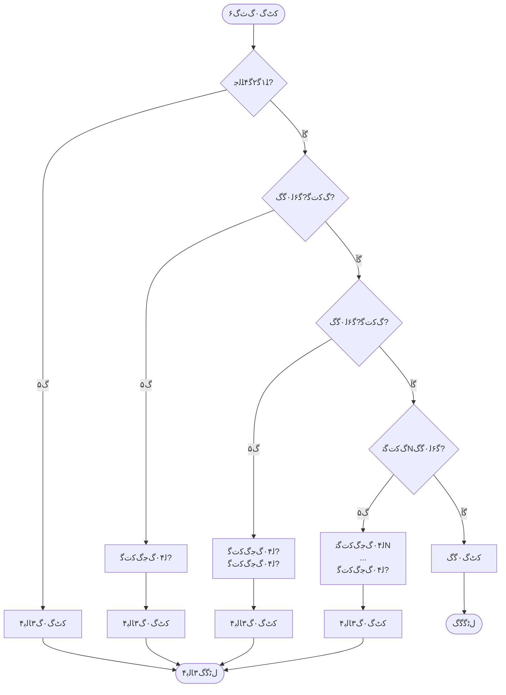
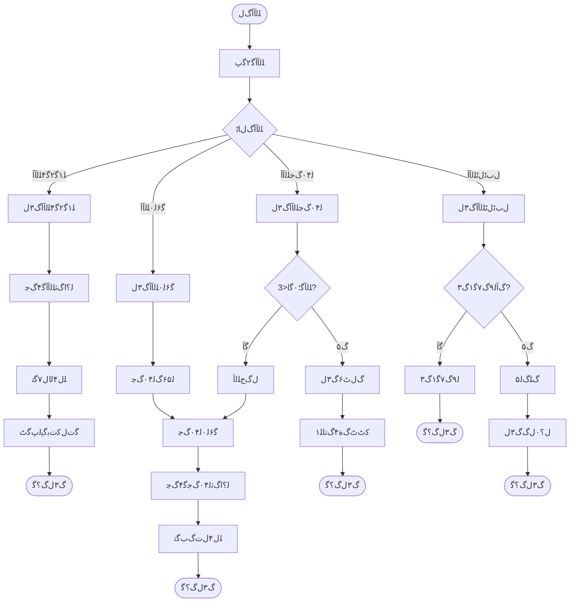
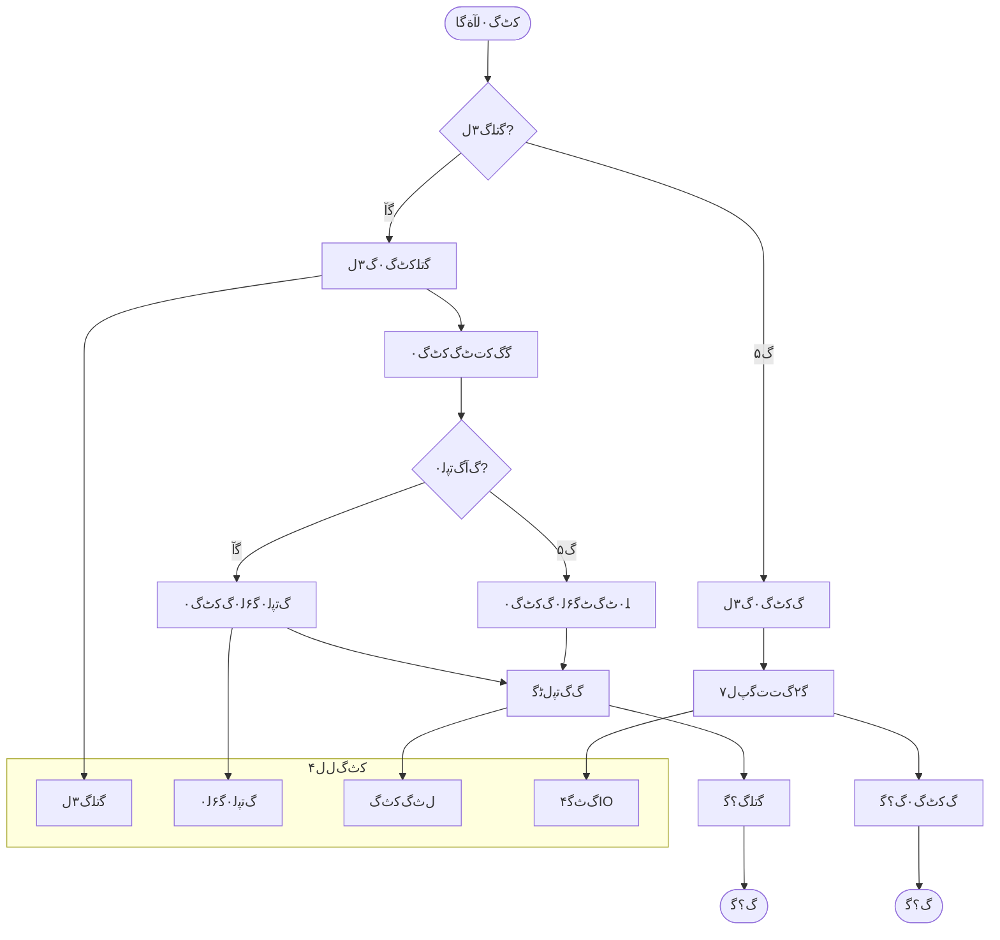

---


# Sagaﮔ۷۰ﮒﺙﮒ؟ﻝﺍﮔﭖﻝ۷ﮒ?

## 核心定位

提供SAGA模式的实现流程图，包含事务流程、补偿流程、状态转换等，支持SAGA事务实现。


> **核心职责**: 文档内容说明
> **职责边界**: 
> - ✅ 本文档负责：文档内容说明相关内容
> - ❌ 本文档不负责：其他模块内容


> ﮒ۳ﮒﺙﮔﮔﺍﮔ؟ﻛﺕﻟﺑﮔ۶Sagaﮔ۷۰ﮒﺙﻝﮒ؟ﮔﺑﻝﭘﮔﮔﭦﻛﺕﮔﭖﻝ۷ﮒﺝ
>
> **ﮔﺕﮒﺟﻝﭘﮔ?*: 6ﻛﺕ۹ﻛﺕﭨﻝﭘﮔﺅﺙ12ﻛﺕ۹ﻝﭘﮔﻟﺛ؛ﮔ?
> **ﮔﭖﻝ۷ﮒﺝﻝﺎﭨﮒ?*: Mermaidﻝﭘﮔﮒﺝ + ﮒﭦﮒﮒ?+ ﮔﺑﭨﮒ۷ﮒ?
> **ﻟ؟ﺝﻟ؟۰ﻝ؟ﮔ**: ﮔﺕﮔﺍﮒﺎﻝ۳ﭦSagaﮔ۷۰ﮒﺙﮒ؟ﮔﺑﻝﮒﺛﮒ۷ﮔ

**ﻝﮔ؛**: v1.0
**ﮔﺑﮔﺍ**: 2026-04-02
**Layer**: Layer 4 (ﮔ۶ﻟ۰ﮒﺎ?
**ﻛﺙﮒﻝﭦ?*: P1 - ﮔﭘﮔﻝﻟ۶۲ﮔﺕﮒﺟ

---


## 设计目标

### 主要目标

1. **功能完整性**: 确保文档内容完整，满足使用需求
2. **易用性**: 提高文档可读性，便于快速理解
3. **可维护性**: 文档结构清晰，便于后续维护
4. **一致性**: 确保文档格式和风格统一

### 质量目标

- 文档完整性: 100%
- 格式规范性: 100%
- 内容准确性: 100%


## 1. ﮔﺑﻛﺛﻝﭘﮔﮔﭦﮒ?

### 1.1 Mermaidﻝﭘﮔﮒﺝ



### 1.2 ﻝﭘﮔﻟﺁﺑﮔﻟ۰۷

| ﻝﭘﮔ?| ﮔﻟﺟﺍ | ﻟﺟﮒ۴ﮔ۰ﻛﭨﭘ | ﻠﮒﭦﮔ۰ﻛﭨ?|
|------|------|----------|----------|
| **Pending** | ﻛﭦﮒ۰ﮒﺓﺎﮒﮒﭨﭦﺅﺙﻝﮒﺝﮔ۶ﻟ۰ | ﮒﻟﺍﮒ۷ﮒﮒﭨﭦﮔﺍﻛﭦﮒ۰ | ﮒﺙﮒ۶ﻠ۱ﮔ۲ﮔ?|
| **Prechecking** | ﻠ۱ﮔ۲ﮔ۴ﻠﭘﮔ؟ﭖﺅﺙﻠ۹ﻟﺁﻟﭖﮔﭦﻛﺕﻝﭦ۵ﮔ?| ﻛﭨPendingﻝﭘﮔﮒﺙﮒ۶ﻠ۱ﮔ۲ﮔ?| ﻠ۱ﮔ۲ﮔ۴ﻠﻟﺟﮔﮒ۳ﺎﻟﺑ?|
| **Executing** | ﮔ۶ﻟ۰ﻠﭘﮔ؟ﭖﺅﺙﻠ۰ﭦﮒﭦﮔ۶ﻟ۰ﮒﮒﻛﺕﮔ?| ﻠ۱ﮔ۲ﮔ۴ﻠﻟﺟ | ﮔﮔﮒﻛﺕﮔﺗﮔﮒﮔﻛﭨﭨﻛﺛﮒ۳ﺎﻟﺑ?|
| **Completing** | ﮒ؟ﮔﻠﭘﮔ؟ﭖﺅﺙﻝ۰؟ﻟ؟۳ﻛﭦﮒ۰ﮒ؟ﮔ?| ﮔﮔﮒﻛﺕﮔﺗﮔ۶ﻟ۰ﮔﮒ | ﻝ۰؟ﻟ؟۳ﮒ؟ﮔﮔﻝ۰؟ﻟ؟۳ﮒ۳ﺎﻟﺑ?|
| **Compensating** | ﻟ۰۴ﮒﺟﻠﭘﮔ؟ﭖﺅﺙﮒﮔﭨﮒﺓﺎﮔ۶ﻟ۰ﮔﻛﺛ | ﻛﭨﭨﻛﺛﮒﻛﺕﮔﺗﮔ۶ﻟ۰ﮒ۳ﺎﻟﺑ?| ﮔﮔﻟ۰۴ﮒﺟﮒ؟ﮔﮔﻟ۰۴ﮒﺟﮒ۳ﺎﻟﺑ۴ |
| **Completed** | ﻛﭦﮒ۰ﮔﮒﮒ؟ﮔ | ﮒ؟ﮔﻠﭘﮔ؟ﭖﻝ۰؟ﻟ؟۳ﮔﮒ | ﻛﭦﮒ۰ﻝﭨﮔ |
| **Failed** | ﻛﭦﮒ۰ﮒ۳ﺎﻟﺑ۴ﺅﺙﻠ۱ﮔ۲ﮔ۴ﮒ۳ﺎﻟﺑ۴ﮔﻟ۰۴ﮒﺟﮒ؟ﮔﺅﺙ?| ﻠ۱ﮔ۲ﮔ۴ﮒ۳ﺎﻟﺑ۴ﮔﻟ۰۴ﮒﺟﮒ؟ﮔ | ﻛﭦﮒ۰ﻝﭨﮔ |
| **CompensationFailed** | ﻟ۰۴ﮒﺟﮒ۳ﺎﻟﺑ۴ﺅﺙﻠﻛﭦﭦﮒﺓ۴ﮒﺗﺎﻠ۱ﺅﺙ?| ﻟ۰۴ﮒﺟﮔﻛﺛﮒ۳ﺎﻟﺑ۴ | ﻛﭦﮒ۰ﻝﭨﮔﺅﺙﻠﻛﭦﭦﮒﺓ۴ﮒﺗﺎﻠ۱ﺅﺙ?|

---

## 2. ﮔ۲ﮒﺕﺕﮔ۶ﻟ۰ﮒﭦﮒﮒ?

### 2.1 Mermaidﮒﭦﮒﮒﺝﺅﺙﮔﮒﮒﭦﮔﺁﺅﺙ?



### 2.2 ﮒﭦﮒﮔ۴ﻠ۹۳ﻟﺁﺑﮔ

| ﮔ۴ﻠ۹۳ | ﮒﻛﺕﻟ?| ﮒ۷ﻛﺛ | ﮔﺍﮔ؟ | ﻝﭨﮔ |
|------|--------|------|------|------|
| **1.1** | ﮒﻟﺍﮒ?ﻗ?PostgreSQL | ﮒﮒﭨﭦﻛﭦﮒ۰ﻟ؟ﺍﮒﺛ | tx_id, transaction_type, initiator | ﻛﭦﮒ۰ID |
| **1.2** | PostgreSQL ﻗ?ﮒﻟﺍﮒ?| ﻟﺟﮒﻛﭦﮒ۰ID | tx_id | ﻛﭦﮒ۰ﮒﮒﭨﭦﮔﮒ |
| **2.1** | ﮒﻟﺍﮒ?ﻗ?ﮒﻛﺕﮔ? | ﻠ۱ﮔ۲ﮔ۴ﻟﺁﺓﮔﺎ?| tx_id, ﮔ۲ﮔ۴ﻠ۰ﺗ | ﻠ۱ﮔ۲ﮔ۴ﻝﭨﮔ?|
| **2.2** | ﮒﻛﺕﮔ? ﻗ?ﮒﻟﺍﮒ?| ﻠ۱ﮔ۲ﮔ۴ﮒﮒﭦ?| ﻠﻟﺟ/ﮒ۳ﺎﻟﺑ۴, ﮒﮒ | ﻟﭖﮔﭦﻠ۹ﻟﺁ |
| **3.1** | ﮒﻟﺍﮒ?ﻗ?Redis | ﮒﮒﺕﻛﭦﮒ۰ﮒﺙﮒ۶ﻛﭦﻛﭨ?| event_type, tx_id, ﮒﻛﺕﮔﺗﮒﻟ۰?| ﻛﭦﻛﭨﭘﮒﮒﺕﮔﮒ |
| **3.2** | ﮒﻟﺍﮒ?ﻗ?ﮒﻛﺕﮔ? | ﮔ۶ﻟ۰ﮔ؛ﮒﺍﻛﭦﮒ۰ | tx_id, ﮒﺛﻛﭨ۳ﻝﺎﭨﮒ, ﮒﺛﻛﭨ۳ﮔﺍﮔ؟ | ﮔ۶ﻟ۰ﻝﭨﮔ |
| **3.3** | ﮒﻛﺕﮔ? ﻗ?PostgreSQL | ﻟ؟ﺍﮒﺛﮔ؛ﮒﺍﻛﭦﮒ۰ | tx_id, ﮒﻛﺕﮔﺗID, ﮒﺛﻛﭨ۳ﮔﺍﮔ؟ | ﮔﻛﺗﮒﮔﮒ?|
| **3.4** | ﮒﻛﺕﮔ? ﻗ?ﮒﻟﺍﮒ?| ﮔ۶ﻟ۰ﮔﮒﮒﮒﭦ | tx_id, ﻝﭨﮔﮔﺍﮔ؟ | ﮔ؛ﮒﺍﻛﭦﮒ۰ﮒ؟ﮔ |
| **4.1** | ﮒﻟﺍﮒ?ﻗ?PostgreSQL | ﮔﺑﮔﺍﻛﭦﮒ۰ﻝﭘﮔ?| tx_id, status=completing | ﻝﭘﮔﮔﺑﮔ?|
| **4.2** | ﮒﻟﺍﮒ?ﻗ?Redis | ﮒﮒﺕﮔﮒﻛﭦﻛﭨﭘ | event_type, tx_id, ﮒﻛﺕﮔﺗﮒﻟ۰?| ﻛﭦﻛﭨﭘﮒﮒﺕ |
| **4.3** | ﮒﻟﺍﮒ?ﻗ?PostgreSQL | ﮔﻝﭨﻝﭘﮔﮔﺑﮔ?| tx_id, status=completed | ﻛﭦﮒ۰ﮒ؟ﮔ |
| **5.1** | Redis ﻗ?ﮔﮔﮒﻛﺕﮔﺗ | ﻛﭦﮒ۰ﮒ؟ﮔﻠﻝ۴ | event_type, tx_id | ﮒﻛﺕﮔﺗﮔﺕﻝﮔ؛ﮒﺍﻝﭘﮔ?|

---

## 3. ﻟ۰۴ﮒﺟﮔ۶ﻟ۰ﮒﭦﮒﮒ?

### 3.1 Mermaidﮒﭦﮒﮒﺝﺅﺙﮒ۳ﺎﻟﺑ۴ﮒﭦﮔﺁﺅﺙ?



### 3.2 ﻟ۰۴ﮒﺟﮒﭦﮒﮔ۴ﻠ۹۳ﻟﺁﺑﮔ

| ﮔ۴ﻠ۹۳ | ﮒﻛﺕﻟ?| ﮒ۷ﻛﺛ | ﮔﺍﮔ؟ | ﻝﭨﮔ |
|------|--------|------|------|------|
| **1.1-1.3** | ﮒﻟﺍﮒ?ﻗ?ﮒﮒﻛﺕﮔﺗ | ﻠ۱ﮔ۲ﮔ?| tx_id, ﮔ۲ﮔ۴ﻠ۰ﺗ | ﮒ۷ﻠ۷ﻠﻟﺟ |
| **2.1** | ﮒﻟﺍﮒ?ﻗ?ﮒﻛﺕﮔ? | ﮔ۶ﻟ۰ﮔ؛ﮒﺍﻛﭦﮒ۰ | tx_id, ﮒﺛﻛﭨ۳1 | ﮔ۶ﻟ۰ﮔﮒ |
| **2.2** | ﮒﻛﺕﮔ? ﻗ?PostgreSQL | ﻟ؟ﺍﮒﺛﮔ؛ﮒﺍﻛﭦﮒ۰ | tx_id, ﮒﻛﺕﮔ?, ﮒﺛﻛﭨ۳1 | ﮔﻛﺗﮒﮔﮒ?|
| **3.1** | ﮒﻟﺍﮒ?ﻗ?ﮒﻛﺕﮔ? | ﮔ۶ﻟ۰ﮔ؛ﮒﺍﻛﭦﮒ۰ | tx_id, ﮒﺛﻛﭨ۳2 | ﮔ۶ﻟ۰ﮒ۳ﺎﻟﺑ۴ﺅﺙﮔﻛﭨﻛﺕﻟﭘﺏﺅﺙ |
| **3.2** | ﮒﻛﺕﮔ? ﻗ?ﮒﻟﺍﮒ?| ﮒ۳ﺎﻟﺑ۴ﮒﮒﭦ | tx_id, ﻠﻟﺁﺁﻛﺟ۰ﮔﺁ | ﻟ۶۵ﮒﻟ۰۴ﮒﺟ |
| **4.1** | ﮒﻟﺍﮒ?ﻗ?PostgreSQL | ﮔﺑﮔﺍﻝﭘﮔﻛﺕﭦcompensating | tx_id, status=compensating | ﻝﭘﮔﮔﺑﮔ?|
| **4.2** | ﮒﻟﺍﮒ?ﻗ?Redis | ﮒﮒﺕﮒ۳ﺎﻟﺑ۴ﻛﭦﻛﭨﭘ | event_type=failed, tx_id, ﻠﻟﺁﺁﮒﮒ | ﻛﭦﻛﭨﭘﮒﮒﺕ |
| **5.1** | ﮒﻟﺍﮒ?ﻗ?ﮒﻛﺕﮔ? | ﻟ۰۴ﮒﺟﻛﭦﮒ۰ﻟﺁﺓﮔﺎ | tx_id, ﻟ۰۴ﮒﺟﮒﺛﻛﭨ۳ | ﻟﺁﭨﮒﮔ؛ﮒﺍﻟ؟ﺍﮒﺛ |
| **5.2** | ﮒﻛﺕﮔ? ﻗ?PostgreSQL | ﻟﺁﭨﮒﮔ؛ﮒﺍﻛﭦﮒ۰ﻟ؟ﺍﮒﺛ | tx_id, ﮒﻛﺕﮔ? | ﻟﺓﮒﮒﮒﺛﻛﭨ?|
| **5.3** | ﮒﻛﺕﮔ? ﻗ?PostgreSQL | ﮔ۶ﻟ۰ﻟ۰۴ﮒﺟﮔﻛﺛ | tx_id, ﮒﮒﮔﻛﺛ | ﻟ۰۴ﮒﺟﮔﮒ |
| **5.4** | ﮒﻛﺕﮔ? ﻗ?ﮒﻟﺍﮒ?| ﻟ۰۴ﮒﺟﮔﮒﮒﮒﭦ | tx_id, ﻟ۰۴ﮒﺟﻝﭨﮔ | ﻟ۰۴ﮒﺟﮒ؟ﮔ |
| **6.1** | ﮒﻟﺍﮒ?ﻗ?PostgreSQL | ﮔﺑﮔﺍﻝﭘﮔﻛﺕﭦfailed | tx_id, status=failed | ﮔﻝﭨﻝﭘﮔ?|
| **7.1** | Redis ﻗ?ﮒﮒﻛﺕﮔﺗ | ﮒ۳ﺎﻟﺑ۴ﻠﻝ۴ | event_type=failed, tx_id | ﮔﺕﻝﻝﭘﮔ?|

---

## 4. ﮔﺑﭨﮒ۷ﮒﺝﺅﺙﻛﺕﮒ۰ﮔﭖﻝ۷ﺅﺙ?

### 4.1 Mermaidﮔﺑﭨﮒ۷ﮒ?


### 4.2 ﮔﺑﭨﮒ۷ﻟﻝﺗﻟﺁﺑﮔ

| ﻟﻝﺗ | ﻝﺎﭨﮒ | ﮔﻟﺟﺍ | ﻟﺝﮒ۴ | ﻟﺝﮒﭦ |
|------|------|------|------|------|
| **CreateTransaction** | ﮔﻛﺛ | ﮒﮒﭨﭦSagaﻛﭦﮒ۰ﻟ؟ﺍﮒﺛ | ﻛﭦﮒ۰ﻟﺁﺓﮔﺎ | ﻛﭦﮒ۰ID |
| **Precheck** | ﮒﺏﻝ | ﻠ۱ﮔ۲ﮔ۴ﮔﮔﮒﻛﺕﮔﺗ | ﻛﭦﮒ۰ID | ﻠﻟﺟ/ﮒ۳ﺎﻟﺑ۴ |
| **Execute** | ﮔﻛﺛ | ﮔ۶ﻟ۰ﮒﻛﺕﮔﺗﮔ؛ﮒﺍﻛﭦﮒ?| ﮒﺛﻛﭨ۳ﮔﺍﮔ؟ | ﮔ۶ﻟ۰ﻝﭨﮔ |
| **CheckResult** | ﮒﺏﻝ | ﮔ۲ﮔ۴ﮔ۶ﻟ۰ﻝﭨﮔ?| ﮔ۶ﻟ۰ﻝﭨﮔ | ﮔﮒ/ﮒ۳ﺎﻟﺑ۴ |
| **MoreParticipants** | ﮒﺏﻝ | ﮔ۲ﮔ۴ﮔﺁﮒ۵ﻟﺟﮔﮒﻛﺕﮔﺗ | ﮒﻛﺕﮔﺗﮒﻟ۰?| ﮔ?ﮒ?|
| **Confirm** | ﮔﻛﺛ | ﻝ۰؟ﻟ؟۳ﻛﭦﮒ۰ﮒ؟ﮔ | ﮔﮔﮔﮒﻝﭨﮔ?| ﻝ۰؟ﻟ؟۳ﻝﭨﮔ |
| **TriggerCompensation** | ﮔﻛﺛ | ﻟ۶۵ﮒﻟ۰۴ﮒﺟﮔﭦﮒﭘ | ﮒ۳ﺎﻟﺑ۴ﮒﻛﺕﮔﺗID | ﻟ۰۴ﮒﺟﻟ؟۰ﮒ |
| **ReverseOrder** | ﮔﻛﺛ | ﻝ۰؟ﮒ؟ﻠﮒﭦﻟ۰۴ﮒﺟﻠ۰ﭦﮒﭦ | ﮒﺓﺎﮔ۶ﻟ۰ﮒﻛﺕﮔﺗﮒﻟ۰۷ | ﻟ۰۴ﮒﺟﻠ۰ﭦﮒﭦ |
| **Compensate** | ﮔﻛﺛ | ﮔ۶ﻟ۰ﻟ۰۴ﮒﺟﻛﭦﮒ۰ | ﻟ۰۴ﮒﺟﮒﺛﻛﭨ۳ | ﻟ۰۴ﮒﺟﻝﭨﮔ |
| **CheckCompensation** | ﮒﺏﻝ | ﮔ۲ﮔ۴ﻟ۰۴ﮒﺟﻝﭨﮔ?| ﻟ۰۴ﮒﺟﻝﭨﮔ | ﮔﮒ/ﮒ۳ﺎﻟﺑ۴ |
| **MoreToCompensate** | ﮒﺏﻝ | ﮔ۲ﮔ۴ﮔﺁﮒ۵ﻟﺟﮔﻠﻟ۰۴ﮒﺟ | ﻟ۰۴ﮒﺟﮒﻟ۰۷ | ﮔ?ﮒ?|
| **ManualIntervention** | ﮔﻛﺛ | ﻛﭦﭦﮒﺓ۴ﮒﺗﺎﻠ۱ﮒ۳ﻝ | ﻟ۰۴ﮒﺟﮒ۳ﺎﻟﺑ۴ﻛﺟ۰ﮔﺁ | ﻛﭦﭦﮒﺓ۴ﮒ۳ﻝﻝﭨﮔ |

---

## 5. ﮔﺍﮔ؟ﮔﭖﮒﺝ

### 5.1 Mermaidﮔﺍﮔ؟ﮔﭖﮒﺝ

```mermaid
graph TD
    subgraph "ﮒﺙﮔﮒﺎ?
        E1[vn.pyﮒﺙﮔ]
        E2[RQAlphaﮒﺙﮔ]
        E3[Backtraderﮒﺙﮔ]
        E4[QMTﮒﺙﮔ]
        E5[backtesting.pyﮒﺙﮔ]
    end
    
    subgraph "ﻠﻠﮒ۷ﮒﺎ"
        A1[vn.pyﻠﻠﮒ۷]
        A2[RQAlphaﻠﻠﮒ۷]
        A3[Backtraderﻠﻠﮒ۷]
        A4[QMTﻠﻠﮒ۷]
        A5[backtesting.pyﻠﻠﮒ۷]
    end
    
    subgraph "Sagaﮒﺎ?
        P1[Sagaﮒﻛﺕﮔ?]
        P2[Sagaﮒﻛﺕﮔ?]
        P3[Sagaﮒﻛﺕﮔ?]
        P4[Sagaﮒﻛﺕﮔ?]
        P5[Sagaﮒﻛﺕﮔ?]
        C[Sagaﮒﻟﺍﮒ۷]
    end
    
subgraph "ﮒﮒ۷ﮒﺎ?
        DB[PostgreSQL]
        Redis[Redis Streams]
    end
    
    subgraph "ﻝﮔ۶ﮒﺎ?
        Monitor[ﻝﮔ۶ﻝﺏﭨﻝﭨ]
Alert[ﮒﻟ۵ﻝﺏﭨﻝﭨ]
    end
    
    E1 --> A1
    E2 --> A2
    E3 --> A3
    E4 --> A4
    E5 --> A5
    
    A1 --> P1
    A2 --> P2
    A3 --> P3
    A4 --> P4
    A5 --> P5
    
    P1 --> C
    P2 --> C
    P3 --> C
    P4 --> C
    P5 --> C
    
    C --> DB
    C --> Redis
    
    Redis --> P1
    Redis --> P2
    Redis --> P3
    Redis --> P4
    Redis --> P5
    
    DB --> Monitor
    Redis --> Monitor
    Monitor --> Alert
    
    style C fill:#e1f5e1
    style DB fill:#f0f8ff
    style Redis fill:#fff0f5
    style Monitor fill:#fffacd
```

### 5.2 ﮔﺍﮔ؟ﮔﭖﻟﺁﺑﮔ?

| ﮔﺍﮔ؟ﮔﭖ?| ﮔﺗﮒ | ﮔﺍﮔ؟ﻝﺎﭨﮒ | ﻠ۱ﻝ | ﮒ۳۶ﮒﺍ |
|--------|------|----------|------|------|
| **ﮒﺙﮔﻗﻠﻠﮒ?* | ﮒﮒ | ﮒﺙﮔﮒﻝﮔﺍﮔ؟ | ﮒ؟ﮔﭘ | 1KB-1MB |
| **ﻠﻠﮒ۷ﻗﮒﻛﺕﮔ?* | ﮒﮒ | ﻝﭨﻛﺕﮔﺍﮔ؟ﮔ۷۰ﮒ | ﻛﭦﮒ۰ﻟ۶۵ﮒ | 1KB-10KB |
| **ﮒﻛﺕﮔﺗﻗﮒﻟﺍﮒ?* | ﮒﮒ | ﮒﺛﻛﭨ۳/ﮒﮒﭦ | ﻛﭦﮒ۰ﮔ۴ﻠ۹۳ | 1KB-5KB |
| **ﮒﻟﺍﮒ۷ﻗPostgreSQL** | ﮒﮒ | ﻛﭦﮒ۰ﻝﭘﮔ?| ﻝﭘﮔﮒﮔ?| 1KB-2KB |
| **ﮒﻟﺍﮒ۷ﻗRedis** | ﮒﮒ | ﻛﭦﻛﭨﭘﮔﭘﮔﺁ | ﻛﭦﻛﭨﭘﻟ۶۵ﮒ | 1KB-5KB |
| **Redisﻗﮒﻛﺕﮔﺗ** | ﮒﮒ | ﻛﭦﻛﭨﭘﻠﻝ۴ | ﻛﭦﻛﭨﭘﮒﮒﺕ | 1KB-2KB |
| **ﮒﮒ۷ﻗﻝﮔ?* | ﮒﮒ | ﻝﮔ۶ﮔﮔ | ﮒ؟ﮔﻟﺛ؟ﻟﺁ۱ | 1KB-10KB |

---

## 6. ﮒﺏﻠ؟ﮒﺏﻝﻝﺗﮔﭖﻝ۷ﮒﺝ

### 6.1 Mermaidﮒﺏﻝﮔﭖﻝ۷ﮒ?



### 6.2 ﮒﺏﻝﻝﺗﻟﺁﺑﮔ?

| ﮒﺏﻝﻝ?| ﮔ۰ﻛﭨﭘ | ﮔﺁﻟﺓﺁﮒﺝ?| ﮒ۵ﻟﺓﺁﮒﺝ?| ﮒ۳ﮔﺏ۷ |
|--------|------|--------|--------|------|
| **D1** | ﮔﮔﮒﻛﺕﮔﺗﻠ۱ﮔ۲ﮔ۴ﻠﻟﺟ | ﻟﺟﮒ۴ﮔ۶ﻟ۰ﻠﭘﮔ؟ﭖ | ﻛﭦﮒ۰ﻝ،ﮒﺏﮒ۳ﺎﻟﺑ۴ | ﻠﺟﮒﮔﮔﻛﭦﮒ۰ﮔ۶ﻟ۰ |
| **D2** | ﮒﻛﺕﮔ?ﮔ؛ﮒﺍﻛﭦﮒ۰ﮔ۶ﻟ۰ﮔﮒ | ﻝﭨ۶ﻝﭨﮒﻛﺕﮔ? | ﻟ۰۴ﮒﺟﮒﻛﺕﮔ? | ﻝ؛؛ﻛﺕﻛﺕ۹ﮒﻛﺕﮔﺗﮒ۳ﺎﻟﺑ۴ﮒ۹ﻠﻟ۰۴ﮒﺟﻟ۹ﮒﺓﺎ |
| **D3** | ﮒﻛﺕﮔ?ﮔ؛ﮒﺍﻛﭦﮒ۰ﮔ۶ﻟ۰ﮔﮒ | ﻝﭨ۶ﻝﭨﮒﻛﺕﮔ? | ﻟ۰۴ﮒﺟﮒﻛﺕﮔ?ﻗﮒﻛﺕﮔﺗ1 | ﻠﮒﭦﻟ۰۴ﮒﺟﮒﺓﺎﮔ۶ﻟ۰ﻝﮒﻛﺕﮔ?|
| **D4** | ﮒﻛﺕﮔﺗNﮔ؛ﮒﺍﻛﭦﮒ۰ﮔ۶ﻟ۰ﮔﮒ | ﻛﭦﮒ۰ﮔﮒ | ﻟ۰۴ﮒﺟﮒﻛﺕﮔﺗNﻗ?..ﻗﮒﻛﺕﮔﺗ1 | ﮔﮒﻛﺕﻛﺕ۹ﮒﻛﺕﮔﺗﮒ۳ﺎﻟﺑ۴ﻠﻟ۰۴ﮒﺟﮔﮔ?|

---

## 7. ﻠﻟﺁﺁﮒ۳ﻝﮔﭖﻝ۷ﮒ?

### 7.1 Mermaidﻠﻟﺁﺁﮒ۳ﻝﮒ?



### 7.2 ﻠﻟﺁﺁﮒ۳ﻝﻝﻝ۴

| ﻠﻟﺁﺁﻝﺎﭨﮒ | ﮔ۲ﮔﭖﮔﺗﮒﺙ?| ﮒ۳ﻝﻝﻝ۴ | ﮔ۱ﮒ۳ﻝ؟ﮔ | ﻝﮔ۶ﮔﮔ |
|----------|----------|----------|----------|----------|
| **ﻠ۱ﮔ۲ﮔ۴ﻠﻟﺁ?* | ﻠ۱ﮔ۲ﮔ۴ﮒﮒﭦ?| ﻝ،ﮒﺏﮒ۳ﺎﻟﺑ۴ﺅﺙﻛﺕﮔ۶ﻟ۰ﻛﭦﮒ۰ | ﻠﺟﮒﮔﮔﮔﻛﺛ | ﻠ۱ﮔ۲ﮔ۴ﮒ۳ﺎﻟﺑ۴ﻝ |
| **ﮔ۶ﻟ۰ﻠﻟﺁﺁ** | ﮔ۶ﻟ۰ﮒﮒﭦﻟﭘﮔﭘ/ﮒ۳ﺎﻟﺑ۴ | ﻟ۶۵ﮒﻟ۰۴ﮒﺟﻛﭦﮒ۰ | ﮔﺍﮔ؟ﻛﺕﻟﺑﮔ?| ﮔ۶ﻟ۰ﮒ۳ﺎﻟﺑ۴ﻝ?|
| **ﻟ۰۴ﮒﺟﻠﻟﺁﺁ** | ﻟ۰۴ﮒﺟﮒﮒﭦﻟﭘﮔﭘ/ﮒ۳ﺎﻟﺑ۴ | ﻠﻟﺁﮔﭦﮒﭘﺅﺙﮔﮒ۳?ﮔ؛۰ﺅﺙ | ﮔﻝﭨﻛﺕﻟﺑﮔ?| ﻟ۰۴ﮒﺟﮒ۳ﺎﻟﺑ۴ﻝ?|
| **ﻝﺏﭨﻝﭨﻠﻟﺁﺁ** | ﮒ۴ﮒﭦﺓﮔ۲ﮔ۴ﻙﮒﺙﮒﺕﺕﻝﮔ?| ﻟ۹ﮒ۷ﮔ۱ﮒ۳ﮔﻛﭦﭦﮒﺓ۴ﮒﺗﺎﻠ۱?| ﻝﺏﭨﻝﭨﮒﺁﻝ۷ﮔ?| ﻝﺏﭨﻝﭨﮒﺁﻝ۷ﻝ?|

---

## 8. ﮔ۶ﻟﺛﻛﺙﮒﮔﭖﻝ۷ﮒ?

### 8.1 Mermaidﮔ۶ﻟﺛﻛﺙﮒﮒ?



### 8.2 ﻛﺙﮒﻝﻝ۴ﻟﺁﺑﮔ

| ﻛﺙﮒﻝﻝ۴ | ﻠﻝ۷ﮒﭦﮔﺁ | ﮒ؟ﻝﺍﮔﺗﮒﺙ | ﻠ۱ﮔﮔﭘﻝ | ﻠ۲ﻠ۸ |
|----------|----------|----------|----------|------|
| **ﮔﺗﻠﮒ۳ﻝ** | ﮒ۳۶ﻠﮒﺍﻛﭦﮒ?| ﻛﭦﮒ۰ﮒﻝﭨﺅﺙﮔﺗﻠﮔﻛﭦ?| ﮒﮒﻠﮔﮒ?0-80% | ﮔﺗﻠﮒ۳ﺎﻟﺑ۴ﮒﺛﺎﮒﻟﮒﺑﮒ۳?|
| **ﮒﺗﭘﻟ۰ﮔ۶ﻟ۰** | ﮔﻛﺝﻟﭖﻝﮒﻛﭦﮒ?| ﮒ۳ﻝﭦﺟﻝ۷?ﮒﻝ۷ﮒﺗﭘﻟ۰ | ﮒﭨﭘﻟﺟﻠﻛﺛ30-60% | ﻟﭖﮔﭦﻝ،ﻛﭦﺅﺙﮒ۳ﮔﮒﭦ۵ﮒ۱ﮒ |
| **ﻝﺙﮒﻛﺙﮒ** | ﻠ،ﻠ۱ﻟﺁﭨﮒﮔﺍﮔ؟ | Redisﻝﺙﮒﻝﻝﺗﮔﺍﮔ؟ | ﻟﺁﭨﮒﮒﭨﭘﻟﺟﻠﻛﺛ90% | ﻝﺙﮒﻛﺕﻟﺑﮔ۶ﻝﭨﺑﮔ?|
| **ﮒﺙﮔ۴IO** | ﻝﺛﻝﭨ/ﻝ۲ﻝIO | ﮒﺙﮔ۴ﻠﻠﭨﮒ۰ﻟﺍﻝ?| CPUﮒ۸ﻝ۷ﻝﮔﮒ?| ﮒﺙﮔ۴ﻝﺙﻝ۷ﮒ۳ﮔﮒﭦ?|

---

## ﻠﮒﺛﺅﺙﮔﭖﻝ۷ﮒﺝﻛﺛﺟﻝ۷ﻟﺁﺑﮔ

### ﻛﺛﺟﻝ۷ﮒﭦﮔﺁ

1. **ﮔﭘﮔﻟ؟ﺝﻟ؟۰ﻟﺁﮒ؟۰**: ﻛﺛﺟﻝ۷ﮔﺑﻛﺛﻝﭘﮔﮔﭦﮒﺝﻝﻟ۶۲Sagaﮔ۷۰ﮒﺙﮒ؟ﮔﺑﻝﮒﺛﮒ۷ﮔ
2. **ﮒﺙﮒﮒ؟ﮔﺛﮔﮒﺁ?*: ﻛﺛﺟﻝ۷ﮒﭦﮒﮒﺝﮔﻝ۰؟ﮒﻝﭨﻛﭨﭘﻛﭦ۳ﻛﭦﮔﭘﮒﭦ
3. **ﮔﻠﮔﮔ۴ﮒﻟ?*: ﻛﺛﺟﻝ۷ﻠﻟﺁﺁﮒ۳ﻝﮔﭖﻝ۷ﮒﺝﮒ؟ﻛﺛﻠ؟ﻠ۱ﮒ۳ﻝﻟﺓﺁﮒﺝ?
4. **ﮔ۶ﻟﺛﻛﺙﮒﮒﮔ**: ﻛﺛﺟﻝ۷ﮔ۶ﻟﺛﻛﺙﮒﮔﭖﻝ۷ﮒﺝﻟﺁﮒ،ﻛﺙﮒﮔﭦﻛﺙ?

### ﻝﮔ؛ﻝ؟۰ﻝ

- **v1.0.0**: ﮒﭦﻝ۰ﮔﭖﻝ۷ﮒﺝﻠﺅﺙﮔﭘﭖﻝﻛﺕﭨﻟ۵ﮒﭦﮔ?
- **v1.1.0**: ﮒ۱ﮒQMTﮒﺙﮔﻝﺗﮒ؟ﮔﭖﻝ۷ﮒ?
- **v1.2.0**: ﮒ۱ﮒﮒﮒﺕﮒﺙﻠ۷ﻝﺛﺎﮔﭖﻝ۷ﮒﺝ
- **v2.0.0**: ﻛﭦ۳ﻛﭦﮒﺙﮒﺁﻟ۶ﮒﮔﭖﻝ۷ﮒ?

### ﮒﻟ۶ﮔ۲ﮔ?

- ﻗ?ﻝﭘﮔﮔﭦﮒ؟ﮔﺑﻟ۵ﻝﮔﮔﻛﺕﮒ۰ﮒﭦﮔ?
- ﻗ?ﮒﭦﮒﮒﺝﮔﻝ۰؟ﮒﺎﻝ۳ﭦﻝﭨﻛﭨﭘﻛﭦ۳ﻛﭦ?
- ﻗ?ﻠﻟﺁﺁﮒ۳ﻝﻟﺓﺁﮒﺝﮔﺕﮔﺍﮒﺁﻟ۰
- ﻗ?ﮔ۶ﻟﺛﻛﺙﮒﻝﻝ۴ﮒ؟ﻠﮔﮔ
- ﻗ?ﻝ؛۵ﮒﻛﺕﻛﺕﮔﭦﮔﮔﮔ۰۲ﮔﮒ

---

**ﮔﮔ۰۲ﻝﮔ؛ﮒﮒﺎ**:
- v1.0.0 (2026-04-02): ﮒﮒ۶ﻝﮔ؛ﺅﺙﮒ؟ﮔﺑﮔﭖﻝ۷ﮒﺝﻠ?

**ﮒ؟۰ﮔﺕﻟ؟ﺍﮒﺛ**:
- ﮔﭘﮔﮒ؟۰ﮔﺕ: ﻠ۵ﮒﺕﻟﮒﺝﮔﭘﮔﮒﺕ?
- ﮔﮔﺁﮒ؟۰ﮔ? ﮒﺝﮒ؟۰ﮔ?
- ﮔﭖﻝ۷ﮒﺝﮒ؟۰ﮔ? ﮒﺝﮒ؟۰ﮔ?

**ﻝﮔﮒﺓ۴ﮒﺓ**:
- ﮔﭖﻝ۷ﮒ? Mermaid.js
- ﻝﺙﻟﺝﮒﺓ۴ﮒﺓ: Markdown + ﻛﺕﻛﺕﮒﺝﻟ۰۷ﮒﺓ۴ﮒﺓ
- ﻝﮔ؛ﮔ۶ﮒﭘ: Git + ﮔﮔ۰۲ﻝ؟۰ﻝﻝﺏﭨﻝﭨ
