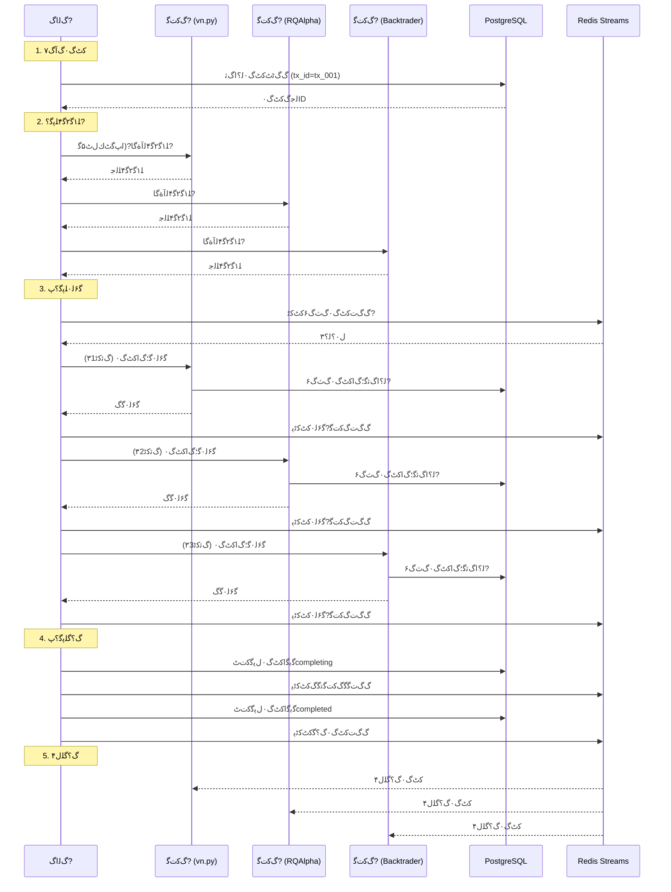
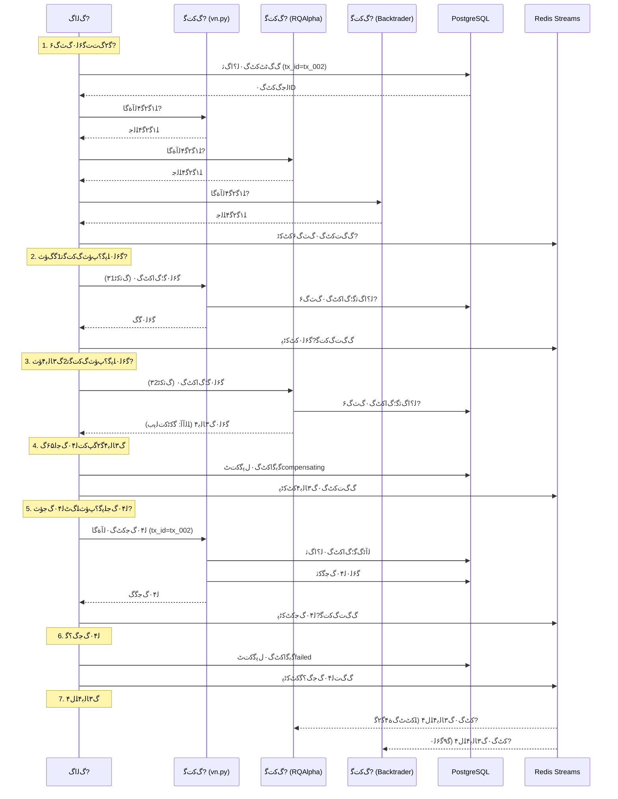
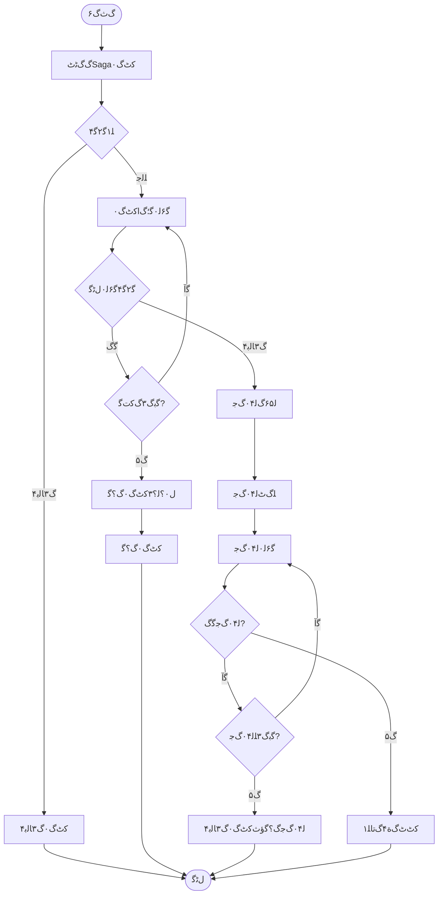

## 1. ﮔ•ﺑﻛﺛ“ﻝŠﭘﮔ€ﮔœﭦﮒ›?

### 1.1 MermaidﻝŠﭘﮔ€ﮒ›ﺝ


### 1.2 ﻝŠﭘﮔ€ﻟﺁﺑﮔ˜Žﻟ۰۷

| ﻝŠﭘﮔ€?| ﮔﻟﺟﺍ | ﻟﺟ›ﮒ…۴ﮔ۰ﻛﭨﭘ | ﻠ€€ﮒ‡ﭦﮔ۰ﻛﭨ?|
|------|------|----------|----------|
| **Pending** | ﻛﭦ‹ﮒŠ۰ﮒﺓﺎﮒˆ›ﮒﭨﭦﺅﺙŒﻝ­‰ﮒﺝ…ﮔ‰۶ﻟ۰Œ | ﮒﻟﺍƒﮒ™۷ﮒˆ›ﮒﭨﭦﮔ–ﺍﻛﭦ‹ﮒŠ۰ | ﮒﺙ€ﮒ۶‹ﻠ۱„ﮔ۲€ﮔŸ?|
| **Prechecking** | ﻠ۱„ﮔ۲€ﮔŸ۴ﻠ˜ﭘﮔ؟ﭖﺅﺙŒﻠ۹Œﻟﺁﻟﭖ„ﮔﭦﻛﺕŽﻝﭦ۵ﮔ?| ﻛﭨŽPendingﻝŠﭘﮔ€ﮒﺙ€ﮒ۶‹ﻠ۱„ﮔ۲€ﮔŸ?| ﻠ۱„ﮔ۲€ﮔŸ۴ﻠ€šﻟﺟ‡ﮔˆ–ﮒ۳ﺎﻟﺑ?|
| **Executing** | ﮔ‰۶ﻟ۰Œﻠ˜ﭘﮔ؟ﭖﺅﺙŒﻠ۰ﭦﮒﭦﮔ‰۶ﻟ۰Œﮒ„ﮒ‚ﻛﺕŽﮔ–?| ﻠ۱„ﮔ۲€ﮔŸ۴ﻠ€šﻟﺟ‡ | ﮔ‰€ﮔœ‰ﮒ‚ﻛﺕŽﮔ–ﺗﮔˆﮒŠŸﮔˆ–ﻛﭨﭨﻛﺛ•ﮒ۳ﺎﻟﺑ?|
| **Completing** | ﮒ؟Œﮔˆﻠ˜ﭘﮔ؟ﭖﺅﺙŒﻝ۰؟ﻟ؟۳ﻛﭦ‹ﮒŠ۰ﮒ؟Œﮔˆ?| ﮔ‰€ﮔœ‰ﮒ‚ﻛﺕŽﮔ–ﺗﮔ‰۶ﻟ۰ŒﮔˆﮒŠŸ | ﻝ۰؟ﻟ؟۳ﮒ؟Œﮔˆﮔˆ–ﻝ۰؟ﻟ؟۳ﮒ۳ﺎﻟﺑ?|
| **Compensating** | ﻟ۰۴ﮒﺟﻠ˜ﭘﮔ؟ﭖﺅﺙŒﮒ›žﮔﭨšﮒﺓﺎﮔ‰۶ﻟ۰Œﮔ“ﻛﺛœ | ﻛﭨﭨﻛﺛ•ﮒ‚ﻛﺕŽﮔ–ﺗﮔ‰۶ﻟ۰Œﮒ۳ﺎﻟﺑ?| ﮔ‰€ﮔœ‰ﻟ۰۴ﮒﺟﮒ؟Œﮔˆﮔˆ–ﻟ۰۴ﮒﺟﮒ۳ﺎﻟﺑ۴ |
| **Completed** | ﻛﭦ‹ﮒŠ۰ﮔˆﮒŠŸﮒ؟Œﮔˆ | ﮒ؟Œﮔˆﻠ˜ﭘﮔ؟ﭖﻝ۰؟ﻟ؟۳ﮔˆﮒŠŸ | ﻛﭦ‹ﮒŠ۰ﻝﭨ“ﮔŸ |
| **Failed** | ﻛﭦ‹ﮒŠ۰ﮒ۳ﺎﻟﺑ۴ﺅﺙˆﻠ۱„ﮔ۲€ﮔŸ۴ﮒ۳ﺎﻟﺑ۴ﮔˆ–ﻟ۰۴ﮒﺟﮒ؟Œﮔˆﺅﺙ?| ﻠ۱„ﮔ۲€ﮔŸ۴ﮒ۳ﺎﻟﺑ۴ﮔˆ–ﻟ۰۴ﮒﺟﮒ؟Œﮔˆ | ﻛﭦ‹ﮒŠ۰ﻝﭨ“ﮔŸ |
| **CompensationFailed** | ﻟ۰۴ﮒﺟﮒ۳ﺎﻟﺑ۴ﺅﺙˆﻠœ€ﻛﭦﭦﮒﺓ۴ﮒﺗﺎﻠ۱„ﺅﺙ?| ﻟ۰۴ﮒﺟﮔ“ﻛﺛœﮒ۳ﺎﻟﺑ۴ | ﻛﭦ‹ﮒŠ۰ﻝﭨ“ﮔŸﺅﺙˆﻠœ€ﻛﭦﭦﮒﺓ۴ﮒﺗﺎﻠ۱„ﺅﺙ?|

---

## 2. ﮔ­۲ﮒﺕﺕﮔ‰۶ﻟ۰Œﮒﭦﮒˆ—ﮒ›?

### 2.1 Mermaidﮒﭦﮒˆ—ﮒ›ﺝﺅﺙˆﮔˆﮒŠŸﮒœﭦﮔ™ﺁﺅﺙ?



### 2.2 ﮒﭦﮒˆ—ﮔ­۴ﻠ۹۳ﻟﺁﺑﮔ˜Ž

| ﮔ­۴ﻠ۹۳ | ﮒ‚ﻛﺕŽﻟ€?| ﮒŠ۷ﻛﺛœ | ﮔ•ﺍﮔ؟ | ﻝﭨ“ﮔžœ |
|------|--------|------|------|------|
| **1.1** | ﮒﻟﺍƒﮒ™?ﻗ†?PostgreSQL | ﮒˆ›ﮒﭨﭦﻛﭦ‹ﮒŠ۰ﻟ؟ﺍﮒﺛ• | tx_id, transaction_type, initiator | ﻛﭦ‹ﮒŠ۰ID |
| **1.2** | PostgreSQL ﻗ†?ﮒﻟﺍƒﮒ™?| ﻟﺟ”ﮒ›žﻛﭦ‹ﮒŠ۰ID | tx_id | ﻛﭦ‹ﮒŠ۰ﮒˆ›ﮒﭨﭦﮔˆﮒŠŸ |
| **2.1** | ﮒﻟﺍƒﮒ™?ﻗ†?ﮒ‚ﻛﺕŽﮔ–? | ﻠ۱„ﮔ۲€ﮔŸ۴ﻟﺁﺓﮔﺎ?| tx_id, ﮔ۲€ﮔŸ۴ﻠ۰ﺗ | ﻠ۱„ﮔ۲€ﮔŸ۴ﻝﭨ“ﮔž?|
| **2.2** | ﮒ‚ﻛﺕŽﮔ–? ﻗ†?ﮒﻟﺍƒﮒ™?| ﻠ۱„ﮔ۲€ﮔŸ۴ﮒ“ﮒﭦ?| ﻠ€šﻟﺟ‡/ﮒ۳ﺎﻟﺑ۴, ﮒŽŸﮒ›  | ﻟﭖ„ﮔﭦﻠ۹Œﻟﺁ |
| **3.1** | ﮒﻟﺍƒﮒ™?ﻗ†?Redis | ﮒ‘ﮒﺕƒﻛﭦ‹ﮒŠ۰ﮒﺙ€ﮒ۶‹ﻛﭦ‹ﻛﭨ?| event_type, tx_id, ﮒ‚ﻛﺕŽﮔ–ﺗﮒˆ—ﻟ۰?| ﻛﭦ‹ﻛﭨﭘﮒ‘ﮒﺕƒﮔˆﮒŠŸ |
| **3.2** | ﮒﻟﺍƒﮒ™?ﻗ†?ﮒ‚ﻛﺕŽﮔ–? | ﮔ‰۶ﻟ۰Œﮔœ؛ﮒœﺍﻛﭦ‹ﮒŠ۰ | tx_id, ﮒ‘ﺛﻛﭨ۳ﻝﺎﭨﮒž‹, ﮒ‘ﺛﻛﭨ۳ﮔ•ﺍﮔ؟ | ﮔ‰۶ﻟ۰Œﻝﭨ“ﮔžœ |
| **3.3** | ﮒ‚ﻛﺕŽﮔ–? ﻗ†?PostgreSQL | ﻟ؟ﺍﮒﺛ•ﮔœ؛ﮒœﺍﻛﭦ‹ﮒŠ۰ | tx_id, ﮒ‚ﻛﺕŽﮔ–ﺗID, ﮒ‘ﺛﻛﭨ۳ﮔ•ﺍﮔ؟ | ﮔŒﻛﺗ…ﮒŒ–ﮔˆﮒŠ?|
| **3.4** | ﮒ‚ﻛﺕŽﮔ–? ﻗ†?ﮒﻟﺍƒﮒ™?| ﮔ‰۶ﻟ۰ŒﮔˆﮒŠŸﮒ“ﮒﭦ” | tx_id, ﻝﭨ“ﮔžœﮔ•ﺍﮔ؟ | ﮔœ؛ﮒœﺍﻛﭦ‹ﮒŠ۰ﮒ؟Œﮔˆ |
| **4.1** | ﮒﻟﺍƒﮒ™?ﻗ†?PostgreSQL | ﮔ›ﺑﮔ–ﺍﻛﭦ‹ﮒŠ۰ﻝŠﭘﮔ€?| tx_id, status=completing | ﻝŠﭘﮔ€ﮔ›ﺑﮔ–?|
| **4.2** | ﮒﻟﺍƒﮒ™?ﻗ†?Redis | ﮒ‘ﮒﺕƒﮔˆﮒŠŸﻛﭦ‹ﻛﭨﭘ | event_type, tx_id, ﮒ‚ﻛﺕŽﮔ–ﺗﮒˆ—ﻟ۰?| ﻛﭦ‹ﻛﭨﭘﮒ‘ﮒﺕƒ |
| **4.3** | ﮒﻟﺍƒﮒ™?ﻗ†?PostgreSQL | ﮔœ€ﻝﭨˆﻝŠﭘﮔ€ﮔ›ﺑﮔ–?| tx_id, status=completed | ﻛﭦ‹ﮒŠ۰ﮒ؟Œﮔˆ |
| **5.1** | Redis ﻗ†?ﮔ‰€ﮔœ‰ﮒ‚ﻛﺕŽﮔ–ﺗ | ﻛﭦ‹ﮒŠ۰ﮒ؟Œﮔˆﻠ€šﻝŸ۴ | event_type, tx_id | ﮒ‚ﻛﺕŽﮔ–ﺗﮔﺕ…ﻝ†ﮔœ؛ﮒœﺍﻝŠﭘﮔ€?|

---

## 3. ﻟ۰۴ﮒﺟﮔ‰۶ﻟ۰Œﮒﭦﮒˆ—ﮒ›?

### 3.1 Mermaidﮒﭦﮒˆ—ﮒ›ﺝﺅﺙˆﮒ۳ﺎﻟﺑ۴ﮒœﭦﮔ™ﺁﺅﺙ?



### 3.2 ﻟ۰۴ﮒﺟﮒﭦﮒˆ—ﮔ­۴ﻠ۹۳ﻟﺁﺑﮔ˜Ž

| ﮔ­۴ﻠ۹۳ | ﮒ‚ﻛﺕŽﻟ€?| ﮒŠ۷ﻛﺛœ | ﮔ•ﺍﮔ؟ | ﻝﭨ“ﮔžœ |
|------|--------|------|------|------|
| **1.1-1.3** | ﮒﻟﺍƒﮒ™?ﻗ†?ﮒ„ﮒ‚ﻛﺕŽﮔ–ﺗ | ﻠ۱„ﮔ۲€ﮔŸ?| tx_id, ﮔ۲€ﮔŸ۴ﻠ۰ﺗ | ﮒ…۷ﻠƒ۷ﻠ€šﻟﺟ‡ |
| **2.1** | ﮒﻟﺍƒﮒ™?ﻗ†?ﮒ‚ﻛﺕŽﮔ–? | ﮔ‰۶ﻟ۰Œﮔœ؛ﮒœﺍﻛﭦ‹ﮒŠ۰ | tx_id, ﮒ‘ﺛﻛﭨ۳1 | ﮔ‰۶ﻟ۰ŒﮔˆﮒŠŸ |
| **2.2** | ﮒ‚ﻛﺕŽﮔ–? ﻗ†?PostgreSQL | ﻟ؟ﺍﮒﺛ•ﮔœ؛ﮒœﺍﻛﭦ‹ﮒŠ۰ | tx_id, ﮒ‚ﻛﺕŽﮔ–?, ﮒ‘ﺛﻛﭨ۳1 | ﮔŒﻛﺗ…ﮒŒ–ﮔˆﮒŠ?|
| **3.1** | ﮒﻟﺍƒﮒ™?ﻗ†?ﮒ‚ﻛﺕŽﮔ–? | ﮔ‰۶ﻟ۰Œﮔœ؛ﮒœﺍﻛﭦ‹ﮒŠ۰ | tx_id, ﮒ‘ﺛﻛﭨ۳2 | ﮔ‰۶ﻟ۰Œﮒ۳ﺎﻟﺑ۴ﺅﺙˆﮔŒﻛﭨ“ﻛﺕﻟﭘﺏﺅﺙ‰ |
| **3.2** | ﮒ‚ﻛﺕŽﮔ–? ﻗ†?ﮒﻟﺍƒﮒ™?| ﮒ۳ﺎﻟﺑ۴ﮒ“ﮒﭦ” | tx_id, ﻠ”™ﻟﺁﺁﻛﺟ۰ﮔﺁ | ﻟ۶۵ﮒ‘ﻟ۰۴ﮒﺟ |
| **4.1** | ﮒﻟﺍƒﮒ™?ﻗ†?PostgreSQL | ﮔ›ﺑﮔ–ﺍﻝŠﭘﮔ€ﻛﺕﭦcompensating | tx_id, status=compensating | ﻝŠﭘﮔ€ﮔ›ﺑﮔ–?|
| **4.2** | ﮒﻟﺍƒﮒ™?ﻗ†?Redis | ﮒ‘ﮒﺕƒﮒ۳ﺎﻟﺑ۴ﻛﭦ‹ﻛﭨﭘ | event_type=failed, tx_id, ﻠ”™ﻟﺁﺁﮒŽŸﮒ›  | ﻛﭦ‹ﻛﭨﭘﮒ‘ﮒﺕƒ |
| **5.1** | ﮒﻟﺍƒﮒ™?ﻗ†?ﮒ‚ﻛﺕŽﮔ–? | ﻟ۰۴ﮒﺟﻛﭦ‹ﮒŠ۰ﻟﺁﺓﮔﺎ‚ | tx_id, ﻟ۰۴ﮒﺟﮒ‘ﺛﻛﭨ۳ | ﻟﺁﭨﮒ–ﮔœ؛ﮒœﺍﻟ؟ﺍﮒﺛ• |
| **5.2** | ﮒ‚ﻛﺕŽﮔ–? ﻗ†?PostgreSQL | ﻟﺁﭨﮒ–ﮔœ؛ﮒœﺍﻛﭦ‹ﮒŠ۰ﻟ؟ﺍﮒﺛ• | tx_id, ﮒ‚ﻛﺕŽﮔ–? | ﻟŽﺓﮒ–ﮒŽŸﮒ‘ﺛﻛﭨ?|
| **5.3** | ﮒ‚ﻛﺕŽﮔ–? ﻗ†?PostgreSQL | ﮔ‰۶ﻟ۰Œﻟ۰۴ﮒﺟﮔ“ﻛﺛœ | tx_id, ﮒﮒ‘ﮔ“ﻛﺛœ | ﻟ۰۴ﮒﺟﮔˆﮒŠŸ |
| **5.4** | ﮒ‚ﻛﺕŽﮔ–? ﻗ†?ﮒﻟﺍƒﮒ™?| ﻟ۰۴ﮒﺟﮔˆﮒŠŸﮒ“ﮒﭦ” | tx_id, ﻟ۰۴ﮒﺟﻝﭨ“ﮔžœ | ﻟ۰۴ﮒﺟﮒ؟Œﮔˆ |
| **6.1** | ﮒﻟﺍƒﮒ™?ﻗ†?PostgreSQL | ﮔ›ﺑﮔ–ﺍﻝŠﭘﮔ€ﻛﺕﭦfailed | tx_id, status=failed | ﮔœ€ﻝﭨˆﻝŠﭘﮔ€?|
| **7.1** | Redis ﻗ†?ﮒ„ﮒ‚ﻛﺕŽﮔ–ﺗ | ﮒ۳ﺎﻟﺑ۴ﻠ€šﻝŸ۴ | event_type=failed, tx_id | ﮔﺕ…ﻝ†ﻝŠﭘﮔ€?|

---

## 4. ﮔﺑﭨﮒŠ۷ﮒ›ﺝﺅﺙˆﻛﺕšﮒŠ۰ﮔﭖﻝ۷‹ﺅﺙ?

### 4.1 MermaidﮔﺑﭨﮒŠ۷ﮒ›?



### 4.2 ﮔﺑﭨﮒŠ۷ﻟŠ‚ﻝ‚ﺗﻟﺁﺑﮔ˜Ž

| ﻟŠ‚ﻝ‚ﺗ | ﻝﺎﭨﮒž‹ | ﮔﻟﺟﺍ | ﻟﺝ“ﮒ…۴ | ﻟﺝ“ﮒ‡ﭦ |
|------|------|------|------|------|
| **CreateTransaction** | ﮔ“ﻛﺛœ | ﮒˆ›ﮒﭨﭦSagaﻛﭦ‹ﮒŠ۰ﻟ؟ﺍﮒﺛ• | ﻛﭦ‹ﮒŠ۰ﻟﺁﺓﮔﺎ‚ | ﻛﭦ‹ﮒŠ۰ID |
| **Precheck** | ﮒ†ﺏﻝ­– | ﻠ۱„ﮔ۲€ﮔŸ۴ﮔ‰€ﮔœ‰ﮒ‚ﻛﺕŽﮔ–ﺗ | ﻛﭦ‹ﮒŠ۰ID | ﻠ€šﻟﺟ‡/ﮒ۳ﺎﻟﺑ۴ |
| **Execute** | ﮔ“ﻛﺛœ | ﮔ‰۶ﻟ۰Œﮒ‚ﻛﺕŽﮔ–ﺗﮔœ؛ﮒœﺍﻛﭦ‹ﮒŠ?| ﮒ‘ﺛﻛﭨ۳ﮔ•ﺍﮔ؟ | ﮔ‰۶ﻟ۰Œﻝﭨ“ﮔžœ |
| **CheckResult** | ﮒ†ﺏﻝ­– | ﮔ۲€ﮔŸ۴ﮔ‰۶ﻟ۰Œﻝﭨ“ﮔž?| ﮔ‰۶ﻟ۰Œﻝﭨ“ﮔžœ | ﮔˆﮒŠŸ/ﮒ۳ﺎﻟﺑ۴ |
| **MoreParticipants** | ﮒ†ﺏﻝ­– | ﮔ۲€ﮔŸ۴ﮔ˜ﺁﮒ۵ﻟﺟ˜ﮔœ‰ﮒ‚ﻛﺕŽﮔ–ﺗ | ﮒ‚ﻛﺕŽﮔ–ﺗﮒˆ—ﻟ۰?| ﮔ˜?ﮒ?|
| **Confirm** | ﮔ“ﻛﺛœ | ﻝ۰؟ﻟ؟۳ﻛﭦ‹ﮒŠ۰ﮒ؟Œﮔˆ | ﮔ‰€ﮔœ‰ﮔˆﮒŠŸﻝﭨ“ﮔž?| ﻝ۰؟ﻟ؟۳ﻝﭨ“ﮔžœ |
| **TriggerCompensation** | ﮔ“ﻛﺛœ | ﻟ۶۵ﮒ‘ﻟ۰۴ﮒﺟﮔœﭦﮒˆﭘ | ﮒ۳ﺎﻟﺑ۴ﮒ‚ﻛﺕŽﮔ–ﺗID | ﻟ۰۴ﮒﺟﻟ؟۰ﮒˆ’ |
| **ReverseOrder** | ﮔ“ﻛﺛœ | ﻝ۰؟ﮒ؟šﻠ€†ﮒﭦﻟ۰۴ﮒﺟﻠ۰ﭦﮒﭦ | ﮒﺓﺎﮔ‰۶ﻟ۰Œﮒ‚ﻛﺕŽﮔ–ﺗﮒˆ—ﻟ۰۷ | ﻟ۰۴ﮒﺟﻠ۰ﭦﮒﭦ |
| **Compensate** | ﮔ“ﻛﺛœ | ﮔ‰۶ﻟ۰Œﻟ۰۴ﮒﺟﻛﭦ‹ﮒŠ۰ | ﻟ۰۴ﮒﺟﮒ‘ﺛﻛﭨ۳ | ﻟ۰۴ﮒﺟﻝﭨ“ﮔžœ |
| **CheckCompensation** | ﮒ†ﺏﻝ­– | ﮔ۲€ﮔŸ۴ﻟ۰۴ﮒﺟﻝﭨ“ﮔž?| ﻟ۰۴ﮒﺟﻝﭨ“ﮔžœ | ﮔˆﮒŠŸ/ﮒ۳ﺎﻟﺑ۴ |
| **MoreToCompensate** | ﮒ†ﺏﻝ­– | ﮔ۲€ﮔŸ۴ﮔ˜ﺁﮒ۵ﻟﺟ˜ﮔœ‰ﻠœ€ﻟ۰۴ﮒﺟ | ﻟ۰۴ﮒﺟﮒˆ—ﻟ۰۷ | ﮔ˜?ﮒ?|
| **ManualIntervention** | ﮔ“ﻛﺛœ | ﻛﭦﭦﮒﺓ۴ﮒﺗﺎﻠ۱„ﮒ۳„ﻝ† | ﻟ۰۴ﮒﺟﮒ۳ﺎﻟﺑ۴ﻛﺟ۰ﮔﺁ | ﻛﭦﭦﮒﺓ۴ﮒ۳„ﻝ†ﻝﭨ“ﮔžœ |

---

## 5. ﮔ•ﺍﮔ؟ﮔﭖﮒ›ﺝ

### 5.1 Mermaidﮔ•ﺍﮔ؟ﮔﭖﮒ›ﺝ

```mermaid
graph TD
    subgraph "ﮒﺙ•ﮔ“Žﮒﺎ?
        E1[vn.pyﮒﺙ•ﮔ“Ž]
        E2[RQAlphaﮒﺙ•ﮔ“Ž]
        E3[Backtraderﮒﺙ•ﮔ“Ž]
        E4[QMTﮒﺙ•ﮔ“Ž]
        E5[backtesting.pyﮒﺙ•ﮔ“Ž]
    end
    
    subgraph "ﻠ€‚ﻠ…ﮒ™۷ﮒﺎ‚"
        A1[vn.pyﻠ€‚ﻠ…ﮒ™۷]
        A2[RQAlphaﻠ€‚ﻠ…ﮒ™۷]
        A3[Backtraderﻠ€‚ﻠ…ﮒ™۷]
        A4[QMTﻠ€‚ﻠ…ﮒ™۷]
        A5[backtesting.pyﻠ€‚ﻠ…ﮒ™۷]
    end
    
    subgraph "Sagaﮒﺎ?
        P1[Sagaﮒ‚ﻛﺕŽﮔ–?]
        P2[Sagaﮒ‚ﻛﺕŽﮔ–?]
        P3[Sagaﮒ‚ﻛﺕŽﮔ–?]
        P4[Sagaﮒ‚ﻛﺕŽﮔ–?]
        P5[Sagaﮒ‚ﻛﺕŽﮔ–?]
        C[Sagaﮒﻟﺍƒﮒ™۷]
    end
    
    subgraph "ﮒ­˜ﮒ‚۷ﮒﺎ?
        DB[PostgreSQL]
        Redis[Redis Streams]
    end
    
    subgraph "ﻝ›‘ﮔŽ۶ﮒﺎ?
        Monitor[ﻝ›‘ﮔŽ۶ﻝﺏﭨﻝﭨŸ]
        Alert[ﮒ‘Šﻟ­۵ﻝﺏﭨﻝﭨŸ]
    end
    
    E1 --> A1
    E2 --> A2
    E3 --> A3
    E4 --> A4
    E5 --> A5
    
    A1 --> P1
    A2 --> P2
    A3 --> P3
    A4 --> P4
    A5 --> P5
    
    P1 --> C
    P2 --> C
    P3 --> C
    P4 --> C
    P5 --> C
    
    C --> DB
    C --> Redis
    
    Redis --> P1
    Redis --> P2
    Redis --> P3
    Redis --> P4
    Redis --> P5
    
    DB --> Monitor
    Redis --> Monitor
    Monitor --> Alert
    
    style C fill:#e1f5e1
    style DB fill:#f0f8ff
    style Redis fill:#fff0f5
    style Monitor fill:#fffacd
```

### 5.2 ﮔ•ﺍﮔ؟ﮔﭖﻟﺁﺑﮔ˜?

| ﮔ•ﺍﮔ؟ﮔﭖ?| ﮔ–ﺗﮒ‘ | ﮔ•ﺍﮔ؟ﻝﺎﭨﮒž‹ | ﻠ۱‘ﻝŽ‡ | ﮒ۳۶ﮒﺍ |
|--------|------|----------|------|------|
| **ﮒﺙ•ﮔ“Žﻗ†’ﻠ€‚ﻠ…ﮒ™?* | ﮒ•ﮒ‘ | ﮒﺙ•ﮔ“ŽﮒŽŸﻝ”Ÿﮔ•ﺍﮔ؟ | ﮒ؟žﮔ—ﭘ | 1KB-1MB |
| **ﻠ€‚ﻠ…ﮒ™۷ﻗ†’ﮒ‚ﻛﺕŽﮔ–?* | ﮒŒﮒ‘ | ﻝﭨŸﻛﺕ€ﮔ•ﺍﮔ؟ﮔ۷۰ﮒž‹ | ﻛﭦ‹ﮒŠ۰ﻟ۶۵ﮒ‘ | 1KB-10KB |
| **ﮒ‚ﻛﺕŽﮔ–ﺗﻗ†’ﮒﻟﺍƒﮒ™?* | ﮒŒﮒ‘ | ﮒ‘ﺛﻛﭨ۳/ﮒ“ﮒﭦ” | ﻛﭦ‹ﮒŠ۰ﮔ­۴ﻠ۹۳ | 1KB-5KB |
| **ﮒﻟﺍƒﮒ™۷ﻗ†’PostgreSQL** | ﮒŒﮒ‘ | ﻛﭦ‹ﮒŠ۰ﻝŠﭘﮔ€?| ﻝŠﭘﮔ€ﮒ˜ﮔ›?| 1KB-2KB |
| **ﮒﻟﺍƒﮒ™۷ﻗ†’Redis** | ﮒ•ﮒ‘ | ﻛﭦ‹ﻛﭨﭘﮔﭘˆﮔﺁ | ﻛﭦ‹ﻛﭨﭘﻟ۶۵ﮒ‘ | 1KB-5KB |
| **Redisﻗ†’ﮒ‚ﻛﺕŽﮔ–ﺗ** | ﮒ•ﮒ‘ | ﻛﭦ‹ﻛﭨﭘﻠ€šﻝŸ۴ | ﻛﭦ‹ﻛﭨﭘﮒ‘ﮒﺕƒ | 1KB-2KB |
| **ﮒ­˜ﮒ‚۷ﻗ†’ﻝ›‘ﮔŽ?* | ﮒ•ﮒ‘ | ﻝ›‘ﮔŽ۶ﮔŒ‡ﮔ ‡ | ﮒ؟šﮔœŸﻟﺛ؟ﻟﺁ۱ | 1KB-10KB |

---

## 6. ﮒ…ﺏﻠ”؟ﮒ†ﺏﻝ­–ﻝ‚ﺗﮔﭖﻝ۷‹ﮒ›ﺝ

### 6.1 Mermaidﮒ†ﺏﻝ­–ﮔﭖﻝ۷‹ﮒ›?


### 6.2 ﮒ†ﺏﻝ­–ﻝ‚ﺗﻟﺁﺑﮔ˜?

| ﮒ†ﺏﻝ­–ﻝ‚?| ﮔ۰ﻛﭨﭘ | ﮔ˜ﺁﻟﺓﺁﮒﺝ?| ﮒ۵ﻟﺓﺁﮒﺝ?| ﮒ۳‡ﮔﺏ۷ |
|--------|------|--------|--------|------|
| **D1** | ﮔ‰€ﮔœ‰ﮒ‚ﻛﺕŽﮔ–ﺗﻠ۱„ﮔ۲€ﮔŸ۴ﻠ€šﻟﺟ‡ | ﻟﺟ›ﮒ…۴ﮔ‰۶ﻟ۰Œﻠ˜ﭘﮔ؟ﭖ | ﻛﭦ‹ﮒŠ۰ﻝ،‹ﮒﺏﮒ۳ﺎﻟﺑ۴ | ﻠﺟﮒ…ﮔ— ﮔ•ˆﻛﭦ‹ﮒŠ۰ﮔ‰۶ﻟ۰Œ |
| **D2** | ﮒ‚ﻛﺕŽﮔ–?ﮔœ؛ﮒœﺍﻛﭦ‹ﮒŠ۰ﮔ‰۶ﻟ۰ŒﮔˆﮒŠŸ | ﻝﭨ۶ﻝﭨ­ﮒ‚ﻛﺕŽﮔ–? | ﻟ۰۴ﮒﺟﮒ‚ﻛﺕŽﮔ–? | ﻝ؛؛ﻛﺕ€ﻛﺕ۹ﮒ‚ﻛﺕŽﮔ–ﺗﮒ۳ﺎﻟﺑ۴ﮒ۹ﻠœ€ﻟ۰۴ﮒﺟﻟ‡۹ﮒﺓﺎ |
| **D3** | ﮒ‚ﻛﺕŽﮔ–?ﮔœ؛ﮒœﺍﻛﭦ‹ﮒŠ۰ﮔ‰۶ﻟ۰ŒﮔˆﮒŠŸ | ﻝﭨ۶ﻝﭨ­ﮒ‚ﻛﺕŽﮔ–? | ﻟ۰۴ﮒﺟﮒ‚ﻛﺕŽﮔ–?ﻗ†’ﮒ‚ﻛﺕŽﮔ–ﺗ1 | ﻠ€†ﮒﭦﻟ۰۴ﮒﺟﮒﺓﺎﮔ‰۶ﻟ۰Œﻝš„ﮒ‚ﻛﺕŽﮔ–?|
| **D4** | ﮒ‚ﻛﺕŽﮔ–ﺗNﮔœ؛ﮒœﺍﻛﭦ‹ﮒŠ۰ﮔ‰۶ﻟ۰ŒﮔˆﮒŠŸ | ﻛﭦ‹ﮒŠ۰ﮔˆﮒŠŸ | ﻟ۰۴ﮒﺟﮒ‚ﻛﺕŽﮔ–ﺗNﻗ†?..ﻗ†’ﮒ‚ﻛﺕŽﮔ–ﺗ1 | ﮔœ€ﮒŽﻛﺕ€ﻛﺕ۹ﮒ‚ﻛﺕŽﮔ–ﺗﮒ۳ﺎﻟﺑ۴ﻠœ€ﻟ۰۴ﮒﺟﮔ‰€ﮔœ?|

---

## 7. ﻠ”™ﻟﺁﺁﮒ۳„ﻝ†ﮔﭖﻝ۷‹ﮒ›?

### 7.1 Mermaidﻠ”™ﻟﺁﺁﮒ۳„ﻝ†ﮒ›?


### 7.2 ﻠ”™ﻟﺁﺁﮒ۳„ﻝ†ﻝ­–ﻝ•۴

| ﻠ”™ﻟﺁﺁﻝﺎﭨﮒž‹ | ﮔ۲€ﮔﭖ‹ﮔ–ﺗﮒﺙ?| ﮒ۳„ﻝ†ﻝ­–ﻝ•۴ | ﮔ۱ﮒ۳ﻝ›؟ﮔ ‡ | ﻝ›‘ﮔŽ۶ﮔŒ‡ﮔ ‡ |
|----------|----------|----------|----------|----------|
| **ﻠ۱„ﮔ۲€ﮔŸ۴ﻠ”™ﻟﺁ?* | ﻠ۱„ﮔ۲€ﮔŸ۴ﮒ“ﮒﭦ?| ﻝ،‹ﮒﺏﮒ۳ﺎﻟﺑ۴ﺅﺙŒﻛﺕﮔ‰۶ﻟ۰Œﻛﭦ‹ﮒŠ۰ | ﻠﺟﮒ…ﮔ— ﮔ•ˆﮔ“ﻛﺛœ | ﻠ۱„ﮔ۲€ﮔŸ۴ﮒ۳ﺎﻟﺑ۴ﻝŽ‡ |
| **ﮔ‰۶ﻟ۰Œﻠ”™ﻟﺁﺁ** | ﮔ‰۶ﻟ۰Œﮒ“ﮒﭦ”ﻟﭘ…ﮔ—ﭘ/ﮒ۳ﺎﻟﺑ۴ | ﻟ۶۵ﮒ‘ﻟ۰۴ﮒﺟﻛﭦ‹ﮒŠ۰ | ﮔ•ﺍﮔ؟ﻛﺕ€ﻟ‡ﺑﮔ€?| ﮔ‰۶ﻟ۰Œﮒ۳ﺎﻟﺑ۴ﻝŽ?|
| **ﻟ۰۴ﮒﺟﻠ”™ﻟﺁﺁ** | ﻟ۰۴ﮒﺟﮒ“ﮒﭦ”ﻟﭘ…ﮔ—ﭘ/ﮒ۳ﺎﻟﺑ۴ | ﻠ‡ﻟﺁ•ﮔœﭦﮒˆﭘﺅﺙˆﮔœ€ﮒ۳?ﮔ؛۰ﺅﺙ‰ | ﮔœ€ﻝﭨˆﻛﺕ€ﻟ‡ﺑﮔ€?| ﻟ۰۴ﮒﺟﮒ۳ﺎﻟﺑ۴ﻝŽ?|
| **ﻝﺏﭨﻝﭨŸﻠ”™ﻟﺁﺁ** | ﮒ۴ﮒﭦﺓﮔ۲€ﮔŸ۴ﻙ€ﮒﺙ‚ﮒﺕﺕﻝ›‘ﮔŽ?| ﻟ‡۹ﮒŠ۷ﮔ۱ﮒ۳ﮔˆ–ﻛﭦﭦﮒﺓ۴ﮒﺗﺎﻠ۱?| ﻝﺏﭨﻝﭨŸﮒﺁﻝ”۷ﮔ€?| ﻝﺏﭨﻝﭨŸﮒﺁﻝ”۷ﻝŽ?|

---

## 8. ﮔ€۶ﻟƒﺛﻛﺙ˜ﮒŒ–ﮔﭖﻝ۷‹ﮒ›?

### 8.1 Mermaidﮔ€۶ﻟƒﺛﻛﺙ˜ﮒŒ–ﮒ›?


### 8.2 ﻛﺙ˜ﮒŒ–ﻝ­–ﻝ•۴ﻟﺁﺑﮔ˜Ž

| ﻛﺙ˜ﮒŒ–ﻝ­–ﻝ•۴ | ﻠ€‚ﻝ”۷ﮒœﭦﮔ™ﺁ | ﮒ؟žﻝŽﺍﮔ–ﺗﮒﺙ | ﻠ۱„ﮔœŸﮔ”ﭘﻝ›Š | ﻠ۲Žﻠ™۸ |
|----------|----------|----------|----------|------|
| **ﮔ‰ﺗﻠ‡ﮒ۳„ﻝ†** | ﮒ۳۶ﻠ‡ﮒﺍﻛﭦ‹ﮒŠ?| ﻛﭦ‹ﮒŠ۰ﮒˆ†ﻝﭨ„ﺅﺙŒﮔ‰ﺗﻠ‡ﮔﻛﭦ?| ﮒžﮒﻠ‡ﮔﮒ?0-80% | ﮔ‰ﺗﻠ‡ﮒ۳ﺎﻟﺑ۴ﮒﺛﺎﮒ“ﻟŒƒﮒ›ﺑﮒ۳?|
| **ﮒﺗﭘﻟ۰Œﮔ‰۶ﻟ۰Œ** | ﮔ— ﻛﺝﻟﭖ–ﻝš„ﮒ­ﻛﭦ‹ﮒŠ?| ﮒ۳šﻝﭦﺟﻝ۷?ﮒﻝ۷‹ﮒﺗﭘﻟ۰Œ | ﮒﭨﭘﻟﺟŸﻠ™ﻛﺛŽ30-60% | ﻟﭖ„ﮔﭦﻝ،žﻛﭦ‰ﺅﺙŒﮒ۳ﮔ‚ﮒﭦ۵ﮒ۱žﮒŠ  |
| **ﻝﺙ“ﮒ­˜ﻛﺙ˜ﮒŒ–** | ﻠ،˜ﻠ۱‘ﻟﺁﭨﮒ–ﮔ•ﺍﮔ؟ | Redisﻝﺙ“ﮒ­˜ﻝƒ­ﻝ‚ﺗﮔ•ﺍﮔ؟ | ﻟﺁﭨﮒ–ﮒﭨﭘﻟﺟŸﻠ™ﻛﺛŽ90% | ﻝﺙ“ﮒ­˜ﻛﺕ€ﻟ‡ﺑﮔ€۶ﻝﭨﺑﮔŠ?|
| **ﮒﺙ‚ﮔ­۴IO** | ﻝﺛ‘ﻝﭨœ/ﻝ۲ﻝ›˜IO | ﮒﺙ‚ﮔ­۴ﻠžﻠ˜ﭨﮒ۰žﻟﺍƒﻝ”?| CPUﮒˆ۸ﻝ”۷ﻝŽ‡ﮔﮒ?| ﮒﺙ‚ﮔ­۴ﻝﺙ–ﻝ۷‹ﮒ۳ﮔ‚ﮒﭦ?|

---

## ﻠ™„ﮒﺛ•ﺅﺙšﮔﭖﻝ۷‹ﮒ›ﺝﻛﺛﺟﻝ”۷ﻟﺁﺑﮔ˜Ž

### ﻛﺛﺟﻝ”۷ﮒœﭦﮔ™ﺁ

1. **ﮔžﭘﮔž„ﻟ؟ﺝﻟ؟۰ﻟﺁ„ﮒ؟۰**: ﻛﺛﺟﻝ”۷ﮔ•ﺑﻛﺛ“ﻝŠﭘﮔ€ﮔœﭦﮒ›ﺝﻝ†ﻟ۶۲Sagaﮔ۷۰ﮒﺙﮒ؟Œﮔ•ﺑﻝ”Ÿﮒ‘ﺛﮒ‘۷ﮔœŸ
2. **ﮒﺙ€ﮒ‘ﮒ؟žﮔ–ﺛﮔŒ‡ﮒﺁ?*: ﻛﺛﺟﻝ”۷ﮒﭦﮒˆ—ﮒ›ﺝﮔ˜Žﻝ۰؟ﮒ„ﻝﭨ„ﻛﭨﭘﻛﭦ۳ﻛﭦ’ﮔ—ﭘﮒﭦ
3. **ﮔ•…ﻠšœﮔŽ’ﮔŸ۴ﮒ‚ﻟ€?*: ﻛﺛﺟﻝ”۷ﻠ”™ﻟﺁﺁﮒ۳„ﻝ†ﮔﭖﻝ۷‹ﮒ›ﺝﮒ؟šﻛﺛﻠ—؟ﻠ۱˜ﮒ۳„ﻝ†ﻟﺓﺁﮒﺝ?
4. **ﮔ€۶ﻟƒﺛﻛﺙ˜ﮒŒ–ﮒˆ†ﮔž**: ﻛﺛﺟﻝ”۷ﮔ€۶ﻟƒﺛﻛﺙ˜ﮒŒ–ﮔﭖﻝ۷‹ﮒ›ﺝﻟﺁ†ﮒˆ،ﻛﺙ˜ﮒŒ–ﮔœﭦﻛﺙ?

### ﻝ‰ˆﮔœ؛ﻝ؟۰ﻝ†

- **v1.0.0**: ﮒŸﭦﻝ۰€ﮔﭖﻝ۷‹ﮒ›ﺝﻠ›†ﺅﺙŒﮔﭘﭖﻝ›–ﻛﺕﭨﻟ۵ﮒœﭦﮔ™?
- **v1.1.0**: ﮒ۱žﮒŠ QMTﮒﺙ•ﮔ“Žﻝ‰ﺗﮒ؟šﮔﭖﻝ۷‹ﮒ›?
- **v1.2.0**: ﮒ۱žﮒŠ ﮒˆ†ﮒﺕƒﮒﺙﻠƒ۷ﻝﺛﺎﮔﭖﻝ۷‹ﮒ›ﺝ
- **v2.0.0**: ﻛﭦ۳ﻛﭦ’ﮒﺙﮒﺁﻟ۶†ﮒŒ–ﮔﭖﻝ۷‹ﮒ›?

### ﮒˆﻟ۶„ﮔ۲€ﮔŸ?

- ﻗœ?ﻝŠﭘﮔ€ﮔœﭦﮒ؟Œﮔ•ﺑﻟ۵†ﻝ›–ﮔ‰€ﮔœ‰ﻛﺕšﮒŠ۰ﮒœﭦﮔ™?
- ﻗœ?ﮒﭦﮒˆ—ﮒ›ﺝﮔ˜Žﻝ۰؟ﮒﺎ•ﻝ۳ﭦﻝﭨ„ﻛﭨﭘﻛﭦ۳ﻛﭦ?
- ﻗœ?ﻠ”™ﻟﺁﺁﮒ۳„ﻝ†ﻟﺓﺁﮒﺝ„ﮔﺕ…ﮔ™ﺍﮒﺁﻟ۰Œ
- ﻗœ?ﮔ€۶ﻟƒﺛﻛﺙ˜ﮒŒ–ﻝ­–ﻝ•۴ﮒ؟žﻠ™…ﮔœ‰ﮔ•ˆ
- ﻗœ?ﻝ؛۵ﮒˆﻛﺕ“ﻛﺕšﮔœﭦﮔž„ﮔ–‡ﮔ۰۲ﮔ ‡ﮒ‡†

---

**ﮔ–‡ﮔ۰۲ﻝ‰ˆﮔœ؛ﮒŽ†ﮒﺎ**:
- v1.0.0 (2026-04-02): ﮒˆﮒ۶‹ﻝ‰ˆﮔœ؛ﺅﺙŒﮒ؟Œﮔ•ﺑﮔﭖﻝ۷‹ﮒ›ﺝﻠ›?

**ﮒ؟۰ﮔ ﺕﻟ؟ﺍﮒﺛ•**:
- ﮔžﭘﮔž„ﮒ؟۰ﮔ ﺕ: ﻠ۵–ﮒﺕ­ﻟ“ﮒ›ﺝﮔžﭘﮔž„ﮒﺕ?
- ﮔŠ€ﮔœﺁﮒ؟۰ﮔ ? ﮒﺝ…ﮒ؟۰ﮔ ?
- ﮔﭖﻝ۷‹ﮒ›ﺝﮒ؟۰ﮔ ? ﮒﺝ…ﮒ؟۰ﮔ ?

**ﻝ”Ÿﮔˆﮒﺓ۴ﮒ…ﺓ**:
- ﮔﭖﻝ۷‹ﮒ›? Mermaid.js
- ﻝﺙ–ﻟﺝ‘ﮒﺓ۴ﮒ…ﺓ: Markdown + ﻛﺕ“ﻛﺕšﮒ›ﺝﻟ۰۷ﮒﺓ۴ﮒ…ﺓ
- ﻝ‰ˆﮔœ؛ﮔŽ۶ﮒˆﭘ: Git + ﮔ–‡ﮔ۰۲ﻝ؟۰ﻝ†ﻝﺏﭨﻝﭨŸ