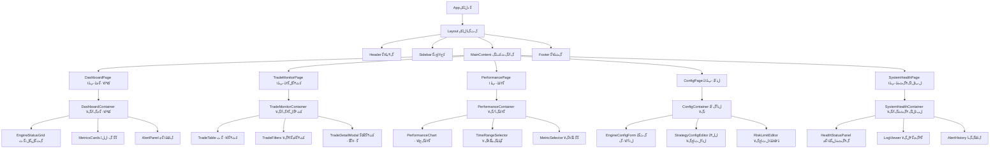
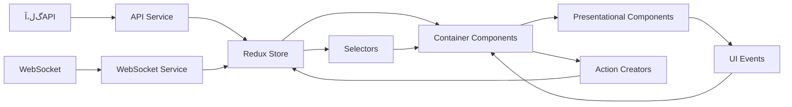

---


# ﮒ‰ﻝ،ﺁﻝﭨ„ﻛﭨﭘﻝﭨ“ﮔž„?
> **核心职责**: 文档内容说明
> **职责边界**: 
> - ✅ 本文档负责：文档内容说明相关内容
> - ❌ 本文档不负责：其他模块内容


> ﮔﺕ…ﻠ۲Žﻠ‡ﮒŒ–ﻛﭦ۳ﮔ˜“ﻝﺏﭨﻝﭨŸ v5.3 - Webﻝ؟۰ﻝ†ﻝ•Œﻠ۱ﮒ‰ﻝ،ﺁﻝﭨ„ﻛﭨﭘﻝﭨ“ﮔž„
> **ﻝﺑ۱ﮒﺙ•**: `DESIGN_004`
> **ﮒ…ﺏﻟ”ﮔ–‡ﮔ۰۲**: [Webﻝ؟۰ﻝ†ﻝ•Œﻠ۱ﮔžﭘﮔž„ﻟ؟ﺝﻟ؟۰](T.06.UI001.web_management_interface_architecture_design.md)

## 1. ﮔ•ﺑﻛﺛ“ﻝﭨ„ﻛﭨﭘﮔžﭘﮔž„

### 1.1 ﻝﭨ„ﻛﭨﭘﮒﺎ‚ﮔ؛۰ﻝﭨ“ﮔž„



### 1.2 ﻝﭨ„ﻛﭨﭘﮒˆ†ﻝﺎﭨﻟﺁﺑﮔ˜Ž

| ﻝﭨ„ﻛﭨﭘﮒﺎ‚ﻝﭦ۶ | ﻝﭨ„ﻛﭨﭘﻝﺎﭨﮒž‹ | ﻟŒﻟﺑ۲ﻟﺁﺑﮔ˜Ž | ﻝ۳ﭦﻛﺝ‹ﻝﭨ„ﻛﭨﭘ |
|----------|----------|----------|----------|
| **ﮔ ﺗﻝﭨ„?* | App Component | ﮒﭦ”ﻝ”۷ﮒ…۴ﮒ۲ﺅﺙŒﮒ…۷ﮒﺎ€ﻝŠﭘﮔ€ﻝ؟۰?| `App.tsx` |
| **ﮒﺕƒﮒﺎ€ﻝﭨ„ﻛﭨﭘ** | Layout Components | ﻠ۰ﭖﻠ۱ﮒﺕƒﮒﺎ€ﻝﭨ“ﮔž„ﺅﺙŒﮒﺁﺙﻟˆ۹ﮔ۰†?| `Layout.tsx`, `Header.tsx` |
| **ﻠ۰ﭖﻠ۱ﻝﭨ„ﻛﭨﭘ** | Page Components | ﻟﺓﺁﻝ”ﺎﮒﺁﺗﮒﭦ”ﻝš„ﮒ؟Œﮔ•ﺑﻠ۰ﭖ?| `DashboardPage.tsx` |
| **ﮒ؟ﺗﮒ™۷ﻝﭨ„ﻛﭨﭘ** | Container Components | ﻛﺕšﮒŠ۰ﻠ€ﭨﻟﺝ‘ﮒ؟ﺗﮒ™۷ﺅﺙŒﻝŠﭘﮔ€ﻝ؟۰?| `DashboardContainer.tsx` |
| **ﮒﺎ•ﻝ۳ﭦﻝﭨ„ﻛﭨﭘ** | Presentational Components | ﻝﭦﺁUIﮒﺎ•ﻝ۳ﭦﺅﺙŒﮔ— ﻛﺕšﮒŠ۰ﻠ€ﭨﻟﺝ‘ | `MetricCard.tsx` |
| **ﻟ۰۷ﮒ•ﻝﭨ„ﻛﭨﭘ** | Form Components | ﮔ•ﺍﮔ؟ﻟﺝ“ﮒ…۴ﻛﺕŽﻠ۹Œ?| `EngineConfigForm.tsx` |
| **ﮒ›ﺝﻟ۰۷ﻝﭨ„ﻛﭨﭘ** | Chart Components | ﮔ•ﺍﮔ؟ﮒﺁﻟ۶†?| `PerformanceChart.tsx` |
| **ﮒﺓ۴ﮒ…ﺓﻝﭨ„ﻛﭨﭘ** | Utility Components | ﻠ€šﻝ”۷ﮒﺓ۴ﮒ…ﺓﻝﭨ„ﻛﭨﭘ | `LoadingSpinner.tsx` |

## 2. ﮔ ﺕﮒﺟƒﻝﭨ„ﻛﭨﭘﻟﺁ۵ﻝﭨ†ﻟ؟ﺝﻟ؟۰

### 2.1 Layout ﮒﺕƒﮒﺎ€ﻝﭨ„ﻛﭨﭘ

#### 2.1.1 Header ﻝﭨ„ﻛﭨﭘ
```typescript
interface HeaderProps {
  user: User | null;
  notifications: Notification[];
  onLogout: () => void;
  onNotificationClick: (id: string) => void;
}

const Header: React.FC<HeaderProps> = ({
  user,
  notifications,
  onLogout,
  onNotificationClick
}) => {
  // ﮒ؟žﻝŽﺍ?
};
```

**ﮒ­ﻝﭨ„ﻛﭨﭘﻝﭨ“?*:
```
Header
ﻗ”œﻗ”€ﻗ”€ Logo (Logoﻝﭨ„ﻛﭨﭘ)
ﻗ”œﻗ”€ﻗ”€ UserMenu (ﻝ”۷ﮔˆﺓﻟœﮒ•)
?  ﻗ”œﻗ”€ﻗ”€ UserAvatar (ﻝ”۷ﮔˆﺓﮒ۳ﺑﮒƒ)
?  ﻗ”œﻗ”€ﻗ”€ UserInfo (ﻝ”۷ﮔˆﺓﻛﺟ۰ﮔﺁ)
?  ﻗ””ﻗ”€ﻗ”€ LogoutButton (ﻠ€€ﮒ‡ﭦﮔŒ‰?
ﻗ”œﻗ”€ﻗ”€ NotificationBell (ﻠ€šﻝŸ۴ﻠ“ƒﻠ“›)
?  ﻗ””ﻗ”€ﻗ”€ NotificationList (ﻠ€šﻝŸ۴ﮒˆ—ﻟ۰۷)
ﻗ””ﻗ”€ﻗ”€ QuickActions (ﮒﺟ،ﮔﺓﮔ“ﻛﺛœ)
    ﻗ”œﻗ”€ﻗ”€ RefreshButton (ﮒˆﺓﮔ–ﺍﮔŒ‰ﻠ’؟)
    ﻗ””ﻗ”€ﻗ”€ HelpButton (ﮒﺕ؟ﮒŠ۸ﮔŒ‰ﻠ’؟)
```

#### 2.1.2 Sidebar ﻝﭨ„ﻛﭨﭘ
```typescript
interface SidebarProps {
  activePath: string;
  onNavigate: (path: string) => void;
  collapsed: boolean;
  onCollapseChange: (collapsed: boolean) => void;
}

const Sidebar: React.FC<SidebarProps> = ({
  activePath,
  onNavigate,
  collapsed,
  onCollapseChange
}) => {
  // ﮒ؟žﻝŽﺍ?
};
```

**ﮒﺁﺙﻟˆ۹ﻟœﮒ•?*:
```typescript
const menuItems = [
  {
    key: 'dashboard',
    icon: <DashboardOutlined />,
    label: 'ﻛﭨ۹ﻟ۰۷?,
    path: '/dashboard'
  },
  {
    key: 'trades',
    icon: <TransactionOutlined />,
    label: 'ﻛﭦ۳ﮔ˜“ﻝ›‘ﮔŽ۶',
    path: '/trades'
  },
  {
    key: 'performance',
    icon: <LineChartOutlined />,
    label: 'ﮔ€۶ﻟƒﺛﮒˆ†ﮔž',
    path: '/performance'
  },
  {
    key: 'config',
    icon: <SettingOutlined />,
    label: 'ﻠ…ﻝﺛ؟ﻝ؟۰ﻝ†',
    path: '/config',
    children: [
      { key: 'engines', label: 'ﮒﺙ•ﮔ“Žﻠ…ﻝﺛ؟', path: '/config/engines' },
      { key: 'strategies', label: 'ﻝ­–ﻝ•۴ﻠ…ﻝﺛ؟', path: '/config/strategies' },
      { key: 'risk', label: 'ﻠ۲Žﻠ™۸ﻠ™ﻠ۱', path: '/config/risk' }
    ]
  },
  {
    key: 'system',
    icon: <MonitorOutlined />,
    label: 'ﻝﺏﭨﻝﭨŸﮒ۴ﮒﭦﺓ',
    path: '/system'
  }
];
```

### 2.2 DashboardPage ﻛﭨ۹ﻟ۰۷ﮔﺟﻠ۰ﭖ?

#### 2.2.1 ﻝﭨ„ﻛﭨﭘﻝﭨ“ﮔž„
```
DashboardPage
ﻗ””ﻗ”€ﻗ”€ DashboardContainer
    ﻗ”œﻗ”€ﻗ”€ EngineStatusGrid
    ?  ﻗ”œﻗ”€ﻗ”€ EngineStatusCard (ﺣ—N)
    ?  ?  ﻗ”œﻗ”€ﻗ”€ EngineIcon (ﮒﺙ•ﮔ“Žﮒ›ﺝﮔ ‡)
    ?  ?  ﻗ”œﻗ”€ﻗ”€ EngineName (ﮒﺙ•ﮔ“Žﮒﻝ۶ﺍ)
    ?  ?  ﻗ”œﻗ”€ﻗ”€ StatusIndicator (ﻝŠﭘﮔ€ﮔŒ‡ﻝ۳ﭦﮒ™۷)
    ?  ?  ﻗ”œﻗ”€ﻗ”€ PerformanceMetrics (ﮔ€۶ﻟƒﺛﮔŒ‡ﮔ ‡)
    ?  ?  ﻗ””ﻗ”€ﻗ”€ ActionButtons (ﮔ“ﻛﺛœﮔŒ‰ﻠ’؟)
    ?  ﻗ””ﻗ”€ﻗ”€ AddEngineCard (ﮔﺓﭨﮒŠ ﮒﺙ•ﮔ“Žﮒ۰ﻝ‰‡)
    ﻗ”œﻗ”€ﻗ”€ MetricsOverview
    ?  ﻗ”œﻗ”€ﻗ”€ TotalTradesCard (ﮔ€ﭨﻛﭦ۳ﮔ˜“ﮔ•ﺍ)
    ?  ﻗ”œﻗ”€ﻗ”€ TotalVolumeCard (ﮔ€ﭨﻛﭦ۳ﮔ˜“ﻠ۱)
    ?  ﻗ”œﻗ”€ﻗ”€ ActiveEnginesCard (ﮔﺑﭨﻟﺓƒﮒﺙ•ﮔ“Ž)
    ?  ﻗ””ﻗ”€ﻗ”€ SystemHealthCard (ﻝﺏﭨﻝﭨŸﮒ۴ﮒﭦﺓ?
    ﻗ”œﻗ”€ﻗ”€ RecentAlertsPanel
    ?  ﻗ”œﻗ”€ﻗ”€ AlertItem (ﮒ‘Šﻟ­۵?
    ?  ﻗ””ﻗ”€ﻗ”€ ViewAllAlertsButton (ﮔŸ۴ﻝœ‹ﮒ…۷ﻠƒ۷)
    ﻗ””ﻗ”€ﻗ”€ QuickActionsPanel
        ﻗ”œﻗ”€ﻗ”€ StartAllEnginesButton (ﮒﺁﮒŠ۷ﮔ‰€ﮔœ‰ﮒﺙ•?
        ﻗ”œﻗ”€ﻗ”€ StopAllEnginesButton (ﮒœﮔ­۱ﮔ‰€ﮔœ‰ﮒﺙ•?
        ﻗ””ﻗ”€ﻗ”€ RunHealthCheckButton (ﻟﺟﻟ۰Œﮒ۴ﮒﭦﺓﮔ۲€?
```

#### 2.2.2 EngineStatusCard ﻝﭨ„ﻛﭨﭘﻟ؟ﺝﻟ؟۰
```typescript
interface EngineStatusCardProps {
  engine: Engine;
  onStart: (engineId: string) => void;
  onStop: (engineId: string) => void;
  onConfigure: (engineId: string) => void;
  onViewDetails: (engineId: string) => void;
}

const EngineStatusCard: React.FC<EngineStatusCardProps> = ({
  engine,
  onStart,
  onStop,
  onConfigure,
  onViewDetails
}) => {
  const statusColor = {
    running: 'green',
    stopped: 'gray',
    error: 'red',
    starting: 'orange'
  }[engine.status];

  return (
    <Card 
      title={
        <div className="engine-card-header">
          <EngineIcon type={engine.type} />
          <span className="engine-name">{engine.name}</span>
          <StatusBadge color={statusColor}>{engine.status}</StatusBadge>
        </div>
      }
      actions={[
        <Tooltip title="ﮒﺁﮒŠ۷">
          <PlayCircleOutlined onClick={() => onStart(engine.id)} />
        </Tooltip>,
        <Tooltip title="ﮒœﮔ­۱">
          <StopOutlined onClick={() => onStop(engine.id)} />
        </Tooltip>,
        <Tooltip title="ﻠ…ﻝﺛ؟">
          <SettingOutlined onClick={() => onConfigure(engine.id)} />
        </Tooltip>,
        <Tooltip title="ﻟﺁ۵ﮔƒ…">
          <EyeOutlined onClick={() => onViewDetails(engine.id)} />
        </Tooltip>
      ]}
    >
      <div className="engine-metrics">
        <MetricItem label="CPU" value={`${engine.cpuUsage}%`} />
        <MetricItem label="ﮒ†…ﮒ­˜" value={`${engine.memoryUsage}%`} />
        <MetricItem label="ﻛﭨŠﮔ—۴ﻛﭦ۳ﮔ˜“" value={engine.tradesToday} />
        <MetricItem label="ﻠ”™ﻟﺁﺁ? value={engine.errorCount} />
      </div>
      <div className="engine-last-update">
        ﮔœ€ﮒŽﮔ›ﺑ? {formatTime(engine.lastHeartbeat)}
      </div>
    </Card>
  );
};
```

### 2.3 TradeMonitorPage ﻛﭦ۳ﮔ˜“ﻝ›‘ﮔŽ۶ﻠ۰ﭖﻠ۱

#### 2.3.1 ﻝﭨ„ﻛﭨﭘﻝﭨ“ﮔž„
```
TradeMonitorPage
ﻗ””ﻗ”€ﻗ”€ TradeMonitorContainer
    ﻗ”œﻗ”€ﻗ”€ TradeFilters
    ?  ﻗ”œﻗ”€ﻗ”€ DateRangePicker (ﮔ—۴ﮔœŸﻟŒƒﮒ›ﺑﻠ€‰ﮔ‹۸?
    ?  ﻗ”œﻗ”€ﻗ”€ SymbolSelector (ﮔ ‡ﻝš„ﻠ€‰ﮔ‹۸?
    ?  ﻗ”œﻗ”€ﻗ”€ EngineSelector (ﮒﺙ•ﮔ“Žﻠ€‰ﮔ‹۸?
    ?  ﻗ”œﻗ”€ﻗ”€ SideFilter (ﻛﺗﺍﮒ–ﮔ–ﺗﮒ‘ﻟﺟ‡ﮔﭨ۳?
    ?  ﻗ””ﻗ”€ﻗ”€ ApplyFiltersButton (ﮒﭦ”ﻝ”۷ﻟﺟ‡ﮔﭨ۳?
    ﻗ”œﻗ”€ﻗ”€ TradeTable
    ?  ﻗ”œﻗ”€ﻗ”€ TradeTableHeader (ﻟ۰۷ﮔ ﺙﮒ۳ﺑﻠƒ۷)
    ?  ﻗ”œﻗ”€ﻗ”€ TradeTableRow (ﻟ۰۷ﮔ ﺙ?ﺣ—N)
    ?  ?  ﻗ”œﻗ”€ﻗ”€ TradeIdCell (ﻛﭦ۳ﮔ˜“ID)
    ?  ?  ﻗ”œﻗ”€ﻗ”€ TimestampCell (ﮔ—ﭘﻠ—ﺑ?
    ?  ?  ﻗ”œﻗ”€ﻗ”€ SymbolCell (ﮔ ‡ﻝš„)
    ?  ?  ﻗ”œﻗ”€ﻗ”€ SideCell (ﻛﺗﺍﮒ–ﮔ–ﺗﮒ‘)
    ?  ?  ﻗ”œﻗ”€ﻗ”€ PriceCell (ﻛﭨﺓﮔ ﺙ)
    ?  ?  ﻗ”œﻗ”€ﻗ”€ QuantityCell (ﮔ•ﺍﻠ‡)
    ?  ?  ﻗ”œﻗ”€ﻗ”€ VolumeCell (ﻠ‡‘ﻠ۱)
    ?  ?  ﻗ”œﻗ”€ﻗ”€ EngineCell (ﮒﺙ•ﮔ“Ž)
    ?  ?  ﻗ””ﻗ”€ﻗ”€ ActionsCell (ﮔ“ﻛﺛœ)
    ?  ﻗ””ﻗ”€ﻗ”€ TradeTableFooter (ﻟ۰۷ﮔ ﺙﮒﭦ•ﻠƒ۷)
    ﻗ”œﻗ”€ﻗ”€ TradeStatsPanel
    ?  ﻗ”œﻗ”€ﻗ”€ TotalTradesStat (ﮔ€ﭨﻛﭦ۳ﮔ˜“ﮔ•ﺍ)
    ?  ﻗ”œﻗ”€ﻗ”€ TotalVolumeStat (ﮔ€ﭨﻛﭦ۳ﮔ˜“ﻠ۱)
    ?  ﻗ”œﻗ”€ﻗ”€ AvgPriceStat (ﮒﺗﺏﮒ‡ﻛﭨﺓﮔ ﺙ)
    ?  ﻗ””ﻗ”€ﻗ”€ TradeDistributionChart (ﻛﭦ۳ﮔ˜“ﮒˆ†ﮒﺕƒ?
    ﻗ””ﻗ”€ﻗ”€ TradeDetailModal (ﻛﭦ۳ﮔ˜“ﻟﺁ۵ﮔƒ…ﮔ۷۰ﮔ€ﮔ۰†)
```

#### 2.3.2 TradeTable ﻝﭨ„ﻛﭨﭘﻟ؟ﺝﻟ؟۰
```typescript
interface TradeTableProps {
  trades: Trade[];
  loading: boolean;
  onRowClick: (trade: Trade) => void;
  onSortChange: (sortBy: string, sortOrder: 'asc' | 'desc') => void;
  pagination: {
    current: number;
    pageSize: number;
    total: number;
    onChange: (page: number, pageSize: number) => void;
  };
}

const TradeTable: React.FC<TradeTableProps> = ({
  trades,
  loading,
  onRowClick,
  onSortChange,
  pagination
}) => {
  const columns = [
    {
      title: 'ﻛﭦ۳ﮔ˜“ID',
      dataIndex: 'tradeId',
      key: 'tradeId',
      sorter: true,
      width: 120
    },
    {
      title: 'ﮔ—ﭘﻠ—ﺑ',
      dataIndex: 'timestamp',
      key: 'timestamp',
      sorter: true,
      render: (timestamp: string) => formatDateTime(timestamp),
      width: 150
    },
    {
      title: 'ﮔ ‡ﻝš„',
      dataIndex: 'symbol',
      key: 'symbol',
      width: 100
    },
    {
      title: 'ﮔ–ﺗﮒ‘',
      dataIndex: 'side',
      key: 'side',
      render: (side: string) => (
        <Tag color={side === 'buy' ? 'green' : 'red'}>
          {side === 'buy' ? 'ﻛﺗﺍﮒ…۴' : 'ﮒ–ﮒ‡ﭦ'}
        </Tag>
      ),
      width: 80
    },
    {
      title: 'ﻛﭨﺓﮔ ﺙ',
      dataIndex: 'price',
      key: 'price',
      sorter: true,
      render: (price: number) => formatCurrency(price),
      width: 100
    },
    {
      title: 'ﮔ•ﺍﻠ‡',
      dataIndex: 'quantity',
      key: 'quantity',
      sorter: true,
      width: 100
    },
    {
      title: 'ﻠ‡‘ﻠ۱',
      dataIndex: 'volume',
      key: 'volume',
      sorter: true,
      render: (volume: number) => formatCurrency(volume),
      width: 120
    },
    {
      title: 'ﮒﺙ•ﮔ“Ž',
      dataIndex: 'engineId',
      key: 'engineId',
      width: 100
    },
    {
      title: 'ﮔ“ﻛﺛœ',
      key: 'actions',
      render: (_: any, trade: Trade) => (
        <Button
          type="link"
          onClick={() => onRowClick(trade)}
          icon={<EyeOutlined />}
        >
          ﻟﺁ۵ﮔƒ…
        </Button>
      ),
      width: 80
    }
  ];

  return (
    <Table
      columns={columns}
      dataSource={trades}
      loading={loading}
      rowKey="tradeId"
      pagination={pagination}
      onChange={(pagination, filters, sorter) => {
        if (sorter && 'field' in sorter) {
          onSortChange(
            sorter.field as string,
            sorter.order === 'ascend' ? 'asc' : 'desc'
          );
        }
      }}
      onRow={(record) => ({
        onClick: () => onRowClick(record)
      })}
    />
  );
};
```

### 2.4 PerformancePage ﮔ€۶ﻟƒﺛﮒˆ†ﮔžﻠ۰ﭖﻠ۱

#### 2.4.1 ﻝﭨ„ﻛﭨﭘﻝﭨ“ﮔž„
```
PerformancePage
ﻗ””ﻗ”€ﻗ”€ PerformanceContainer
    ﻗ”œﻗ”€ﻗ”€ ChartControls
    ?  ﻗ”œﻗ”€ﻗ”€ TimeRangeSelector (ﮔ—ﭘﻠ—ﺑﻟŒƒﮒ›ﺑﻠ€‰ﮔ‹۸?
    ?  ﻗ”œﻗ”€ﻗ”€ MetricSelector (ﮔŒ‡ﮔ ‡ﻠ€‰ﮔ‹۸?
    ?  ﻗ”œﻗ”€ﻗ”€ ChartTypeSelector (ﮒ›ﺝﻟ۰۷ﻝﺎﭨﮒž‹ﻠ€‰ﮔ‹۸?
    ?  ﻗ”œﻗ”€ﻗ”€ EngineFilter (ﮒﺙ•ﮔ“Žﻟﺟ‡ﮔﭨ۳?
    ?  ﻗ””ﻗ”€ﻗ”€ RefreshButton (ﮒˆﺓﮔ–ﺍﮔŒ‰ﻠ’؟)
    ﻗ”œﻗ”€ﻗ”€ ChartArea
    ?  ﻗ”œﻗ”€ﻗ”€ EquityCurveChart (ﮔƒﻝ›Šﮔ›ﺎﻝﭦﺟ?
    ?  ﻗ”œﻗ”€ﻗ”€ DrawdownChart (ﮒ›žﮔ’۳?
    ?  ﻗ”œﻗ”€ﻗ”€ SharpeRatioChart (ﮒ۳ﮔ™؟ﮔﺁ”ﻝŽ‡?
    ?  ﻗ”œﻗ”€ﻗ”€ TradeDistributionChart (ﻛﭦ۳ﮔ˜“ﮒˆ†ﮒﺕƒ?
    ?  ﻗ””ﻗ”€ﻗ”€ PerformanceHeatmap (ﮔ€۶ﻟƒﺛﻝƒ­ﮒŠ›?
    ﻗ”œﻗ”€ﻗ”€ PerformanceMetricsPanel
    ?  ﻗ”œﻗ”€ﻗ”€ SharpeRatioCard (ﮒ۳ﮔ™؟ﮔﺁ”ﻝŽ‡)
    ?  ﻗ”œﻗ”€ﻗ”€ MaxDrawdownCard (ﮔœ€ﮒ۳۶ﮒ›ž?
    ?  ﻗ”œﻗ”€ﻗ”€ WinRateCard (ﻟƒœﻝŽ‡)
    ?  ﻗ”œﻗ”€ﻗ”€ AvgReturnCard (ﮒﺗﺏﮒ‡ﮔ”ﭘﻝ›Š)
    ?  ﻗ””ﻗ”€ﻗ”€ VolatilityCard (ﮔﺏ۱ﮒŠ۷?
    ﻗ””ﻗ”€ﻗ”€ ExportControls
        ﻗ”œﻗ”€ﻗ”€ ExportCSVButton (ﮒﺁﺙﮒ‡ﭦCSV)
        ﻗ”œﻗ”€ﻗ”€ ExportPNGButton (ﮒﺁﺙﮒ‡ﭦPNG)
        ﻗ””ﻗ”€ﻗ”€ ShareReportButton (ﮒˆ†ﻛﭦ،ﮔŠ۴ﮒ‘Š)
```

#### 2.4.2 PerformanceChart ﻝﭨ„ﻛﭨﭘﻟ؟ﺝﻟ؟۰
```typescript
interface PerformanceChartProps {
  data: ChartData[];
  chartType: 'line' | 'bar' | 'area' | 'scatter';
  title: string;
  xAxisKey: string;
  yAxisKey: string;
  color?: string;
  height?: number;
  onPointClick?: (point: ChartDataPoint) => void;
}

const PerformanceChart: React.FC<PerformanceChartProps> = ({
  data,
  chartType,
  title,
  xAxisKey,
  yAxisKey,
  color = '#1890ff',
  height = 400,
  onPointClick
}) => {
  const chartConfig = {
    line: {
      type: 'monotone',
      dataKey: yAxisKey,
      stroke: color,
      strokeWidth: 2,
      dot: false,
      activeDot: { r: 6, onClick: onPointClick }
    },
    bar: {
      dataKey: yAxisKey,
      fill: color
    },
    area: {
      type: 'monotone',
      dataKey: yAxisKey,
      stroke: color,
      fill: color,
      fillOpacity: 0.3
    },
    scatter: {
      dataKey: yAxisKey,
      fill: color,
      r: 4
    }
  };

  return (
    <div className="performance-chart">
      <h3>{title}</h3>
      <ResponsiveContainer width="100%" height={height}>
        <RechartsChart data={data}>
          <CartesianGrid strokeDasharray="3 3" />
          <XAxis 
            dataKey={xAxisKey} 
            tickFormatter={formatDate}
          />
          <YAxis 
            tickFormatter={formatNumber}
            label={{ value: yAxisKey, angle: -90, position: 'insideLeft' }}
          />
          <Tooltip 
            formatter={(value) => [formatNumber(value as number), yAxisKey]}
            labelFormatter={formatDate}
          />
          <Legend />
          {chartType === 'line' && <Line {...chartConfig.line} />}
          {chartType === 'bar' && <Bar {...chartConfig.bar} />}
          {chartType === 'area' && <Area {...chartConfig.area} />}
          {chartType === 'scatter' && <Scatter {...chartConfig.scatter} />}
        </RechartsChart>
      </ResponsiveContainer>
    </div>
  );
};
```

## 3. ﻝﭨ„ﻛﭨﭘﻛﭦ۳ﻛﭦ’ﮒ…ﺏﻝﺏﭨ

### 3.1 ﮔ•ﺍﮔ؟ﮔﭖﮒ›ﺝ



### 3.2 ﻝŠﭘﮔ€ﻝ؟۰ﻝ†ﻟ؟ﺝ?

#### 3.2.1 Redux Store ﻝﭨ“ﮔž„
```typescript
interface RootState {
  auth: AuthState;
  engines: EnginesState;
  trades: TradesState;
  performance: PerformanceState;
  config: ConfigState;
  system: SystemState;
  ui: UIState;
}

interface EnginesState {
  engineList: Engine[];
  loading: boolean;
  error: string | null;
  selectedEngineId: string | null;
}

interface TradesState {
  trades: Trade[];
  filters: TradeFilters;
  loading: boolean;
  error: string | null;
  pagination: Pagination;
  selectedTrade: Trade | null;
}

interface UIState {
  sidebarCollapsed: boolean;
  theme: 'light' | 'dark';
  notifications: Notification[];
  modal: {
    type: string | null;
    data: any;
  };
}
```

#### 3.2.2 ﮒ…ﺏﻠ”؟Actionﮒ؟šﻛﺗ‰
```typescript
// ﮒﺙ•ﮔ“Žﻝ›ﺕﮒ…ﺏAction
const fetchEngines = createAsyncThunk('engines/fetch', async () => {
  const response = await engineAPI.getEngines();
  return response.data;
});

const startEngine = createAsyncThunk('engines/start', async (engineId: string) => {
  const response = await engineAPI.startEngine(engineId);
  return response.data;
});

const updateEngineConfig = createAsyncThunk('engines/updateConfig', 
  async ({ engineId, config }: { engineId: string; config: EngineConfig }) => {
    const response = await engineAPI.updateConfig(engineId, config);
    return response.data;
  }
);

// ﻛﭦ۳ﮔ˜“ﻝ›ﺕﮒ…ﺏAction
const fetchTrades = createAsyncThunk('trades/fetch', 
  async (filters: TradeFilters) => {
    const response = await tradeAPI.getTrades(filters);
    return response.data;
  }
);

// WebSocket Action
const websocketMessageReceived = createAction('websocket/message', 
  (message: WebSocketMessage) => ({ payload: message })
);
```

## 4. ﻝﭨ„ﻛﭨﭘﮒﺙ€ﮒ‘ﻟ۶„?

### 4.1 ﮒ‘ﺛﮒﻟ۶„ﻟŒƒ
| ﻝﭨ„ﻛﭨﭘﻝﺎﭨﮒž‹ | ﮒ‘ﺛﮒﻟ۶„ﮒˆ™ | ﻝ۳ﭦﻛﺝ‹ |
|----------|----------|------|
| **ﻠ۰ﭖﻠ۱ﻝﭨ„ﻛﭨﭘ** | `[PageName]Page` | `DashboardPage.tsx` |
| **ﮒ؟ﺗﮒ™۷ﻝﭨ„ﻛﭨﭘ** | `[Feature]Container` | `DashboardContainer.tsx` |
| **ﮒﺎ•ﻝ۳ﭦﻝﭨ„ﻛﭨﭘ** | `[ComponentName]` | `MetricCard.tsx` |
| **ﻟ۰۷ﮒ•ﻝﭨ„ﻛﭨﭘ** | `[FormName]Form` | `EngineConfigForm.tsx` |
| **ﮒ›ﺝﻟ۰۷ﻝﭨ„ﻛﭨﭘ** | `[ChartName]Chart` | `PerformanceChart.tsx` |
| **ﮒﺓ۴ﮒ…ﺓﻝﭨ„ﻛﭨﭘ** | `[UtilityName]` | `LoadingSpinner.tsx` |

### 4.2 ﮔ–‡ﻛﭨﭘﻝﭨ“ﮔž„ﻟ۶„ﻟŒƒ
```
src/
ﻗ”œﻗ”€ﻗ”€ components/
?  ﻗ”œﻗ”€ﻗ”€ layout/           # ﮒﺕƒﮒﺎ€ﻝﭨ„ﻛﭨﭘ
?  ?  ﻗ”œﻗ”€ﻗ”€ Header.tsx
?  ?  ﻗ”œﻗ”€ﻗ”€ Sidebar.tsx
?  ?  ﻗ””ﻗ”€ﻗ”€ Layout.tsx
?  ﻗ”œﻗ”€ﻗ”€ pages/           # ﻠ۰ﭖﻠ۱ﻝﭨ„ﻛﭨﭘ
?  ?  ﻗ”œﻗ”€ﻗ”€ DashboardPage.tsx
?  ?  ﻗ”œﻗ”€ﻗ”€ TradeMonitorPage.tsx
?  ?  ﻗ””ﻗ”€ﻗ”€ PerformancePage.tsx
?  ﻗ”œﻗ”€ﻗ”€ containers/      # ﮒ؟ﺗﮒ™۷ﻝﭨ„ﻛﭨﭘ
?  ?  ﻗ”œﻗ”€ﻗ”€ DashboardContainer.tsx
?  ?  ﻗ”œﻗ”€ﻗ”€ TradeMonitorContainer.tsx
?  ?  ﻗ””ﻗ”€ﻗ”€ PerformanceContainer.tsx
?  ﻗ”œﻗ”€ﻗ”€ charts/         # ﮒ›ﺝﻟ۰۷ﻝﭨ„ﻛﭨﭘ
?  ?  ﻗ”œﻗ”€ﻗ”€ PerformanceChart.tsx
?  ?  ﻗ””ﻗ”€ﻗ”€ TradeDistributionChart.tsx
?  ﻗ”œﻗ”€ﻗ”€ forms/          # ﻟ۰۷ﮒ•ﻝﭨ„ﻛﭨﭘ
?  ?  ﻗ”œﻗ”€ﻗ”€ EngineConfigForm.tsx
?  ?  ﻗ””ﻗ”€ﻗ”€ StrategyConfigForm.tsx
?  ﻗ””ﻗ”€ﻗ”€ common/         # ﻠ€šﻝ”۷ﻝﭨ„ﻛﭨﭘ
?      ﻗ”œﻗ”€ﻗ”€ LoadingSpinner.tsx
?      ﻗ”œﻗ”€ﻗ”€ ErrorBoundary.tsx
?      ﻗ””ﻗ”€ﻗ”€ NotFound.tsx
ﻗ”œﻗ”€ﻗ”€ services/           # ﮔœﮒŠ۰?
?  ﻗ”œﻗ”€ﻗ”€ api.ts
?  ﻗ”œﻗ”€ﻗ”€ websocket.ts
?  ﻗ””ﻗ”€ﻗ”€ auth.ts
ﻗ”œﻗ”€ﻗ”€ store/              # ﻝŠﭘﮔ€ﻝ؟۰?
?  ﻗ”œﻗ”€ﻗ”€ index.ts
?  ﻗ”œﻗ”€ﻗ”€ actions.ts
?  ﻗ”œﻗ”€ﻗ”€ reducers.ts
?  ﻗ””ﻗ”€ﻗ”€ selectors.ts
ﻗ”œﻗ”€ﻗ”€ hooks/              # ﻟ‡۹ﮒ؟šﻛﺗ‰Hook
?  ﻗ”œﻗ”€ﻗ”€ useEngines.ts
?  ﻗ”œﻗ”€ﻗ”€ useTrades.ts
?  ﻗ””ﻗ”€ﻗ”€ useWebSocket.ts
ﻗ”œﻗ”€ﻗ”€ utils/              # ﮒﺓ۴ﮒ…ﺓﮒ‡ﺛﮔ•ﺍ
?  ﻗ”œﻗ”€ﻗ”€ formatters.ts
?  ﻗ”œﻗ”€ﻗ”€ validators.ts
?  ﻗ””ﻗ”€ﻗ”€ constants.ts
ﻗ””ﻗ”€ﻗ”€ types/              # TypeScriptﻝﺎﭨﮒž‹ﮒ؟šﻛﺗ‰
    ﻗ”œﻗ”€ﻗ”€ index.ts
    ﻗ”œﻗ”€ﻗ”€ engine.ts
    ﻗ””ﻗ”€ﻗ”€ trade.ts
```

### 4.3 ﻝﭨ„ﻛﭨﭘﮒﺙ€ﮒ‘ﮒŽŸ?

#### 4.3.1 ﮒ•ﻛﺕ€ﻟŒﻟﺑ۲ﮒŽŸﮒˆ™
- ﮔﺁﻛﺕ۹ﻝﭨ„ﻛﭨﭘﮒ۹ﻟﺑŸﻟﺑ۲ﻛﺕ€ﻛﺕ۹ﮒŠŸ?
- ﮒ؟ﺗﮒ™۷ﻝﭨ„ﻛﭨﭘﻟﺑŸﻟﺑ۲ﻝŠﭘﮔ€ﻝ؟۰ﻝ†ﮒ’ŒﻛﺕšﮒŠ۰ﻠ€ﭨﻟﺝ‘
- ﮒﺎ•ﻝ۳ﭦﻝﭨ„ﻛﭨﭘﮒ۹ﻟﺑŸﻟﺑ۲UIﮔﺕﺎﮔŸ“

#### 4.3.2 ﮒﺁﮒ۳ﻝ”۷ﮔ€۶ﮒŽŸ?
- ﮔﮒ–ﻠ€šﻝ”۷ﻝﭨ„ﻛﭨﭘﮒˆﺍ`common/`ﻝ›؟ﮒﺛ•
- ﻝﭨ„ﻛﭨﭘﮒ‚ﮔ•ﺍﻟ؟ﺝﻟ؟۰ﻟ۵ﻝﭖ?
- ﮔ”ﺁﮔŒﻟ‡۹ﮒ؟šﻛﺗ‰ﮔ ﺓﮒﺙﮒ’Œﻛﭦ‹ﻛﭨﭘ

#### 4.3.3 ﮒﺁﮔﭖ‹ﻟﺁ•ﮔ€۶ﮒŽŸ?
- ﻝﭨ„ﻛﭨﭘﻠ€ﭨﻟﺝ‘ﻛﺕŽUIﮒˆ†ﻝ۵ﭨ
- ﻛﺛﺟﻝ”۷Propsﮔﺏ۷ﮒ…۴ﻛﺝﻟﭖ–
- ﮔﻛﺝ›ﮔﭖ‹ﻟﺁ•ﮒ‹ﮒ۴ﺛﻝš„ﮔŽ۴?

#### 4.3.4 ﮔ€۶ﻟƒﺛﻛﺙ˜ﮒŒ–ﮒŽŸﮒˆ™
- ﻛﺛﺟﻝ”۷React.memoﻠﺟﮒ…ﻛﺕﮒﺟ…ﻟ۵ﻝš„ﻠ‡ﮔﺕﺎ?
- ﻛﺛﺟﻝ”۷useMemo/useCallbackﻛﺙ˜ﮒŒ–ﻟ؟۰ﻝ؟—
- ﮒ؟žﻝŽﺍﻟ™šﮔ‹ŸﮔﭨšﮒŠ۷ﮒ۳„ﻝ†ﮒ۳۶ﮔ•ﺍﮔ؟ﮒˆ—?
- ﮔŒ‰ﻠœ€ﮒŠ ﻟﺛﺛﮒ۳۶ﮒž‹ﻝﭨ„ﻛﭨﭘ

## 5. ﮒ؟žﮔ–ﺛﮔŒ‡ﮒ—

### 5.1 ﻝﭨ„ﻛﭨﭘﮒﺙ€ﮒ‘ﻠ۰ﭦ?
1. **ﮒŸﭦﻝ۰€ﻝﭨ„ﻛﭨﭘ** (??
   - Layoutﻝﭨ„ﻛﭨﭘ (Header, Sidebar, Footer)
   - ﻠ€šﻝ”۷ﻝﭨ„ﻛﭨﭘ (LoadingSpinner, ErrorBoundary)
   - ﮒﺓ۴ﮒ…ﺓﮒ‡ﺛﮔ•ﺍﮒ’Œﻝﺎﭨﮒž‹ﮒ؟š?

2. **ﻠ۰ﭖﻠ۱ﮔ۰†ﮔžﭘ** (??
   - ﻠ۰ﭖﻠ۱ﻟﺓﺁﻝ”ﺎﻠ…ﻝﺛ؟
   - ﻠ۰ﭖﻠ۱ﻠ۹۷ﮔžﭘﻝﭨ„ﻛﭨﭘ
   - ﮒﺁﺙﻟˆ۹ﮒ’Œﮔƒﻠ™ﮔŽ۶?

3. **ﮔ ﺕﮒﺟƒﮒŠŸﻟƒﺛﻝﭨ„ﻛﭨﭘ** (?-4?
   - Dashboardﻝ›ﺕﮒ…ﺏﻝﭨ„ﻛﭨﭘ
   - TradeMonitorﻝ›ﺕﮒ…ﺏﻝﭨ„ﻛﭨﭘ
   - Performanceﻝ›ﺕﮒ…ﺏﻝﭨ„ﻛﭨﭘ

4. **ﻠ،˜ﻝﭦ۶ﮒŠŸﻟƒﺛﻝﭨ„ﻛﭨﭘ** (??
   - Configﻝ›ﺕﮒ…ﺏﻝﭨ„ﻛﭨﭘ
   - SystemHealthﻝ›ﺕﮒ…ﺏﻝﭨ„ﻛﭨﭘ
   - ﮒﺁﺙﮒ‡ﭦﮒ’Œﮒˆ†ﻛﭦ،ﮒŠŸ?

5. **ﻛﺙ˜ﮒŒ–ﮒ’Œﮔﭖ‹?* (?-7?
   - ﮔ€۶ﻟƒﺛﻛﺙ˜ﮒŒ–
   - ﮒ“ﮒﭦ”ﮒﺙﻟ؟ﺝ?
   - ﮒ•ﮒ…ƒﮔﭖ‹ﻟﺁ•ﮒ’ŒE2Eﮔﭖ‹ﻟﺁ•

### 5.2 ﻝﭨ„ﻛﭨﭘﮔﭖ‹ﻟﺁ•ﻝ­–ﻝ•۴
| ﮔﭖ‹ﻟﺁ•ﻝﺎﭨﮒž‹ | ﮔﭖ‹ﻟﺁ•ﮒﺓ۴ﮒ…ﺓ | ﮔﭖ‹ﻟﺁ•ﻝ›؟ﮔ ‡ | ﻟ۵†ﻝ›–ﻝŽ‡ﻝ›؟?|
|----------|----------|----------|------------|
| **ﮒ•ﮒ…ƒﮔﭖ‹ﻟﺁ•** | Jest + React Testing Library | ﻝﭨ„ﻛﭨﭘﻠ€ﭨﻟﺝ‘ﮒ’Œﮔﺕﺎ?| ?0% |
| **ﻠ›†ﮔˆﮔﭖ‹ﻟﺁ•** | Cypress | ﻝﭨ„ﻛﭨﭘﻠ—ﺑﻛﭦ۳?| ?0% |
| **E2Eﮔﭖ‹ﻟﺁ•** | Cypress | ﮒ؟Œﮔ•ﺑﻝ”۷ﮔˆﺓﮔﭖﻝ۷‹ | ?0% |
| **ﮔ€۶ﻟƒﺛﮔﭖ‹ﻟﺁ•** | Lighthouse | ﮒŠ ﻟﺛﺛﮒ’ŒﮔﺕﺎﮔŸ“ﮔ€۶ﻟƒﺛ | ﻟﺝﺝﮔ ‡ |
| **ﮒﺁﻟ۶†ﮒŒ–ﮔﭖ‹?* | Storybook + Chromatic | UIﻛﺕ€ﻟ‡ﺑﮔ€۶ﮒ’Œﮒ›žﮒﺛ’ | 100% |

### 5.3 ﻝﭨ„ﻛﭨﭘﮔ–‡ﮔ۰۲ﻟ۶„ﻟŒƒ
ﮔﺁﻛﺕ۹ﻝﭨ„ﻛﭨﭘﻠœ€ﻟ۵ﮒŒ…ﮒ،ﺅﺙš
1. **ﻝﭨ„ﻛﭨﭘﻟﺁﺑﮔ˜Ž**: ﻝ”۷ﻠ€”ﻙ€ﮒŠŸﻟƒﺛﻙ€ﻛﺛﺟﻝ”۷ﮒœﭦ?
2. **PropsﮔŽ۴ﮒ۲**: TypeScriptﮔŽ۴ﮒ۲ﮒ؟šﻛﺗ‰
3. **ﻛﺛﺟﻝ”۷ﻝ۳ﭦﻛﺝ‹**: ﻛﭨ۲ﻝ ﻝ۳ﭦﻛﺝ‹
4. **ﮔﺏ۷ﮔ„ﻛﭦ‹ﻠ۰ﺗ**: ﻛﺛﺟﻝ”۷ﻠ™ﮒˆﭘﮒ’Œﮔœ€ﻛﺛﺏﮒ؟ž?
5. **APIﮔ–‡ﮔ۰۲**: ﮔ–ﺗﮔﺏ•ﮒ’Œﻛﭦ‹ﻛﭨﭘﻟﺁﺑ?

---

**ﮔ–‡ﮔ۰۲ﻝ‰ˆﮔœ؛**: 1.0.0  
**ﮔœ€ﮒŽﮔ›ﺑ?*: 2026-04-02  
**ﻝﭨﺑﮔŠ۳?*: ﻠ۵–ﮒﺕ­ﻟ“ﮒ›ﺝﮔžﭘﮔž„? 
**ﻝﺑ۱ﮒﺙ•**: `DESIGN_004`  
**ﻝŠ?*: ?ﻟ؟ﺝﻟ؟۰ﮒ؟ŒﮔˆﺅﺙŒﮒﺝ…ﻟﺁ„ﮒ؟۰