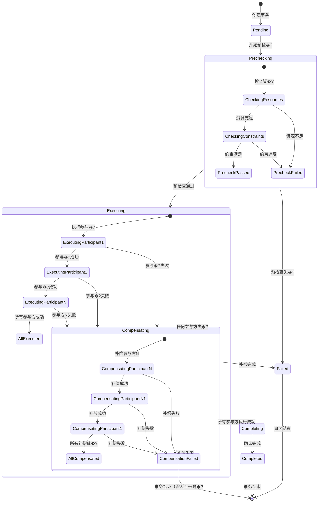
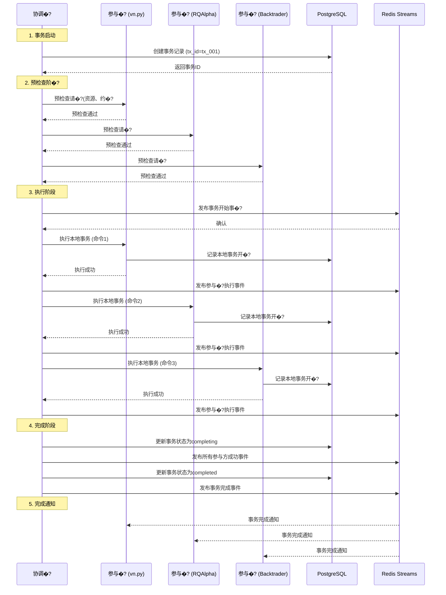
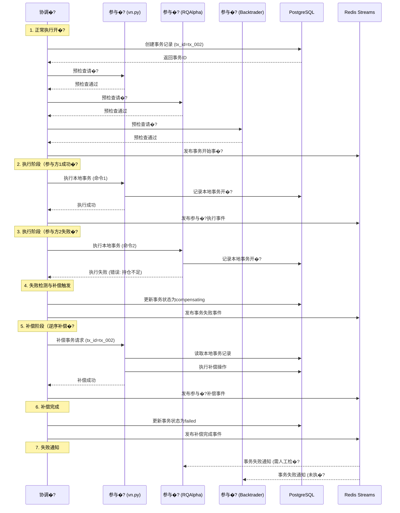
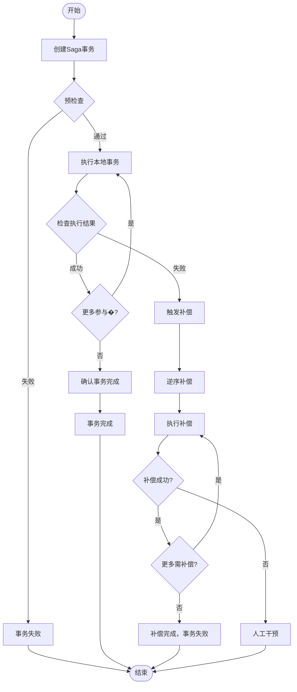
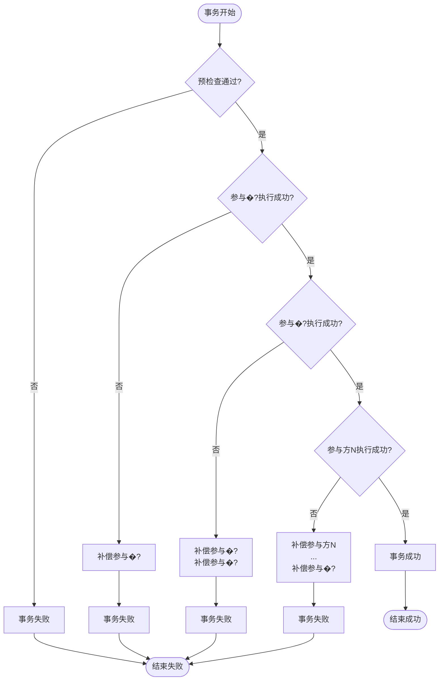
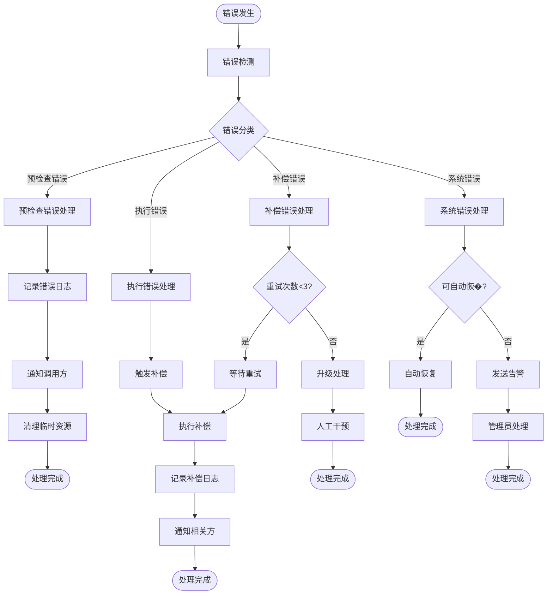
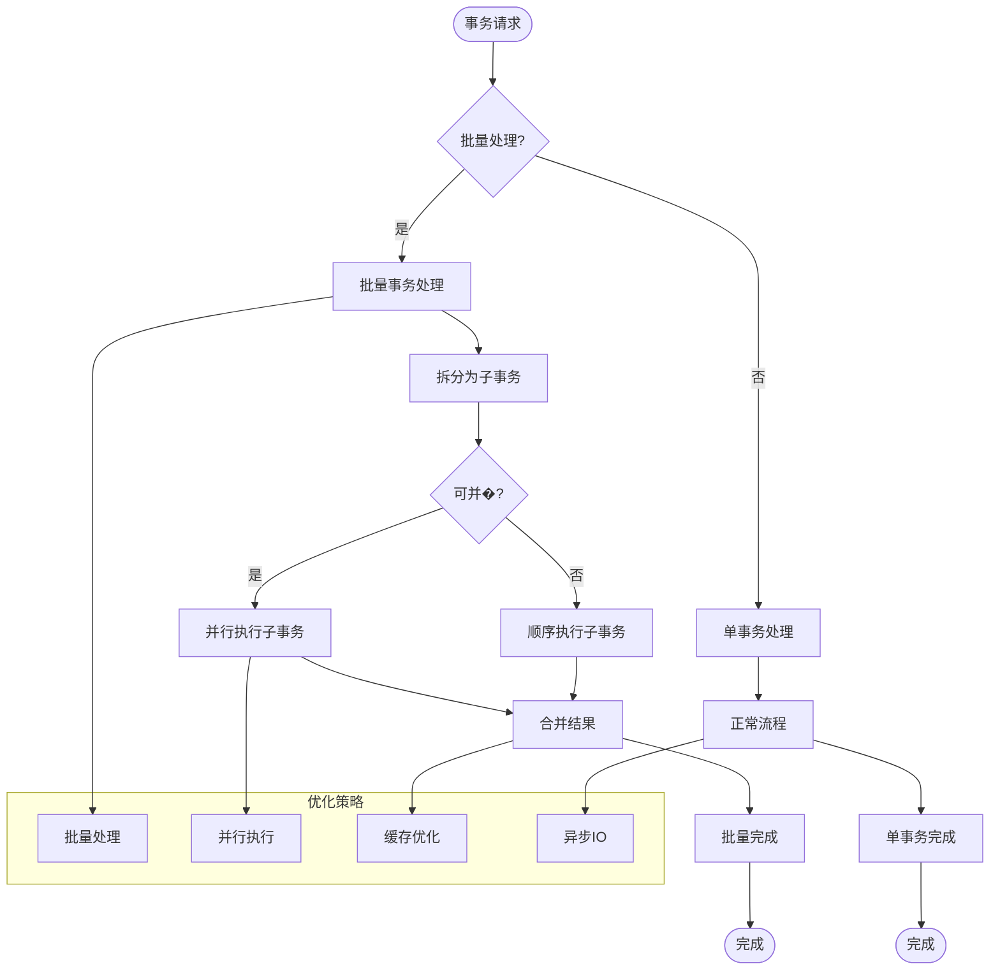

# Saga模式实现流程�?

> 多引擎数据一致性Saga模式的完整状态机与流程图
>
> **核心状�?*: 6个主状态，12个状态转�?
> **流程图类�?*: Mermaid状态图 + 序列�?+ 活动�?
> **设计目标**: 清晰展示Saga模式完整生命周期

**版本**: v1.0
**更新**: 2026-04-02
**Layer**: Layer 4 (执行�?
**优先�?*: P1 - 架构理解核心

---

## 1. 整体状态机�?

### 1.1 Mermaid状态图



### 1.2 状态说明表

| 状�?| 描述 | 进入条件 | 退出条�?|
|------|------|----------|----------|
| **Pending** | 事务已创建，等待执行 | 协调器创建新事务 | 开始预检�?|
| **Prechecking** | 预检查阶段，验证资源与约�?| 从Pending状态开始预检�?| 预检查通过或失�?|
| **Executing** | 执行阶段，顺序执行各参与�?| 预检查通过 | 所有参与方成功或任何失�?|
| **Completing** | 完成阶段，确认事务完�?| 所有参与方执行成功 | 确认完成或确认失�?|
| **Compensating** | 补偿阶段，回滚已执行操作 | 任何参与方执行失�?| 所有补偿完成或补偿失败 |
| **Completed** | 事务成功完成 | 完成阶段确认成功 | 事务结束 |
| **Failed** | 事务失败（预检查失败或补偿完成�?| 预检查失败或补偿完成 | 事务结束 |
| **CompensationFailed** | 补偿失败（需人工干预�?| 补偿操作失败 | 事务结束（需人工干预�?|

---

## 2. 正常执行序列�?

### 2.1 Mermaid序列图（成功场景�?



### 2.2 序列步骤说明

| 步骤 | 参与�?| 动作 | 数据 | 结果 |
|------|--------|------|------|------|
| **1.1** | 协调�?�?PostgreSQL | 创建事务记录 | tx_id, transaction_type, initiator | 事务ID |
| **1.2** | PostgreSQL �?协调�?| 返回事务ID | tx_id | 事务创建成功 |
| **2.1** | 协调�?�?参与�? | 预检查请�?| tx_id, 检查项 | 预检查结�?|
| **2.2** | 参与�? �?协调�?| 预检查响�?| 通过/失败, 原因 | 资源验证 |
| **3.1** | 协调�?�?Redis | 发布事务开始事�?| event_type, tx_id, 参与方列�?| 事件发布成功 |
| **3.2** | 协调�?�?参与�? | 执行本地事务 | tx_id, 命令类型, 命令数据 | 执行结果 |
| **3.3** | 参与�? �?PostgreSQL | 记录本地事务 | tx_id, 参与方ID, 命令数据 | 持久化成�?|
| **3.4** | 参与�? �?协调�?| 执行成功响应 | tx_id, 结果数据 | 本地事务完成 |
| **4.1** | 协调�?�?PostgreSQL | 更新事务状�?| tx_id, status=completing | 状态更�?|
| **4.2** | 协调�?�?Redis | 发布成功事件 | event_type, tx_id, 参与方列�?| 事件发布 |
| **4.3** | 协调�?�?PostgreSQL | 最终状态更�?| tx_id, status=completed | 事务完成 |
| **5.1** | Redis �?所有参与方 | 事务完成通知 | event_type, tx_id | 参与方清理本地状�?|

---

## 3. 补偿执行序列�?

### 3.1 Mermaid序列图（失败场景�?



### 3.2 补偿序列步骤说明

| 步骤 | 参与�?| 动作 | 数据 | 结果 |
|------|--------|------|------|------|
| **1.1-1.3** | 协调�?�?各参与方 | 预检�?| tx_id, 检查项 | 全部通过 |
| **2.1** | 协调�?�?参与�? | 执行本地事务 | tx_id, 命令1 | 执行成功 |
| **2.2** | 参与�? �?PostgreSQL | 记录本地事务 | tx_id, 参与�?, 命令1 | 持久化成�?|
| **3.1** | 协调�?�?参与�? | 执行本地事务 | tx_id, 命令2 | 执行失败（持仓不足） |
| **3.2** | 参与�? �?协调�?| 失败响应 | tx_id, 错误信息 | 触发补偿 |
| **4.1** | 协调�?�?PostgreSQL | 更新状态为compensating | tx_id, status=compensating | 状态更�?|
| **4.2** | 协调�?�?Redis | 发布失败事件 | event_type=failed, tx_id, 错误原因 | 事件发布 |
| **5.1** | 协调�?�?参与�? | 补偿事务请求 | tx_id, 补偿命令 | 读取本地记录 |
| **5.2** | 参与�? �?PostgreSQL | 读取本地事务记录 | tx_id, 参与�? | 获取原命�?|
| **5.3** | 参与�? �?PostgreSQL | 执行补偿操作 | tx_id, 反向操作 | 补偿成功 |
| **5.4** | 参与�? �?协调�?| 补偿成功响应 | tx_id, 补偿结果 | 补偿完成 |
| **6.1** | 协调�?�?PostgreSQL | 更新状态为failed | tx_id, status=failed | 最终状�?|
| **7.1** | Redis �?各参与方 | 失败通知 | event_type=failed, tx_id | 清理状�?|

---

## 4. 活动图（业务流程�?

### 4.1 Mermaid活动�?



### 4.2 活动节点说明

| 节点 | 类型 | 描述 | 输入 | 输出 |
|------|------|------|------|------|
| **CreateTransaction** | 操作 | 创建Saga事务记录 | 事务请求 | 事务ID |
| **Precheck** | 决策 | 预检查所有参与方 | 事务ID | 通过/失败 |
| **Execute** | 操作 | 执行参与方本地事�?| 命令数据 | 执行结果 |
| **CheckResult** | 决策 | 检查执行结�?| 执行结果 | 成功/失败 |
| **MoreParticipants** | 决策 | 检查是否还有参与方 | 参与方列�?| �?�?|
| **Confirm** | 操作 | 确认事务完成 | 所有成功结�?| 确认结果 |
| **TriggerCompensation** | 操作 | 触发补偿机制 | 失败参与方ID | 补偿计划 |
| **ReverseOrder** | 操作 | 确定逆序补偿顺序 | 已执行参与方列表 | 补偿顺序 |
| **Compensate** | 操作 | 执行补偿事务 | 补偿命令 | 补偿结果 |
| **CheckCompensation** | 决策 | 检查补偿结�?| 补偿结果 | 成功/失败 |
| **MoreToCompensate** | 决策 | 检查是否还有需补偿 | 补偿列表 | �?�?|
| **ManualIntervention** | 操作 | 人工干预处理 | 补偿失败信息 | 人工处理结果 |

---

## 5. 数据流图

### 5.1 Mermaid数据流图

```mermaid
graph TD
    subgraph "引擎�?
        E1[vn.py引擎]
        E2[RQAlpha引擎]
        E3[Backtrader引擎]
        E4[QMT引擎]
        E5[backtesting.py引擎]
    end
    
    subgraph "适配器层"
        A1[vn.py适配器]
        A2[RQAlpha适配器]
        A3[Backtrader适配器]
        A4[QMT适配器]
        A5[backtesting.py适配器]
    end
    
    subgraph "Saga�?
        P1[Saga参与�?]
        P2[Saga参与�?]
        P3[Saga参与�?]
        P4[Saga参与�?]
        P5[Saga参与�?]
        C[Saga协调器]
    end
    
    subgraph "存储�?
        DB[PostgreSQL]
        Redis[Redis Streams]
    end
    
    subgraph "监控�?
        Monitor[监控系统]
        Alert[告警系统]
    end
    
    E1 --> A1
    E2 --> A2
    E3 --> A3
    E4 --> A4
    E5 --> A5
    
    A1 --> P1
    A2 --> P2
    A3 --> P3
    A4 --> P4
    A5 --> P5
    
    P1 --> C
    P2 --> C
    P3 --> C
    P4 --> C
    P5 --> C
    
    C --> DB
    C --> Redis
    
    Redis --> P1
    Redis --> P2
    Redis --> P3
    Redis --> P4
    Redis --> P5
    
    DB --> Monitor
    Redis --> Monitor
    Monitor --> Alert
    
    style C fill:#e1f5e1
    style DB fill:#f0f8ff
    style Redis fill:#fff0f5
    style Monitor fill:#fffacd
```

### 5.2 数据流说�?

| 数据�?| 方向 | 数据类型 | 频率 | 大小 |
|--------|------|----------|------|------|
| **引擎→适配�?* | 单向 | 引擎原生数据 | 实时 | 1KB-1MB |
| **适配器→参与�?* | 双向 | 统一数据模型 | 事务触发 | 1KB-10KB |
| **参与方→协调�?* | 双向 | 命令/响应 | 事务步骤 | 1KB-5KB |
| **协调器→PostgreSQL** | 双向 | 事务状�?| 状态变�?| 1KB-2KB |
| **协调器→Redis** | 单向 | 事件消息 | 事件触发 | 1KB-5KB |
| **Redis→参与方** | 单向 | 事件通知 | 事件发布 | 1KB-2KB |
| **存储→监�?* | 单向 | 监控指标 | 定期轮询 | 1KB-10KB |

---

## 6. 关键决策点流程图

### 6.1 Mermaid决策流程�?



### 6.2 决策点说�?

| 决策�?| 条件 | 是路�?| 否路�?| 备注 |
|--------|------|--------|--------|------|
| **D1** | 所有参与方预检查通过 | 进入执行阶段 | 事务立即失败 | 避免无效事务执行 |
| **D2** | 参与�?本地事务执行成功 | 继续参与�? | 补偿参与�? | 第一个参与方失败只需补偿自己 |
| **D3** | 参与�?本地事务执行成功 | 继续参与�? | 补偿参与�?→参与方1 | 逆序补偿已执行的参与�?|
| **D4** | 参与方N本地事务执行成功 | 事务成功 | 补偿参与方N�?..→参与方1 | 最后一个参与方失败需补偿所�?|

---

## 7. 错误处理流程�?

### 7.1 Mermaid错误处理�?



### 7.2 错误处理策略

| 错误类型 | 检测方�?| 处理策略 | 恢复目标 | 监控指标 |
|----------|----------|----------|----------|----------|
| **预检查错�?* | 预检查响�?| 立即失败，不执行事务 | 避免无效操作 | 预检查失败率 |
| **执行错误** | 执行响应超时/失败 | 触发补偿事务 | 数据一致�?| 执行失败�?|
| **补偿错误** | 补偿响应超时/失败 | 重试机制（最�?次） | 最终一致�?| 补偿失败�?|
| **系统错误** | 健康检查、异常监�?| 自动恢复或人工干�?| 系统可用�?| 系统可用�?|

---

## 8. 性能优化流程�?

### 8.1 Mermaid性能优化�?



### 8.2 优化策略说明

| 优化策略 | 适用场景 | 实现方式 | 预期收益 | 风险 |
|----------|----------|----------|----------|------|
| **批量处理** | 大量小事�?| 事务分组，批量提�?| 吞吐量提�?0-80% | 批量失败影响范围�?|
| **并行执行** | 无依赖的子事�?| 多线�?协程并行 | 延迟降低30-60% | 资源竞争，复杂度增加 |
| **缓存优化** | 高频读取数据 | Redis缓存热点数据 | 读取延迟降低90% | 缓存一致性维�?|
| **异步IO** | 网络/磁盘IO | 异步非阻塞调�?| CPU利用率提�?| 异步编程复杂�?|

---

## 附录：流程图使用说明

### 使用场景

1. **架构设计评审**: 使用整体状态机图理解Saga模式完整生命周期
2. **开发实施指�?*: 使用序列图明确各组件交互时序
3. **故障排查参�?*: 使用错误处理流程图定位问题处理路�?
4. **性能优化分析**: 使用性能优化流程图识别优化机�?

### 版本管理

- **v1.0.0**: 基础流程图集，涵盖主要场�?
- **v1.1.0**: 增加QMT引擎特定流程�?
- **v1.2.0**: 增加分布式部署流程图
- **v2.0.0**: 交互式可视化流程�?

### 合规检�?

- �?状态机完整覆盖所有业务场�?
- �?序列图明确展示组件交�?
- �?错误处理路径清晰可行
- �?性能优化策略实际有效
- �?符合专业机构文档标准

---

**文档版本历史**:
- v1.0.0 (2026-04-02): 初始版本，完整流程图�?

**审核记录**:
- 架构审核: 首席蓝图架构�?
- 技术审�? 待审�?
- 流程图审�? 待审�?

**生成工具**:
- 流程�? Mermaid.js
- 编辑工具: Markdown + 专业图表工具
- 版本控制: Git + 文档管理系统