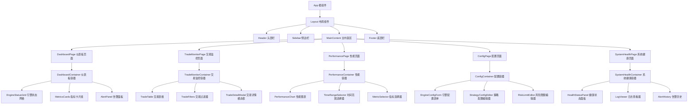
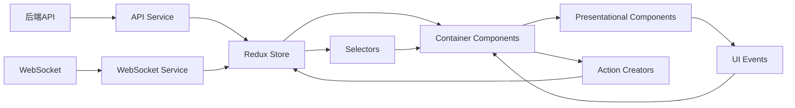

# 前端组件结构图

> 清风量化交易系统 v5.2 - Web管理界面前端组件结构
> **索引**: `DESIGN_004`
> **关联文档**: [Web管理界面架构设计](T.06.UI001.web_management_interface_architecture_design.md)

## 1. 整体组件架构

### 1.1 组件层次结构



### 1.2 组件分类说明

| 组件层级 | 组件类型 | 职责说明 | 示例组件 |
|----------|----------|----------|----------|
| **根组件** | App Component | 应用入口，全局状态管理 | `App.tsx` |
| **布局组件** | Layout Components | 页面布局结构，导航框架 | `Layout.tsx`, `Header.tsx` |
| **页面组件** | Page Components | 路由对应的完整页面 | `DashboardPage.tsx` |
| **容器组件** | Container Components | 业务逻辑容器，状态管理 | `DashboardContainer.tsx` |
| **展示组件** | Presentational Components | 纯UI展示，无业务逻辑 | `MetricCard.tsx` |
| **表单组件** | Form Components | 数据输入与验证 | `EngineConfigForm.tsx` |
| **图表组件** | Chart Components | 数据可视化 | `PerformanceChart.tsx` |
| **工具组件** | Utility Components | 通用工具组件 | `LoadingSpinner.tsx` |

## 2. 核心组件详细设计

### 2.1 Layout 布局组件

#### 2.1.1 Header 组件
```typescript
interface HeaderProps {
  user: User | null;
  notifications: Notification[];
  onLogout: () => void;
  onNotificationClick: (id: string) => void;
}

const Header: React.FC<HeaderProps> = ({
  user,
  notifications,
  onLogout,
  onNotificationClick
}) => {
  // 实现略
};
```

**子组件结构**:
```
Header
├── Logo (Logo组件)
├── UserMenu (用户菜单)
│   ├── UserAvatar (用户头像)
│   ├── UserInfo (用户信息)
│   └── LogoutButton (退出按钮)
├── NotificationBell (通知铃铛)
│   └── NotificationList (通知列表)
└── QuickActions (快捷操作)
    ├── RefreshButton (刷新按钮)
    └── HelpButton (帮助按钮)
```

#### 2.1.2 Sidebar 组件
```typescript
interface SidebarProps {
  activePath: string;
  onNavigate: (path: string) => void;
  collapsed: boolean;
  onCollapseChange: (collapsed: boolean) => void;
}

const Sidebar: React.FC<SidebarProps> = ({
  activePath,
  onNavigate,
  collapsed,
  onCollapseChange
}) => {
  // 实现略
};
```

**导航菜单项**:
```typescript
const menuItems = [
  {
    key: 'dashboard',
    icon: <DashboardOutlined />,
    label: '仪表板',
    path: '/dashboard'
  },
  {
    key: 'trades',
    icon: <TransactionOutlined />,
    label: '交易监控',
    path: '/trades'
  },
  {
    key: 'performance',
    icon: <LineChartOutlined />,
    label: '性能分析',
    path: '/performance'
  },
  {
    key: 'config',
    icon: <SettingOutlined />,
    label: '配置管理',
    path: '/config',
    children: [
      { key: 'engines', label: '引擎配置', path: '/config/engines' },
      { key: 'strategies', label: '策略配置', path: '/config/strategies' },
      { key: 'risk', label: '风险限额', path: '/config/risk' }
    ]
  },
  {
    key: 'system',
    icon: <MonitorOutlined />,
    label: '系统健康',
    path: '/system'
  }
];
```

### 2.2 DashboardPage 仪表板页面

#### 2.2.1 组件结构
```
DashboardPage
└── DashboardContainer
    ├── EngineStatusGrid
    │   ├── EngineStatusCard (×N)
    │   │   ├── EngineIcon (引擎图标)
    │   │   ├── EngineName (引擎名称)
    │   │   ├── StatusIndicator (状态指示器)
    │   │   ├── PerformanceMetrics (性能指标)
    │   │   └── ActionButtons (操作按钮)
    │   └── AddEngineCard (添加引擎卡片)
    ├── MetricsOverview
    │   ├── TotalTradesCard (总交易数)
    │   ├── TotalVolumeCard (总交易额)
    │   ├── ActiveEnginesCard (活跃引擎)
    │   └── SystemHealthCard (系统健康度)
    ├── RecentAlertsPanel
    │   ├── AlertItem (告警项)
    │   └── ViewAllAlertsButton (查看全部)
    └── QuickActionsPanel
        ├── StartAllEnginesButton (启动所有引擎)
        ├── StopAllEnginesButton (停止所有引擎)
        └── RunHealthCheckButton (运行健康检查)
```

#### 2.2.2 EngineStatusCard 组件设计
```typescript
interface EngineStatusCardProps {
  engine: Engine;
  onStart: (engineId: string) => void;
  onStop: (engineId: string) => void;
  onConfigure: (engineId: string) => void;
  onViewDetails: (engineId: string) => void;
}

const EngineStatusCard: React.FC<EngineStatusCardProps> = ({
  engine,
  onStart,
  onStop,
  onConfigure,
  onViewDetails
}) => {
  const statusColor = {
    running: 'green',
    stopped: 'gray',
    error: 'red',
    starting: 'orange'
  }[engine.status];

  return (
    <Card 
      title={
        <div className="engine-card-header">
          <EngineIcon type={engine.type} />
          <span className="engine-name">{engine.name}</span>
          <StatusBadge color={statusColor}>{engine.status}</StatusBadge>
        </div>
      }
      actions={[
        <Tooltip title="启动">
          <PlayCircleOutlined onClick={() => onStart(engine.id)} />
        </Tooltip>,
        <Tooltip title="停止">
          <StopOutlined onClick={() => onStop(engine.id)} />
        </Tooltip>,
        <Tooltip title="配置">
          <SettingOutlined onClick={() => onConfigure(engine.id)} />
        </Tooltip>,
        <Tooltip title="详情">
          <EyeOutlined onClick={() => onViewDetails(engine.id)} />
        </Tooltip>
      ]}
    >
      <div className="engine-metrics">
        <MetricItem label="CPU" value={`${engine.cpuUsage}%`} />
        <MetricItem label="内存" value={`${engine.memoryUsage}%`} />
        <MetricItem label="今日交易" value={engine.tradesToday} />
        <MetricItem label="错误数" value={engine.errorCount} />
      </div>
      <div className="engine-last-update">
        最后更新: {formatTime(engine.lastHeartbeat)}
      </div>
    </Card>
  );
};
```

### 2.3 TradeMonitorPage 交易监控页面

#### 2.3.1 组件结构
```
TradeMonitorPage
└── TradeMonitorContainer
    ├── TradeFilters
    │   ├── DateRangePicker (日期范围选择器)
    │   ├── SymbolSelector (标的选择器)
    │   ├── EngineSelector (引擎选择器)
    │   ├── SideFilter (买卖方向过滤器)
    │   └── ApplyFiltersButton (应用过滤器)
    ├── TradeTable
    │   ├── TradeTableHeader (表格头部)
    │   ├── TradeTableRow (表格行 ×N)
    │   │   ├── TradeIdCell (交易ID)
    │   │   ├── TimestampCell (时间戳)
    │   │   ├── SymbolCell (标的)
    │   │   ├── SideCell (买卖方向)
    │   │   ├── PriceCell (价格)
    │   │   ├── QuantityCell (数量)
    │   │   ├── VolumeCell (金额)
    │   │   ├── EngineCell (引擎)
    │   │   └── ActionsCell (操作)
    │   └── TradeTableFooter (表格底部)
    ├── TradeStatsPanel
    │   ├── TotalTradesStat (总交易数)
    │   ├── TotalVolumeStat (总交易额)
    │   ├── AvgPriceStat (平均价格)
    │   └── TradeDistributionChart (交易分布图)
    └── TradeDetailModal (交易详情模态框)
```

#### 2.3.2 TradeTable 组件设计
```typescript
interface TradeTableProps {
  trades: Trade[];
  loading: boolean;
  onRowClick: (trade: Trade) => void;
  onSortChange: (sortBy: string, sortOrder: 'asc' | 'desc') => void;
  pagination: {
    current: number;
    pageSize: number;
    total: number;
    onChange: (page: number, pageSize: number) => void;
  };
}

const TradeTable: React.FC<TradeTableProps> = ({
  trades,
  loading,
  onRowClick,
  onSortChange,
  pagination
}) => {
  const columns = [
    {
      title: '交易ID',
      dataIndex: 'tradeId',
      key: 'tradeId',
      sorter: true,
      width: 120
    },
    {
      title: '时间',
      dataIndex: 'timestamp',
      key: 'timestamp',
      sorter: true,
      render: (timestamp: string) => formatDateTime(timestamp),
      width: 150
    },
    {
      title: '标的',
      dataIndex: 'symbol',
      key: 'symbol',
      width: 100
    },
    {
      title: '方向',
      dataIndex: 'side',
      key: 'side',
      render: (side: string) => (
        <Tag color={side === 'buy' ? 'green' : 'red'}>
          {side === 'buy' ? '买入' : '卖出'}
        </Tag>
      ),
      width: 80
    },
    {
      title: '价格',
      dataIndex: 'price',
      key: 'price',
      sorter: true,
      render: (price: number) => formatCurrency(price),
      width: 100
    },
    {
      title: '数量',
      dataIndex: 'quantity',
      key: 'quantity',
      sorter: true,
      width: 100
    },
    {
      title: '金额',
      dataIndex: 'volume',
      key: 'volume',
      sorter: true,
      render: (volume: number) => formatCurrency(volume),
      width: 120
    },
    {
      title: '引擎',
      dataIndex: 'engineId',
      key: 'engineId',
      width: 100
    },
    {
      title: '操作',
      key: 'actions',
      render: (_: any, trade: Trade) => (
        <Button
          type="link"
          onClick={() => onRowClick(trade)}
          icon={<EyeOutlined />}
        >
          详情
        </Button>
      ),
      width: 80
    }
  ];

  return (
    <Table
      columns={columns}
      dataSource={trades}
      loading={loading}
      rowKey="tradeId"
      pagination={pagination}
      onChange={(pagination, filters, sorter) => {
        if (sorter && 'field' in sorter) {
          onSortChange(
            sorter.field as string,
            sorter.order === 'ascend' ? 'asc' : 'desc'
          );
        }
      }}
      onRow={(record) => ({
        onClick: () => onRowClick(record)
      })}
    />
  );
};
```

### 2.4 PerformancePage 性能分析页面

#### 2.4.1 组件结构
```
PerformancePage
└── PerformanceContainer
    ├── ChartControls
    │   ├── TimeRangeSelector (时间范围选择器)
    │   ├── MetricSelector (指标选择器)
    │   ├── ChartTypeSelector (图表类型选择器)
    │   ├── EngineFilter (引擎过滤器)
    │   └── RefreshButton (刷新按钮)
    ├── ChartArea
    │   ├── EquityCurveChart (权益曲线图)
    │   ├── DrawdownChart (回撤图)
    │   ├── SharpeRatioChart (夏普比率图)
    │   ├── TradeDistributionChart (交易分布图)
    │   └── PerformanceHeatmap (性能热力图)
    ├── PerformanceMetricsPanel
    │   ├── SharpeRatioCard (夏普比率)
    │   ├── MaxDrawdownCard (最大回撤)
    │   ├── WinRateCard (胜率)
    │   ├── AvgReturnCard (平均收益)
    │   └── VolatilityCard (波动率)
    └── ExportControls
        ├── ExportCSVButton (导出CSV)
        ├── ExportPNGButton (导出PNG)
        └── ShareReportButton (分享报告)
```

#### 2.4.2 PerformanceChart 组件设计
```typescript
interface PerformanceChartProps {
  data: ChartData[];
  chartType: 'line' | 'bar' | 'area' | 'scatter';
  title: string;
  xAxisKey: string;
  yAxisKey: string;
  color?: string;
  height?: number;
  onPointClick?: (point: ChartDataPoint) => void;
}

const PerformanceChart: React.FC<PerformanceChartProps> = ({
  data,
  chartType,
  title,
  xAxisKey,
  yAxisKey,
  color = '#1890ff',
  height = 400,
  onPointClick
}) => {
  const chartConfig = {
    line: {
      type: 'monotone',
      dataKey: yAxisKey,
      stroke: color,
      strokeWidth: 2,
      dot: false,
      activeDot: { r: 6, onClick: onPointClick }
    },
    bar: {
      dataKey: yAxisKey,
      fill: color
    },
    area: {
      type: 'monotone',
      dataKey: yAxisKey,
      stroke: color,
      fill: color,
      fillOpacity: 0.3
    },
    scatter: {
      dataKey: yAxisKey,
      fill: color,
      r: 4
    }
  };

  return (
    <div className="performance-chart">
      <h3>{title}</h3>
      <ResponsiveContainer width="100%" height={height}>
        <RechartsChart data={data}>
          <CartesianGrid strokeDasharray="3 3" />
          <XAxis 
            dataKey={xAxisKey} 
            tickFormatter={formatDate}
          />
          <YAxis 
            tickFormatter={formatNumber}
            label={{ value: yAxisKey, angle: -90, position: 'insideLeft' }}
          />
          <Tooltip 
            formatter={(value) => [formatNumber(value as number), yAxisKey]}
            labelFormatter={formatDate}
          />
          <Legend />
          {chartType === 'line' && <Line {...chartConfig.line} />}
          {chartType === 'bar' && <Bar {...chartConfig.bar} />}
          {chartType === 'area' && <Area {...chartConfig.area} />}
          {chartType === 'scatter' && <Scatter {...chartConfig.scatter} />}
        </RechartsChart>
      </ResponsiveContainer>
    </div>
  );
};
```

## 3. 组件交互关系

### 3.1 数据流图



### 3.2 状态管理设计

#### 3.2.1 Redux Store 结构
```typescript
interface RootState {
  auth: AuthState;
  engines: EnginesState;
  trades: TradesState;
  performance: PerformanceState;
  config: ConfigState;
  system: SystemState;
  ui: UIState;
}

interface EnginesState {
  engineList: Engine[];
  loading: boolean;
  error: string | null;
  selectedEngineId: string | null;
}

interface TradesState {
  trades: Trade[];
  filters: TradeFilters;
  loading: boolean;
  error: string | null;
  pagination: Pagination;
  selectedTrade: Trade | null;
}

interface UIState {
  sidebarCollapsed: boolean;
  theme: 'light' | 'dark';
  notifications: Notification[];
  modal: {
    type: string | null;
    data: any;
  };
}
```

#### 3.2.2 关键Action定义
```typescript
// 引擎相关Action
const fetchEngines = createAsyncThunk('engines/fetch', async () => {
  const response = await engineAPI.getEngines();
  return response.data;
});

const startEngine = createAsyncThunk('engines/start', async (engineId: string) => {
  const response = await engineAPI.startEngine(engineId);
  return response.data;
});

const updateEngineConfig = createAsyncThunk('engines/updateConfig', 
  async ({ engineId, config }: { engineId: string; config: EngineConfig }) => {
    const response = await engineAPI.updateConfig(engineId, config);
    return response.data;
  }
);

// 交易相关Action
const fetchTrades = createAsyncThunk('trades/fetch', 
  async (filters: TradeFilters) => {
    const response = await tradeAPI.getTrades(filters);
    return response.data;
  }
);

// WebSocket Action
const websocketMessageReceived = createAction('websocket/message', 
  (message: WebSocketMessage) => ({ payload: message })
);
```

## 4. 组件开发规范

### 4.1 命名规范
| 组件类型 | 命名规则 | 示例 |
|----------|----------|------|
| **页面组件** | `[PageName]Page` | `DashboardPage.tsx` |
| **容器组件** | `[Feature]Container` | `DashboardContainer.tsx` |
| **展示组件** | `[ComponentName]` | `MetricCard.tsx` |
| **表单组件** | `[FormName]Form` | `EngineConfigForm.tsx` |
| **图表组件** | `[ChartName]Chart` | `PerformanceChart.tsx` |
| **工具组件** | `[UtilityName]` | `LoadingSpinner.tsx` |

### 4.2 文件结构规范
```
src/
├── components/
│   ├── layout/           # 布局组件
│   │   ├── Header.tsx
│   │   ├── Sidebar.tsx
│   │   └── Layout.tsx
│   ├── pages/           # 页面组件
│   │   ├── DashboardPage.tsx
│   │   ├── TradeMonitorPage.tsx
│   │   └── PerformancePage.tsx
│   ├── containers/      # 容器组件
│   │   ├── DashboardContainer.tsx
│   │   ├── TradeMonitorContainer.tsx
│   │   └── PerformanceContainer.tsx
│   ├── charts/         # 图表组件
│   │   ├── PerformanceChart.tsx
│   │   └── TradeDistributionChart.tsx
│   ├── forms/          # 表单组件
│   │   ├── EngineConfigForm.tsx
│   │   └── StrategyConfigForm.tsx
│   └── common/         # 通用组件
│       ├── LoadingSpinner.tsx
│       ├── ErrorBoundary.tsx
│       └── NotFound.tsx
├── services/           # 服务层
│   ├── api.ts
│   ├── websocket.ts
│   └── auth.ts
├── store/              # 状态管理
│   ├── index.ts
│   ├── actions.ts
│   ├── reducers.ts
│   └── selectors.ts
├── hooks/              # 自定义Hook
│   ├── useEngines.ts
│   ├── useTrades.ts
│   └── useWebSocket.ts
├── utils/              # 工具函数
│   ├── formatters.ts
│   ├── validators.ts
│   └── constants.ts
└── types/              # TypeScript类型定义
    ├── index.ts
    ├── engine.ts
    └── trade.ts
```

### 4.3 组件开发原则

#### 4.3.1 单一职责原则
- 每个组件只负责一个功能
- 容器组件负责状态管理和业务逻辑
- 展示组件只负责UI渲染

#### 4.3.2 可复用性原则
- 提取通用组件到`common/`目录
- 组件参数设计要灵活
- 支持自定义样式和事件

#### 4.3.3 可测试性原则
- 组件逻辑与UI分离
- 使用Props注入依赖
- 提供测试友好的接口

#### 4.3.4 性能优化原则
- 使用React.memo避免不必要的重渲染
- 使用useMemo/useCallback优化计算
- 实现虚拟滚动处理大数据列表
- 按需加载大型组件

## 5. 实施指南

### 5.1 组件开发顺序
1. **基础组件** (第1天)
   - Layout组件 (Header, Sidebar, Footer)
   - 通用组件 (LoadingSpinner, ErrorBoundary)
   - 工具函数和类型定义

2. **页面框架** (第2天)
   - 页面路由配置
   - 页面骨架组件
   - 导航和权限控制

3. **核心功能组件** (第3-4天)
   - Dashboard相关组件
   - TradeMonitor相关组件
   - Performance相关组件

4. **高级功能组件** (第5天)
   - Config相关组件
   - SystemHealth相关组件
   - 导出和分享功能

5. **优化和测试** (第6-7天)
   - 性能优化
   - 响应式设计
   - 单元测试和E2E测试

### 5.2 组件测试策略
| 测试类型 | 测试工具 | 测试目标 | 覆盖率目标 |
|----------|----------|----------|------------|
| **单元测试** | Jest + React Testing Library | 组件逻辑和渲染 | ≥80% |
| **集成测试** | Cypress | 组件间交互 | ≥70% |
| **E2E测试** | Cypress | 完整用户流程 | ≥60% |
| **性能测试** | Lighthouse | 加载和渲染性能 | 达标 |
| **可视化测试** | Storybook + Chromatic | UI一致性和回归 | 100% |

### 5.3 组件文档规范
每个组件需要包含：
1. **组件说明**: 用途、功能、使用场景
2. **Props接口**: TypeScript接口定义
3. **使用示例**: 代码示例
4. **注意事项**: 使用限制和最佳实践
5. **API文档**: 方法和事件说明

---

**文档版本**: 1.0.0  
**最后更新**: 2026-04-02  
**维护者**: 首席蓝图架构师  
**索引**: `DESIGN_004`  
**状态**: ✅ 设计完成，待评审