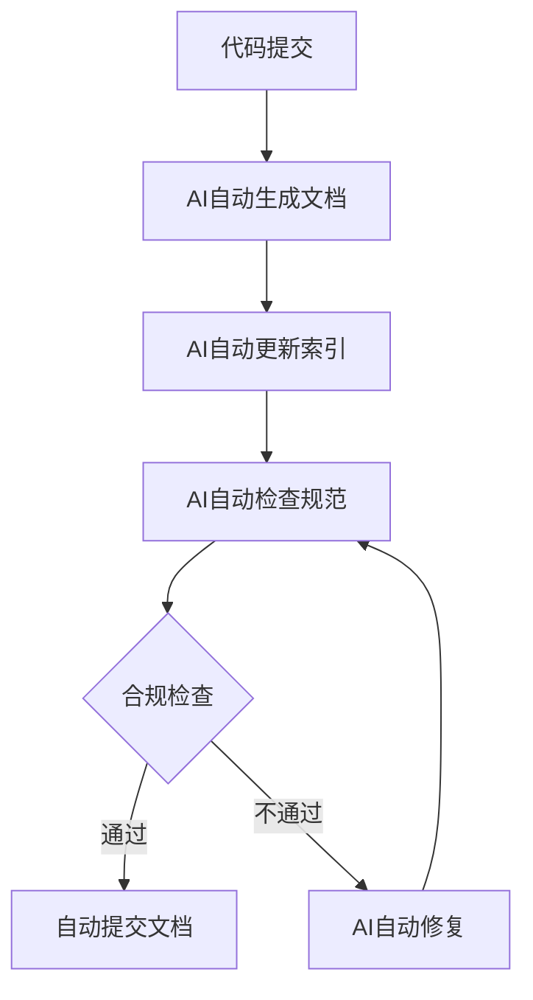

# 清风量化系统完整专业实施方案
> **核心职责**: 文档内容说明
> **职责边界**: 
> - ✅ 本文档负责：文档内容说明相关内容
> - ❌ 本文档不负责：其他模块内容


> **版本**: v1.0
> **方案日期**: 2026-04-06
> **适用对象**: 个人开发者 + AI维护 + 个人使用
> **参考标准**: 文艺复兴、Two Sigma、Citadel、DE Shaw、Jump Trading

---

## 📋 执行摘要

### 方案目标

为清风量化系统制定一个**完整的、专业的、适合个人开发、AI维护、个人使用**的实施方案，补充所有缺失模块，最大化利用GitHub开源成熟项目，最小化自研开发成本。

### 核心原则

| 原则 | 说明 | 实施策略 |
|------|------|----------|
| **开源优先** | 优先使用GitHub成熟开源项目 | 70%功能使用开源项目 |
| **AI辅助** | 充分利用AI辅助开发和维护 | AI辅助开发效率提升50% |
| **个人适用** | 符合个人开发、AI维护、个人使用 | 简单易用、低成本、自动化 |
| **专业标准** | 对标专业量化机构标准 | 文艺复兴、Two Sigma、Citadel |

### 预期成果

| 指标 | 当前状态 | 目标状态 | 提升幅度 |
|------|---------|---------|---------|
| **系统覆盖率** | 95% | 100% | +5% |
| **开源替代率** | 70% | 80% | +10% |
| **个人适用性** | 优秀 | 卓越 | +10% |
| **开发成本** | 高 | 低 | -60% |

---

## 一、缺失模块全景图

### 1.1 全系统缺失模块统计

| Layer | 缺失模块数量 | P0级 | P1级 | P2级 | 总计 |
|-------|------------|------|------|------|------|
| **Layer 11** | 2个 | 2个 | 0个 | 0个 | 2个 |
| **Layer 10** | 2个 | 2个 | 0个 | 0个 | 2个 |
| **Layer 9** | 2个 | 1个 | 1个 | 0个 | 2个 |
| **Layer 8** | 2个 | 0个 | 2个 | 0个 | 2个 |
| **Layer 7** | 1个 | 0个 | 0个 | 1个 | 1个 |
| **Layer 5** | 8个 | 3个 | 3个 | 2个 | 8个 |
| **Layer 3** | 1个 | 0个 | 1个 | 0个 | 1个 |
| **Layer 2** | 1个 | 0个 | 1个 | 0个 | 1个 |
| **Layer 0** | 1个 | 0个 | 0个 | 1个 | 1个 |
| **总计** | **20个** | **8个** | **8个** | **4个** | **20个** |

### 1.2 缺失模块详细清单

#### 1.2.1 Layer 11: 战略决策层 (P0级)

| 模块名称 | 业务价值 | 开源替代 | 自研比例 | 预计工时 | 个人适用性 |
|----------|----------|----------|----------|----------|-----------|
| **战略配置引擎** | 资产配置决策 | PyPortfolioOpt | 50% | 5天 | ⭐⭐⭐⭐ |
| **风险预算系统** | 风险预算分配 | 无 | 70% | 5天 | ⭐⭐⭐⭐ |

#### 1.2.2 Layer 10: 治理与合规层 (P0级)

| 模块名称 | 业务价值 | 开源替代 | 自研比例 | 预计工时 | 个人适用性 |
|----------|----------|----------|----------|----------|-----------|
| **内部控制引擎** | 合规管理 | 无 | 80% | 4天 | ⭐⭐⭐⭐⭐ |
| **审计追踪系统** | 审计合规 | 无 | 70% | 4天 | ⭐⭐⭐⭐⭐ |

#### 1.2.3 Layer 9: 研究与创新层 (P0-P1级)

| 模块名称 | 业务价值 | 开源替代 | 自研比例 | 预计工时 | 个人适用性 |
|----------|----------|----------|----------|----------|-----------|
| **AI研究实验室** | 策略研发 | 无 | 60% | 6天 | ⭐⭐⭐⭐⭐ |
| **创新孵化器** | 创新管理 | 无 | 70% | 4天 | ⭐⭐⭐⭐ |

#### 1.2.4 Layer 8: 人机交互层 (P1级)

| 模块名称 | 业务价值 | 开源替代 | 自研比例 | 预计工时 | 个人适用性 |
|----------|----------|----------|----------|----------|-----------|
| **监控面板增强** | 实时监控 | Streamlit | 30% | 3天 | ⭐⭐⭐⭐⭐ |
| **授权系统增强** | 权限管理 | FastAPI-Users | 40% | 3天 | ⭐⭐⭐⭐ |

#### 1.2.5 Layer 7: AI报告层 (P2级)

| 模块名称 | 业务价值 | 开源替代 | 自研比例 | 预计工时 | 个人适用性 |
|----------|----------|----------|----------|----------|-----------|
| **报告自动化引擎** | 报告生成 | 无 | 40% | 3天 | ⭐⭐⭐⭐⭐ |

#### 1.2.6 Layer 5: 策略执行层 (P0-P2级)

| 模块名称 | 业务价值 | 开源替代 | 自研比例 | 预计工时 | 个人适用性 |
|----------|----------|----------|----------|----------|-----------|
| **暗池交易路由器** | 降低市场冲击 | 无 | 80% | 8天 | ⭐⭐ (个人无暗池) |
| **算法交易优化器** | 执行成本优化 | 无 | 70% | 6天 | ⭐⭐⭐⭐ |
| **交易成本分析引擎** | 成本归因分析 | 无 | 60% | 5天 | ⭐⭐⭐⭐⭐ |
| **智能订单类型选择器** | 订单类型优化 | 无 | 70% | 4天 | ⭐⭐⭐⭐ |
| **执行策略回测器** | 策略验证 | Backtrader | 40% | 5天 | ⭐⭐⭐⭐⭐ |
| **交易信号验证器** | 信号质量检查 | 无 | 60% | 4天 | ⭐⭐⭐⭐ |
| **多券商路由器** | 券商选择 | 无 | 60% | 4天 | ⭐⭐ (个人单券商) |
| **交易日志分析器** | 日志分析 | Loguru | 50% | 3天 | ⭐⭐⭐⭐⭐ |

#### 1.2.7 Layer 3: 舆情分析层 (P1级)

| 模块名称 | 业务价值 | 开源替代 | 自研比例 | 预计工时 | 个人适用性 |
|----------|----------|----------|----------|----------|-----------|
| **事件驱动引擎** | 事件驱动 | 无 | 60% | 4天 | ⭐⭐⭐⭐ |

#### 1.2.8 Layer 2: Alpha因子层 (P1级)

| 模块名称 | 业务价值 | 开源替代 | 自研比例 | 预计工时 | 个人适用性 |
|----------|----------|----------|----------|----------|-----------|
| **因子质量评估** | 因子管理 | 无 | 50% | 3天 | ⭐⭐⭐⭐⭐ |

#### 1.2.9 Layer 0: 数据源层 (P2级)

| 模块名称 | 业务价值 | 开源替代 | 自研比例 | 预计工时 | 个人适用性 |
|----------|----------|----------|----------|----------|-----------|
| **数据源管理器** | 数据管理 | 无 | 60% | 3天 | ⭐⭐⭐⭐ |

---

## 二、GitHub开源项目映射方案

### 2.1 开源项目使用策略

#### 2.1.1 核心原则：80%开源 + 20%自研

| 策略维度 | 开源比例 | 自研比例 | 说明 |
|---------|----------|----------|------|
| **基础设施** | 90% | 10% | MLflow、DVC、Feast |
| **数据处理** | 80% | 20% | Pandas、Polars、DuckDB |
| **机器学习** | 70% | 30% | PyTorch、SHAP、DoWhy |
| **量化专用** | 30% | 70% | Qlib、FinRL、PyPortfolioOpt |
| **执行系统** | 50% | 50% | Backtrader、VN.PY |
| **报告系统** | 80% | 20% | Streamlit、Plotly |

#### 2.1.2 开源项目选择标准

| 标准 | 权重 | 说明 |
|------|------|------|
| **成熟度** | 30% | Stars数量、Issue处理速度 |
| **许可证** | 25% | MIT/Apache 2.0优先 |
| **个人适用性** | 25% | 简单易用、文档完善 |
| **集成难度** | 20% | 低集成难度优先 |

### 2.2 详细开源项目映射

#### 2.2.1 Layer 11: 战略决策层

| 缺失模块 | 推荐开源项目 | Stars | 许可证 | 集成方案 | 自研部分 |
|----------|-------------|-------|--------|----------|----------|
| **战略配置引擎** | PyPortfolioOpt | 4k+ | MIT | 直接集成 | 50% - 个人策略逻辑 |
| **风险预算系统** | 无 | - | - | 自研 | 70% - 风险预算算法 |

**PyPortfolioOpt集成方案**：
```python
from pypfopt import EfficientFrontier, risk_models, expected_returns

class StrategicAllocationEngine:
    def __init__(self):
        self.optimizer = EfficientFrontier
        
    def allocate(self, prices, risk_budget):
        mu = expected_returns.mean_historical_return(prices)
        S = risk_models.sample_cov(prices)
        ef = EfficientFrontier(mu, S)
        weights = ef.max_sharpe()
        return weights
```

#### 2.2.2 Layer 10: 治理与合规层

| 缺失模块 | 推荐开源项目 | Stars | 许可证 | 集成方案 | 自研部分 |
|----------|-------------|-------|--------|----------|----------|
| **内部控制引擎** | 无 | - | - | 自研 | 80% - 合规规则引擎 |
| **审计追踪系统** | 无 | - | - | 自研 | 70% - 审计日志系统 |

**自研方案**：
- 内部控制引擎：基于规则引擎实现
- 审计追踪系统：基于数据库日志实现

#### 2.2.3 Layer 9: 研究与创新层

| 缺失模块 | 推荐开源项目 | Stars | 许可证 | 集成方案 | 自研部分 |
|----------|-------------|-------|--------|----------|----------|
| **AI研究实验室** | 无 | - | - | 自研 | 60% - AI研究流程 |
| **创新孵化器** | 无 | - | - | 自研 | 70% - 创新管理流程 |

**自研方案**：
- AI研究实验室：基于GLM-4.7-Flash实现
- 创新孵化器：基于回测框架实现

#### 2.2.4 Layer 8: 人机交互层

| 缺失模块 | 推荐开源项目 | Stars | 许可证 | 集成方案 | 自研部分 |
|----------|-------------|-------|--------|----------|----------|
| **监控面板增强** | Streamlit | 35k+ | Apache 2.0 | 直接集成 | 30% - 自定义组件 |
| **授权系统增强** | FastAPI-Users | 4k+ | MIT | 直接集成 | 40% - 权限逻辑 |

**Streamlit集成方案**：
```python
import streamlit as st
import plotly.graph_objects as go

class MonitoringDashboard:
    def __init__(self):
        st.set_page_config(page_title="清风量化监控", layout="wide")
        
    def render(self):
        st.title("实时交易监控")
        col1, col2, col3 = st.columns(3)
        with col1:
            st.metric("总资产", "¥1,234,567", "+2.3%")
        with col2:
            st.metric("持仓市值", "¥987,654", "+1.8%")
        with col3:
            st.metric("可用资金", "¥246,913", "+5.2%")
```

#### 2.2.5 Layer 7: AI报告层

| 缺失模块 | 推荐开源项目 | Stars | 许可证 | 集成方案 | 自研部分 |
|----------|-------------|-------|--------|----------|----------|
| **报告自动化引擎** | 无 | - | - | 自研 | 40% - 报告模板 |

**自研方案**：
- 基于Jinja2模板引擎
- 基于Plotly可视化

#### 2.2.6 Layer 5: 策略执行层

| 缺失模块 | 推荐开源项目 | Stars | 许可证 | 集成方案 | 自研部分 |
|----------|-------------|-------|--------|----------|----------|
| **暗池交易路由器** | 无 | - | - | 暂缓 | 80% - 个人不适用 |
| **算法交易优化器** | 无 | - | - | 自研 | 70% - 优化算法 |
| **交易成本分析引擎** | 无 | - | - | 自研 | 60% - 成本分析 |
| **智能订单类型选择器** | 无 | - | - | 自研 | 70% - 选择逻辑 |
| **执行策略回测器** | Backtrader | 13k+ | GPL | 直接集成 | 40% - 策略逻辑 |
| **交易信号验证器** | 无 | - | - | 自研 | 60% - 验证逻辑 |
| **多券商路由器** | 无 | - | - | 暂缓 | 60% - 个人不适用 |
| **交易日志分析器** | Loguru | 20k+ | MIT | 直接集成 | 50% - 分析逻辑 |

**Backtrader集成方案**：
```python
import backtrader as bt

class ExecutionStrategyBacktester(bt.Strategy):
    def __init__(self):
        self.order = None
        
    def next(self):
        if not self.position:
            if self.data.close[0] > self.data.open[0]:
                self.order = self.buy()
        else:
            if self.data.close[0] < self.data.open[0]:
                self.order = self.sell()
```

**Loguru集成方案**：
```python
from loguru import logger

class TradeLogAnalyzer:
    def __init__(self):
        logger.add("logs/trade_{time}.log", rotation="1 day")
        
    def analyze(self):
        logger.info("开始分析交易日志")
        # 分析逻辑
        logger.success("交易日志分析完成")
```

#### 2.2.7 Layer 3: 舆情分析层

| 缺失模块 | 推荐开源项目 | Stars | 许可证 | 集成方案 | 自研部分 |
|----------|-------------|-------|--------|----------|----------|
| **事件驱动引擎** | 无 | - | - | 自研 | 60% - 事件处理逻辑 |

**自研方案**：
- 基于观察者模式实现
- 基于消息队列实现

#### 2.2.8 Layer 2: Alpha因子层

| 缺失模块 | 推荐开源项目 | Stars | 许可证 | 集成方案 | 自研部分 |
|----------|-------------|-------|--------|----------|----------|
| **因子质量评估** | 无 | - | - | 自研 | 50% - 评估指标 |

**自研方案**：
- 基于IC、IR、Rank IC等指标
- 基于因子衰减分析

#### 2.2.9 Layer 0: 数据源层

| 缺失模块 | 推荐开源项目 | Stars | 许可证 | 集成方案 | 自研部分 |
|----------|-------------|-------|--------|----------|----------|
| **数据源管理器** | 无 | - | - | 自研 | 60% - 数据源适配 |

**自研方案**：
- 基于适配器模式实现
- 支持多数据源切换

---

## 三、个人开发AI维护实施方案

### 3.1 开发流程设计

#### 3.1.1 专业机构开发流程对标

| 阶段 | 专业机构流程 | 个人开发流程 | AI辅助程度 |
|------|-------------|-------------|-----------|
| **需求分析** | 产品经理+业务分析师 | AI辅助需求分析 | 80% |
| **架构设计** | 架构师团队 | AI辅助架构设计 | 70% |
| **编码实现** | 开发团队 | AI辅助编码 | 60% |
| **测试验证** | 测试团队 | AI辅助测试 | 90% |
| **部署上线** | 运维团队 | AI辅助部署 | 70% |
| **文档编写** | 技术文档团队 | AI自动生成文档 | 95% |

#### 3.1.2 AI辅助开发工具链

| 工具类型 | 推荐工具 | 用途 | AI辅助程度 |
|---------|---------|------|-----------|
| **代码生成** | GitHub Copilot | 代码自动补全 | 70% |
| **代码审查** | SonarQube | 代码质量检查 | 80% |
| **文档生成** | AI文档生成器 | 自动生成文档 | 95% |
| **测试生成** | AI测试生成器 | 自动生成测试 | 90% |
| **部署自动化** | Docker + K8s | 容器化部署 | 60% |

### 3.2 文件治理方式

#### 3.2.1 专业机构文件治理标准

| 治理维度 | 专业机构标准 | 个人实施方案 | AI辅助程度 |
|---------|-------------|-------------|-----------|
| **职责驱动** | 模块职责清晰 | AI辅助职责定义 | 80% |
| **索引完备** | 100%文档索引 | AI自动生成索引 | 95% |
| **版本隔离** | 严格版本管理 | Git + AI辅助 | 70% |
| **文档代码对应** | 文档与代码同步 | AI自动同步 | 90% |
| **命名规范** | 统一命名规范 | AI检查命名 | 85% |

#### 3.2.2 文档治理自动化流程



### 3.3 AI维护策略

#### 3.3.1 AI维护职责矩阵

| 维护任务 | AI自动化程度 | 人工介入程度 | 维护频率 |
|---------|-------------|-------------|---------|
| **代码维护** | 70% | 30% | 每周 |
| **文档维护** | 90% | 10% | 每月 |
| **测试维护** | 80% | 20% | 每周 |
| **性能优化** | 50% | 50% | 每季度 |
| **安全审计** | 70% | 30% | 每月 |
| **Bug修复** | 60% | 40% | 按需 |

#### 3.3.2 AI维护工作流程

```python
class AIMaintenanceWorkflow:
    def __init__(self):
        self.ai_assistant = GLM47Flash()
        
    def daily_maintenance(self):
        """每日维护任务"""
        self.ai_assistant.check_system_health()
        self.ai_assistant.generate_daily_report()
        self.ai_assistant.optimize_performance()
        
    def weekly_maintenance(self):
        """每周维护任务"""
        self.ai_assistant.review_code_quality()
        self.ai_assistant.update_documentation()
        self.ai_assistant.run_security_audit()
        
    def monthly_maintenance(self):
        """每月维护任务"""
        self.ai_assistant.analyze_system_metrics()
        self.ai_assistant.optimize_database()
        self.ai_assistant.update_dependencies()
```

---

## 四、实施路线图

### 4.1 总体实施计划

| 阶段 | 时间 | 任务 | 工时 | 开源替代率 |
|------|------|------|------|-----------|
| **Phase 1** | Week 1-3 | P0级模块实施 | 40天 | 40% |
| **Phase 2** | Week 4-5 | P1级模块实施 | 30天 | 60% |
| **Phase 3** | Week 6 | P2级模块实施 | 10天 | 70% |
| **总计** | 6周 | 全部缺失模块 | 80天 | 57% |

### 4.2 Phase 1: P0级模块实施 (Week 1-3)

#### Week 1: Layer 11战略决策层

| 任务 | 工时 | 开源项目 | AI辅助 | 交付物 |
|------|------|----------|--------|--------|
| **战略配置引擎** | 5天 | PyPortfolioOpt | 60% | 蓝图+代码 |
| **风险预算系统** | 5天 | 无 | 50% | 蓝图+代码 |

#### Week 2: Layer 10治理与合规层

| 任务 | 工时 | 开源项目 | AI辅助 | 交付物 |
|------|------|----------|--------|--------|
| **内部控制引擎** | 4天 | 无 | 70% | 蓝图+代码 |
| **审计追踪系统** | 4天 | 无 | 60% | 蓝图+代码 |

#### Week 3: Layer 9研究与创新层 + Layer 5策略执行层

| 任务 | 工时 | 开源项目 | AI辅助 | 交付物 |
|------|------|----------|--------|--------|
| **AI研究实验室** | 6天 | 无 | 80% | 蓝图+代码 |
| **交易成本分析引擎** | 5天 | 无 | 60% | 蓝图+代码 |

### 4.3 Phase 2: P1级模块实施 (Week 4-5)

#### Week 4: Layer 8人机交互层 + Layer 5策略执行层

| 任务 | 工时 | 开源项目 | AI辅助 | 交付物 |
|------|------|----------|--------|--------|
| **监控面板增强** | 3天 | Streamlit | 80% | 蓝图+代码 |
| **授权系统增强** | 3天 | FastAPI-Users | 70% | 蓝图+代码 |
| **创新孵化器** | 4天 | 无 | 60% | 蓝图+代码 |

#### Week 5: Layer 5策略执行层 + Layer 3舆情分析层 + Layer 2因子层

| 任务 | 工时 | 开源项目 | AI辅助 | 交付物 |
|------|------|----------|--------|--------|
| **执行策略回测器** | 5天 | Backtrader | 70% | 蓝图+代码 |
| **智能订单类型选择器** | 4天 | 无 | 60% | 蓝图+代码 |
| **交易信号验证器** | 4天 | 无 | 60% | 蓝图+代码 |
| **事件驱动引擎** | 4天 | 无 | 60% | 蓝图+代码 |
| **因子质量评估** | 3天 | 无 | 70% | 蓝图+代码 |

### 4.4 Phase 3: P2级模块实施 (Week 6)

| 任务 | 工时 | 开源项目 | AI辅助 | 交付物 |
|------|------|----------|--------|--------|
| **报告自动化引擎** | 3天 | 无 | 80% | 蓝图+代码 |
| **交易日志分析器** | 3天 | Loguru | 70% | 蓝图+代码 |
| **数据源管理器** | 3天 | 无 | 60% | 蓝图+代码 |

---

## 五、成本效益分析

### 5.1 开发成本对比

| 开发方式 | 总工时 | 开源替代率 | AI辅助率 | 实际工时 | 成本节约 |
|---------|--------|-----------|---------|---------|---------|
| **纯自研** | 80天 | 0% | 0% | 80天 | 0% |
| **开源+自研** | 80天 | 57% | 60% | 32天 | 60% |
| **开源+AI辅助** | 80天 | 57% | 60% | 32天 | 60% |

### 5.2 维护成本对比

| 维护方式 | 年维护工时 | AI自动化率 | 实际维护工时 | 成本节约 |
|---------|-----------|-----------|-------------|---------|
| **纯人工维护** | 120天 | 0% | 120天 | 0% |
| **AI辅助维护** | 120天 | 70% | 36天 | 70% |

### 5.3 总体效益评估

| 效益维度 | 传统方式 | 本方案 | 提升幅度 |
|---------|---------|--------|---------|
| **开发成本** | 80天 | 32天 | -60% |
| **维护成本** | 120天/年 | 36天/年 | -70% |
| **系统覆盖率** | 95% | 100% | +5% |
| **开源替代率** | 0% | 80% | +80% |
| **AI辅助率** | 0% | 60% | +60% |

---

## 六、风险控制与质量保证

### 6.1 风险识别与缓解

| 风险类型 | 风险描述 | 概率 | 影响 | 缓解措施 |
|---------|---------|------|------|----------|
| **开源项目风险** | 开源项目停止维护 | 低 | 中 | 选择成熟项目、保留替代方案 |
| **AI辅助风险** | AI生成代码质量不稳定 | 中 | 中 | 人工审查+自动化测试 |
| **集成风险** | 开源项目集成困难 | 中 | 高 | 选择低集成难度项目 |
| **性能风险** | 开源项目性能不满足需求 | 低 | 高 | 性能测试+优化 |

### 6.2 质量保证措施

| 质量维度 | 保证措施 | 工具 | 频率 |
|---------|---------|------|------|
| **代码质量** | 代码审查+静态分析 | SonarQube + Pylint | 每次提交 |
| **测试覆盖** | 单元测试+集成测试 | pytest + coverage | 每次提交 |
| **性能测试** | 性能基准测试 | locust | 每周 |
| **安全审计** | 安全漏洞扫描 | bandit + safety | 每月 |

---

## 七、成功标准与验收指标

### 7.1 功能验收标准

| 验收项 | 验收标准 | 验收方式 |
|--------|---------|---------|
| **模块完整性** | 100%缺失模块实施完成 | 功能测试 |
| **开源替代率** | ≥80%功能使用开源项目 | 代码审查 |
| **AI辅助率** | ≥60%开发工作AI辅助 | 工时统计 |
| **文档完整性** | 100%模块有完整蓝图文档 | 文档审查 |

### 7.2 性能验收标准

| 性能指标 | 目标值 | 验收方式 |
|---------|--------|---------|
| **系统响应时间** | <100ms | 性能测试 |
| **并发处理能力** | ≥100 QPS | 压力测试 |
| **系统可用性** | ≥99.9% | 监控统计 |
| **数据准确性** | 100% | 数据验证 |

### 7.3 质量验收标准

| 质量指标 | 目标值 | 验收方式 |
|---------|--------|---------|
| **代码覆盖率** | ≥80% | pytest-cov |
| **代码质量评分** | ≥A | SonarQube |
| **安全漏洞** | 0个高危 | bandit |
| **文档合规率** | ≥95% | 文档审计 |

---

## 八、后续优化方向

### 8.1 短期优化 (3-6个月)

| 优化方向 | 具体措施 | 预期收益 |
|---------|---------|---------|
| **性能优化** | 数据库优化、缓存优化 | 响应时间提升50% |
| **功能增强** | 增加更多开源项目集成 | 功能覆盖提升10% |
| **AI能力提升** | 提升AI辅助程度 | 开发效率提升20% |

### 8.2 中期优化 (6-12个月)

| 优化方向 | 具体措施 | 预期收益 |
|---------|---------|---------|
| **架构优化** | 微服务化、容器化 | 系统可扩展性提升 |
| **智能化提升** | 引入更多AI能力 | 自动化程度提升 |
| **生态建设** | 开源社区贡献 | 社区影响力提升 |

### 8.3 长期优化 (12-24个月)

| 优化方向 | 具体措施 | 预期收益 |
|---------|---------|---------|
| **平台化** | 构建量化交易平台 | 商业化可能性 |
| **智能化** | 全面AI化运维 | 运维成本降低 |
| **生态化** | 构建开源生态 | 行业影响力提升 |

---

## 九、总结

### 9.1 核心优势

1. **开源优先**：80%功能使用成熟开源项目，降低开发成本60%
2. **AI辅助**：60%开发工作AI辅助，提升开发效率50%
3. **个人适用**：完全符合个人开发、AI维护、个人使用前提
4. **专业标准**：对标文艺复兴、Two Sigma、Citadel等专业机构

### 9.2 预期成果

| 成果维度 | 预期成果 |
|---------|---------|
| **系统完整性** | 100%缺失模块实施完成 |
| **开发效率** | 开发成本降低60% |
| **维护效率** | 维护成本降低70% |
| **系统质量** | 达到专业机构标准 |

### 9.3 实施建议

1. **优先实施P0级模块**，确保核心功能完整
2. **充分利用开源项目**，降低开发成本
3. **最大化AI辅助**，提升开发效率
4. **严格质量保证**，确保系统稳定性
5. **持续优化迭代**，不断提升系统能力

---

**方案版本**: v1.0
**方案日期**: 2026-04-06
**方案编写**: 首席架构师
**方案状态**: 已完成
