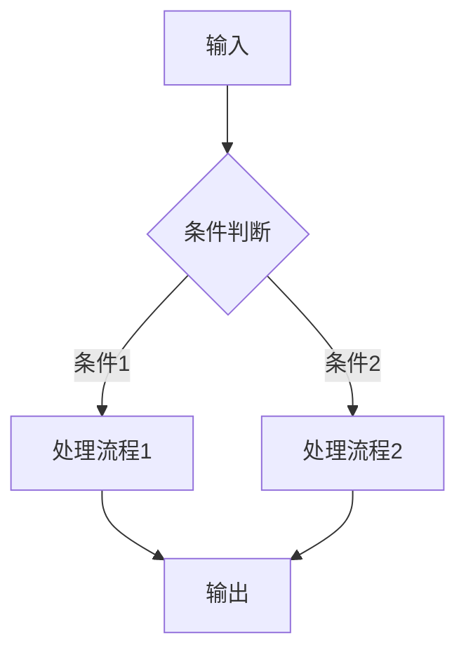

## 📋 模块基本信息

### 1.1 模块标识
```yaml
module_id: "LAYER_MODULE_NAME"  # ? L0_QMT_ADAPTER
layer: "Layer 0"                # 所属层?
version: "1.0.0"                # 设计版本
status: "design"                # design | implementation | testing | production
priority: "P0"                  # P0(? | P1(重要) | P2(?
estimated_dev_hours: 24         # 预计开发时?小时)
```

### 1.2 模块概述
```markdown
**一句话描述**: 模块的核心功能和?

**业务场景**: 模块解决的具体业务问?

**技术定?*: 在系统架构中的技术角?
```

### 1.3 设计原则
| 原则 | 说明 | 检查指标|
|------|------|----------|
| **单一职责** | 模块只负责一个明确的业务功能 | 功能描述不超?个核心职?|
| **高内?* | 模块内部组件紧密相关 | 内部数据流清晰，无无关功能|
| **低耦合** | 模块间依赖最小化 | 依赖其他模块不超??|
| **可测?* | 支持单元测试和集成测试| 提供测试接口和模拟数据|
| **可维?* | 代码清晰，文档完整| 有清晰的接口文档和示?|

---

## 🎯 功能设计

### 2.1 核心功能列表
| 功能ID | 功能名称 | 功能描述 | 输入 | 输出 | 调用频率 |
|--------|----------|----------|------|------|----------|
| FUNC_001 | 功能1 | 详细描述 | 输入格式 | 输出格式 | 实时/日频/按需 |
| FUNC_002 | 功能2 | 详细描述 | 输入格式 | 输出格式 | 实时/日频/按需 |

### 2.2 功能详细说明
```python
# 功能1: 示例功能
def example_function(input_data: Dict) -> Result:
    """
    功能详细描述
    
    Args:
        input_data: 输入数据格式说明
            - field1: 类型和含?
            - field2: 类型和含?
    
    Returns:
        Result: 输出数据格式说明
            - result_field: 类型和含?
            - error_message: 错误信息(如有)
    
    Raises:
        SpecificError: 可能抛出的异?
    """
```

### 2.3 业务逻辑流程


---

## 🔗 接口设计

### 3.1 对外接口
#### 3.1.1 REST API (如有)
```yaml
GET /api/v1/{module}/function1:
  description: "功能1描述"
  parameters:
    - name: param1
      type: string
      required: true
      description: "参数1说明"
  responses:
    200:
      schema: ResultSchema
    400:
      schema: ErrorSchema
```

#### 3.1.2 Python API
```python
class ModuleName:
    """模块主类"""
    
    def __init__(self, config: Config):
        """初始化方?""
        pass
    
    async def function1(self, input: InputType) -> OutputType:
        """异步功能1"""
        pass
    
    def function2(self, input: InputType) -> OutputType:
        """同步功能2"""
        pass
```

### 3.2 数据接口
#### 3.2.1 输入数据格式
```python
# 输入数据结构
InputType = TypedDict('InputType', {
    'field1': str,
    'field2': int,
    'field3': List[float],
    'timestamp': datetime
})
```

#### 3.2.2 输出数据格式
```python
# 输出数据结构
OutputType = TypedDict('OutputType', {
    'result': Dict[str, Any],
    'status': Literal['success', 'error'],
    'error_message': Optional[str],
    'processing_time': float
})
```

### 3.3 配置文件
```yaml
# config/{module}.yaml
module_name:
  enabled: true
  connection:
    host: "localhost"
    port: 8080
    timeout: 30
  performance:
    cache_size: 1000
    max_retries: 3
    retry_delay: 1.0
  features:
    feature1_enabled: true
    feature2_enabled: false
```

---

## 🏗?实现设计

### 4.1 类结构设计
```python
# src/{layer}/{module_name}.py
class ModuleName:
    """模块主类"""
    
    def __init__(self, config: ModuleConfig):
        self.config = config
        self._initialize_components()
    
    def _initialize_components(self):
        """初始化内部组?""
        self.data_manager = DataManager()
        self.cache = CacheManager()
        self.validator = DataValidator()
    
    class DataManager:
        """数据管理子组?""
        pass
    
    class CacheManager:
        """缓存管理子组?""
        pass
```

### 4.2 核心算法/逻辑
```python
def core_algorithm(data: InputData) -> OutputData:
    """
    核心算法实现
    
    算法步骤:
    1. 数据预处?
    2. 特征提取
    3. 模型计算
    4. 结果后处?
    
    时间复杂? O(n log n)
    空间复杂? O(n)
    """
    # 算法实现代码
    pass
```

### 4.3 错误处理策略
| 错误类型 | 错误?| 处理方式 | 恢复策略 |
|----------|--------|----------|----------|
| 输入数据错误 | ERR_001 | 验证并返回错?| 请求重试 |
| 网络超时 | ERR_002 | 重试机制 | 指数退避重?|
| 资源不足 | ERR_003 | 降级服务 | 排队或拒?|
| 系统错误 | ERR_004 | 记录日志 | 告警并人工介?|

### 4.4 性能优化
| 优化?| 优化方法 | 预期提升 | 复杂?|
|--------|----------|----------|--------|
| 数据缓存 | LRU缓存热点数据 | 50%响应时间 | ?|
| 批量处理 | 合并小请求为批量 | 30%吞吐?| ?|
| 并行计算 | 多线?多进?| 200%计算速度 | ?|
| 算法优化 | 优化核心算法 | 40%计算时间 | ?|

---

## 🔄 依赖与集成

### 5.1 依赖模块
| 依赖模块 | 依赖类型 | 版本要求 | 替代方案 |
|----------|----------|----------|----------|
| module_a | 强依?| >=1.0.0 | ?|
| module_b | 弱依?| >=0.5.0 | module_c |
| module_c | 可选依?| any | ?|

### 5.2 集成?
| 集成对象 | 集成方式 | 协议 | 频率 |
|----------|----------|------|------|
| 上游模块 | 消息队列 | RabbitMQ | 实时 |
| 下游模块 | REST API | HTTP/JSON | 日频 |
| 数据?| 连接口| PostgreSQL | 按需 |
| 缓存系统 | 客户?| Redis | 高频 |

### 5.3 环境依赖
```yaml
# requirements.txt ?
# 核心依赖
numpy>=1.21.0
pandas>=1.3.0

# 可选依?
redis>=4.0.0  # 缓存功能
sqlalchemy>=1.4.0  # 数据库功?
```

---

## 🧪 测试设计

### 6.1 测试策略
| 测试类型 | 覆盖率目?| 测试工具 | 执行频率 |
|----------|------------|----------|----------|
| 单元测试 | >90% | pytest | 每次提交 |
| 集成测试 | >80% | pytest + docker | 每日 |
| 性能测试 | 100% | locust | 每周 |
| 安全测试 | 100% | bandit + safety | 每月 |

### 6.2 测试用例
```python
# tests/test_{module}.py
class TestModuleName:
    """模块测试?""
    
    def setup_method(self):
        """测试准备"""
        self.module = ModuleName(config=test_config)
    
    def test_function1_normal_case(self):
        """功能1正常情况测试"""
        input_data = create_test_input()
        result = self.module.function1(input_data)
        assert result.status == 'success'
        assert 'expected_field' in result.data
    
    def test_function1_error_case(self):
        """功能1错误情况测试"""
        input_data = create_invalid_input()
        with pytest.raises(ValidationError):
            self.module.function1(input_data)
    
    @pytest.mark.performance
    def test_performance(self):
        """性能测试"""
        start_time = time.time()
        for _ in range(1000):
            self.module.function1(test_input)
        elapsed = time.time() - start_time
        assert elapsed < 1.0  # 1秒内完成1000次调?
```

### 6.3 模拟数据
```python
# tests/fixtures/{module}_fixtures.py
def create_test_input() -> InputType:
    """创建测试输入数据"""
    return {
        'field1': 'test_value',
        'field2': 123,
        'field3': [1.0, 2.0, 3.0],
        'timestamp': datetime.now()
    }

def create_invalid_input() -> InputType:
    """创建无效输入数据"""
    return {
        'field1': '',  # 空字符串
        'field2': -1,  # 负数
        'field3': [],  # 空列?
        'timestamp': None  # 空时?
    }
```

---

## 📊 监控与运行

### 7.1 监控指标
| 指标名称 | 指标类型 | 告警?| 监控工具 |
|----------|----------|----------|----------|
| 请求成功能| 业务指标 | <99% | Prometheus |
| 平均响应时间 | 性能指标 | >100ms | Grafana |
| 错误?| 质量指标 | >1% | Sentry |
| 资源使用?| 系统指标 | >80% | cAdvisor |

### 7.2 日志规范
```python
# 日志格式示例
logger.info(
    "模块执行完成",
    extra={
        'module': 'module_name',
        'function': 'function1',
        'input_size': len(input_data),
        'processing_time': elapsed_time,
        'status': 'success'
    }
)

logger.error(
    "模块执行失败",
    extra={
        'module': 'module_name',
        'function': 'function1',
        'error_type': error.__class__.__name__,
        'error_message': str(error),
        'stack_trace': traceback.format_exc()
    }
)
```

### 7.3 告警规则
```yaml
# alerts/{module}_alerts.yaml
alerts:
  - name: "module_name_high_error_rate"
    condition: "error_rate > 0.05"
    duration: "5m"
    severity: "warning"
    message: "模块错误率超?%"
    
  - name: "module_name_slow_response"
    condition: "avg_response_time > 200"
    duration: "10m"
    severity: "critical"
    message: "模块平均响应时间超过200ms"
```

---

## 📈 演进规划

### 8.1 版本路线?
| 版本 | 发布日期 | 核心功能 | ?|
|------|----------|----------|------|
| v1.0.0 | 2026-04-15 | 基础功能实现 | 规划?|
| v1.1.0 | 2026-05-01 | 性能优化 | 待规范|
| v1.2.0 | 2026-05-15 | 高级功能 | 待规范|
| v2.0.0 | 2026-06-01 | 架构重构 | 待规范|

### 8.2 技术债管?
| 技术债项 | 严重程度 | 影响范围 | 解决计划 |
|----------|----------|----------|----------|
| 代码重复 | ?| 局?| v1.1.0修复 |
| 缺乏测试 | ?| 全模块| v1.0.0补充 |
| 性能瓶颈 | ?| 核心功能 | v1.1.0优化 |
| 安全漏洞 | ?| 全系统| 立即修复 |

### 8.3 向后兼容?
| 变更类型 | 兼容性策略| 影响评估 | 迁移方案 |
|----------|------------|----------|----------|
| API变更 | 版本化接口| 高影?| 提供迁移指南 |
| 数据格式变更 | 数据转换?| 中影?| 自动数据迁移 |
| 配置变更 | 配置兼容模式 | 低影?| 配置转换工具 |

---

## 📝 设计评审

### 9.1 设计检查清单
- [ ] 模块职责是否单一明确?
- [ ] 接口设计是否简洁易用？
- [ ] 错误处理是否完备?
- [ ] 性能要求是否明确?
- [ ] 测试方案是否可行?
- [ ] 监控指标是否全面?
- [ ] 依赖关系是否清晰?
- [ ] 演进路径是否合理?

### 9.2 评审记录
| 评审计| 评审意见 | 责任?| 解决?|
|--------|----------|--------|----------|
| 接口设计 | 建议增加批量处理接口 | 设计划| 已采?|
| 性能要求 | 响应时间目标需调整 | 架构?| 待确?|
| 测试覆盖 | 需要增加集成测试| 测试?| 规划?|

### 9.3 设计决策记录
| 决策ID | 决策内容 | 决策理由 | 备选方?| 决策时间 |
|--------|----------|----------|----------|----------|
| DD_001 | 采用REST API而非gRPC | 简单易用，生态成?| gRPC | 2026-04-01 |
| DD_002 | 使用Redis作为缓存 | 性能好，支持丰富数据结构 | Memcached | 2026-04-01 |
| DD_003 | 异步处理核心逻辑 | 提高吞吐量，支持并发 | 同步处理 | 2026-04-01 |

---

## 🔗 相关文档

### 10.1 参考文?
- [架构设计文档](../01_FRAMEWORK/ARCHITECTURE.md)
- [API接口契约](../03_TRADING_TACTICS/API_Contract.md)
- 
- 

### 10.2 依赖文档
- 
- 
- 
- 

---

## 🏁 模板使用说明

### 11.1 填写指南
1. **必填部分** (所有模块必须填?:
   - 1.1 模块基本信息
   - 1.2 模块概述  
   - 2.1 核心功能列表
   - 3.1 对外接口
   - 6.1 测试策略

2. **选填部分** (根据模块复杂度选择):
   - 4.2 核心算法/逻辑 (复杂算法需?
   - 4.4 性能优化 (高性能要求需?
   - 7.1 监控指标 (生产环境需?
   - 8.1 版本路线?(长期维护需?

### 11.2 质量要求
- **完整?*: 所有必填部分必须完整
- **一?*: 设计内容与架构文档一?
- **可实?*: 设计方案技术上可实现
- **可维?*: 设计支持长期演进和维?

### 11.3 评审流程
1. 设计者填写模块
2. 架构师初?
3. 相关模块负责人会?
4. 修改完善
5. 最终批?
6. 归档到模块设计库

> **注意**: 本模板为指导性文档，实际设计中可根据模块特点适当调整，但必须保证核心设计要素的完整
