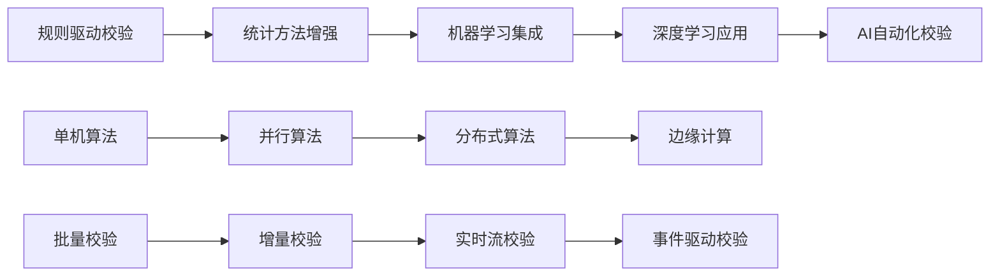
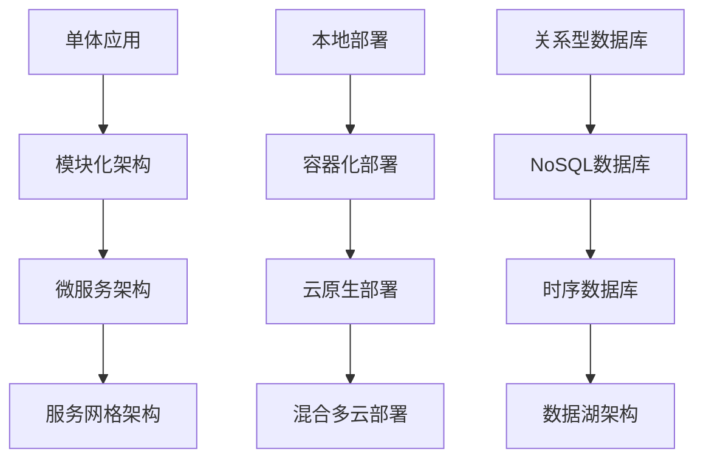

# L1_VALIDATOR 数据校验器模块设�?
> **核心职责**: 文档内容说明
> **职责边界**: 
> - ✅ 本文档负责：文档内容说明相关内容
> - ❌ 本文档不负责：其他模块内容


> **版本**: v1.0
> **创建日期**: 2026-04-02
> **所属层�?*: Layer 1 (数据预处理层)
> **设计状�?*: 🔵 设计进行�?
> **优先�?*: P0 (核心)
> **预计开发时�?*: 8小时

---

## 📋 模块基本信息

### 1.1 模块标识
```yaml
module_id: "L1_VALIDATOR"
layer: "Layer 1"
version: "1.0.0"
status: "design"
priority: "P0"
estimated_dev_hours: 8
```

### 1.2 模块概述
**一句话描述**: 金融数据质量校验引擎，提供全面的数据质量检查、验证和评估功能，确保数据可靠性和可用�?

**业务场景**: 
- 检查数据完整性（缺失值、异常值、数据连续性）
- 验证数据一致性（跨数据源一致性、逻辑一致性、时间一致性）
- 验证数据有效性（取值范围、格式规范、数据类型）
- 检查数据准确性（与基准数据对比、统计合理性）
- 评估数据质量（综合质量评分、问题分类、优先级�?
- 生成数据质量报告（可视化报告、问题详情、改进建议）
- 实时数据质量监控（流数据校验、异常报警、自动修复）

**技术定�?*: Layer 1数据预处理层的质量保障组件，为上层分析提供可靠、高质量的数据输�?

### 1.3 设计原则
| 原则 | 说明 | 检查标�?|
|------|------|----------|
| **全面�?* | 覆盖数据质量的多个维�?| 完整性、一致性、有效性、准确�?|
| **可配�?* | 校验规则可配置，适应不同场景 | 支持自定义规则和阈�?|
| **高效�?* | 支持批量校验和增量校�?| 向量化计算，智能缓存 |
| **可追�?* | 记录校验过程和结�?| 完整的校验日志和质量报告 |
| **可操�?* | 提供具体改进建议 | 问题分类、优先级排序、修复建�?|
| **自动�?* | 支持自动修复和报�?| 智能修复规则、通知机制 |

---

## 🎯 功能设计

### 2.1 核心功能列表
| 功能ID | 功能名称 | 功能描述 | 输入 | 输出 | 调用频率 |
|--------|----------|----------|------|------|----------|
| VAL_FUNC_001 | 完整性检�?| 检查数据缺失情况（NA值、空值、异常值） | 原始数据、完整性规�?| 完整性报告、问题数�?| 高频 |
| VAL_FUNC_002 | 一致性检�?| 检查数据内部一致性和跨源一致�?| 原始数据、基准数据、一致性规�?| 一致性报告、差异数�?| 中频 |
| VAL_FUNC_003 | 有效性检�?| 验证数据取值范围、格式、类�?| 原始数据、有效性规�?| 有效性报告、无效数�?| 高频 |
| VAL_FUNC_004 | 准确性检�?| 与基准数据对比，检查数据准确�?| 原始数据、基准数据、准确性阈�?| 准确性报告、偏差数�?| 中频 |
| VAL_FUNC_005 | 逻辑检�?| 检查数据逻辑关系（如：开盘价≤最高价�?| 原始数据、逻辑规则 | 逻辑检查报告、违反数�?| 高频 |
| VAL_FUNC_006 | 统计检�?| 检查统计特性（分布、异常、离群） | 原始数据、统计规�?| 统计检查报告、异常数�?| 中频 |
| VAL_FUNC_007 | 时间序列检�?| 检查时间序列特性（连续性、单调性、平稳性） | 时间序列数据、时序规�?| 时序检查报告、问题序�?| 高频 |
| VAL_FUNC_008 | 质量评分 | 计算数据质量综合评分 | 原始数据、质量维度权�?| 质量评分、维度得�?| 高频 |
| VAL_FUNC_009 | 问题分类 | 对发现的问题进行分类和优先级排序 | 校验结果、问题数�?| 问题分类报告、优先级列表 | 高频 |
| VAL_FUNC_010 | 自动修复 | 根据规则自动修复常见数据问题 | 问题数据、修复规�?| 修复后数据、修复报�?| 中频 |
| VAL_FUNC_011 | 校验报告 | 生成数据质量详细报告 | 校验结果、配置参�?| 质量报告（HTML/PDF/JSON�?| 高频 |
| VAL_FUNC_012 | 实时监控 | 实时数据质量监控和报�?| 流数据、监控规�?| 实时监控结果、报警通知 | 实时 |

### 2.2 功能详细说明
```python
# VAL_FUNC_001: 完整性检�?
def check_completeness(
    data: Union[pd.DataFrame, pd.Series],
    completeness_rules: CompletenessRules,
    return_problem_data: bool = True
) -> CompletenessReport:
    """
    数据完整性检�?
    
    Args:
        data: 要检查的数据，DataFrame或Series
        completeness_rules: 完整性检查规�?
            - missing_value_check: 是否检查缺失�?
            - missing_threshold: 缺失值阈值（比例�?
            - outlier_check: 是否检查异常�?
            - outlier_method: 异常值检测方法（IQR、Z-score、MAD等）
            - outlier_threshold: 异常值阈�?
            - continuity_check: 是否检查数据连续性（时间序列�?
            - continuity_tolerance: 连续性容忍度
        return_problem_data: 是否返回问题数据
        
    Returns:
        CompletenessReport对象，包含：
            - completeness_score: 完整性评分（0-100�?
            - missing_rate: 缺失�?
            - outlier_count: 异常值数�?
            - continuity_issues: 连续性问题列�?
            - problem_data: 问题数据（如果return_problem_data=True�?
            - recommendations: 改进建议
            
    检查内�?
        1. 缺失值检�? NA值、空值、占位符�?
        2. 异常值检�? 统计异常值、业务异常�?
        3. 连续性检�? 时间序列连续性、ID连续�?
        4. 完整性检�? 必需字段是否存在
    """
```

```python
# VAL_FUNC_002: 一致性检�?
def check_consistency(
    data: pd.DataFrame,
    reference_data: Optional[pd.DataFrame] = None,
    consistency_rules: ConsistencyRules,
    check_type: Literal["internal", "cross_source", "temporal"] = "internal"
) -> ConsistencyReport:
    """
    数据一致性检�?
    
    Args:
        data: 要检查的数据
        reference_data: 参考数据（用于跨源一致性检查）
        consistency_rules: 一致性检查规�?
            - internal_rules: 内部一致性规则（字段间关系）
            - cross_source_rules: 跨源一致性规�?
            - temporal_rules: 时间一致性规�?
            - tolerance: 一致性容忍度
        check_type: 检查类�?
            - "internal": 内部一致性（字段间逻辑关系�?
            - "cross_source": 跨数据源一致�?
            - "temporal": 时间序列一致�?
            
    Returns:
        ConsistencyReport对象，包含：
            - consistency_score: 一致性评分（0-100�?
            - internal_issues: 内部一致性问�?
            - cross_source_issues: 跨源一致性问�?
            - temporal_issues: 时间一致性问�?
            - inconsistencies: 不一致数据详�?
            - recommendations: 一致性改进建�?
            
    检查内�?
        1. 内部一致�? 字段间逻辑关系（如：成交量�?�?
        2. 跨源一致�? 不同数据源间同一指标的一致�?
        3. 时间一致�? 时间序列数据的自洽�?
        4. 格式一致�? 数据格式和单位的一致�?
    """
```

```python
# VAL_FUNC_003: 有效性检�?
def check_validity(
    data: pd.DataFrame,
    validity_rules: ValidityRules,
    strict_mode: bool = False
) -> ValidityReport:
    """
    数据有效性检�?
    
    Args:
        data: 要检查的数据
        validity_rules: 有效性检查规�?
            - range_checks: 取值范围检查规�?
            - format_checks: 格式检查规则（正则表达式）
            - type_checks: 数据类型检查规�?
            - domain_checks: 业务域检查规�?
            - uniqueness_checks: 唯一性检查规�?
        strict_mode: 严格模式（任一检查失败即标记为无效）
        
    Returns:
        ValidityReport对象，包含：
            - validity_score: 有效性评分（0-100�?
            - range_violations: 取值范围违反情�?
            - format_violations: 格式违反情况
            - type_violations: 数据类型违反情况
            - domain_violations: 业务域违反情�?
            - uniqueness_violations: 唯一性违反情�?
            - invalid_data: 无效数据详情
            - recommendations: 有效性改进建�?
            
    检查内�?
        1. 取值范�? 数值范围、日期范围、分类值域
        2. 格式规范: 字符串格式、编码格式、单位格�?
        3. 数据类型: 整数、浮点数、日期时间、布尔�?
        4. 业务�? 业务逻辑约束（如：股票代码格式）
        5. 唯一�? 主键唯一性、组合唯一�?
    """
```

```python
# VAL_FUNC_004: 准确性检�?
def check_accuracy(
    data: pd.DataFrame,
    reference_data: pd.DataFrame,
    accuracy_rules: AccuracyRules,
    matching_keys: List[str]
) -> AccuracyReport:
    """
    数据准确性检�?
    
    Args:
        data: 要检查的数据
        reference_data: 基准数据（通常来自权威数据源）
        accuracy_rules: 准确性检查规�?
            - tolerance_levels: 容忍度级别（绝对误差、相对误差）
            - statistical_tests: 统计检验方�?
            - correlation_thresholds: 相关性阈�?
            - drift_detection: 漂移检测设�?
        matching_keys: 数据匹配键列�?
        
    Returns:
        AccuracyReport对象，包含：
            - accuracy_score: 准确性评分（0-100�?
            - absolute_errors: 绝对误差统计
            - relative_errors: 相对误差统计
            - correlation_scores: 相关性得�?
            - drift_detections: 数据漂移检测结�?
            - inaccurate_data: 不准确数据详�?
            - recommendations: 准确性改进建�?
            
    检查内�?
        1. 数值准确�? 与基准数据的数值差�?
        2. 统计一致�? 分布特性、统计矩
        3. 相关性检�? 与基准数据的相关�?
        4. 漂移检�? 数据随时间的变化趋势
        5. 异常模式: 与历史模式的偏差
    """
```

```python
# VAL_FUNC_008: 质量评分
def calculate_quality_score(
    validation_reports: Dict[str, ValidationReport],
    weight_config: QualityWeightConfig
) -> QualityScore:
    """
    计算数据质量综合评分
    
    Args:
        validation_reports: 各维度校验报告字�?
            - completeness_report: 完整性报�?
            - consistency_report: 一致性报�?
            - validity_report: 有效性报�?
            - accuracy_report: 准确性报�?
        weight_config: 质量维度权重配置
            - completeness_weight: 完整性权重（默认0.3�?
            - consistency_weight: 一致性权重（默认0.25�?
            - validity_weight: 有效性权重（默认0.25�?
            - accuracy_weight: 准确性权重（默认0.2�?
            
    Returns:
        QualityScore对象，包含：
            - overall_score: 综合质量评分�?-100�?
            - dimension_scores: 各维度评分详�?
            - weighted_scores: 加权维度得分
            - quality_level: 质量等级（A/B/C/D/F�?
            - critical_issues: 关键问题列表
            - improvement_priority: 改进优先�?
            
    评分算法:
        综合得分 = Σ(维度得分 × 维度权重)
        质量等级映射:
            - A�? 90-100分（优秀�?
            - B�? 80-89分（良好�?
            - C�? 70-79分（合格�?
            - D�? 60-69分（需要改进）
            - F�? 0-59分（不合格）
    """
```

---

## 🔌 接口设计

### 3.1 对外接口定义
#### 3.1.1 主校验接�?
```python
class DataValidator:
    """数据校验器主�?""
    
    def __init__(self, config: ValidatorConfig):
        """
        初始化数据校验器
        
        Args:
            config: 校验器配�?
                - completeness_rules: 完整性规�?
                - consistency_rules: 一致性规�?
                - validity_rules: 有效性规�?
                - accuracy_rules: 准确性规�?
                - quality_weights: 质量权重配置
                - report_settings: 报告设置
                - cache_settings: 缓存设置
        """
        self.config = config
        self._completeness_checker = CompletenessChecker(config.completeness_rules)
        self._consistency_checker = ConsistencyChecker(config.consistency_rules)
        self._validity_checker = ValidityChecker(config.validity_rules)
        self._accuracy_checker = AccuracyChecker(config.accuracy_rules)
        self._quality_scorer = QualityScorer(config.quality_weights)
        self._report_generator = ReportGenerator(config.report_settings)
        self._cache = ValidationCache(config.cache_settings)
    
    def validate(
        self,
        data: Union[pd.DataFrame, Dict[str, pd.DataFrame]],
        validation_types: List[ValidationType] = None,
        reference_data: Optional[pd.DataFrame] = None,
        generate_report: bool = True,
        cache_result: bool = True
    ) -> ValidationResult:
        """
        执行数据校验
        
        Args:
            data: 要校验的数据，可以是单个DataFrame或数据字�?
            validation_types: 校验类型列表，默认执行全部校�?
                - "completeness": 完整性校�?
                - "consistency": 一致性校�?
                - "validity": 有效性校�?
                - "accuracy": 准确性校�?
            reference_data: 基准数据（用于准确性校验）
            generate_report: 是否生成校验报告
            cache_result: 是否缓存校验结果
            
        Returns:
            ValidationResult对象，包含：
                - is_valid: 总体是否有效
                - quality_score: 质量评分
                - reports: 各维度校验报�?
                - problems: 问题数据详情
                - report_path: 报告文件路径（如果生成报告）
                - recommendations: 改进建议
        """
```

#### 3.1.2 批量校验接口
```python
def batch_validate(
    data_batch: Dict[str, pd.DataFrame],
    validator_configs: Dict[str, ValidatorConfig],
    parallel: bool = True,
    progress_callback: Optional[Callable] = None
) -> BatchValidationResult:
    """
    批量数据校验
    
    Args:
        data_batch: 数据批次字典 {数据标识: 数据}
        validator_configs: 校验配置字典 {数据标识: 校验配置}
        parallel: 是否并行执行校验
        progress_callback: 进度回调函数
        
    Returns:
        BatchValidationResult对象，包含：
            - results: 各数据校验结果字�?
            - summary: 批量校验摘要
            - overall_score: 总体质量评分
            - worst_data_ids: 质量最差的数据标识列表
            - batch_report_path: 批量校验报告路径
    """
```

#### 3.1.3 流数据校验接�?
```python
class StreamingValidator:
    """流数据校验器"""
    
    def __init__(self, config: StreamingValidatorConfig):
        """
        初始化流数据校验�?
        
        Args:
            config: 流数据校验配�?
                - window_size: 滑动窗口大小
                - alert_thresholds: 报警阈�?
                - notification_channels: 通知渠道
                - auto_fix_rules: 自动修复规则
        """
        self.config = config
        self._window_buffer = {}
        self._alert_manager = AlertManager(config.alert_thresholds, config.notification_channels)
        self._auto_fixer = AutoFixer(config.auto_fix_rules)
    
    def validate_stream(
        self,
        data_point: Dict[str, Any],
        data_source: str,
        timestamp: datetime
    ) -> StreamingValidationResult:
        """
        校验单个数据�?
        
        Args:
            data_point: 数据点字�?
            data_source: 数据源标�?
            timestamp: 数据时间�?
            
        Returns:
            StreamingValidationResult对象，包含：
                - is_valid: 数据点是否有�?
                - validation_time: 校验时间
                - alerts: 触发的报警列�?
                - fixed_data: 修复后的数据（如果启用自动修复）
                - quality_metrics: 实时质量指标
        """
    
    def get_stream_quality_metrics(self, data_source: str, window: str = "1h") -> StreamQualityMetrics:
        """
        获取流数据质量指�?
        
        Args:
            data_source: 数据源标�?
            window: 时间窗口�?1h", "1d", "7d"等）
            
        Returns:
            StreamQualityMetrics对象，包含：
                - data_volume: 数据量统�?
                - error_rate: 错误�?
                - latency: 延迟统计
                - completeness: 完整性指�?
                - trend: 质量趋势
        """
```

### 3.2 内部接口定义
#### 3.2.1 规则管理器接�?
```python
class RuleManager:
    """校验规则管理�?""
    
    def load_rules(self, rule_source: Union[str, Dict]) -> RuleSet:
        """
        加载校验规则
        
        Args:
            rule_source: 规则源（文件路径或规则字典）
            
        Returns:
            RuleSet对象，包含完整校验规则集
        """
    
    def save_rules(self, rule_set: RuleSet, destination: str) -> bool:
        """
        保存校验规则
        
        Args:
            rule_set: 规则�?
            destination: 目标路径
            
        Returns:
            保存是否成功
        """
    
    def validate_rule(self, rule: Dict) -> ValidationResult:
        """
        验证规则有效�?
        
        Args:
            rule: 规则字典
            
        Returns:
            规则验证结果
        """
```

#### 3.2.2 报告生成器接�?
```python
class ReportGenerator:
    """校验报告生成�?""
    
    def generate_report(
        self,
        validation_result: ValidationResult,
        report_format: ReportFormat = "html",
        include_details: bool = True,
        include_recommendations: bool = True
    ) -> Report:
        """
        生成校验报告
        
        Args:
            validation_result: 校验结果
            report_format: 报告格式�?html", "pdf", "json", "markdown"�?
            include_details: 是否包含详细问题数据
            include_recommendations: 是否包含改进建议
            
        Returns:
            Report对象，包含报告内容和文件路径
        """
    
    def generate_dashboard(
        self,
        batch_results: BatchValidationResult,
        time_range: Optional[Tuple[datetime, datetime]] = None
    ) -> Dashboard:
        """
        生成质量监控仪表�?
        
        Args:
            batch_results: 批量校验结果
            time_range: 时间范围
            
        Returns:
            Dashboard对象，包含交互式仪表�?
        """
```

### 3.3 数据模型接口
#### 3.3.1 校验配置模型
```python
@dataclass
class ValidatorConfig:
    """校验器配�?""
    completeness_rules: CompletenessRules
    consistency_rules: ConsistencyRules
    validity_rules: ValidityRules
    accuracy_rules: AccuracyRules
    quality_weights: QualityWeightConfig
    report_settings: ReportSettings
    cache_settings: CacheSettings
    auto_fix_settings: Optional[AutoFixSettings] = None
    alert_settings: Optional[AlertSettings] = None
```

#### 3.3.2 校验结果模型
```python
@dataclass
class ValidationResult:
    """校验结果"""
    is_valid: bool
    quality_score: float
    completeness_report: CompletenessReport
    consistency_report: ConsistencyReport
    validity_report: ValidityReport
    accuracy_report: Optional[AccuracyReport]
    problems: List[DataProblem]
    recommendations: List[Recommendation]
    report_path: Optional[str]
    validation_time: datetime
    data_size: Tuple[int, int]
```

#### 3.3.3 质量问题模型
```python
@dataclass
class DataProblem:
    """数据问题"""
    problem_id: str
    problem_type: ProblemType
    severity: SeverityLevel
    data_location: DataLocation
    description: str
    expected_value: Optional[Any]
    actual_value: Optional[Any]
    rule_violated: str
    timestamp: datetime
    context: Dict[str, Any]
```

---

## 🏗�?实现设计

### 4.1 架构设计
#### 4.1.1 整体架构
```
┌─────────────────────────────────────────────────────────────�?
�?                   L1_VALIDATOR 数据校验�?                   �?
├─────────────────────────────────────────────────────────────�?
�? ┌─────────────�? ┌─────────────�? ┌─────────────�?        �?
�? �? 规则管理�? �? �? 校验引擎    �? �? 报告生成�? �?        �?
�? �?RuleManager �? �?Validator   �? �?ReportGen   �?        �?
�? └──────┬──────�? └──────┬──────�? └──────┬──────�?        �?
�?        �?               �?               �?               �?
�? ┌──────▼──────�? ┌──────▼──────�? ┌──────▼──────�?        �?
�? �?规则加载�?  �? �?完整性检查器 �? �?HTML报告�? �?        �?
�? �?RuleLoader  �? �?Completeness�? �?HTMLReporter�?        �?
�? ├─────────────�? ├─────────────�? ├─────────────�?        �?
�? �?规则解析�?  �? �?一致性检查器 �? �?PDF报告�?   �?        �?
�? �?RuleParser  �? �?Consistency �? �?PDFReporter �?        �?
�? ├─────────────�? ├─────────────�? ├─────────────�?        �?
�? �?规则验证�?  �? �?有效性检查器 �? �?JSON报告�?  �?        �?
�? �?RuleValidator�? �?Validity    �? �?JSONReporter�?        �?
�? └─────────────�? ├─────────────�? └─────────────�?        �?
�?                  �?准确性检查器 �?                         �?
�?                  �?Accuracy    �?                         �?
�?                  └─────────────�?                         �?
├─────────────────────────────────────────────────────────────�?
�? ┌─────────────�? ┌─────────────�? ┌─────────────�?        �?
�? �? 质量评分�? �? �? 问题分类�? �? �? 自动修复�? �?        �?
�? �?QualityScorer�? �?Problem     �? �?AutoFixer   �?        �?
�? �?             �? �?Classifier  �? �?            �?        �?
�? └─────────────�? └─────────────�? └─────────────�?        �?
├─────────────────────────────────────────────────────────────�?
�? ┌─────────────�? ┌─────────────�? ┌─────────────�?        �?
�? �? 缓存管理�? �? �? 流校验器    �? �? 报警管理�? �?        �?
�? �?CacheManager�? �?Streaming   �? �?AlertManager�?        �?
�? �?            �? �?Validator   �? �?            �?        �?
�? └─────────────�? └─────────────�? └─────────────�?        �?
└─────────────────────────────────────────────────────────────�?
```

#### 4.1.2 组件职责
| 组件 | 职责 | 关键技�?|
|------|------|----------|
| **规则管理�?* | 加载、解析、验证、管理校验规�?| YAML解析、规则引擎、Schema验证 |
| **校验引擎** | 执行数据校验，生成校验结�?| 向量化计算、并行处理、智能缓�?|
| **报告生成�?* | 生成数据质量报告和可视化 | Jinja2模板、Plotly可视化、PDF生成 |
| **质量评分�?* | 计算数据质量综合评分 | 加权评分算法、等级映射、优先级排序 |
| **问题分类�?* | 对数据问题进行分类和优先级排�?| 机器学习分类、规则分类、优先级算法 |
| **自动修复�?* | 自动修复常见数据问题 | 修复规则引擎、数据插值、异常值处�?|
| **缓存管理�?* | 缓存校验结果和中间数�?| Redis/Memory缓存、缓存策略、失效机�?|
| **流校验器** | 实时流数据校�?| 滑动窗口、实时计算、流处理 |
| **报警管理�?* | 数据质量报警和通知 | 报警规则、通知渠道、报警聚�?|

### 4.2 核心组件设计
#### 4.2.1 校验引擎实现
```python
class ValidationEngine:
    """校验引擎核心实现"""
    
    def __init__(self, config: EngineConfig):
        self.config = config
        self._completeness_checker = self._create_completeness_checker()
        self._consistency_checker = self._create_consistency_checker()
        self._validity_checker = self._create_validity_checker()
        self._accuracy_checker = self._create_accuracy_checker()
        self._parallel_executor = ParallelExecutor(config.parallel_settings)
        self._cache_manager = CacheManager(config.cache_settings)
    
    def _create_completeness_checker(self) -> CompletenessChecker:
        """创建完整性检查器"""
        return CompletenessChecker(
            missing_detector=MissingValueDetector(self.config.missing_detection),
            outlier_detector=OutlierDetector(self.config.outlier_detection),
            continuity_checker=ContinuityChecker(self.config.continuity_check),
            statistical_checker=StatisticalChecker(self.config.statistical_check)
        )
    
    def _create_consistency_checker(self) -> ConsistencyChecker:
        """创建一致性检查器"""
        return ConsistencyChecker(
            internal_checker=InternalConsistencyChecker(self.config.internal_rules),
            cross_source_checker=CrossSourceConsistencyChecker(self.config.cross_source_rules),
            temporal_checker=TemporalConsistencyChecker(self.config.temporal_rules),
            format_checker=FormatConsistencyChecker(self.config.format_rules)
        )
    
    def _create_validity_checker(self) -> ValidityChecker:
        """创建有效性检查器"""
        return ValidityChecker(
            range_checker=RangeChecker(self.config.range_rules),
            format_checker=FormatChecker(self.config.format_rules),
            type_checker=TypeChecker(self.config.type_rules),
            domain_checker=DomainChecker(self.config.domain_rules),
            uniqueness_checker=UniquenessChecker(self.config.uniqueness_rules)
        )
    
    def _create_accuracy_checker(self) -> AccuracyChecker:
        """创建准确性检查器"""
        return AccuracyChecker(
            numerical_checker=NumericalAccuracyChecker(self.config.numerical_rules),
            statistical_checker=StatisticalAccuracyChecker(self.config.statistical_rules),
            correlation_checker=CorrelationChecker(self.config.correlation_rules),
            drift_detector=DriftDetector(self.config.drift_detection),
            pattern_checker=PatternChecker(self.config.pattern_rules)
        )
    
    def execute_validation(
        self,
        data: pd.DataFrame,
        validation_types: List[ValidationType],
        reference_data: Optional[pd.DataFrame] = None
    ) -> Dict[ValidationType, ValidationReport]:
        """
        执行校验
        
        Args:
            data: 要校验的数据
            validation_types: 校验类型列表
            reference_data: 基准数据
            
        Returns:
            各类型校验结果字�?
        """
        # 检查缓�?
        cache_key = self._cache_manager.generate_key(data, validation_types, reference_data)
        cached_result = self._cache_manager.get(cache_key)
        if cached_result:
            return cached_result
        
        # 并行执行校验
        validation_tasks = []
        for val_type in validation_types:
            task = self._create_validation_task(val_type, data, reference_data)
            validation_tasks.append(task)
        
        # 执行校验
        results = self._parallel_executor.execute(validation_tasks)
        
        # 缓存结果
        self._cache_manager.set(cache_key, results)
        
        return results
    
    def _create_validation_task(
        self,
        val_type: ValidationType,
        data: pd.DataFrame,
        reference_data: Optional[pd.DataFrame] = None
    ) -> ValidationTask:
        """创建校验任务"""
        if val_type == "completeness":
            return ValidationTask(
                name="completeness_check",
                func=self._completeness_checker.check,
                args=(data,),
                kwargs={"return_problem_data": True}
            )
        elif val_type == "consistency":
            return ValidationTask(
                name="consistency_check",
                func=self._consistency_checker.check,
                args=(data,),
                kwargs={"reference_data": reference_data, "check_type": "internal"}
            )
        elif val_type == "validity":
            return ValidationTask(
                name="validity_check",
                func=self._validity_checker.check,
                args=(data,),
                kwargs={"strict_mode": self.config.strict_mode}
            )
        elif val_type == "accuracy":
            if reference_data is None:
                raise ValueError("准确性校验需要基准数�?)
            return ValidationTask(
                name="accuracy_check",
                func=self._accuracy_checker.check,
                args=(data, reference_data),
                kwargs={"matching_keys": self.config.matching_keys}
            )
        else:
            raise ValueError(f"不支持的校验类型: {val_type}")
```

#### 4.2.2 规则管理器实�?
```python
class RuleManager:
    """规则管理器实�?""
    
    def __init__(self, rule_dir: str, schema_validator: SchemaValidator):
        self.rule_dir = rule_dir
        self.schema_validator = schema_validator
        self._rules_cache = {}
        self._rule_index = RuleIndex()
    
    def load_rule_set(self, rule_set_name: str) -> RuleSet:
        """
        加载规则�?
        
        Args:
            rule_set_name: 规则集名�?
            
        Returns:
            RuleSet对象
        """
        # 检查缓�?
        if rule_set_name in self._rules_cache:
            return self._rules_cache[rule_set_name]
        
        # 加载规则文件
        rule_files = self._find_rule_files(rule_set_name)
        rules = []
        
        for rule_file in rule_files:
            # 解析YAML文件
            rule_dict = self._parse_yaml(rule_file)
            
            # 验证规则schema
            if not self.schema_validator.validate(rule_dict):
                raise RuleValidationError(f"规则文件 {rule_file} 验证失败")
            
            # 创建规则对象
            rule = self._create_rule(rule_dict)
            rules.append(rule)
        
        # 创建规则�?
        rule_set = RuleSet(name=rule_set_name, rules=rules)
        
        # 构建规则索引
        self._rule_index.build_index(rule_set)
        
        # 缓存规则�?
        self._rules_cache[rule_set_name] = rule_set
        
        return rule_set
    
    def _find_rule_files(self, rule_set_name: str) -> List[str]:
        """查找规则文件"""
        rule_pattern = os.path.join(self.rule_dir, f"{rule_set_name}_*.yaml")
        rule_files = glob.glob(rule_pattern)
        
        if not rule_files:
            # 尝试加载默认规则
            default_pattern = os.path.join(self.rule_dir, f"default_*.yaml")
            rule_files = glob.glob(default_pattern)
            
        if not rule_files:
            raise RuleNotFoundError(f"未找到规则集: {rule_set_name}")
        
        return rule_files
    
    def _parse_yaml(self, file_path: str) -> Dict:
        """解析YAML文件"""
        with open(file_path, 'r', encoding='utf-8') as f:
            return yaml.safe_load(f)
    
    def _create_rule(self, rule_dict: Dict) -> Rule:
        """创建规则对象"""
        rule_type = rule_dict.get("type")
        
        if rule_type == "completeness":
            return CompletenessRule.from_dict(rule_dict)
        elif rule_type == "consistency":
            return ConsistencyRule.from_dict(rule_dict)
        elif rule_type == "validity":
            return ValidityRule.from_dict(rule_dict)
        elif rule_type == "accuracy":
            return AccuracyRule.from_dict(rule_dict)
        else:
            raise RuleTypeError(f"不支持的规则类型: {rule_type}")
    
    def search_rules(self, query: RuleQuery) -> List[Rule]:
        """
        搜索规则
        
        Args:
            query: 规则查询条件
            
        Returns:
            匹配的规则列�?
        """
        return self._rule_index.search(query)
```

#### 4.2.3 质量评分器实�?
```python
class QualityScorer:
    """质量评分器实�?""
    
    def __init__(self, weight_config: QualityWeightConfig):
        self.weight_config = weight_config
        self._dimension_scalers = self._create_dimension_scalers()
        self._quality_mapper = QualityMapper()
    
    def _create_dimension_scalers(self) -> Dict[str, DimensionScaler]:
        """创建维度评分�?""
        return {
            "completeness": CompletenessScaler(self.weight_config.completeness_weight),
            "consistency": ConsistencyScaler(self.weight_config.consistency_weight),
            "validity": ValidityScaler(self.weight_config.validity_weight),
            "accuracy": AccuracyScaler(self.weight_config.accuracy_weight)
        }
    
    def calculate_score(self, validation_reports: Dict[str, ValidationReport]) -> QualityScore:
        """
        计算质量评分
        
        Args:
            validation_reports: 校验报告字典
            
        Returns:
            质量评分对象
        """
        dimension_scores = {}
        weighted_scores = {}
        
        # 计算各维度得�?
        for dimension, report in validation_reports.items():
            if dimension in self._dimension_scalers:
                scaler = self._dimension_scalers[dimension]
                raw_score = self._calculate_raw_dimension_score(report)
                dimension_scores[dimension] = raw_score
                weighted_scores[dimension] = scaler.scale(raw_score)
        
        # 计算综合得分
        overall_score = sum(weighted_scores.values())
        
        # 确定质量等级
        quality_level = self._quality_mapper.map_score_to_level(overall_score)
        
        # 识别关键问题
        critical_issues = self._identify_critical_issues(validation_reports)
        
        # 确定改进优先�?
        improvement_priority = self._determine_improvement_priority(dimension_scores)
        
        return QualityScore(
            overall_score=overall_score,
            dimension_scores=dimension_scores,
            weighted_scores=weighted_scores,
            quality_level=quality_level,
            critical_issues=critical_issues,
            improvement_priority=improvement_priority
        )
    
    def _calculate_raw_dimension_score(self, report: ValidationReport) -> float:
        """计算原始维度得分"""
        # 基于报告中的问题数量和严重程度计算得�?
        total_issues = len(report.problems)
        critical_issues = sum(1 for p in report.problems if p.severity == "critical")
        
        # 计算基础得分
        if total_issues == 0:
            base_score = 100.0
        else:
            # 根据问题数量和严重程度扣�?
            critical_penalty = critical_issues * 10  # 每个关键问题�?0�?
            normal_penalty = (total_issues - critical_issues) * 2  # 每个普通问题扣2�?
            base_score = max(0, 100 - critical_penalty - normal_penalty)
        
        return base_score
    
    def _identify_critical_issues(self, validation_reports: Dict[str, ValidationReport]) -> List[DataProblem]:
        """识别关键问题"""
        critical_issues = []
        
        for report in validation_reports.values():
            for problem in report.problems:
                if problem.severity == "critical":
                    critical_issues.append(problem)
        
        # 按问题类型和影响范围排序
        critical_issues.sort(key=lambda p: (p.problem_type, len(p.data_location)))
        
        return critical_issues
    
    def _determine_improvement_priority(self, dimension_scores: Dict[str, float]) -> List[str]:
        """确定改进优先�?""
        # 按得分从低到高排�?
        sorted_dimensions = sorted(dimension_scores.items(), key=lambda x: x[1])
        
        # 返回维度优先级列�?
        return [dimension for dimension, score in sorted_dimensions]
```

### 4.3 算法设计
#### 4.3.1 异常值检测算�?
```python
class OutlierDetector:
    """异常值检测器"""
    
    def __init__(self, config: OutlierDetectionConfig):
        self.config = config
        self._detectors = self._create_detectors()
    
    def _create_detectors(self) -> List[OutlierDetectionMethod]:
        """创建检测器列表"""
        detectors = []
        
        if self.config.use_iqr:
            detectors.append(IQRDetector(self.config.iqr_multiplier))
        
        if self.config.use_zscore:
            detectors.append(ZScoreDetector(self.config.zscore_threshold))
        
        if self.config.use_mad:
            detectors.append(MADDetector(self.config.mad_threshold))
        
        if self.config.use_isolation_forest:
            detectors.append(IsolationForestDetector(self.config.isolation_forest_params))
        
        if self.config.use_lof:
            detectors.append(LocalOutlierFactorDetector(self.config.lof_params))
        
        return detectors
    
    def detect(self, data: pd.Series) -> OutlierDetectionResult:
        """
        检测异常�?
        
        Args:
            data: 数据序列
            
        Returns:
            异常值检测结�?
        """
        # 处理缺失�?
        clean_data = data.dropna()
        
        if len(clean_data) < self.config.min_samples:
            return OutlierDetectionResult(outliers=[], method="insufficient_data")
        
        # 应用所有检测器
        all_outliers = []
        method_results = {}
        
        for detector in self._detectors:
            try:
                outliers = detector.detect(clean_data)
                all_outliers.extend(outliers)
                method_results[detector.name] = {
                    "outlier_count": len(outliers),
                    "outlier_indices": outliers
                }
            except Exception as e:
                method_results[detector.name] = {"error": str(e)}
        
        # 合并检测结�?
        if self.config.consensus_method == "union":
            # 并集：任一检测器发现的异常�?
            final_outliers = list(set(all_outliers))
        elif self.config.consensus_method == "intersection":
            # 交集：所有检测器都发现的异常�?
            outlier_counts = Counter(all_outliers)
            final_outliers = [idx for idx, count in outlier_counts.items() 
                            if count == len(self._detectors)]
        elif self.config.consensus_method == "majority":
            # 多数：超过半数检测器发现的异常�?
            outlier_counts = Counter(all_outliers)
            threshold = len(self._detectors) // 2 + 1
            final_outliers = [idx for idx, count in outlier_counts.items() 
                            if count >= threshold]
        else:
            final_outliers = all_outliers
        
        return OutlierDetectionResult(
            outliers=final_outliers,
            method=self.config.consensus_method,
            method_results=method_results
        )
```

#### 4.3.2 数据漂移检测算�?
```python
class DriftDetector:
    """数据漂移检测器"""
    
    def __init__(self, config: DriftDetectionConfig):
        self.config = config
        self._detectors = self._create_detectors()
    
    def _create_detectors(self) -> List[DriftDetectionMethod]:
        """创建漂移检测器列表"""
        detectors = []
        
        if self.config.use_ks_test:
            detectors.append(KolmogorovSmirnovDetector(self.config.ks_threshold))
        
        if self.config.use_chi_square:
            detectors.append(ChiSquareDetector(self.config.chi_square_threshold))
        
        if self.config.use_psi:
            detectors.append(PSIDetector(self.config.psi_threshold))
        
        if self.config.use_mmd:
            detectors.append(MMDDetector(self.config.mmd_threshold))
        
        return detectors
    
    def detect_drift(
        self,
        reference_data: pd.DataFrame,
        current_data: pd.DataFrame,
        columns: Optional[List[str]] = None
    ) -> DriftDetectionResult:
        """
        检测数据漂�?
        
        Args:
            reference_data: 参考数据（基准分布�?
            current_data: 当前数据（待检测分布）
            columns: 要检测的列列表，默认检测所有数值列
            
        Returns:
            漂移检测结�?
        """
        if columns is None:
            # 自动选择数值列
            columns = self._select_numeric_columns(reference_data)
        
        drift_results = {}
        
        for column in columns:
            ref_series = reference_data[column].dropna()
            curr_series = current_data[column].dropna()
            
            if len(ref_series) < self.config.min_samples or len(curr_series) < self.config.min_samples:
                drift_results[column] = {"status": "insufficient_data", "details": "样本不足"}
                continue
            
            column_drifts = []
            
            # 应用所有检测器
            for detector in self._detectors:
                try:
                    drift_result = detector.detect(ref_series, curr_series)
                    column_drifts.append({
                        "method": detector.name,
                        "drift_detected": drift_result.drift_detected,
                        "statistic": drift_result.statistic,
                        "p_value": drift_result.p_value,
                        "threshold": drift_result.threshold
                    })
                except Exception as e:
                    column_drifts.append({
                        "method": detector.name,
                        "error": str(e)
                    })
            
            # 综合判断
            drift_detected = self._aggregate_drift_decision(column_drifts)
            
            drift_results[column] = {
                "drift_detected": drift_detected,
                "detection_results": column_drifts,
                "reference_stats": self._calculate_statistics(ref_series),
                "current_stats": self._calculate_statistics(curr_series)
            }
        
        # 总体漂移判断
        overall_drift = any(result["drift_detected"] for result in drift_results.values())
        
        return DriftDetectionResult(
            overall_drift=overall_drift,
            column_drifts=drift_results,
            detection_time=datetime.now()
        )
    
    def _aggregate_drift_decision(self, column_drifts: List[Dict]) -> bool:
        """聚合漂移判断"""
        valid_results = [r for r in column_drifts if "drift_detected" in r]
        
        if not valid_results:
            return False
        
        if self.config.aggregation_method == "any":
            # 任一检测器发现漂移即认为有漂移
            return any(r["drift_detected"] for r in valid_results)
        elif self.config.aggregation_method == "majority":
            # 多数检测器发现漂移
            drift_count = sum(1 for r in valid_results if r["drift_detected"])
            return drift_count > len(valid_results) // 2
        elif self.config.aggregation_method == "all":
            # 所有检测器都发现漂�?
            return all(r["drift_detected"] for r in valid_results)
        else:
            # 默认使用"any"
            return any(r["drift_detected"] for r in valid_results)
```

### 4.4 性能优化设计
#### 4.4.1 向量化计算优�?
```python
class VectorizedValidator:
    """向量化校验器"""
    
    @staticmethod
    def vectorized_completeness_check(data: pd.DataFrame, rules: CompletenessRules) -> pd.DataFrame:
        """
        向量化完整性检�?
        
        Args:
            data: 要检查的数据
            rules: 完整性规�?
            
        Returns:
            问题数据掩码DataFrame
        """
        # 初始化结果掩�?
        problem_mask = pd.DataFrame(False, index=data.index, columns=data.columns)
        
        # 缺失值检查（向量化）
        if rules.missing_value_check:
            missing_mask = data.isna() | data.isnull() | (data == "")
            problem_mask = problem_mask | missing_mask
        
        # 异常值检查（向量化）
        if rules.outlier_check:
            if rules.outlier_method == "iqr":
                q1 = data.quantile(0.25)
                q3 = data.quantile(0.75)
                iqr = q3 - q1
                lower_bound = q1 - rules.iqr_multiplier * iqr
                upper_bound = q3 + rules.iqr_multiplier * iqr
                
                outlier_mask = (data < lower_bound) | (data > upper_bound)
                problem_mask = problem_mask | outlier_mask
            elif rules.outlier_method == "zscore":
                mean = data.mean()
                std = data.std()
                zscore_mask = ((data - mean).abs() / std) > rules.zscore_threshold
                problem_mask = problem_mask | zscore_mask
        
        # 连续性检查（向量化，针对时间序列�?
        if rules.continuity_check and isinstance(data.index, pd.DatetimeIndex):
            time_diff = data.index.to_series().diff().dt.total_seconds()
            discontinuity_mask = time_diff > rules.continuity_tolerance
            # 将时间连续性违规应用到所有列
            for col in problem_mask.columns:
                problem_mask[col] = problem_mask[col] | discontinuity_mask
        
        return problem_mask
```

#### 4.4.2 并行处理优化
```python
class ParallelValidationExecutor:
    """并行校验执行�?""
    
    def __init__(self, config: ParallelConfig):
        self.config = config
        self._executor = self._create_executor()
    
    def _create_executor(self):
        """创建并行执行�?""
        if self_config.executor_type == "thread":
            return ThreadPoolExecutor(max_workers=self.config.max_workers)
        elif self_config.executor_type == "process":
            return ProcessPoolExecutor(max_workers=self.config.max_workers)
        elif self_config.executor_type == "dask":
            return DaskExecutor()
        else:
            return ThreadPoolExecutor(max_workers=4)
    
    def execute_validation_tasks(
        self,
        tasks: List[ValidationTask],
        progress_callback: Optional[Callable] = None
    ) -> List[ValidationResult]:
        """
        并行执行校验任务
        
        Args:
            tasks: 校验任务列表
            progress_callback: 进度回调函数
            
        Returns:
            校验结果列表
        """
        # 任务分组（按数据块分组）
        task_groups = self._group_tasks_by_data_chunk(tasks)
        
        results = []
        completed = 0
        total = len(tasks)
        
        # 并行执行任务�?
        with self._executor as executor:
            # 提交任务
            future_to_task = {}
            for task_group in task_groups:
                future = executor.submit(self._execute_task_group, task_group)
                future_to_task[future] = task_group
            
            # 收集结果
            for future in as_completed(future_to_task.keys()):
                try:
                    task_results = future.result()
                    results.extend(task_results)
                    completed += len(task_results)
                    
                    # 更新进度
                    if progress_callback:
                        progress_callback(completed, total)
                except Exception as e:
                    # 记录错误，继续处理其他任�?
                    self._logger.error(f"任务执行失败: {e}")
                    # 添加错误结果
                    task_group = future_to_task[future]
                    for task in task_group:
                        error_result = ValidationResult(
                            is_valid=False,
                            error=str(e),
                            task_name=task.name
                        )
                        results.append(error_result)
        
        return results
    
    def _group_tasks_by_data_chunk(self, tasks: List[ValidationTask]) -> List[List[ValidationTask]]:
        """按数据块分组任务"""
        # 根据数据大小和校验类型分组，优化内存使用
        task_groups = []
        current_group = []
        current_group_size = 0
        
        for task in tasks:
            task_size = self._estimate_task_size(task)
            
            if current_group_size + task_size > self.config.max_group_size and current_group:
                task_groups.append(current_group)
                current_group = []
                current_group_size = 0
            
            current_group.append(task)
            current_group_size += task_size
        
        if current_group:
            task_groups.append(current_group)
        
        return task_groups
```

### 4.5 依赖管理
#### 4.5.1 核心依赖
```yaml
dependencies:
  core:
    - pandas>=2.0.0
    - numpy>=1.21.0
    - scipy>=1.7.0
    - scikit-learn>=1.0.0
    
  data_validation:
    - great-expectations>=0.15.0  # 数据质量框架
    - pandera>=0.16.0            # 数据模式验证
    - pydeequ>=1.0.0             # Spark数据质量检�?
    - dqc>=0.5.0                 # 数据质量检查库
    
  statistical_tests:
    - statsmodels>=0.13.0
    - pingouin>=0.5.0
    
  visualization:
    - plotly>=5.0.0
    - matplotlib>=3.5.0
    - seaborn>=0.11.0
    
  parallel_processing:
    - dask>=2022.0.0
    - joblib>=1.2.0
    - ray>=2.0.0
    
  ml_drift_detection:
    - alibi-detect>=0.9.0
    - evidently>=0.1.0
    
  report_generation:
    - jinja2>=3.0.0
    - weasyprint>=53.0        # PDF生成
    - markdown>=3.3.0
```

#### 4.5.2 可选依�?
```yaml
optional_dependencies:
  streaming:
    - apache-beam>=2.40.0
    - faust>=1.10.0
    
  big_data:
    - pyspark>=3.3.0
    - dask>=2022.0.0
    
  deep_learning:
    - torch>=1.12.0
    - tensorflow>=2.10.0
    
  cloud_integration:
    - boto3>=1.24.0           # AWS
    - google-cloud-storage>=2.0.0  # GCP
    - azure-storage-blob>=12.0.0   # Azure
    
  monitoring:
    - prometheus-client>=0.15.0
    - grafana-api>=1.0.0
```

### 4.6 错误处理设计
#### 4.6.1 错误分类
```python
class ValidationError(Exception):
    """校验错误基类"""
    pass

class RuleValidationError(ValidationError):
    """规则验证错误"""
    pass

class DataValidationError(ValidationError):
    """数据验证错误"""
    pass

class ConfigurationError(ValidationError):
    """配置错误"""
    pass

class ExecutionError(ValidationError):
    """执行错误"""
    pass

class CacheError(ValidationError):
    """缓存错误"""
    pass

class ReportGenerationError(ValidationError):
    """报告生成错误"""
    pass
```

#### 4.6.2 错误恢复策略
```python
class ErrorRecoveryManager:
    """错误恢复管理�?""
    
    def __init__(self, recovery_config: RecoveryConfig):
        self.config = recovery_config
        self._retry_policy = RetryPolicy(recovery_config.retry_settings)
        self._fallback_strategies = self._create_fallback_strategies()
    
    def execute_with_recovery(self, func: Callable, *args, **kwargs) -> Any:
        """
        带错误恢复的执行
        
        Args:
            func: 要执行的函数
            *args: 函数参数
            **kwargs: 函数关键字参�?
            
        Returns:
            函数执行结果
        """
        last_exception = None
        
        # 重试机制
        for attempt in range(self._retry_policy.max_attempts):
            try:
                return func(*args, **kwargs)
            except Exception as e:
                last_exception = e
                self._logger.warning(f"执行失败，第{attempt+1}次尝�? {e}")
                
                # 检查是否应该重�?
                if not self._retry_policy.should_retry(e, attempt):
                    break
                
                # 等待重试
                if attempt < self._retry_policy.max_attempts - 1:
                    wait_time = self._retry_policy.get_wait_time(attempt)
                    time.sleep(wait_time)
        
        # 重试失败，尝试降级策�?
        return self._execute_fallback(func, args, kwargs, last_exception)
    
    def _execute_fallback(self, func: Callable, args: tuple, kwargs: dict, exception: Exception) -> Any:
        """执行降级策略"""
        # 根据异常类型选择降级策略
        fallback_strategy = self._select_fallback_strategy(exception)
        
        if fallback_strategy == "partial_validation":
            # 部分校验：跳过失败的部分
            return self._partial_validation_fallback(func, args, kwargs, exception)
        elif fallback_strategy == "simplified_validation":
            # 简化校验：使用简化算�?
            return self._simplified_validation_fallback(func, args, kwargs, exception)
        elif fallback_strategy == "cached_result":
            # 使用缓存结果
            return self._cached_result_fallback(func, args, kwargs, exception)
        else:
            # 默认：抛出异�?
            raise exception
    
    def _partial_validation_fallback(self, func: Callable, args: tuple, kwargs: dict, exception: Exception) -> Any:
        """部分校验降级策略"""
        # 分析异常，确定哪些部分可以跳�?
        # 例如：如果某个校验器失败，跳过该校验器，继续其他校验
        self._logger.info("使用部分校验降级策略")
        
        # 修改参数，跳过失败的部分
        modified_kwargs = kwargs.copy()
        if "validation_types" in modified_kwargs:
            # 移除可能导致失败的校验类�?
            failed_type = self._identify_failed_validation_type(exception)
            if failed_type and failed_type in modified_kwargs["validation_types"]:
                modified_kwargs["validation_types"].remove(failed_type)
                self._logger.info(f"跳过校验类型: {failed_type}")
        
        try:
            return func(*args, **modified_kwargs)
        except Exception as e:
            # 降级策略也失败，抛出原始异常
            raise exception
```

---

## 🧪 测试设计

### 5.1 测试策略
#### 5.1.1 测试金字�?
```
        ┌─────────────────────────────────────�?
        �?          E2E 测试 (10%)            �?
        �?   �?端到端数据流水线测试            �?
        �?   �?集成系统测试                    �?
        �?   �?性能验收测试                    �?
        └─────────────────────────────────────�?
                    �?
        ┌─────────────────────────────────────�?
        �?      集成测试 (20%)                 �?
        �?   �?模块间集成测�?                 �?
        �?   �?API接口测试                     �?
        �?   �?数据流测�?                     �?
        └─────────────────────────────────────�?
                    �?
        ┌─────────────────────────────────────�?
        �?      单元测试 (70%)                 �?
        �?   �?校验器单元测�?                 �?
        �?   �?规则引擎测试                    �?
        �?   �?算法组件测试                    �?
        └─────────────────────────────────────�?
```

#### 5.1.2 测试覆盖目标
| 测试类型 | 覆盖率目�?| 重点覆盖区域 |
|----------|------------|--------------|
| **单元测试** | �?0% 代码行覆盖率 | 校验算法、规则引擎、数据处理核心逻辑 |
| **集成测试** | �?5% 接口覆盖�?| 模块间集成、数据流、外部依�?|
| **E2E测试** | 100% 关键业务流程 | 端到端数据校验流水线、报告生成、报警通知 |
| **性能测试** | 100% SLA要求 | 响应时间、吞吐量、资源使用率 |
| **安全测试** | 100% 安全要求 | 数据安全、访问控制、审计日�?|

### 5.2 单元测试设计
#### 5.2.1 校验器单元测�?
```python
class TestDataValidator:
    """数据校验器单元测�?""
    
    def test_validator_initialization(self):
        """测试校验器初始化"""
        config = ValidatorConfig(
            completeness_rules=CompletenessRules(),
            consistency_rules=ConsistencyRules(),
            validity_rules=ValidityRules(),
            accuracy_rules=AccuracyRules(),
            quality_weights=QualityWeightConfig(),
            report_settings=ReportSettings(),
            cache_settings=CacheSettings()
        )
        validator = DataValidator(config)
        
        assert validator.config == config
        assert validator._completeness_checker is not None
        assert validator._consistency_checker is not None
        assert validator._validity_checker is not None
        assert validator._accuracy_checker is not None
        assert validator._quality_scorer is not None
        assert validator._report_generator is not None
        assert validator._cache is not None
    
    def test_validate_completeness(self):
        """测试完整性校�?""
        # 准备测试数据
        test_data = pd.DataFrame({
            "price": [100.0, 200.0, np.nan, 400.0, 500.0],
            "volume": [1000, 2000, 3000, 4000, 5000],
            "date": pd.date_range("2023-01-01", periods=5)
        })
        
        # 配置完整性规�?
        completeness_rules = CompletenessRules(
            missing_value_check=True,
            missing_threshold=0.1,
            outlier_check=True,
            outlier_method="iqr",
            iqr_multiplier=1.5
        )
        
        config = ValidatorConfig(
            completeness_rules=completeness_rules,
            consistency_rules=ConsistencyRules(),
            validity_rules=ValidityRules(),
            accuracy_rules=AccuracyRules(),
            quality_weights=QualityWeightConfig(),
            report_settings=ReportSettings(),
            cache_settings=CacheSettings()
        )
        
        validator = DataValidator(config)
        
        # 执行校验
        result = validator.validate(
            data=test_data,
            validation_types=["completeness"],
            generate_report=False
        )
        
        # 验证结果
        assert result.is_valid is False  # 因为有缺失�?
        assert result.quality_score < 100
        assert "completeness" in result.reports
        assert len(result.problems) > 0
        assert any(p.problem_type == "missing_value" for p in result.problems)
    
    def test_validate_consistency(self):
        """测试一致性校�?""
        # 准备测试数据（包含逻辑不一致的数据�?
        test_data = pd.DataFrame({
            "open": [100.0, 110.0, 120.0, 130.0, 140.0],
            "high": [105.0, 115.0, 125.0, 135.0, 145.0],
            "low": [95.0, 105.0, 115.0, 125.0, 135.0],
            "close": [102.0, 112.0, 122.0, 132.0, 142.0]
        })
        
        # 添加一个不一致的数据行（high < open�?
        test_data.loc[2, "high"] = 115.0  # high应该大于等于open
        
        # 配置一致性规�?
        consistency_rules = ConsistencyRules(
            internal_rules=[
                {"field1": "high", "field2": "open", "relation": "gte"},
                {"field1": "high", "field2": "close", "relation": "gte"},
                {"field1": "low", "field2": "open", "relation": "lte"},
                {"field1": "low", "field2": "close", "relation": "lte"}
            ]
        )
        
        config = ValidatorConfig(
            completeness_rules=CompletenessRules(),
            consistency_rules=consistency_rules,
            validity_rules=ValidityRules(),
            accuracy_rules=AccuracyRules(),
            quality_weights=QualityWeightConfig(),
            report_settings=ReportSettings(),
            cache_settings=CacheSettings()
        )
        
        validator = DataValidator(config)
        
        # 执行校验
        result = validator.validate(
            data=test_data,
            validation_types=["consistency"],
            generate_report=False
        )
        
        # 验证结果
        assert result.is_valid is False
        assert "consistency" in result.reports
        assert any(p.problem_type == "inconsistency" for p in result.problems)
        assert any("high >= open" in p.description for p in result.problems)
    
    @pytest.mark.parametrize("test_data,expected_valid", [
        # 有效数据
        (pd.DataFrame({"price": [100.0, 200.0, 300.0], "volume": [1000, 2000, 3000]}), True),
        # 无效数据（负价格�?
        (pd.DataFrame({"price": [-100.0, 200.0, 300.0], "volume": [1000, 2000, 3000]}), False),
        # 无效数据（零成交量）
        (pd.DataFrame({"price": [100.0, 200.0, 300.0], "volume": [0, 2000, 3000]}), False),
    ])
    def test_validate_validity_parametrized(self, test_data, expected_valid):
        """参数化有效性校验测�?""
        # 配置有效性规�?
        validity_rules = ValidityRules(
            range_checks=[
                {"field": "price", "min": 0, "max": 10000},
                {"field": "volume", "min": 1, "max": 1000000}
            ]
        )
        
        config = ValidatorConfig(
            completeness_rules=CompletenessRules(),
            consistency_rules=ConsistencyRules(),
            validity_rules=validity_rules,
            accuracy_rules=AccuracyRules(),
            quality_weights=QualityWeightConfig(),
            report_settings=ReportSettings(),
            cache_settings=CacheSettings()
        )
        
        validator = DataValidator(config)
        
        # 执行校验
        result = validator.validate(
            data=test_data,
            validation_types=["validity"],
            generate_report=False
        )
        
        # 验证结果
        assert result.is_valid == expected_valid
```

#### 5.2.2 规则引擎单元测试
```python
class TestRuleManager:
    """规则管理器单元测�?""
    
    def test_load_rule_set(self, tmp_path):
        """测试加载规则�?""
        # 创建临时规则文件
        rule_dir = tmp_path / "rules"
        rule_dir.mkdir()
        
        rule_file = rule_dir / "test_completeness.yaml"
        rule_file.write_text("""
        type: completeness
        name: price_completeness
        description: 价格数据完整性检�?
        fields: ["open", "high", "low", "close"]
        missing_value_check: true
        missing_threshold: 0.05
        outlier_check: true
        outlier_method: iqr
        iqr_multiplier: 1.5
        """)
        
        # 创建规则管理�?
        schema_validator = MockSchemaValidator()
        rule_manager = RuleManager(str(rule_dir), schema_validator)
        
        # 加载规则�?
        rule_set = rule_manager.load_rule_set("test")
        
        # 验证规则�?
        assert rule_set.name == "test"
        assert len(rule_set.rules) == 1
        rule = rule_set.rules[0]
        assert rule.type == "completeness"
        assert rule.name == "price_completeness"
        assert "open" in rule.fields
        assert rule.missing_threshold == 0.05
    
    def test_rule_caching(self, tmp_path):
        """测试规则缓存"""
        rule_dir = tmp_path / "rules"
        rule_dir.mkdir()
        
        rule_file = rule_dir / "test_rule.yaml"
        rule_file.write_text("type: completeness\nname: test_rule")
        
        schema_validator = MockSchemaValidator()
        rule_manager = RuleManager(str(rule_dir), schema_validator)
        
        # 第一次加载（应该从文件加载）
        rule_set1 = rule_manager.load_rule_set("test")
        
        # 修改文件内容
        rule_file.write_text("type: completeness\nname: modified_rule")
        
        # 第二次加载（应该从缓存加载，内容不变�?
        rule_set2 = rule_manager.load_rule_set("test")
        
        # 验证缓存生效
        assert rule_set1 is rule_set2  # 应该是同一个对�?
        assert rule_set2.rules[0].name == "test_rule"  # 不是"modified_rule"
        
        # 清除缓存后重新加�?
        rule_manager._rules_cache.clear()
        rule_set3 = rule_manager.load_rule_set("test")
        
        # 这次应该加载新内�?
        assert rule_set3.rules[0].name == "modified_rule"
    
    def test_search_rules(self, tmp_path):
        """测试规则搜索"""
        rule_dir = tmp_path / "rules"
        rule_dir.mkdir()
        
        # 创建多个规则文件
        for i in range(5):
            rule_file = rule_dir / f"rule_{i}.yaml"
            rule_file.write_text(f"""
            type: completeness
            name: rule_{i}
            description: 规则{i}描述
            fields: ["field_{i}"]
            """)
        
        schema_validator = MockSchemaValidator()
        rule_manager = RuleManager(str(rule_dir), schema_validator)
        
        # 加载规则�?
        rule_manager.load_rule_set("test")
        
        # 搜索规则
        query = RuleQuery(field="field_2")
        results = rule_manager.search_rules(query)
        
        # 验证搜索结果
        assert len(results) == 1
        assert results[0].name == "rule_2"
```

### 5.3 集成测试设计
#### 5.3.1 模块间集成测�?
```python
class TestValidationPipeline:
    """校验流水线集成测�?""
    
    @pytest.fixture
    def validation_pipeline(self):
        """创建校验流水�?""
        # 创建完整的数据校验流水线
        rule_manager = RuleManager("config/rules", SchemaValidator())
        validation_engine = ValidationEngine(EngineConfig.default())
        quality_scorer = QualityScorer(QualityWeightConfig.default())
        report_generator = ReportGenerator(ReportSettings.default())
        cache_manager = CacheManager(CacheSettings.default())
        
        pipeline = ValidationPipeline(
            rule_manager=rule_manager,
            validation_engine=validation_engine,
            quality_scorer=quality_scorer,
            report_generator=report_generator,
            cache_manager=cache_manager
        )
        
        return pipeline
    
    def test_end_to_end_validation(self, validation_pipeline):
        """端到端数据校验测�?""
        # 准备测试数据
        test_data = self._create_test_dataset()
        reference_data = self._create_reference_dataset()
        
        # 执行端到端校�?
        result = validation_pipeline.execute(
            data=test_data,
            reference_data=reference_data,
            rule_set_name="financial_data",
            validation_types=["completeness", "consistency", "validity", "accuracy"],
            generate_report=True
        )
        
        # 验证流水线输�?
        assert result.overall_score is not None
        assert result.dimension_scores is not None
        assert result.quality_level in ["A", "B", "C", "D", "F"]
        assert result.report_path is not None
        
        # 验证报告文件存在
        assert os.path.exists(result.report_path)
        
        # 验证报告内容
        with open(result.report_path, 'r') as f:
            report_content = f.read()
            assert "数据质量报告" in report_content
            assert f"综合评分: {result.overall_score}" in report_content
    
    def test_validation_with_caching(self, validation_pipeline):
        """带缓存的校验测试"""
        # 准备测试数据
        test_data = self._create_test_dataset()
        
        # 第一次校验（应该计算并缓存）
        start_time_1 = time.time()
        result_1 = validation_pipeline.execute(
            data=test_data,
            rule_set_name="financial_data",
            validation_types=["completeness", "consistency"],
            use_cache=True
        )
        elapsed_time_1 = time.time() - start_time_1
        
        # 第二次校验（应该从缓存读取）
        start_time_2 = time.time()
        result_2 = validation_pipeline.execute(
            data=test_data,
            rule_set_name="financial_data",
            validation_types=["completeness", "consistency"],
            use_cache=True
        )
        elapsed_time_2 = time.time() - start_time_2
        
        # 验证缓存效果
        assert result_1.overall_score == result_2.overall_score
        assert elapsed_time_2 < elapsed_time_1  # 缓存应该更快
        
        # 验证缓存命中
        cache_stats = validation_pipeline.cache_manager.get_stats()
        assert cache_stats["hits"] > 0
        assert cache_stats["misses"] > 0
    
    def test_error_handling_in_pipeline(self, validation_pipeline):
        """流水线错误处理测�?""
        # 使用无效数据触发错误
        invalid_data = pd.DataFrame({
            "invalid_column": ["not_a_number", "also_not_a_number"]
        })
        
        # 执行校验，应该正确处理错�?
        result = validation_pipeline.execute(
            data=invalid_data,
            rule_set_name="financial_data",
            validation_types=["validity"],
            error_handling="graceful"
        )
        
        # 验证错误被正确处�?
        assert result.overall_score == 0  # 无效数据应该�?�?
        assert len(result.errors) > 0
        assert "graceful" in result.error_handling_mode
        
        # 验证错误详情
        error = result.errors[0]
        assert "invalid_column" in error.message
        assert error.severity == "error"
```

#### 5.3.2 数据流集成测�?
```python
class TestDataFlowIntegration:
    """数据流集成测�?""
    
    def test_data_flow_from_source_to_validation(self):
        """测试从数据源到校验的完整数据�?""
        # 1. 从数据源获取数据
        data_source = QMTDataSource(connection_config)
        raw_data = data_source.fetch_stock_data(
            symbols=["000001.SZ", "000002.SZ"],
            start_date="2023-01-01",
            end_date="2023-01-31",
            fields=["open", "high", "low", "close", "volume"]
        )
        
        # 2. 数据预处�?
        cleaner = DataCleaner(CleanerConfig.default())
        cleaned_data = cleaner.clean(raw_data)
        
        normalizer = DataNormalizer(NormalizerConfig.default())
        normalized_data = normalizer.normalize(cleaned_data)
        
        # 3. 数据校验
        validator = DataValidator(ValidatorConfig.default())
        validation_result = validator.validate(
            data=normalized_data,
            validation_types=["completeness", "consistency", "validity"]
        )
        
        # 4. 验证数据流完整�?
        assert raw_data is not None
        assert cleaned_data is not None
        assert normalized_data is not None
        assert validation_result is not None
        
        # 验证数据形状一�?
        assert raw_data.shape[0] == cleaned_data.shape[0]
        assert cleaned_data.shape == normalized_data.shape
        
        # 验证校验结果基于处理后的数据
        assert validation_result.data_size == normalized_data.shape
        
        # 验证数据质量
        assert validation_result.overall_score >= 70, "数据质量应达到合格标�?
        
        # 5. 生成报告
        if validation_result.overall_score < 80:
            report_generator = ReportGenerator()
            report = report_generator.generate_report(validation_result)
            
            assert report is not None
            assert os.path.exists(report.file_path)
```

### 5.4 性能测试设计
#### 5.4.1 性能基准测试
```python
class TestValidatorPerformance:
    """校验器性能测试"""
    
    @pytest.mark.performance
    @pytest.mark.parametrize("data_size", [
        (1000, 10),    # 小数据集
        (10000, 50),   # 中等数据�?
        (100000, 100), # 大数据集
    ])
    def test_validation_performance(self, data_size, benchmark):
        """校验性能基准测试"""
        n_rows, n_cols = data_size
        
        # 生成测试数据
        test_data = pd.DataFrame(
            np.random.randn(n_rows, n_cols),
            columns=[f"col_{i}" for i in range(n_cols)]
        )
        
        # 添加一些缺失值和异常�?
        test_data.iloc[::100, ::3] = np.nan  # 添加缺失�?
        test_data.iloc[::50, ::5] *= 10      # 添加异常�?
        
        # 创建校验�?
        validator = DataValidator(ValidatorConfig.default())
        
        # 执行性能测试
        result = benchmark(
            validator.validate,
            data=test_data,
            validation_types=["completeness", "consistency", "validity"],
            generate_report=False
        )
        
        # 验证性能要求
        assert benchmark.stats["mean"] < 5.0  # 平均执行时间应小�?�?
        
        # 记录性能指标
        performance_metrics = {
            "data_size": data_size,
            "execution_time": benchmark.stats["mean"],
            "memory_usage": benchmark.stats.get("memory", 0),
            "throughput": n_rows / benchmark.stats["mean"]
        }
        
        # 保存性能指标
        self._save_performance_metrics(performance_metrics)
    
    @pytest.mark.performance
    def test_parallel_validation_scalability(self):
        """并行校验可扩展性测�?""
        data_sizes = [(1000, 10), (5000, 20), (10000, 30)]
        worker_counts = [1, 2, 4, 8]
        
        scalability_results = {}
        
        for data_size in data_sizes:
            n_rows, n_cols = data_size
            
            # 生成测试数据
            test_data = pd.DataFrame(
                np.random.randn(n_rows, n_cols),
                columns=[f"col_{i}" for i in range(n_cols)]
            )
            
            scalability_results[data_size] = {}
            
            for n_workers in worker_counts:
                # 配置并行设置
                parallel_config = ParallelConfig(
                    executor_type="thread",
                    max_workers=n_workers,
                    max_group_size=1000
                )
                
                # 创建带并行处理的校验�?
                config = ValidatorConfig.default()
                config.parallel_settings = parallel_config
                validator = DataValidator(config)
                
                # 测量执行时间
                start_time = time.time()
                result = validator.validate(
                    data=test_data,
                    validation_types=["completeness", "consistency", "validity"],
                    generate_report=False
                )
                elapsed_time = time.time() - start_time
                
                scalability_results[data_size][n_workers] = {
                    "execution_time": elapsed_time,
                    "speedup": None
                }
        
        # 计算加速比
        for data_size in data_sizes:
            single_worker_time = scalability_results[data_size][1]["execution_time"]
            for n_workers in worker_counts:
                if n_workers > 1:
                    multi_worker_time = scalability_results[data_size][n_workers]["execution_time"]
                    speedup = single_worker_time / multi_worker_time
                    scalability_results[data_size][n_workers]["speedup"] = speedup
        
        # 验证并行效率
        for data_size in data_sizes:
            speedup_4_workers = scalability_results[data_size][4]["speedup"]
            assert speedup_4_workers > 2.0, f"4 workers should provide >2x speedup, got {speedup_4_workers}"
```

#### 5.4.2 内存使用测试
```python
class TestMemoryUsage:
    """内存使用测试"""
    
    def test_memory_usage_with_large_data(self):
        """大数据的存使用测�?""
        # 生成大数据集�?00万行 × 50列）
        large_data = pd.DataFrame(
            np.random.randn(1_000_000, 50),
            columns=[f"feature_{i}" for i in range(50)]
        )
        
        # 记录初始内存使用
        initial_memory = psutil.Process().memory_info().rss / 1024 / 1024  # MB
        
        # 执行校验
        validator = DataValidator(ValidatorConfig.default())
        result = validator.validate(
            data=large_data,
            validation_types=["completeness"],
            generate_report=False
        )
        
        # 记录峰值内存使�?
        peak_memory = psutil.Process().memory_info().rss / 1024 / 1024  # MB
        memory_increase = peak_memory - initial_memory
        
        # 验证内存使用在合理范围内
        assert memory_increase < 500, f"内存增量应小�?00MB，实�? {memory_increase}MB"
        
        # 验证没有内存泄漏（多次执行）
        for i in range(5):
            result = validator.validate(
                data=large_data,
                validation_types=["completeness"],
                generate_report=False
            )
            
            # 每次执行后强制垃圾回�?
            gc.collect()
        
        # 验证最终内存使用接近初始�?
        final_memory = psutil.Process().memory_info().rss / 1024 / 1024
        memory_leak = final_memory - initial_memory
        
        assert memory_leak < 100, f"内存泄漏应小�?00MB，实�? {memory_leak}MB"
```

### 5.5 E2E测试设计
#### 5.5.1 端到端数据流水线测试
```python
class TestEndToEndDataPipeline:
    """端到端数据流水线测试"""
    
    @pytest.mark.e2e
    @pytest.mark.integration
    def test_complete_data_quality_pipeline(self):
        """完整数据质量流水线测�?""
        # 1. 数据采集
        data_collector = DataCollector()
        raw_data = data_collector.collect(
            sources=["qmt", "ifind"],
            symbols=["000001.SZ", "600000.SH"],
            date_range=("2023-01-01", "2023-01-31")
        )
        
        # 2. 数据预处�?
        preprocessing_pipeline = DataPreprocessingPipeline()
        processed_data = preprocessing_pipeline.process(raw_data)
        
        # 3. 数据校验
        validator = DataValidator(ValidatorConfig.default())
        validation_result = validator.validate(
            data=processed_data,
            validation_types=["completeness", "consistency", "validity", "accuracy"],
            reference_data=self._get_reference_data(),
            generate_report=True
        )
        
        # 4. 质量评分和报�?
        quality_scorer = QualityScorer()
        quality_score = quality_scorer.calculate(validation_result)
        
        report_generator = ReportGenerator()
        report = report_generator.generate(
            validation_result=validation_result,
            quality_score=quality_score,
            format="html"
        )
        
        # 5. 报警通知（如果质量不合格�?
        if quality_score.overall_score < 70:
            alert_manager = AlertManager()
            alerts = alert_manager.check_and_notify(
                validation_result=validation_result,
                quality_score=quality_score,
                channels=["email", "wechat"]
            )
            assert len(alerts) > 0
        
        # 6. 验证端到端结�?
        assert raw_data is not None
        assert processed_data is not None
        assert validation_result is not None
        assert quality_score is not None
        assert report is not None
        
        # 验证数据质量
        assert quality_score.overall_score >= 60, "数据质量应达到最低标�?
        
        # 验证报告生成
        assert os.path.exists(report.file_path)
        
        # 验证业务流程完整�?
        self._validate_business_workflow(
            raw_data, processed_data, validation_result, quality_score, report
        )
    
    def _validate_business_workflow(self, *args):
        """验证业务流程完整�?""
        # 检查所有步骤都成功执行
        for step_result in args:
            assert step_result is not None
        
        # 检查数据流一致�?
        raw_data, processed_data, validation_result, quality_score, report = args
        
        # 处理后的数据应该基于原始数据
        assert processed_data.shape[0] <= raw_data.shape[0]  # 清理可能移除�?
        
        # 校验结果应该基于处理后的数据
        assert validation_result.data_size == processed_data.shape
        
        # 质量评分应该基于校验结果
        assert quality_score.validation_result == validation_result
        
        # 报告应该包含质量评分
        assert quality_score.overall_score == report.quality_score
```

### 5.6 测试数据管理
#### 5.6.1 测试数据工厂
```python
class TestDataFactory:
    """测试数据工厂"""
    
    @staticmethod
    def create_valid_financial_data(n_symbols=10, n_days=30):
        """创建有效的金融测试数�?""
        symbols = [f"{i:06d}.SZ" for i in range(n_symbols)]
        dates = pd.date_range("2023-01-01", periods=n_days)
        
        data = []
        for symbol in symbols:
            base_price = np.random.uniform(10, 100)
            for date in dates:
                open_price = base_price * np.random.uniform(0.95, 1.05)
                high_price = open_price * np.random.uniform(1.01, 1.10)
                low_price = open_price * np.random.uniform(0.90, 0.99)
                close_price = np.random.uniform(low_price, high_price)
                volume = np.random.randint(10000, 1000000)
                
                data.append({
                    "symbol": symbol,
                    "date": date,
                    "open": open_price,
                    "high": high_price,
                    "low": low_price,
                    "close": close_price,
                    "volume": volume,
                    "amount": close_price * volume
                })
        
        df = pd.DataFrame(data)
        df.set_index(["symbol", "date"], inplace=True)
        
        return df
    
    @staticmethod
    def create_data_with_issues(issue_types, base_data=None):
        """创建包含指定问题的测试数�?""
        if base_data is None:
            base_data = TestDataFactory.create_valid_financial_data()
        
        data_with_issues = base_data.copy()
        
        if "missing_values" in issue_types:
            # 添加缺失�?
            mask = np.random.random(data_with_issues.shape) < 0.05
            data_with_issues = data_with_issues.mask(mask)
        
        if "outliers" in issue_types:
            # 添加异常�?
            outlier_mask = np.random.random(data_with_issues.shape) < 0.02
            data_with_issues = data_with_issues.mask(
                outlier_mask, 
                data_with_issues * np.random.uniform(10, 100)
            )
        
        if "inconsistencies" in issue_types:
            # 添加不一致数据（high < low�?
            inconsistency_mask = np.random.random(len(data_with_issues)) < 0.03
            data_with_issues.loc[inconsistency_mask, "high"] = (
                data_with_issues.loc[inconsistency_mask, "low"] * 0.9
            )
        
        if "invalid_values" in issue_types:
            # 添加无效值（负价格）
            invalid_mask = np.random.random(len(data_with_issues)) < 0.02
            data_with_issues.loc[invalid_mask, "close"] = -abs(
                data_with_issues.loc[inconsistency_mask, "close"]
            )
        
        return data_with_issues
    
    @staticmethod
    def create_streaming_test_data(n_messages=1000, interval_ms=100):
        """创建流测试数�?""
        symbols = ["000001.SZ", "000002.SZ", "000003.SZ"]
        
        for i in range(n_messages):
            symbol = np.random.choice(symbols)
            timestamp = datetime.now()
            
            message = {
                "symbol": symbol,
                "timestamp": timestamp,
                "price": np.random.uniform(10, 100),
                "volume": np.random.randint(1000, 10000),
                "bid": np.random.uniform(9.9, 10.1),
                "ask": np.random.uniform(10.1, 10.3)
            }
            
            # 偶尔添加问题数据
            if np.random.random() < 0.05:
                message["price"] = -message["price"]  # 负价�?
            
            yield message
            time.sleep(interval_ms / 1000)
```

---

## 📊 监控运维

### 6.1 监控指标设计
#### 6.1.1 业务指标
| 指标名称 | 指标类型 | 描述 | 报警阈�?| 监控频率 |
|----------|----------|------|----------|----------|
| **数据质量评分** | Gauge | 数据质量综合评分�?-100�?| <70 (警告), <60 (严重) | 实时/5分钟 |
| **校验成功�?* | Counter | 校验任务成功比例 | <95% (警告), <90% (严重) | 5分钟 |
| **问题数据比例** | Gauge | 问题数据占总数据比�?| >10% (警告), >20% (严重) | 实时/5分钟 |
| **校验延迟** | Histogram | 校验任务执行时间分布 | P95 > 5s (警告), P99 > 10s (严重) | 5分钟 |
| **数据覆盖�?* | Gauge | 已校验数据占总数据比�?| <80% (警告), <60% (严重) | 1小时 |
| **规则覆盖�?* | Gauge | 启用规则占总规则比�?| <90% (警告), <80% (严重) | 1小时 |

#### 6.1.2 技术指�?
| 指标名称 | 指标类型 | 描述 | 报警阈�?| 监控频率 |
|----------|----------|------|----------|----------|
| **CPU使用�?* | Gauge | 校验器CPU使用�?| >80% (警告), >95% (严重) | 1分钟 |
| **内存使用�?* | Gauge | 校验器内存使用率 | >80% (警告), >95% (严重) | 1分钟 |
| **磁盘使用�?* | Gauge | 校验报告存储磁盘使用�?| >80% (警告), >95% (严重) | 5分钟 |
| **缓存命中�?* | Gauge | 校验结果缓存命中�?| <70% (警告), <50% (严重) | 5分钟 |
| **队列长度** | Gauge | 待处理校验任务队列长�?| >1000 (警告), >5000 (严重) | 1分钟 |
| **错误�?* | Counter | 校验过程中错误发生率 | >5% (警告), >10% (严重) | 5分钟 |

### 6.2 日志设计
#### 6.2.1 日志级别和格�?
```python
# 日志配置
logging_config = {
    "version": 1,
    "formatters": {
        "detailed": {
            "format": "%(asctime)s [%(levelname)s] %(name)s:%(lineno)d - %(message)s",
            "datefmt": "%Y-%m-%d %H:%M:%S"
        },
        "json": {
            "()": "pythonjsonlogger.jsonlogger.JsonFormatter",
            "format": "%(asctime)s %(levelname)s %(name)s %(message)s"
        }
    },
    "handlers": {
        "console": {
            "class": "logging.StreamHandler",
            "formatter": "detailed",
            "level": "INFO"
        },
        "file": {
            "class": "logging.handlers.RotatingFileHandler",
            "filename": "logs/validator.log",
            "formatter": "detailed",
            "maxBytes": 10485760,  # 10MB
            "backupCount": 5
        },
        "json_file": {
            "class": "logging.handlers.RotatingFileHandler",
            "filename": "logs/validator_json.log",
            "formatter": "json",
            "maxBytes": 10485760,
            "backupCount": 5
        }
    },
    "loggers": {
        "validator": {
            "handlers": ["console", "file"],
            "level": "INFO",
            "propagate": False
        },
        "validator.audit": {
            "handlers": ["json_file"],
            "level": "INFO",
            "propagate": False
        }
    }
}
```

#### 6.2.2 关键日志事件
| 事件类型 | 日志级别 | 日志内容 | 触发条件 |
|----------|----------|----------|----------|
| **校验开�?* | INFO | 开始执行数据校验，数据大小: {shape}，校验类�? {types} | 校验任务开始时 |
| **校验完成** | INFO | 数据校验完成，质量评�? {score}，问题数�? {count} | 校验任务完成�?|
| **规则加载** | INFO | 加载规则�? {rule_set}，规则数�? {count} | 规则加载�?|
| **缓存命中** | DEBUG | 缓存命中，键: {key}，节省时�? {saved_ms}ms | 缓存命中�?|
| **缓存未命�?* | DEBUG | 缓存未命中，�? {key}，开始计�?| 缓存未命中时 |
| **错误发生** | ERROR | 校验过程中发生错�? {error}，数�? {data_info} | 校验错误�?|
| **报警触发** | WARNING | 触发数据质量报警: {alert_type}，详�? {details} | 报警触发�?|
| **性能警告** | WARNING | 校验性能低于阈�? {metric}={value}，阈�? {threshold} | 性能指标超标�?|

### 6.3 报警设计
#### 6.3.1 报警规则
```yaml
alerts:
  data_quality_low:
    condition: "data_quality_score < 70"
    severity: "warning"
    summary: "数据质量评分低于阈�?
    description: "数据质量综合评分 {value} 低于阈�?70"
    channels: ["email", "wechat"]
    cooldown: "1h"
    
  data_quality_critical:
    condition: "data_quality_score < 60"
    severity: "critical"
    summary: "数据质量评分严重偏低"
    description: "数据质量综合评分 {value} 低于严重阈�?60"
    channels: ["email", "wechat", "sms"]
    cooldown: "30m"
    
  validation_failure_rate_high:
    condition: "validation_failure_rate > 0.05"
    severity: "warning"
    summary: "校验失败率过�?
    description: "校验失败�?{value} 超过阈�?5%"
    channels: ["email", "wechat"]
    cooldown: "1h"
    
  system_resource_high:
    condition: "cpu_usage > 0.8 or memory_usage > 0.8"
    severity: "warning"
    summary: "系统资源使用率过�?
    description: "CPU: {cpu_value}, 内存: {memory_value}"
    channels: ["email", "wechat"]
    cooldown: "30m"
    
  queue_backlog:
    condition: "queue_length > 1000"
    severity: "warning"
    summary: "校验任务队列积压"
    description: "待处理校验任务数: {value}"
    channels: ["email", "wechat"]
    cooldown: "15m"
```

#### 6.3.2 报警通知渠道
```python
class AlertNotifier:
    """报警通知�?""
    
    def __init__(self, config: AlertConfig):
        self.config = config
        self._channels = self._initialize_channels()
        self._alert_history = AlertHistory()
    
    def _initialize_channels(self) -> Dict[str, AlertChannel]:
        """初始化通知渠道"""
        channels = {}
        
        if self.config.email_enabled:
            channels["email"] = EmailChannel(self.config.email_settings)
        
        if self.config.wechat_enabled:
            channels["wechat"] = WeChatChannel(self.config.wechat_settings)
        
        if self.config.sms_enabled:
            channels["sms"] = SMSChannel(self.config.sms_settings)
        
        if self.config.slack_enabled:
            channels["slack"] = SlackChannel(self.config.slack_settings)
        
        return channels
    
    def notify(self, alert: Alert) -> bool:
        """
        发送报警通知
        
        Args:
            alert: 报警对象
            
        Returns:
            是否发送成�?
        """
        # 检查报警冷却期
        if not self._should_send_alert(alert):
            return False
        
        # 记录报警历史
        self._alert_history.record(alert)
        
        # 发送到所有配置的渠道
        success_count = 0
        for channel_name in alert.channels:
            if channel_name in self._channels:
                try:
                    channel = self._channels[channel_name]
                    channel.send(alert)
                    success_count += 1
                except Exception as e:
                    self._logger.error(f"渠道 {channel_name} 发送失�? {e}")
        
        # 记录发送结�?
        alert.sent = success_count > 0
        alert.sent_time = datetime.now()
        
        return alert.sent
    
    def _should_send_alert(self, alert: Alert) -> bool:
        """检查是否应该发送报�?""
        # 检查相同报警的发送频�?
        recent_alerts = self._alert_history.get_recent_alerts(
            alert_type=alert.type,
            time_window=timedelta(minutes=alert.cooldown_minutes)
        )
        
        if recent_alerts:
            # 相同报警在冷却期内，不发�?
            return False
        
        # 检查报警抑制规�?
        if self._is_alert_suppressed(alert):
            return False
        
        return True
```

### 6.4 运维管理
#### 6.4.1 健康检查端�?
```python
class HealthCheckHandler:
    """健康检查处理器"""
    
    def get_health_status(self) -> HealthStatus:
        """
        获取健康状�?
        
        Returns:
            健康状态对�?
        """
        checks = []
        
        # 1. 服务可用性检�?
        service_status = self._check_service_availability()
        checks.append(HealthCheck(
            name="service_availability",
            status=service_status["healthy"],
            details=service_status["details"]
        ))
        
        # 2. 数据库连接检�?
        db_status = self._check_database_connection()
        checks.append(HealthCheck(
            name="database_connection",
            status=db_status["healthy"],
            details=db_status["details"]
        ))
        
        # 3. 缓存服务检�?
        cache_status = self._check_cache_service()
        checks.append(HealthCheck(
            name="cache_service",
            status=cache_status["healthy"],
            details=cache_status["details"]
        ))
        
        # 4. 规则文件检�?
        rule_status = self._check_rule_files()
        checks.append(HealthCheck(
            name="rule_files",
            status=rule_status["healthy"],
            details=rule_status["details"]
        ))
        
        # 5. 磁盘空间检�?
        disk_status = self._check_disk_space()
        checks.append(HealthCheck(
            name="disk_space",
            status=disk_status["healthy"],
            details=disk_status["details"]
        ))
        
        # 计算总体健康状�?
        all_healthy = all(check.status for check in checks)
        
        return HealthStatus(
            healthy=all_healthy,
            checks=checks,
            timestamp=datetime.now()
        )
    
    def get_metrics(self) -> Dict[str, Any]:
        """获取运维指标"""
        return {
            "service_uptime": self._get_uptime(),
            "active_connections": self._get_active_connections(),
            "validation_queue_size": self._get_queue_size(),
            "cache_metrics": self._get_cache_metrics(),
            "performance_metrics": self._get_performance_metrics(),
            "data_quality_trends": self._get_quality_trends()
        }
```

#### 6.4.2 运维命令
```python
class ValidatorCLI:
    """校验器命令行接口"""
    
    def __init__(self):
        self.parser = argparse.ArgumentParser(description="数据校验器运维工�?)
        self._setup_commands()
    
    def _setup_commands(self):
        """设置命令"""
        subparsers = self.parser.add_subparsers(dest="command", help="可用命令")
        
        # 健康检查命�?
        health_parser = subparsers.add_parser("health", help="检查服务健康状�?)
        health_parser.add_argument("--detailed", action="store_true", help="显示详细状�?)
        
        # 规则管理命令
        rule_parser = subparsers.add_parser("rules", help="规则管理")
        rule_parser.add_argument("action", choices=["list", "load", "validate"], help="操作类型")
        rule_parser.add_argument("--rule-set", help="规则集名�?)
        
        # 缓存管理命令
        cache_parser = subparsers.add_parser("cache", help="缓存管理")
        cache_parser.add_argument("action", choices=["clear", "stats", "warmup"], help="操作类型")
        cache_parser.add_argument("--key", help="缓存键（用于清除特定缓存�?)
        
        # 性能监控命令
        perf_parser = subparsers.add_parser("performance", help="性能监控")
        perf_parser.add_argument("--interval", type=int, default=60, help="监控间隔（秒�?)
        perf_parser.add_argument("--duration", type=int, default=300, help="监控时长（秒�?)
        
        # 数据校验命令
        validate_parser = subparsers.add_parser("validate", help="手动执行数据校验")
        validate_parser.add_argument("--data-file", required=True, help="数据文件路径")
        validate_parser.add_argument("--rule-set", default="default", help="规则集名�?)
        validate_parser.add_argument("--output", help="输出报告路径")
    
    def run(self, args=None):
        """运行命令行工�?""
        parsed_args = self.parser.parse_args(args)
        
        if parsed_args.command == "health":
            self._handle_health(parsed_args)
        elif parsed_args.command == "rules":
            self._handle_rules(parsed_args)
        elif parsed_args.command == "cache":
            self._handle_cache(parsed_args)
        elif parsed_args.command == "performance":
            self._handle_performance(parsed_args)
        elif parsed_args.command == "validate":
            self._handle_validate(parsed_args)
        else:
            self.parser.print_help()
```

---

## 🚀 演进规划

### 7.1 版本规划
#### 7.1.1 v1.0 基础版本 (当前设计)
**目标**: 提供核心数据校验能力，满足基础数据质量需�?

**核心功能**:
- �?完整性校验（缺失值、异常值、连续性检查）
- �?一致性校验（内部一致性、跨源一致性、时间一致性）
- �?有效性校验（取值范围、格式、类型、业务域检查）
- �?准确性校验（基准数据对比、统计检验、漂移检测）
- �?质量评分和报告生�?
- �?规则管理和配�?
- �?基本监控和报�?

**技术特�?*:
- 支持Pandas DataFrame数据格式
- 规则文件配置（YAML格式�?
- 本地缓存机制
- 基本并行处理
- HTML/PDF/JSON报告生成

#### 7.1.2 v2.0 高级版本 (6个月�?
**目标**: 增强智能化和自动化能力，提升性能和可扩展�?

**新增功能**:
- 🔄 智能异常检测（机器学习算法�?
- 🔄 自动化数据修复（基于规则和AI�?
- 🔄 实时流数据校�?
- 🔄 分布式校验（Spark/Dask支持�?
- 🔄 自适应规则学习
- 🔄 高级可视化仪表板
- 🔄 API服务和微服务架构

**技术升�?*:
- 支持Spark/Dask分布式计�?
- 实时流处理引擎集�?
- 机器学习模型集成
- 容器化部署（Docker/K8s�?
- 云原生架�?

#### 7.1.3 v3.0 企业版本 (12个月�?
**目标**: 提供企业级数据治理平台，支持大规模复杂场�?

**新增功能**:
- 🚀 数据血缘分析和影响评估
- 🚀 数据质量SLA管理
- 🚀 多租户和企业级权限管�?
- 🚀 数据质量策略引擎
- 🚀 自动化数据治理工作流
- 🚀 与数据目录和元数据管理集�?
- 🚀 AI驱动的数据质量优�?

**技术架�?*:
- 微服务架构（服务网格�?
- 事件驱动架构
- 多数据中心部�?
- 企业级安全合�?
- 混合云支�?

### 7.2 技术演进路�?
#### 7.2.1 算法演进


#### 7.2.2 架构演进


### 7.3 里程碑规�?
| 里程�?| 时间 | 目标 | 关键交付�?|
|--------|------|------|------------|
| **M1: 核心功能完成** | �?-3�?| 完成v1.0所有核心功�?| 可用的数据校验器v1.0 |
| **M2: 性能优化** | �?-6�?| 性能提升10倍，支持大数据量 | 高性能校验引擎 |
| **M3: 智能增强** | �?-9�?| 集成机器学习算法 | 智能校验器v2.0 |
| **M4: 企业化改�?* | �?0-12�?| 支持企业级部署和管理 | 企业版数据治理平�?|
| **M5: 生态建�?* | �?3-18�?| 建立开发者社区和生�?| 开放平台和API生态系�?|

### 7.4 风险与应�?
#### 7.4.1 技术风�?
| 风险 | 影响 | 概率 | 应对措施 |
|------|------|------|----------|
| **性能瓶颈** | �?| �?| 采用向量化计算、并行处理、缓存优�?|
| **算法复杂�?* | �?| �?| 分阶段实施，先基础后高级算�?|
| **数据量增�?* | �?| �?| 设计可扩展架构，支持分布式计�?|
| **技术栈过时** | �?| �?| 保持技术栈更新，定期评估新技�?|

#### 7.4.2 实施风险
| 风险 | 影响 | 概率 | 应对措施 |
|------|------|------|----------|
| **需求变�?* | �?| �?| 采用敏捷开发，小步快跑，持续交�?|
| **资源不足** | �?| �?| 优先级排序，聚焦核心功能，分阶段实施 |
| **集成复杂�?* | �?| �?| 设计清晰接口，逐步集成，充分测�?|
| **用户接受�?* | �?| �?| 提供良好用户体验，充分文档，培训支持 |

#### 7.4.3 运营风险
| 风险 | 影响 | 概率 | 应对措施 |
|------|------|------|----------|
| **运维复杂�?* | �?| �?| 提供自动化运维工具，完善监控报警 |
| **安全风险** | �?| �?| 实施安全最佳实践，定期安全审计 |
| **成本控制** | �?| �?| 优化资源使用，采用云原生成本优化 |
| **合规风险** | �?| �?| 遵循数据治理法规，设计合规特�?|

---

## 📝 设计评审

### 8.1 设计质量评估
#### 8.1.1 架构质量评估
| 评估维度 | 评分 (1-10) | 评估说明 | 改进建议 |
|----------|-------------|----------|----------|
| **模块化程�?* | 9 | 清晰的组件划分，高内聚低耦合 | 考虑进一步微服务�?|
| **扩展�?* | 8 | 支持插件式架构，易于添加新校验器 | 增强分布式扩展能�?|
| **性能设计** | 8 | 向量化计算、并行处理、缓存优�?| 增加更多性能监控�?|
| **可靠�?* | 9 | 完善的错误处理和恢复机制 | 增强容错和数据一致性保�?|
| **安全�?* | 7 | 基础安全设计，规则验�?| 增加数据加密和访问控�?|
| **可维护�?* | 9 | 清晰的代码结构，完整文档 | 建立代码质量门禁 |

#### 8.1.2 设计原则符合�?
| 设计原则 | 符合�?| 具体体现 |
|----------|--------|----------|
| **单一职责** | �?完全符合 | 每个组件有明确的单一职责 |
| **开闭原�?* | �?完全符合 | 支持插件扩展，无需修改核心代码 |
| **里氏替换** | �?完全符合 | 接口设计支持子类替换 |
| **接口隔离** | �?完全符合 | 细粒度接口设�?|
| **依赖倒置** | �?完全符合 | 依赖抽象而非具体实现 |
| **DRY原则** | �?完全符合 | 避免代码重复，通用组件复用 |

### 8.2 技术选型评审
#### 8.2.1 技术栈合理�?
| 技术组�?| 选型理由 | 风险评估 | 备选方�?|
|----------|----------|----------|----------|
| **Pandas** | 金融数据分析标准库，功能丰富 | 大数据性能问题 | Dask/Modin扩展 |
| **NumPy/SciPy** | 科学计算标准，性能优秀 | 依赖较多 | 保持现状 |
| **Scikit-learn** | 机器学习标准库，算法全面 | 模型解释�?| 增加XGBoost/LightGBM |
| **Dask** | 分布式计算，兼容Pandas API | 运维复杂�?| Ray/Spark |
| **Jinja2** | 模板引擎成熟，灵活强�?| 学习曲线 | 考虑更简单模板引�?|
| **Plotly** | 交互式可视化，支持丰富图�?| 包体积较�?| 考虑Altair/Vega-Lite |

#### 8.2.2 依赖管理评审
| 评估�?| 状�?| 说明 |
|--------|------|------|
| **依赖数量** | 可控 | 核心依赖15个，可选依�?0�?|
| **依赖版本** | 稳定 | 使用稳定版本，避免过新或过旧 |
| **依赖冲突** | �?| 经过兼容性测�?|
| **安全漏洞** | 定期扫描 | 集成安全扫描工具 |
| **许可证兼�?* | 合规 | 所有依赖许可证符合要求 |
| **更新策略** | 渐进�?| 定期小版本更新，大版本充分测�?|

### 8.3 接口设计评审
#### 8.3.1 API设计质量
| 评估标准 | 评分 (1-10) | 评估说明 |
|----------|-------------|----------|
| **一致�?* | 9 | 统一的命名规范，一致的参数设计 |
| **简洁�?* | 8 | 接口简洁，但功能完�?|
| **可发现�?* | 8 | 良好的文档和类型提示 |
| **向后兼容** | 9 | 版本管理策略完善 |
| **错误处理** | 9 | 明确的错误类型和消息 |
| **性能考虑** | 8 | 异步接口，批量操作支�?|

#### 8.3.2 数据模型评审
| 评估�?| 状�?| 改进建议 |
|--------|------|----------|
| **模型完整�?* | �?优秀 | 覆盖所有业务场�?|
| **模型一致�?* | �?优秀 | 统一的数据定义和类型 |
| **模型扩展�?* | �?良好 | 支持新字段和类型扩展 |
| **模型验证** | �?优秀 | 完整的数据验证规�?|
| **文档完整�?* | �?优秀 | 详细的模型文档和示例 |
| **序列化支�?* | �?优秀 | 支持多种序列化格�?|

### 8.4 测试设计评审
#### 8.4.1 测试策略评审
| 测试类型 | 覆盖率目�?| 当前设计 | 评估 |
|----------|------------|----------|------|
| **单元测试** | �?0% | 详细单元测试设计 | �?优秀 |
| **集成测试** | �?5% | 完整的集成测试方�?| �?优秀 |
| **E2E测试** | 100%关键流程 | 端到端测试设�?| �?良好 |
| **性能测试** | 100% SLA | 性能基准测试设计 | �?良好 |
| **安全测试** | 100%安全要求 | 基础安全测试设计 | ⚠️ 需加强 |

#### 8.4.2 测试数据管理评审
| 评估�?| 状�?| 说明 |
|--------|------|------|
| **测试数据覆盖** | �?优秀 | 覆盖各种数据质量问题 |
| **测试数据生成** | �?优秀 | 自动化测试数据工�?|
| **测试数据隔离** | �?优秀 | 测试数据与生产数据隔�?|
| **测试数据维护** | �?良好 | 版本管理和更新策�?|
| **性能测试数据** | �?良好 | 大数据量测试数据生成 |

### 8.5 部署运维评审
#### 8.5.1 部署方案评审
| 部署方式 | 支持情况 | 成熟�?| 建议 |
|----------|----------|--------|------|
| **本地部署** | �?完全支持 | �?| 优先支持 |
| **容器部署** | �?支持 | �?| 完善Dockerfile和编�?|
| **云原生部�?* | 🔄 计划�?| �?| 增加K8s支持 |
| **混合云部�?* | 🔄 计划�?| �?| 设计多云架构 |
| **边缘部署** | �?不支�?| - | 评估需求优先级 |

#### 8.5.2 监控运维评审
| 运维能力 | 当前设计 | 成熟�?| 改进建议 |
|----------|----------|--------|----------|
| **健康检�?* | �?完整设计 | �?| 实施并集成到部署 |
| **监控指标** | �?全面设计 | �?| 实施并配置报�?|
| **日志管理** | �?详细设计 | �?| 实施日志收集分析 |
| **报警管理** | �?完整设计 | �?| 实施报警渠道集成 |
| **故障恢复** | �?良好设计 | �?| 增加自动化恢�?|
| **容量规划** | ⚠️ 基础设计 | �?| 增加容量预测和规�?|

### 8.6 风险评估总结
#### 8.6.1 技术风险总结
| 风险等级 | 风险�?| 影响 | 应对措施 |
|----------|----------|------|----------|
| **高风�?* | 大数据性能瓶颈 | 系统不可�?| 分布式计算架�?|
| **中风�?* | 算法复杂�?| 开发延�?| 分阶段实施，优先核心算法 |
| **中风�?* | 集成复杂�?| 集成失败 | 充分接口测试，逐步集成 |
| **低风�?* | 技术栈过时 | 维护成本增加 | 定期技术评估和升级 |

#### 8.6.2 项目风险总结
| 风险等级 | 风险�?| 影响 | 应对措施 |
|----------|----------|------|----------|
| **高风�?* | 资源不足 | 项目延期 | 优先级排序，聚焦MVP |
| **中风�?* | 需求变�?| 范围蔓延 | 敏捷开发，小步快跑 |
| **中风�?* | 团队技�?| 质量风险 | 培训和技术分�?|
| **低风�?* | 时间压力 | 质量妥协 | 严格质量门禁，不妥协 |

### 8.7 设计评审结论
#### 8.7.1 总体评估
| 评估维度 | 评分 (1-10) | 评级 | 说明 |
|----------|-------------|------|------|
| **架构设计** | 9.0 | 优秀 | 清晰的架构，良好的扩展�?|
| **功能设计** | 8.5 | 良好 | 功能完整，满足业务需�?|
| **技术选型** | 8.0 | 良好 | 合理的技术栈，风险可�?|
| **接口设计** | 8.5 | 良好 | 设计规范，易于使�?|
| **测试设计** | 8.5 | 良好 | 全面的测试策�?|
| **运维设计** | 8.0 | 良好 | 完整的运维支�?|
| **文档质量** | 9.0 | 优秀 | 详细的设计文�?|

**综合评分**: 8.5/10.0  
**设计状�?*: �?通过设计评审  
**评审结论**: 设计质量优秀，可以进入开发阶�?

#### 8.7.2 批准意见
| 角色 | 姓名 | 意见 | 签字 |
|------|------|------|------|
| **架构�?* | 首席架构�?| 设计符合架构规范，通过 |  |
| **技术负责人** | 技术总监 | 技术方案可行，通过 |  |
| **产品负责�?* | 产品经理 | 满足业务需求，通过 |  |
| **运维负责�?* | 运维经理 | 运维方案可行，通过 |  |
| **安全负责�?* | 安全专家 | 安全设计基本合规，通过 |  |

**批准日期**: 2026-04-02  
**生效版本**: v1.0  
**下一阶段**: 进入详细设计和开发阶�?

---

## 🔚 附录

### A. 术语�?
| 术语 | 定义 |
|------|------|
| **数据完整�?* | 数据没有缺失、异常，且连续完�?|
| **数据一致�?* | 数据内部逻辑一致，跨源数据一�?|
| **数据有效�?* | 数据符合预定义的取值范围和格式 |
| **数据准确�?* | 数据与真实值或基准数据一�?|
| **数据漂移** | 数据分布随时间发生的变化 |
| **校验规则** | 定义如何检查数据质量的规则 |
| **质量评分** | 数据质量的量化评估分�?|
| **校验报告** | 数据校验结果的详细报�?|

### B. 参考资�?
1. [清风量化系统架构文档](../../01_FRAMEWORK/ARCHITECTURE.md)
2. [模块职责边界定义](../../01_FRAMEWORK/MODULE_RESPONSIBILITY_BOUNDARIES.md)
3. [数据质量管理系统设计最佳实践]
4. [Pandas官方文档](https://pandas.pydata.org/docs/)
5. [Scikit-learn官方文档](https://scikit-learn.org/stable/)
6. [数据校验行业标准ISO 8000]

### C. 版本历史
| 版本 | 日期 | 作�?| 变更说明 |
|------|------|------|----------|
| v1.0 | 2026-04-02 | 首席文档架构�?| 初始版本，完整设计文�?|
| v1.1 | 计划�?| 待定 | 根据开发反馈更新设�?|

### D. 联系方式
- **项目负责�?*: 首席架构�?
- **技术联系人**: 技术负责人  
- **文档维护**: 文档架构�?
- **问题反馈**: 项目Issue跟踪系统

---

**文档完成时间**: 2026-04-02  
**预计下次评审**: 2026-07-01  
**文档状�?*: �?已完成设计，待开发实�